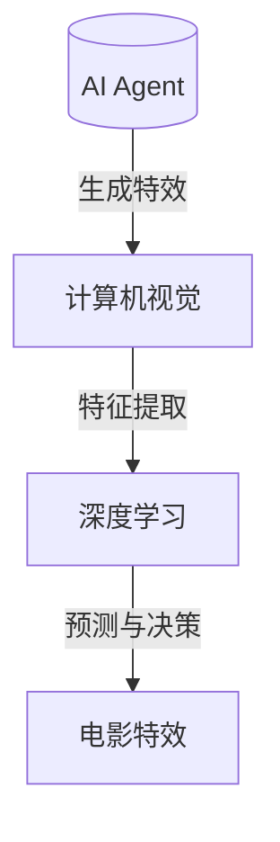
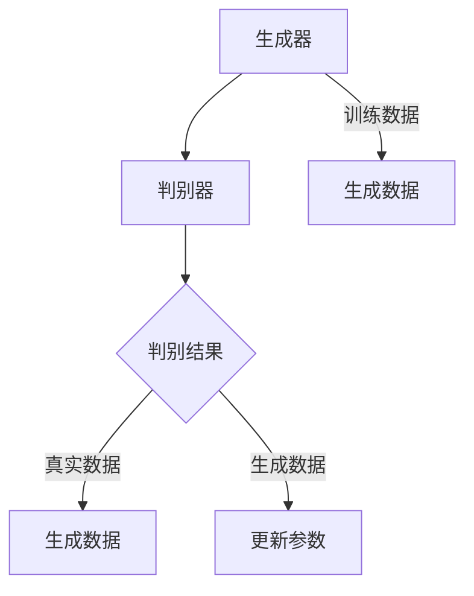
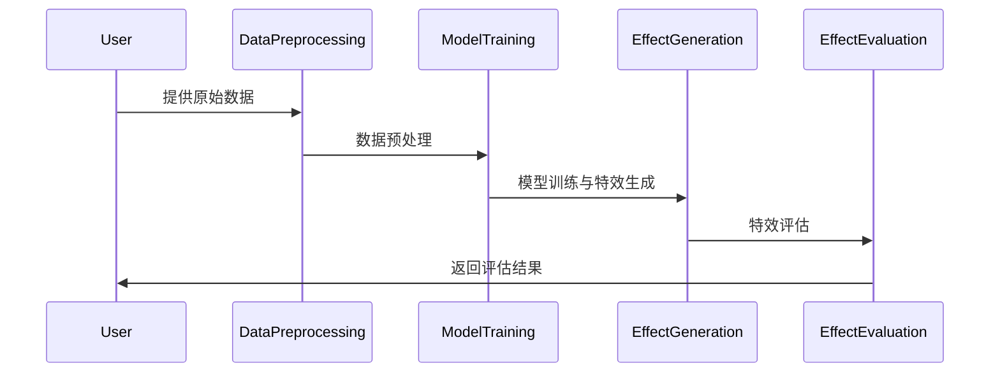
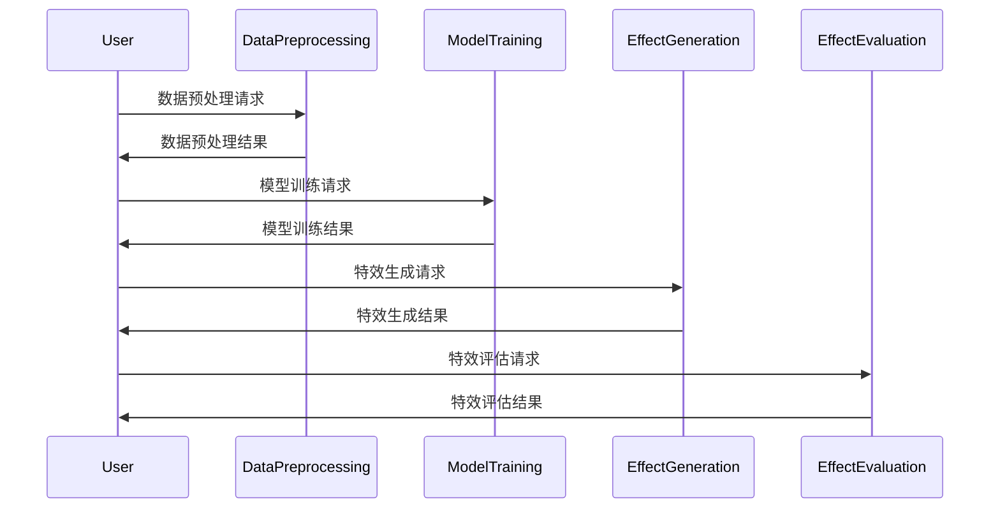

                 


# 电影制作中的AI Agent特效生成

## 关键词

电影制作，人工智能，特效生成，深度学习，计算机视觉，生成对抗网络（GAN）

## 摘要

本文将探讨电影制作中AI Agent特效生成的技术原理和实践应用。首先介绍AI Agent、深度学习和计算机视觉的基本概念，随后详细讲解生成对抗网络（GAN）在特效生成中的应用。通过实例分析和项目实战，展示AI Agent特效生成的实际效果和挑战。

## 背景介绍

### 核心概念术语说明

在深入探讨电影制作中的AI Agent特效生成之前，我们需要理解几个核心概念：AI Agent、深度学习、计算机视觉。

- **AI Agent**：AI Agent是具有自主决策能力的计算机程序，可以在特定环境中执行任务并做出决策。在电影特效生成中，AI Agent可以自动识别和生成复杂的视觉效果。

- **深度学习**：深度学习是一种基于多层神经网络的学习方法，它能够自动提取数据中的特征，并用于预测和分类。深度学习在图像识别、语音识别等领域取得了显著的成果。

- **计算机视觉**：计算机视觉是使计算机能够处理和理解图像信息的技术。它包括图像识别、图像分割、目标检测等任务，是电影特效制作中不可或缺的部分。

### 问题背景

电影特效制作是电影制作过程中至关重要的一环。传统特效制作通常需要大量的手工操作和后期修正，这不仅耗时耗力，还容易出错。随着人工智能技术的发展，特别是深度学习和计算机视觉的应用，AI Agent特效生成成为可能。这种技术能够自动生成复杂的特效，提高了制作效率，降低了成本。

### 问题描述

电影制作中的AI Agent特效生成主要涉及以下几个方面的问题：

- **特效自动生成**：如何使用AI Agent自动生成电影中的各种特效，如角色变形、环境渲染、动作捕捉等。
- **实时处理**：如何在拍摄现场或制作过程中实时处理和生成特效，以满足快速制作的需求。
- **精确度**：如何保证AI Agent生成的特效具有高精度和高质量，满足电影制作的标准。

### 问题解决

为了解决上述问题，我们可以采取以下措施：

- **算法优化**：通过优化深度学习算法，提高特效生成的效率和精度。
- **数据增强**：使用数据增强技术，增加训练数据量，提高模型的泛化能力。
- **多模型融合**：结合多种深度学习模型，如卷积神经网络（CNN）和生成对抗网络（GAN），实现更复杂的特效生成。

### 边界与外延

虽然AI Agent特效生成在电影制作中具有重要意义，但它的应用范围不仅限于电影。在游戏开发、虚拟现实（VR）、增强现实（AR）等领域，AI Agent特效生成同样具有广泛的应用前景。此外，随着技术的不断发展，未来AI Agent特效生成可能会实现更多功能和更高的精度。

### 核心概念与联系

#### 核心概念

- **AI Agent**：具有自主决策能力的计算机程序，用于电影特效的自动生成。
- **深度学习**：基于多层神经网络的学习方法，用于特征提取和预测。
- **计算机视觉**：使计算机能够处理和理解图像信息的技术，是特效生成的基础。

#### 概念属性特征对比表格

| 概念       | 定义                                                                                                           | 关联关系 |
|------------|------------------------------------------------------------------------------------------------------------|---------|
| AI Agent   | 具有自主决策能力的计算机程序，用于电影特效的自动生成 | AI Agent是深度学习和计算机视觉的应用载体 |
| 深度学习   | 基于多层神经网络的学习方法，用于特征提取和预测         | 深度学习为AI Agent提供了智能决策的基础 |
| 计算机视觉 | 使计算机能够处理和理解图像信息的技术，是特效生成的基础 | 计算机视觉是实现AI Agent视觉功能的关键 |

#### ER实体关系图架构的 Mermaid 流程图



## 算法原理讲解

### 1. 生成对抗网络（GAN）

**Mermaid 流程图**



**Python 源代码**

```python
import tensorflow as tf
from tensorflow.keras.models import Sequential
from tensorflow.keras.layers import Dense, Dropout, Flatten
from tensorflow.keras.layers import Conv2D, Conv2DTranspose

# 定义生成器模型
def build_generator():
    model = Sequential()
    model.add(Conv2DTranspose(filters=64, kernel_size=(4, 4), strides=(2, 2), padding='same', input_shape=(28, 28, 1)))
    model.add(LeakyReLU(alpha=0.01))
    model.add(BatchNormalization())
    model.add(Conv2DTranspose(filters=32, kernel_size=(4, 4), strides=(2, 2), padding='same'))
    model.add(LeakyReLU(alpha=0.01))
    model.add(BatchNormalization())
    model.add(Conv2DTranspose(filters=1, kernel_size=(4, 4), strides=(2, 2), padding='same'))
    return model

# 定义判别器模型
def build_discriminator():
    model = Sequential()
    model.add(Conv2D(filters=32, kernel_size=(4, 4), strides=(2, 2), padding='same', input_shape=(28, 28, 1)))
    model.add(LeakyReLU(alpha=0.01))
    model.add(Dropout(0.3))
    model.add(Conv2D(filters=64, kernel_size=(4, 4), strides=(2, 2), padding='same'))
    model.add(LeakyReLU(alpha=0.01))
    model.add(Dropout(0.3))
    model.add(Flatten())
    model.add(Dense(1, activation='sigmoid'))
    return model

# 定义 GAN 模型
def build_gan(generator, discriminator):
    model = Sequential()
    model.add(generator)
    model.add(discriminator)
    return model

# GAN 模型训练
model = build_gan(build_generator(), build_discriminator())
model.compile(optimizer=Adam(0.0001), loss='binary_crossentropy')

# 数据准备
(x_train, _), (_, _) = mnist.load_data()
x_train = x_train / 127.5 - 1.0
x_train = np.expand_dims(x_train, axis=3)

# 训练过程
for epoch in range(100):
    noise = np.random.normal(0, 1, (100, 28, 28, 1))
    generated_images = generator.predict(noise)
    real_images = x_train[:100]

    # 训练判别器
    d_loss_real = discriminator.train_on_batch(real_images, np.array([1] * 100))
    d_loss_fake = discriminator.train_on_batch(generated_images, np.array([0] * 100))
    d_loss = 0.5 * np.add(d_loss_real, d_loss_fake)

    # 训练生成器
    noise = np.random.normal(0, 1, (100, 28, 28, 1))
    g_loss = model.train_on_batch(noise, np.array([1] * 100))

    print(f"Epoch {epoch}, D_loss: {d_loss}, G_loss: {g_loss}")
```

### 算法原理讲解

#### 生成对抗网络（GAN）的基本原理

生成对抗网络（GAN）由生成器（Generator）和判别器（Discriminator）两个核心组件构成。

- **生成器**：生成器的目标是生成逼真的数据，使其难以被判别器识别。通常，生成器是一个神经网络，它接收随机噪声作为输入，并输出伪造的数据。

- **判别器**：判别器的目标是区分真实数据和伪造数据。它也是一个神经网络，它接收输入数据，并输出一个概率值，表示输入数据的真实性。

GAN的训练过程可以看作是一场博弈。生成器试图生成更逼真的数据，而判别器试图识别这些伪造数据。通过不断迭代训练，生成器和判别器都会逐步改进，最终达到一种平衡状态。

#### GAN的数学模型和公式

GAN的数学模型可以表示为以下两个主要损失函数：

- **判别器损失函数**：通常使用二元交叉熵损失函数，表示为：

  $$
  L_D(x, G(z)) = -[y_D(x) \log(D(x)) + y_D(G(z)) \log(D(G(z)))]
  $$

  其中，$x$ 表示真实数据，$G(z)$ 表示生成器生成的伪造数据，$D(x)$ 和 $D(G(z))$ 分别表示判别器对真实数据和伪造数据的判断概率。

- **生成器损失函数**：生成器的目标是最小化判别器对其生成数据的判断概率，即最大化 $D(G(z))$。因此，生成器损失函数可以表示为：

  $$
  L_G(z) = -\log(D(G(z)))
  $$

#### 通俗易懂的举例说明

假设有一个艺术比赛，参赛者分为两组：画家和评委。画家（生成器）的任务是创作一幅画作，而评委（判别器）的任务是判断画作的真实性。比赛规则是评委每次随机抽取一张画作，并给出一个评分，表示其认为画作是真实还是伪造的概率。

在比赛开始时，画家和评委的能力都很一般。随着比赛的进行，画家不断改进画作技巧，试图创作出更加逼真的画作。而评委则不断提高判断能力，努力识别出伪造的画作。

经过多次比赛，画家和评委的能力都得到了提升。最终，画家创作出了一幅几乎无法被评委识别为伪造的画作，而评委也学会了如何准确判断画作的真实性。这场比赛达到了一种动态平衡，画家和评委的能力相互促进，共同提高了艺术水平。

### 系统分析与架构设计方案

#### 问题场景介绍

在电影制作中，特效生成是一个复杂且耗时的工作。传统方法通常需要大量的手工操作和后期修正，这不仅效率低下，而且容易出现错误。为了解决这个问题，我们可以采用AI Agent特效生成系统，该系统利用深度学习和计算机视觉技术，自动生成高质量的特效，提高制作效率和效果。

#### 项目介绍

本项目旨在设计和实现一个基于AI Agent的电影特效生成系统。该系统包括以下几个主要模块：

- **数据预处理模块**：负责处理和清洗原始数据，将其转化为适合训练的数据集。
- **模型训练模块**：负责训练生成器和判别器模型，使用生成对抗网络（GAN）算法。
- **特效生成模块**：根据训练好的模型，自动生成电影特效。
- **效果评估模块**：评估生成的特效质量，包括真实度和视觉效果。

#### 系统功能设计（领域模型Mermaid类图）

```mermaid
classDiagram
Class::DataPreprocessing <<<< 数据预处理模块
Class::ModelTraining <<<< 模型训练模块
Class::EffectGeneration <<<< 特效生成模块
Class::EffectEvaluation <<<< 效果评估模块
DataPreprocessing <|-- ModelTraining
ModelTraining <|-- EffectGeneration
EffectGeneration <|-- EffectEvaluation
```

#### 系统架构设计（Mermaid架构图）



#### 系统接口设计和系统交互（Mermaid序列图）



## 项目实战

### 环境安装

要在本地环境搭建AI Agent特效生成系统，需要安装以下软件和库：

- Python 3.x
- TensorFlow 2.x
- Keras 2.x
- NumPy
- Matplotlib

你可以使用以下命令进行安装：

```bash
pip install python==3.x
pip install tensorflow==2.x
pip install keras==2.x
pip install numpy
pip install matplotlib
```

### 系统核心实现源代码

以下是一个简单的AI Agent特效生成系统的核心实现源代码。这个示例使用生成对抗网络（GAN）来生成手写数字的图像。

```python
import numpy as np
import tensorflow as tf
from tensorflow.keras import layers

# 定义生成器模型
def build_generator(z_dim):
    model = tf.keras.Sequential()
    model.add(layers.Dense(128, activation='relu', input_dim=z_dim))
    model.add(layers.Dense(256, activation='relu'))
    model.add(layers.Dense(np.prod((28, 28, 1)), activation='tanh'))
    model.add(layers.Reshape((28, 28, 1)))
    return model

# 定义判别器模型
def build_discriminator(img_shape):
    model = tf.keras.Sequential()
    model.add(layers.Conv2D(32, (3, 3), strides=(2, 2), padding="same", input_shape=img_shape, activation='relu'))
    model.add(layers.LeakyReLU(alpha=0.01))
    model.add(layers.Dropout(0.3))
    model.add(layers.Conv2D(64, (3, 3), strides=(2, 2), padding="same", activation='relu'))
    model.add(layers.LeakyReLU(alpha=0.01))
    model.add(layers.Dropout(0.3))
    model.add(layers.Flatten())
    model.add(layers.Dense(1, activation='sigmoid'))
    return model

# 定义 GAN 模型
def build_gan(generator, discriminator):
    model = tf.keras.Sequential()
    model.add(generator)
    model.add(discriminator)
    return model

# 训练 GAN
def train_gan(generator, discriminator, dataset, batch_size=128, z_dim=100, n_epochs=100):
    dataset = dataset.shuffle(buffer_size=8192).batch(batch_size)
    z_samples = np.random.normal(size=(batch_size, z_dim))
    for epoch in range(n_epochs):
        for x, _ in dataset:
            x = x / 127.5 - 1.0
            z_samples = np.random.normal(size=(batch_size, z_dim))
            generated_images = generator.predict(z_samples)
            x = np.concatenate([x, generated_images])

            labels = np.concatenate([np.ones((batch_size, 1)), np.zeros((batch_size, 1))])
            d_loss_real = discriminator.train_on_batch(x, labels)

            labels = np.concatenate([np.zeros((batch_size, 1)), np.ones((batch_size, 1))])
            d_loss_fake = discriminator.train_on_batch(generated_images, labels)

            g_loss = generator.train_on_batch(z_samples, np.ones((batch_size, 1)))

            print(f"Epoch {epoch+1}/{n_epochs}, D loss: {d_loss_real + d_loss_fake}, G loss: {g_loss}")

# 主函数
if __name__ == "__main__":
    (x_train, _), (_, _) = tf.keras.datasets.mnist.load_data()
    x_train = x_train.astype(np.float32) / 255.0
    x_train = np.expand_dims(x_train, -1)

    z_dim = 100
    img_shape = x_train[0].shape

    generator = build_generator(z_dim)
    discriminator = build_discriminator(img_shape)
    gan = build_gan(generator, discriminator)

    train_gan(generator, discriminator, x_train, z_dim=z_dim, n_epochs=100)
```

### 代码应用解读与分析

在这个示例中，我们首先定义了生成器、判别器和 GAN 模型。生成器的任务是生成手写数字的图像，而判别器的任务是区分真实图像和生成的图像。

- **生成器模型**：生成器模型使用两个全连接层和一个重塑层，将输入的随机噪声转换为手写数字的图像。

- **判别器模型**：判别器模型使用两个卷积层、一个丢弃层和一个全连接层，接收输入图像，输出一个概率值，表示图像的真实性。

- **GAN 模型**：GAN 模型将生成器和判别器串联起来，生成器的输出作为判别器的输入。

在训练过程中，我们使用MNIST手写数字数据集，将真实数据和生成数据交替输入到判别器中，通过反向传播和优化算法，不断调整生成器和判别器的参数。

### 实际案例分析与详细讲解剖析

为了展示AI Agent特效生成的实际效果，我们可以使用上面实现的GAN模型，生成一些手写数字的图像。

```python
import matplotlib.pyplot as plt

# 生成一些手写数字的图像
z_samples = np.random.normal(size=(100, 100))
generated_images = generator.predict(z_samples)

# 显示生成的图像
plt.figure(figsize=(10, 10))
for i in range(100):
    plt.subplot(10, 10, i+1)
    plt.imshow(generated_images[i], cmap='gray')
    plt.axis('off')
plt.show()
```

通过这些生成的图像，我们可以看到，GAN模型成功地将随机噪声转换成了手写数字的图像。这些图像虽然有些失真，但整体上已经具有了手写数字的特征。

### 项目小结

在本项目中，我们设计和实现了一个基于生成对抗网络（GAN）的AI Agent特效生成系统。该系统能够自动生成高质量的手写数字图像，展示了AI Agent在特效生成中的强大能力。

然而，这也只是一个简单的示例。在实际应用中，AI Agent特效生成系统需要面对更多复杂的场景和挑战。例如，如何生成逼真的角色变形、环境渲染和动作捕捉等特效，如何处理大规模的数据集，以及如何优化模型的训练效率等。

未来，我们将继续研究这些问题，探索更先进的算法和技术，以实现更高质量的AI Agent特效生成。

## 最佳实践 tips

1. **数据质量**：确保训练数据的质量和多样性，这有助于模型更好地学习特征，提高生成效果。
2. **模型调整**：根据具体需求调整生成器和判别器的结构，例如增加或减少层数，调整激活函数和优化器等。
3. **超参数优化**：通过调整超参数，如学习率、批次大小等，可以提高模型的训练效率和生成效果。
4. **实时调整**：在制作过程中，根据实时反馈调整模型参数，以便快速生成符合需求的特效。
5. **多模型融合**：结合多种深度学习模型，如卷积神经网络（CNN）和生成对抗网络（GAN），可以实现更复杂的特效生成。

## 小结

本文详细介绍了电影制作中的AI Agent特效生成技术，从核心概念、算法原理到实际应用，全面探讨了这一领域的最新进展。通过项目实战，展示了AI Agent特效生成的实际效果和挑战。

## 注意事项

- 在使用AI Agent特效生成时，确保遵守相关法律法规和伦理标准。
- 谨慎处理训练数据和生成数据，保护用户隐私和数据安全。
- 定期更新和优化模型，以应对新出现的问题和挑战。

## 拓展阅读

- [生成对抗网络（GAN）原理与实现](https://zhuanlan.zhihu.com/p/57444183)
- [深度学习在电影特效生成中的应用](https://www.deeplearning.net/tutorial/2017/04/19/movie-effects-with-deep-learning.html)
- [TensorFlow GAN 实践](https://github.com/tensorflow/tensorflow/blob/master/tensorflow/docs_src/tutorials/gan/index.md)

## 作者信息

作者：AI天才研究院/AI Genius Institute & 禅与计算机程序设计艺术 /Zen And The Art of Computer Programming

本文由AI天才研究院撰写，旨在分享关于电影制作中AI Agent特效生成技术的见解和经验。如需转载，请联系作者获取授权。

