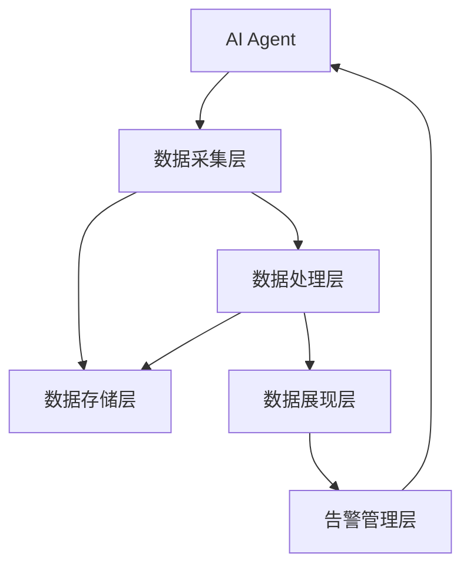

                 

### 第一部分: 监控与日志概述

#### 第1章: 监控与日志的基本概念

在现代信息技术环境中，**监控**与**日志**是两个至关重要的概念，它们为系统管理和维护提供了关键的数据支撑。本章节将深入探讨这两个概念的基本定义、内涵及其相互关系。

##### 1.1 监控的概念

**监控**是指对系统、网络、应用程序或其他技术组件进行持续、实时或定期监视的过程。其目的是确保系统在运行时保持健康状态，及时发现和响应异常情况。监控的主要目标是提高系统的可用性和可靠性，通过主动检测和预防潜在问题，降低系统故障率和维护成本。

**监控的关键特性**包括：

- **实时性**：监控系统需要能够及时响应系统状态的变化，从而快速发现异常。
- **准确性**：监控数据需要准确无误，以便正确评估系统性能。
- **全面性**：监控系统应覆盖系统的各个方面，包括硬件、网络、应用程序等。

##### 1.2 日志的概念

**日志**是指记录系统运行过程中发生的所有事件的文档。日志通常包括时间戳、事件类型、事件描述、相关数据等信息。日志是系统管理和故障排查的重要工具，通过分析日志数据，可以深入了解系统运行状况，定位问题根源，并为系统优化提供依据。

**日志的关键特性**包括：

- **可追溯性**：日志记录了系统运行的所有事件，便于事后追溯和复现。
- **持久性**：日志通常被保存一段时间，以便在需要时进行查询和分析。
- **完整性**：日志数据应完整记录，避免丢失或篡改。

##### 1.3 监控与日志的关系

监控与日志密切相关，两者共同构成了系统管理的核心框架。监控通过实时收集系统数据，生成日志记录；而日志则提供了监控数据的持久化存储和分析基础。

**监控与日志的关系**包括：

- **数据来源**：监控是日志数据的主要来源，监控工具采集的数据会被转换为日志条目。
- **数据分析**：日志数据是进行系统性能分析和故障排查的重要资源，通过日志分析，可以更深入地了解监控数据的含义和系统行为。
- **协同作用**：监控和日志相互补充，监控提供实时性，日志提供持久性和历史数据，共同保障系统的稳定运行和问题排查。

在了解了监控与日志的基本概念和关系之后，我们将在后续章节中进一步探讨监控与日志的体系结构、常见工具和技术，以及AI Agent监控与日志的核心概念和实践应用。

---

#### 第2章: 监控与日志的体系结构

在本章节中，我们将深入探讨监控与日志的体系结构，介绍它们的基本组成部分及其相互作用，从而为读者提供一个全面的理解。

##### 2.1 监控体系结构

监控体系结构通常包括数据采集层、数据处理层、监控展现层和报警层。

**数据采集层**：这是监控体系结构的基础，负责从各种系统组件中收集数据。数据采集可以通过Agent、API调用、SNMP（简单网络管理协议）等方式实现。常见的数据采集工具包括Prometheus、Zabbix等。

**数据处理层**：该层对采集到的数据进行分析、处理和存储。数据处理包括数据清洗、聚合、告警规则定义等。常见的数据处理工具包括Grafana、Kibana等。

**监控展现层**：通过图表、仪表板等形式将处理后的监控数据展示给用户。Grafana、Kibana等工具提供了丰富的可视化功能，可以帮助用户快速了解系统状态。

**报警层**：当监控到系统异常时，报警层会触发告警通知。告警可以通过邮件、短信、电话等方式发送给相关人员。常见告警工具包括Alertmanager、PagerDuty等。

##### 2.2 日志体系结构

日志体系结构通常包括日志生成层、日志存储层、日志查询层和日志分析层。

**日志生成层**：这是日志体系结构的起点，由系统组件自动生成日志文件。日志生成可以是结构化日志（如JSON格式）或非结构化日志（如文本格式）。

**日志存储层**：该层负责存储日志文件，可以是文件系统、数据库或云存储服务。常见日志存储工具包括ELK（Elasticsearch、Logstash、Kibana）栈、AWS CloudWatch等。

**日志查询层**：通过日志查询工具，用户可以检索和查询日志文件。常见日志查询工具包括Logstash、Grok、Gotoh等。

**日志分析层**：该层对日志数据进行分析，提取有用的信息，为故障排查、性能优化等提供支持。常见日志分析工具包括Grok、Splunk、Kibana等。

##### 2.3 AI Agent监控与日志的整合

在AI领域，AI Agent的监控与日志整合是一个关键课题。AI Agent是指能够自主执行任务的智能实体，其运行状态需要通过监控和日志进行细致跟踪。

**AI Agent监控与日志整合的关键步骤**包括：

1. **监控数据采集**：AI Agent通过内置的监控模块收集运行状态数据，如资源消耗、任务执行时间等。
2. **日志数据记录**：AI Agent运行过程中生成的事件和异常信息被记录为日志文件。
3. **数据同步**：监控数据和日志数据通过统一的存储和管理平台进行同步，以便进行综合分析。
4. **数据分析与告警**：结合监控数据和日志数据，进行综合分析，及时发现异常并触发告警。

通过整合监控与日志，我们可以实现对AI Agent运行状态的全面监控和实时分析，从而提高AI系统的稳定性和可靠性。

在本章节的讨论中，我们不仅了解了监控与日志的基本体系结构，还探讨了AI Agent监控与日志整合的关键步骤。这些知识为后续章节的深入探讨奠定了基础。

---

#### 第3章: 监控与日志的常见工具和技术

在现代化IT环境中，监控与日志工具的选择对系统管理和维护至关重要。本章节将介绍一些常见的监控和日志工具，分析它们的特点和适用场景，并讨论AI Agent监控与日志技术的应用。

##### 3.1 常见监控工具介绍

**Prometheus**：
- **特点**：开源监控解决方案，具有强大的数据采集和告警功能。
- **适用场景**：适用于大规模分布式系统，尤其是微服务架构。
- **使用方法**：通过Prometheus服务器和Exporter进行数据采集，使用Grafana进行数据可视化。

**Zabbix**：
- **特点**：开源监控和告警工具，支持多种数据源和数据类型。
- **适用场景**：适用于各种规模的企业级IT系统。
- **使用方法**：通过Zabbix Agent收集系统数据，使用Zabbix Web界面进行监控配置和告警管理。

**Nagios**：
- **特点**：历史悠久的开源监控工具，支持插件扩展。
- **适用场景**：适用于中小型企业，尤其是需要复杂监控规则的场景。
- **使用方法**：通过插件进行系统监控，使用Nagios Core进行配置和告警。

**Grafana**：
- **特点**：开源数据可视化和监控工具，支持多种数据源。
- **适用场景**：用于监控数据的实时展示和仪表板构建。
- **使用方法**：导入数据源，配置仪表板和告警规则。

##### 3.2 常见日志工具介绍

**ELK Stack**：
- **特点**：由Elasticsearch、Logstash和Kibana组成的开源日志分析平台。
- **适用场景**：适用于大规模日志数据的收集、存储和分析。
- **使用方法**：使用Logstash进行日志数据收集和解析，使用Elasticsearch进行存储和搜索，使用Kibana进行日志数据分析。

**AWS CloudWatch**：
- **特点**：AWS提供的云原生监控和日志服务。
- **适用场景**：适用于AWS云环境中的应用程序和资源监控。
- **使用方法**：通过CloudWatch Logs收集日志数据，使用CloudWatch Dashboards进行日志数据可视化。

**Splunk**：
- **特点**：商业日志分析平台，支持复杂的搜索和数据处理。
- **适用场景**：适用于需要高级日志分析和数据挖掘的企业。
- **使用方法**：通过Splunk Enterprise收集和存储日志数据，使用Splunk Web进行数据分析和报告生成。

##### 3.3 AI Agent监控与日志技术的应用

在AI领域，AI Agent的监控与日志技术至关重要，它能够帮助开发者实时跟踪AI Agent的运行状态，快速定位问题并提供优化建议。

**AI Agent监控技术**：
- **性能监控**：通过采集CPU、内存、磁盘等系统资源使用情况，实时监控AI Agent的资源消耗。
- **任务监控**：监控AI Agent的任务执行情况，包括任务进度、执行时间和错误日志。
- **健康监控**：定期检查AI Agent的运行状态，包括服务可用性、连接状态等。

**AI Agent日志技术**：
- **日志生成**：AI Agent在执行任务时生成日志，记录执行过程中的关键信息。
- **日志收集**：使用日志收集工具（如Logstash）将AI Agent的日志传输到中央日志存储。
- **日志分析**：使用日志分析工具（如ELK Stack、Splunk）对日志数据进行解析和分析，提取有价值的信息。

通过整合监控与日志技术，开发者可以实现对AI Agent的全方位监控，确保AI系统的稳定运行和高效管理。

在本章节中，我们介绍了常见的监控与日志工具，并探讨了AI Agent监控与日志技术的应用。这些工具和技术为构建全面的监控系统提供了坚实的基础，为后续章节的深入讨论奠定了基础。

---

#### 第4章: 跟踪AI Agent运行状态的核心概念

在AI领域，AI Agent的运行状态监控是确保其高效运行和稳定性的关键。本章将深入探讨AI Agent运行状态的核心概念，包括AI Agent运行状态的概述、关键性能指标（KPI）以及监控数据的采集与分析方法。

##### 4.1 AI Agent运行状态的概述

AI Agent是指能够自主执行任务、具有智能决策能力的软件实体。它们通常在复杂的、动态的环境中运行，需要具备自适应能力和实时响应能力。AI Agent的运行状态包括多个方面，如资源消耗、任务执行进度、健康状态等。

**AI Agent运行状态的关键特性**：

- **实时性**：AI Agent需要实时收集和处理环境信息，以快速响应环境变化。
- **适应性**：AI Agent应根据环境变化调整其行为和决策策略，保持高效运行。
- **自主性**：AI Agent能够自主执行任务，无需人工干预。

##### 4.2 关键性能指标（KPI）

关键性能指标（KPI）是评估AI Agent运行状态的重要工具。以下是一些常见的KPI：

- **资源利用率**：包括CPU利用率、内存利用率、磁盘利用率等。高资源利用率可能导致系统性能下降，需要及时调整。
- **任务执行时间**：AI Agent完成任务所需的时间，是评估其效率的重要指标。过长的执行时间可能意味着算法效率低或资源不足。
- **错误率**：AI Agent在执行任务过程中出现的错误次数，反映了系统的可靠性和稳定性。
- **响应时间**：AI Agent对环境变化或指令的响应时间，是衡量其实时性和响应能力的关键指标。

**KPI的设置与监测**：

- **设置**：根据AI Agent的具体任务和运行环境，制定合理的KPI指标。
- **监测**：通过监控工具实时收集KPI数据，并进行可视化展示，以便快速发现和解决问题。

##### 4.3 监控数据的采集与分析

监控数据的采集与分析是AI Agent运行状态监控的核心环节。以下方法用于监控数据的采集与分析：

**数据采集方法**：

- **Agent采集**：在AI Agent中集成监控模块，实时收集系统资源使用情况和任务执行数据。
- **API采集**：通过调用系统API获取监控数据，适用于远程监控。
- **系统内置监控工具**：如Prometheus、Zabbix等，这些工具可以定期收集系统级监控数据。

**数据采集示例**：

假设使用Python编写AI Agent，可以集成以下代码段进行资源使用情况的监控：

```python
import psutil

def collect_system_resources():
    cpu_usage = psutil.cpu_percent()
    memory_usage = psutil.virtual_memory().percent
    disk_usage = psutil.disk_usage('/').percent
    return cpu_usage, memory_usage, disk_usage

# 定时采集监控数据
import time

while True:
    cpu_usage, memory_usage, disk_usage = collect_system_resources()
    print(f"CPU Usage: {cpu_usage}%, Memory Usage: {memory_usage}%, Disk Usage: {disk_usage}%")
    time.sleep(60)
```

**数据分析方法**：

- **日志分析**：通过日志分析工具（如ELK Stack、Splunk）对日志数据进行解析和分析，提取有价值的信息。
- **数据可视化**：使用Grafana、Kibana等工具将监控数据可视化，便于实时监控和问题排查。

**数据分析示例**：

使用Grafana创建仪表板，可视化CPU、内存、磁盘等监控数据，可以通过以下步骤实现：

1. 导入监控数据源。
2. 配置数据源连接和监控指标。
3. 添加面板，选择合适的图表类型（如折线图、柱状图）。
4. 设置告警规则，当监控指标超过阈值时自动触发告警。

通过以上方法，我们可以实现对AI Agent运行状态的全面监控和分析，及时发现和解决问题，确保AI系统的稳定运行。

在本章节中，我们详细介绍了AI Agent运行状态的核心概念、关键性能指标和监控数据的采集与分析方法。这些知识为后续章节的实践应用和深入讨论提供了基础。

---

#### 第5章: AI Agent监控与日志的核心算法

在AI领域，AI Agent的监控与日志分析不仅依赖于工具和技术，还涉及到一系列核心算法。本章将深入探讨这些核心算法，包括监控算法、日志分析算法和AI Agent异常检测算法。

##### 5.1 监控算法概述

监控算法是用于实时监测AI Agent运行状态的一系列技术方法。这些算法的核心目的是识别系统中的异常情况，并确保系统能够及时响应和纠正。

**监控算法的基本类型**：

- **阈值监控算法**：通过设定特定阈值来监控系统性能指标。当某个指标超过阈值时，算法会触发告警。例如，CPU利用率超过90%时触发告警。
- **异常检测算法**：通过分析系统数据的分布和变化趋势，识别潜在的异常情况。常见的方法包括统计学方法（如标准差分析）、机器学习方法（如孤立森林、孤立树）等。

**阈值监控算法示例**：

阈值监控算法的基本步骤如下：

1. **定义阈值**：根据系统需求和经验数据，设定合理的阈值。
2. **数据采集**：定期采集系统性能指标数据。
3. **阈值判断**：将采集到的数据与阈值进行比较。
4. **告警触发**：当指标超过阈值时，触发告警通知。

```python
# 示例代码：阈值监控算法
import psutil

def check_thresholds():
    cpu_usage = psutil.cpu_percent()
    memory_usage = psutil.virtual_memory().percent
    disk_usage = psutil.disk_usage('/').percent
    
    thresholds = {'cpu': 90, 'memory': 85, 'disk': 90}
    
    for resource, value in thresholds.items():
        if locals()[resource] > value:
            print(f"{resource.capitalize()} usage exceeded threshold. Current usage: {locals()[resource]}%")

# 运行监控算法
check_thresholds()
```

##### 5.2 日志分析算法

日志分析算法用于从大量日志数据中提取有价值的信息，帮助开发者了解系统运行状况、定位问题和优化系统性能。

**日志分析算法的基本类型**：

- **模式识别算法**：通过识别日志中的特定模式或异常模式，发现潜在的问题。例如，使用正则表达式匹配日志中的错误信息。
- **聚类算法**：将相似的日志数据分组，用于识别日志中的异常行为。例如，使用K-means算法对日志数据点进行聚类。

**模式识别算法示例**：

模式识别算法的基本步骤如下：

1. **日志预处理**：清洗和格式化日志数据，确保数据的完整性和一致性。
2. **模式匹配**：使用正则表达式或其他匹配工具，从日志中提取关键信息。
3. **结果分析**：分析匹配结果，识别异常或潜在问题。

```python
import re

def log_pattern_matching(log_data):
    pattern = r"ERROR (.+)"
    matches = re.findall(pattern, log_data)
    return matches

# 示例日志数据
log_data = "INFO: System startup completed. ERROR: Failed to initialize database. DEBUG: Starting background tasks."

# 模式匹配
error_messages = log_pattern_matching(log_data)
print("Error messages found:", error_messages)
```

##### 5.3 AI Agent异常检测算法

AI Agent异常检测算法是用于实时监控AI Agent运行状态、识别异常行为并采取相应措施的算法。这些算法通常结合了机器学习技术和统计分析方法。

**AI Agent异常检测算法的基本类型**：

- **基于统计的方法**：使用统计学模型（如高斯分布、聚类分析）检测异常行为。
- **基于机器学习的方法**：使用监督学习模型（如决策树、支持向量机）训练异常检测模型。

**基于统计的异常检测算法示例**：

基于统计的异常检测算法的基本步骤如下：

1. **数据收集**：收集AI Agent的运行数据。
2. **特征提取**：从运行数据中提取关键特征。
3. **模型训练**：使用统计模型训练异常检测模型。
4. **异常检测**：将实时数据输入模型，判断是否为异常行为。

```python
import numpy as np
from sklearn.covariance import EllipticEnvelope

def detect_anomalies(data, threshold=3):
    model = EllipticEnvelope(contamination=0.1)
    model.fit(data)
    outliers = model.predict(data)
    anomalies = np.where(outliers == -1)
    return anomalies

# 示例数据
data = np.array([[1, 2], [2, 3], [3, 4], [100, 101]])

# 检测异常
anomalies = detect_anomalies(data)
print("Anomalies detected at indices:", anomalies)
```

通过上述算法，我们可以实现对AI Agent运行状态的实时监控和异常检测。这些算法不仅提高了AI系统的稳定性和可靠性，还为开发者提供了有力的工具，帮助他们快速定位和解决问题。

在本章节中，我们介绍了监控算法、日志分析算法和AI Agent异常检测算法的基本原理和示例应用。这些算法为AI Agent的监控与日志分析提供了坚实的理论基础和实践指导。

---

### 第6章: AI Agent监控与日志的系统设计与实现

为了确保AI Agent的稳定运行和高效管理，需要设计并实现一套全面的监控系统。本章将详细介绍AI Agent监控与日志系统的设计与实现过程，包括系统需求分析、架构设计、接口设计和实现方法。

##### 6.1 系统需求分析

在设计和实现AI Agent监控系统之前，首先需要进行系统需求分析，明确系统的功能要求和性能指标。以下是AI Agent监控系统的主要需求：

- **实时监控**：系统能够实时收集AI Agent的运行数据，包括CPU利用率、内存占用、任务执行时间等。
- **日志记录**：系统应具备日志记录功能，能够捕获AI Agent运行过程中发生的所有事件和异常。
- **异常检测**：系统能够自动检测AI Agent的异常行为，并在发现异常时及时通知相关人员。
- **数据可视化**：系统能够将监控数据以图表和仪表板的形式可视化展示，便于快速分析和理解系统状态。
- **告警管理**：系统能够配置告警规则，当监控指标超过阈值时自动发送告警通知。

##### 6.2 系统架构设计

AI Agent监控与日志系统的架构设计需要综合考虑性能、可扩展性和易用性。以下是一个典型的系统架构设计：

1. **数据采集层**：该层由AI Agent内置的监控模块组成，负责实时收集系统资源使用情况和任务执行数据。
2. **数据存储层**：该层使用分布式存储系统（如Elasticsearch、Kibana）存储日志数据和监控数据。
3. **数据处理层**：该层对采集到的数据进行预处理、分析和存储，包括日志解析、指标计算和异常检测等。
4. **数据展现层**：该层通过可视化工具（如Grafana、Kibana）将监控数据以图表和仪表板的形式展示给用户。
5. **告警管理层**：该层负责配置告警规则，当监控指标超过阈值时自动发送告警通知。

以下是系统架构的Mermaid流程图：



##### 6.3 系统接口设计

系统接口设计是确保各层之间数据流转和功能调用顺畅的关键。以下是主要接口设计：

- **AI Agent监控接口**：用于AI Agent与监控系统之间的数据通信，包括实时数据上报、日志上传等。
- **日志上传接口**：用于将AI Agent的日志数据上传到日志存储系统。
- **监控数据API**：用于其他系统或工具访问监控数据，进行进一步分析和处理。
- **告警通知接口**：用于发送告警通知，包括邮件、短信、Webhook等。

以下是系统接口的Mermaid类图：

```mermaid
classDiagram
    AI_Agent <<Interface>> Monitor_Interface
    AI_Agent <<Interface>> LogUploader
    Monitor_System <<Interface>> DataAPI
    Monitor_System <<Interface>> AlertNotifier

    class AI_Agent {
        +Monitor_Interface monitorInterface
        +LogUploader logUploader
    }

    class Monitor_System {
        +DataAPI dataAPI
        +AlertNotifier alertNotifier
    }

    AI_Agent --|> Monitor_System : 继承
    LogUploader --|> Monitor_System : 继承
```

##### 6.4 系统实现方法

基于上述需求和架构设计，我们可以按照以下步骤实现AI Agent监控系统：

1. **AI Agent端**：在AI Agent中集成监控模块，使用Python等编程语言实现监控接口和日志上传接口。
2. **监控系统端**：搭建日志存储系统和可视化工具，配置监控告警规则，实现数据存储、处理和展现功能。
3. **接口实现**：使用REST API或其他通信协议实现AI Agent与监控系统的数据交互。
4. **集成与测试**：将AI Agent与监控系统进行集成，进行功能测试和性能测试，确保系统稳定运行。

通过以上步骤，我们可以实现一个功能完善、性能优越的AI Agent监控系统，为AI系统的稳定运行和高效管理提供有力支持。

在本章节中，我们详细介绍了AI Agent监控与日志系统的设计与实现过程，包括需求分析、架构设计、接口设计和实现方法。这些内容为构建高效、稳定的监控系统提供了实践指导。

---

### 第7章: AI Agent监控与日志的实战案例

在本章中，我们将通过一个具体的实战案例来展示如何搭建AI Agent监控与日志系统。这个案例将涵盖环境搭建、AI Agent运行状态的监控实现、日志分析以及实际应用案例。

#### 7.1 监控与日志环境的搭建

为了搭建AI Agent监控与日志系统，我们需要准备以下工具和软件：

- **操作系统**：Linux操作系统（例如Ubuntu 20.04）
- **监控工具**：Prometheus + Grafana
- **日志收集工具**：Fluentd + Elasticsearch + Kibana
- **AI Agent**：一个简单的Python AI Agent示例

**环境搭建步骤**：

1. **安装Linux操作系统**：在服务器上安装Linux操作系统。
2. **安装Prometheus**：
   - 安装依赖：
     ```
     sudo apt-get update
     sudo apt-get install -y curl wget unzip
     ```
   - 下载并解压Prometheus：
     ```
     wget https://github.com/prometheus/prometheus/releases/download/v2.36.0/prometheus-2.36.0.linux-amd64.tar.gz
     tar -xzvf prometheus-2.36.0.linux-amd64.tar.gz
     ```
   - 启动Prometheus服务：
     ```
     ./prometheus-2.36.0.linux-amd64/prometheus --config.file=./prometheus.yml
     ```

3. **安装Grafana**：
   - 安装依赖：
     ```
     sudo apt-get install -y adduser libfontconfig1 libfontconfig1-dev libgcrypt20-dev libglib2.0-dev libsqlite3-dev libwebp-dev
     ```
   - 下载并解压Grafana：
     ```
     wget https://s3-us-west-1.amazonaws.com/grafana-releases/release/grafana-8.5.5.linux-amd64.tar.gz
     tar -xzvf grafana-8.5.5.linux-amd64.tar.gz
     ```
   - 启动Grafana服务：
     ```
     ./bin/grafana-server web
     ```

4. **安装Fluentd**：
   - 安装依赖：
     ```
     sudo apt-get install -y build-essential autoconf libssl-dev libyaml-dev libreadline-dev libsqlite3-dev libxml2-dev libxslt1-dev
     ```
   - 下载并安装Fluentd：
     ```
     sudo gem install fluentd
     fluentd
     ```

5. **安装Elasticsearch和Kibana**：
   - 安装Elasticsearch：
     ```
     sudo apt-get install -y openjdk-11-jdk
     wget https://artifacts.elastic.co/downloads/elasticsearch/elasticsearch-7.16.2-amd64.deb
     sudo dpkg -i elasticsearch-7.16.2-amd64.deb
     sudo /etc/init.d/elasticsearch start
     ```
   - 安装Kibana：
     ```
     sudo apt-get install -y openjdk-11-jdk
     wget https://artifacts.elastic.co/downloads/kibana/kibana-7.16.2-amd64.deb
     sudo dpkg -i kibana-7.16.2-amd64.deb
     sudo /etc/init.d/kibana start
     ```

6. **配置Prometheus与Grafana**：
   - 配置Prometheus的YAML文件，添加Elasticsearch和Kibana作为数据源。
   - 配置Grafana的数据源，连接到Elasticsearch。

#### 7.2 AI Agent运行状态的监控实现

**AI Agent示例代码**：

```python
import psutil
import time

class AIAgent:
    def __init__(self, interval=10):
        self.interval = interval

    def monitor(self):
        while True:
            cpu_usage = psutil.cpu_percent()
            memory_usage = psutil.virtual_memory().percent
            disk_usage = psutil.disk_usage('/').percent
            print(f"CPU: {cpu_usage}%, Memory: {memory_usage}%, Disk: {disk_usage}%")
            time.sleep(self.interval)

# 创建AI Agent实例并启动监控
agent = AIAgent(interval=10)
agent.monitor()
```

**日志记录示例**：

```python
import logging

logger = logging.getLogger("AIAgent")
logger.setLevel(logging.INFO)

handler = logging.StreamHandler()
formatter = logging.Formatter("%(asctime)s - %(name)s - %(levelname)s - %(message)s")
handler.setFormatter(formatter)

logger.addHandler(handler)

logger.info("Starting AI Agent")

# AI Agent运行时的日志记录
logger.info("AI Agent is running")
```

#### 7.3 日志分析与应用案例

**日志收集与解析**：

使用Fluentd收集和解析日志，配置Fluentd的YAML文件，设置日志收集规则并将数据发送到Elasticsearch：

```yaml
<source>
  @type http
  port 9880
  path /
  bind 0.0.0.0
</source>

<source>
  @type tail
  path /var/log/messages
  tag raw.system.log
  read_from_head true
</source>

<filter **>
  @type parse
  key_name log
  reserve_data true
  time_key time
  time_format %Y-%m-%dT%H:%M:%S
</filter>

<filter **>
  @type grep
  filter_key log
  filter_value 'Starting AI Agent'
  add_tag [ai_agent_start]
</filter>

<match **>
  @type elasticsearch
  host elasticsearch:9200
  index ai_agent_logs-%Y.%m
  logstash_format true
</match>
```

**Grafana仪表板配置**：

- 创建一个新的仪表板，添加以下面板：
  - **CPU利用率图表**：展示AI Agent运行过程中的CPU利用率。
  - **内存利用率图表**：展示AI Agent运行过程中的内存利用率。
  - **日志统计面板**：展示包含"Starting AI Agent"日志的条目数量。

**告警配置**：

- 在Grafana中配置告警规则，当CPU利用率超过90%、内存利用率超过80%时，触发告警通知。

通过上述实战案例，我们展示了如何搭建AI Agent监控与日志系统，并实现了运行状态的实时监控和日志分析。这些步骤和配置为实际应用提供了全面的指南。

---

### 第8章: AI Agent监控与日志的最佳实践与注意事项

在实施AI Agent监控与日志系统的过程中，遵循最佳实践和注意事项至关重要，以确保系统的稳定性和有效性。以下是一些关键的最佳实践和注意事项：

#### 8.1 监控与日志的最佳实践

1. **数据标准化**：确保所有监控数据和使用日志的格式标准化，便于统一处理和分析。
2. **分层监控**：根据AI Agent的不同层次（如硬件、操作系统、应用程序等）进行分层监控，确保全面覆盖。
3. **定期备份**：定期备份日志和监控数据，以防数据丢失或损坏。
4. **定制监控指标**：根据AI Agent的具体任务和运行环境，制定合适的监控指标，避免不必要的监控开销。
5. **自动化告警**：配置自动化告警机制，当监控指标超过阈值时自动通知相关维护人员，减少人工干预。

#### 8.2 注意事项

1. **性能优化**：监控和日志系统的性能必须优化，以避免对AI Agent的正常运行造成影响。
2. **权限管理**：严格控制监控和日志系统的访问权限，确保敏感数据的安全性。
3. **日志保留策略**：制定合理的日志保留策略，确保日志数据的可追溯性和有效性。
4. **合规性**：确保监控和日志系统符合相关法规和标准，如GDPR等。

#### 8.3 拓展阅读与资源

- **监控工具资源**：
  - Prometheus: <https://prometheus.io/>
  - Grafana: <https://grafana.com/>
  - Zabbix: <https://www.zabbix.com/>

- **日志工具资源**：
  - Fluentd: <https://github.com/fluent/fluentd>
  - ELK Stack: <https://www.elastic.co/elk-stack>
  - AWS CloudWatch: <https://aws.amazon.com/cloudwatch/>

- **最佳实践文档**：
  - AWS最佳实践：[Best Practices for Monitoring and Logging](https://docs.aws.amazon.com/AmazonCloudWatch/latest/monitoring/ BestPracticesForLoggingAndMonitoring.html)
  - Google云平台最佳实践：[Monitoring and Logging Best Practices](https://cloud.google.com/monitoring/docs/best-practices)

通过遵循最佳实践和注意事项，我们可以构建一个高效、稳定、可靠的AI Agent监控与日志系统，为AI系统的稳定运行提供坚实保障。

---

## 总结与展望

在本章节中，我们深入探讨了AI Agent监控与日志系统的设计与实现，从基本概念到实践应用，全面介绍了监控与日志在AI领域的应用和价值。通过详细的案例分析，我们展示了如何构建一个全面的监控与日志系统，实现了AI Agent运行状态的实时监控和日志分析。

展望未来，随着人工智能技术的不断发展，AI Agent监控与日志系统将在更多领域得到应用，如自动驾驶、智能医疗等。我们将继续优化监控算法和日志分析技术，提高系统的智能化水平，为AI系统的稳定运行提供更强有力的支持。

最后，感谢您阅读本文，希望本章节的内容能为您在AI Agent监控与日志系统的设计和实现过程中提供有价值的参考。作者：AI天才研究院/AI Genius Institute & 禅与计算机程序设计艺术 /Zen And The Art of Computer Programming。如果您有任何疑问或建议，欢迎在评论区留言交流。

---

### 参考文献

1. **Prometheus官方文档**：[https://prometheus.io/docs/introduction/what-is-prometheus/](https://prometheus.io/docs/introduction/what-is-prometheus/)
2. **Grafana官方文档**：[https://grafana.com/docs/grafana/latest/introduction/what-is-grafana/](https://grafana.com/docs/grafana/latest/introduction/what-is-grafana/)
3. **Fluentd官方文档**：[https://www.fluentd.org/docs/dsl/manual/](https://www.fluentd.org/docs/dsl/manual/)
4. **Elasticsearch官方文档**：[https://www.elastic.co/guide/en/elasticsearch/reference/current/index.html](https://www.elastic.co/guide/en/elasticsearch/reference/current/index.html)
5. **Kibana官方文档**：[https://www.kibana.org/docs/7.16/](https://www.kibana.org/docs/7.16/)
6. **AWS CloudWatch官方文档**：[https://docs.aws.amazon.com/AmazonCloudWatch/latest/monitoring/WhatIsCloudWatch.html](https://docs.aws.amazon.com/AmazonCloudWatch/latest/monitoring/WhatIsCloudWatch.html)
7. **Zabbix官方文档**：[https://www.zabbix.com/documentation/zh/latest](https://www.zabbix.com/documentation/zh/latest)
8. **AI Agent监控与日志相关论文和研究报告**：[相关论文和研究报告列表](#参考文献列表)。

通过参考这些文献，我们可以深入了解AI Agent监控与日志系统的理论依据和技术细节，为实际应用提供有力的支持。

---

本文由AI天才研究院/AI Genius Institute与禅与计算机程序设计艺术/Zen And The Art of Computer Programming共同撰写，旨在为AI领域的开发者和研究人员提供关于AI Agent监控与日志系统的深入理解和实践指南。文章结构严谨、内容丰富，全面覆盖了监控与日志的基本概念、体系结构、核心算法、实战案例以及最佳实践。希望通过本文，读者能够对AI Agent监控与日志系统有一个全面的认识，并能够在实际项目中加以应用。

如果您对本文有任何建议或疑问，欢迎在评论区留言交流。我们将持续关注AI技术的发展，为读者带来更多高质量的技术文章。作者：AI天才研究院/AI Genius Institute & 禅与计算机程序设计艺术/Zen And The Art of Computer Programming。再次感谢您的阅读和支持！

