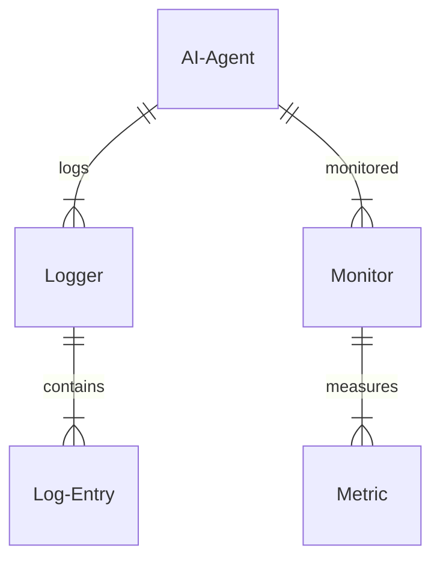
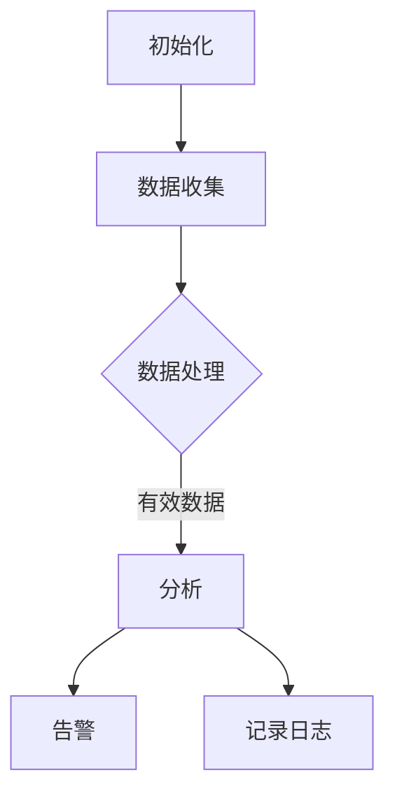
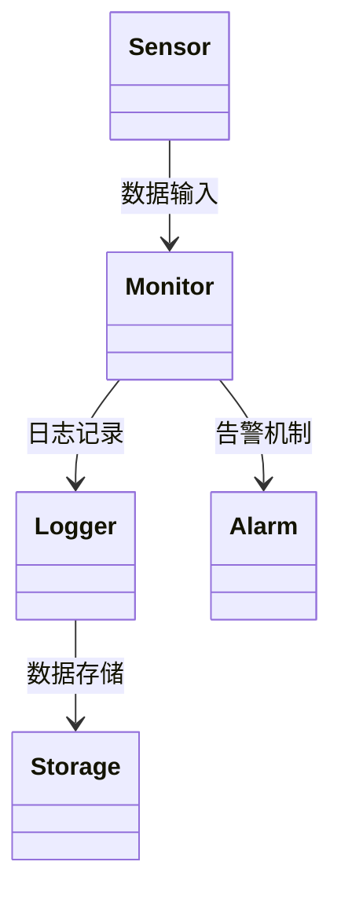
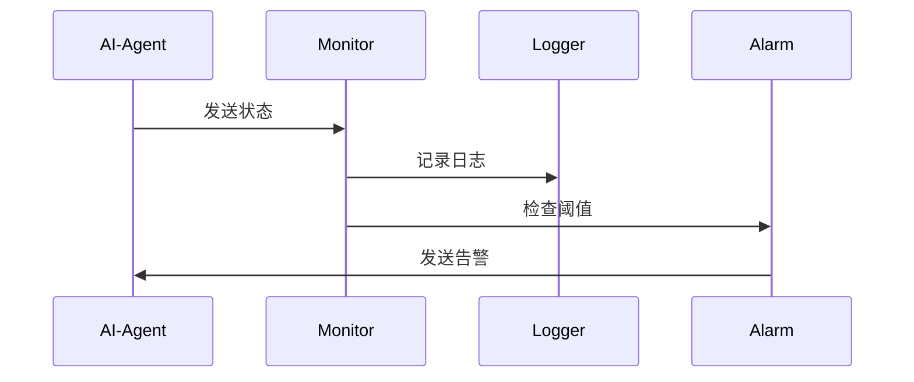
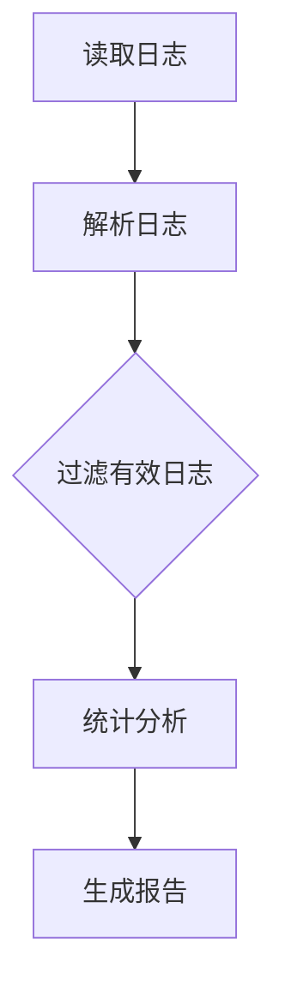

                 

### 设计过程

#### 1. 理解书籍主题

在设计《监控与日志：追踪AI Agent的行为与性能》这一书籍的过程中，我们首先需要深入理解其主题。监控和日志分析是确保AI Agent高效运行的关键环节，而AI Agent作为人工智能领域的核心组件，其行为和性能的追踪对于优化系统、提升用户体验至关重要。

- **问题背景**：随着AI技术的快速发展，AI Agent的应用场景越来越广泛，其运行中的不确定性和复杂性也不断增加。如何有效监控和日志分析，成为保障AI Agent稳定运行和性能优化的关键。

- **监控与日志的重要性**：监控可以实时检测AI Agent的状态和性能，日志分析则能够帮助我们理解AI Agent的运行过程，发现潜在问题。两者结合，可以实现对AI Agent的全方位管理和优化。

#### 2. 确定大纲框架

在理解书籍主题后，我们需要构建一个清晰的大纲框架。大纲的目的是为了引导读者系统地了解监控与日志分析在AI Agent中的应用。

- **概述**：介绍监控与日志分析的基本概念，明确其与AI Agent行为的关联。

- **核心概念**：详细解释监控、日志分析以及AI Agent行为与性能的相关概念，并使用Mermaid和LaTeX进行图形和公式的表示。

- **监控技术**：讲解监控算法原理，系统架构设计，以及接口设计与交互。

- **日志分析**：阐述日志分析的基础，方法，工具，并结合案例进行讲解。

- **性能追踪**：讨论性能追踪的原理和实践，包括监控和日志分析在性能优化中的应用。

- **最佳实践**：总结监控与日志分析的最佳实践，提供实用建议。

- **总结**：对整本书的内容进行总结，强调监控与日志分析在AI Agent追踪中的重要性。

#### 3. 细化各章节内容

为了确保书籍的连贯性和实用性，我们需要对每一章节进行细化。

- **概述部分**：介绍监控与日志分析的基本概念，使用Mermaid绘制ER实体关系图，明确各实体之间的关系。

- **核心概念部分**：详细解释监控、日志分析以及AI Agent行为与性能的核心概念，使用LaTeX书写相关数学模型和公式。

- **监控技术部分**：讲解监控算法原理，使用Mermaid绘制监控流程图，详细介绍监控系统架构设计和接口交互。

- **日志分析部分**：阐述日志分析的基础知识，使用Mermaid绘制日志分析方法流程图，介绍日志分析工具及案例。

- **性能追踪部分**：讨论性能追踪的实践，结合具体案例进行分析。

- **最佳实践部分**：总结监控与日志分析的最佳实践，提供实用建议。

- **总结部分**：对全书内容进行总结，强调监控与日志分析的重要性。

#### 4. 使用Mermaid和LaTeX

为了确保书籍的技术性和专业性，我们将在技术性强的部分使用Mermaid绘制流程图、类图和序列图，以便于读者理解。同时，使用LaTeX格式书写数学模型和公式，保证公式格式规范、清晰。

- **Mermaid**：用于绘制结构化的图形，如ER实体关系图、监控流程图等，帮助读者直观理解复杂概念。

- **LaTeX**：用于书写数学模型和公式，提高公式的可读性和准确性。

#### 5. 确保内容完整性

在编写过程中，我们需要确保每一章节的内容都是完整且具体的。特别是对于核心概念、算法原理、系统架构设计和实际案例，需要详细讲解，避免遗漏关键内容。

#### 6. Markdown格式排版

为了提高文章的可读性和组织性，我们使用Markdown格式进行排版。Markdown格式不仅能够方便地创建标题、列表、代码块等，还能够通过适当的格式化，使得文章结构清晰、层次分明。

### 大纲设计

```markdown
----------------------------------------------------------------
# 《监控与日志：追踪AI Agent的行为与性能》

> 关键词：AI Agent、监控、日志分析、性能追踪、系统架构

> 摘要：本书全面介绍了监控与日志分析在追踪AI Agent行为与性能中的应用，通过深入解析核心概念、监控技术、日志分析方法和性能追踪实践，帮助读者构建高效、可靠的AI Agent监控系统。

----------------------------------------------------------------

## 第一部分: 监控与日志概述

### 1.1 问题背景
#### 1.1.1 AI Agent的挑战
#### 1.1.2 监控与日志的重要性

### 1.2 核心概念
#### 1.2.1 监控
#### 1.2.2 日志
#### 1.2.3 AI Agent的行为与性能

### 1.3 ER实体关系图


----------------------------------------------------------------

## 第二部分: 监控技术

### 2.1 监控原理
#### 2.1.1 监控的基本概念
#### 2.1.2 监控的核心组件

### 2.2 监控算法与Mermaid流程图



### 2.3 监控系统架构设计
#### 2.3.1 架构概述
#### 2.3.2 系统功能设计



### 2.4 监控系统接口设计与交互
#### 2.4.1 接口设计
#### 2.4.2 交互流程


----------------------------------------------------------------

## 第三部分: 日志分析

### 3.1 日志分析基础
#### 3.1.1 日志结构
#### 3.1.2 日志分析方法

### 3.2 日志分析方法与Mermaid流程图



### 3.3 日志分析工具
#### 3.3.1 Logstash
#### 3.3.2 Kibana

### 3.4 日志分析案例
#### 3.4.1 案例背景
#### 3.4.2 案例分析
#### 3.4.3 案例总结

----------------------------------------------------------------

## 第四部分: 性能追踪

### 4.1 性能追踪原理
#### 4.1.1 性能追踪的定义
#### 4.1.2 性能追踪的关键要素

### 4.2 性能追踪实践
#### 4.2.1 监控工具的选择
#### 4.2.2 性能指标的定义与监控
#### 4.2.3 性能问题诊断与优化

### 4.3 性能追踪案例分析
#### 4.3.1 案例一：AI-Agent响应时间优化
#### 4.3.2 案例二：资源利用率监控与调优

----------------------------------------------------------------

## 第五部分: 最佳实践

### 5.1 监控与日志分析最佳实践
#### 5.1.1 常见问题与解决方案
#### 5.1.2 监控与日志的集成与优化

### 5.2 性能追踪最佳实践
#### 5.2.1 性能优化的策略
#### 5.2.2 性能监控与日志分析的结合

### 5.3 小结与注意事项
#### 5.3.1 小结
#### 5.3.2 注意事项
#### 5.3.3 拓展阅读

----------------------------------------------------------------

## 结束语

### 6.1 作者信息
#### 6.1.1 作者：AI天才研究院/AI Genius Institute
#### 6.1.2 书籍：《禅与计算机程序设计艺术 /Zen And The Art of Computer Programming》

### 6.2 致谢
#### 6.2.1 致谢

----------------------------------------------------------------

**总结**：本文详细阐述了《监控与日志：追踪AI Agent的行为与性能》一书的整体设计和大纲结构。从理解书籍主题，到确定大纲框架，再到细化各章节内容，以及使用Mermaid和LaTeX等工具进行图形和公式的表示，每一个步骤都旨在确保书籍的专业性、系统性和实用性。通过本文的设计过程，读者可以清晰地了解到书籍的框架结构，为后续的编写和阅读提供指导。在后续的文章中，我们将逐步深入探讨每个章节的核心内容，帮助读者全面掌握监控与日志分析在AI Agent追踪中的应用。

