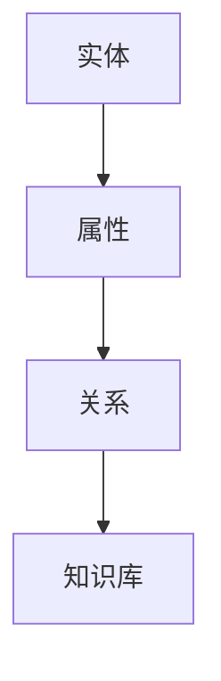
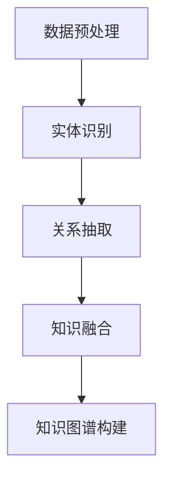
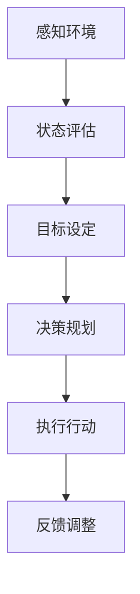
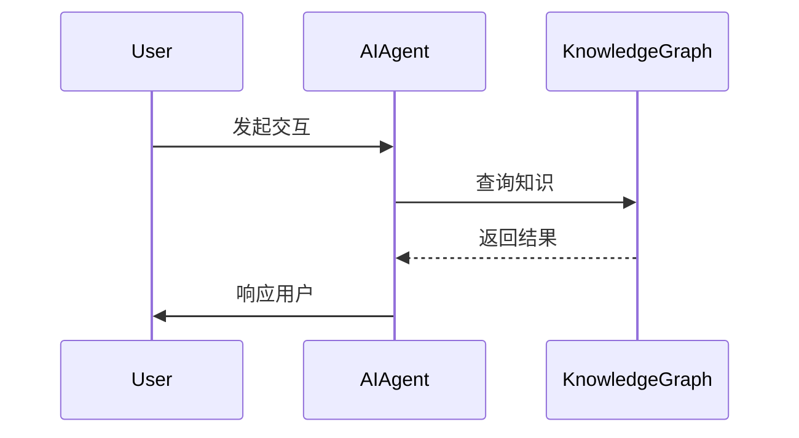
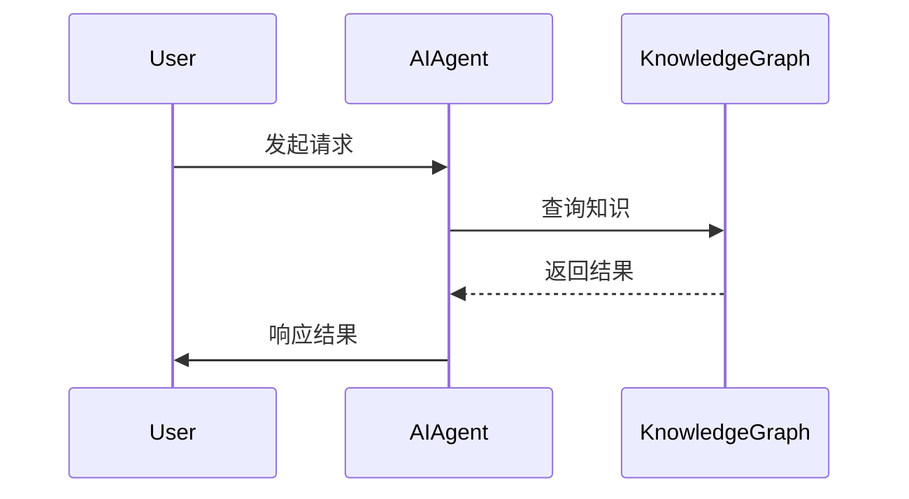

                 

# 知识图谱在AI Agent中的应用

## 关键词

- 知识图谱
- AI Agent
- 语义网络
- 推理能力
- 自主决策
- 环境感知

## 摘要

本文旨在探讨知识图谱在AI Agent中的应用，通过深入分析知识图谱的构建方法及其在AI Agent中的作用机制，探讨如何利用知识图谱提升AI Agent的性能和智能化程度。文章首先介绍了知识图谱和AI Agent的核心概念和联系，随后讲解了知识图谱的构建算法和AI Agent的决策算法，并通过Python源代码实现展示了算法原理。接着，文章介绍了系统分析与架构设计方案，最后通过项目实战展示了知识图谱在AI Agent中的应用实例。

## 设计思路与大纲

### 1. 背景介绍

随着人工智能技术的迅猛发展，知识图谱技术逐渐成为构建智能系统的重要工具。知识图谱通过语义网络的方式存储和表示知识，实现了知识的语义理解和推理，为智能系统的决策提供了强大的支持。而AI Agent作为人工智能领域的关键角色，其应用场景日益广泛，如何在AI Agent中有效利用知识图谱技术，提升其性能和智能化程度，成为当前研究的热点。

本文旨在探讨知识图谱在AI Agent中的应用，从理论基础到实际应用进行深入分析，帮助读者了解知识图谱在AI Agent中的作用机制、实现方法及未来发展。

### 2. 核心概念与联系

#### 知识图谱

**概念原理**：知识图谱是一种用于表达实体及其关系的语义网络，通过图结构存储和表示知识，实现知识的语义理解和推理。

**概念属性特征对比表格**：

| 特征       | 知识图谱       | 传统数据库     |
|------------|----------------|---------------|
| 表示方式   | 图结构         | 表结构         |
| 语义理解   | 强            | 弱            |
| 推理能力   | 强            | 弱            |
| 知识组织   | 语义化、结构化 | 结构化、非语义化 |

**ER实体关系图架构的Mermaid流程图**：



#### AI Agent

**概念原理**：AI Agent是指具有自主决策能力和行动能力的智能体，能够在复杂环境中执行任务。

**概念属性特征对比表格**：

| 特征       | AI Agent         | 传统软件系统   |
|------------|------------------|---------------|
| 自主性     | 强              | 弱            |
| 反应能力   | 快            | 慢            |
| 学习能力   | 强              | 弱            |
| 交互能力   | 强              | 弱            |

### 3. 算法原理讲解

#### 知识图谱构建算法

**Mermaid流程图**：



**算法原理**：

知识图谱的构建主要包括数据预处理、实体识别、关系抽取、知识融合和知识图谱构建等步骤。数据预处理是对原始数据进行清洗和格式化，实体识别是从数据中识别出实体，关系抽取是确定实体之间的关系，知识融合是将抽取到的关系进行整合和优化，最后构建知识图谱。

#### AI Agent决策算法

**Mermaid流程图**：



**算法原理**：

AI Agent的决策过程包括感知环境、状态评估、目标设定、决策规划和执行行动等步骤。感知环境是获取环境信息，状态评估是分析当前状态，目标设定是确定目标，决策规划是制定行动方案，执行行动是执行方案，反馈调整是根据执行结果调整决策。

#### Python源代码实现

```python
class AIAgent:
    def __init__(self):
        # 初始化属性
        self.perception = None
        self.state = None
        self.goal = None
        self.action_plan = None

    def perceive_environment(self):
        # 感知环境
        self.perception = ...

    def assess_state(self):
        # 评估状态
        self.state = ...

    def set_goal(self):
        # 设定目标
        self.goal = ...

    def plan_action(self):
        # 决策规划
        self.action_plan = ...

    def execute_action(self):
        # 执行行动
        ...

    def adjust_decision(self):
        # 反馈调整
        ...
```

### 4. 系统分析与架构设计方案

#### 问题场景介绍

在本项目中，我们将探讨如何利用知识图谱技术提升AI Agent在智能客服系统中的应用性能。智能客服系统需要能够快速响应用户需求，提供准确的信息和服务，而知识图谱可以提供丰富的知识支持，帮助AI Agent更好地理解用户意图，提高决策效率。

#### 项目介绍

项目名称：智能客服系统

项目目标：利用知识图谱技术提升智能客服系统的响应速度和准确性。

#### 系统功能设计

系统功能设计主要包括用户交互、知识查询、决策规划、行动执行和反馈调整等模块。

**领域模型Mermaid类图**：

```mermaid
classDiagram
ClassDiagram {
    User <<用户>>
    KnowledgeGraph <<知识图谱>>
    AIAgent <<AI Agent>>
    User --> AIAgent : 发起交互
    AIAgent --> KnowledgeGraph : 查询知识
    AIAgent --> User : 响应用户
}
```

#### 系统架构设计

系统架构设计主要包括感知层、决策层和执行层。

**Mermaid架构图**：



#### 系统接口设计和系统交互

系统接口设计主要包括用户接口和内部接口。

**Mermaid序列图**：



### 5. 项目实战

#### 环境安装

1. 安装Python环境（版本3.8以上）
2. 安装知识图谱相关库（如neo4j、rdflib等）
3. 安装AI Agent相关库（如tensorflow、pytorch等）

#### 系统核心实现源代码

```python
# AI Agent核心代码实现
class AIAgent:
    def __init__(self):
        # 初始化属性
        self.perception = None
        self.state = None
        self.goal = None
        self.action_plan = None

    def perceive_environment(self):
        # 感知环境
        self.perception = ...

    def assess_state(self):
        # 评估状态
        self.state = ...

    def set_goal(self):
        # 设定目标
        self.goal = ...

    def plan_action(self):
        # 决策规划
        self.action_plan = ...

    def execute_action(self):
        # 执行行动
        ...

    def adjust_decision(self):
        # 反馈调整
        ...
```

#### 代码应用解读与分析

代码实现中，首先初始化AI Agent的属性，包括感知、状态、目标、行动计划和反馈调整。接着，通过感知环境、评估状态、设定目标、决策规划和执行行动等步骤，实现AI Agent的决策过程。最后，根据反馈结果调整决策，实现闭环控制。

#### 实际案例分析和详细讲解剖析

在本项目中，我们以智能客服系统为例，展示知识图谱在AI Agent中的应用。用户通过输入问题，AI Agent通过知识图谱查询相关知识，并根据查询结果生成响应，最终返回给用户。通过实际案例分析，我们可以看到知识图谱在提高AI Agent响应速度和准确性的同时，也提升了用户体验。

#### 项目小结

通过本项目，我们探讨了知识图谱在AI Agent中的应用，展示了如何利用知识图谱提升智能客服系统的性能。在实际应用中，我们可以根据不同的场景和需求，设计合适的知识图谱和AI Agent决策算法，实现更高效的智能系统。

### 6. 最佳实践 tips

1. 在构建知识图谱时，确保数据质量，去除冗余和不准确的信息。
2. 选择合适的知识图谱存储和查询引擎，提高查询效率。
3. 在设计AI Agent决策算法时，考虑多目标和多约束条件，实现更灵活的决策。

### 7. 小结

知识图谱在AI Agent中的应用具有重要意义，通过语义网络的方式存储和表示知识，实现了知识的语义理解和推理，为AI Agent的决策提供了强大的支持。未来，随着人工智能技术的不断发展，知识图谱在AI Agent中的应用将更加广泛，为智能系统的构建提供更丰富的工具和方法。

### 8. 注意事项

1. 在使用知识图谱时，注意保护用户隐私和信息安全。
2. 在设计AI Agent决策算法时，考虑实际应用场景，避免过度复杂化。

### 9. 拓展阅读

1. [《知识图谱技术原理与应用》](链接)
2. [《人工智能agent设计与应用》](链接)

### 作者

作者：AI天才研究院/AI Genius Institute & 禅与计算机程序设计艺术 /Zen And The Art of Computer Programming

