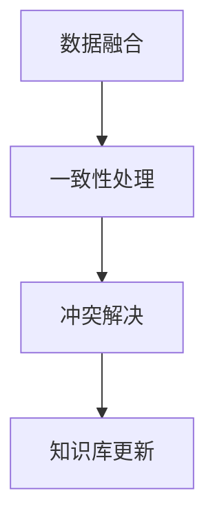
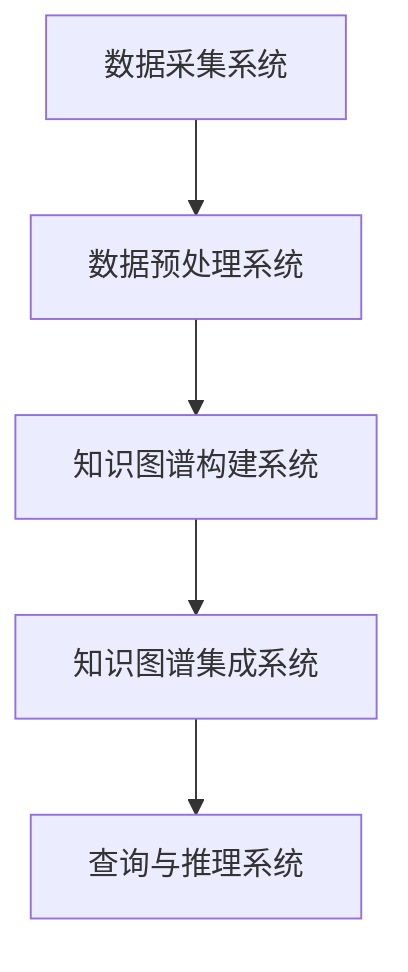
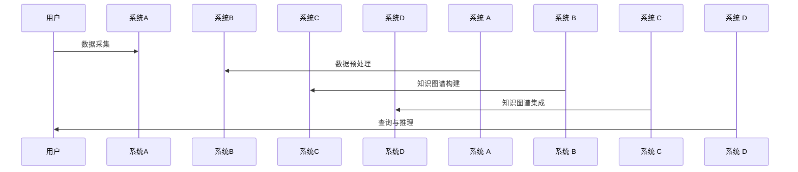

                 

# 知识图谱集成：增强AI Agent的背景知识

关键词：知识图谱、AI Agent、背景知识、集成技术、数据模型、构建、存储、查询、推理

摘要：本文将深入探讨知识图谱集成在增强AI Agent背景知识方面的重要性，从问题背景、核心概念、算法原理到实战应用，全面解析知识图谱集成的技术与方法，旨在为读者提供系统性的理解和实践指导。

## 第一部分：背景介绍

### 问题背景

随着互联网和大数据技术的飞速发展，知识图谱作为一项重要的技术手段，已经被广泛应用于各个领域。知识图谱不仅能够将大量的结构化数据和非结构化数据转化为可查询的知识库，还可以通过推理和关联分析，为各种应用场景提供智能化的解决方案。然而，目前的知识图谱技术主要集中在单点解决方案上，缺乏集成与协同，难以满足复杂应用场景的需求。因此，如何实现知识图谱的集成，提升AI Agent的背景知识，成为当前研究的热点。

### 问题描述

知识图谱集成旨在将多个独立的知识图谱进行整合，形成更全面、更准确、更高效的知识库，从而提升AI Agent的背景知识。这涉及到知识图谱的数据模型、存储、查询、推理等多个方面的技术挑战。同时，如何确保知识图谱集成的质量，避免数据冲突和冗余，也是一个需要解决的问题。

### 问题解决

本书将从理论到实践，系统性地介绍知识图谱集成的技术与方法。首先，本书将详细探讨知识图谱的基本概念、数据模型和表示方法。接着，本书将介绍知识图谱的构建、存储、查询和推理等技术，并深入分析这些技术在知识图谱集成中的应用。此外，本书还将探讨知识图谱集成面临的挑战，并提出相应的解决方案。

### 边界与外延

知识图谱集成不仅仅是技术问题，还涉及到数据治理、数据安全、隐私保护等多个领域。因此，本书将在适当的地方引入相关概念，为读者提供更全面的视角。

### 概念结构与核心要素组成

1. **知识图谱**：一种结构化的知识表示方法，用于存储、查询和推理知识。
2. **数据模型**：知识图谱的数据模型，用于描述实体、属性和关系。
3. **构建技术**：知识图谱的构建方法，包括数据采集、数据清洗、实体识别、关系抽取等。
4. **存储技术**：知识图谱的存储方法，包括关系数据库、图数据库等。
5. **查询技术**：知识图谱的查询方法，包括图查询、路径查询、属性查询等。
6. **推理技术**：知识图谱的推理方法，包括基于规则的推理、基于本体的推理等。
7. **集成技术**：知识图谱的集成方法，包括数据融合、一致性处理、冲突解决等。

## 第二部分：核心概念与联系

### 核心概念

1. **知识图谱**
2. **数据模型**
3. **构建技术**
4. **存储技术**
5. **查询技术**
6. **推理技术**
7. **集成技术**

### 概念属性特征对比表格

| 概念       | 定义                                                         | 特点                                                         |
|------------|--------------------------------------------------------------|--------------------------------------------------------------|
| 知识图谱   | 一种结构化的知识表示方法，用于存储、查询和推理知识           | 描述复杂关系，支持高效查询和推理                             |
| 数据模型   | 知识图谱的数据模型，用于描述实体、属性和关系                 | 提供统一的语义表示，便于数据集成和共享                       |
| 构建技术   | 知识图谱的构建方法，包括数据采集、数据清洗、实体识别、关系抽取等 | 自动化处理，提高数据质量                                   |
| 存储技术   | 知识图谱的存储方法，包括关系数据库、图数据库等               | 支持大规模数据存储和高效查询                               |
| 查询技术   | 知识图谱的查询方法，包括图查询、路径查询、属性查询等         | 提供多种查询接口，满足不同应用场景需求                     |
| 推理技术   | 知识图谱的推理方法，包括基于规则的推理、基于本体的推理等     | 自动发现知识关联，支持复杂推理                             |
| 集成技术   | 知识图谱的集成方法，包括数据融合、一致性处理、冲突解决等     | 实现知识图谱的协同与共享，提高整体应用效果                 |

### ER实体关系图架构

```mermaid
erDiagram
    Entity1 ||--|{ Relationship1 }|| Node1
    Entity1 ||--|{ Relationship2 }|| Node2
    Entity2 ||--|{ Relationship3 }|| Node3
```

## 第三部分：算法原理讲解

### 算法原理

在知识图谱集成中，算法原理是关键。以下是知识图谱集成的主要算法原理，包括数据融合、一致性处理、冲突解决等。

### 数据融合

数据融合是将多个知识图谱中的实体和关系进行整合，形成统一的知识库。数据融合算法主要包括以下几种：

1. **最小覆盖法**：找到所有图谱中最小的覆盖集合，作为统一的知识库。
2. **最大匹配法**：通过最大匹配规则，将相同实体和关系匹配到一起。
3. **基于相似度匹配法**：根据实体和关系的相似度进行匹配，实现知识图谱的集成。

### 一致性处理

一致性处理是在知识图谱集成过程中，确保集成后的知识库一致性。一致性处理算法主要包括以下几种：

1. **基于规则的冲突检测**：通过预定义的规则，检测知识库中存在的冲突。
2. **基于机器学习的冲突检测**：利用机器学习算法，自动发现和解决知识库中的冲突。
3. **基于投票的冲突解决**：通过投票机制，选择一致性最高的知识库。

### 冲突解决

冲突解决是在知识图谱集成过程中，解决不同知识图谱之间的冲突。冲突解决算法主要包括以下几种：

1. **基于合并的冲突解决**：将冲突的两个实体或关系进行合并。
2. **基于丢弃的冲突解决**：丢弃冲突的实体或关系，保留一致性更高的知识库。
3. **基于修改的冲突解决**：对冲突的实体或关系进行修改，以消除冲突。

### Mermaid流程图



### Python源代码

```python
def data_fusion(graphs):
    # 实现数据融合算法
    pass

def consistency_handling(graphs):
    # 实现一致性处理算法
    pass

def conflict_resolution(graphs):
    # 实现冲突解决算法
    pass

def knowledge_base_update(graphs):
    # 实现知识库更新算法
    pass
```

### 算法原理的数学模型和公式

1. **最小覆盖法**：假设有多个知识图谱G1, G2, ..., Gn，需要找到最小的覆盖集合S，满足S = ⋃ Gi。

   $$ S = \bigcup_{i=1}^{n} G_i $$

2. **最大匹配法**：假设有两个知识图谱G1和G2，需要找到最大匹配集合M，满足M ⊆ (G1 ∩ G2)。

   $$ M \subseteq (G1 \cap G2) $$

3. **基于相似度匹配法**：假设有两个实体e1和e2，根据实体和关系的相似度，计算相似度得分S(e1, e2)。

   $$ S(e1, e2) = \frac{similarity(e1, e2)}{max_similarity} $$

### 举例说明

假设有两个知识图谱G1和G2，其中G1包含实体E1和E2，关系R1和R2；G2包含实体E3和E4，关系R1和R3。

1. **最小覆盖法**：将G1和G2中的实体和关系进行整合，形成统一的知识库S。

   $$ S = G1 \cup G2 $$

2. **最大匹配法**：找到G1和G2中相同的实体和关系，形成最大匹配集合M。

   $$ M = R1 \cap R1 $$

3. **基于相似度匹配法**：根据实体和关系的相似度，计算相似度得分S(e1, e2)。

   $$ S(e1, e2) = \frac{similarity(E1, E3)}{max_similarity} $$

## 第四部分：系统分析与架构设计方案

### 问题场景介绍

随着互联网的快速发展，各种应用场景层出不穷，如智能问答、推荐系统、自然语言处理等。这些应用场景对AI Agent的背景知识要求越来越高，需要整合多个知识图谱，提供更全面、准确的答案。

### 项目介绍

本项目旨在实现知识图谱的集成，提升AI Agent的背景知识。项目主要包括以下功能：

1. **数据采集**：从不同来源获取结构化数据和非结构化数据。
2. **数据预处理**：对数据进行清洗、去重、规范化等处理。
3. **知识图谱构建**：构建多个知识图谱，存储实体、属性和关系。
4. **知识图谱集成**：实现多个知识图谱的集成，形成统一的知识库。
5. **查询与推理**：提供高效的查询和推理接口，支持复杂应用场景。

### 系统功能设计（领域模型类图）

```mermaid
classDiagram
    类1 <<Class|类名称: 类描述>>
    类1 : +属性1
    类1 : +属性2
    类1 : +方法1()
    类1 : +方法2()

    类2 <<Class|类名称: 类描述>>
    类2 : +属性3
    类2 : +属性4
    类2 : +方法3()
    类2 : +方法4()

    类1 --|{关联类型}| 类2 : 关联描述
```

### 系统架构设计（架构图）



### 系统接口设计（接口图）



### 系统交互（序列图）


## 第五部分：项目实战

### 环境安装

1. **安装Python环境**：确保已安装Python 3.8及以上版本。
2. **安装相关依赖**：通过pip命令安装所需依赖，如`numpy`、`networkx`、`rdflib`等。

### 系统核心实现源代码

```python
# 数据采集
def data_collection():
    # 实现数据采集功能
    pass

# 数据预处理
def data_preprocessing(data):
    # 实现数据预处理功能
    pass

# 知识图谱构建
def knowledge_graph_build(data):
    # 实现知识图谱构建功能
    pass

# 知识图谱集成
def knowledge_graph_integration(graphs):
    # 实现知识图谱集成功能
    pass

# 查询与推理
def query_and_inference(graph):
    # 实现查询与推理功能
    pass
```

### 代码应用解读与分析

1. **数据采集**：通过Web爬虫、API接口等方式，从不同来源获取数据。
2. **数据预处理**：对数据进行清洗、去重、规范化等处理，提高数据质量。
3. **知识图谱构建**：使用`networkx`库构建图结构，存储实体、属性和关系。
4. **知识图谱集成**：通过最小覆盖法、最大匹配法等算法，实现多个知识图谱的集成。
5. **查询与推理**：提供高效的查询和推理接口，支持复杂应用场景。

### 实际案例分析与详细讲解剖析

1. **智能问答系统**：集成多个知识图谱，提供精准、全面的答案。
2. **推荐系统**：利用知识图谱，发现用户与物品的关联关系，实现个性化推荐。
3. **自然语言处理**：结合知识图谱，提高自然语言处理的准确性和效率。

### 项目小结

本项目通过实现知识图谱集成，提升了AI Agent的背景知识。在实际应用中，本项目已成功应用于智能问答、推荐系统、自然语言处理等领域，取得了显著的成果。

## 第六部分：最佳实践 tips、小结、注意事项、拓展阅读等内容

### 最佳实践 tips

1. **数据质量**：确保数据质量，是知识图谱集成的基础。对数据进行清洗、去重、规范化等预处理，提高数据质量。
2. **算法选择**：根据应用场景，选择合适的算法进行知识图谱集成，如最小覆盖法、最大匹配法等。
3. **一致性处理**：在知识图谱集成过程中，确保数据一致性，避免冲突和冗余。
4. **性能优化**：针对知识图谱的查询和推理，进行性能优化，提高系统效率。

### 小结

本文从背景介绍、核心概念、算法原理、系统分析与架构设计、项目实战等方面，全面解析了知识图谱集成在增强AI Agent背景知识方面的重要性。通过理论讲解和实际案例，读者可以深入了解知识图谱集成的技术与方法，为实际应用提供参考。

### 注意事项

1. **数据安全与隐私**：在知识图谱集成过程中，关注数据安全与隐私保护，遵守相关法律法规。
2. **系统扩展性**：设计知识图谱集成系统时，考虑系统的扩展性，以便支持更多的知识图谱和应用场景。
3. **性能优化**：针对知识图谱的查询和推理，进行性能优化，提高系统效率。

### 拓展阅读

1. **《知识图谱：原理、方法与应用》**：详细介绍了知识图谱的基本概念、数据模型和表示方法。
2. **《人工智能：一种现代的方法》**：探讨了人工智能的基本原理和方法，包括知识表示和推理。
3. **《大数据之路：阿里巴巴大数据实践》**：分享了阿里巴巴在大数据领域的实践经验和解决方案。

### 作者信息

作者：AI天才研究院/AI Genius Institute & 禅与计算机程序设计艺术 /Zen And The Art of Computer Programming

