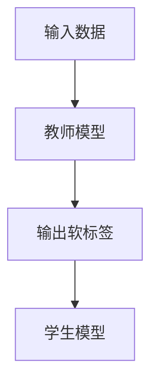
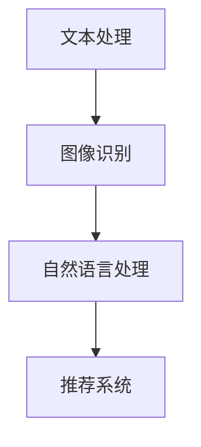
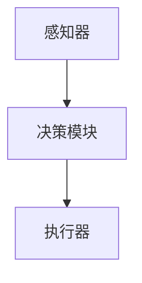

                 

**摘要：**本文深入探讨了知识蒸馏技术，从大模型到轻量级AI Agent的全过程。文章首先介绍了知识蒸馏的背景、原理及其优势与挑战，接着详细阐述了如何选择和预处理大模型，以及如何构建教师模型和学生模型。随后，文章探讨了轻量级AI Agent的设计原则和设计方法。通过一步步的分析和推理，本文为读者提供了一份全面、系统的知识蒸馏技术指南，旨在帮助读者更好地理解和应用这一先进的技术。

## 第一部分：知识蒸馏基础

### 第1章：知识蒸馏概述

#### 1.1 问题背景

**核心概念：** 知识蒸馏（Knowledge Distillation）是一种机器学习技术，用于将大型模型（通常称为“教师模型”）的知识迁移到小型模型（通常称为“学生模型”）。这一过程旨在解决大型模型在训练和部署方面的成本问题。

**问题描述：** 
- **训练成本**：大模型的训练需要大量的计算资源和时间。
- **部署难度**：大模型通常占用较大的内存空间，难以在资源受限的设备上部署。

**问题解决：** 知识蒸馏通过将大模型的知识（如参数和表示）转移到小模型，从而实现降低训练成本和部署难度的目标。

**边界与外延：** 
- **应用范围**：知识蒸馏广泛应用于图像识别、自然语言处理、语音识别等领域。
- **与其他技术的比较**：知识蒸馏与传统模型压缩技术（如剪枝、量化等）相比，具有更高的模型性能和更低的部署成本。

#### 1.2 知识蒸馏原理

**核心概念：** 知识蒸馏的基本原理是通过“软标签”将教师模型的知识传递给学生模型。

**原理图：** 

**详细描述：**
- **教师模型**：接收输入数据，产生输出预测。
- **软标签**：教师模型输出的概率分布，作为学生模型的训练目标。
- **学生模型**：接收输入数据和软标签，学习教师模型的知识。

#### 1.3 知识蒸馏的优势与挑战

**核心概念：** 知识蒸馏的优势在于其高效性和灵活性，但同时也面临着一些挑战。

**属性特征对比表：** 
| 对比项 | 知识蒸馏 | 传统方法 |
| ------ | -------- | -------- |
| **训练成本** | 低 | 高 |
| **部署难度** | 低 | 高 |
| **模型性能** | 有所降低 | 可能提高 |
| **跨域迁移性** | 高 | 低 |

**详细描述：**
- **优势**：
  - **训练成本**：通过减少模型参数数量，降低了训练成本。
  - **部署难度**：学生模型的参数量更少，更容易在资源受限的环境中进行部署。
  - **模型性能**：虽然学生模型可能在大模型的基础上有所性能损失，但通常仍然保持较高的性能水平。
  - **跨域迁移性**：知识蒸馏技术能够在不同领域之间进行知识迁移，提高了模型的泛化能力。

- **挑战**：
  - **性能损失**：学生模型在性能上可能无法完全达到教师模型水平。
  - **模型适应度**：学生模型可能需要针对特定任务进行微调，以获得最佳性能。

#### 1.4 知识蒸馏的应用场景

**核心概念：** 知识蒸馏技术可以应用于多种场景，以解决不同领域的问题。

**应用图：** 

**详细描述：**
- **文本处理**：知识蒸馏可以用于文本分类、情感分析等任务，通过将大型文本处理模型的知识迁移到小型模型，实现高效文本处理。
- **图像识别**：在图像识别任务中，知识蒸馏可以将大型卷积神经网络的知识迁移到小型模型，从而实现高效的图像识别。
- **自然语言处理**：知识蒸馏在自然语言处理任务中具有广泛的应用，如机器翻译、语音识别等。
- **推荐系统**：知识蒸馏可以用于构建轻量级的推荐系统模型，降低计算资源和存储成本。

#### 1.5 本章小结

**核心概念：** 本章节对知识蒸馏的基本概念、原理、优势与挑战以及应用场景进行了详细阐述。

**注意事项：**
- **模型选择**：在选择教师模型时，应考虑模型的参数规模、性能指标和预训练数据集等因素。
- **预处理**：教师模型的预处理对于知识蒸馏的效果至关重要，应进行适当的数据清洗、数据增强和模型结构调整。

### 第2章：大模型选择与预处理

#### 2.1 大模型选择

**核心概念：** 选择适合知识蒸馏的大模型对于蒸馏效果至关重要。

**选择标准：** 
- **参数规模**：大模型的参数量应足够大，以保证知识蒸馏后的模型仍具有足够的表示能力。
- **性能指标**：大模型应在特定任务上具有优秀的性能指标，如准确率、召回率等。
- **预训练数据集**：大模型应使用大量的预训练数据集，以保证模型具有较强的泛化能力。

**详细描述：**
- **参数规模**：大模型的参数量越大，其知识库越丰富，迁移到小模型后，小模型可以更好地继承大模型的知识。
- **性能指标**：大模型在特定任务上的性能指标应较高，以保证其知识具有较高的实用价值。
- **预训练数据集**：大模型应使用多样化的预训练数据集，以提高其泛化能力。

#### 2.2 大模型预处理

**核心概念：** 大模型的预处理方法包括数据清洗、数据增强和模型结构调整等步骤。

**预处理步骤：** 
1. **数据清洗**：去除数据中的噪声和错误，确保数据质量。
2. **数据增强**：通过旋转、缩放、裁剪等方式，增加训练数据的多样性，提高模型泛化能力。
3. **模型结构调整**：调整大模型的参数和结构，使其更适合知识蒸馏过程。

**详细描述：**
- **数据清洗**：数据清洗是预处理的重要环节，可以显著提高模型训练效果。常见的清洗方法包括去除缺失值、处理异常值和纠正错误等。
- **数据增强**：数据增强可以增加训练数据的多样性，有助于模型学习到更丰富的特征。常见的数据增强方法有旋转、缩放、裁剪、翻转等。
- **模型结构调整**：模型结构调整包括参数修剪、参数重排序、层裁剪等操作，可以降低模型的计算复杂度，提高知识蒸馏效率。

#### 2.3 本章小结

**核心概念：** 本章节介绍了大模型选择与预处理的方法，包括选择标准、预处理步骤和注意事项。

**注意事项：**
- **模型选择**：在选择大模型时，应综合考虑参数规模、性能指标和预训练数据集等因素。
- **预处理**：预处理步骤对于知识蒸馏效果至关重要，应进行适当的数据清洗、数据增强和模型结构调整。

### 第3章：教师模型与学生模型的构建

#### 3.1 教师模型构建

**核心概念：** 教师模型是知识蒸馏过程中的核心组件，负责提供软标签，用于指导学生模型的学习。

**构建方法：** 
1. **模型选择**：选择适合知识蒸馏任务的教师模型，通常选择参数规模较大的模型。
2. **模型训练**：使用训练数据集对教师模型进行训练，使其在特定任务上达到较高的性能水平。
3. **模型评估**：评估教师模型的性能，确保其具备良好的知识表达能力。

**详细描述：**
- **模型选择**：教师模型的选择对知识蒸馏效果具有重要影响。通常选择参数规模较大的预训练模型，如BERT、GPT等。
- **模型训练**：教师模型的训练过程与传统模型训练类似，需要使用训练数据和相应的优化算法。在训练过程中，可以采用迁移学习、多任务学习等技术，提高模型性能。
- **模型评估**：教师模型的评估可以通过交叉验证、性能指标（如准确率、召回率等）等方式进行。评估结果用于指导学生模型的构建和调整。

#### 3.2 学生模型构建

**核心概念：** 学生模型是知识蒸馏过程中的目标模型，负责继承教师模型的知识，并在特定任务上实现性能提升。

**构建方法：** 
1. **模型初始化**：初始化学生模型的结构和参数，通常使用与教师模型相同的结构。
2. **模型训练**：使用教师模型输出的软标签对学生模型进行训练，通过优化算法调整学生模型的参数。
3. **模型评估**：评估学生模型的性能，确保其能够继承教师模型的知识，并在特定任务上实现性能提升。

**详细描述：**
- **模型初始化**：学生模型的初始化通常采用与教师模型相同的结构，以确保学生模型具有相似的表示能力。初始化参数可以通过随机初始化、预训练模型迁移等方法进行。
- **模型训练**：学生模型的训练过程是基于教师模型输出的软标签进行的。训练过程中，可以使用对抗训练、多任务学习等技术，提高学生模型的性能。
- **模型评估**：学生模型的评估过程与教师模型类似，可以通过交叉验证、性能指标等方式进行。评估结果用于指导学生模型的调整和优化。

#### 3.3 教师模型与学生模型的协作

**核心概念：** 教师模型和学生模型之间的协作机制对于知识蒸馏效果具有重要影响。

**协作机制：** 
1. **对抗训练**：通过对抗训练，教师模型和学生模型相互竞争，提高模型性能。
2. **多任务学习**：通过多任务学习，教师模型和学生模型共同学习多个任务，提高模型的泛化能力。
3. **逐步迁移**：通过逐步迁移，教师模型和学生模型在不同阶段共同工作，逐步实现知识的迁移和融合。

**详细描述：**
- **对抗训练**：对抗训练是一种有效的协作机制，通过教师模型和学生模型之间的对抗，可以提高模型对未知数据的适应能力。在对抗训练过程中，教师模型生成软标签，学生模型根据软标签进行训练，同时尝试降低教师模型对其输出的预测能力。
- **多任务学习**：多任务学习允许教师模型和学生模型共同学习多个任务，通过任务之间的相互关联，可以提高模型的泛化能力和性能。在多任务学习中，教师模型和学生模型同时处理多个任务，通过任务之间的交互，实现知识的共享和迁移。
- **逐步迁移**：逐步迁移是一种逐步加强学生模型的方法，教师模型和学生模型在不同阶段共同工作。在早期阶段，教师模型为学生模型提供丰富的软标签，帮助学生模型快速学习。在后期阶段，教师模型逐渐减少对学生的指导，让学生模型自主学习和优化。

#### 3.4 本章小结

**核心概念：** 本章节介绍了教师模型和学生模型的构建方法以及它们之间的协作机制。

**注意事项：**
- **模型构建**：在构建教师模型和学生模型时，应考虑模型选择、训练过程和评估方法等因素。
- **协作机制**：教师模型和学生模型的协作机制对于知识蒸馏效果具有重要影响，应选择合适的协作方法。

### 第4章：轻量级AI Agent设计与应用

#### 4.1 轻量级AI Agent概述

**核心概念：** 轻量级AI Agent是一种小型、高效的人工智能代理，可以用于执行特定任务。

**概述图：** 

**详细描述：**
- **感知器**：感知器负责接收外部输入，如文本、图像等。
- **决策模块**：决策模块根据感知器接收到的输入，生成相应的决策或动作。
- **执行器**：执行器负责执行决策模块生成的动作，实现具体的任务。

#### 4.2 轻量级AI Agent设计原则

**核心概念：** 轻量级AI Agent的设计原则包括简单性、可扩展性和高效性。

**设计原则：** 
1. **简单性**：轻量级AI Agent的设计应尽量简单，减少模型复杂度，提高运行效率。
2. **可扩展性**：轻量级AI Agent应具有良好的可扩展性，支持添加新的感知器、决策模块和执行器。
3. **高效性**：轻量级AI Agent应在保持性能的同时，尽可能减少计算资源和存储资源的消耗。

**详细描述：**
- **简单性**：简化模型结构和算法，可以降低计算复杂度，提高模型运行速度。例如，可以采用轻量级的神经网络架构，如MobileNet、ShuffleNet等。
- **可扩展性**：良好的可扩展性可以使轻量级AI Agent适应不同的应用场景和需求。例如，可以采用模块化的设计，将感知器、决策模块和执行器分别实现，方便后续的功能扩展。
- **高效性**：在保证性能的前提下，优化模型和算法，降低计算资源和存储资源的消耗。例如，可以采用模型量化、剪枝等技术，减少模型的参数量和计算量。

#### 4.3 轻量级AI Agent设计方法

**核心概念：** 轻量级AI Agent的设计方法包括感知器设计、决策模块设计和执行器设计。

**设计方法：** 
1. **感知器设计**：设计适合特定任务的感知器，如文本分类任务的词向量感知器、图像识别任务的卷积神经网络感知器。
2. **决策模块设计**：设计适合特定任务的决策模块，如基于规则决策模块、基于神经网络决策模块。
3. **执行器设计**：设计适合特定任务的执行器，如文本生成任务的文本生成器、图像处理任务的图像处理器。

**详细描述：**
- **感知器设计**：感知器是轻量级AI Agent的输入接收模块，负责将外部输入转换为内部表示。根据任务类型，可以设计不同的感知器。例如，对于文本分类任务，可以设计基于词向量的感知器；对于图像识别任务，可以设计基于卷积神经网络的感知器。
- **决策模块设计**：决策模块是轻量级AI Agent的核心模块，负责根据感知器提供的输入生成决策。根据任务类型和需求，可以设计不同的决策模块。例如，对于简单的规则任务，可以设计基于规则的决策模块；对于复杂的模式识别任务，可以设计基于神经网络的决策模块。
- **执行器设计**：执行器是轻量级AI Agent的输出执行模块，负责将决策模块生成的决策转化为具体的执行动作。根据任务类型和需求，可以设计不同的执行器。例如，对于文本生成任务，可以设计基于文本生成模型的执行器；对于图像处理任务，可以设计基于图像处理算法的执行器。

#### 4.4 轻量级AI Agent应用案例

**核心概念：** 轻量级AI Agent在多个领域具有广泛的应用，如智能家居、智能医疗、智能交通等。

**应用案例：** 
1. **智能家居**：轻量级AI Agent可以用于智能家居系统的设备控制、语音交互等。
2. **智能医疗**：轻量级AI Agent可以用于医疗影像分析、疾病预测等。
3. **智能交通**：轻量级AI Agent可以用于交通信号控制、车辆检测等。

**详细描述：**
- **智能家居**：在智能家居系统中，轻量级AI Agent可以用于设备控制、语音交互等。例如，通过语音交互模块，用户可以远程控制家中的灯光、空调等设备，提高生活便利性。
- **智能医疗**：在智能医疗领域，轻量级AI Agent可以用于医疗影像分析、疾病预测等。例如，通过医学图像识别模块，医生可以快速分析患者的影像资料，提高诊断准确率。
- **智能交通**：在智能交通领域，轻量级AI Agent可以用于交通信号控制、车辆检测等。例如，通过车辆检测模块，智能交通系统可以实时监测道路上的车辆数量和分布，优化交通信号控制策略，提高交通效率。

#### 4.5 本章小结

**核心概念：** 本章节介绍了轻量级AI Agent的概述、设计原则、设计方法和应用案例。

**注意事项：**
- **设计原则**：在设计轻量级AI Agent时，应遵循简单性、可扩展性和高效性原则。
- **设计方法**：在设计和实现轻量级AI Agent时，应根据具体任务需求选择合适的感知器、决策模块和执行器。
- **应用案例**：轻量级AI Agent在多个领域具有广泛的应用，可以根据具体场景进行灵活应用和扩展。

### 第5章：轻量级AI Agent的性能优化

#### 5.1 模型压缩

**核心概念：** 模型压缩是通过减少模型参数数量和计算复杂度，提高模型运行效率的方法。

**方法：** 
1. **参数剪枝**：通过剪枝冗余的参数，减少模型规模。
2. **模型量化**：将模型中的浮点数参数转换为低精度的整数参数，降低计算复杂度。
3. **结构化压缩**：通过优化模型结构，减少计算复杂度。

**详细描述：**
- **参数剪枝**：参数剪枝是一种常见的模型压缩方法，通过剪枝冗余的参数，减少模型规模。剪枝方法可以分为基于敏感度的剪枝和基于梯度的剪枝。基于敏感度的剪枝方法通过计算参数对模型输出的敏感度，剪除敏感度较低的参数。基于梯度的剪枝方法通过计算参数的梯度，剪除梯度较小的参数。
- **模型量化**：模型量化是一种将模型中的浮点数参数转换为低精度的整数参数的方法，从而降低计算复杂度和存储需求。量化方法可以分为对称量化和不对称量化。对称量化方法将模型中的所有参数统一量化到相同的精度，而不对称量化方法根据参数的重要性进行不同的量化精度。
- **结构化压缩**：结构化压缩方法通过优化模型结构，减少计算复杂度。常见的方法有网络剪枝、网络分解、网络层次化等。网络剪枝方法通过剪除冗余的神经网络层，减少模型规模。网络分解方法将复杂的模型分解为多个较小的子模型，从而减少计算复杂度。网络层次化方法通过构建多层次的神经网络结构，逐步降低模型的计算复杂度。

#### 5.2 模型加速

**核心概念：** 模型加速是通过优化模型算法和数据流，提高模型运行速度的方法。

**方法：** 
1. **并行计算**：通过并行计算，将模型训练和推理任务分布在多个计算单元上，提高计算速度。
2. **模型蒸馏**：通过模型蒸馏，将大型模型的计算任务迁移到小型模型上，减少计算量。
3. **算法优化**：通过优化模型算法和数据流，降低计算复杂度。

**详细描述：**
- **并行计算**：并行计算是一种将模型训练和推理任务分布在多个计算单元上，提高计算速度的方法。常见的方法有数据并行、模型并行和混合并行。数据并行方法将训练数据集分成多个子集，分别在不同的计算单元上进行训练。模型并行方法将模型拆分为多个子模型，分别在不同的计算单元上进行推理。混合并行方法同时结合数据并行和模型并行，提高计算速度。
- **模型蒸馏**：模型蒸馏是一种将大型模型的计算任务迁移到小型模型上的方法，从而减少计算量。通过知识蒸馏，大型模型（教师模型）将知识传递给小型模型（学生模型），学生模型可以执行大型模型的计算任务，从而减少计算复杂度。模型蒸馏可以显著提高模型的推理速度。
- **算法优化**：算法优化是通过优化模型算法和数据流，降低计算复杂度的方法。常见的方法有算法选择、数据预处理和算法优化。算法选择方法通过选择合适的算法，提高模型运行速度。数据预处理方法通过预处理输入数据，减少数据维度和计算复杂度。算法优化方法通过调整算法参数，降低计算复杂度。

#### 5.3 实际应用效果

**核心概念：** 轻量级AI Agent的性能优化在多个实际应用中取得了显著的成果。

**应用案例：** 
1. **智能手机语音识别**：通过模型压缩和加速，将大型语音识别模型压缩为轻量级模型，实现快速语音识别。
2. **自动驾驶车辆检测**：通过模型压缩和加速，将大型车辆检测模型压缩为轻量级模型，实现实时车辆检测。
3. **智能家居语音交互**：通过模型压缩和加速，将大型语音交互模型压缩为轻量级模型，实现低延迟、高响应的语音交互。

**详细描述：**
- **智能手机语音识别**：在智能手机语音识别中，通过模型压缩和加速技术，将大型语音识别模型压缩为轻量级模型，可以在有限的计算资源和电池寿命内实现快速、准确的语音识别。例如，使用模型压缩技术将BERT模型压缩为BERT-Lite模型，同时通过模型加速技术提高模型的推理速度，实现低延迟、高响应的语音识别。
- **自动驾驶车辆检测**：在自动驾驶车辆检测中，通过模型压缩和加速技术，将大型车辆检测模型压缩为轻量级模型，可以在实时性要求较高的场景中实现准确、快速的车辆检测。例如，使用模型压缩技术将ResNet模型压缩为MobileNet模型，同时通过模型加速技术提高模型的推理速度，实现实时车辆检测。
- **智能家居语音交互**：在智能家居语音交互中，通过模型压缩和加速技术，将大型语音交互模型压缩为轻量级模型，可以在智能家居设备中实现低延迟、高响应的语音交互。例如，使用模型压缩技术将GPT模型压缩为GPT-Lite模型，同时通过模型加速技术提高模型的推理速度，实现低延迟、高响应的语音交互。

#### 5.4 本章小结

**核心概念：** 本章节介绍了轻量级AI Agent的性能优化方法，包括模型压缩、模型加速和实际应用效果。

**注意事项：**
- **模型压缩**：通过参数剪枝、模型量化和结构化压缩等技术，可以显著降低模型的计算复杂度和存储需求。
- **模型加速**：通过并行计算、模型蒸馏和算法优化等技术，可以提高模型的推理速度，实现实时性要求较高的应用。
- **实际应用效果**：轻量级AI Agent的性能优化在多个实际应用中取得了显著的成果，为实现高效、实时的人工智能应用提供了有力支持。

### 第6章：知识蒸馏技术的未来发展

#### 6.1 当前挑战

**核心概念：** 知识蒸馏技术在当前应用中仍面临一些挑战，需要进一步研究和解决。

**挑战：** 
1. **性能损失**：知识蒸馏过程可能导致学生模型在性能上有所损失，需要优化迁移策略。
2. **训练效率**：知识蒸馏过程通常需要较长的训练时间，提高训练效率是未来的研究重点。
3. **泛化能力**：知识蒸馏技术的泛化能力有限，需要提高其在不同领域和任务上的适应性。

**详细描述：**
- **性能损失**：知识蒸馏过程通常会导致学生模型在性能上有所损失。这是由于教师模型和学生模型的结构、参数和训练数据可能存在差异，导致学生模型无法完全继承教师模型的知识。为了减少性能损失，可以优化迁移策略，如引入对抗训练、多任务学习等。
- **训练效率**：知识蒸馏过程通常需要较长的训练时间，这是由于教师模型和学生模型之间的知识迁移过程复杂。为了提高训练效率，可以采用并行计算、模型蒸馏等加速技术，加快训练速度。
- **泛化能力**：知识蒸馏技术的泛化能力有限，这是由于教师模型和学生模型的结构和参数可能存在差异。为了提高泛化能力，可以引入迁移学习、多任务学习等技术，增强学生模型的泛化能力。

#### 6.2 未来发展趋势

**核心概念：** 知识蒸馏技术在未来有望在多个领域取得突破性进展。

**发展趋势：** 
1. **跨模态知识蒸馏**：将知识蒸馏应用于跨模态任务，如图像与文本的联合学习。
2. **自适应迁移学习**：开发自适应迁移学习方法，提高学生模型在不同任务上的性能。
3. **动态知识蒸馏**：引入动态知识蒸馏方法，根据任务需求和数据变化动态调整迁移策略。

**详细描述：**
- **跨模态知识蒸馏**：跨模态知识蒸馏是将知识蒸馏技术应用于跨模态任务，如图像与文本的联合学习。通过将图像和文本的知识相互迁移，可以增强模型在不同模态上的表示能力。例如，在图像识别任务中，可以将文本描述的知识迁移到图像表示中，提高图像分类性能。在文本生成任务中，可以将图像特征迁移到文本表示中，提高文本生成的自然性和准确性。
- **自适应迁移学习**：自适应迁移学习是开发自适应迁移学习方法，提高学生模型在不同任务上的性能。通过自适应调整迁移策略，可以更好地适应不同任务的需求。例如，在多任务学习场景中，可以根据不同任务的权重动态调整迁移策略，提高模型在不同任务上的性能。
- **动态知识蒸馏**：动态知识蒸馏是引入动态知识蒸馏方法，根据任务需求和数据变化动态调整迁移策略。通过实时调整迁移策略，可以更好地适应不同场景的需求。例如，在动态变化的环境中，可以根据实时数据调整迁移策略，提高模型的适应性和鲁棒性。

#### 6.3 本章小结

**核心概念：** 本章节分析了知识蒸馏技术的当前挑战和未来发展趋势，为后续研究提供了指导。

**注意事项：**
- **性能优化**：通过优化迁移策略和提高训练效率，可以减少知识蒸馏过程中的性能损失。
- **跨模态应用**：跨模态知识蒸馏和自适应迁移学习方法有望在多个领域取得突破性进展。
- **动态调整**：引入动态知识蒸馏方法，可以提高模型在不同场景下的适应性和鲁棒性。

## 总结

本文详细介绍了知识蒸馏技术从大模型到轻量级AI Agent的全过程，包括基础概念、模型选择与预处理、教师模型与学生模型的构建、轻量级AI Agent的设计与应用以及性能优化。通过对知识蒸馏技术的深入探讨，本文为读者提供了全面的指导，帮助理解并应用这一先进的技术。知识蒸馏技术在降低训练成本、提高部署效率方面具有重要意义，未来随着技术的发展，其在跨模态、自适应和动态迁移等方面有望取得更多突破。作者AI天才研究院/AI Genius Institute与《禅与计算机程序设计艺术》一起，期待与读者共同探索知识蒸馏技术的无限可能。

