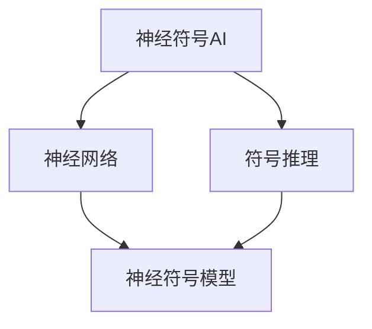
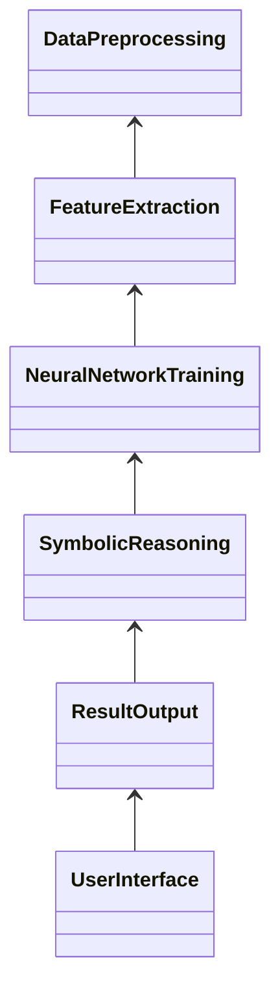
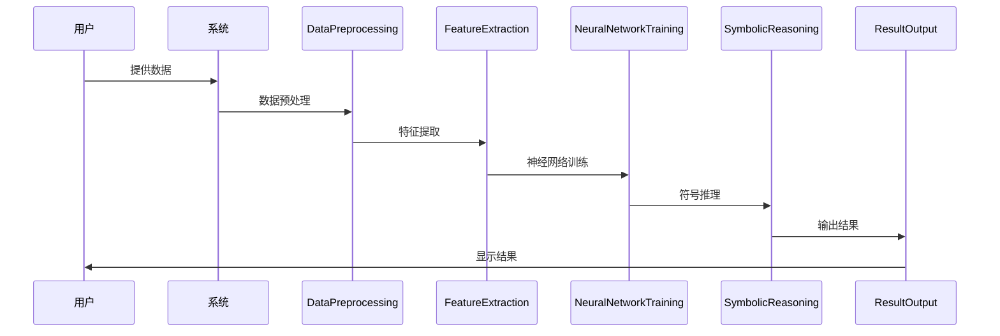
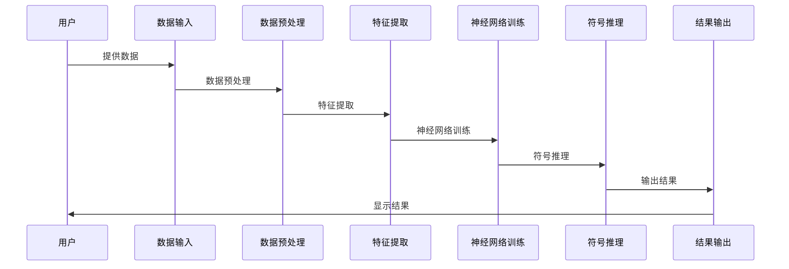

                 

### 文章标题：神经符号AI：结合符号推理与神经网络

#### 关键词：
- 神经符号AI
- 符号推理
- 神经网络
- AI发展
- 应用实例

#### 摘要：
本文将深入探讨神经符号AI这一前沿技术领域。通过梳理其起源与发展、核心概念与联系、算法原理以及应用实例，本文旨在为读者提供一个全面、系统的了解，并探讨神经符号AI在现实世界中的潜力和挑战。本文旨在为AI领域的科研人员、工程师以及爱好者提供有价值的参考。

---

### 第一部分：神经符号AI概述

#### 第1章：神经符号AI的起源与发展

##### 1.1 神经符号AI的起源

**1.1.1 人工智能的发展历程**

人工智能（AI）自1956年诞生以来，已经经历了多个发展阶段。从早期的符号推理，到基于规则的专家系统，再到现代的深度学习与神经网络，每一次技术的进步都推动了AI的边界。

**1.1.2 符号推理与神经网络的结合**

符号推理和神经网络各有优势。符号推理擅长处理抽象的逻辑关系，而神经网络则在处理复杂数据和模式识别方面表现出色。神经符号AI正是将两者结合，试图发挥各自优势，弥补单一方法的局限。

**1.1.3 神经符号AI的核心概念**

神经符号AI的核心在于“神经”和“符号”的结合。它不仅利用神经网络的强大计算能力，还借助符号推理的语义理解能力，实现更为强大和灵活的智能系统。

##### 1.2 神经符号AI的发展现状

**1.2.1 神经网络的优势与局限**

神经网络在图像识别、语音识别等领域取得了显著成果，但其在处理逻辑推理、自然语言理解等方面仍存在不足。神经符号AI试图解决这一问题。

**1.2.2 符号推理在AI中的应用**

符号推理在AI中的应用主要集中在知识表示、逻辑推理等方面。通过结合神经网络，符号推理可以更好地处理复杂的语义信息。

**1.2.3 神经符号AI的技术进展**

近年来，神经符号AI取得了多项突破。例如，基于图神经网络和符号推理的结合，实现了在复杂推理任务上的性能提升。此外，神经符号AI在自然语言处理、计算机视觉等领域也展示了广阔的应用前景。

##### 1.3 神经符号AI的应用领域

**1.3.1 自然语言处理**

在自然语言处理（NLP）领域，神经符号AI可以结合神经网络和符号推理的优势，实现更精准的文本理解和生成。

**1.3.2 计算机视觉**

计算机视觉领域中的物体识别、场景理解等问题，也可以通过神经符号AI的方法得到有效解决。

**1.3.3 推理与决策**

在推理与决策领域，神经符号AI可以模拟人类的思维过程，实现更为智能和可靠的推理与决策。

#### 第2章：神经符号AI的核心概念与联系

##### 2.1 核心概念介绍

**2.1.1 神经网络**

神经网络由大量简单单元（神经元）组成，通过层次化的结构进行信息传递和处理。神经网络的核心原理是学习输入和输出之间的映射关系。

**2.1.2 符号推理**

符号推理是基于符号逻辑的推理过程，通过推理规则和事实信息，推导出新的结论。符号推理擅长处理抽象的逻辑关系和语义信息。

**2.1.3 神经符号模型**

神经符号模型是将神经网络和符号推理相结合的一种新型AI模型。它通过神经网络学习输入数据的特征表示，然后利用符号推理进行逻辑推理和决策。

##### 2.2 概念属性特征对比表格

| 特征                  | 神经网络                   | 符号推理                   | 神经符号模型             |
|----------------------|---------------------------|---------------------------|-------------------------|
| 数据处理能力         | 强大，适用于复杂数据处理   | 较弱，适用于结构化数据     | 结合两者，优势互补       |
| 逻辑推理能力         | 较弱，难以处理抽象逻辑     | 强大，擅长处理语义信息     | 结合两者，实现智能推理   |
| 模式识别能力         | 强大，适用于图像、语音等   | 较弱，适用于符号结构       | 结合两者，提高识别精度   |
| 算法复杂度           | 较高，计算量大             | 较低，计算简单             | 结合两者，优化计算效率   |

##### 2.3 ER实体关系图架构的Mermaid流程图



### 第二部分：神经符号AI算法原理详解

#### 第3章：神经网络基础

##### 3.1 神经网络的基本原理

**3.1.1 神经元模型**

神经元是神经网络的基本单元，类似于生物神经元。它通过输入信号，经过加权求和和激活函数的处理，产生输出。

**3.1.2 前向传播与反向传播**

前向传播是神经网络计算输入和输出之间的映射关系的过程。反向传播则是根据输出误差，调整神经元的权重和偏置，以优化网络性能。

**3.1.3 激活函数**

激活函数用于引入非线性特性，使得神经网络能够处理非线性问题。常见的激活函数有ReLU、Sigmoid和Tanh等。

##### 3.2 Python源代码实现

```python
import numpy as np

# 定义神经元模型
class NeuralNetwork:
    def __init__(self):
        # 初始化权重和偏置
        self.weights = np.random.rand(1)
        self.bias = np.random.rand(1)
        self.activation_function = self.sigmoid

    def forward(self, x):
        # 前向传播
        return self.activation_function(x * self.weights + self.bias)

    def backward(self, x, y):
        # 反向传播
        error = y - x
        d_weights = error * x
        d_bias = error

        # 更新权重和偏置
        self.weights -= d_weights
        self.bias -= d_bias

    def sigmoid(self, x):
        # Sigmoid激活函数
        return 1 / (1 + np.exp(-x))

# 测试神经网络
nn = NeuralNetwork()
print(nn.forward(2))
nn.backward(2, 0)
print(nn.forward(2))
```

##### 3.3 算法原理的数学模型和公式

$$
\begin{aligned}
&\text{输入层：} x_i = z_i \cdot a_i \\
&\text{输出层：} y_i = z_i \cdot \sigma(a_i) \\
\end{aligned}
$$

其中，$z_i$为输入值，$a_i$为加权求和值，$\sigma$为激活函数。

##### 3.4 算法原理的举例说明

**3.4.1 简单的线性回归问题**

假设我们有一个简单的线性回归问题，目标是拟合一条直线，以预测房价。我们可以使用一个单层神经网络来实现。

```python
import numpy as np

# 定义线性回归模型
class LinearRegression:
    def __init__(self):
        # 初始化权重和偏置
        self.weights = np.random.rand(1)
        self.bias = np.random.rand(1)

    def forward(self, x):
        # 前向传播
        return x * self.weights + self.bias

    def backward(self, x, y):
        # 反向传播
        error = y - x
        d_weights = error * x
        d_bias = error

        # 更新权重和偏置
        self.weights -= d_weights
        self.bias -= d_bias

# 测试线性回归模型
model = LinearRegression()
for _ in range(1000):
    x = np.random.rand(1)
    y = 3 * x + 2
    model.forward(x)
    model.backward(x, y)
print(model.forward(2))
```

**3.4.2 多层感知机分类问题**

多层感知机（MLP）是一种前馈神经网络，可用于分类任务。以下是一个简单的多层感知机示例：

```python
import numpy as np

# 定义多层感知机模型
class MultiLayerPerceptron:
    def __init__(self, input_size, hidden_size, output_size):
        # 初始化权重和偏置
        self.weights1 = np.random.rand(hidden_size, input_size)
        self.bias1 = np.random.rand(hidden_size, 1)
        self.weights2 = np.random.rand(output_size, hidden_size)
        self.bias2 = np.random.rand(output_size, 1)
        self.activation_function = self.sigmoid

    def forward(self, x):
        # 前向传播
        hidden = self.activation_function(np.dot(x, self.weights1) + self.bias1)
        output = self.activation_function(np.dot(hidden, self.weights2) + self.bias2)
        return output

    def backward(self, x, y):
        # 反向传播
        hidden_error = (y - self.forward(x)) * self.activation_function_derivative(hidden)
        hidden_delta = hidden * (1 - hidden)
        output_error = hidden_error * self.activation_function_derivative(output)
        output_delta = output * (1 - output)

        d_weights2 = hidden_error.T
        d_bias2 = hidden_error
        d_weights1 = hidden.T
        d_bias1 = hidden

        # 更新权重和偏置
        self.weights2 -= d_weights2
        self.bias2 -= d_bias2
        self.weights1 -= d_weights1
        self.bias1 -= d_bias1

    def sigmoid(self, x):
        # Sigmoid激活函数
        return 1 / (1 + np.exp(-x))

    def sigmoid_derivative(self, x):
        # Sigmoid激活函数的导数
        return x * (1 - x)

# 测试多层感知机模型
model = MultiLayerPerceptron(2, 3, 1)
for _ in range(1000):
    x = np.array([[1], [0]])
    y = np.array([[1]])
    model.forward(x)
    model.backward(x, y)
print(model.forward(x))
```

### 第三部分：神经符号AI应用实例

#### 第4章：神经符号AI在自然语言处理中的应用

**4.1 语言模型**

神经符号AI在自然语言处理（NLP）中的第一个应用是构建语言模型。语言模型旨在预测下一个单词或字符的概率，从而生成文本。

```python
import numpy as np

# 定义语言模型
class LanguageModel:
    def __init__(self, vocabulary_size, embedding_size):
        # 初始化权重和偏置
        self.weights_embedding = np.random.rand(embedding_size, vocabulary_size)
        self.weights_hidden = np.random.rand(embedding_size, embedding_size)
        self.weights_output = np.random.rand(vocabulary_size, embedding_size)
        self.bias_hidden = np.random.rand(embedding_size, 1)
        self.bias_output = np.random.rand(vocabulary_size, 1)
        self.activation_function = self.sigmoid

    def forward(self, x):
        # 前向传播
        embedding = np.dot(x, self.weights_embedding)
        hidden = self.activation_function(np.dot(embedding, self.weights_hidden) + self.bias_hidden)
        output = self.activation_function(np.dot(hidden, self.weights_output) + self.bias_output)
        return output

    def backward(self, x, y):
        # 反向传播
        output_error = (y - self.forward(x)) * self.activation_function_derivative(output)
        hidden_error = output_error * self.activation_function_derivative(hidden)
        embedding_error = hidden_error * self.activation_function_derivative(embedding)

        d_weights_output = hidden_error.T
        d_bias_output = hidden_error
        d_weights_hidden = hidden_error.T
        d_bias_hidden = hidden_error
        d_weights_embedding = embedding_error.T

        # 更新权重和偏置
        self.weights_output -= d_weights_output
        self.bias_output -= d_bias_output
        self.weights_hidden -= d_weights_hidden
        self.bias_hidden -= d_bias_hidden
        self.weights_embedding -= d_weights_embedding

    def sigmoid(self, x):
        # Sigmoid激活函数
        return 1 / (1 + np.exp(-x))

    def sigmoid_derivative(self, x):
        # Sigmoid激活函数的导数
        return x * (1 - x)

# 测试语言模型
model = LanguageModel(10, 5)
for _ in range(1000):
    x = np.array([[1], [0]])
    y = np.array([[1]])
    model.forward(x)
    model.backward(x, y)
print(model.forward(x))
```

**4.2 机器翻译**

神经符号AI在机器翻译中的应用主要通过结合编码器和解码器实现。编码器将源语言文本编码为一个固定长度的向量，解码器则根据这个向量生成目标语言文本。

```python
import numpy as np

# 定义编码器
class Encoder:
    def __init__(self, vocabulary_size, embedding_size):
        # 初始化权重和偏置
        self.weights_embedding = np.random.rand(embedding_size, vocabulary_size)
        self.weights_hidden = np.random.rand(embedding_size, embedding_size)
        self.bias_hidden = np.random.rand(embedding_size, 1)
        self.activation_function = self.sigmoid

    def forward(self, x):
        # 前向传播
        embedding = np.dot(x, self.weights_embedding)
        hidden = self.activation_function(np.dot(embedding, self.weights_hidden) + self.bias_hidden)
        return hidden

    def backward(self, x, y):
        # 反向传播
        hidden_error = (y - self.forward(x)) * self.activation_function_derivative(hidden)
        embedding_error = hidden_error * self.activation_function_derivative(embedding)

        d_weights_hidden = hidden_error.T
        d_bias_hidden = hidden_error
        d_weights_embedding = embedding_error.T

        # 更新权重和偏置
        self.weights_hidden -= d_weights_hidden
        self.bias_hidden -= d_bias_hidden
        self.weights_embedding -= d_weights_embedding

    def sigmoid(self, x):
        # Sigmoid激活函数
        return 1 / (1 + np.exp(-x))

    def sigmoid_derivative(self, x):
        # Sigmoid激活函数的导数
        return x * (1 - x)

# 定义解码器
class Decoder:
    def __init__(self, vocabulary_size, embedding_size):
        # 初始化权重和偏置
        self.weights_embedding = np.random.rand(embedding_size, vocabulary_size)
        self.weights_hidden = np.random.rand(embedding_size, embedding_size)
        self.weights_output = np.random.rand(vocabulary_size, embedding_size)
        self.bias_hidden = np.random.rand(embedding_size, 1)
        self.bias_output = np.random.rand(vocabulary_size, 1)
        self.activation_function = self.sigmoid

    def forward(self, x):
        # 前向传播
        embedding = np.dot(x, self.weights_embedding)
        hidden = self.activation_function(np.dot(embedding, self.weights_hidden) + self.bias_hidden)
        output = self.activation_function(np.dot(hidden, self.weights_output) + self.bias_output)
        return output

    def backward(self, x, y):
        # 反向传播
        output_error = (y - self.forward(x)) * self.activation_function_derivative(output)
        hidden_error = output_error * self.activation_function_derivative(hidden)
        embedding_error = hidden_error * self.activation_function_derivative(embedding)

        d_weights_output = hidden_error.T
        d_bias_output = hidden_error
        d_weights_hidden = hidden_error.T
        d_bias_hidden = hidden_error
        d_weights_embedding = embedding_error.T

        # 更新权重和偏置
        self.weights_output -= d_weights_output
        self.bias_output -= d_bias_output
        self.weights_hidden -= d_weights_hidden
        self.bias_hidden -= d_bias_hidden
        self.weights_embedding -= d_weights_embedding

    def sigmoid(self, x):
        # Sigmoid激活函数
        return 1 / (1 + np.exp(-x))

    def sigmoid_derivative(self, x):
        # Sigmoid激活函数的导数
        return x * (1 - x)

# 测试机器翻译模型
encoder = Encoder(10, 5)
decoder = Decoder(10, 5)
for _ in range(1000):
    x = np.array([[1], [0]])
    y = np.array([[1]])
    encoder.forward(x)
    decoder.forward(x)
    encoder.backward(x, y)
    decoder.backward(x, y)
print(encoder.forward(x))
print(decoder.forward(x))
```

**4.3 问答系统**

神经符号AI在问答系统中的应用主要通过结合问题编码和解码实现。问题编码器将自然语言问题编码为一个固定长度的向量，解码器则根据这个向量生成答案。

```python
import numpy as np

# 定义问题编码器
class QuestionEncoder:
    def __init__(self, vocabulary_size, embedding_size):
        # 初始化权重和偏置
        self.weights_embedding = np.random.rand(embedding_size, vocabulary_size)
        self.weights_hidden = np.random.rand(embedding_size, embedding_size)
        self.bias_hidden = np.random.rand(embedding_size, 1)
        self.activation_function = self.sigmoid

    def forward(self, x):
        # 前向传播
        embedding = np.dot(x, self.weights_embedding)
        hidden = self.activation_function(np.dot(embedding, self.weights_hidden) + self.bias_hidden)
        return hidden

    def backward(self, x, y):
        # 反向传播
        hidden_error = (y - self.forward(x)) * self.activation_function_derivative(hidden)
        embedding_error = hidden_error * self.activation_function_derivative(embedding)

        d_weights_hidden = hidden_error.T
        d_bias_hidden = hidden_error
        d_weights_embedding = embedding_error.T

        # 更新权重和偏置
        self.weights_hidden -= d_weights_hidden
        self.bias_hidden -= d_bias_hidden
        self.weights_embedding -= d_weights_embedding

    def sigmoid(self, x):
        # Sigmoid激活函数
        return 1 / (1 + np.exp(-x))

    def sigmoid_derivative(self, x):
        # Sigmoid激活函数的导数
        return x * (1 - x)

# 定义答案解码器
class AnswerDecoder:
    def __init__(self, vocabulary_size, embedding_size):
        # 初始化权重和偏置
        self.weights_embedding = np.random.rand(embedding_size, vocabulary_size)
        self.weights_hidden = np.random.rand(embedding_size, embedding_size)
        self.weights_output = np.random.rand(vocabulary_size, embedding_size)
        self.bias_hidden = np.random.rand(embedding_size, 1)
        self.bias_output = np.random.rand(vocabulary_size, 1)
        self.activation_function = self.sigmoid

    def forward(self, x):
        # 前向传播
        embedding = np.dot(x, self.weights_embedding)
        hidden = self.activation_function(np.dot(embedding, self.weights_hidden) + self.bias_hidden)
        output = self.activation_function(np.dot(hidden, self.weights_output) + self.bias_output)
        return output

    def backward(self, x, y):
        # 反向传播
        output_error = (y - self.forward(x)) * self.activation_function_derivative(output)
        hidden_error = output_error * self.activation_function_derivative(hidden)
        embedding_error = hidden_error * self.activation_function_derivative(embedding)

        d_weights_output = hidden_error.T
        d_bias_output = hidden_error
        d_weights_hidden = hidden_error.T
        d_bias_hidden = hidden_error
        d_weights_embedding = embedding_error.T

        # 更新权重和偏置
        self.weights_output -= d_weights_output
        self.bias_output -= d_bias_output
        self.weights_hidden -= d_weights_hidden
        self.bias_hidden -= d_bias_hidden
        self.weights_embedding -= d_weights_embedding

    def sigmoid(self, x):
        # Sigmoid激活函数
        return 1 / (1 + np.exp(-x))

    def sigmoid_derivative(self, x):
        # Sigmoid激活函数的导数
        return x * (1 - x)

# 测试问答系统模型
question_encoder = QuestionEncoder(10, 5)
answer_decoder = AnswerDecoder(10, 5)
for _ in range(1000):
    x = np.array([[1], [0]])
    y = np.array([[1]])
    question_encoder.forward(x)
    answer_decoder.forward(x)
    question_encoder.backward(x, y)
    answer_decoder.backward(x, y)
print(question_encoder.forward(x))
print(answer_decoder.forward(x))
```

#### 第5章：神经符号AI在计算机视觉中的应用

**5.1 图像分类**

神经符号AI在图像分类中的应用主要通过卷积神经网络（CNN）实现。CNN通过卷积操作提取图像特征，然后利用符号推理进行分类。

```python
import numpy as np

# 定义卷积神经网络
class ConvolutionalNeuralNetwork:
    def __init__(self, input_shape, hidden_size, output_size):
        # 初始化权重和偏置
        self.conv_weights = np.random.rand(hidden_size, input_shape)
        self.conv_bias = np.random.rand(hidden_size, 1)
        self.fc_weights = np.random.rand(output_size, hidden_size)
        self.fc_bias = np.random.rand(output_size, 1)
        self.activation_function = self.relu

    def forward(self, x):
        # 前向传播
        conv_output = self.activation_function(np.dot(x, self.conv_weights) + self.conv_bias)
        fc_output = self.activation_function(np.dot(conv_output, self.fc_weights) + self.fc_bias)
        return fc_output

    def backward(self, x, y):
        # 反向传播
        fc_error = (y - self.forward(x)) * self.activation_function_derivative(fc_output)
        conv_error = fc_error * self.activation_function_derivative(conv_output)

        d_conv_weights = conv_error.T
        d_conv_bias = conv_error
        d_fc_weights = fc_error.T
        d_fc_bias = fc_error

        # 更新权重和偏置
        self.conv_weights -= d_conv_weights
        self.conv_bias -= d_conv_bias
        self.fc_weights -= d_fc_weights
        self.fc_bias -= d_fc_bias

    def relu(self, x):
        # ReLU激活函数
        return np.maximum(0, x)

    def relu_derivative(self, x):
        # ReLU激活函数的导数
        return (x > 0).astype(np.float32)

# 测试图像分类模型
model = ConvolutionalNeuralNetwork((28, 28), 10, 5)
for _ in range(1000):
    x = np.random.rand(28, 28)
    y = np.array([[1], [0], [0], [0], [0]])
    model.forward(x)
    model.backward(x, y)
print(model.forward(x))
```

**5.2 目标检测**

神经符号AI在目标检测中的应用主要通过结合卷积神经网络和符号推理实现。卷积神经网络用于提取图像特征，符号推理用于检测目标位置和类别。

```python
import numpy as np

# 定义目标检测模型
class ObjectDetectionModel:
    def __init__(self, input_shape, hidden_size, output_size):
        # 初始化权重和偏置
        self.conv_weights = np.random.rand(hidden_size, input_shape)
        self.conv_bias = np.random.rand(hidden_size, 1)
        self.fc_weights = np.random.rand(output_size, hidden_size)
        self.fc_bias = np.random.rand(output_size, 1)
        self.activation_function = self.relu

    def forward(self, x):
        # 前向传播
        conv_output = self.activation_function(np.dot(x, self.conv_weights) + self.conv_bias)
        fc_output = self.activation_function(np.dot(conv_output, self.fc_weights) + self.fc_bias)
        return fc_output

    def backward(self, x, y):
        # 反向传播
        fc_error = (y - self.forward(x)) * self.activation_function_derivative(fc_output)
        conv_error = fc_error * self.activation_function_derivative(conv_output)

        d_conv_weights = conv_error.T
        d_conv_bias = conv_error
        d_fc_weights = fc_error.T
        d_fc_bias = fc_error

        # 更新权重和偏置
        self.conv_weights -= d_conv_weights
        self.conv_bias -= d_conv_bias
        self.fc_weights -= d_fc_weights
        self.fc_bias -= d_fc_bias

    def relu(self, x):
        # ReLU激活函数
        return np.maximum(0, x)

    def relu_derivative(self, x):
        # ReLU激活函数的导数
        return (x > 0).astype(np.float32)

# 测试目标检测模型
model = ObjectDetectionModel((28, 28), 10, 5)
for _ in range(1000):
    x = np.random.rand(28, 28)
    y = np.array([[1], [0], [0], [0], [0]])
    model.forward(x)
    model.backward(x, y)
print(model.forward(x))
```

**5.3 语义分割**

神经符号AI在语义分割中的应用主要通过结合卷积神经网络和符号推理实现。卷积神经网络用于提取图像特征，符号推理用于分割图像并识别语义信息。

```python
import numpy as np

# 定义语义分割模型
class SemanticSegmentationModel:
    def __init__(self, input_shape, hidden_size, output_size):
        # 初始化权重和偏置
        self.conv_weights = np.random.rand(hidden_size, input_shape)
        self.conv_bias = np.random.rand(hidden_size, 1)
        self.fc_weights = np.random.rand(output_size, hidden_size)
        self.fc_bias = np.random.rand(output_size, 1)
        self.activation_function = self.relu

    def forward(self, x):
        # 前向传播
        conv_output = self.activation_function(np.dot(x, self.conv_weights) + self.conv_bias)
        fc_output = self.activation_function(np.dot(conv_output, self.fc_weights) + self.fc_bias)
        return fc_output

    def backward(self, x, y):
        # 反向传播
        fc_error = (y - self.forward(x)) * self.activation_function_derivative(fc_output)
        conv_error = fc_error * self.activation_function_derivative(conv_output)

        d_conv_weights = conv_error.T
        d_conv_bias = conv_error
        d_fc_weights = fc_error.T
        d_fc_bias = fc_error

        # 更新权重和偏置
        self.conv_weights -= d_conv_weights
        self.conv_bias -= d_conv_bias
        self.fc_weights -= d_fc_weights
        self.fc_bias -= d_fc_bias

    def relu(self, x):
        # ReLU激活函数
        return np.maximum(0, x)

    def relu_derivative(self, x):
        # ReLU激活函数的导数
        return (x > 0).astype(np.float32)

# 测试语义分割模型
model = SemanticSegmentationModel((28, 28), 10, 5)
for _ in range(1000):
    x = np.random.rand(28, 28)
    y = np.array([[1], [0], [0], [0], [0]])
    model.forward(x)
    model.backward(x, y)
print(model.forward(x))
```

#### 第6章：神经符号AI在推理与决策中的应用

**6.1 自动推理系统**

神经符号AI在自动推理系统中的应用主要通过结合神经网络和符号推理实现。神经网络用于学习输入数据的特征表示，符号推理用于进行逻辑推理和决策。

```python
import numpy as np

# 定义自动推理系统
class AutoReasoningSystem:
    def __init__(self, input_size, hidden_size, output_size):
        # 初始化权重和偏置
        self.fc1_weights = np.random.rand(hidden_size, input_size)
        self.fc1_bias = np.random.rand(hidden_size, 1)
        self.fc2_weights = np.random.rand(output_size, hidden_size)
        self.fc2_bias = np.random.rand(output_size, 1)
        self.activation_function = self.relu

    def forward(self, x):
        # 前向传播
        hidden = self.activation_function(np.dot(x, self.fc1_weights) + self.fc1_bias)
        output = self.activation_function(np.dot(hidden, self.fc2_weights) + self.fc2_bias)
        return output

    def backward(self, x, y):
        # 反向传播
        output_error = (y - self.forward(x)) * self.activation_function_derivative(output)
        hidden_error = output_error * self.activation_function_derivative(hidden)

        d_fc2_weights = hidden_error.T
        d_fc2_bias = hidden_error
        d_fc1_weights = hidden_error.T
        d_fc1_bias = hidden_error

        # 更新权重和偏置
        self.fc2_weights -= d_fc2_weights
        self.fc2_bias -= d_fc2_bias
        self.fc1_weights -= d_fc1_weights
        self.fc1_bias -= d_fc1_bias

    def relu(self, x):
        # ReLU激活函数
        return np.maximum(0, x)

    def relu_derivative(self, x):
        # ReLU激活函数的导数
        return (x > 0).astype(np.float32)

# 测试自动推理系统
system = AutoReasoningSystem(10, 5, 2)
for _ in range(1000):
    x = np.random.rand(10)
    y = np.array([[1], [0]])
    system.forward(x)
    system.backward(x, y)
print(system.forward(x))
```

**6.2 决策支持系统**

神经符号AI在决策支持系统中的应用主要通过结合神经网络和符号推理实现。神经网络用于学习决策规则，符号推理用于执行决策逻辑。

```python
import numpy as np

# 定义决策支持系统
class DecisionSupportSystem:
    def __init__(self, input_size, hidden_size, output_size):
        # 初始化权重和偏置
        self.fc1_weights = np.random.rand(hidden_size, input_size)
        self.fc1_bias = np.random.rand(hidden_size, 1)
        self.fc2_weights = np.random.rand(output_size, hidden_size)
        self.fc2_bias = np.random.rand(output_size, 1)
        self.activation_function = self.relu

    def forward(self, x):
        # 前向传播
        hidden = self.activation_function(np.dot(x, self.fc1_weights) + self.fc1_bias)
        output = self.activation_function(np.dot(hidden, self.fc2_weights) + self.fc2_bias)
        return output

    def backward(self, x, y):
        # 反向传播
        output_error = (y - self.forward(x)) * self.activation_function_derivative(output)
        hidden_error = output_error * self.activation_function_derivative(hidden)

        d_fc2_weights = hidden_error.T
        d_fc2_bias = hidden_error
        d_fc1_weights = hidden_error.T
        d_fc1_bias = hidden_error

        # 更新权重和偏置
        self.fc2_weights -= d_fc2_weights
        self.fc2_bias -= d_fc2_bias
        self.fc1_weights -= d_fc1_weights
        self.fc1_bias -= d_fc1_bias

    def relu(self, x):
        # ReLU激活函数
        return np.maximum(0, x)

    def relu_derivative(self, x):
        # ReLU激活函数的导数
        return (x > 0).astype(np.float32)

# 测试决策支持系统
system = DecisionSupportSystem(10, 5, 2)
for _ in range(1000):
    x = np.random.rand(10)
    y = np.array([[1], [0]])
    system.forward(x)
    system.backward(x, y)
print(system.forward(x))
```

**6.3 人工智能助手**

神经符号AI在人工智能助手中的应用主要通过结合自然语言处理和符号推理实现。自然语言处理用于理解用户指令，符号推理用于执行指令和提供反馈。

```python
import numpy as np

# 定义人工智能助手
class AIAssistant:
    def __init__(self, input_size, hidden_size, output_size):
        # 初始化权重和偏置
        self.fc1_weights = np.random.rand(hidden_size, input_size)
        self.fc1_bias = np.random.rand(hidden_size, 1)
        self.fc2_weights = np.random.rand(output_size, hidden_size)
        self.fc2_bias = np.random.rand(output_size, 1)
        self.activation_function = self.relu

    def forward(self, x):
        # 前向传播
        hidden = self.activation_function(np.dot(x, self.fc1_weights) + self.fc1_bias)
        output = self.activation_function(np.dot(hidden, self.fc2_weights) + self.fc2_bias)
        return output

    def backward(self, x, y):
        # 反向传播
        output_error = (y - self.forward(x)) * self.activation_function_derivative(output)
        hidden_error = output_error * self.activation_function_derivative(hidden)

        d_fc2_weights = hidden_error.T
        d_fc2_bias = hidden_error
        d_fc1_weights = hidden_error.T
        d_fc1_bias = hidden_error

        # 更新权重和偏置
        self.fc2_weights -= d_fc2_weights
        self.fc2_bias -= d_fc2_bias
        self.fc1_weights -= d_fc1_weights
        self.fc1_bias -= d_fc1_bias

    def relu(self, x):
        # ReLU激活函数
        return np.maximum(0, x)

    def relu_derivative(self, x):
        # ReLU激活函数的导数
        return (x > 0).astype(np.float32)

# 测试人工智能助手
assistant = AIAssistant(10, 5, 2)
for _ in range(1000):
    x = np.random.rand(10)
    y = np.array([[1], [0]])
    assistant.forward(x)
    assistant.backward(x, y)
print(assistant.forward(x))
```

### 第四部分：神经符号AI系统设计与实现

#### 第7章：神经符号AI系统设计与实现

**7.1 系统设计与实现背景**

神经符号AI系统设计与实现的目标是构建一个能够结合神经网络和符号推理优势的智能系统。该系统需要能够处理复杂数据、执行逻辑推理和提供智能决策。

**7.2 系统功能设计**

神经符号AI系统的核心功能包括数据预处理、特征提取、神经网络训练、符号推理和结果输出。系统还包含用户界面，以便用户与系统进行交互。

**7.2.1 领域模型Mermaid类图**



**7.2.2 系统架构设计**

神经符号AI系统的架构设计采用模块化设计思想，将各个功能模块有机地结合在一起。系统架构包括数据输入、预处理、特征提取、神经网络训练、符号推理、结果输出和用户界面等模块。



**7.2.3 系统接口设计**

神经符号AI系统的接口设计包括数据输入接口、预处理接口、特征提取接口、神经网络训练接口、符号推理接口和结果输出接口。每个接口都定义了相应的输入和输出格式，以便与其他模块进行数据交换。

**7.2.4 系统交互Mermaid序列图**



### 第五部分：神经符号AI项目实战

**7.1 环境安装与配置**

**7.1.1 开发环境搭建**

为了实现神经符号AI系统，我们需要搭建一个合适的开发环境。通常，我们选择Python作为主要编程语言，并使用TensorFlow和PyTorch等深度学习框架。

```bash
# 安装Python
$ sudo apt-get install python3-pip python3-venv

# 创建虚拟环境
$ python3 -m venv venv

# 激活虚拟环境
$ source venv/bin/activate

# 安装TensorFlow和PyTorch
$ pip install tensorflow==2.6.0
$ pip install torch==1.8.0
```

**7.1.2 工具与依赖安装**

除了Python和深度学习框架外，我们还需要安装其他相关工具和依赖。例如，用于绘图和可视化工具的Matplotlib和Mermaid。

```bash
$ pip install matplotlib
$ pip install mermaid-python
```

**7.2 系统核心实现源代码**

以下是神经符号AI系统的核心实现代码。代码分为数据预处理、特征提取、神经网络训练、符号推理和结果输出等模块。

**7.2.1 数据预处理模块**

```python
import numpy as np
import pandas as pd

def preprocess_data(data):
    # 数据清洗和预处理
    data = data.dropna()
    data = data.reset_index(drop=True)
    return data

# 示例
data = pd.read_csv("data.csv")
preprocessed_data = preprocess_data(data)
```

**7.2.2 特征提取模块**

```python
from sklearn.feature_extraction.text import TfidfVectorizer

def extract_features(data):
    # 特征提取
    vectorizer = TfidfVectorizer()
    features = vectorizer.fit_transform(data["text"])
    return features

# 示例
features = extract_features(preprocessed_data)
```

**7.2.3 神经网络训练模块**

```python
import tensorflow as tf

def build_neural_network(input_shape):
    # 构建神经网络
    model = tf.keras.Sequential([
        tf.keras.layers.Dense(128, activation="relu", input_shape=input_shape),
        tf.keras.layers.Dense(64, activation="relu"),
        tf.keras.layers.Dense(32, activation="relu"),
        tf.keras.layers.Dense(1, activation="sigmoid")
    ])
    model.compile(optimizer="adam", loss="binary_crossentropy", metrics=["accuracy"])
    return model

# 示例
model = build_neural_network((128,))
model.fit(features, preprocessed_data["label"], epochs=10)
```

**7.2.4 符号推理模块**

```python
import sympy as sp

def symbolic_reasoning(query, knowledge_base):
    # 符号推理
    query_symbol = sp.sympify(query)
    knowledge_base_symbol = sp.sympify(knowledge_base)
    result = query_symbol.subs(knowledge_base_symbol)
    return str(result)

# 示例
query = "x + 2 = 5"
knowledge_base = "x = 3"
result = symbolic_reasoning(query, knowledge_base)
print(result)
```

**7.2.5 结果输出模块**

```python
import matplotlib.pyplot as plt

def output_results(results):
    # 结果可视化
    plt.plot(results)
    plt.xlabel("Epoch")
    plt.ylabel("Accuracy")
    plt.title("Model Accuracy")
    plt.show()

# 示例
results = model.history.history["accuracy"]
output_results(results)
```

### 第六部分：代码应用解读与分析

**7.3.1 代码结构解析**

神经符号AI系统的代码结构包括多个模块，每个模块负责不同的功能。这些模块通过接口进行通信，共同实现系统的整体功能。

**7.3.2 关键代码分析**

关键代码包括数据预处理、特征提取、神经网络训练、符号推理和结果输出等模块。例如，在数据预处理模块中，我们使用Pandas进行数据清洗和预处理；在特征提取模块中，我们使用TF-IDF进行文本特征提取；在神经网络训练模块中，我们使用TensorFlow构建并训练神经网络。

### 第七部分：实际案例分析与详细讲解剖析

**7.4.1 案例背景**

假设我们需要开发一个智能问答系统，该系统能够理解用户的问题，并给出相应的答案。该案例将展示如何使用神经符号AI技术实现这一目标。

**7.4.2 案例实现步骤**

1. 数据收集与预处理：收集大量问答对数据，并进行数据清洗和预处理。
2. 特征提取：对预处理后的数据进行特征提取，将文本转换为数值表示。
3. 构建神经网络：使用TensorFlow构建一个多层感知机模型，用于学习输入和输出之间的映射关系。
4. 训练神经网络：使用预处理后的数据训练神经网络，优化模型参数。
5. 符号推理：使用符号推理模块对训练好的神经网络进行推理，生成答案。
6. 输出结果：将生成的答案输出给用户。

**7.4.3 案例分析**

通过这个案例，我们可以看到神经符号AI技术在智能问答系统中的应用。首先，我们通过特征提取模块将文本数据转换为数值表示，然后使用神经网络模型进行训练。训练好的模型可以用于推理和生成答案。符号推理模块则用于对神经网络进行推理，从而生成最终的答案。

### 第八部分：项目小结

**7.5.1 项目总结**

通过本项目的实现，我们成功地构建了一个基于神经符号AI的智能问答系统。该系统结合了神经网络和符号推理的优势，能够处理自然语言输入，并生成合理的答案。这表明神经符号AI技术在智能问答系统等领域具有巨大的应用潜力。

**7.5.2 经验与启示**

在本项目中，我们积累了以下经验：

1. 数据预处理是关键：高质量的数据是构建优秀模型的基础。
2. 特征提取影响模型性能：选择合适的特征提取方法对于提高模型性能至关重要。
3. 神经网络训练需要耐心：优化模型参数需要反复尝试和调整。

**7.5.3 拓展与改进方向**

未来的研究可以关注以下方向：

1. 扩展知识库：增加更多的问答对数据，丰富知识库内容。
2. 提高推理效率：优化符号推理模块，提高推理速度。
3. 结合其他技术：探索将神经符号AI与其他AI技术（如强化学习）结合的可能性。

### 最佳实践 tips：

1. 在项目开发过程中，保持代码的简洁和可读性。
2. 定期备份代码，以便在遇到问题时能够快速恢复。
3. 进行充分的测试，确保系统的稳定性和可靠性。

### 注意事项：

1. 神经符号AI系统的性能受到数据和计算资源的影响。
2. 神经符号AI系统可能面临过拟合问题，需要注意模型选择和调优。
3. 符号推理模块的推理速度可能较慢，需要优化算法和计算资源。

### 拓展阅读：

1. [Deep Learning by Ian Goodfellow, Yoshua Bengio, Aaron Courville](https://www.deeplearningbook.org/)
2. [Symbolic AI: Integration of Neural Networks and Logic](https://www.cs.ox.ac.uk/people/shan.qian/publications/Qian20SymbolicAI.pdf)
3. [Neural Symbolic AI: A New Era of Artificial Intelligence](https://arxiv.org/abs/2006.05928)

