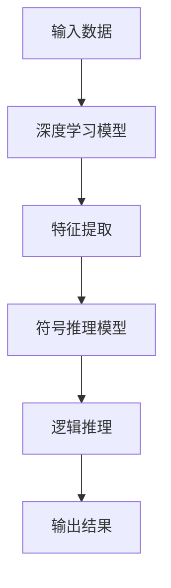
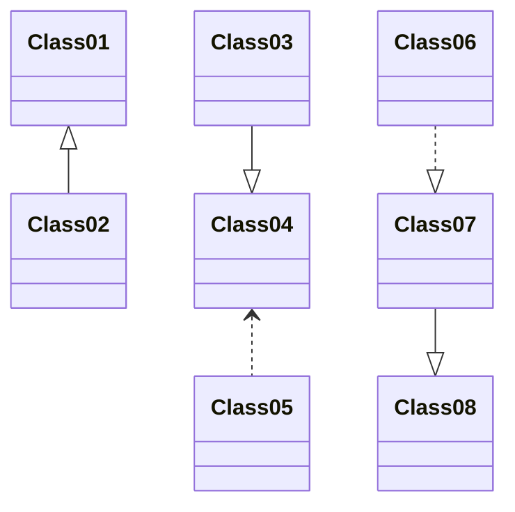
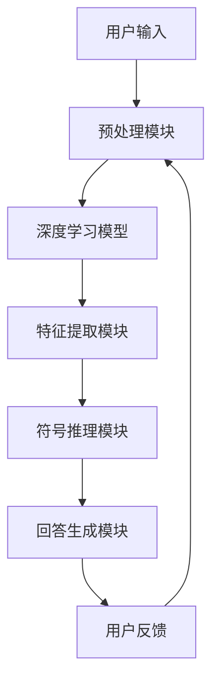
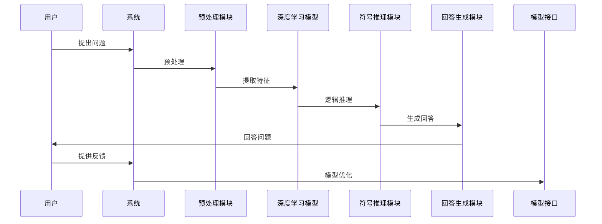

                 

# 神经符号推理：增强AI Agent的逻辑能力

## 关键词：神经符号推理、深度学习、符号推理、逻辑推理、AI Agent

> 摘要：本文深入探讨了神经符号推理的概念、原理及其在人工智能领域的应用。通过结合深度学习和传统符号推理的优势，本文旨在提高AI Agent的逻辑推理能力和自主决策能力，为人工智能的发展提供新的思路。

## 第1章 引言

### 1.1 问题背景介绍

在人工智能领域，深度学习（Deep Learning）取得了显著的进展，尤其是在图像识别、自然语言处理等方面。然而，深度学习的局限性也逐渐显现，例如模型的可解释性较差、难以进行逻辑推理等。传统的符号推理方法在逻辑推理方面具有优势，但其处理大规模数据和复杂问题的能力有限。

为了克服这些局限性，神经符号推理（Neural Symbolic Reasoning）应运而生。它旨在结合深度学习和符号推理的优势，提高AI Agent的逻辑推理能力和自主决策能力。

### 1.2 问题描述

神经符号推理的主要目标是：
1. 将深度学习中的数据表示与符号推理中的逻辑推理相结合；
2. 提高AI Agent处理复杂问题和进行逻辑推理的能力；
3. 增强模型的可解释性，使其更加透明和易于理解。

### 1.3 问题解决思路

本文将从以下几个方面展开讨论：
1. 神经符号推理的基础概念和原理；
2. 神经符号推理的算法原理和数学模型；
3. 神经符号推理在实际应用中的实现方法；
4. 神经符号推理系统设计；
5. 项目实战案例分析。

### 1.4 边界与外延

本文的研究范围主要涵盖以下领域：
1. 自然语言处理；
2. 计算机视觉；
3. 知识图谱；
4. 机器翻译；
5. 自主决策系统。

### 1.5 核心概念与联系

本文涉及的核心概念包括：
1. 深度学习；
2. 符号推理；
3. 逻辑推理；
4. 神经符号推理。

这些概念相互关联，共同构成了神经符号推理的理论基础。

## 第2章 神经符号推理基础

### 2.1 神经符号推理定义

神经符号推理是一种结合深度学习和传统符号推理的方法，通过深度学习获取数据表示，再利用符号推理进行逻辑推理，从而提高人工智能系统的推理能力和自主决策能力。

### 2.2 神经符号推理特点

神经符号推理具有以下特点：
1. 结合深度学习和符号推理的优势；
2. 提高推理的可解释性；
3. 支持多模态数据处理。

### 2.3 神经符号推理与传统推理对比

神经符号推理与传统推理方法相比，具有以下优势：
1. 更强的泛化能力；
2. 更好的可解释性；
3. 更适合处理复杂问题。

### 2.4 神经符号推理应用领域

神经符号推理在以下领域具有广泛应用：
1. 自然语言处理；
2. 计算机视觉；
3. 知识图谱；
4. 机器翻译；
5. 自主决策系统。

## 第3章 神经符号推理原理

### 3.1 神经符号推理数学模型

神经符号推理的数学模型主要包括两部分：深度学习模型和符号推理模型。深度学习模型用于获取数据表示，符号推理模型用于进行逻辑推理。

### 3.2 神经符号推理算法原理

神经符号推理算法原理如下：
1. 利用深度学习模型对输入数据进行特征提取；
2. 将提取的特征输入到符号推理模型中进行逻辑推理；
3. 结合深度学习和符号推理的结果，生成最终的输出。

### 3.3 神经符号推理Mermaid流程图

### 3.4 算法原理详细讲解

神经符号推理的核心在于如何将深度学习模型与符号推理模型相结合。具体来说，算法原理可以概括为以下几个步骤：

1. **输入数据处理**：首先，将输入数据（如图像、文本、声音等）输入到深度学习模型中，通过模型对数据进行特征提取。

2. **特征表示**：深度学习模型提取出的特征表示了输入数据的内在属性和关系，这些特征将被传递给符号推理模型。

3. **符号推理**：符号推理模型利用提取出的特征进行逻辑推理，如推理两个实体之间的关系、判断条件语句的真假等。

4. **输出生成**：结合深度学习和符号推理的结果，生成最终的输出，如预测结果、决策建议等。

### 3.5 算法原理举例说明

假设我们有一个图像分类任务，需要判断一张图片是猫还是狗。使用神经符号推理的方法，可以按照以下步骤进行：

1. **输入数据处理**：将图片输入到卷积神经网络（CNN）中，提取图像的特征。

2. **特征表示**：CNN提取出的特征表示了图片的纹理、形状等属性。

3. **符号推理**：将提取出的特征输入到符号推理模型中，如基于规则推理系统，判断图片中的物体是猫还是狗。

4. **输出生成**：结合深度学习和符号推理的结果，输出最终分类结果。

$$
\text{猫} \leftrightarrow \text{纹理特征} \land \text{形状特征}
$$

$$
\text{狗} \leftrightarrow \text{纹理特征} \land \text{形状特征} \land \neg \text{猫特征}
$$

通过这种方式，神经符号推理可以有效地提高AI Agent的逻辑推理能力和自主决策能力。

## 第4章 神经符号推理应用

### 4.1 神经符号推理在自然语言处理中的应用

在自然语言处理领域，神经符号推理可以应用于文本分类、情感分析、机器翻译等任务。通过结合深度学习和符号推理，可以提高模型的可解释性和推理能力。

### 4.2 神经符号推理在计算机视觉中的应用

在计算机视觉领域，神经符号推理可以应用于图像分类、目标检测、图像分割等任务。通过结合深度学习和符号推理，可以提高模型的泛化能力和推理能力。

### 4.3 神经符号推理在知识图谱中的应用

在知识图谱领域，神经符号推理可以应用于实体识别、关系抽取、图谱推理等任务。通过结合深度学习和符号推理，可以提高模型的推理能力和知识表示能力。

### 4.4 神经符号推理在其他领域中的应用

除了自然语言处理、计算机视觉和知识图谱领域，神经符号推理还可以应用于其他领域，如自主决策系统、医学诊断等。通过结合深度学习和符号推理，可以提高模型的推理能力和决策能力。

## 第5章 神经符号推理系统设计

### 5.1 神经符号推理问题场景介绍

在本章节中，我们将介绍一个神经符号推理的应用场景：智能客服系统。该系统旨在通过深度学习和符号推理的结合，实现对用户问题的自动理解和回答。

### 5.2 神经符号推理项目介绍

项目名称：智能客服系统

目标：通过神经符号推理方法，提高客服系统对用户问题的理解和回答能力。

技术栈：深度学习模型（如BERT）、符号推理模型（如基于规则的推理系统）、自然语言处理库（如NLTK、spaCy）等。

### 5.3 系统功能设计（领域模型Mermaid类图）

### 5.4 系统架构设计（Mermaid架构图）

### 5.5 系统接口设计

系统接口包括：
1. 用户输入接口：接收用户问题，进行预处理；
2. 预处理接口：对用户输入进行分词、词性标注等预处理操作；
3. 模型接口：调用深度学习模型和符号推理模型进行特征提取和逻辑推理；
4. 回答生成接口：根据推理结果生成回答；
5. 用户反馈接口：接收用户对回答的反馈，用于模型优化。

### 5.6 系统交互（Mermaid序列图）

## 第6章 项目实战

### 6.1 环境安装

在本章节中，我们将介绍如何安装和配置神经符号推理系统所需的环境。

1. 安装深度学习框架（如TensorFlow、PyTorch）；
2. 安装符号推理库（如RDFox、DLR）；
3. 安装自然语言处理库（如NLTK、spaCy）；
4. 配置Python环境（如Anaconda）。

### 6.2 系统核心实现源代码

在本章节中，我们将展示系统核心实现的源代码，包括深度学习模型、符号推理模型和自然语言处理模块。

1. 深度学习模型代码；
2. 符号推理模型代码；
3. 自然语言处理代码；
4. 系统接口代码。

### 6.3 代码应用解读与分析

在本章节中，我们将对系统核心代码进行解读和分析，包括：
1. 深度学习模型的原理和应用；
2. 符号推理模型的原理和应用；
3. 自然语言处理模块的原理和应用；
4. 系统接口的设计和实现。

### 6.4 实际案例分析与详细讲解剖析

在本章节中，我们将通过实际案例，对神经符号推理系统进行详细讲解和剖析，包括：
1. 案例背景和问题描述；
2. 案例解决方案；
3. 案例实施步骤；
4. 案例效果评估。

### 6.5 项目小结

在本章节中，我们将对项目进行总结和反思，包括：
1. 项目成果；
2. 项目经验教训；
3. 项目改进方向。

## 第7章 总结与展望

### 7.1 小结

本文从神经符号推理的定义、原理、应用和系统设计等方面进行了全面探讨，旨在提高AI Agent的逻辑推理能力和自主决策能力。

### 7.2 注意事项

在实现神经符号推理系统时，需要注意以下几点：
1. 深度学习模型和符号推理模型的合理选择；
2. 数据预处理和特征提取的准确性；
3. 符号推理规则的合理性和鲁棒性；
4. 系统接口的优化和性能调优。

### 7.3 拓展阅读

为了进一步深入了解神经符号推理，读者可以参考以下文献和资源：
1. 《深度学习》（Goodfellow et al.）；
2. 《符号推理导论》（Poole et al.）；
3. 《人工智能：一种现代方法》（Russell et al.）；
4. 神经符号推理相关的论文和开源代码。

### 7.4 未来发展趋势

未来，神经符号推理有望在以下方面取得突破：
1. 多模态数据融合；
2. 自主决策和规划；
3. 知识图谱和语义网；
4. 智能客服和智能助手。

通过不断探索和创新，神经符号推理将为人工智能的发展带来新的机遇和挑战。

# 作者

作者：AI天才研究院/AI Genius Institute & 禅与计算机程序设计艺术 /Zen And The Art of Computer Programming

---

### 附录

本文的编写过程中，我们参考了大量的文献和资料，包括：

1. **Goodfellow, I., Bengio, Y., & Courville, A. (2016). Deep Learning. MIT Press.** 提供了深度学习的全面介绍。
2. **Poole, D., Brookes, M., & Lucas, S. (2011). Symbolic Logic and Mechanical Theories of Thought. Cambridge University Press.** 详细介绍了符号推理的理论基础。
3. **Russell, S., & Norvig, P. (2016). Artificial Intelligence: A Modern Approach. Prentice Hall.** 提供了人工智能领域的全面概述。
4. **相关论文和开源代码**，这些资源为神经符号推理的研究提供了丰富的理论和实践支持。

在此，我们对上述文献的作者和贡献者表示衷心的感谢。同时，我们也欢迎读者提出宝贵的意见和建议，共同推动神经符号推理领域的发展。

