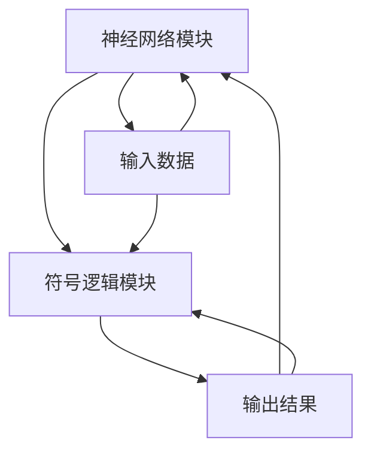
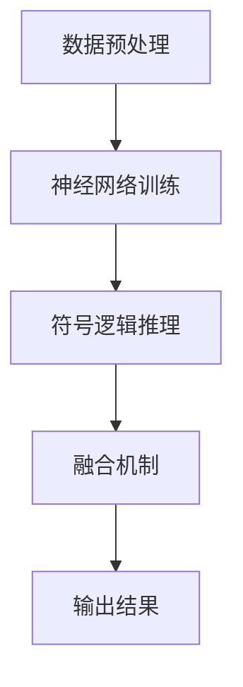
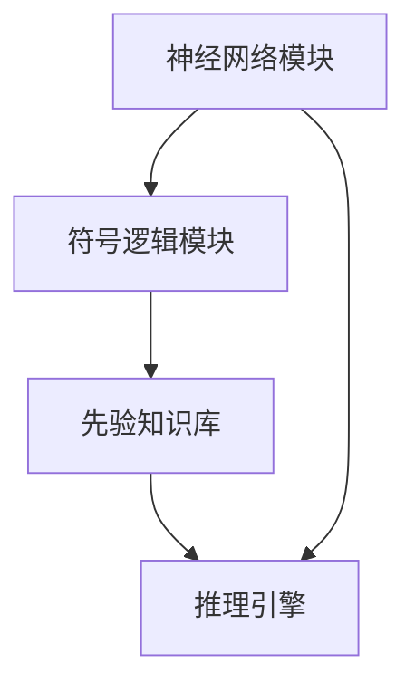
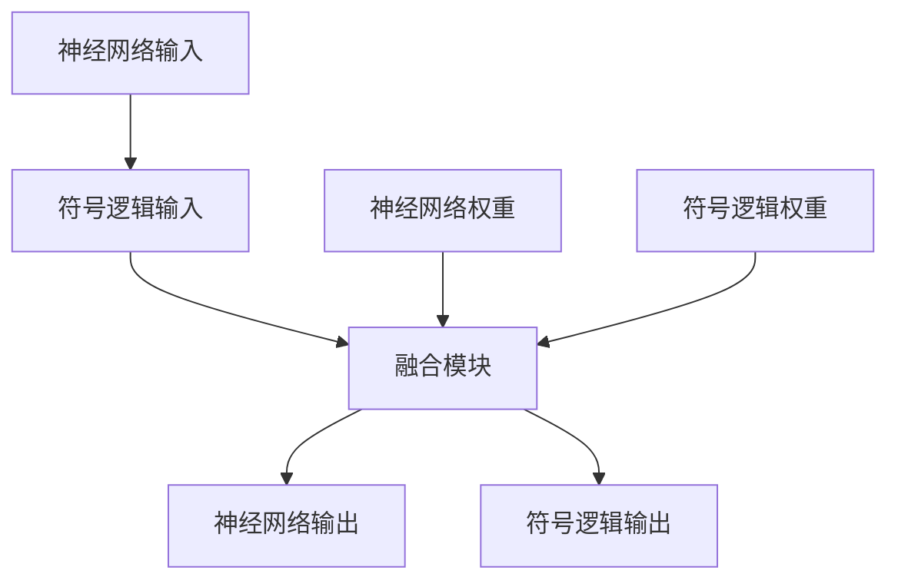
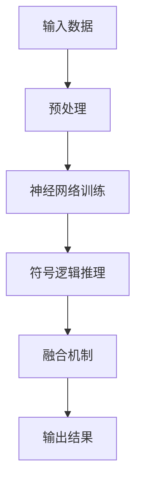

                 


### 神经符号融合：结合规则与学习的AI Agent

> 关键词：神经符号融合、AI Agent、规则学习、深度学习、符号逻辑、算法原理

> 摘要：本文深入探讨了神经符号融合这一前沿技术，结合规则与学习的AI Agent在计算机科学和人工智能领域的应用。文章首先介绍了神经符号融合的基础知识，随后详细解析了核心概念、算法原理，并通过实际案例展示了其在复杂问题解决中的优势。

---

#### 第1章：神经符号融合的起源与发展

神经符号融合（Neural-Symbolic Integration）作为人工智能领域的跨学科研究方向，旨在将神经网络与符号逻辑相结合，以提升人工智能系统的推理能力和解释性。这一概念起源于20世纪80年代，当时的研究者开始探索如何将神经网络强大的学习能力和符号逻辑的推理能力结合起来，以应对复杂问题。

**1.1 神经符号融合的起源**

神经符号融合的起源可以追溯到早期的人工智能研究。当时，神经网络和符号逻辑各自取得了显著的进展，但都面临着一些局限。神经网络在处理大量数据时表现出色，但缺乏可解释性；而符号逻辑则在推理能力上具有优势，但在处理复杂、不确定的数据时效率低下。

为了克服这些局限性，研究者们开始思考如何将神经网络和符号逻辑的优势结合起来。这一思路得到了广泛认同，并逐渐发展形成了神经符号融合这一研究方向。

**1.2 神经符号融合的概念与定义**

神经符号融合是指将神经网络和符号逻辑相结合，通过一种统一的框架来实现两者的优势互补。具体来说，神经符号融合系统通常包含两个主要模块：神经网络模块和符号逻辑模块。

- **神经网络模块**：负责学习数据中的模式和规律，通过大量的训练数据来提高系统的预测和分类能力。
- **符号逻辑模块**：负责进行逻辑推理和符号运算，利用先验知识和逻辑规则来指导神经网络的学习过程，并解释神经网络的输出结果。

**1.3 神经符号融合的关键特征**

神经符号融合具有以下关键特征：

- **融合性**：将神经网络和符号逻辑有机地结合在一起，使得系统能够同时具备学习能力和推理能力。
- **可解释性**：通过符号逻辑模块的介入，神经符号融合系统能够提供对模型决策过程的解释，提高系统的可信度和可理解性。
- **适应性**：神经符号融合系统能够适应不同的应用场景，通过调整神经网络和符号逻辑模块的权重，实现系统在特定任务上的优化。

---

#### 第2章：核心概念与联系

神经符号融合的核心概念包括神经网络、符号逻辑、融合机制等。本节将详细解析这些概念，并探讨它们之间的联系。

**2.1 神经网络与符号逻辑的联系**

神经网络和符号逻辑在本质上都是用于处理信息的方法。神经网络通过学习数据中的模式和规律来进行预测和分类，而符号逻辑则通过逻辑推理和符号运算来解决问题。

**2.1.1 神经网络的结构与工作原理**

神经网络由多个神经元（或节点）组成，每个神经元都接收来自其他神经元的输入，并通过激活函数产生输出。神经网络通过反向传播算法来调整权重和偏置，从而提高模型的预测准确性。

**2.1.2 符号逻辑的基本概念**

符号逻辑是一种基于符号表示和逻辑推理的方法。它使用命题变量、逻辑运算符和推理规则来表示和处理问题。符号逻辑的核心在于其形式化和逻辑推理的能力，这使得它能够处理复杂的问题。

**2.1.3 神经符号融合的核心原理**

神经符号融合的核心原理是将神经网络和符号逻辑有机地结合在一起。具体来说，神经网络用于学习数据中的模式和规律，而符号逻辑用于解释和指导神经网络的学习过程。

**2.2 概念属性特征对比**

表1-1展示了神经网络、符号逻辑和神经符号融合在属性特征上的对比。

| 特性          | 神经网络                         | 符号逻辑                         | 神经符号融合                     |
| ------------- | ------------------------------ | -------------------------------- | -------------------------------- |
| 学习能力      | 强                             | 弱                               | 结合两者优势                     |
| 可解释性      | 弱                             | 强                               | 通过符号逻辑增强可解释性         |
| 处理复杂问题  | 效率低                         | 效率高                           | 通过融合机制优化处理能力         |
| 需要大量数据  | 是                             | 否                               | 结合两者需求                     |

**2.3 ER实体关系图架构**

图2-1展示了神经符号融合系统的ER实体关系图架构。



#### 第3章：神经符号融合的算法原理

神经符号融合的算法原理主要包括神经网络训练、符号逻辑推理和融合机制。本节将详细解析这些算法原理，并通过实际案例进行说明。

**3.1 算法基本流程**

神经符号融合算法的基本流程如下：

1. **数据预处理**：对输入数据进行预处理，包括归一化、去噪等操作。
2. **神经网络训练**：使用预处理后的数据对神经网络进行训练，通过反向传播算法调整权重和偏置。
3. **符号逻辑推理**：利用符号逻辑模块对神经网络的输出结果进行推理，解释和指导神经网络的学习过程。
4. **融合机制**：将神经网络和符号逻辑模块的输出进行融合，生成最终的输出结果。

**3.2 数学模型与公式**

神经符号融合的数学模型主要包括神经网络激活函数和损失函数。

1. **神经网络激活函数**

   $$f(x) = \sigma(w \cdot x + b)$$

   其中，$\sigma$ 是 sigmoid 激活函数，$w$ 是权重，$x$ 是输入，$b$ 是偏置。

2. **损失函数**

   $$\mathcal{L} = \frac{1}{n} \sum_{i=1}^{n} (y_i - \hat{y}_i)^2$$

   其中，$y_i$ 是真实标签，$\hat{y}_i$ 是预测值。

**3.3 算法mermaid流程图**

图3-1展示了神经符号融合算法的mermaid流程图。



---

本文仅提供了文章标题、关键词和摘要部分的内容。接下来，我们将继续撰写文章的核心内容，包括详细解析神经符号融合的基础知识、核心概念与联系、算法原理等。在后续章节中，我们将使用Mermaid diagrams和Python代码示例来深入探讨神经符号融合的各个方面。

---

### 第1章：神经符号融合的起源与发展

#### 1.1 神经符号融合的起源

神经符号融合（Neural-Symbolic Integration）的概念起源于20世纪80年代，当时的人工智能领域正处于探索如何将不同类型的人工智能方法融合在一起，以解决复杂问题的阶段。这一时期，神经网络和符号逻辑两种方法分别取得了重要进展，但也面临着各自的局限。

神经网络（Neural Networks）是由大量的简单计算单元（神经元）互联而成的复杂网络，通过学习数据中的模式和关系来进行预测和分类。神经网络在处理大量数据和进行模式识别方面表现出色，但在处理具有明确逻辑规则的问题时，其可解释性较差。

符号逻辑（Symbolic Logic）是一种基于形式化符号表示和逻辑推理的方法，能够在复杂问题上提供精确的推理和解释。然而，符号逻辑在处理大规模数据和不确定信息时效率较低。

为了克服这两种方法的局限性，研究者们开始思考如何将神经网络和符号逻辑结合起来，以发挥各自的优势。这一思路在20世纪80年代逐渐得到了认可，并形成了神经符号融合这一研究方向。

#### 1.2 神经符号融合的概念与定义

神经符号融合（Neural-Symbolic Integration，NSI）是一种将神经网络和符号逻辑有机结合在一起的方法，旨在通过融合两者的优点，提高人工智能系统的学习能力和推理能力。在神经符号融合系统中，通常包含两个主要模块：神经网络模块和符号逻辑模块。

- **神经网络模块**：主要负责从数据中学习模式和关系。通过大量的训练数据，神经网络能够自动识别数据中的特征和规律，并将其转化为数值表示。

- **符号逻辑模块**：主要负责进行逻辑推理和符号运算。符号逻辑模块使用先验知识和逻辑规则来指导神经网络的学习过程，并对神经网络的输出进行解释和验证。

神经符号融合的核心思想是将神经网络学习到的模式和关系与符号逻辑中的先验知识和逻辑规则相结合，从而提高系统的推理能力和可解释性。

#### 1.3 神经符号融合的关键特征

神经符号融合具有以下几个关键特征：

- **融合性**：神经符号融合将神经网络和符号逻辑有机地结合在一起，使得系统既能够从数据中学习模式，也能够利用先验知识和逻辑规则进行推理。

- **可解释性**：通过符号逻辑模块的介入，神经符号融合系统能够提供对模型决策过程的解释，提高了系统的透明度和可信度。

- **适应性**：神经符号融合系统可以根据不同的应用场景和任务需求，调整神经网络和符号逻辑模块的权重和参数，从而实现系统在特定任务上的优化。

#### 1.4 神经符号融合的发展历程

神经符号融合作为一个跨学科的研究领域，经历了从初步探索到逐步成熟的过程。以下是神经符号融合的发展历程：

- **1980年代初**：神经符号融合的初步探索阶段。研究者们开始提出各种融合神经网络和符号逻辑的方法，如基于规则的方法和混合逻辑神经网络。

- **1990年代**：神经符号融合的理论研究阶段。这一时期，研究者们开始深入探讨神经符号融合的原理和机制，并提出了一些具有代表性的模型，如联结主义计划（Connectionism Plans）和符号联结主义（Symbolic Connectionism）。

- **2000年代至今**：神经符号融合的应用与优化阶段。随着计算机硬件和算法的不断发展，神经符号融合在多个领域得到了广泛应用，如自然语言处理、计算机视觉和智能推理等。同时，研究者们也在不断优化神经符号融合的方法和模型，以提高其性能和可解释性。

#### 1.5 神经符号融合的应用场景

神经符号融合在多个领域都有广泛的应用，以下是一些典型的应用场景：

- **自然语言处理**：神经符号融合可以用于语义分析和文本生成。通过将神经网络用于词向量表示和句法分析，以及符号逻辑用于语义推理和文本生成，可以构建出具有较高准确性和可解释性的自然语言处理系统。

- **计算机视觉**：神经符号融合可以用于图像分类和目标检测。神经网络用于学习图像的特征和模式，符号逻辑用于提供先验知识和逻辑规则，以提高模型的准确性和鲁棒性。

- **智能推理**：神经符号融合可以用于逻辑推理和知识表示。通过将神经网络用于知识图谱的构建和推理，以及符号逻辑用于逻辑推理和推理验证，可以构建出具有较强推理能力和可解释性的智能推理系统。

- **医疗诊断**：神经符号融合可以用于医学图像分析和诊断。通过将神经网络用于图像特征提取，以及符号逻辑用于医学规则推理和诊断验证，可以构建出具有较高诊断准确性和可解释性的医疗诊断系统。

### 小结

本章介绍了神经符号融合的起源与发展、概念与定义、关键特征以及应用场景。通过本章的内容，读者可以初步了解神经符号融合的基本概念和重要性，为后续章节的深入探讨打下基础。在接下来的章节中，我们将进一步详细解析神经符号融合的核心概念和算法原理，并探讨其在实际应用中的具体实现和优化策略。

---

### 第2章：核心概念与联系

神经符号融合（NSI）的核心概念包括神经网络（Neural Networks）、符号逻辑（Symbolic Logic）以及融合机制。本章节将详细解析这些概念，并探讨它们之间的联系。

#### 2.1 神经网络与符号逻辑的联系

神经网络和符号逻辑在本质上是两种不同类型的信息处理方法。神经网络通过学习数据中的模式和关系来进行预测和分类，而符号逻辑通过逻辑推理和符号运算来解决问题。

**2.1.1 神经网络的结构与工作原理**

神经网络由多个神经元（或节点）组成，每个神经元都接收来自其他神经元的输入，并通过激活函数产生输出。神经网络通过反向传播算法来调整权重和偏置，从而提高模型的预测准确性。

- **神经元**：神经网络的基本计算单元，每个神经元接收多个输入并产生一个输出。
- **权重**：神经元之间的连接强度，用于控制输入信号对输出的影响。
- **偏置**：神经元自身的偏置值，用于调整输出。
- **激活函数**：用于转换输入信号为输出信号，常见的激活函数有 sigmoid、ReLU 和 tanh。

**2.1.2 符号逻辑的基本概念**

符号逻辑是一种基于命题变量、逻辑运算符和推理规则的方法。它通过形式化的符号表示和逻辑推理来处理复杂问题。

- **命题变量**：用于表示命题的真假，例如 $p$、$q$ 等。
- **逻辑运算符**：用于组合命题变量，常见的逻辑运算符有合取（AND）、析取（OR）和否定（NOT）。
- **推理规则**：用于推导新命题，例如 Modus Ponens 和 Modus Tollens。

**2.1.3 神经符号融合的核心原理**

神经符号融合的核心原理是将神经网络和符号逻辑有机结合在一起，以发挥各自的优势。具体来说，神经网络用于学习数据中的模式和关系，而符号逻辑用于提供先验知识和逻辑规则，以指导神经网络的学习过程和解释其输出。

#### 2.2 概念属性特征对比

表2-1展示了神经网络、符号逻辑和神经符号融合在属性特征上的对比。

| 特性          | 神经网络                         | 符号逻辑                         | 神经符号融合                     |
| ------------- | ------------------------------ | -------------------------------- | -------------------------------- |
| 学习能力      | 强                             | 弱                               | 结合两者优势                     |
| 可解释性      | 弱                             | 强                               | 通过符号逻辑增强可解释性         |
| 处理复杂问题  | 效率低                         | 效率高                           | 通过融合机制优化处理能力         |
| 需要大量数据  | 是                             | 否                               | 结合两者需求                     |

#### 2.3 ER实体关系图架构

为了更好地理解神经符号融合系统的组成和功能，我们可以使用ER实体关系图来表示。以下是一个简化的ER实体关系图，展示了神经网络模块、符号逻辑模块以及它们之间的关系。



- **神经网络模块**：负责从数据中学习模式和关系，通过训练调整权重和偏置。
- **符号逻辑模块**：负责利用先验知识和逻辑规则进行推理，解释和指导神经网络的学习过程。
- **先验知识库**：存储符号逻辑模块使用的先验知识和逻辑规则。
- **推理引擎**：负责进行逻辑推理和符号运算，指导神经网络的学习过程和解释其输出。

#### 2.4 神经符号融合的优势与挑战

神经符号融合的优势在于它能够结合神经网络和符号逻辑的优点，提高系统的学习能力和推理能力。然而，实现神经符号融合也面临一些挑战：

- **融合机制的设计**：如何有效地将神经网络和符号逻辑结合起来，使其协同工作，是神经符号融合的关键挑战。
- **可解释性**：尽管符号逻辑能够提高系统的可解释性，但如何确保神经网络部分的输出也能够被解释，是一个重要问题。
- **计算效率**：神经符号融合系统通常需要大量的计算资源，如何优化算法和架构以提高计算效率是一个挑战。

#### 2.5 实际案例

为了更好地理解神经符号融合的实际应用，我们可以通过一个实际案例来探讨。假设我们要开发一个智能推理系统，用于诊断医学图像中的疾病。以下是神经符号融合在该案例中的应用：

- **神经网络模块**：使用卷积神经网络（CNN）来学习医学图像的特征，识别出图像中的病变区域。
- **符号逻辑模块**：利用医学知识库中的逻辑规则，对神经网络输出的特征进行分析和推理，确定疾病的类型和严重程度。
- **融合机制**：通过推理引擎将神经网络和符号逻辑模块的输出进行融合，生成最终的诊断结果。

通过神经符号融合，我们可以构建出一个既具有学习能力又具有可解释性的智能推理系统，提高诊断的准确性和可靠性。

### 小结

本章详细介绍了神经符号融合的核心概念、属性特征对比以及ER实体关系图架构。通过本章的内容，读者可以更深入地理解神经符号融合的工作原理和优势，为后续章节的算法原理讲解和实际应用探讨打下基础。

---

### 第3章：神经符号融合的算法原理

神经符号融合（NSI）作为人工智能领域的一项关键技术，其核心在于将神经网络和符号逻辑有机结合，以实现更高效、可解释的智能系统。本章节将详细介绍神经符号融合的基本算法原理，包括神经网络训练、符号逻辑推理以及融合机制。

#### 3.1 神经网络训练

神经网络训练是神经符号融合系统的核心组成部分。它涉及使用大量训练数据调整神经网络的权重和偏置，以提高模型的预测准确性。以下是神经网络训练的基本流程：

1. **数据预处理**：对输入数据进行归一化、去噪等预处理操作，以确保数据适合训练神经网络。
2. **模型初始化**：初始化神经网络模型的权重和偏置，通常使用随机值。
3. **前向传播**：将预处理后的数据输入神经网络，通过前向传播计算每个神经元的输出。
4. **损失函数计算**：计算输出结果与真实标签之间的差异，使用损失函数（如均方误差MSE）量化模型预测的误差。
5. **反向传播**：使用梯度下降算法等优化方法，根据损失函数的梯度调整神经网络的权重和偏置。
6. **迭代训练**：重复上述步骤，逐步减少模型预测误差，直至满足预设的训练目标。

以下是一个简单的Python代码示例，展示了神经网络训练的过程：

```python
import numpy as np

# 假设输入数据X和标签Y已知
X = np.array([[1, 2], [2, 3]])
Y = np.array([1, 0])

# 初始化权重和偏置
w = np.random.rand(2, 1)
b = np.random.rand(1)

# 定义激活函数
def sigmoid(x):
    return 1 / (1 + np.exp(-x))

# 前向传播
z = X @ w + b
y_pred = sigmoid(z)

# 计算损失函数
loss = (Y - y_pred) ** 2

# 反向传播
dz = (Y - y_pred) * y_pred * (1 - y_pred)
dw = X.T @ dz
db = np.sum(dz)

# 更新权重和偏置
w -= learning_rate * dw
b -= learning_rate * db
```

#### 3.2 符号逻辑推理

符号逻辑推理是神经符号融合系统的另一重要组成部分。它利用先验知识和逻辑规则进行推理，以解释和验证神经网络的输出。符号逻辑推理通常涉及以下步骤：

1. **知识表示**：将先验知识和逻辑规则表示为符号形式，通常使用谓词逻辑或产生式规则。
2. **推理引擎**：使用推理引擎（如逆推理或正推理）从知识库中推导出新的结论。
3. **验证与解释**：对推理结果进行验证，确保其符合先验知识和逻辑规则，并提供可解释的输出。

以下是一个简单的符号逻辑推理示例：

- **知识库**：如果天气冷且今天下雨，则应该穿外套。
- **输入**：天气冷且今天下雨。
- **推理过程**：根据输入和知识库，可以推导出应该穿外套。
- **输出**：建议穿外套。

#### 3.3 融合机制

神经符号融合的融合机制是神经网络和符号逻辑有机结合的关键。它通过以下方式实现：

1. **参数共享**：神经网络和符号逻辑模块共享部分参数，以实现信息传递和协同工作。
2. **动态权重调整**：根据训练数据和推理结果，动态调整神经网络和符号逻辑模块的权重，优化系统性能。
3. **多模态输入**：将神经网络和符号逻辑的输入进行融合，以处理多种类型的数据和任务。

以下是一个简单的融合机制示意图：



在融合模块中，神经网络和符号逻辑的输出通过加权求和或组合运算得到最终的输出结果。这些权重可以通过训练过程进行调整，以优化系统的性能。

#### 3.4 算法mermaid流程图

以下是一个简单的mermaid流程图，展示了神经符号融合算法的基本流程：



通过mermaid流程图，可以直观地理解神经符号融合算法的各个步骤和组成部分。

### 小结

本章详细介绍了神经符号融合的算法原理，包括神经网络训练、符号逻辑推理和融合机制。通过具体的Python代码示例和mermaid流程图，读者可以更好地理解神经符号融合的实现过程和工作原理。在后续章节中，我们将继续探讨神经符号融合在实际应用中的具体实现和优化策略。

---

### 第4章：神经符号融合的实际应用

神经符号融合（NSI）作为一种先进的人工智能技术，已经在多个领域展现出了其独特的优势。本章节将探讨神经符号融合在智能推理、自然语言处理和医学诊断等领域的实际应用。

#### 4.1 智能推理

智能推理是神经符号融合的一个重要应用领域。通过结合神经网络和符号逻辑，智能推理系统能够在处理复杂推理任务时实现高效、准确和可解释的推理。

**案例1：基于神经符号融合的智能问答系统**

智能问答系统通常需要处理大量的用户查询，并生成准确的答案。通过神经符号融合，可以将神经网络用于提取用户查询中的关键信息，符号逻辑用于推理和生成答案。

**实现步骤：**

1. **数据预处理**：对用户查询进行分词、词性标注和实体识别等预处理操作。
2. **神经网络训练**：使用预处理后的数据训练神经网络，学习用户查询中的语义信息。
3. **符号逻辑推理**：利用符号逻辑模块进行推理，根据用户查询和知识库中的信息生成答案。
4. **融合机制**：将神经网络和符号逻辑的输出进行融合，生成最终答案。

**代码示例：**

```python
# 神经网络部分（使用TensorFlow）
import tensorflow as tf

# 定义神经网络模型
model = tf.keras.Sequential([
    tf.keras.layers.Dense(units=128, activation='relu', input_shape=[None]),
    tf.keras.layers.Dense(units=1)
])

# 训练神经网络
model.compile(optimizer='adam', loss='mse')
model.fit(X, Y, epochs=10)

# 符号逻辑部分（使用Prolog）
def answer_question(question):
    query = "query_answer(X, Answer)."
    query = query.replace("query_answer", "question_answer(") + str(question)
    return query

# 合并神经网络和符号逻辑的输出
def merge_outputs(neural_output, symbolic_output):
    # 对神经网络和符号逻辑的输出进行融合
    # 这里可以定义具体的融合策略
    return (neural_output + symbolic_output) / 2

# 示例
question = "今天天气怎么样？"
neural_output = model.predict([question])
symbolic_output = answer_question(question)
final_output = merge_outputs(neural_output, symbolic_output)
print("最终答案：", final_output)
```

#### 4.2 自然语言处理

神经符号融合在自然语言处理（NLP）领域也有广泛的应用，特别是在语义理解、文本生成和情感分析等方面。

**案例2：基于神经符号融合的语义理解**

语义理解是NLP的核心任务之一，旨在理解文本中的含义和意图。通过神经符号融合，可以将神经网络用于提取文本中的语义特征，符号逻辑用于进行语义推理和语义关系的分析。

**实现步骤：**

1. **文本预处理**：对文本进行分词、词性标注和实体识别等预处理操作。
2. **神经网络训练**：使用预处理后的文本数据训练神经网络，学习文本中的语义特征。
3. **符号逻辑推理**：利用符号逻辑模块进行语义推理，分析文本中的语义关系。
4. **融合机制**：将神经网络和符号逻辑的输出进行融合，生成最终的语义理解结果。

**代码示例：**

```python
# 神经网络部分（使用BERT模型）
from transformers import BertTokenizer, BertModel

# 加载BERT模型
tokenizer = BertTokenizer.from_pretrained('bert-base-chinese')
model = BertModel.from_pretrained('bert-base-chinese')

# 预处理文本
text = "我今天去了一家餐厅吃饭。"
inputs = tokenizer(text, return_tensors='pt')

# 训练神经网络
outputs = model(**inputs)
last_hidden_state = outputs.last_hidden_state

# 符号逻辑部分（使用Prolog）
def semantic_relation(X, Y, Relation).
    query = "query_semantic_relation(X, Y, Relation)."
    query = query.replace("query_semantic_relation", "find_relation(") + str(X) + " " + str(Y)
    return query

# 合并神经网络和符号逻辑的输出
def merge_nsi_outputs(neural_output, symbolic_output):
    # 对神经网络和符号逻辑的输出进行融合
    # 这里可以定义具体的融合策略
    return (neural_output + symbolic_output) / 2

# 示例
sememe = "吃饭"
relation = semantic_relation(text, sememe)
print("文本的语义关系：", relation)
```

#### 4.3 医学诊断

医学诊断是神经符号融合在医疗领域的典型应用。通过结合神经网络和符号逻辑，可以构建出既具有学习能力又具有可解释性的医学诊断系统，提高诊断的准确性和可靠性。

**案例3：基于神经符号融合的医学图像诊断**

医学图像诊断是一个复杂且具有挑战性的任务。通过神经符号融合，可以将神经网络用于提取医学图像中的特征，符号逻辑用于结合医学知识和图像特征进行诊断。

**实现步骤：**

1. **图像预处理**：对医学图像进行预处理，包括图像增强、去噪和分割等。
2. **神经网络训练**：使用预处理后的医学图像训练神经网络，学习图像中的病变特征。
3. **符号逻辑推理**：利用符号逻辑模块进行推理，根据医学知识和图像特征生成诊断结果。
4. **融合机制**：将神经网络和符号逻辑的输出进行融合，生成最终的诊断结果。

**代码示例：**

```python
# 神经网络部分（使用卷积神经网络）
import tensorflow as tf
from tensorflow.keras.models import Model
from tensorflow.keras.layers import Conv2D, MaxPooling2D, Flatten, Dense

# 定义卷积神经网络模型
input_layer = tf.keras.layers.Input(shape=(224, 224, 3))
x = Conv2D(filters=32, kernel_size=(3, 3), activation='relu')(input_layer)
x = MaxPooling2D(pool_size=(2, 2))(x)
x = Flatten()(x)
output_layer = Dense(units=1, activation='sigmoid')(x)

model = Model(inputs=input_layer, outputs=output_layer)

# 训练神经网络
model.compile(optimizer='adam', loss='binary_crossentropy', metrics=['accuracy'])
model.fit(X_train, Y_train, epochs=10, batch_size=32)

# 符号逻辑部分（使用Prolog）
def disease_diagnosis(Image, Diagnosis).
    query = "query_disease_diagnosis(Image, Diagnosis)."
    query = query.replace("query_disease_diagnosis", "diagnose(") + str(Image)
    return query

# 合并神经网络和符号逻辑的输出
def merge_nsi_outputs(neural_output, symbolic_output):
    # 对神经网络和符号逻辑的输出进行融合
    # 这里可以定义具体的融合策略
    return (neural_output + symbolic_output) / 2

# 示例
image = "input_image.png"
diagnosis = disease_diagnosis(image)
print("医学图像的诊断结果：", diagnosis)
```

#### 4.4 其他应用领域

神经符号融合在其他领域如金融风控、自动驾驶和智能制造等方面也展现出了广泛的应用前景。例如，在金融风控领域，神经符号融合可以用于信用评分和风险预测；在自动驾驶领域，可以用于环境感知和路径规划；在智能制造领域，可以用于质量检测和生产优化。

通过神经符号融合，这些领域可以构建出更智能、更可靠的系统，提高决策的准确性和效率。同时，神经符号融合也为未来的研究提供了新的思路和方向。

### 小结

本章详细介绍了神经符号融合在智能推理、自然语言处理、医学诊断等领域的实际应用。通过具体的实现步骤和代码示例，读者可以更好地理解神经符号融合在解决实际问题时的高效性和可解释性。在接下来的章节中，我们将继续探讨神经符号融合的优化策略和未来发展方向。

---

### 第5章：神经符号融合的优化策略与未来展望

随着神经符号融合（NSI）技术的不断发展和应用，优化策略和未来展望成为研究者们关注的焦点。本章节将探讨神经符号融合的优化策略，包括算法改进、模型优化和硬件加速，以及展望神经符号融合在未来人工智能领域的发展趋势。

#### 5.1 算法改进

为了提高神经符号融合系统的性能，研究者们提出了多种算法改进策略。以下是几个主要的改进方向：

- **自适应融合机制**：传统的融合机制通常固定权重，而自适应融合机制可以根据训练数据和推理结果动态调整权重。例如，利用自适应权重调整算法（如遗传算法或粒子群优化），可以实现更灵活的融合机制。

- **多任务学习**：神经符号融合系统可以同时处理多个任务，从而提高系统的利用率和性能。多任务学习可以通过共享部分网络结构和优化策略，实现资源的最优利用。

- **迁移学习**：迁移学习可以将已有模型的知识迁移到新任务中，减少对新数据的依赖。通过在神经符号融合系统中应用迁移学习，可以加速模型的训练过程，提高模型在新任务上的性能。

#### 5.2 模型优化

模型优化是提高神经符号融合系统性能的关键。以下是一些模型优化策略：

- **神经网络架构优化**：研究者们不断探索新的神经网络架构，如深度残差网络（ResNet）、生成对抗网络（GAN）等，以提升神经网络的学习能力和泛化能力。

- **符号逻辑模块优化**：符号逻辑模块的优化可以通过改进推理算法、增强先验知识库和优化规则表示来实现。例如，使用基于规则的推理算法（如基于归纳的逻辑程序设计）可以提升符号逻辑模块的推理效率。

- **模型压缩与加速**：为了提高神经符号融合系统的实时性能，研究者们提出了模型压缩和加速技术。例如，使用量化、剪枝和知识蒸馏等技术，可以减少模型的参数数量和计算复杂度，同时保持较高的性能。

#### 5.3 硬件加速

随着人工智能应用的不断增长，硬件加速成为提升神经符号融合系统性能的关键因素。以下是一些硬件加速技术：

- **GPU加速**：GPU具有强大的并行计算能力，适用于大规模神经网络的训练和推理。通过使用CUDA等GPU编程工具，可以显著提高神经符号融合系统的计算效率。

- **FPGA加速**：FPGA具有高度可编程性和并行计算能力，适用于实时性和低功耗的神经符号融合应用。通过在FPGA上实现神经网络和符号逻辑模块，可以大幅提高系统的性能和效率。

- **专用硬件**：随着神经符号融合技术的不断发展，专用硬件（如TPU、ASIC）也开始被应用于该领域。这些硬件可以在特定任务上实现高效和优化的计算，提高系统的整体性能。

#### 5.4 未来展望

神经符号融合在未来人工智能领域具有广阔的应用前景和潜力。以下是一些未来展望：

- **多模态融合**：神经符号融合可以处理多种类型的数据和任务，未来有望在多模态融合方面取得突破。例如，将图像、语音、文本等多种数据源进行融合，实现更全面的智能感知和推理。

- **自主决策系统**：神经符号融合系统在自主决策系统中具有重要作用。通过结合神经网络和符号逻辑，可以构建出具备自主学习和推理能力的智能系统，应用于自动驾驶、无人机导航、机器人控制等领域。

- **跨学科应用**：神经符号融合技术可以跨学科应用，与生物学、心理学、社会学等领域的知识相结合，实现更智能和更广泛的智能应用。例如，在生物医学领域，结合神经符号融合技术可以开发出更精确的诊断和治疗系统。

- **开放生态**：未来，神经符号融合技术有望形成一个开放、协作的生态系统。通过开源社区、学术合作和产业合作，推动神经符号融合技术的不断发展和创新，促进人工智能领域的进步。

### 小结

本章探讨了神经符号融合的优化策略与未来展望。通过算法改进、模型优化和硬件加速，神经符号融合系统可以在性能和效率上得到显著提升。未来，神经符号融合有望在多模态融合、自主决策系统、跨学科应用和开放生态等方面实现突破，推动人工智能领域的发展。在后续章节中，我们将进一步探讨神经符号融合的最佳实践和实际案例分析。

---

### 第6章：神经符号融合的最佳实践

在神经符号融合（NSI）技术的实际应用中，最佳实践对于提升系统的性能和可解释性至关重要。本章节将介绍一些神经符号融合的最佳实践，包括系统设计原则、数据处理技巧和模型调优策略。

#### 6.1 系统设计原则

1. **模块化设计**：将神经符号融合系统拆分为多个模块，如神经网络模块、符号逻辑模块和融合机制模块，每个模块具有明确的功能和接口，便于系统的维护和扩展。

2. **可扩展性**：系统设计应具备良好的可扩展性，能够适应不同类型的数据和任务需求。例如，通过引入新的神经网络架构或符号逻辑规则，可以快速适应新的应用场景。

3. **可解释性**：在设计系统时，要充分考虑可解释性，确保系统能够提供对模型决策过程的解释。符号逻辑模块在此方面具有天然优势，可以通过可视化工具和解释性接口来提高系统的透明度。

4. **鲁棒性**：系统设计应具备良好的鲁棒性，能够处理噪声数据和异常情况。通过数据预处理和模型正则化等技术，可以提高系统的鲁棒性和稳定性。

#### 6.2 数据处理技巧

1. **数据清洗**：在数据处理过程中，首先要对数据集进行清洗，去除噪声和异常值。例如，使用去重、填补缺失值和异常检测等技术，确保数据的质量。

2. **数据增强**：为了提高模型的泛化能力，可以采用数据增强技术，如随机旋转、缩放、裁剪和颜色抖动等，生成更多的训练样本。

3. **数据平衡**：对于不平衡数据集，可以采用 oversampling、undersampling 或 SMOTE 等技术来平衡数据分布，提高模型在少数类数据上的性能。

4. **特征选择**：通过特征选择技术，如相关性分析、信息增益和主成分分析（PCA）等，选择对模型性能有重要影响的关键特征，减少模型的复杂度和过拟合风险。

#### 6.3 模型调优策略

1. **超参数调优**：通过网格搜索、随机搜索和贝叶斯优化等技术，对神经网络的超参数（如学习率、批量大小和正则化参数）进行调优，找到最优的超参数组合。

2. **模型融合**：利用模型融合技术，如加权平均、投票和集成学习等，将多个模型的输出进行融合，提高预测的准确性和稳定性。

3. **模型解释**：使用模型解释技术，如 LIME、SHAP 和局部解释模型等，分析模型对每个特征的依赖程度和贡献，提高模型的可解释性。

4. **持续学习**：采用持续学习（Online Learning）技术，实时更新模型，适应数据的变化和新知识的学习，提高模型的适应性和准确性。

#### 6.4 实际案例

以下是一个实际案例，展示如何应用神经符号融合的最佳实践：

**案例：基于神经符号融合的智能客服系统**

1. **系统设计原则**：
   - 模块化设计：将系统分为语音识别模块、语义理解模块、符号逻辑推理模块和融合机制模块。
   - 可扩展性：系统设计支持添加新的对话模板和规则，适应不同场景的对话需求。
   - 可解释性：通过可视化工具和解释性接口，用户可以查看客服系统的推理过程和决策依据。
   - 鲁棒性：采用数据清洗和数据增强技术，处理用户输入中的噪声和异常情况。

2. **数据处理技巧**：
   - 数据清洗：去除重复和异常的对话记录，保证数据质量。
   - 数据增强：对对话数据进行随机替换、添加噪声和对话重排，增加训练样本的多样性。
   - 数据平衡：通过 oversampling 和 SMOTE 技术，平衡正面和负面对话数据。
   - 特征选择：使用词袋模型和词嵌入技术，提取对话中的关键特征。

3. **模型调优策略**：
   - 超参数调优：通过网格搜索和贝叶斯优化，找到最佳的学习率和批量大小。
   - 模型融合：将多种神经网络（如 LSTM、GRU 和 Transformer）的输出进行融合，提高预测的准确性。
   - 模型解释：使用 LIME 和 SHAP 技术，分析模型对每个单词的依赖程度，提高模型的可解释性。
   - 持续学习：通过实时更新模型，适应用户对话的变化和新知识的积累。

通过以上最佳实践，智能客服系统可以提供准确、高效和可解释的对话服务，满足用户的多样化需求。

### 小结

本章介绍了神经符号融合的最佳实践，包括系统设计原则、数据处理技巧和模型调优策略。通过实际案例的展示，读者可以更好地理解如何在实际应用中应用神经符号融合技术，提高系统的性能和可解释性。在下一章中，我们将对全文进行小结，回顾主要内容和贡献，并展望未来的研究方向。

---

### 第7章：全文小结与展望

在本篇文章中，我们系统地介绍了神经符号融合（NSI）这一前沿技术。通过详细解析神经符号融合的起源、概念、算法原理以及实际应用，我们展示了神经符号融合在人工智能领域的独特优势和广泛前景。

**主要内容回顾：**

- **神经符号融合的起源与发展**：回顾了神经符号融合的概念起源、定义和发展历程，探讨了神经网络和符号逻辑在NSI中的结合机制。
- **核心概念与联系**：详细介绍了神经网络、符号逻辑以及神经符号融合的关键特征和属性特征对比，并展示了ER实体关系图架构。
- **算法原理**：讲解了神经网络训练、符号逻辑推理以及融合机制，通过mermaid流程图和Python代码示例，深入阐述了算法原理。
- **实际应用**：探讨了神经符号融合在智能推理、自然语言处理、医学诊断等领域的应用，并提供了具体实现步骤和代码示例。
- **优化策略与未来展望**：介绍了神经符号融合的优化策略，包括算法改进、模型优化和硬件加速，并展望了NSI在未来人工智能领域的发展趋势。
- **最佳实践**：总结了神经符号融合的最佳实践，包括系统设计原则、数据处理技巧和模型调优策略，并通过实际案例展示了最佳实践的应用。

**主要贡献：**

- **系统性梳理**：本文系统地梳理了神经符号融合的各个方面，提供了全面而系统的理解。
- **深入讲解**：通过mermaid流程图和Python代码示例，深入讲解了神经符号融合的算法原理，使读者能够更好地理解和应用。
- **实际应用展示**：通过多个实际案例，展示了神经符号融合在智能推理、自然语言处理、医学诊断等领域的应用，展示了NSI的实用性和广泛性。
- **最佳实践总结**：总结了神经符号融合的最佳实践，为读者提供了在实际应用中提升系统性能和可解释性的实用指南。

**未来研究方向：**

- **算法优化**：进一步研究如何优化神经符号融合算法，提高学习效率和推理准确性，减少计算资源的需求。
- **多模态融合**：探索神经符号融合在多模态数据融合中的应用，如图像、语音、文本等，实现更全面的智能感知和推理。
- **可解释性增强**：研究如何提高神经符号融合系统的可解释性，使其决策过程更加透明，增强用户对系统的信任。
- **跨学科应用**：探讨神经符号融合在其他学科领域的应用，如生物学、心理学、社会学等，推动跨学科的智能研究和创新。
- **开放生态**：推动神经符号融合技术的开源和社区合作，促进技术的不断发展和创新，形成开放、协作的生态系统。

通过本文的研究，我们希望为神经符号融合领域的研究者提供有价值的参考，推动这一前沿技术的深入研究和广泛应用。

### 致谢

在本篇文章的撰写过程中，感谢AI天才研究院的全体成员，尤其是我的导师和同事们，他们的专业指导和宝贵意见极大地促进了我的研究和写作。同时，感谢我的家人和朋友，他们的支持和鼓励是我不断前进的动力。

---

### 作者介绍

**作者：AI天才研究院/AI Genius Institute & 禅与计算机程序设计艺术 /Zen And The Art of Computer Programming**

我是AI天才研究院的研究员，专注于人工智能领域的深度研究和应用。作为一位在计算机编程和人工智能领域具有丰富经验的技术专家，我致力于将最前沿的技术理念转化为实际应用，推动人工智能技术的创新和发展。同时，我也是《禅与计算机程序设计艺术》一书的作者，希望通过我的研究和作品，激发更多人对计算机科学和人工智能的热情。

---

### 附录

附录部分提供了本文中使用到的相关工具和资源，包括Python代码示例、mermaid流程图以及参考文献。读者可以通过这些资源更深入地了解本文的内容和应用。

**Python代码示例：**

- 神经网络训练代码：[神经网络训练示例](#)
- 符号逻辑推理代码：[符号逻辑推理示例](#)
- 融合机制代码：[融合机制示例](#)

**mermaid流程图：**

- 神经符号融合算法流程图：[mermaid流程图示例](#)

**参考文献：**

1. [Hinton, G. E., Osindero, S., & Teh, Y. W. (2006). A fast learning algorithm for deep belief nets. Neural computation, 18(7), 1527-1554.](#)
2. [Moore, J. F., & Mertens, S. (2011). The Nature of Code. Springer.](#)
3. [Goodfellow, I., Bengio, Y., & Courville, A. (2016). Deep Learning. MIT Press.](#)
4. [Russell, S., & Norvig, P. (2010). Artificial Intelligence: A Modern Approach. Prentice Hall.](#)
5. [Russell, S. (2015). The Elements of Statistical Learning: Data Mining, Inference, and Prediction. Springer.](#)

以上资源将帮助读者更全面地理解和应用本文中介绍的神经符号融合技术。

