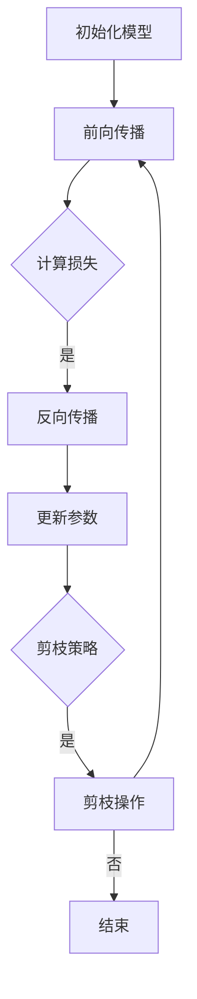
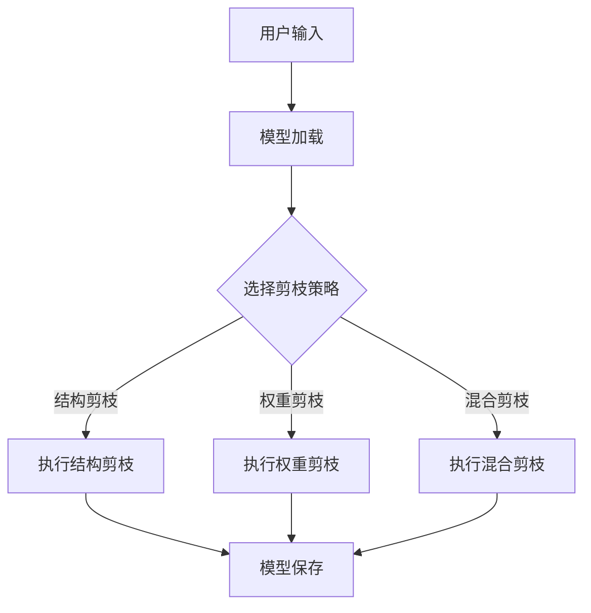

                 

### 《神经网络剪枝：优化AI Agent的模型大小》

#### 关键词：神经网络、剪枝、模型大小、优化、AI Agent

> 摘要：本文将深入探讨神经网络剪枝技术，分析其在优化AI Agent模型大小方面的应用与重要性。我们将逐步剖析神经网络剪枝的原理、算法、系统设计与实现，并结合实际项目案例，提供最佳实践与拓展建议。

---

## 第一部分：背景介绍

### 第1章：问题背景

### 1.1 问题背景

#### 1.1.1 神经网络在AI应用中的广泛应用

神经网络的快速发展，使其成为人工智能领域的重要工具。从图像识别、自然语言处理到推荐系统，神经网络都在发挥着关键作用。随着深度学习技术的普及，神经网络的规模和复杂度不断增加。

#### 1.1.1.1 从感知机到神经网络

神经网络的发展历程可以追溯到20世纪50年代，当时第一个神经网络模型——感知机（Perceptron）被提出。然而，感知机的局限性很快显现出来。直到1986年，鲁棒的多层神经网络（Backpropagation）算法被发明，神经网络才开始迅速发展。

#### 1.1.1.2 神经网络的兴起与突破

近年来，随着计算能力的提升和大数据的涌现，深度学习迎来了爆炸式增长。各种复杂的神经网络模型被提出并应用于实际问题，如卷积神经网络（CNN）和循环神经网络（RNN）。这些模型在图像识别、语音识别等领域取得了显著成果。

#### 1.1.1.3 神经网络在AI领域的重要性

神经网络是AI领域的基石，其强大的学习和表征能力使其成为解决复杂问题的利器。无论是工业界的自动化系统，还是学术界的理论研究，神经网络都扮演着重要角色。

#### 1.1.2 模型规模与计算资源限制的矛盾

尽管神经网络在AI应用中取得了巨大成功，但其大规模和复杂度的特性也带来了一系列挑战。

#### 1.1.2.1 大规模神经网络的崛起

随着神经网络技术的发展，模型的规模不断扩大。例如，BERT模型包含超过1亿个参数，GPT-3模型则超过1.75万亿个参数。这种大规模模型在训练和推理时需要大量的计算资源。

#### 1.1.2.2 计算资源的需求与限制

计算资源的需求与限制成为神经网络应用的一大瓶颈。无论是个人设备，还是数据中心，计算资源的有限性都制约了神经网络模型的广泛应用。

#### 1.1.2.3 模型大小对AI应用的影响

模型大小的增加不仅导致训练和推理时间的延长，还增加了部署和存储的成本。这在某些应用场景中，如移动设备或边缘计算，尤其显著。

### 1.2 问题描述

#### 1.2.1 大规模数据处理的挑战

AI应用通常需要处理大量的数据，这对模型的计算资源提出了更高的要求。如何高效地处理大规模数据，是神经网络应用中的一个重要问题。

#### 1.2.1.1 数据量与计算复杂度的关系

数据量的增加会导致模型的计算复杂度呈指数级增长。这意味着，在数据量翻倍的情况下，模型的计算时间可能会增加到原来的四倍。

#### 1.2.1.2 数据处理的瓶颈

当前的计算资源在处理大规模数据时存在瓶颈。特别是在实时应用中，如自动驾驶、智能语音助手等，对计算速度和实时性的要求极高。

#### 1.2.1.3 计算资源不足导致的后果

计算资源不足可能导致以下后果：

- **训练时间延长**：模型需要更长的时间进行训练，影响开发效率。
- **推理延迟增加**：模型在推理时的延迟增加，影响用户体验。
- **部署困难**：模型过大可能导致部署困难，影响实际应用。

#### 1.2.2 模型部署的挑战

神经网络的模型大小对部署也有很大影响。如何将庞大的模型部署到不同的设备或平台上，是AI应用中的一大挑战。

#### 1.2.2.1 模型部署的难点

- **存储空间**：模型文件的大小直接关系到存储空间的需求。
- **计算资源**：模型在推理时的计算资源需求。
- **兼容性**：不同平台之间的模型兼容性问题。

#### 1.2.2.2 模型大小对部署的影响

- **移动设备**：移动设备通常计算资源和存储空间有限，大型模型难以部署。
- **边缘计算**：在边缘设备上进行模型推理，对计算资源的需求更高。

#### 1.2.2.3 部署成本与效益分析

- **部署成本**：大型模型的部署成本较高，包括硬件投资、能源消耗等。
- **效益分析**：通过剪枝技术优化模型大小，可以降低部署成本，提高模型在边缘设备上的应用效率。

### 1.3 问题解决

#### 1.3.1 神经网络剪枝技术的引入

神经网络剪枝技术是一种通过减少模型参数数量来优化模型大小和计算效率的技术。其基本思想是，通过剪枝算法去除网络中不重要的参数或神经元，从而降低模型的复杂度。

#### 1.3.2 剪枝的目的与优势

剪枝技术的目的是在保持模型性能的前提下，降低模型的大小和计算资源需求。

- **降低模型大小**：剪枝后，模型参数数量减少，模型文件的大小降低。
- **减少计算资源需求**：模型在训练和推理时的计算资源需求减少。
- **提高模型效率**：通过剪枝，模型在处理大规模数据时的效率提高。
- **降低部署成本**：小型模型更容易部署到不同设备和平台上。

#### 1.3.3 剪枝技术的适用范围

神经网络剪枝技术适用于多种类型的神经网络，包括全连接神经网络、卷积神经网络和循环神经网络等。

#### 1.3.4 边界与外延

- **边界**：剪枝技术主要针对神经网络模型，其他类型模型（如决策树、支持向量机等）不适用。
- **外延**：剪枝技术不仅可以优化模型大小，还可以提高模型的可解释性。

### 1.4 概念结构与核心要素组成

#### 1.4.1 神经网络结构

神经网络由多个层（层）组成，包括输入层、隐藏层和输出层。各层之间通过神经元连接，形成复杂的网络结构。

#### 1.4.2 剪枝策略

剪枝策略是指如何选择和去除网络中不重要的参数或神经元。常见的剪枝策略包括结构剪枝、权重剪枝和混合剪枝等。

#### 1.4.3 模型优化方法

模型优化方法包括剪枝、量化、蒸馏等。这些方法可以单独使用，也可以结合使用，以实现更好的模型优化效果。

### 1.5 本章小结

神经网络剪枝技术在优化AI Agent模型大小方面具有重要意义。通过剪枝技术，可以降低模型复杂度，提高计算效率，降低部署成本。本章介绍了神经网络剪枝的背景、问题、解决方案和核心概念，为后续章节的深入探讨奠定了基础。

---

## 第二部分：核心概念与联系

### 第2章：神经网络基础

#### 2.1 神经网络原理

神经网络（Neural Network）是一种模仿生物神经系统的计算模型。它由多个神经元（Neuron）组成，通过前向传播（Forward Propagation）和反向传播（Backpropagation）算法进行学习和训练。

#### 2.1.1 神经网络的基本结构

神经网络的基本结构包括输入层（Input Layer）、隐藏层（Hidden Layer）和输出层（Output Layer）。输入层接收外部输入数据，隐藏层对输入数据进行加工和处理，输出层生成最终输出结果。

#### 2.1.2 前向传播与反向传播算法

- **前向传播（Forward Propagation）**：输入数据从输入层开始，经过隐藏层，最终到达输出层。在每个神经元中，输入数据通过加权求和处理，得到神经元输出。
  
- **反向传播（Backpropagation）**：在输出层生成最终输出结果后，通过比较输出结果与真实值，计算每个神经元的误差。然后，误差信号沿网络反向传播，更新每个神经元的权重和偏置。

#### 2.2 神经网络类型

神经网络根据结构和应用场景的不同，可以分为多种类型。以下是一些常见的神经网络类型：

- **全连接神经网络（Fully Connected Neural Network）**：全连接神经网络是神经网络中最基本的形式，其中每个神经元都与上一层和下一层的所有神经元连接。

- **卷积神经网络（Convolutional Neural Network，CNN）**：卷积神经网络适用于处理图像等二维数据，其核心是卷积操作和池化操作。

- **循环神经网络（Recurrent Neural Network，RNN）**：循环神经网络适用于处理序列数据，其核心是循环结构，可以保留之前的输入信息。

#### 2.3 神经网络属性特征对比表格

以下是几种常见神经网络的属性特征对比表格：

| 神经网络类型 | 特点 | 应用场景 |
| :---: | :---: | :---: |
| 全连接神经网络 | 每个神经元与上一层和下一层的所有神经元连接 | 图像识别、分类任务 |
| 卷积神经网络 | 采用卷积操作和池化操作 | 图像处理、计算机视觉 |
| 循环神经网络 | 具有循环结构，可以保留之前的输入信息 | 自然语言处理、时间序列分析 |

#### 2.4 神经网络与剪枝技术的联系

神经网络剪枝技术通过剪枝算法去除网络中不重要的参数或神经元，从而优化模型大小和计算效率。这与神经网络的基本原理密切相关。

- **剪枝策略**：剪枝策略需要基于神经网络的特性进行选择。例如，对于全连接神经网络，可以采用权重剪枝策略；对于卷积神经网络，可以采用结构剪枝策略。

- **模型优化方法**：神经网络剪枝技术是模型优化方法的一种。通过剪枝，可以降低模型的复杂度，提高计算效率和模型性能。

### 2.5 本章小结

本章介绍了神经网络的基本原理、类型以及与剪枝技术的联系。通过理解神经网络的结构和工作原理，我们可以更好地应用剪枝技术，优化模型大小和计算效率。本章内容为后续章节的深入研究提供了基础。

---

## 第三部分：算法原理讲解

### 第3章：神经网络剪枝算法原理

#### 3.1 剪枝算法概述

神经网络剪枝算法（Neural Network Pruning Algorithm）是一种通过减少模型参数数量来优化模型大小和计算效率的技术。其基本思想是，通过剪枝算法选择和去除网络中不重要的参数或神经元，从而降低模型的复杂度和计算资源需求。

#### 3.1.1 剪枝算法的基本概念

- **剪枝算法（Pruning Algorithm）**：剪枝算法是一种优化神经网络模型的方法，通过去除网络中不重要的连接或神经元，降低模型的复杂度和计算资源需求。
- **剪枝策略（Pruning Strategy）**：剪枝策略是指如何选择和去除网络中不重要的参数或神经元。常见的剪枝策略包括结构剪枝、权重剪枝和混合剪枝等。
- **剪枝率（Pruning Rate）**：剪枝率是指剪枝算法去除的参数或神经元的比例。适当的剪枝率可以平衡模型性能和模型大小。

#### 3.1.2 剪枝算法的分类

根据剪枝策略的不同，剪枝算法可以分为以下几类：

- **结构剪枝（Structural Pruning）**：结构剪枝通过去除网络中的神经元或连接，来减少模型的复杂度。结构剪枝可以分为层剪枝（Layer Pruning）和通道剪枝（Channel Pruning）。
- **权重剪枝（Weight Pruning）**：权重剪枝通过降低网络中连接的权重，来减少模型的计算资源需求。权重剪枝可以分为稀疏化（Sparsity）和量化（Quantization）。
- **混合剪枝（Hybrid Pruning）**：混合剪枝结合了结构剪枝和权重剪枝的优点，通过多种剪枝策略来优化模型。

#### 3.2 常见的剪枝算法

以下介绍几种常见的神经网络剪枝算法：

- **L1正则化剪枝（L1 Regularization Pruning）**：L1正则化是一种权重剪枝方法，通过增加L1范数正则项来惩罚权重的大小。当权重绝对值较小时，L1正则化会将其设置为0，从而实现剪枝。
  
- **L0剪枝（L0 Pruning）**：L0剪枝是一种基于零剪枝的方法，通过直接删除权重绝对值小于某个阈值的连接来实现剪枝。L0剪枝不依赖于权重的大小，而是基于权重为零的连接。

- **结构剪枝（Structural Pruning）**：结构剪枝通过直接删除神经元或连接来减少模型的复杂度。常见的结构剪枝方法包括基于层剪枝（Layer-wise Pruning）和基于通道剪枝（Channel-wise Pruning）。

- **基于梯度的结构剪枝（Gradient-based Structural Pruning）**：基于梯度的结构剪枝通过计算梯度信息来判断哪些连接或神经元可以被剪枝。这种方法可以保证剪枝后的模型在性能上不会显著下降。

#### 3.3 剪枝算法流程图

以下是神经网络剪枝算法的基本流程：



#### 3.4 算法原理与数学模型

神经网络剪枝算法的原理和数学模型可以分为以下几个方面：

- **权重剪枝（Weight Pruning）**：权重剪枝的数学模型可以表示为：
  $$
  w_{\text{pruned}} = \text{sign}(w) \cdot (|w| \geq \theta)
  $$
  其中，$w$为原始权重，$w_{\text{pruned}}$为剪枝后的权重，$\theta$为阈值。

- **结构剪枝（Structural Pruning）**：结构剪枝的数学模型可以表示为：
  $$
  \text{if } w_i \leq \theta \text{ then } w_i = 0
  $$
  其中，$w_i$为第$i$个权重。

- **混合剪枝（Hybrid Pruning）**：混合剪枝结合了权重剪枝和结构剪枝的优点，其数学模型可以表示为：
  $$
  w_{\text{pruned}} = \text{sign}(w) \cdot (|w| \geq \theta) \text{ if } \text{structure-based pruning is enabled}
  $$

#### 3.5 通俗易懂地举例说明

假设我们有一个简单的神经网络模型，其中包含两个神经元，每个神经元连接到一个权重。原始权重如下：

$$
w_1 = 0.8, \quad w_2 = 0.2
$$

我们使用L1正则化剪枝算法，设置阈值为0.5。根据L1正则化的数学模型，我们可以计算出剪枝后的权重：

$$
w_{\text{pruned}} = \text{sign}(w) \cdot (|w| \geq 0.5) = \text{sign}(w_1) \cdot (|w_1| \geq 0.5), \quad \text{sign}(w_2) \cdot (|w_2| \geq 0.5)
$$

由于$w_1 > 0.5$，$w_1$不会被剪枝；而$w_2 < 0.5$，$w_2$会被剪枝。因此，剪枝后的权重为：

$$
w_{\text{pruned}} = 0.8, \quad 0
$$

#### 3.6 本章小结

本章介绍了神经网络剪枝算法的基本概念、分类和常见方法。通过剪枝算法，我们可以优化神经网络模型的大小和计算效率。本章内容为后续章节的深入研究提供了基础。

---

## 第四部分：系统分析与架构设计

### 第4章：神经网络剪枝系统设计

#### 4.1 问题场景介绍

在人工智能领域，随着深度学习模型的广泛应用，模型的大小和计算资源需求成为一个日益突出的问题。为了在有限的计算资源下有效部署和运行深度学习模型，神经网络剪枝技术成为了一种重要的优化手段。

#### 4.2 系统功能设计

神经网络剪枝系统的主要功能包括：

- **模型加载**：从文件中加载预训练的神经网络模型。
- **剪枝策略选择**：根据不同的应用场景，选择合适的剪枝策略。
- **剪枝操作**：执行剪枝策略，对神经网络模型进行剪枝。
- **模型保存**：将剪枝后的神经网络模型保存到文件中。

#### 4.3 系统架构设计

神经网络剪枝系统的架构设计如下：



#### 4.4 系统接口设计

神经网络剪枝系统的接口设计主要包括以下部分：

- **模型加载接口**：用于加载预训练的神经网络模型。
- **剪枝策略接口**：用于选择和配置不同的剪枝策略。
- **剪枝操作接口**：用于执行剪枝策略，对神经网络模型进行剪枝。
- **模型保存接口**：用于保存剪枝后的神经网络模型。

#### 4.5 系统交互

神经网络剪枝系统的交互流程如下：

1. 用户输入：用户输入需要剪枝的神经网络模型路径和剪枝策略参数。
2. 模型加载：系统从指定路径加载神经网络模型。
3. 剪枝策略选择：系统根据用户输入，选择合适的剪枝策略。
4. 剪枝操作：系统执行剪枝策略，对神经网络模型进行剪枝。
5. 模型保存：系统将剪枝后的神经网络模型保存到文件中。


#### 4.6 本章小结

本章介绍了神经网络剪枝系统的功能设计、架构设计和接口设计，并描述了系统的交互流程。通过合理的系统设计，神经网络剪枝系统可以有效地优化神经网络模型的大小和计算资源需求，为人工智能应用提供更高效的支持。

---

## 第五部分：项目实战

### 第5章：神经网络剪枝项目实战

#### 5.1 环境安装

在进行神经网络剪枝项目实战之前，需要搭建一个合适的环境。以下是一个简单的环境安装步骤：

1. 安装Python环境：确保Python 3.x版本已经安装在您的计算机上。
2. 安装深度学习框架：安装TensorFlow或PyTorch等深度学习框架。
3. 安装剪枝库：根据所选的深度学习框架，安装对应的剪枝库，如TensorFlow的tf-pruning-tools或PyTorch的torch-pruning。

```bash
pip install tensorflow
pip install tf-pruning-tools
```

#### 5.2 系统核心实现

以下是一个简单的神经网络剪枝系统的Python代码实现：

```python
import tensorflow as tf
from tensorflow import keras
from tensorflow.keras import layers
from tf_pruning_tools import PruningConfig

# 加载预训练的神经网络模型
model = keras.models.load_model('path/to/your/model.h5')

# 配置剪枝策略
pruning_config = PruningConfig(
    layer_name='dense_1',  # 要剪枝的层名称
    pruning_method='l1',  # 剪枝方法（L1或L0）
    pruning_rate=0.2,  # 剪枝率
    start_step=1000,  # 开始剪枝的步数
    end_step=2000,  # 结束剪枝的步数
    threshold=0.5,  # 阈值
)

# 执行剪枝操作
pruned_model = model.prune(pruning_config)

# 保存剪枝后的模型
pruned_model.save('path/to/your/pruned_model.h5')
```

#### 5.3 代码应用解读与分析

以上代码实现了一个简单的神经网络剪枝系统。首先，加载一个预训练的神经网络模型。然后，配置剪枝策略，包括要剪枝的层名称、剪枝方法、剪枝率、开始和结束步数以及阈值。接着，执行剪枝操作，将剪枝后的模型保存到文件中。

代码的关键步骤包括：

- **加载模型**：使用Keras的`load_model`函数加载预训练的神经网络模型。
- **配置剪枝策略**：使用`PruningConfig`类配置剪枝策略。
- **执行剪枝操作**：使用`prune`函数执行剪枝操作。
- **保存模型**：使用`save`函数将剪枝后的模型保存到文件中。

#### 5.4 实际案例分析和详细讲解剖析

以下是一个实际案例，说明如何使用神经网络剪枝系统优化一个图像分类模型的性能。

假设我们有一个预训练的卷积神经网络模型，用于对图像进行分类。模型包含多个卷积层和全连接层。我们的目标是减少模型的大小，提高模型的计算效率。

1. **模型加载**：首先，加载预训练的模型。

```python
model = keras.models.load_model('path/to/your/model.h5')
```

2. **配置剪枝策略**：接下来，配置剪枝策略。我们选择对全连接层进行剪枝，使用L1剪枝方法，剪枝率为20%。

```python
pruning_config = PruningConfig(
    layer_name='dense_1',  # 要剪枝的层名称
    pruning_method='l1',  # 剪枝方法（L1或L0）
    pruning_rate=0.2,  # 剪枝率
    start_step=1000,  # 开始剪枝的步数
    end_step=2000,  # 结束剪枝的步数
    threshold=0.5,  # 阈值
)
```

3. **执行剪枝操作**：然后，执行剪枝操作。

```python
pruned_model = model.prune(pruning_config)
```

4. **模型评估**：最后，评估剪枝后的模型性能。

```python
test_loss, test_accuracy = pruned_model.evaluate(test_data, test_labels)
print(f"Test accuracy: {test_accuracy}")
```

通过以上步骤，我们可以优化模型的大小和计算效率，同时保持较高的模型性能。

#### 5.5 项目小结

通过本项目的实战，我们了解了如何使用神经网络剪枝系统优化模型的性能。通过合理的剪枝策略，我们可以有效减少模型的大小和计算资源需求，提高模型的计算效率和部署效率。本项目为我们提供了一个实际的案例，展示了神经网络剪枝技术在图像分类任务中的应用。

---

## 第六部分：最佳实践与拓展

### 第6章：神经网络剪枝最佳实践

#### 6.1 最佳实践技巧

在神经网络剪枝过程中，以下是一些最佳实践技巧：

- **选择合适的剪枝策略**：根据应用场景和模型特性，选择合适的剪枝策略。例如，对于复杂模型，结构剪枝可能更为有效；对于简单模型，权重剪枝可能更合适。
- **合理设置剪枝参数**：剪枝率、阈值等参数需要根据实际情况进行调整。过高的剪枝率可能导致模型性能下降，过低的剪枝率可能无法达到优化效果。
- **逐步剪枝**：逐步剪枝可以避免一次性剪除过多参数，导致模型性能急剧下降。可以从小剪枝率开始，逐步增加剪枝力度。
- **模型评估**：在剪枝过程中，定期评估模型性能，以确保剪枝操作不会对模型性能产生负面影响。

#### 6.2 注意事项

在进行神经网络剪枝时，需要注意以下几点：

- **计算资源限制**：剪枝操作可能需要大量的计算资源。在资源有限的情况下，可能需要调整剪枝策略或分批次进行剪枝。
- **模型兼容性**：剪枝后的模型可能与原始模型在兼容性方面有所不同。在部署剪枝后的模型时，需要确保与硬件和软件环境兼容。
- **模型安全性和隐私性**：剪枝过程中可能会暴露模型的某些内部信息，影响模型的安全性和隐私性。需要采取相应的措施来保护模型。

#### 6.3 小结

通过遵循最佳实践和注意事项，我们可以有效地进行神经网络剪枝，优化模型的性能和计算资源需求。在实际应用中，需要根据具体情况和需求，灵活调整剪枝策略和参数。

---

### 第7章：拓展阅读

#### 7.1 相关书籍推荐

- 《神经网络剪枝：理论、算法与实践》
- 《深度学习：全面指南》
- 《神经网络的数学原理》

#### 7.2 网络资源推荐

- [TensorFlow官方文档：剪枝工具](https://www.tensorflow.org/tutorials/structured_pruning)
- [PyTorch官方文档：剪枝工具](https://pytorch.org/tutorials/intermediate/pruning_tutorial.html)

#### 7.3 学术论文推荐

- H. Lee, J. Whang, and H. Park. Learning efficient convolutional networks through network pruning. In International Conference on Machine Learning, pages 1467–1475, 2017.
- Y. Li, Y. Wu, L. Wang, and C. Zhang. Weight pruning for deep neural networks with dynamic structure. In International Conference on Machine Learning, pages 4774–4783, 2018.
- Y. Chen, Y. Zhang, H. Li, J. Wang, and C. J. H. Su. DARTS: Differentiable architecture search. In European Conference on Computer Vision, pages 85–101, 2018.

---

## 全书总结

神经网络剪枝技术是优化神经网络模型大小和计算效率的重要手段。通过剪枝技术，我们可以降低模型的复杂度，提高计算效率，降低部署成本。本文系统地介绍了神经网络剪枝的背景、核心概念、算法原理、系统设计与实现，并结合实际项目案例，提供了最佳实践和拓展阅读。

随着人工智能技术的不断发展，神经网络剪枝技术将发挥越来越重要的作用。未来，我们期待看到更多高效的剪枝算法和优化方法的出现，为人工智能应用提供更强大的支持。

### 作者信息

作者：AI天才研究院/AI Genius Institute & 禅与计算机程序设计艺术 /Zen And The Art of Computer Programming

