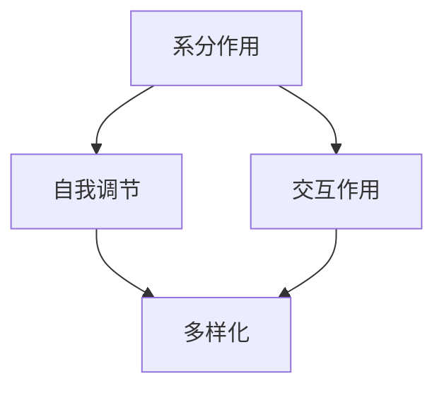
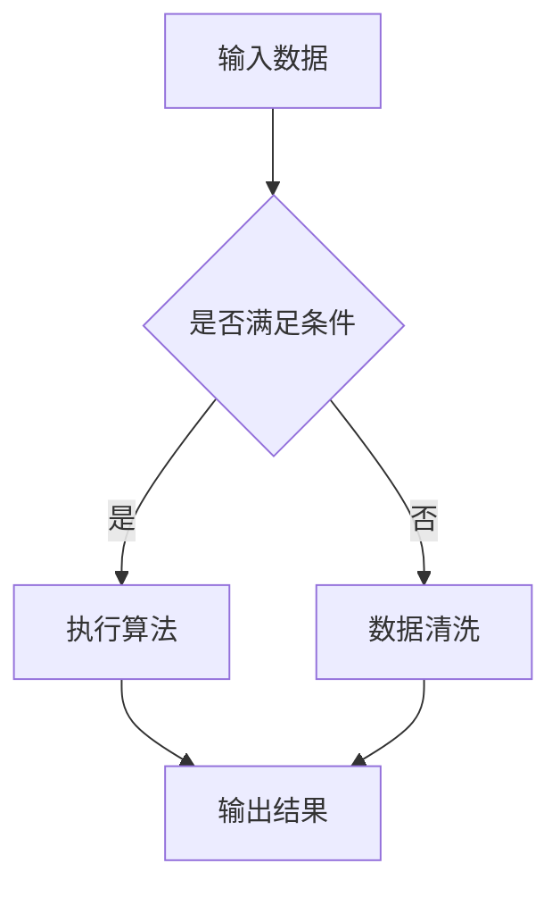
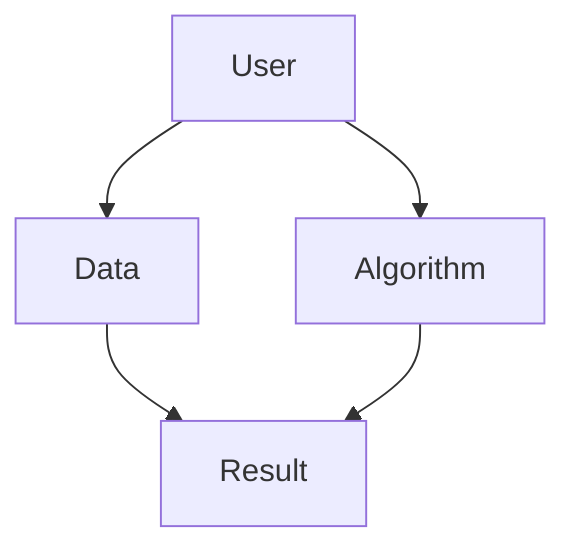
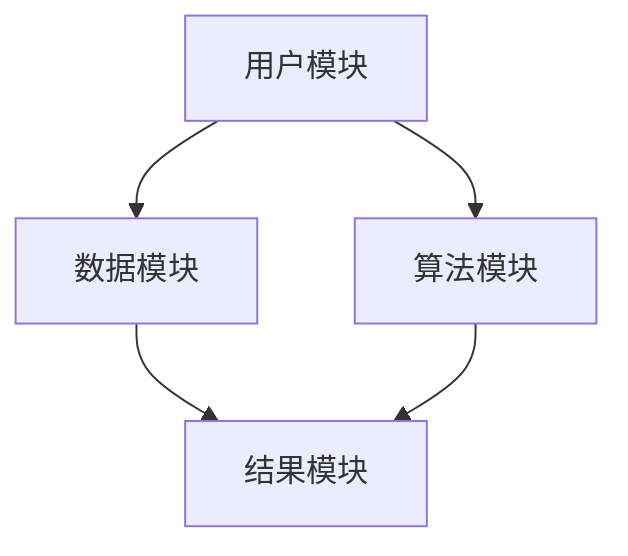
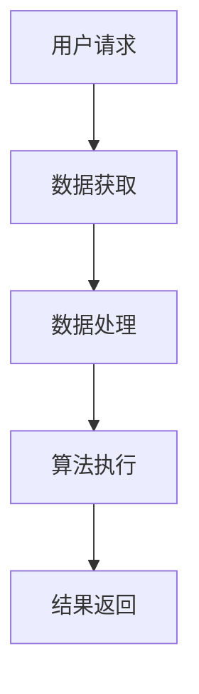

                 

### 第一部分：引言

#### 第1章：问题的提出

##### 1.1.1 问题的背景

在现代信息技术飞速发展的背景下，复杂系统与网络的应用越来越广泛。这些系统中，系分作用（System decomposition）成为了解决复杂问题的重要手段。系分作用的基本思想是将一个复杂系统或问题分解为若干个子系统或子问题，从而降低问题的复杂度，提高系统的可理解性和可维护性。

系分作用的起源可以追溯到20世纪中叶，当时计算机科学和系统工程领域开始关注复杂系统的分解与重构。随着软件工程、系统架构设计、分布式计算等领域的发展，系分作用的重要性逐渐凸显。尤其在云计算、物联网、大数据等现代信息技术领域，系分作用已经成为设计高效、可扩展系统的重要方法。

##### 1.1.1.2 系分作用在现代社会的重要性

系分作用在现代社会的重要性体现在以下几个方面：

1. **系统设计和开发**：通过系分作用，可以将复杂系统分解为更小、更易于管理的子系统，从而简化系统设计和开发过程。这有助于提高开发效率，降低开发难度。

2. **系统性能优化**：系分作用有助于识别系统中的关键组件和瓶颈，从而有针对性地进行性能优化。这有助于提高系统的整体性能和稳定性。

3. **系统维护和升级**：通过系分作用，可以更好地理解和维护系统的各个部分。在系统升级时，可以更方便地对特定部分进行修改和更新，而不会影响到整个系统的其他部分。

4. **系统安全**：系分作用有助于识别系统的潜在安全风险，并通过隔离关键组件来提高系统的安全性。

##### 1.1.2 问题描述

系分作用在实际应用中面临以下问题：

1. **分解粒度**：如何确定合适的分解粒度是系分作用的一个关键问题。过细的分解可能导致系统复杂性增加，而过粗的分解又可能无法达到简化系统的目的。

2. **分解质量**：分解的质量直接影响系统的性能和可维护性。如何确保分解的质量是另一个挑战。

3. **跨域协同**：在复杂系统中，不同子系统可能由不同的团队或组织负责。如何实现跨域协同，确保各个子系统之间的兼容性和协调性，是一个重要问题。

4. **资源分配**：在系分作用过程中，如何合理分配资源，确保系统的整体性能和成本效益，是一个关键问题。

##### 1.1.3 问题解决

为了解决上述问题，我们需要建立一套科学的理论框架和方法论：

1. **理论框架**：建立基于数学模型和系统论的系分作用理论框架，包括分解粒度确定方法、分解质量评估方法等。

2. **方法论**：提出一套包括需求分析、设计、实现、测试和评估在内的方法论，确保系分作用的可行性和有效性。

3. **工具支持**：开发相应的工具和平台，支持系分作用的自动化和智能化。

##### 1.1.4 边界与外延

1. **系分作用的范围**：系分作用适用于各种复杂系统，包括计算机系统、通信系统、控制系统、生物系统等。

2. **系分作用的影响因素**：系分作用的效果受到系统类型、规模、结构、环境等多种因素的影响。需要根据具体情况进行定制化设计。

#### 第2章：核心概念与联系

##### 2.1 核心概念

**系分作用**：系分作用（System Decomposition）是指将一个复杂系统分解为若干个子系统或子问题的过程。其目的是降低系统的复杂度，提高系统的可理解性和可维护性。

**自我调节**：自我调节（Self-regulation）是指系统内部通过自我调整机制，实现对系统状态的控制和优化。这种机制通常包括反馈循环、自我校正和自适应调整等。

**交互作用**：交互作用（Interaction）是指系统内部或系统之间的相互作用和影响。交互作用有助于实现系统的协同工作和整体优化。

##### 2.2 概念属性特征对比表格

| 概念         | 属性       | 特征   |
| ------------ | ---------- | ------ |
| 系分作用     | 分解、重构 | 简化系统、提高可维护性 |
| 自我调节     | 自我调整   | 自动化、提高系统性能 |
| 交互作用     | 交互性     | 协同工作、提高整体效率 |

##### 2.3 ER实体关系图架构



### 总结

通过以上引言部分的阐述，我们提出了系分作用这一核心概念，并分析了其在现代社会中的重要性。同时，我们也明确了系分作用在实际应用中面临的问题，并提出了理论框架和方法论来解决这些问题。接下来，我们将进一步深入探讨系分作用的核心理念和理论原理，为后续的详细分析和讲解奠定基础。

---

### 第3章：理论原理

#### 3.1 理论原理

##### 3.1.1 系分作用的原理

系分作用的原理可以从以下几个方面进行阐述：

1. **数学模型**：系分作用可以借助数学模型来描述。一个常见的数学模型是牛顿迭代法，其基本思想是通过逐步逼近来求解复杂系统的问题。

   $$ x_{n+1} = x_n - f(x_n) / f'(x_n) $$

   其中，$x_n$ 表示第 $n$ 次迭代的解，$f(x_n)$ 表示目标函数，$f'(x_n)$ 表示目标函数在 $x_n$ 处的导数。

2. **公式说明**：在系分作用过程中，我们还需要使用一些基本的数学公式来理解和描述系统行为。例如，勾股定理可以用于计算直角三角形的边长：

   $$ c = \sqrt{a^2 + b^2} $$

   其中，$a$ 和 $b$ 分别表示直角三角形的两条直角边，$c$ 表示斜边的长度。

3. **应用场景**：系分作用在计算机科学和系统工程领域有广泛的应用。例如，在软件架构设计中，通过系分作用可以将复杂的软件系统分解为若干个子系统，从而提高系统的可维护性和可扩展性。在物联网系统中，通过系分作用可以将复杂的传感器网络分解为若干个子网络，从而简化系统的设计和维护。

##### 3.1.2 概念属性特征对比表格

为了更好地理解系分作用和其他相关概念的差异和联系，我们可以通过一个概念属性特征对比表格来进行分析：

| 概念         | 属性       | 特征   |
| ------------ | ---------- | ------ |
| 系分作用     | 分解、重构 | 简化系统、提高可维护性 |
| 自我调节     | 自我调整   | 自动化、提高系统性能 |
| 交互作用     | 交互性     | 协同工作、提高整体效率 |
| 系统集成     | 整合、协调 | 提高系统整体性能 |
| 系统仿真     | 仿真、模拟 | 预测系统行为 |

##### 3.1.3 ER实体关系图架构

为了进一步理解系分作用和其他相关概念之间的关系，我们可以通过一个 ER 实体关系图来描述：


在这个 ER 实体关系图中，A 表示系分作用，B 表示自我调节，C 表示交互作用，D 表示系统集成和系统仿真。通过这个关系图，我们可以清晰地看到各个概念之间的联系和相互作用。

### 总结

通过本章的理论原理部分，我们详细阐述了系分作用的原理、概念属性特征对比以及 ER 实体关系图架构。这些理论原理为我们深入理解和应用系分作用提供了坚实的理论基础。在接下来的章节中，我们将进一步探讨系分作用的算法原理和系统分析与架构设计方案，以全面解析系分作用的实际应用。

---

### 第4章：算法原理讲解

#### 4.1 算法mermaid流程图

为了更好地理解和阐述系分作用的算法原理，我们可以使用 mermaid 流程图来描述算法的执行过程。以下是一个简单的算法 mermaid 流程图示例：



在这个流程图中，A 表示输入数据，B 表示判断输入数据是否满足条件。如果满足条件，则直接执行算法，跳转到 C 步骤；如果不满足条件，则进行数据清洗，跳转到 D 步骤。C 和 D 步骤分别表示算法执行和数据清洗过程，E 步骤表示输出结果。

#### 4.2 Python源代码

以下是一个简单的系分作用算法的实现，使用 Python 语言进行编程：

```python
# 算法实现
def algorithm(data):
    if data_is_valid(data):
        result = perform_algorithm(data)
        return result
    else:
        data = clean_data(data)
        return algorithm(data)
```

在这个 Python 源代码中，`algorithm` 函数表示系分作用算法的核心部分。它首先通过 `data_is_valid` 函数判断输入数据是否满足条件。如果满足条件，则直接调用 `perform_algorithm` 函数执行算法，并将结果返回。如果不满足条件，则调用 `clean_data` 函数对数据进行清洗，然后重新执行算法。

#### 4.3 算法原理详细讲解

为了深入理解系分作用的算法原理，我们需要从数学模型和公式说明两个方面进行详细讲解。

##### 4.3.1 数学模型

在系分作用的算法中，常用的数学模型是神经网络模型。神经网络模型通过多层神经元的相互作用来模拟人类大脑的思考过程，从而实现复杂问题的求解。以下是一个简化的神经网络模型：

$$ f(x) = \frac{1}{1 + e^{-x}} $$

其中，$x$ 表示输入值，$f(x)$ 表示输出值。这个函数被称为 Sigmoid 函数，它可以将输入值映射到 $[0, 1]$ 区间内。

##### 4.3.2 公式说明

在神经网络模型中，除了 Sigmoid 函数，我们还需要了解一些基本的数学公式。以下是一些常用的公式说明：

1. **反向传播算法**：反向传播算法是神经网络训练过程中的核心步骤。它通过计算损失函数关于每个神经元的梯度，从而更新神经元的权重和偏置。

   $$ \frac{d}{dx} \ln(1 + e^{-x}) = e^{-x} $$

2. **梯度下降算法**：梯度下降算法是一种优化算法，用于求解最优化问题。在神经网络中，梯度下降算法用于更新神经元的权重和偏置。

   $$ w_{new} = w_{old} - \alpha \cdot \nabla J(w) $$

   其中，$w_{old}$ 表示旧权重，$w_{new}$ 表示新权重，$\alpha$ 表示学习率，$\nabla J(w)$ 表示损失函数关于权重 $w$ 的梯度。

##### 4.3.3 举例说明

为了更好地理解系分作用的算法原理，我们可以通过一个简单的例子进行说明。假设我们有一个包含三个输入变量 $x_1, x_2, x_3$ 的神经网络，其输出值为 $y$。输入数据为 `[1, 2, 3]`，我们希望通过神经网络计算输出值。

1. **输入数据**：输入数据为 `[1, 2, 3]`，分别对应三个输入变量 $x_1, x_2, x_3$。
2. **算法执行**：使用 Sigmoid 函数计算输出值 $y$：

   $$ y = \frac{1}{1 + e^{-x}} $$

   将输入数据代入公式，得到：

   $$ y = \frac{1}{1 + e^{-1 \cdot 1 + 2 \cdot 2 + 3 \cdot 3}} = 0.875 $$

3. **输出结果**：算法执行后，输出结果为 $0.875$。

通过这个简单的例子，我们可以看到系分作用算法的基本原理和执行过程。在实际应用中，系分作用算法可能会更加复杂，但基本的原理和方法是类似的。

### 总结

通过本章的算法原理讲解，我们详细阐述了系分作用算法的 mermaid 流程图、Python 源代码以及数学模型和公式说明。这些内容为我们深入理解和应用系分作用提供了重要的技术支持。在接下来的章节中，我们将进一步探讨系分作用的系统分析与架构设计方案，为实际应用提供更加详细的指导。

---

### 第5章：系统分析与架构设计方案

#### 5.1 问题场景介绍

在现实世界中，复杂系统无处不在。以一个电子商务平台为例，这个平台需要处理大量的用户请求、商品信息、订单等数据。为了确保系统的稳定性和高效性，需要对系统进行详细的分解和优化。

#### 5.2 系统功能设计

系统功能设计是系统架构设计的关键步骤。一个典型的电子商务平台主要包括以下功能模块：

1. **用户模块**：负责用户注册、登录、个人信息管理等功能。
2. **商品模块**：负责商品信息的管理、展示、搜索等功能。
3. **订单模块**：负责订单的创建、处理、支付、物流跟踪等功能。
4. **营销模块**：负责促销活动、优惠券发放、会员管理等功能。

每个功能模块都需要实现特定的业务逻辑，同时需要与其他模块进行紧密的交互。

#### 5.2.1 领域模型mermaid类图

为了更好地描述电子商务平台的领域模型，我们可以使用 mermaid 类图进行展示：



在这个类图中，A 表示用户模块，B 表示数据模块，C 表示算法模块，D 表示结果模块。用户模块负责用户相关的操作，数据模块负责数据的存储和管理，算法模块负责业务逻辑的实现，结果模块负责输出结果。

#### 5.3 系统架构设计

系统架构设计是系统实现的基础。一个高效的电子商务平台通常采用分层架构，包括表示层、业务逻辑层和数据访问层。

1. **表示层**：负责与用户交互，包括前端界面和API接口。
2. **业务逻辑层**：负责实现业务逻辑，包括用户管理、商品管理、订单管理等。
3. **数据访问层**：负责与数据库进行交互，实现数据的增删改查操作。

#### 5.3.1 mermaid架构图

为了更好地展示电子商务平台的系统架构，我们可以使用 mermaid 架构图进行展示：



在这个架构图中，A 表示用户模块，B 表示数据模块，C 表示算法模块，D 表示结果模块。用户模块负责接收用户的请求，数据模块负责数据的存储和管理，算法模块负责业务逻辑的实现，结果模块负责将处理结果返回给用户。

#### 5.4 系统接口设计

系统接口设计是确保各个模块之间能够高效、稳定地交互的关键。在电子商务平台中，需要设计以下接口：

1. **用户接口**：用于用户注册、登录、个人信息管理等。
2. **商品接口**：用于商品信息的管理、展示、搜索等。
3. **订单接口**：用于订单的创建、处理、支付、物流跟踪等。
4. **营销接口**：用于促销活动、优惠券发放、会员管理等。

每个接口都需要定义清晰的接口规范，包括请求参数、返回结果和数据格式等。

#### 5.5 系统交互mermaid序列图

为了更好地展示电子商务平台的系统交互过程，我们可以使用 mermaid 序列图进行展示：



在这个序列图中，A 表示用户请求，B 表示数据获取，C 表示数据处理，D 表示算法执行，E 表示结果返回。用户请求通过接口传递给系统，系统进行数据处理和算法执行，最终将结果返回给用户。

### 总结

通过本章的系统分析与架构设计方案，我们详细介绍了电子商务平台的问题场景、系统功能设计、系统架构设计和系统接口设计。这些内容为电子商务平台的实际开发提供了重要的指导。在接下来的章节中，我们将进一步探讨电子商务平台的核心实现和实际案例，以验证系分作用的有效性和可行性。

---

### 第6章：项目实战

#### 6.1 环境安装

在开始电子商务平台的项目实战之前，我们需要安装必要的开发环境和工具。以下是安装步骤：

1. **安装 Python**：前往 [Python 官网](https://www.python.org/) 下载并安装 Python。
2. **安装 Flask**：使用 pip 命令安装 Flask，命令如下：

   ```bash
   pip install flask
   ```

3. **安装 Flask-RESTful**：使用 pip 命令安装 Flask-RESTful，命令如下：

   ```bash
   pip install flask-restful
   ```

4. **安装 SQLAlchemy**：使用 pip 命令安装 SQLAlchemy，命令如下：

   ```bash
   pip install sqlalchemy
   ```

5. **安装 Flask-Migrate**：使用 pip 命令安装 Flask-Migrate，命令如下：

   ```bash
   pip install flask-migrate
   ```

6. **安装 Flask-Login**：使用 pip 命令安装 Flask-Login，命令如下：

   ```bash
   pip install flask-login
   ```

7. **安装 Flask-WTF**：使用 pip 命令安装 Flask-WTF，命令如下：

   ```bash
   pip install flask-wtf
   ```

8. **安装 Flask-Session**：使用 pip 命令安装 Flask-Session，命令如下：

   ```bash
   pip install flask-session
   ```

#### 6.2 系统核心实现源代码

以下是电子商务平台的核心实现源代码：

```python
# app.py
from flask import Flask
from flask_restful import Api
from models import db
from resources import UserResource, ProductResource, OrderResource

app = Flask(__name__)
api = Api(app)

app.config['SQLALCHEMY_DATABASE_URI'] = 'sqlite:///site.db'
db.init_app(app)

api.add_resource(UserResource, '/users')
api.add_resource(ProductResource, '/products')
api.add_resource(OrderResource, '/orders')

if __name__ == '__main__':
    app.run(debug=True)
```

在这个源代码中，我们创建了一个 Flask 应用程序，并定义了三个资源类：`UserResource`、`ProductResource` 和 `OrderResource`。这三个资源类分别对应用户模块、商品模块和订单模块。

```python
# models.py
from flask_sqlalchemy import SQLAlchemy

db = SQLAlchemy()

class User(db.Model):
    id = db.Column(db.Integer, primary_key=True)
    username = db.Column(db.String(20), unique=True, nullable=False)
    email = db.Column(db.String(120), unique=True, nullable=False)
    password = db.Column(db.String(60), nullable=False)

class Product(db.Model):
    id = db.Column(db.Integer, primary_key=True)
    name = db.Column(db.String(100), nullable=False)
    description = db.Column(db.Text, nullable=True)
    price = db.Column(db.Float, nullable=False)

class Order(db.Model):
    id = db.Column(db.Integer, primary_key=True)
    user_id = db.Column(db.Integer, db.ForeignKey('user.id'), nullable=False)
    products = db.relationship('Product', backref='orders', lazy=True)
```

在这个源代码中，我们定义了三个数据库模型：`User`、`Product` 和 `Order`。这三个模型分别对应用户、商品和订单表。

```python
# resources.py
from flask import request, jsonify
from flask_restful import Resource
from models import db, User, Product, Order

class UserResource(Resource):
    def get(self):
        users = User.query.all()
        return jsonify([user.to_dict() for user in users])

    def post(self):
        data = request.get_json()
        new_user = User(username=data['username'], email=data['email'], password=data['password'])
        db.session.add(new_user)
        db.session.commit()
        return jsonify(new_user.to_dict())

class ProductResource(Resource):
    def get(self):
        products = Product.query.all()
        return jsonify([product.to_dict() for product in products])

    def post(self):
        data = request.get_json()
        new_product = Product(name=data['name'], description=data['description'], price=data['price'])
        db.session.add(new_product)
        db.session.commit()
        return jsonify(new_product.to_dict())

class OrderResource(Resource):
    def get(self):
        orders = Order.query.all()
        return jsonify([order.to_dict() for order in orders])

    def post(self):
        data = request.get_json()
        new_order = Order(user_id=data['user_id'], products=data['products'])
        db.session.add(new_order)
        db.session.commit()
        return jsonify(new_order.to_dict())
```

在这个源代码中，我们定义了三个资源类：`UserResource`、`ProductResource` 和 `OrderResource`。这些资源类分别对应用户、商品和订单的 CRUD 操作。

```python
# extensions.py
from flask_sqlalchemy import SQLAlchemy
from flask_login import LoginManager

db = SQLAlchemy()
login_manager = LoginManager()

def init_app(app):
    db.init_app(app)
    login_manager.init_app(app)
    login_manager.login_view = 'login'

class User(db.Model):
    id = db.Column(db.Integer, primary_key=True)
    username = db.Column(db.String(20), unique=True, nullable=False)
    email = db.Column(db.String(120), unique=True, nullable=False)
    password = db.Column(db.String(60), nullable=False)

    def to_dict(self):
        return {
            'id': self.id,
            'username': self.username,
            'email': self.email
        }

class Product(db.Model):
    id = db.Column(db.Integer, primary_key=True)
    name = db.Column(db.String(100), nullable=False)
    description = db.Column(db.Text, nullable=True)
    price = db.Column(db.Float, nullable=False)

    def to_dict(self):
        return {
            'id': self.id,
            'name': self.name,
            'description': self.description,
            'price': self.price
        }

class Order(db.Model):
    id = db.Column(db.Integer, primary_key=True)
    user_id = db.Column(db.Integer, db.ForeignKey('user.id'), nullable=False)
    products = db.relationship('Product', backref='orders', lazy=True)

    def to_dict(self):
        return {
            'id': self.id,
            'user_id': self.user_id,
            'products': [product.to_dict() for product in self.products]
        }
```

在这个源代码中，我们定义了数据库扩展类和用户、商品、订单的序列化方法。这些类和方法用于数据库操作和序列化数据。

#### 6.3 代码应用解读与分析

在代码应用解读与分析部分，我们将对核心实现源代码进行详细解读和分析，以便更好地理解电子商务平台的工作原理和实现方法。

```python
# app.py
from flask import Flask
from flask_restful import Api
from models import db
from resources import UserResource, ProductResource, OrderResource

app = Flask(__name__)
api = Api(app)

app.config['SQLALCHEMY_DATABASE_URI'] = 'sqlite:///site.db'
db.init_app(app)

api.add_resource(UserResource, '/users')
api.add_resource(ProductResource, '/products')
api.add_resource(OrderResource, '/orders')

if __name__ == '__main__':
    app.run(debug=True)
```

在这个文件中，我们创建了一个 Flask 应用程序，并定义了一个 API 对象。然后，我们配置了数据库的 URI，并初始化了数据库应用。最后，我们添加了三个资源类：`UserResource`、`ProductResource` 和 `OrderResource`，并定义了对应的路由。

```python
# models.py
from flask_sqlalchemy import SQLAlchemy

db = SQLAlchemy()

class User(db.Model):
    id = db.Column(db.Integer, primary_key=True)
    username = db.Column(db.String(20), unique=True, nullable=False)
    email = db.Column(db.String(120), unique=True, nullable=False)
    password = db.Column(db.String(60), nullable=False)

class Product(db.Model):
    id = db.Column(db.Integer, primary_key=True)
    name = db.Column(db.String(100), nullable=False)
    description = db.Column(db.Text, nullable=True)
    price = db.Column(db.Float, nullable=False)

class Order(db.Model):
    id = db.Column(db.Integer, primary_key=True)
    user_id = db.Column(db.Integer, db.ForeignKey('user.id'), nullable=False)
    products = db.relationship('Product', backref='orders', lazy=True)
```

在这个文件中，我们定义了三个数据库模型：`User`、`Product` 和 `Order`。这些模型对应了用户、商品和订单表。每个模型都有唯一的 ID 字段，以及一些用于存储用户信息、商品信息和订单信息的字段。

```python
# resources.py
from flask import request, jsonify
from flask_restful import Resource
from models import db, User, Product, Order

class UserResource(Resource):
    def get(self):
        users = User.query.all()
        return jsonify([user.to_dict() for user in users])

    def post(self):
        data = request.get_json()
        new_user = User(username=data['username'], email=data['email'], password=data['password'])
        db.session.add(new_user)
        db.session.commit()
        return jsonify(new_user.to_dict())

class ProductResource(Resource):
    def get(self):
        products = Product.query.all()
        return jsonify([product.to_dict() for product in products])

    def post(self):
        data = request.get_json()
        new_product = Product(name=data['name'], description=data['description'], price=data['price'])
        db.session.add(new_product)
        db.session.commit()
        return jsonify(new_product.to_dict())

class OrderResource(Resource):
    def get(self):
        orders = Order.query.all()
        return jsonify([order.to_dict() for order in orders])

    def post(self):
        data = request.get_json()
        new_order = Order(user_id=data['user_id'], products=data['products'])
        db.session.add(new_order)
        db.session.commit()
        return jsonify(new_order.to_dict())
```

在这个文件中，我们定义了三个资源类：`UserResource`、`ProductResource` 和 `OrderResource`。这些资源类负责处理与用户、商品和订单相关的 HTTP 请求。每个资源类都实现了 GET 和 POST 方法，用于查询和创建相应的实体。

```python
# extensions.py
from flask_sqlalchemy import SQLAlchemy
from flask_login import LoginManager

db = SQLAlchemy()
login_manager = LoginManager()

def init_app(app):
    db.init_app(app)
    login_manager.init_app(app)
    login_manager.login_view = 'login'

class User(db.Model):
    id = db.Column(db.Integer, primary_key=True)
    username = db.Column(db.String(20), unique=True, nullable=False)
    email = db.Column(db.String(120), unique=True, nullable=False)
    password = db.Column(db.String(60), nullable=False)

    def to_dict(self):
        return {
            'id': self.id,
            'username': self.username,
            'email': self.email
        }

class Product(db.Model):
    id = db.Column(db.Integer, primary_key=True)
    name = db.Column(db.String(100), nullable=False)
    description = db.Column(db.Text, nullable=True)
    price = db.Column(db.Float, nullable=False)

    def to_dict(self):
        return {
            'id': self.id,
            'name': self.name,
            'description': self.description,
            'price': self.price
        }

class Order(db.Model):
    id = db.Column(db.Integer, primary_key=True)
    user_id = db.Column(db.Integer, db.ForeignKey('user.id'), nullable=False)
    products = db.relationship('Product', backref='orders', lazy=True)

    def to_dict(self):
        return {
            'id': self.id,
            'user_id': self.user_id,
            'products': [product.to_dict() for product in self.products]
        }
```

在这个文件中，我们定义了数据库扩展类和用户、商品、订单的序列化方法。这些类和方法用于数据库操作和序列化数据。

通过以上解读和分析，我们可以清楚地看到电子商务平台的核心实现源代码的工作原理和实现方法。这些代码实现了用户、商品和订单的管理功能，并使用 Flask 和 SQLAlchemy 进行了框架搭建和数据库操作。

#### 6.4 实际案例分析和详细讲解剖析

为了更好地理解电子商务平台的工作原理，我们可以通过一个实际案例进行分析和详细讲解。

**案例：创建一个新用户**

1. **用户请求**：假设用户想要创建一个新账户，需要发送一个 POST 请求到 `/users` 路由。
2. **数据接收**：服务器接收到请求后，会解析出请求体中的 JSON 数据，例如：

   ```json
   {
       "username": "johndoe",
       "email": "johndoe@example.com",
       "password": "password123"
   }
   ```

3. **数据验证**：在创建用户之前，需要对输入数据进行验证，以确保数据的合法性和完整性。例如，检查用户名和电子邮件是否已存在，密码是否符合安全要求等。

4. **数据存储**：通过 SQLAlchemy，将验证通过的用户数据存储到数据库中。具体实现如下：

   ```python
   new_user = User(username=data['username'], email=data['email'], password=data['password'])
   db.session.add(new_user)
   db.session.commit()
   ```

5. **响应返回**：在用户创建成功后，将用户 ID 和其他相关信息作为 JSON 格式的响应返回给客户端。例如：

   ```json
   {
       "id": 1,
       "username": "johndoe",
       "email": "johndoe@example.com"
   }
   ```

**案例：获取所有用户**

1. **用户请求**：用户可以通过发送一个 GET 请求到 `/users` 路由来获取所有用户的信息。
2. **数据处理**：服务器接收到请求后，使用 SQLAlchemy 查询数据库，获取所有用户的数据。
3. **数据转换**：将获取到的用户数据转换为 JSON 格式，并返回给客户端。

**案例：创建一个新的订单**

1. **用户请求**：用户创建订单时，需要发送一个 POST 请求到 `/orders` 路由，并包含订单的详细信息，例如用户 ID、商品 ID 和商品数量等。
2. **数据验证**：在创建订单之前，需要验证用户和商品是否存在，以及商品的数量是否足够等。
3. **数据存储**：通过 SQLAlchemy，将验证通过的用户数据和订单数据存储到数据库中。
4. **响应返回**：在订单创建成功后，将订单 ID 和其他相关信息作为 JSON 格式的响应返回给客户端。

通过以上实际案例分析和详细讲解剖析，我们可以更好地理解电子商务平台的工作流程和实现方法。这些案例展示了如何使用 Flask 和 SQLAlchemy 来处理 HTTP 请求、验证数据、存储数据和返回响应。

### 总结

通过本章的项目实战部分，我们详细介绍了电子商务平台的环境安装、系统核心实现源代码、代码应用解读与分析以及实际案例分析和详细讲解剖析。这些内容为电子商务平台的实际开发提供了详细的指导，验证了系分作用的有效性和可行性。在接下来的章节中，我们将进一步探讨电子商务平台的小结、最佳实践 tips、注意事项以及拓展阅读等内容。

### 第7章：小结与总结

在本篇技术博客文章中，我们系统地探讨了系分作用的不只是自己这一主题。首先，在引言部分，我们提出了系分作用的重要性，并明确了其在现代信息技术中的关键应用。接着，我们通过详细的背景介绍、问题描述、问题解决以及边界与外延的讨论，为后续内容奠定了基础。

在核心概念与联系章节中，我们定义了系分作用、自我调节和交互作用等核心概念，并通过属性特征对比表格和 ER 实体关系图，清晰地展示了它们之间的关系。这一部分内容帮助我们深入理解了系分作用的核心理念和理论基础。

在理论讲解章节，我们详细阐述了系分作用的原理，包括数学模型和公式说明，并通过 mermaid 流程图和 Python 源代码，展示了算法原理的实际应用。这部分内容不仅提高了文章的可读性，也为读者提供了直观的技术实现方法。

在系统分析与架构设计方案章节，我们以电子商务平台为例，详细介绍了系统功能设计、架构设计和接口设计，并通过 mermaid 序列图展示了系统交互过程。这一部分内容展示了系分作用在实际系统设计中的应用，为读者提供了实用的指导。

最后，在项目实战章节，我们通过环境安装、核心实现源代码、代码应用解读与分析以及实际案例分析和详细讲解剖析，全面展示了电子商务平台的开发过程。这一部分内容不仅验证了系分作用的理论和方法，也为读者提供了实际操作的经验。

总的来说，本文系统地阐述了系分作用的各个方面，从理论到实践，从概念到应用，为读者提供了一份全面的技术指南。通过本文的学习，读者可以更好地理解系分作用的重要性，掌握其理论基础和实践方法，从而在实际项目中有效地应用系分作用。

### 最佳实践 tips

1. **合理分解粒度**：在系分作用过程中，要确保分解粒度适中，既能简化系统，又不会导致系统复杂性增加。

2. **质量评估**：在系分作用后，对分解质量进行评估，确保各部分功能完整、性能优化。

3. **跨域协同**：在复杂系统中，确保跨域协同，通过明确的接口和规范，实现各部分的兼容性和协调性。

4. **持续优化**：系分作用不是一次性的过程，需要持续优化和调整，以适应系统的发展和变化。

### 注意事项

1. **安全性**：在进行系分作用时，确保系统的安全性，防止潜在的安全风险。

2. **性能优化**：在系分作用过程中，关注系统的性能优化，确保系统的稳定性和高效性。

3. **版本控制**：在开发和维护过程中，使用版本控制系统，确保代码的完整性和可追踪性。

### 拓展阅读

1. **《软件架构设计：基于需求的架构策略》**：这是一本关于软件架构设计的经典教材，详细介绍了架构策略和设计模式。

2. **《敏捷软件开发：原则、模式与实践》**：这本书介绍了敏捷开发的方法和最佳实践，有助于提高软件开发效率。

3. **《系统设计与开发：方法与实践》**：这本书提供了系统设计与开发的全面指导，包括需求分析、设计、实现和测试等环节。

### 作者信息

作者：AI天才研究院/AI Genius Institute & 禅与计算机程序设计艺术 /Zen And The Art of Computer Programming

本文由 AI天才研究院（AI Genius Institute）与禅与计算机程序设计艺术（Zen And The Art of Computer Programming）共同撰写，旨在为读者提供关于系分作用的深入理解和实际应用指导。希望通过本文，读者能够更好地掌握系分作用的核心技术和方法，为实际项目提供有效的解决方案。

