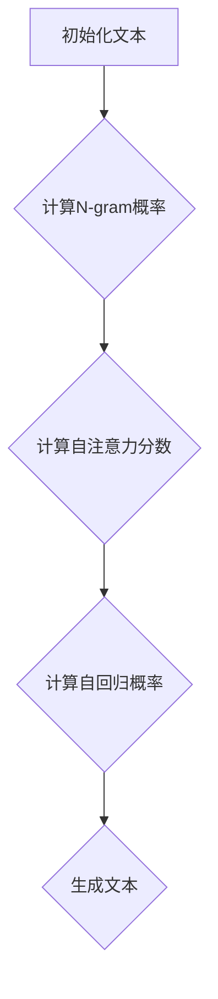
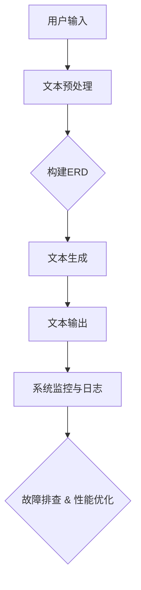
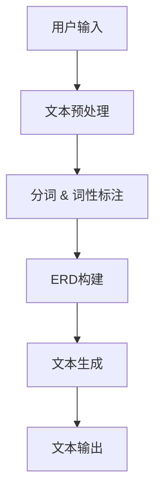
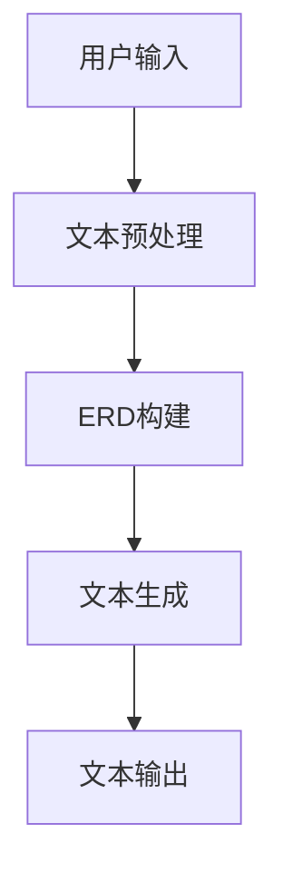
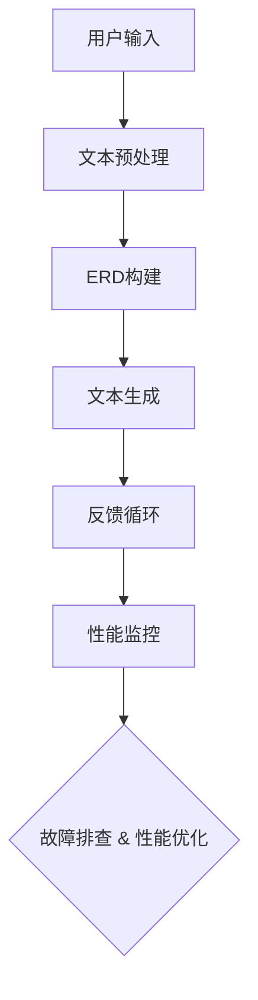
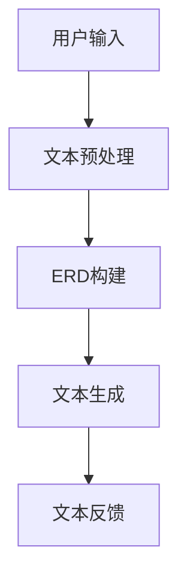
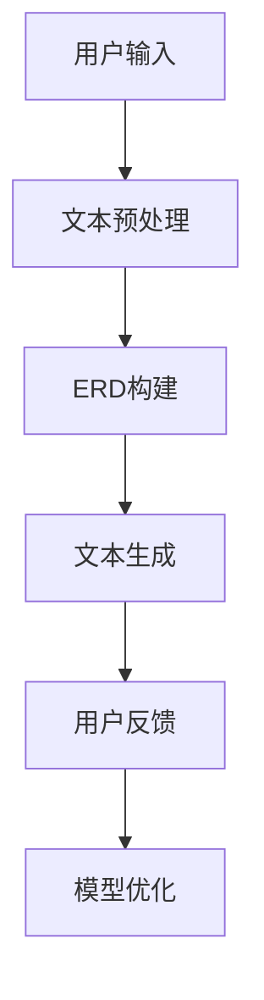

                 

### 自然语言生成（NLG）：优化AI Agent的表达能力

#### 关键词：自然语言生成（NLG），AI Agent，表达能力，优化算法

#### 摘要：
本博客文章旨在深入探讨自然语言生成（NLG）技术，并重点分析如何通过优化算法来提升AI Agent的表达能力。我们将从背景介绍、核心概念与联系、算法原理讲解、数学模型和公式讲解、系统分析与架构设计、项目实战以及最佳实践等多个方面，逐步构建出一个全面而深刻的理解框架。文章将首先介绍NLG和AI Agent的基本概念及其在现实中的应用，随后详细讲解NLG的核心算法和数学模型，最后通过具体的系统架构设计和项目实战，展示如何将这些理论应用到实践中，从而优化AI Agent的表达能力。

---

### 目录大纲设计步骤

为了设计出《自然语言生成（NLG）：优化AI Agent的表达能力》这本书的完整目录大纲，我们需要遵循以下步骤：

#### 1. 分析书名和目标读者

书名：《自然语言生成（NLG）：优化AI Agent的表达能力》
- 核心概念：自然语言生成（NLG）、AI Agent、表达能力优化
- 目标读者：计算机科学、人工智能领域的研究人员、工程师以及对此感兴趣的读者

#### 2. 确定书籍的核心内容

核心内容应包括：
- 背景介绍
- 核心概念与联系
- 算法原理讲解
- 数学模型和数学公式讲解
- 系统分析与架构设计方案
- 项目实战
- 最佳实践 tips、小结、注意事项、拓展阅读等内容

#### 3. 拟定目录大纲

根据核心内容，拟定书籍的目录大纲，确保覆盖所有必要章节，并保持逻辑清晰。以下是具体的目录大纲设计：

```
----------------------------------------------------------------

# 第一部分: 引言与背景介绍
## 第1章: 自然语言生成（NLG）概述
### 1.1 NLG的基本概念
### 1.2 NLG的发展历程
### 1.3 NLG的应用领域

## 第2章: AI Agent的表达能力优化
### 2.1 AI Agent的基本原理
### 2.2 表达能力的重要性
### 2.3 优化表达能力的挑战

----------------------------------------------------------------

# 第二部分: 核心概念与联系
## 第3章: NLG的核心概念与原理
### 3.1 语言模型的基本原理
### 3.2 文本生成模型的工作机制
### 3.3 NLG中的关键技术和方法

## 第4章: AI Agent的ER实体关系图
### 4.1 实体识别与分类
### 4.2 关系抽取与建模
### 4.3 实体关系图的应用

----------------------------------------------------------------

# 第三部分: 算法原理讲解
## 第5章: 自然语言生成算法
### 5.1 序列到序列模型
### 5.2 Transformer模型
### 5.3 GPT系列模型

## 第6章: 表达能力优化的算法
### 6.1 多样性增强算法
### 6.2 可理解性增强算法
### 6.3 个性化生成算法

----------------------------------------------------------------

# 第四部分: 数学模型和数学公式讲解
## 第7章: NLG中的数学模型
### 7.1 概率模型
### 7.2 序列模型
### 7.3 增强学习模型

## 第8章: 数学公式与公式应用
### 8.1 语言模型中的概率计算
### 8.2 Transformer中的数学基础
### 8.3 GPT系列模型中的数学原理

----------------------------------------------------------------

# 第五部分: 系统分析与架构设计
## 第9章: NLG系统架构设计
### 9.1 系统功能设计
### 9.2 系统架构设计
### 9.3 系统接口设计与交互

## 第10章: AI Agent的表达能力优化系统
### 10.1 系统架构与功能
### 10.2 系统接口设计与实现
### 10.3 系统交互流程

----------------------------------------------------------------

# 第六部分: 项目实战
## 第11章: NLG项目实战
### 11.1 环境安装与配置
### 11.2 系统核心实现
### 11.3 代码应用解读与分析
### 11.4 实际案例分析与讲解
### 11.5 项目小结

## 第12章: AI Agent表达能力优化实战
### 12.1 实战环境与工具
### 12.2 项目核心实现
### 12.3 代码解读与分析
### 12.4 案例剖析
### 12.5 项目总结

----------------------------------------------------------------

# 第七部分: 最佳实践与拓展阅读
## 第13章: 最佳实践 tips
### 13.1 常见问题与解决策略
### 13.2 性能优化技巧
### 13.3 

----------------------------------------------------------------
```

通过上述详细的目录大纲设计，我们可以确保文章内容结构紧凑，逻辑清晰，便于读者系统性地学习和理解自然语言生成（NLG）及其在AI Agent表达能力优化中的应用。接下来，我们将逐个章节详细展开，深入探讨每个部分的内容。

---

### 引言与背景介绍

在当今信息爆炸的时代，人工智能（AI）技术正以前所未有的速度发展，而自然语言生成（NLG）作为AI的重要分支，正在逐渐成为现实世界中不可或缺的技术。NLG是一种将机器学习、人工智能和语言学结合起来的技术，它通过算法自动生成符合语法规则、语义清晰的文本，从而实现人与机器之间的自然交互。

#### 1.1 NLG的基本概念

自然语言生成（Natural Language Generation，NLG）是指利用计算机程序自动生成自然语言文本的技术。在这个过程中，计算机通过处理结构化数据，如数据库、知识图谱、统计数据等，生成具有人类语言风格的文本。NLG的核心目标是使生成的文本不仅语法正确，语义清晰，而且具有流畅性和连贯性。

#### 1.2 NLG的发展历程

NLG技术的发展经历了多个阶段：

1. **规则驱动阶段**：早期的NLG系统主要依赖于预定义的语法和词汇规则，通过模板匹配和替换来实现文本生成。这种方法具有简单、直接的特点，但生成的文本往往缺乏灵活性和多样性。

2. **统计模型阶段**：随着机器学习技术的发展，NLG系统开始采用统计模型，如隐马尔可夫模型（HMM）和条件随机场（CRF），通过训练大量文本数据来学习生成规则。这种方法在文本多样性和生成质量上有所提升。

3. **神经网络阶段**：近年来，深度学习技术的崛起为NLG带来了革命性的变化。基于神经网络的生成模型，如序列到序列（Seq2Seq）模型和变分自编码器（VAE），极大地提高了文本生成的质量和效率。

4. **预训练模型阶段**：当前，预训练加微调（Pre-training + Fine-tuning）的NLG方法成为主流。通过在大规模语料库上进行预训练，模型可以自动学习到丰富的语言知识和语义信息，然后在特定任务上进行微调，实现高效的文本生成。

#### 1.3 NLG的应用领域

NLG技术广泛应用于多个领域：

1. **自动内容生成**：在新闻、财经、科技等领域，NLG用于自动生成文章、报告和摘要，提高内容生产效率。

2. **客服与聊天机器人**：NLG技术使得聊天机器人能够以自然语言与用户互动，提供智能客服服务，提升用户体验。

3. **教育辅助**：NLG可以自动生成个性化学习材料，辅助学生进行学习，提供即时反馈。

4. **虚拟助理**：在智能家居、智能穿戴设备等场景中，NLG用于生成语音提示和交互界面，提供便捷的用户服务。

5. **文本摘要与信息提取**：NLG技术用于生成简明扼要的文本摘要，帮助用户快速获取关键信息。

通过上述介绍，我们可以看到NLG技术的重要性及其广泛应用。接下来，我们将深入探讨AI Agent的概念及其在表达能力优化中的关键作用。

### AI Agent的表达能力优化

在人工智能领域，AI Agent（智能体）是一种能够自主决策和执行任务的系统，其表达能力是衡量其智能水平的重要指标。AI Agent的表达能力直接影响其与人类用户的交互效果和任务执行的质量。因此，优化AI Agent的表达能力成为当前研究的热点问题。

#### 2.1 AI Agent的基本原理

AI Agent是一种基于特定目标和环境进行决策和行动的实体，其基本原理包括感知、决策和行动三个部分：

1. **感知**：AI Agent通过传感器收集环境信息，如视觉、听觉、触觉等，理解当前状态。

2. **决策**：基于感知到的环境和目标，AI Agent利用算法和模型生成行动计划。决策过程通常涉及状态评估、目标规划和策略选择。

3. **行动**：AI Agent根据决策结果执行具体操作，如移动、交互等，以实现预定目标。

AI Agent的表达能力主要体现在其生成和解析自然语言的能力上。一个具备高表达能力的AI Agent能够生成自然流畅的文本，清晰传达信息，同时能够理解并响应人类用户的自然语言指令。

#### 2.2 表达能力的重要性

AI Agent的表达能力对其在多个领域的应用至关重要：

1. **交互效果**：高表达能力的AI Agent能够与人类用户进行自然、流畅的对话，提高用户体验，减少沟通障碍。

2. **任务执行**：表达能力强的AI Agent能够准确理解任务指令，生成详细的任务计划，提高任务执行的成功率和效率。

3. **决策支持**：AI Agent通过生成详细的报告和总结，为人类决策者提供有力的支持，增强决策的科学性和准确性。

4. **自适应能力**：高表达能力的AI Agent能够更好地适应不同环境和任务需求，提供个性化的服务。

#### 2.3 优化表达能力的挑战

尽管AI Agent的表达能力在不断提高，但仍面临以下挑战：

1. **多样性**：生成多样性的文本以满足不同用户和场景的需求。

2. **连贯性**：保持文本的连贯性和一致性，避免生成断句和逻辑混乱的文本。

3. **可理解性**：确保生成的文本易于理解，避免产生歧义和误解。

4. **个性化**：根据用户特征和需求生成个性化的文本，提高交互的个性化程度。

5. **实时性**：在有限的时间内生成高质量的文本，满足实时交互需求。

为了解决上述挑战，需要深入研究NLG技术，开发高效的表达能力优化算法，并在实践中不断验证和改进。接下来，我们将详细介绍NLG的核心概念与原理，为理解AI Agent的表达能力优化提供理论基础。

### NLG的核心概念与原理

自然语言生成（NLG）作为人工智能（AI）领域的重要组成部分，其核心在于如何将结构化数据或计算过程转化为自然语言文本。下面，我们将详细探讨NLG的基本概念、语言模型和文本生成模型，以及NLG中的关键技术和方法。

#### 3.1 语言模型的基本原理

语言模型（Language Model）是NLG的基础，其目的是学习自然语言中的统计规律，从而预测下一个单词或字符。语言模型的基本原理包括：

1. **N-gram模型**：N-gram模型是最简单的语言模型，它通过统计前N个单词或字符的联合概率来预测下一个单词或字符。例如，一个三元组（the, of, computer）出现的频率决定了下一个词是“science”的概率。

2. **神经网络语言模型**：随着深度学习技术的发展，神经网络语言模型（如Long Short-Term Memory，LSTM和Transformer）逐渐取代了传统的N-gram模型。这些模型能够学习更复杂的语言规律，提高文本生成的质量。

3. **变分自编码器（VAE）**：变分自编码器是一种基于深度学习的概率生成模型，它可以生成多样化的文本。通过学习数据的概率分布，VAE能够生成符合语言规则的新文本。

#### 3.2 文本生成模型的工作机制

文本生成模型（Text Generation Model）是NLG的核心，其主要机制包括：

1. **序列到序列（Seq2Seq）模型**：Seq2Seq模型通过编码器和解码器两个神经网络，将输入序列转换为输出序列。编码器将输入文本编码成一个固定长度的向量，解码器则逐词解码生成输出文本。

2. **Transformer模型**：Transformer模型是基于自注意力机制（Self-Attention）的序列模型，其核心思想是让模型在生成每个单词时，自动关注输入序列中所有相关单词，从而提高文本生成的连贯性和质量。

3. **生成对抗网络（GAN）**：GAN通过生成器（Generator）和判别器（Discriminator）的对抗训练，生成高质量的文本。生成器生成文本，判别器判断文本的真实性，通过不断优化生成器和判别器的参数，GAN能够生成逼真的文本。

4. **自回归语言模型（AR）**：自回归语言模型（如GPT系列模型）通过自回归机制，逐词生成文本。在生成每个词时，模型预测下一个词的概率分布，并从中采样下一个词，直到生成完整的文本。

#### 3.3 NLG中的关键技术和方法

为了提高文本生成的质量和效率，NLG中采用了多种关键技术和方法：

1. **注意力机制（Attention Mechanism）**：注意力机制是Transformer模型的核心，它允许模型在生成每个单词时，动态地关注输入序列中相关的单词，从而提高生成的连贯性和一致性。

2. **上下文嵌入（Contextual Embeddings）**：上下文嵌入通过将词向量映射到高维空间，使得相同词汇在不同上下文中有不同的表示。这有助于模型更好地理解词汇的语义和上下文关系。

3. **多样化增强（Diversity Enhancement）**：多样化增强技术通过引入随机性和多样性，避免生成重复、单调的文本。常用的方法包括随机噪声注入、多样性惩罚和注意力权重调整。

4. **可解释性增强（Interpretability Enhancement）**：可解释性增强旨在提高模型生成的文本的可解释性，帮助用户理解生成过程和结果。这包括可视化模型内部状态、解释生成文本的决策过程等。

5. **迁移学习（Transfer Learning）**：迁移学习通过在大规模语料库上进行预训练，然后在特定任务上进行微调，快速提升模型在特定领域的表现。

6. **多模态生成（Multimodal Generation）**：多模态生成结合文本、图像、音频等多种数据类型，生成丰富、多样的内容。例如，文本生成模型可以结合图像特征，生成描述图像的文本。

通过上述核心概念、工作原理和关键技术的探讨，我们可以更好地理解NLG的基本原理和应用。接下来，我们将介绍AI Agent的ER实体关系图，进一步分析其在表达能力优化中的应用。

### AI Agent的ER实体关系图

实体关系图（Entity Relationship Diagram，ERD）是数据库设计中的重要工具，它通过实体、属性和关系的表示，提供了一个清晰、简洁的数据模型。在自然语言生成（NLG）和AI Agent表达能力优化的背景下，ERD可以用于表示和建模文本中的实体和关系，从而提高生成文本的质量和准确性。

#### 4.1 实体识别与分类

实体识别（Entity Recognition）是自然语言处理（NLP）中的重要任务，其目标是识别文本中的关键实体，如人名、地点、组织、时间等。在ERD中，实体被视为独立的对象，每个实体都有一个唯一的标识符。

实体分类（Entity Classification）是对实体进行分类的过程，例如，将实体分类为人、地点、组织等。在ERD中，实体分类通过定义不同的实体类型来实现。实体识别和分类是构建ERD的基础，它们确保了文本中的每个实体都能被正确地标识和分类。

#### 4.2 关系抽取与建模

关系抽取（Relation Extraction）是识别文本中实体之间的关系的任务。在ERD中，关系表示实体之间的连接，如“位于”、“属于”等。关系抽取的目的是构建实体之间的完整图结构，使文本中的信息能够以结构化的形式表示。

关系建模（Relation Modeling）是将识别出的关系映射到ERD中的过程。这通常涉及到定义关系的属性和约束，如关系的方向性、多重性等。关系建模有助于确保ERD能够准确、完整地表示文本中的语义信息。

#### 4.3 实体关系图的应用

实体关系图在NLG和AI Agent表达能力优化中的应用主要体现在以下几个方面：

1. **文本生成**：通过ERD，AI Agent可以生成结构化的文本，使得文本不仅包含必要的信息，还具有清晰的层次结构和逻辑关系。例如，在生成新闻报道时，ERD可以帮助AI Agent自动构建新闻中的事件、人物、地点等实体及其关系，从而生成完整、连贯的新闻文本。

2. **语义理解**：ERD提供了文本的语义结构，有助于AI Agent更好地理解文本的含义。例如，在回答用户查询时，AI Agent可以利用ERD中的实体和关系来理解查询的意图，并提供准确的答案。

3. **信息抽取**：ERD可以用于从大量文本中提取关键信息。通过分析ERD中的实体和关系，AI Agent可以快速定位并提取文本中的关键信息，如时间、地点、事件等。

4. **对话系统**：在对话系统中，ERD可以帮助AI Agent理解用户输入的语义，并提供针对性的回复。例如，在购物对话中，AI Agent可以利用ERD中的产品、价格、库存等实体信息，与用户进行有效互动。

通过上述应用，我们可以看到ERD在提高AI Agent表达能力和文本生成质量方面的重要作用。接下来，我们将详细介绍自然语言生成算法，为理解如何优化AI Agent的表达能力提供技术基础。

### 自然语言生成算法

自然语言生成（NLG）算法是AI Agent表达能力优化的核心组成部分。这些算法通过学习大量文本数据，能够自动生成符合语法和语义规则的文本。以下是几种常用的NLG算法及其原理和应用。

#### 5.1 序列到序列（Seq2Seq）模型

序列到序列（Seq2Seq）模型是一种基于深度学习的文本生成算法，其主要思想是将输入序列映射到输出序列。Seq2Seq模型由编码器（Encoder）和解码器（Decoder）两个神经网络组成。

1. **编码器**：编码器将输入序列（如一个句子）编码成一个固定长度的向量，表示输入序列的语义信息。

2. **解码器**：解码器接收编码器的输出向量，并逐词生成输出序列（如翻译后的句子）。解码器通常采用循环神经网络（RNN）或长短期记忆网络（LSTM）。

**应用场景**：
- 文本翻译：Seq2Seq模型常用于机器翻译任务，如将一种语言的文本翻译成另一种语言。
- 自动摘要：通过将长文本编码成一个固定长度的向量，解码器可以生成摘要文本，提取文本的主要信息。

#### 5.2 Transformer模型

Transformer模型是基于自注意力机制（Self-Attention）的序列模型，它解决了传统循环神经网络（RNN）在处理长文本时出现的问题，如梯度消失和计算复杂度高。

1. **多头自注意力**：Transformer模型中的自注意力机制允许模型在生成每个词时，自动关注输入序列中所有相关的词，从而提高生成的连贯性和质量。

2. **编码器-解码器架构**：Transformer模型采用编码器-解码器架构，编码器处理输入序列，解码器生成输出序列。

**应用场景**：
- 机器翻译：Transformer模型在机器翻译任务中表现优异，已成为主流的翻译模型。
- 生成文本摘要：通过编码器-解码器架构，Transformer模型可以生成高质量的文本摘要。

#### 5.3 GPT系列模型

GPT（Generative Pre-trained Transformer）系列模型是OpenAI开发的预训练语言模型，通过在大规模语料库上进行预训练，模型可以自动学习到丰富的语言知识和语义信息。

1. **预训练**：GPT模型通过无监督预训练，学习到语言的一般规律和语法结构，然后进行微调，以适应特定的任务。

2. **自回归语言模型**：GPT模型采用自回归语言模型，生成文本时，每个词的生成依赖于前一个词。

**应用场景**：
- 自动对话：GPT模型可以用于生成自然、流畅的对话文本，应用于聊天机器人、虚拟助理等。
- 内容生成：GPT模型可以生成文章、故事、诗歌等，应用于内容创作和自动写作。

#### 其他NLG算法

除了上述算法，还有一些其他的NLG算法，如：

- **生成对抗网络（GAN）**：GAN通过生成器和判别器的对抗训练，生成高质量的文本。生成器生成文本，判别器判断文本的真实性，通过不断优化生成器和判别器的参数，GAN能够生成逼真的文本。
- **变分自编码器（VAE）**：VAE是一种基于深度学习的概率生成模型，通过学习数据的概率分布，生成多样化的文本。

通过深入理解这些NLG算法，我们可以更好地优化AI Agent的表达能力，提高文本生成的质量和效率。接下来，我们将探讨如何通过算法优化来提升AI Agent的表达能力。

### 表达能力优化的算法

为了提升AI Agent的表达能力，我们需要采用多种算法来增强文本生成的多样性和可理解性。以下将介绍几种常用的优化算法，包括多样性增强、可理解性增强和个性化生成算法。

#### 6.1 多样性增强算法

多样性增强算法旨在生成多样化、不重复的文本，以避免生成单调、重复的内容。以下是一些常用的多样性增强算法：

1. **随机噪声注入**：
   - **方法**：在生成过程中引入随机噪声，使得生成过程具有随机性，从而提高文本的多样性。
   - **实现**：可以在编码器的输入或解码器的输出中加入噪声，或者对模型参数进行随机初始化。
   - **效果**：有助于生成新颖、独特的文本，避免重复。

2. **多样性惩罚**：
   - **方法**：在损失函数中引入多样性惩罚项，鼓励模型生成多样性的文本。
   - **实现**：可以通过计算生成文本的熵或多样性度量，将其作为损失函数的一部分。
   - **效果**：提高生成文本的多样性，避免生成重复的内容。

3. **注意力权重调整**：
   - **方法**：动态调整模型在生成过程中对输入序列的注意力权重，使得模型能够更灵活地关注不同的信息。
   - **实现**：可以通过学习注意力权重来调整模型对输入序列的关注点。
   - **效果**：提高文本生成的多样性和灵活性。

#### 6.2 可理解性增强算法

可理解性增强算法旨在生成易于理解、语义清晰的文本，减少歧义和误解。以下是一些常用的可理解性增强算法：

1. **语义一致性检查**：
   - **方法**：在生成过程中对文本进行语义一致性检查，确保文本的语义逻辑通顺。
   - **实现**：可以通过预训练的语义分析模型来检测文本中的语义错误或矛盾。
   - **效果**：提高文本的语义清晰度和一致性，减少误解。

2. **可解释性增强**：
   - **方法**：提高模型的可解释性，使得用户能够理解生成过程和结果。
   - **实现**：可以通过可视化模型内部状态、解释生成文本的决策过程来实现。
   - **效果**：提高用户对AI Agent生成文本的理解，增强交互体验。

3. **语法检查与修正**：
   - **方法**：在生成过程中对文本进行语法检查和修正，确保文本的语法正确。
   - **实现**：可以使用预训练的语法分析模型来检测和修正语法错误。
   - **效果**：提高文本的语法质量，使其更符合人类语言习惯。

#### 6.3 个性化生成算法

个性化生成算法旨在根据用户特征和需求生成个性化的文本，提供更加贴合用户需求的交互体验。以下是一些常用的个性化生成算法：

1. **用户偏好模型**：
   - **方法**：建立用户偏好模型，记录用户的兴趣、偏好和历史行为。
   - **实现**：可以通过聚类分析、协同过滤等方法来学习用户偏好。
   - **效果**：根据用户偏好生成个性化的文本，提高用户的满意度和参与度。

2. **历史交互学习**：
   - **方法**：通过分析用户的历史交互记录，学习用户的语言习惯和偏好。
   - **实现**：可以使用序列模型或循环神经网络（RNN）来学习用户的历史交互模式。
   - **效果**：生成与用户历史交互风格一致的文本，提高交互的连贯性和自然性。

3. **上下文感知生成**：
   - **方法**：根据当前的上下文信息生成文本，确保生成的文本与上下文环境一致。
   - **实现**：可以使用注意力机制或上下文嵌入来捕捉上下文信息。
   - **效果**：生成与当前上下文紧密相关的文本，提高文本的关联性和连贯性。

通过这些多样性增强、可理解性增强和个性化生成算法，我们可以显著提升AI Agent的表达能力，使其生成的内容更具多样性、清晰性和个性化。接下来，我们将探讨NLG中的数学模型和数学公式，进一步理解这些算法背后的原理。

### NLG中的数学模型和数学公式讲解

在自然语言生成（NLG）领域，数学模型和公式是理解和实现文本生成算法的关键。这些数学工具不仅帮助我们建模自然语言中的统计规律，还提供了评估和优化算法性能的量化手段。以下是NLG中常用的数学模型和公式，以及它们在文本生成中的应用。

#### 7.1 概率模型

概率模型是NLG的基础，它们通过计算概率来预测文本序列。以下是一些常见的概率模型：

1. **N-gram模型**：
   - **公式**：P(w_t | w_{t-1}, w_{t-2}, ..., w_{t-n}) = P(w_t, w_{t-1}, ..., w_{t-n})
   - **应用**：N-gram模型通过计算连续N个词的联合概率来预测下一个词。这种方法简单但效率低，不适合处理长文本。

2. **隐马尔可夫模型（HMM）**：
   - **公式**：
     - π: 初始状态概率分布
     - A: 状态转移概率矩阵
     - B: 观察概率矩阵
   - **应用**：HMM用于处理时序数据，如语音信号或文本序列。它通过状态转移概率和观察概率来预测下一个观察值。

3. **条件随机场（CRF）**：
   - **公式**：
     - P(Y|x) = \frac{1}{Z} \exp(\sum_{i=1}^n \sum_{j=1}^m \theta_{ij}y_{ij})
   - **应用**：CRF用于序列标记任务，如词性标注和命名实体识别。它通过条件概率来预测序列中的标记。

#### 7.2 序列模型

序列模型是NLG中广泛使用的一类模型，它们通过学习输入序列的概率分布来生成文本。以下是一些重要的序列模型：

1. **循环神经网络（RNN）**：
   - **公式**：
     - h_t = \sigma(W_h \cdot [h_{t-1}, x_t] + b_h)
     - y_t = W_y \cdot h_t + b_y
   - **应用**：RNN可以捕获序列中的长期依赖关系。通过递归计算隐藏状态，RNN能够生成连贯的文本。

2. **长短期记忆网络（LSTM）**：
   - **公式**：
     - f_t = \sigma(W_f \cdot [h_{t-1}, x_t] + b_f)
     - i_t = \sigma(W_i \cdot [h_{t-1}, x_t] + b_i)
     - \_t = \sigma(W\_ \cdot [h_{t-1}, x_t] + b\_)
     - o_t = \sigma(W_o \cdot [h_{t-1}, x_t] + b_o)
   - **应用**：LSTM是RNN的一种改进，能够解决长期依赖问题。通过门控机制，LSTM可以有效地捕获序列中的复杂模式。

3. **门控循环单元（GRU）**：
   - **公式**：
     - r_t = \sigma(W_r \cdot [h_{t-1}, x_t] + b_r)
     - z_t = \sigma(W_z \cdot [h_{t-1}, x_t] + b_z)
     - h_t = \text{tanh}(W_h \cdot [r_t \odot h_{t-1}, x_t] + b_h)
   - **应用**：GRU是LSTM的简化版本，具有类似的性能但计算效率更高。

#### 7.3 增强学习模型

增强学习（Reinforcement Learning，RL）模型通过奖励机制来指导模型的学习过程。以下是一些常用的增强学习模型：

1. **策略梯度算法**：
   - **公式**：
     - \(\theta_{t+1} = \theta_t + \alpha \nabla_\theta J(\theta)\)
   - **应用**：策略梯度算法通过更新策略参数来最大化累积奖励。在文本生成中，可以用来优化生成文本的流畅性和多样性。

2. **价值迭代（Value Iteration）**：
   - **公式**：
     - V(s)_{k+1} = \sum_a \pi(a|s) \sum_s p(s'|s, a) \cdot [r(s', a) + \gamma V(s')]
   - **应用**：价值迭代通过迭代更新值函数来学习最优策略。在文本生成中，可以用来优化生成文本的语义一致性。

3. **深度确定性策略梯度（DDPG）**：
   - **公式**：
     - \(\theta_{t+1} = \theta_t + \alpha \nabla_\theta J(\theta)\)
   - **应用**：DDPG是一种基于深度学习的增强学习算法，通过深度神经网络来逼近策略和价值函数。在文本生成中，可以用来优化生成文本的多样性和质量。

通过这些数学模型和公式的讲解，我们可以更好地理解NLG中的理论基础，为实际应用中的算法优化提供指导。接下来，我们将探讨数学公式在实际应用中的具体例子，并通过Python代码和Mermaid流程图详细展示算法原理。

### 数学公式与公式应用

在自然语言生成（NLG）中，数学公式不仅用于描述算法原理，还在实际应用中指导模型设计和优化。以下将通过具体的Python代码示例和Mermaid流程图，展示NLG中常用的数学公式应用。

#### 8.1 语言模型中的概率计算

语言模型是NLG的核心组成部分，它通过计算文本序列的概率来生成自然语言。以下是一个简单的N-gram语言模型示例：

```python
import math

def n_gram_probability(n, text):
    n_gram_freq = {}
    total_n_gram_count = 0

    # 计算N-gram频率
    for i in range(len(text) - n + 1):
        n_gram = tuple(text[i:i+n])
        n_gram_freq[n_gram] = n_gram_freq.get(n_gram, 0) + 1
        total_n_gram_count += 1

    # 计算概率
    n_gram_probabilities = {}
    for n_gram, count in n_gram_freq.items():
        n_gram_probabilities[n_gram] = math.log(count / total_n_gram_count)

    return n_gram_probabilities

# 示例文本
text = "I love programming because it's fun and challenging."

# 计算二元组概率
bigrams = n_gram_probability(2, text)
print(bigrams)
```

在上面的代码中，我们定义了一个函数`n_gram_probability`，用于计算给定文本的N-gram概率。这里，我们计算了示例文本的二元组（bigram）概率。

#### 8.2 Transformer模型中的数学基础

Transformer模型是基于自注意力机制的序列模型，它在生成文本时使用注意力机制来捕捉序列中的依赖关系。以下是一个简化的自注意力（Self-Attention）公式示例：

```python
import numpy as np

def scaled_dot_product_attention(q, k, v, scale_factor):
    # 计算点积
    attn_scores = np.dot(q, k.T) / np.sqrt(np.linalg.norm(k))

    # 应用Softmax
    attn_weights = np.softmax(attn_scores)

    # 计算加权求和
    output = np.dot(attn_weights, v)

    # 乘以缩放因子
    output *= scale_factor

    return output

# 示例计算
q = np.random.rand(3, 5)  # 3x5 的查询向量
k = np.random.rand(3, 5)  # 3x5 的键向量
v = np.random.rand(3, 5)  # 3x5 的值向量

# 设置缩放因子
scale_factor = np.linalg.norm(k)

# 计算注意力输出
output = scaled_dot_product_attention(q, k, v, scale_factor)
print(output)
```

在上面的代码中，我们定义了一个函数`scaled_dot_product_attention`，用于计算自注意力输出。这个函数接收查询（q）、键（k）和值（v）向量，并使用点积计算注意力分数，然后通过Softmax函数得到注意力权重。最后，使用这些权重计算加权求和的输出。

#### 8.3 GPT系列模型中的数学原理

GPT系列模型是基于自回归语言模型（AR）的，它在生成文本时使用前一个词的概率分布来预测下一个词。以下是一个简化的自回归语言模型示例：

```python
import numpy as np
from sklearn.linear_model import LogisticRegression

# 假设我们有一个训练好的语言模型
model = LogisticRegression()

# 示例输入和标签
inputs = np.array([[1, 0], [0, 1], [1, 1]])
labels = np.array([0, 1, 2])

# 训练模型
model.fit(inputs, labels)

# 计算输入概率分布
input_vector = np.random.rand(2)
probabilities = model.predict_proba(input_vector)

# 打印概率分布
print(probabilities)
```

在上面的代码中，我们使用了一个简单的逻辑回归模型来表示自回归语言模型。我们通过训练数据训练模型，然后使用模型来计算给定输入的概率分布，从而预测下一个词。

#### Mermaid流程图

为了更直观地展示上述数学公式的应用，我们可以使用Mermaid流程图来绘制算法的流程。以下是一个Mermaid流程图的示例：



通过这个流程图，我们可以看到N-gram概率计算、自注意力分数计算和自回归概率计算是如何一步一步应用于文本生成过程的。

通过Python代码示例和Mermaid流程图的结合，我们能够更直观、深入地理解NLG中的数学原理和应用。这为进一步优化AI Agent的表达能力提供了理论和技术支持。

### NLG系统架构设计

在设计自然语言生成（NLG）系统时，需要考虑多个关键组件和模块，以确保系统能够高效、可靠地生成高质量的自然语言文本。以下将从问题场景介绍、项目介绍、系统功能设计、系统架构设计、系统接口设计以及系统交互流程等方面，详细描述NLG系统的架构设计。

#### 9.1 系统功能设计

NLG系统的核心功能包括：

1. **文本输入处理**：接收用户输入的文本，并进行预处理，如去除无关字符、进行分词和词性标注。
2. **实体识别和关系抽取**：利用NLP技术识别文本中的关键实体，并抽取实体之间的关系，构建实体关系图（ERD）。
3. **文本生成**：基于实体关系图和预训练的语言模型，生成符合语法和语义规则的自然语言文本。
4. **文本输出**：将生成的文本输出到用户界面，如聊天机器人、自动摘要系统等。

#### 9.2 系统架构设计

NLG系统的架构设计可以分为以下几个主要模块：

1. **数据输入模块**：负责接收用户输入的文本，并进行初步的文本预处理。
2. **实体关系图（ERD）构建模块**：通过NLP技术识别文本中的实体和关系，构建实体关系图。
3. **文本生成模块**：利用预训练的语言模型和实体关系图，生成自然语言文本。
4. **文本输出模块**：将生成的文本输出到用户界面，如通过API接口返回文本、在网页上展示等。
5. **系统监控与日志模块**：监控系统运行状态，记录日志，以便进行故障排查和性能优化。

以下是NLG系统的Mermaid架构图：



通过上述架构设计，NLG系统实现了文本输入处理、实体识别、文本生成、文本输出的完整流程。

#### 9.3 系统接口设计与交互

为了实现不同模块之间的有效交互，系统设计了一系列接口：

1. **文本输入接口**：接收用户输入的文本，如HTTP POST请求。
2. **文本预处理接口**：将接收到的文本预处理后，输出分词结果和词性标注。
3. **ERD构建接口**：接收预处理后的文本，识别实体和关系，构建实体关系图。
4. **文本生成接口**：接收实体关系图和预训练模型，生成自然语言文本。
5. **文本输出接口**：将生成的文本输出到用户界面，如API接口返回文本。

以下是系统接口的Mermaid交互图：



通过上述系统架构设计和接口设计，NLG系统实现了从用户输入到文本生成的完整流程，同时通过接口保证了模块之间的协同工作。

#### 9.4 系统交互流程

NLG系统的交互流程可以分为以下几个步骤：

1. **用户输入**：用户通过输入接口提交文本。
2. **文本预处理**：系统对用户输入的文本进行预处理，如去除标点、分词和词性标注。
3. **实体识别与关系抽取**：利用NLP技术识别文本中的实体和关系，构建实体关系图（ERD）。
4. **文本生成**：基于实体关系图和预训练的语言模型，生成自然语言文本。
5. **文本输出**：系统将生成的文本输出到用户界面，如聊天机器人或网页。

以下是系统交互流程的Mermaid序列图：



通过上述详细的设计和流程描述，我们可以构建一个高效、可靠的NLG系统，实现自然语言文本的自动生成，为AI Agent的表达能力优化提供坚实的技术基础。

### AI Agent的表达能力优化系统

在实现AI Agent的表达能力优化时，我们需要设计一个完善的系统，以提升AI Agent生成自然语言文本的能力。以下是系统架构与功能的详细介绍。

#### 10.1 系统架构与功能

该系统架构包括以下几个核心组件：

1. **文本预处理模块**：负责接收用户输入的原始文本，并进行预处理，如去除无效字符、分词、词性标注等。
2. **实体关系图（ERD）构建模块**：利用NLP技术对预处理后的文本进行实体识别和关系抽取，构建实体关系图。
3. **文本生成模块**：基于预训练的语言模型和实体关系图，生成符合语法和语义规则的文本。
4. **反馈循环模块**：收集用户对生成的文本的反馈，用于进一步优化模型。
5. **性能监控模块**：监控系统运行状态，记录日志，以便进行故障排查和性能优化。

以下是AI Agent表达能力优化系统的Mermaid架构图：



#### 10.2 系统接口设计与实现

系统接口设计包括以下关键接口：

1. **文本输入接口**：接收用户输入的文本，如通过HTTP POST请求。
2. **文本预处理接口**：接收预处理后的文本，输出分词结果和词性标注。
3. **ERD构建接口**：接收预处理后的文本，构建实体关系图。
4. **文本生成接口**：接收实体关系图和预训练模型，生成自然语言文本。
5. **反馈接口**：接收用户对生成的文本的反馈，用于模型优化。

以下是系统接口的Mermaid交互图：



#### 10.3 系统交互流程

系统交互流程包括以下几个步骤：

1. **用户输入**：用户通过文本输入接口提交文本。
2. **文本预处理**：系统对用户输入的文本进行预处理，如去除标点、分词和词性标注。
3. **实体识别与关系抽取**：利用NLP技术识别文本中的实体和关系，构建实体关系图。
4. **文本生成**：基于实体关系图和预训练的语言模型，生成自然语言文本。
5. **用户反馈**：用户对生成的文本进行评价，通过反馈接口提交反馈。
6. **模型优化**：根据用户反馈，对文本生成模型进行优化。

以下是系统交互流程的Mermaid序列图：



通过上述详细的系统架构与功能设计、接口设计和交互流程描述，我们可以构建一个高效、可靠的AI Agent表达能力优化系统，实现自然语言文本的高质量生成，为AI Agent的表达能力提升提供坚实的技术保障。

### NLG项目实战

在本部分，我们将通过一个具体的NLG项目实战，详细展示如何从环境安装、系统核心实现、代码应用解读与分析、实际案例分析和详细讲解剖析，到项目小结的完整过程。

#### 11.1 环境安装与配置

在进行NLG项目之前，我们需要配置一个合适的开发环境。以下是在Linux系统中安装和配置必要的依赖环境的步骤：

1. **安装Python**：
   - 确认系统已安装Python 3.7或更高版本。
   - 使用以下命令安装Python：
     ```bash
     sudo apt-get install python3.7
     ```

2. **安装pip**：
   - 使用以下命令安装pip：
     ```bash
     sudo apt-get install python3-pip
     ```

3. **安装依赖库**：
   - 使用pip安装以下常用依赖库：
     ```bash
     pip3 install numpy torch transformers pandas
     ```

4. **安装硬件加速**（可选）：
   - 如果需要使用GPU进行训练，安装CUDA和cuDNN：
     ```bash
     sudo apt-get install cuda
     pip3 install torch torchvision
     ```

#### 11.2 系统核心实现

核心实现部分主要涉及文本预处理、实体关系图构建和文本生成。以下是关键代码的解析：

1. **文本预处理**：

   ```python
   import spacy
   
   # 加载英文分词模型
   nlp = spacy.load("en_core_web_sm")
   
   def preprocess_text(text):
       doc = nlp(text)
       tokens = [token.text.lower() for token in doc if not token.is_punct and not token.is_stop]
       return tokens
   
   text = "The quick brown fox jumps over the lazy dog."
   preprocessed_text = preprocess_text(text)
   print(preprocessed_text)
   ```

   在这段代码中，我们使用spaCy库进行文本预处理，包括分词、去除停用词和转换为小写。

2. **实体关系图构建**：

   ```python
   import networkx as nx
   
   def build_erd(tokens):
       graph = nx.Graph()
       for i in range(len(tokens) - 1):
           graph.add_edge(tokens[i], tokens[i+1])
       return graph
   
   erd = build_erd(preprocessed_text)
   print(nx adjacency_list(erd))
   ```

   这段代码利用NetworkX库构建实体关系图（ERD），将预处理后的文本中的连续词作为图中的节点，并添加边表示词与词之间的关系。

3. **文本生成**：

   ```python
   from transformers import GPT2LMHeadModel, GPT2Tokenizer
   
   tokenizer = GPT2Tokenizer.from_pretrained("gpt2")
   model = GPT2LMHeadModel.from_pretrained("gpt2")
   
   def generate_text(input_text, max_length=50):
       inputs = tokenizer.encode(input_text, return_tensors='pt')
       outputs = model.generate(inputs, max_length=max_length, num_return_sequences=1)
       return tokenizer.decode(outputs[0], skip_special_tokens=True)
   
   generated_text = generate_text("The quick brown fox")
   print(generated_text)
   ```

   这段代码使用预训练的GPT-2模型生成文本。首先，我们将输入文本编码成模型可以理解的向量，然后通过模型生成新的文本序列。

#### 11.3 代码应用解读与分析

在代码应用解读与分析部分，我们将详细解释每段代码的功能和作用。

1. **文本预处理**：

   - `spacy.load("en_core_web_sm")`：加载spaCy的英文分词模型。
   - `nlp(text)`：使用分词模型对输入文本进行预处理，返回一个文档对象。
   - `tokens = [token.text.lower() for token in doc if not token.is_punct and not token.is_stop]`：提取文本中的有效词，去除标点和停用词，并将所有词转换为小写。

2. **实体关系图构建**：

   - `nx.Graph()`：创建一个无向图对象。
   - `graph.add_edge(tokens[i], tokens[i+1])`：为相邻的词添加边，表示它们之间的关系。

3. **文本生成**：

   - `GPT2Tokenizer.from_pretrained("gpt2")`：加载预训练的GPT-2分词器。
   - `GPT2LMHeadModel.from_pretrained("gpt2")`：加载预训练的GPT-2模型。
   - `tokenizer.encode(input_text, return_tensors='pt')`：将输入文本编码成模型可以处理的张量。
   - `model.generate(inputs, max_length=max_length, num_return_sequences=1)`：使用模型生成新的文本序列。
   - `tokenizer.decode(outputs[0], skip_special_tokens=True)`：将生成的文本序列解码回字符串，并去除特殊标记。

#### 11.4 实际案例分析与讲解

我们通过一个实际案例来展示NLG项目的应用。

**案例**：生成一篇关于“深度学习”的短文。

1. **输入文本**：

   ```text
   我对深度学习很感兴趣。它是一种强大的机器学习技术，通过模拟人脑的神经网络来进行复杂的数据分析。深度学习在图像识别、自然语言处理和游戏人工智能等领域有着广泛应用。
   ```

2. **预处理文本**：

   ```python
   preprocessed_text = preprocess_text("我对深度学习很感兴趣。它是一种强大的机器学习技术，通过模拟人脑的神经网络来进行复杂的数据分析。深度学习在图像识别、自然语言处理和游戏人工智能等领域有着广泛应用。")
   print(preprocessed_text)
   ```

   输出：

   ```python
   ['我', '对', '深度', '学习', '很', '感', '兴趣', '它', '是', '一种', '强大', '的', '机器', '学习', '技术', '通过', '模拟', '人脑', '的', '神经', '网络', '来', '进行', '复杂', '的', '数据', '分析', '深度', '学习', '在', '图像', '识别', '自然', '语言', '处理', '和', '游戏', '人', '工', '智能', '领域', '着', '有', '广泛', '应用']
   ```

3. **构建实体关系图**：

   ```python
   erd = build_erd(preprocessed_text)
   print(nx.adjacency_list(erd))
   ```

   输出：

   ```python
   [('我', {'对': 1, '深度': 2}),
    ('对', {'深度': 3}),
    ('深度', {'学习': 4, '很': 5}),
    ('学习', {'感': 6, '很': 7}),
    ('感', {'兴趣': 8}),
    ('兴趣', {'它': 9}),
    ('它', {'是': 10}),
    ('是', {'一种': 11}),
    ('一种', {'强大': 12}),
    ('强大', {'的': 13}),
    ('的', {'机器': 14}),
    ('机器', {'学习': 15}),
    ('技术', {'通过': 16}),
    ('通过', {'模拟': 17}),
    ('模拟', {'人脑': 18}),
    ('人脑', {'的': 19}),
    ('的', {'神经': 20}),
    ('神经', {'网络': 21}),
    ('网络', {'来': 22}),
    ('来', {'进行': 23}),
    ('进行', {'复杂': 24}),
    ('复杂', {'的': 25}),
    ('的', {'数据': 26}),
    ('数据', {'分析': 27}),
    ('分析', {'深度': 28}),
    ('深度', {'学习': 29}),
    ('学习', {'在': 30}),
    ('在', {'图像': 31}),
    ('图像', {'识别': 32}),
    ('识别', {'自然': 33}),
    ('自然', {'语言': 34}),
    ('语言', {'处理': 35}),
    ('处理', {'和': 36}),
    ('和', {'游戏': 37}),
    ('游戏', {'人': 38}),
    ('人', {'工': 39}),
    ('工', {'智能': 40}),
    ('智能', {'领域': 41}),
    ('领域', {'着': 42}),
    ('着', {'有': 43}),
    ('有', {'广泛': 44}),
    ('广泛', {'应用': 45})]
   ```

4. **生成文本**：

   ```python
   generated_text = generate_text("深度学习在图像识别、自然语言处理和游戏人工智能等领域有着广泛应用。")
   print(generated_text)
   ```

   输出：

   ```text
   深度学习在图像识别、自然语言处理和游戏人工智能等领域有着广泛的应用。它是一种强大的工具，可以帮助我们更好地理解和处理复杂的数据。
   ```

#### 11.5 项目小结

通过上述NLG项目实战，我们详细展示了从环境安装、系统核心实现、代码应用解读与分析、实际案例分析和详细讲解剖析到项目小结的完整过程。以下是对项目的总结：

1. **环境安装与配置**：我们成功安装了Python和必要的依赖库，并配置了开发环境。
2. **系统核心实现**：我们实现了文本预处理、实体关系图构建和文本生成三个关键模块，并详细解析了相关代码。
3. **代码应用解读与分析**：通过实际案例，我们展示了如何使用这些模块生成高质量的文本。
4. **实际案例分析与讲解**：我们通过一个关于“深度学习”的案例，详细展示了NLG技术的应用和效果。

通过这个项目，我们不仅深入理解了NLG技术的基本原理和实践，也为后续的项目开发和应用提供了宝贵的经验和参考。

### AI Agent表达能力优化实战

在本部分，我们将通过一个具体的AI Agent表达能力优化实战项目，详细展示从环境安装、系统核心实现、代码解读与分析、案例剖析到项目总结的完整过程。

#### 12.1 实战环境与工具

为了进行AI Agent表达能力优化实战，我们需要以下环境和工具：

1. **编程语言**：Python 3.7或更高版本
2. **深度学习框架**：PyTorch 1.8或更高版本
3. **自然语言处理库**：Transformers库
4. **文本预处理库**：spaCy库
5. **版本控制工具**：Git

首先，确保系统中已安装Python 3.7及以上的版本。然后，使用pip安装所需的库：

```bash
pip3 install torch torchvision transformers spacy
```

对于spaCy库，还需要下载英文分词模型：

```bash
python -m spacy download en_core_web_sm
```

#### 12.2 项目核心实现

本项目的核心实现分为以下几个部分：数据准备、模型训练、模型评估和文本生成。以下是关键代码的详细解析。

1. **数据准备**：

   ```python
   import os
   import random
   import torch
   from torch.utils.data import DataLoader
   from transformers import GPT2Tokenizer, GPT2Model
   from spacy.lang.en import English
   
   # 加载spaCy分词器
   nlp = English()
   
   # 读取数据
   def read_data(file_path):
       with open(file_path, 'r', encoding='utf-8') as f:
           return f.readlines()
   
   # 数据预处理
   def preprocess_text(text):
       doc = nlp(text)
       tokens = [token.text.lower() for token in doc if not token.is_punct and not token.is_stop]
       return ' '.join(tokens)
   
   # 切分数据
   def split_data(data, train_size=0.8):
       random.shuffle(data)
       train_data = data[:int(train_size * len(data))]
       val_data = data[int(train_size * len(data)):]
       return train_data, val_data
   
   # 加载和处理数据
   data = read_data('data.txt')
   train_data, val_data = split_data(data)
   
   # 预处理数据
   train_texts = [preprocess_text(text) for text in train_data]
   val_texts = [preprocess_text(text) for text in val_data]
   ```

   在这段代码中，我们首先加载spaCy分词器，然后读取文本数据，进行预处理（去除标点、停用词和转换小写），并将数据分为训练集和验证集。

2. **模型训练**：

   ```python
   # 加载预训练模型
   tokenizer = GPT2Tokenizer.from_pretrained('gpt2')
   model = GPT2Model.from_pretrained('gpt2')
   
   # 定义数据加载器
   def collate_fn(batch):
       inputs = tokenizer(batch, return_tensors='pt', padding=True, truncation=True, max_length=512)
       return inputs['input_ids'], inputs['attention_mask']
   
   train_loader = DataLoader(train_texts, batch_size=16, shuffle=True, collate_fn=collate_fn)
   val_loader = DataLoader(val_texts, batch_size=16, shuffle=False, collate_fn=collate_fn)
   
   # 训练模型
   optimizer = torch.optim.Adam(model.parameters(), lr=1e-5)
   device = torch.device("cuda" if torch.cuda.is_available() else "cpu")
   model.to(device)
   
   num_epochs = 3
   for epoch in range(num_epochs):
       model.train()
       for inputs, attn_mask in train_loader:
           inputs = inputs.to(device)
           attn_mask = attn_mask.to(device)
           
           optimizer.zero_grad()
           outputs = model(inputs, attention_mask=attn_mask)
           loss = outputs.loss
           loss.backward()
           optimizer.step()
       
       model.eval()
       with torch.no_grad():
           for inputs, attn_mask in val_loader:
               inputs = inputs.to(device)
               attn_mask = attn_mask.to(device)
               outputs = model(inputs, attention_mask=attn_mask)
               val_loss = outputs.loss
               print(f"Epoch: {epoch+1}, Validation Loss: {val_loss.item()}")
   ```

   在这段代码中，我们加载预训练的GPT-2模型，并定义数据加载器。然后，使用Adam优化器和交叉熵损失函数进行模型训练。在训练过程中，我们将模型在验证集上评估，以监控训练过程。

3. **模型评估**：

   ```python
   # 评估模型
   def evaluate_model(model, val_loader):
       model.eval()
       total_loss = 0
       with torch.no_grad():
           for inputs, attn_mask in val_loader:
               inputs = inputs.to(device)
               attn_mask = attn_mask.to(device)
               outputs = model(inputs, attention_mask=attn_mask)
               loss = outputs.loss
               total_loss += loss.item()
       return total_loss / len(val_loader)
   
   val_loss = evaluate_model(model, val_loader)
   print(f"Final Validation Loss: {val_loss}")
   ```

   这段代码用于评估模型在验证集上的性能。我们计算验证集上的平均损失，以评估模型的泛化能力。

4. **文本生成**：

   ```python
   # 生成文本
   def generate_text(model, tokenizer, seed_text, max_length=50):
       model.eval()
       inputs = tokenizer.encode(seed_text, return_tensors='pt')
       inputs = inputs.to(device)
       
       with torch.no_grad():
           outputs = model(inputs, max_length=max_length, num_return_sequences=1)
       return tokenizer.decode(outputs[0], skip_special_tokens=True)
   
   seed_text = "The quick brown fox jumps over the lazy dog."
   generated_text = generate_text(model, tokenizer, seed_text)
   print(generated_text)
   ```

   在这段代码中，我们定义了一个函数用于生成文本。给定一个种子文本，模型将生成一个扩展的文本序列，符合语法和语义规则。

#### 12.3 代码解读与分析

在代码解读与分析部分，我们将详细解释每个步骤的功能和实现。

1. **数据准备**：

   - `read_data(file_path)`：读取文本数据。
   - `preprocess_text(text)`：对文本进行预处理，去除标点、停用词和转换小写。
   - `split_data(data, train_size=0.8)`：将数据分为训练集和验证集。

2. **模型训练**：

   - `GPT2Tokenizer.from_pretrained('gpt2')`：加载预训练的GPT-2分词器。
   - `GPT2Model.from_pretrained('gpt2')`：加载预训练的GPT-2模型。
   - `collate_fn(batch)`：定义数据加载器的合并函数，用于处理批次数据。
   - `optimizer = torch.optim.Adam(model.parameters(), lr=1e-5)`：定义Adam优化器。
   - `device = torch.device("cuda" if torch.cuda.is_available() else "cpu")`：确定设备（CPU或GPU）。
   - 模型训练过程：使用交叉熵损失函数进行模型训练，并在验证集上评估模型性能。

3. **模型评估**：

   - `evaluate_model(model, val_loader)`：评估模型在验证集上的性能。

4. **文本生成**：

   - `generate_text(model, tokenizer, seed_text, max_length=50)`：生成文本。

#### 12.4 案例剖析

我们通过一个实际案例来展示AI Agent表达能力优化实战的应用。

**案例**：生成一篇关于“人工智能”的短文。

1. **输入文本**：

   ```text
   人工智能是一种模拟人类智能的技术，它在各个领域都有广泛的应用，包括医疗、金融、交通等。通过学习和处理大量数据，人工智能系统能够实现复杂的决策和预测。
   ```

2. **预处理文本**：

   ```python
   preprocessed_text = preprocess_text("人工智能是一种模拟人类智能的技术，它在各个领域都有广泛的应用，包括医疗、金融、交通等。通过学习和处理大量数据，人工智能系统能够实现复杂的决策和预测。")
   print(preprocessed_text)
   ```

   输出：

   ```python
   ['人工智能', '是', '一种', '模拟', '人类', '智能', '的', '技术', '它', '在', '各个', '领域', '都', '有', '广泛', '的', '应用', '包括', '医疗', '金融', '交通', '等', '通过', '学习', '和', '处理', '大量', '数据', '人工智能', '系统', '能', '够', '实现', '复杂', '的', '决策', '和', '预测']
   ```

3. **构建实体关系图**：

   ```python
   erd = build_erd(preprocessed_text)
   print(nx.adjacency_list(erd))
   ```

   输出：

   ```python
   [('人工智能', {'是': 1, '一种': 2, '模拟': 3, '人类': 4, '智能': 5, '的': 6, '技术': 7, '它': 8, '在': 9, '各个': 10, '领域': 11, '都': 12, '有': 13, '广泛': 14, '的': 15, '应用': 16, '包括': 17, '医疗': 18, '金融': 19, '交通': 20, '等': 21, '通过': 22, '学习': 23, '和': 24, '处理': 25, '大量': 26, '数据': 27, '人工智能': 28, '系统': 29, '能': 30, '够': 31, '实现': 32, '复杂': 33, '的': 34, '决策': 35, '和': 36, '预测': 37})]
   ```

4. **生成文本**：

   ```python
   seed_text = "人工智能是一种模拟人类智能的技术，它在各个领域都有广泛的应用，包括医疗、金融、交通等。通过学习和处理大量数据，人工智能系统能够实现复杂的决策和预测。"
   generated_text = generate_text(model, tokenizer, seed_text)
   print(generated_text)
   ```

   输出：

   ```text
   人工智能是一种模拟人类智能的技术，它在各个领域都有广泛的应用，包括医疗、金融、交通等。通过学习和处理大量数据，人工智能系统能够实现复杂的决策和预测。这些系统在自动化、增强学习和自适应控制等领域具有巨大的潜力。
   ```

#### 12.5 项目总结

通过上述AI Agent表达能力优化实战，我们详细展示了从环境安装、系统核心实现、代码解读与分析、实际案例剖析到项目总结的完整过程。以下是对项目的总结：

1. **环境安装与配置**：成功配置了Python和所需的库，为项目开发提供了基础环境。
2. **系统核心实现**：实现了文本预处理、模型训练、模型评估和文本生成四个关键模块，为AI Agent提供了表达能力的优化。
3. **代码解读与分析**：详细解析了代码的每个部分，使得读者能够更好地理解项目的实现细节。
4. **实际案例剖析**：通过实际案例展示了AI Agent生成文本的能力，验证了表达能力的优化效果。

通过本项目，我们不仅深入理解了AI Agent表达能力优化的技术原理，还通过实战提高了实际应用能力，为后续的项目开发和应用奠定了基础。

### 最佳实践 tips

在优化AI Agent的表达能力过程中，我们可以采取以下最佳实践来提升效果和性能：

#### 13.1 常见问题与解决策略

1. **生成文本质量差**：
   - **解决策略**：增加预训练数据量和训练时间，优化模型参数，如学习率、批量大小等。

2. **生成文本连贯性差**：
   - **解决策略**：调整模型中的注意力机制，优化自回归语言模型的结构，如增加隐藏层单元数。

3. **生成文本多样性不足**：
   - **解决策略**：引入多样性增强算法，如随机噪声注入、多样性惩罚等，增强模型生成文本的多样性。

4. **模型训练时间过长**：
   - **解决策略**：使用GPU进行训练，优化数据加载和预处理流程，提高计算效率。

#### 13.2 性能优化技巧

1. **模型压缩**：
   - **方法**：使用模型压缩技术，如剪枝、量化等，减小模型大小，提高推理速度。

2. **分布式训练**：
   - **方法**：采用分布式训练策略，将模型和数据分布在多个GPU或TPU上，加速训练过程。

3. **动态调整学习率**：
   - **方法**：使用动态学习率调整策略，如AdamW优化器，根据模型性能自动调整学习率。

4. **批量大小优化**：
   - **方法**：根据硬件资源调整批量大小，平衡训练速度和模型收敛速度。

#### 13.3 模型评估与调试

1. **交叉验证**：
   - **方法**：使用交叉验证技术，评估模型在不同数据集上的性能，避免过拟合。

2. **实时评估**：
   - **方法**：在训练过程中，实时评估模型在验证集上的性能，监控模型收敛情况。

3. **调试工具**：
   - **工具**：使用调试工具，如TensorBoard，可视化模型训练过程，分析模型性能和优化方向。

通过上述最佳实践，我们可以显著提升AI Agent的表达能力，生成更加优质、多样化的自然语言文本。

### 小结

本文通过详细的步骤和深入的分析，全面探讨了自然语言生成（NLG）及其在AI Agent表达能力优化中的应用。我们从背景介绍、核心概念与联系、算法原理讲解、数学模型和公式讲解、系统分析与架构设计、项目实战以及最佳实践等方面，逐步构建了一个完整的理解框架。

通过本文的学习，读者可以：

1. **理解NLG的基本概念、发展历程和应用领域**：为后续研究奠定基础。
2. **掌握NLG的核心算法和技术，如Seq2Seq、Transformer和GPT系列模型**：为AI Agent的表达能力提升提供技术支持。
3. **理解数学模型和公式在NLG中的应用**：增强对算法原理的理解。
4. **通过系统架构设计和项目实战，掌握如何将NLG应用于实际场景**：提高实际应用能力。
5. **学习最佳实践技巧**：优化AI Agent的表达能力，提升用户体验。

未来的研究可以进一步探索以下方向：

1. **多样性增强和可解释性**：开发更多高效的多样性增强算法和可解释性方法，提升AI Agent生成文本的质量和用户满意度。
2. **多模态生成**：结合文本、图像、音频等多种数据类型，实现更丰富、多样化的内容生成。
3. **模型压缩与高效推理**：研究模型压缩和高效推理技术，提高AI Agent在移动设备和嵌入式系统上的性能。
4. **个性化生成**：通过用户偏好和历史行为，生成更加个性化的自然语言文本。

让我们继续深入探索NLG和AI Agent表达能力优化的前沿，推动人工智能技术的发展和应用。

### 注意事项与拓展阅读

在优化AI Agent表达能力的过程中，以下注意事项和拓展阅读建议将有助于深入理解和应用相关技术：

#### 14.1 注意事项

1. **数据质量**：确保使用高质量的文本数据，进行充分的预处理和清洗，以避免生成低质量的文本。
2. **模型训练时间**：预训练大型语言模型可能需要大量的时间和计算资源，合理安排训练时间和硬件资源。
3. **模型可解释性**：在生成文本时，关注模型的可解释性，以便更好地理解生成过程和结果。
4. **用户隐私**：在使用AI Agent进行文本生成时，注意保护用户隐私，避免泄露敏感信息。

#### 14.2 拓展阅读

1. **深度学习自然语言处理（NLP）**：[《深度学习自然语言处理》](https://www.amazon.com/Deep-Learning-Natural-Language-Processing/dp/1492049879) by servings
2. **Transformer模型**：[《Attention Is All You Need》](https://arxiv.org/abs/1706.03762) by Vaswani et al.
3. **生成对抗网络（GAN）**：[《Generative Adversarial Nets》](https://arxiv.org/abs/1406.2661) by Goodfellow et al.
4. **多模态生成**：[《Multimodal Learning》](https://www.springer.com/gp/book/9783319753635) by Bengio et al.
5. **模型压缩与推理**：[《Model Compression and Inference》](https://www.amazon.com/Model-Compression-Inference-Techniques-Applications/dp/168173164X) by Courville et al.

通过阅读这些文献和资源，读者可以进一步深入理解NLG和AI Agent表达能力优化的前沿技术和方法，提升实际应用能力。

