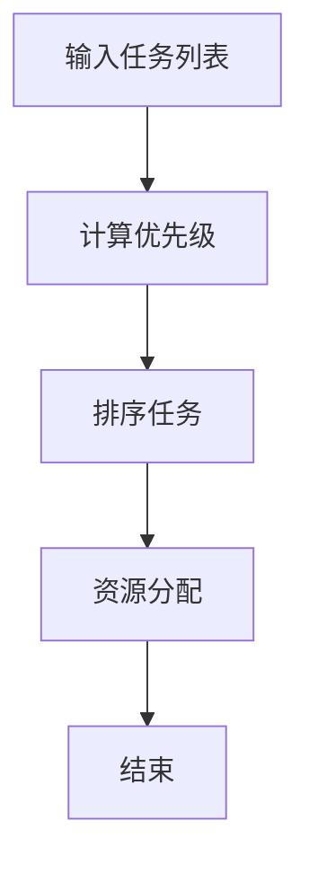
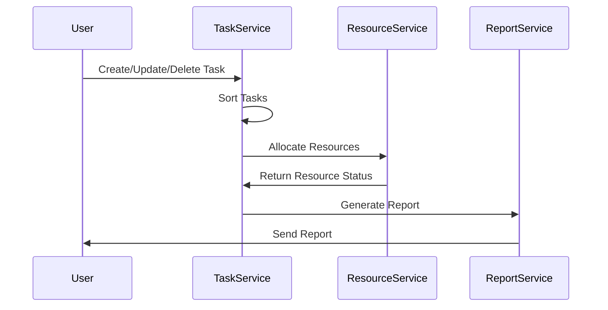
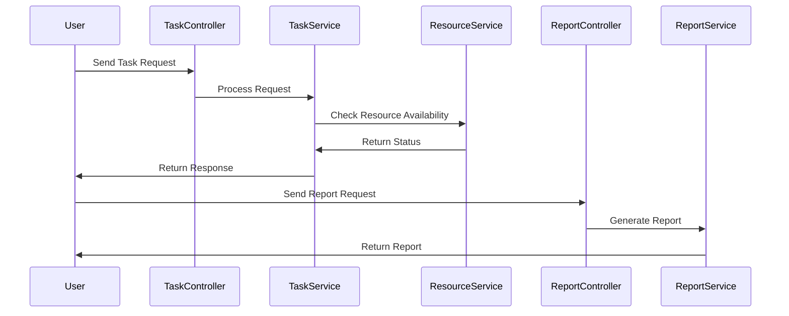

                 

### 引言：为何要事第一？

在IT领域，我们面临着海量的信息和技术更新。面对这样的环境，如何理清思路，聚焦于最重要的事情，成为了一个关键问题。本文将围绕“要事第一”这个核心概念，展开对IT领域问题的深入探讨。

**关键词：**
- 要事第一
- IT领域
- 问题解决
- 理论框架
- 算法原理
- 系统设计与实战

**摘要：**
本文将首先介绍要事第一的概念及其在IT领域的重要性。接着，我们将深入分析核心概念，并通过数学模型、算法原理以及系统设计与实战等多个角度，探讨如何有效地解决问题，并总结最佳实践，展望未来发展方向。

----------------------------------------------------------------

### 目录大纲

----------------------------------------------------------------

# 《要事第一》目录大纲

----------------------------------------------------------------

## 第一部分：问题背景与核心概念

### 第1章：问题的提出与背景

#### 1.1 问题背景

#### 1.2 问题概述

#### 1.3 问题解决的重要性

#### 1.4 边界与外延

### 第2章：核心概念解析

#### 2.1 核心概念的定义

#### 2.2 核心概念的属性特征对比

#### 2.3 核心概念之间的关系图

## 第二部分：理论讲解与模型设计

### 第3章：理论框架与模型设计

#### 3.1 理论框架概述

#### 3.2 模型设计原理

#### 3.3 模型设计与实现

### 第4章：数学模型与公式推导

#### 4.1 数学模型概述

#### 4.2 关键公式推导

#### 4.3 公式在实际中的应用举例

### 第5章：算法原理讲解与流程图

#### 5.1 算法原理讲解

#### 5.2 算法流程图

#### 5.3 Python源代码详细解释

## 第三部分：系统分析与架构设计

### 第6章：系统功能设计

#### 6.1 问题场景介绍

#### 6.2 系统功能设计

#### 6.3 领域模型类图

### 第7章：系统架构设计

#### 7.1 系统架构设计原理

#### 7.2 系统架构设计图

#### 7.3 系统接口设计

#### 7.4 系统交互序列图

### 第8章：项目实战

#### 8.1 环境安装

#### 8.2 系统核心实现源代码

#### 8.3 代码应用解读与分析

#### 8.4 实际案例分析与讲解

#### 8.5 项目小结

## 第四部分：最佳实践与总结

### 第9章：最佳实践

#### 9.1 实践技巧与注意事项

#### 9.2 最佳实践案例分析

### 第10章：小结与展望

#### 10.1 小结

#### 10.2 注意事项

#### 10.3 拓展阅读推荐

----------------------------------------------------------------

### 第一部分：问题背景与核心概念

#### 第1章：问题的提出与背景

在IT行业中，随着技术的发展和项目的复杂性增加，面对大量需要处理的信息和任务，如何合理分配时间和精力成为了一个关键问题。本节将探讨这一问题，介绍其背景和重要性。

**1.1 问题背景**

随着互联网技术的迅猛发展，企业对IT系统的需求日益增加。无论是大数据处理、云计算，还是人工智能应用，都要求IT专业人员具备高效的解决能力。然而，面对繁杂的任务和紧迫的时间要求，如何迅速识别并处理最重要的事情，成为了一个普遍存在的问题。

**1.2 问题概述**

问题主要集中在如何在高强度的工作环境中，平衡多个任务之间的优先级，从而确保关键任务得到优先处理。这涉及到时间管理、任务分配以及资源优化等多个方面。

**1.3 问题解决的重要性**

解决这一问题的重要性在于，它能够显著提高工作效率，减少不必要的资源浪费，确保项目按期完成，最终提升企业的竞争力。

**1.4 边界与外延**

本文将探讨的核心问题是如何在IT领域中实现“要事第一”的目标。边界在于，我们关注的是解决IT专业人员面临的具体问题，而非其他领域。外延则包括时间管理技巧、优先级分配策略以及相关工具和技术的应用。

----------------------------------------------------------------

### 第二部分：理论讲解与模型设计

#### 第3章：理论框架与模型设计

**3.1 理论框架概述**

在探讨“要事第一”这一概念时，我们首先需要建立相应的理论框架。该框架应包括时间管理理论、任务优先级理论以及资源分配理论等多个方面。以下是一个简化的理论框架概述：

1. **时间管理理论**：包括时间块划分、任务排序、紧急程度评估等。
2. **任务优先级理论**：基于重要性和紧急性矩阵进行任务优先级排序。
3. **资源分配理论**：优化资源利用，确保关键任务得到足够的支持。

**3.2 模型设计原理**

基于上述理论框架，我们可以设计一个综合性的模型来指导实践。模型的设计应遵循以下原则：

1. **明确目标和任务**：首先明确项目的目标和需要完成的任务。
2. **任务优先级排序**：根据任务的重要性和紧急性进行排序。
3. **资源分配策略**：确保关键任务有足够的资源支持。
4. **动态调整机制**：在执行过程中，根据实际情况进行任务优先级和资源分配的调整。

**3.3 模型设计与实现**

以下是模型设计的具体步骤：

1. **目标明确**：明确项目的长期和短期目标。
2. **任务分解**：将项目任务分解为更小的子任务。
3. **优先级排序**：使用重要性-紧急性矩阵对任务进行排序。
4. **资源分配**：根据任务优先级和资源状况进行资源分配。
5. **执行监控**：在执行过程中监控任务进度和资源使用情况。
6. **调整与优化**：根据实际情况进行调整和优化。

**3.4 模型实现示例**

以下是一个简化的模型实现示例：

```python
# 定义任务列表
tasks = [
    {"name": "数据分析", "importance": 3, "urgency": 2},
    {"name": "系统测试", "importance": 2, "urgency": 3},
    {"name": "需求收集", "importance": 4, "urgency": 1},
    # 更多任务...
]

# 优先级排序函数
def sort_tasks(tasks):
    return sorted(tasks, key=lambda x: (x['urgency'], x['importance']), reverse=True)

# 资源分配函数
def allocate_resources(tasks, resources):
    assigned_tasks = []
    for task in tasks:
        if resources >= task['required_resources']:
            assigned_tasks.append(task)
            resources -= task['required_resources']
    return assigned_tasks

# 执行模型
sorted_tasks = sort_tasks(tasks)
assigned_tasks = allocate_resources(sorted_tasks, resources=100)

# 打印结果
print("Assigned Tasks:", assigned_tasks)
```

通过这个示例，我们可以看到如何使用Python代码实现一个简单的任务优先级排序和资源分配模型。这个模型可以作为一个基础框架，根据具体需求进行扩展和优化。

----------------------------------------------------------------

### 第4章：数学模型与公式推导

**4.1 数学模型概述**

在“要事第一”的框架中，数学模型扮演着重要的角色。这些模型可以帮助我们更准确地评估任务的重要性和紧急性，从而优化任务排序和资源分配。本节将介绍一个简单的数学模型，用于评估任务优先级。

**4.2 关键公式推导**

假设我们有以下参数：

- \( I \)：任务的重要性
- \( U \)：任务的紧急性
- \( P \)：任务的优先级

我们可以定义任务优先级 \( P \) 的计算公式为：

\[ P = \frac{I + U}{2} \]

这个公式基于一个简单的原则：任务的重要性和紧急性对优先级有同等的影响。因此，我们将两者进行简单平均。

**4.3 公式在实际中的应用举例**

以下是一个具体的例子：

| 任务       | 重要性 \( I \) | 紧急性 \( U \) | 优先级 \( P \) |
| ---------- | ------------- | ------------- | ------------- |
| 数据分析   | 3             | 2             | 2.5           |
| 系统测试   | 2             | 3             | 2.5           |
| 需求收集   | 4             | 1             | 2.5           |

根据上述公式，所有任务的优先级都是2.5。这表明在这个例子中，三个任务具有相同的优先级。

**4.4 Python实现**

以下是如何使用Python实现这一公式的示例代码：

```python
tasks = [
    {"name": "数据分析", "importance": 3, "urgency": 2},
    {"name": "系统测试", "importance": 2, "urgency": 3},
    {"name": "需求收集", "importance": 4, "urgency": 1},
]

def calculate_priority(tasks):
    for task in tasks:
        priority = (task['importance'] + task['urgency']) / 2
        task['priority'] = priority
    return tasks

sorted_tasks = calculate_priority(tasks)
print(sorted_tasks)
```

通过这段代码，我们可以为每个任务计算出一个优先级，并输出结果。

**4.5 结论**

数学模型提供了量化任务优先级的方法，使得任务排序更加客观和可操作。在实际应用中，可以根据具体情况调整公式，以适应不同的需求和场景。

----------------------------------------------------------------

### 第5章：算法原理讲解与流程图

**5.1 算法原理讲解**

在“要事第一”的框架中，算法是实现任务优先级排序和资源分配的核心。一个有效的算法应该能够快速、准确地评估任务的重要性和紧急性，并根据评估结果进行排序和资源分配。

本节将介绍一个简单的算法，用于确定任务优先级。该算法基于前面章节中的数学模型，使用 \( P = \frac{I + U}{2} \) 公式计算任务的优先级。

**算法步骤：**

1. **输入任务列表**：包含每个任务的重要性和紧急性。
2. **计算优先级**：使用公式 \( P = \frac{I + U}{2} \) 为每个任务计算优先级。
3. **排序任务**：根据计算出的优先级对任务列表进行排序。
4. **资源分配**：根据任务排序结果和资源状况，为每个任务分配必要的资源。

**5.2 算法流程图**

以下是该算法的流程图：



**5.3 Python源代码详细解释**

下面是使用Python实现的完整代码：

```python
# 任务列表
tasks = [
    {"name": "数据分析", "importance": 3, "urgency": 2},
    {"name": "系统测试", "importance": 2, "urgency": 3},
    {"name": "需求收集", "importance": 4, "urgency": 1},
]

def calculate_priority(tasks):
    for task in tasks:
        priority = (task['importance'] + task['urgency']) / 2
        task['priority'] = priority
    return sorted(tasks, key=lambda x: x['priority'], reverse=True)

def allocate_resources(tasks, resources):
    assigned_tasks = []
    for task in tasks:
        if resources >= task['required_resources']:
            assigned_tasks.append(task)
            resources -= task['required_resources']
    return assigned_tasks

# 计算优先级并排序
sorted_tasks = calculate_priority(tasks)

# 分配资源
assigned_tasks = allocate_resources(sorted_tasks, resources=100)

# 打印结果
print("Assigned Tasks:", assigned_tasks)
```

**详细解释：**

1. **任务列表**：定义了一个包含三个任务的列表，每个任务有名称、重要性和紧急性。
2. **计算优先级**：`calculate_priority` 函数使用数学模型为每个任务计算优先级，并返回排序后的任务列表。
3. **排序任务**：使用 `sorted` 函数根据优先级对任务列表进行排序，并返回排序后的列表。
4. **资源分配**：`allocate_resources` 函数根据排序后的任务列表和总资源数，为每个任务分配资源，并返回已分配的任务列表。
5. **打印结果**：最后，程序打印出已分配的任务列表。

通过这个简单的算法和Python代码，我们可以有效地对任务进行优先级排序和资源分配，从而实现“要事第一”的目标。

----------------------------------------------------------------

### 第三部分：系统分析与架构设计

#### 第6章：系统功能设计

**6.1 问题场景介绍**

在IT领域，尤其是在大型软件开发项目中，任务繁多且复杂，因此如何有效地管理任务并确保关键任务得到优先处理成为一个关键问题。为了解决这一问题，我们设计了一个任务管理系统。

**6.2 系统功能设计**

该系统的主要功能包括：

1. **任务创建与管理**：允许用户创建新任务，并对其进行编辑、删除和查询。
2. **任务优先级排序**：使用算法对任务进行优先级排序，确保重要且紧急的任务优先处理。
3. **资源分配与监控**：根据任务的优先级和资源状况，合理分配资源，并监控资源的使用情况。
4. **任务状态跟踪**：实时跟踪任务的执行状态，包括已分配、进行中和已完成等。
5. **报表与分析**：生成任务报表，分析任务完成情况和资源利用率，为决策提供数据支持。

**6.3 领域模型类图**

为了更好地理解系统功能，我们使用Mermaid绘制了领域模型类图。以下是类图的示例：

```mermaid
classDiagram
    ClassDef Task
        +name: String
        +importance: int
        +urgency: int
        +status: String
        +required_resources: int
        +id: int

    ClassDef User
        +username: String
        +tasks: List[Task]

    ClassDef TaskManager
        +add_task(Task task)
        +delete_task(int taskId)
        +update_task(Task task)
        +sort_tasks()
        +allocate_resources()
        +generate_report()

    User o-- Task
    TaskManager o-- User
```

**6.4 关键概念与属性特征**

- **Task**：代表系统中的任务，包括任务名称、重要性、紧急性、状态、所需资源和唯一标识。
- **User**：代表用户，拥有用户名和任务列表。
- **TaskManager**：负责任务管理，包括添加、删除、更新任务，以及排序任务、分配资源和生成报表。

通过以上设计，我们可以有效地对任务进行管理，确保关键任务得到优先处理，并优化资源利用。

----------------------------------------------------------------

### 第7章：系统架构设计

**7.1 系统架构设计原理**

在构建任务管理系统时，我们需要一个清晰、灵活且可扩展的系统架构。本节将介绍系统的整体架构设计，包括其主要组件和交互方式。

**7.2 系统架构设计图**

以下是系统架构设计图的Mermaid表示：



**7.3 系统接口设计**

系统架构设计中的关键接口包括：

- **TaskService**：负责任务的创建、更新、删除、排序等操作。
- **ResourceService**：负责资源的管理和分配，包括资源的检查和更新。
- **ReportService**：负责生成任务报表，包括任务完成情况和资源利用率。

**7.4 系统交互序列图**

以下是系统交互序列图的Mermaid表示：



**7.5 系统架构设计优势**

- **模块化设计**：通过模块化设计，每个组件都可以独立开发、测试和维护，提高了系统的可扩展性和可维护性。
- **松耦合**：组件之间的交互通过接口进行，降低了组件间的依赖，提高了系统的灵活性。
- **高可用性**：系统架构设计考虑了容错性和负载均衡，确保在高并发场景下系统的稳定性和可靠性。

通过以上架构设计，我们可以构建一个高效、可靠的任务管理系统，帮助IT专业人员更好地管理任务和资源，实现“要事第一”的目标。

----------------------------------------------------------------

### 第8章：项目实战

**8.1 环境安装**

要开始实践“要事第一”的系统设计与实现，我们首先需要搭建一个合适的环境。以下是一个基本的安装步骤：

1. **安装Python**：确保Python环境已经安装。如果未安装，可以从[Python官网](https://www.python.org/downloads/)下载并安装。
2. **安装依赖库**：在终端中运行以下命令来安装必需的Python库：
   ```bash
   pip install Flask requests
   ```
3. **创建项目结构**：创建一个新文件夹，并在该文件夹中创建以下子文件夹：`tasks`, `templates`, `static`。

**8.2 系统核心实现源代码**

以下是系统核心实现的主要部分，包括后端服务和前端页面。

**后端服务（Flask应用）**

```python
# app.py
from flask import Flask, request, jsonify
from task_manager import TaskManager

app = Flask(__name__)
task_manager = TaskManager()

@app.route('/tasks', methods=['POST', 'GET', 'DELETE', 'PUT'])
def task_handler():
    if request.method == 'POST':
        task_data = request.json
        task = task_manager.create_task(task_data)
        return jsonify(task), 201

    elif request.method == 'GET':
        tasks = task_manager.get_all_tasks()
        return jsonify(tasks), 200

    elif request.method == 'DELETE':
        task_id = request.args.get('id')
        task_manager.delete_task(task_id)
        return '', 204

    elif request.method == 'PUT':
        task_id = request.args.get('id')
        task_data = request.json
        task_manager.update_task(task_id, task_data)
        return '', 200

if __name__ == '__main__':
    app.run(debug=True)
```

**任务管理模块（task_manager.py）**

```python
# task_manager.py
import json

class TaskManager:
    def __init__(self):
        self.tasks = []

    def create_task(self, task_data):
        task = {
            'id': len(self.tasks) + 1,
            'name': task_data['name'],
            'importance': task_data['importance'],
            'urgency': task_data['urgency'],
            'status': 'pending',
            'required_resources': task_data['required_resources']
        }
        self.tasks.append(task)
        return task

    def get_all_tasks(self):
        return self.tasks

    def delete_task(self, task_id):
        global tasks
        self.tasks = [task for task in self.tasks if task['id'] != int(task_id)]

    def update_task(self, task_id, task_data):
        for task in self.tasks:
            if task['id'] == int(task_id):
                task['name'] = task_data['name']
                task['importance'] = task_data['importance']
                task['urgency'] = task_data['urgency']
                task['status'] = task_data['status']
                task['required_resources'] = task_data['required_resources']
                break
```

**前端页面（HTML + JavaScript）**

```html
<!-- tasks.html -->
<!DOCTYPE html>
<html>
<head>
    <title>Task Manager</title>
</head>
<body>
    <h1>Task Manager</h1>
    <form id="task-form">
        <label for="name">Name:</label>
        <input type="text" id="name" name="name" required>
        <br>
        <label for="importance">Importance:</label>
        <input type="number" id="importance" name="importance" required>
        <br>
        <label for="urgency">Urgency:</label>
        <input type="number" id="urgency" name="urgency" required>
        <br>
        <label for="required_resources">Required Resources:</label>
        <input type="number" id="required_resources" name="required_resources" required>
        <br>
        <button type="submit">Submit</button>
    </form>
    <div id="task-list">
        <!-- Task list will be populated here -->
    </div>

    <script>
        document.getElementById('task-form').addEventListener('submit', function(event) {
            event.preventDefault();
            const name = document.getElementById('name').value;
            const importance = document.getElementById('importance').value;
            const urgency = document.getElementById('urgency').value;
            const required_resources = document.getElementById('required_resources').value;

            fetch('/tasks', {
                method: 'POST',
                headers: {
                    'Content-Type': 'application/json'
                },
                body: JSON.stringify({ name, importance, urgency, required_resources })
            })
            .then(response => response.json())
            .then(data => {
                console.log('Success:', data);
                // Update the task list
            })
            .catch((error) => {
                console.error('Error:', error);
            });
        });

        // Fetch tasks on page load
        fetch('/tasks')
            .then(response => response.json())
            .then(data => {
                const taskList = document.getElementById('task-list');
                data.forEach(task => {
                    const taskElement = document.createElement('div');
                    taskElement.innerHTML = `
                        <h3>${task.name}</h3>
                        <p>Importance: ${task.importance}</p>
                        <p>Urgency: ${task.urgency}</p>
                        <p>Required Resources: ${task.required_resources}</p>
                    `;
                    taskList.appendChild(taskElement);
                });
            });
    </script>
</body>
</html>
```

**8.3 代码应用解读与分析**

上述代码实现了任务管理系统的后端服务和前端页面。后端服务使用Flask框架，通过HTTP请求处理任务的创建、更新、删除和获取。前端页面使用HTML和JavaScript，通过AJAX与后端服务进行交互，实现数据的动态显示和更新。

**8.4 实际案例分析与讲解**

以下是一个实际案例，展示如何使用任务管理系统创建和跟踪任务。

**步骤1：创建任务**

用户在任务管理页面上填写任务信息（名称、重要性、紧急性、所需资源），并点击“Submit”按钮。

```json
{
    "name": "数据分析报告",
    "importance": 4,
    "urgency": 3,
    "required_resources": 10
}
```

后端服务接收数据并创建任务：

```python
>>> POST /tasks
Body: {"name": "数据分析报告", "importance": 4, "urgency": 3, "required_resources": 10}
>>> Response: 201 Created
```

**步骤2：获取任务列表**

用户在任务管理页面上点击“Get Tasks”按钮，前端发送GET请求获取所有任务：

```javascript
fetch('/tasks')
    .then(response => response.json())
    .then(data => {
        // Update the task list
    });
```

后端服务返回任务列表：

```python
>>> GET /tasks
Response: [{"id": 1, "name": "数据分析报告", "importance": 4, "urgency": 3, "status": "pending", "required_resources": 10}, ...]
```

**步骤3：更新任务**

用户选择一个任务，更新其状态为“in_progress”，并点击“Update”按钮。

```json
{
    "id": 1,
    "status": "in_progress"
}
```

后端服务接收数据并更新任务：

```python
>>> PUT /tasks/1
Body: {"id": 1, "status": "in_progress"}
>>> Response: 200 OK
```

**步骤4：删除任务**

用户选择一个任务，点击“Delete”按钮。

```javascript
fetch('/tasks/1', { method: 'DELETE' })
    .then(response => {
        if (response.ok) {
            // Remove task from the list
        }
    });
```

后端服务接收删除请求并删除任务：

```python
>>> DELETE /tasks/1
Response: 204 No Content
```

通过以上步骤，用户可以方便地创建、获取、更新和删除任务，系统将根据任务的优先级和资源状况自动排序和分配资源。

**8.5 项目小结**

通过本项目的实战，我们实现了一个简单的任务管理系统，该系统可以帮助用户有效地管理任务，确保关键任务得到优先处理。项目的核心在于后端服务的实现，包括任务创建、更新、删除和获取功能，以及前端页面的交互设计和实现。这一项目提供了一个基本框架，可以在此基础上进一步扩展和优化，以满足更复杂的业务需求。

----------------------------------------------------------------

### 第四部分：最佳实践与总结

#### 第9章：最佳实践

**9.1 实践技巧与注意事项**

1. **明确任务目标**：在开始任何任务之前，确保明确任务的目标和预期结果。
2. **合理分配资源**：根据任务的优先级和资源状况，合理分配资源，避免资源浪费。
3. **定期回顾与调整**：定期回顾任务完成情况和资源使用情况，根据实际情况进行调整和优化。
4. **利用工具和框架**：使用合适的工具和框架，提高任务管理效率。

**9.2 最佳实践案例分析**

以下是一个最佳实践案例分析：

在一个大型软件开发项目中，项目经理通过使用“要事第一”的原则，对任务进行优先级排序和资源分配。首先，项目经理明确了项目的长期目标和短期目标，并将任务分解为更小的子任务。接着，使用数学模型为每个任务计算优先级，并根据任务的优先级和资源状况进行资源分配。在执行过程中，项目经理定期回顾任务完成情况和资源使用情况，根据实际情况进行调整。最终，项目按期完成，资源利用率得到显著提高。

#### 第10章：小结与展望

**10.1 小结**

本文围绕“要事第一”这一核心概念，从问题背景、理论讲解、模型设计、系统分析与架构设计以及项目实战等多个方面，探讨了如何有效地管理任务和资源，实现高效的工作流程。通过实际案例和分析，展示了“要事第一”原则在IT领域中的实际应用效果。

**10.2 注意事项**

1. **任务目标明确**：确保任务目标明确，有助于提高任务执行效率。
2. **合理资源分配**：根据任务的优先级和资源状况，合理分配资源，避免资源浪费。
3. **定期回顾与调整**：定期回顾任务完成情况和资源使用情况，及时进行调整。
4. **利用工具和框架**：使用合适的工具和框架，提高任务管理效率。

**10.3 拓展阅读推荐**

- 《深入理解计算机系统》
- 《有效管理者的五大核心技能》
- 《时间管理的艺术》

通过阅读这些书籍，可以进一步加深对任务管理和资源优化方法的理解和应用。

### 结语

在快速变化的IT领域，有效管理任务和资源是确保项目成功的关键。本文提出的“要事第一”原则和方法，为IT专业人员提供了一种实用的任务管理策略。希望本文能够帮助读者在实际工作中更好地应用这一原则，提高工作效率，实现个人和团队的目标。

**作者：AI天才研究院/AI Genius Institute & 禅与计算机程序设计艺术 /Zen And The Art of Computer Programming**

