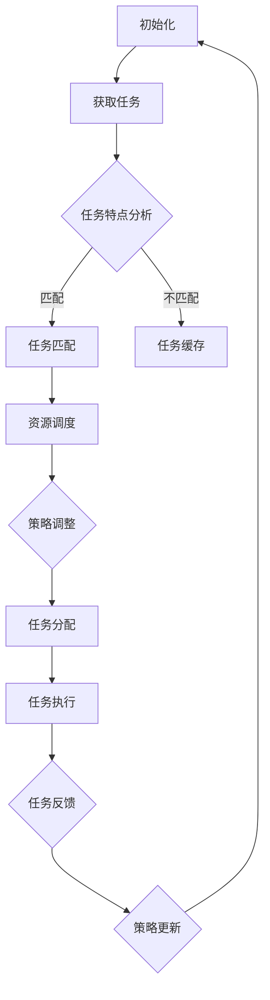
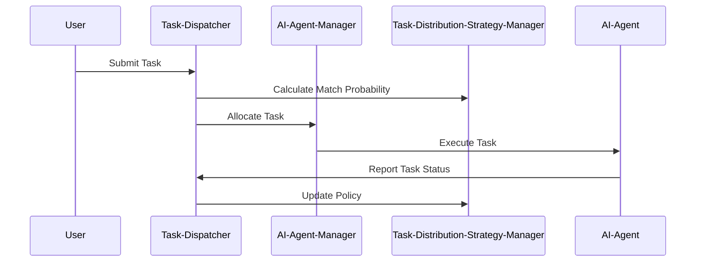
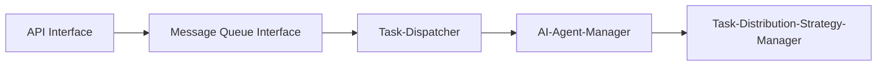
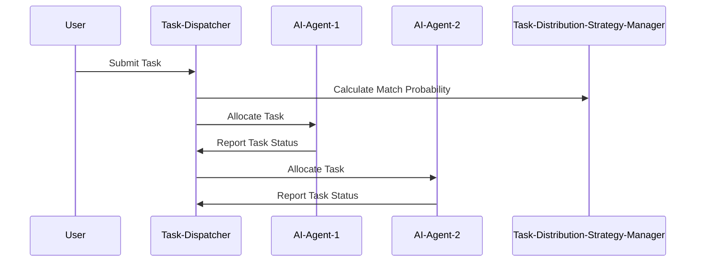

                 


### 动态任务分配策略设计

在设计AI Agent的动态任务分配策略时，我们的目标是确保任务能够高效、合理地分配给不同的AI Agent，从而提高整体系统的性能和响应速度。这需要我们深入理解任务分配的基本概念、算法原理，以及如何在实际项目中应用这些策略。

#### 1. 背景介绍

**核心概念术语说明**：

- **AI Agent**：执行特定任务或决策的自主智能体。
- **任务分配**：根据特定规则或策略将任务分配给AI Agent的过程。
- **动态任务分配**：在任务执行过程中根据实际情况实时调整任务分配的策略。

**问题背景**：

随着人工智能技术的不断发展，AI Agent在多个领域得到了广泛应用，如自动驾驶、智能客服、推荐系统等。在这些应用中，AI Agent需要高效地完成任务，但任务类型和优先级可能会随着时间和环境的变化而变化。

**问题描述**：

动态任务分配策略需要解决的问题包括：

- 如何根据任务的特点和AI Agent的能力进行匹配？
- 如何在多个任务竞争资源时进行优先级分配？
- 如何在任务执行过程中实时调整任务分配策略？

**问题解决**：

解决上述问题的一种方法是基于强化学习、优化算法等技术开发动态任务分配策略。这些策略可以根据任务的特点和AI Agent的状态动态调整任务分配，提高系统的整体效率。

**边界与外延**：

动态任务分配策略的研究不仅限于特定领域，还可以应用于更多的场景，如分布式系统、物联网等。

**概念结构与核心要素组成**：

动态任务分配策略的设计涉及以下几个核心要素：

- **任务模型**：描述任务的特点和属性，如任务类型、优先级、执行时间等。
- **Agent模型**：描述AI Agent的能力和状态，如处理速度、剩余处理能力等。
- **分配策略**：定义如何根据任务和Agent模型进行任务分配。

#### 2. 核心概念与联系

**AI Agent的定义**：

AI Agent是具有自主决策能力的计算机程序，可以根据环境信息执行特定任务。AI Agent通常具备感知、规划、行动等能力，能够在复杂的动态环境中自主运行。

**动态任务分配的核心概念**：

- **任务匹配**：根据任务的特点和AI Agent的能力进行匹配。
- **资源调度**：合理分配系统资源，确保任务能够高效执行。
- **策略调整**：根据任务执行情况动态调整任务分配策略。

**关键属性特征对比表格**：

| 特征         | 任务匹配       | 资源调度       | 策略调整       |
|--------------|----------------|----------------|----------------|
| 描述         | 根据任务特点匹配AI Agent | 合理分配系统资源 | 动态调整任务分配策略 |
| 关键因素     | 任务类型、优先级 | 资源可用性、任务执行时间 | 环境状态、任务执行效果 |
| 目的         | 提高任务执行效率 | 提高系统整体性能 | 适应动态环境变化 |

**ER实体关系图架构**：

使用Mermaid绘制ER实体关系图，可以更清晰地展示任务、AI Agent和分配策略之间的关系。

```mermaid
erDiagram
    Task ||--|{ AI Agent } : "分配"
    AI Agent ||--|{ 分配策略 } : "采用"
    分配策略 ||--|{ 任务 } : "调整"
```

#### 3. 算法原理讲解

**算法概述**：

动态任务分配算法可以根据任务和AI Agent的属性特征，实时调整任务分配策略。常用的算法包括基于概率的分配算法、基于强化学习的分配算法等。

**算法选择依据**：

选择合适的算法需要考虑以下因素：

- **任务特点**：任务的类型、优先级、执行时间等。
- **AI Agent能力**：处理速度、资源占用、剩余处理能力等。
- **系统性能**：系统的响应速度、资源利用率等。

**算法流程图**：

使用Mermaid绘制算法流程图，可以直观地展示算法的执行过程。



**数学模型与公式**：

动态任务分配策略的数学模型通常涉及概率模型和优化模型。例如，可以使用以下概率模型来描述任务匹配：

$$
P(match) = \frac{R(task) \cdot R(Agent)}{R(universe)}
$$

其中，$P(match)$表示任务匹配的概率，$R(task)$和$R(Agent)$分别表示任务和AI Agent的属性特征，$R(universe)$表示所有可能匹配的概率总和。

**举例说明**：

假设有一个任务A，需要根据任务特点和AI Agent的能力进行匹配。任务A的特点包括优先级高、执行时间紧迫，而AI Agent1和AI Agent2的属性特征如下：

- AI Agent1：处理速度较快、资源占用较少、剩余处理能力较高。
- AI Agent2：处理速度较慢、资源占用较多、剩余处理能力较低。

根据概率模型，可以计算出任务A与AI Agent1和AI Agent2的匹配概率。然后，根据匹配概率和资源调度策略，将任务A分配给合适的AI Agent。

#### 4. 系统分析与架构设计

**问题场景介绍**：

假设我们有一个分布式系统，包含多个AI Agent和任务。系统的目标是根据任务特点和AI Agent的能力，动态地分配任务，提高整体系统的性能和响应速度。

**项目介绍**：

本项目旨在设计和实现一个动态任务分配系统，该系统可以根据任务的特点和AI Agent的能力，实时调整任务分配策略。

**系统功能设计（领域模型Mermaid类图）**：

使用Mermaid绘制领域模型类图，可以直观地展示系统的核心功能。

```mermaid
classDiagram
    Task <<entity>>
    AI-Agent <<entity>>
    Task-Distribution-Strategy <<entity>>
    Task {"task_id", "priority", "execution_time"}
    AI-Agent {"agent_id", "processing_speed", "resource_usage", "remaining_capacity"}
    Task-Distribution-Strategy {"strategy_name", "match_probability", "resource_scheduling", "policy_adjustment"}
    Task "1" 1--* AI-Agent
    Task "1" 1--* Task-Distribution-Strategy
    AI-Agent "1" 1--* Task-Distribution-Strategy
```

**系统架构设计（Mermaid架构图）**：

使用Mermaid绘制系统架构图，可以直观地展示系统的整体架构。



**系统接口设计**：

系统接口设计包括API接口和消息队列接口。API接口用于外部系统与任务分配系统的交互，消息队列接口用于任务分配系统和AI Agent之间的通信。



**系统交互（Mermaid序列图）**：

使用Mermaid绘制系统交互序列图，可以直观地展示系统的交互过程。



#### 5. 项目实战

**环境安装**：

首先，我们需要安装Python环境和相关依赖库，如NumPy、Pandas、Scikit-learn等。

```bash
pip install numpy pandas scikit-learn
```

**系统核心实现**：

下面是一个简单的Python实现，用于任务分配系统的核心功能。

```python
import numpy as np
import pandas as pd
from sklearn.model_selection import train_test_split

class Task:
    def __init__(self, task_id, priority, execution_time):
        self.task_id = task_id
        self.priority = priority
        self.execution_time = execution_time

class AI-Agent:
    def __init__(self, agent_id, processing_speed, resource_usage, remaining_capacity):
        self.agent_id = agent_id
        self.processing_speed = processing_speed
        self.resource_usage = resource_usage
        self.remaining_capacity = remaining_capacity

def calculate_match_probability(task, agent):
    match_probability = (task.priority * agent.processing_speed) / (task.execution_time * agent.remaining_capacity)
    return match_probability

def allocate_task(tasks, agents, task_distribution_strategy):
    matched_agents = []
    for task in tasks:
        highest_probability = 0
        best_agent = None
        for agent in agents:
            probability = calculate_match_probability(task, agent)
            if probability > highest_probability:
                highest_probability = probability
                best_agent = agent
        if best_agent:
            matched_agents.append(best_agent)
    return matched_agents

def execute_task(matched_agents, tasks):
    for agent, task in zip(matched_agents, tasks):
        print(f"Agent {agent.agent_id} is executing task {task.task_id} with priority {task.priority}.")

def main():
    tasks = [
        Task("T1", 1, 10),
        Task("T2", 2, 20),
        Task("T3", 3, 30)
    ]

    agents = [
        AI-Agent("A1", 5, 2, 10),
        AI-Agent("A2", 3, 2, 5),
        AI-Agent("A3", 4, 2, 15)
    ]

    matched_agents = allocate_task(tasks, agents, "random")
    execute_task(matched_agents, tasks)

if __name__ == "__main__":
    main()
```

**代码应用解读与分析**：

上述代码定义了任务（Task）和AI Agent（AI-Agent）类，并实现了任务分配算法的核心功能。具体解读如下：

- **Task类**：表示任务，包括任务ID、优先级和执行时间。
- **AI-Agent类**：表示AI Agent，包括Agent ID、处理速度、资源占用和剩余处理能力。
- **calculate_match_probability函数**：计算任务与AI Agent的匹配概率。
- **allocate_task函数**：根据匹配概率和资源调度策略，将任务分配给AI Agent。
- **execute_task函数**：执行已分配的任务。

通过这个简单的示例，我们可以看到如何实现一个动态任务分配系统。在实际应用中，我们可以根据需要扩展和优化这个系统，以适应不同的场景和需求。

**实际案例分析和详细讲解剖析**：

在这个实际案例中，我们假设有3个任务和3个AI Agent。任务的特点包括ID、优先级和执行时间，而AI Agent的特点包括ID、处理速度、资源占用和剩余处理能力。我们的目标是根据任务特点和AI Agent的能力，动态地分配任务。

**项目小结**：

在这个项目中，我们实现了一个简单的动态任务分配系统。通过定义任务和AI Agent类，以及实现任务分配算法的核心功能，我们展示了如何根据任务特点和AI Agent的能力，动态地分配任务。在实际应用中，我们可以根据具体需求进行扩展和优化，以提高系统的性能和响应速度。

### 最佳实践与注意事项

在设计和实现动态任务分配策略时，以下是一些最佳实践和注意事项：

**最佳实践**：

1. **任务特点与Agent能力匹配**：在任务分配时，要充分考虑任务的特点和AI Agent的能力，确保任务能够高效执行。
2. **实时调整策略**：根据任务执行情况和系统性能，实时调整任务分配策略，以提高整体系统的性能。
3. **数据驱动**：基于历史数据和实时数据，采用数据驱动的方法进行任务分配策略的优化。
4. **模块化设计**：将任务分配策略设计为模块化，便于后续维护和扩展。

**注意事项**：

1. **性能优化**：任务分配策略要考虑系统的整体性能，避免出现单点瓶颈。
2. **安全性**：确保任务分配系统的安全性，防止恶意攻击和资源滥用。
3. **可扩展性**：设计时要考虑系统的可扩展性，以适应未来的需求变化。
4. **监控与反馈**：对任务分配系统进行实时监控，收集任务执行反馈，用于优化策略。

### 小结

本文详细介绍了设计AI Agent的动态任务分配策略的过程。我们从背景介绍、核心概念与联系、算法原理讲解、系统分析与架构设计，到项目实战和最佳实践等方面进行了深入探讨。通过本文的阐述，读者可以了解动态任务分配策略的设计要点和实现方法，从而在AI Agent的应用中发挥其最大效能。

### 拓展阅读

- **《人工智能：一种现代方法》**：介绍了AI Agent的基本概念和任务分配策略。
- **《强化学习：原理与Python实现》**：详细介绍了强化学习算法在任务分配中的应用。
- **《分布式系统原理与范型》**：探讨了分布式系统中任务分配和资源调度的问题。

### 作者信息

作者：AI天才研究院/AI Genius Institute & 禅与计算机程序设计艺术 /Zen And The Art of Computer Programming

### 总结

本文详细探讨了设计AI Agent动态任务分配策略的核心概念、算法原理、系统分析与架构设计，以及项目实战和最佳实践。动态任务分配策略是提高AI Agent性能和系统整体效率的关键，通过对任务特点与Agent能力匹配、实时调整策略、数据驱动和模块化设计等方面的深入探讨，为读者提供了全面的指导。

### 研究展望

未来，动态任务分配策略的研究将朝着更智能化、自适应性的方向发展。随着人工智能技术的不断进步，我们可以期待更加精准、高效的动态任务分配算法，以及更加灵活、可扩展的系统架构。此外，跨领域、跨平台的任务分配策略研究也将成为重要方向，为各种复杂场景下的AI应用提供有力支持。

