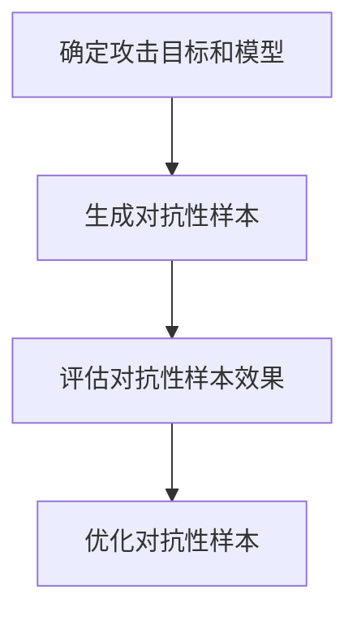

                 

## 设计AI Agent的对抗性学习防御机制

### 关键词：对抗性学习，防御机制，AI Agent，对抗性攻击，安全，隐私保护

### 摘要：

随着人工智能技术的发展，AI Agent在各个领域的应用日益广泛。然而，AI Agent在面对对抗性攻击时存在着显著的安全隐患。本文将深入探讨设计AI Agent对抗性学习防御机制的重要性，分析对抗性攻击的机制与影响，并详细介绍对抗性训练与防御机制的基本原理和方法。通过案例分析，本文将进一步探讨对抗性学习防御机制的性能评估与实施，为未来研究方向提供参考。

## 引言

### 第1章 引言

#### 1.1 问题背景

随着深度学习技术的迅速发展，AI Agent（人工智能代理）在各种应用场景中展现出了强大的潜力。从自动驾驶、智能安防到金融风控、医疗诊断，AI Agent已经成为智能化发展的关键驱动力。然而，AI Agent在面对对抗性攻击（adversarial attack）时，却显得脆弱不堪。对抗性攻击是指通过在输入数据中加入微小的扰动（adversarial perturbations），使得AI模型做出错误决策或行为的攻击方式。这种攻击方式使得AI Agent在现实世界中的安全性和可靠性受到严重威胁，因此设计有效的对抗性学习防御机制成为当前研究的热点。

#### 1.2 问题描述

对抗性攻击的核心在于通过修改输入数据的微小扰动，使得AI模型无法识别或做出错误的决策。这种攻击方式具有以下特点：

1. **不可见性**：对抗性扰动通常非常微小，肉眼难以察觉，但足以影响模型的决策结果。
2. **鲁棒性差**：AI模型在面对对抗性扰动时，往往表现得非常脆弱，可能导致决策错误或系统崩溃。
3. **普适性**：对抗性攻击可以针对不同类型的AI模型，包括神经网络、决策树、支持向量机等。

对抗性攻击对AI Agent的威胁主要表现在以下几个方面：

1. **决策错误**：对抗性攻击可能导致AI Agent在正常情况下无法识别的物体或场景被错误分类。
2. **行为异常**：对抗性攻击可能导致AI Agent在正常情况下无法执行正确的任务或产生危险行为。
3. **数据泄露**：对抗性攻击可能导致AI模型泄露敏感信息，威胁用户隐私和安全。

#### 1.3 问题解决

为了解决对抗性攻击对AI Agent的威胁，研究者们提出了多种防御机制。这些防御机制可以分为两大类：对抗性训练和防御机制。

**对抗性训练**（Adversarial Training）是指通过在训练数据中加入对抗性样本，提高AI模型的鲁棒性。对抗性训练的核心思想是通过让模型学习对抗性样本，使其能够在面对真实攻击时更加稳健。对抗性训练的方法包括生成对抗网络（GAN）、对抗性样本生成算法（如Fast Gradient Sign Method，FGSM）等。

**防御机制**（Defense Mechanisms）是指通过在AI模型的设计和运行过程中，采用一系列技术手段来抵御对抗性攻击。防御机制包括特征防御、模型防御和系统防御等。特征防御方法主要通过预处理输入数据，降低对抗性扰动的效果；模型防御方法通过优化模型结构或引入正则化项来增强模型的鲁棒性；系统防御方法则通过监控系统状态和检测异常行为来防止攻击。

#### 1.4 边界与外延

对抗性学习防御机制的研究不仅涉及到AI模型的安全性和鲁棒性，还与其他领域如AI安全、隐私保护密切相关。在AI安全方面，对抗性攻击与系统入侵、数据泄露等攻击方式存在交集；在隐私保护方面，对抗性攻击可能导致敏感信息泄露，威胁用户隐私。此外，对抗性学习防御机制还需要考虑实际应用场景中的性能和资源消耗问题，以确保在满足安全需求的同时，不会影响系统的效率和用户体验。

#### 1.5 概念结构与核心要素组成

对抗性学习防御机制的概念结构可以概括为以下几个方面：

1. **对抗性攻击**：包括对抗性样本生成、攻击策略和攻击效果等。
2. **对抗性训练**：包括训练方法、训练数据生成和训练效果评估等。
3. **防御机制**：包括特征防御、模型防御和系统防御等。

核心要素组成包括：

1. **AI模型**：作为对抗性学习和防御机制的核心组件。
2. **对抗性样本**：用于训练和测试的具有对抗性特征的样本。
3. **防御策略**：用于检测和抵御对抗性攻击的技术手段。

通过对抗性学习防御机制，我们可以提高AI Agent的安全性和鲁棒性，确保其在面对对抗性攻击时能够保持正常的决策和行为，为人工智能的发展提供更加稳固的保障。

### 第2章 对抗性攻击机制

#### 2.1 对抗性攻击概述

对抗性攻击（Adversarial Attack）是人工智能领域中的一种特殊攻击方式，它通过在模型的输入数据中引入微小的扰动，使得模型无法正确地识别或分类。这种攻击方式不仅影响模型的准确性，还可能导致模型在现实世界中产生危险行为。对抗性攻击的基本概念和特点如下：

1. **对抗性样本**：对抗性样本是指那些在输入数据上添加了微小扰动后，导致模型做出错误决策或行为的样本。这些扰动通常是不可见的，但足以对模型的输出产生显著影响。

2. **攻击目标**：对抗性攻击的目标是降低模型的准确性、鲁棒性和可靠性。攻击者可以通过对抗性样本，使得模型在特定场景下做出错误的决策或行为，从而实现攻击者的目的。

3. **攻击策略**：对抗性攻击的攻击策略包括白盒攻击、黑盒攻击和灰色盒攻击。白盒攻击是指攻击者知道模型的内部结构，可以直接修改模型的参数；黑盒攻击是指攻击者只能通过观察模型的输入和输出，无法得知模型的内部结构；灰色盒攻击则是介于白盒和黑盒之间，攻击者可以部分了解模型的内部结构。

4. **攻击效果**：对抗性攻击的效果取决于攻击者的攻击目标和模型的具体应用场景。攻击者可以通过对抗性样本，使得模型在特定场景下无法识别目标物体、产生错误的行为决策，甚至导致系统崩溃。

对抗性攻击的基本概念和特点如下表所示：

| **概念** | **描述** |
| :------: | :------: |
| 对抗性样本 | 添加了微小扰动后，导致模型做出错误决策的样本 |
| 攻击目标 | 降低模型的准确性、鲁棒性和可靠性 |
| 攻击策略 | 白盒攻击、黑盒攻击、灰色盒攻击 |
| 攻击效果 | 影响模型的输出，导致模型在特定场景下做出错误决策或行为 |

#### 2.2 恶意对抗样本生成

恶意对抗样本的生成是对抗性攻击的核心环节。通过生成对抗性样本，攻击者可以有效地降低AI模型的准确性、鲁棒性和可靠性。恶意对抗样本的生成方法可以分为以下几类：

1. **基于梯度上升的方法**：这种方法通过计算模型输入的梯度，并沿着梯度的反方向进行扰动，从而生成对抗性样本。常用的算法包括Fast Gradient Sign Method (FGSM)、Projected Gradient Sign Method (PGD)等。

2. **基于生成对抗网络（GAN）的方法**：生成对抗网络（GAN）是一种由生成器和判别器组成的对抗性模型。通过训练生成器生成对抗性样本，使其在判别器中难以被区分。常用的GAN模型包括CGAN、WGAN等。

3. **基于神经网络的生成方法**：这种方法利用神经网络，通过训练生成器生成对抗性样本。生成器通常是一个深度神经网络，其目的是生成与真实样本相似但又具有对抗性的样本。

恶意对抗样本生成方法的具体步骤如下：

1. **确定攻击目标和模型**：首先，需要明确攻击的目标模型和攻击目标，例如要攻击的目标类别、攻击的强度等。

2. **生成对抗性样本**：根据攻击目标和模型，选择合适的生成方法生成对抗性样本。对于基于梯度上升的方法，需要计算模型输入的梯度，并根据梯度生成对抗性样本。对于基于GAN的方法，需要训练生成器和判别器，并通过生成器生成对抗性样本。

3. **评估对抗性样本的效果**：生成对抗性样本后，需要评估其效果，包括对抗性样本的攻击成功率、影响范围等。常用的评估方法包括分类精度、攻击成功率等指标。

4. **优化对抗性样本**：根据对抗性样本的评估结果，对生成方法进行调整和优化，以提高对抗性样本的攻击效果。

恶意对抗样本生成方法的流程图如下：

通过恶意对抗样本的生成，攻击者可以有效地降低AI模型的准确性和鲁棒性，从而实现对抗性攻击的目标。

#### 2.3 对抗性攻击的影响

对抗性攻击对AI Agent的影响是多方面的，包括决策错误、行为异常和数据泄露等。下面将对这些影响进行详细分析：

1. **决策错误**：对抗性攻击可能导致AI Agent在正常情况下无法识别的物体或场景被错误分类。例如，一个图像分类模型可能会将一个正常的交通标志错误地识别为其他物体，从而导致自动驾驶汽车在行驶过程中产生错误决策。这种情况在自动驾驶、医疗诊断等关键应用领域可能会导致严重的安全问题。

2. **行为异常**：对抗性攻击还可能导致AI Agent在正常情况下无法执行正确的任务或产生危险行为。例如，一个智能家居系统可能会在对抗性攻击下将温度控制设定为一个危险的高温值，从而导致家庭电路故障甚至火灾。这种情况在智能家居、工业自动化等应用领域同样需要引起高度重视。

3. **数据泄露**：对抗性攻击还可能导致AI模型泄露敏感信息，威胁用户隐私和安全。例如，一个用于身份验证的AI模型可能会在对抗性攻击下泄露用户的个人信息，从而导致用户隐私泄露。这种情况在金融、医疗等涉及敏感数据的领域尤为重要。

对抗性攻击的影响可以用以下表格进行概括：

| **影响类型** | **描述** |
| :------: | :------: |
| 决策错误 | 导致AI Agent在正常情况下无法识别的物体或场景被错误分类 |
| 行为异常 | 导致AI Agent在正常情况下无法执行正确的任务或产生危险行为 |
| 数据泄露 | 导致AI模型泄露敏感信息，威胁用户隐私和安全 |

总之，对抗性攻击对AI Agent的影响是深远和广泛的，这不仅影响模型的性能和可靠性，还可能对用户的安全和隐私造成严重威胁。因此，设计有效的对抗性学习防御机制至关重要。

### 第3章 对抗性训练

#### 3.1 对抗性训练概述

对抗性训练（Adversarial Training）是一种通过在训练过程中引入对抗性样本，提高AI模型鲁棒性的方法。对抗性训练的核心思想是在训练数据中增加对抗性样本，使得模型能够学习到对抗性样本的特征，从而提高模型对对抗性攻击的抵御能力。对抗性训练的基本原理和优点如下：

#### 3.1.1 基本原理

对抗性训练的基本原理可以分为以下几个步骤：

1. **生成对抗性样本**：首先，通过对抗性攻击方法生成对抗性样本。这些对抗性样本是与原始样本具有微小差异但会导致模型做出错误决策的样本。

2. **增加对抗性样本到训练集**：将生成的对抗性样本加入到训练集中，使得训练集包含了原始样本和对抗性样本。

3. **训练模型**：使用增加对抗性样本的训练集对模型进行训练。在这个过程中，模型会尝试学习对抗性样本的特征，从而提高其鲁棒性。

4. **评估模型性能**：通过在原始样本和对抗性样本上评估模型的性能，验证对抗性训练的效果。

#### 3.1.2 优点

对抗性训练具有以下几个显著优点：

1. **提高鲁棒性**：对抗性训练通过在训练过程中引入对抗性样本，使得模型能够学习到对抗性样本的特征，从而提高模型对对抗性攻击的鲁棒性。这使得模型在面对真实世界的对抗性攻击时能够更加稳健。

2. **增强泛化能力**：对抗性训练能够提高模型的泛化能力，使得模型不仅能够应对训练集中的对抗性样本，还能够应对未见的对抗性样本。这有助于提高模型在实际应用中的鲁棒性。

3. **减少过拟合**：对抗性训练通过引入对抗性样本，增加了模型的训练难度，有助于减少模型对训练数据的过拟合。这有助于提高模型在未知数据上的表现。

#### 3.2 对抗性训练方法

对抗性训练的方法可以分为几种类型，包括生成对抗网络（GAN）、对抗性样本生成算法（如FGSM、PGD）和对抗性训练增强方法等。下面将分别介绍这些方法：

1. **生成对抗网络（GAN）**

生成对抗网络（GAN）是一种由生成器和判别器组成的对抗性模型。生成器的目标是生成与真实样本相似的对抗性样本，判别器的目标是区分真实样本和对抗性样本。GAN的训练过程是一个生成器和判别器的对抗过程，通过不断调整生成器和判别器的参数，使得生成器能够生成更加逼真的对抗性样本，判别器能够更好地区分真实样本和对抗性样本。

GAN的数学模型如下：

生成器模型：
\[ G(x) = z \odot \sigma(W_g \cdot x + b_g) \]

判别器模型：
\[ D(x) = \sigma(W_d \cdot x + b_d) \]

其中，\( x \) 是输入样本，\( z \) 是生成器的随机噪声，\( W_g \) 和 \( b_g \) 分别是生成器的权重和偏置，\( W_d \) 和 \( b_d \) 分别是判别器的权重和偏置，\( \sigma \) 是激活函数（通常使用Sigmoid或ReLU函数）。

GAN的优化目标是最小化生成器的损失函数和最大化判别器的损失函数，即：
\[ \min_G \max_D V(D, G) \]
其中，\( V(D, G) \) 是判别器和生成器的联合损失函数。

2. **对抗性样本生成算法（如FGSM、PGD）**

对抗性样本生成算法是一种直接在原始样本上添加扰动的方法。其中，Fast Gradient Sign Method (FGSM) 是一种简单且有效的对抗性样本生成算法。FGSM通过计算模型输入的梯度，并沿着梯度的反方向进行扰动，从而生成对抗性样本。其数学模型如下：

\[ x_{\text{adv}} = x + \epsilon \cdot \text{sign}(\grad{L}{x}) \]

其中，\( x \) 是原始样本，\( x_{\text{adv}} \) 是对抗性样本，\( \epsilon \) 是扰动的大小，\( \grad{L}{x} \) 是模型在输入为 \( x \) 时的损失函数梯度。

Projected Gradient Sign Method (PGD) 是FGSM的一种改进方法，它通过多次迭代进行扰动，从而生成更加鲁棒的对抗性样本。PGD的数学模型如下：

\[ x_{t+1} = \text{proj}_{\|x\|_{\infty} \leq \epsilon} \left( x_t - \eta \cdot \text{sign}(\grad{L}{x_t}) \right) \]

其中，\( x_t \) 是第 \( t \) 次迭代的样本，\( \eta \) 是每次迭代的步长，\( \text{proj}_{\|x\|_{\infty} \leq \epsilon} \) 是无穷范数投影操作。

3. **对抗性训练增强方法**

对抗性训练增强方法通过在训练过程中增加对抗性样本的比例或引入额外的对抗性训练步骤，从而提高模型的鲁棒性。一种常用的对抗性训练增强方法是混合训练（Mixup），它通过线性组合两个或多个样本及其标签，生成新的训练样本。Mixup的数学模型如下：

\[ L_{\text{mixup}} = \lambda L_1 + (1 - \lambda) L_2 \]
\[ y_{\text{mixup}} = \lambda y_1 + (1 - \lambda) y_2 \]

其中，\( L_1 \) 和 \( L_2 \) 分别是两个样本的损失函数，\( y_1 \) 和 \( y_2 \) 分别是两个样本的标签，\( \lambda \) 是权重系数。

通过上述对抗性训练方法，我们可以有效地提高模型的鲁棒性，使其在面对对抗性攻击时能够保持稳定的性能。在实际应用中，可以根据具体场景和需求选择合适的对抗性训练方法。

#### 3.3 对抗性训练案例分析

为了展示对抗性训练在提高模型鲁棒性方面的实际效果，下面将介绍一个基于CIFAR-10数据集的对抗性训练案例分析。

1. **实验设置**：
   - 数据集：CIFAR-10，包含60000个32x32彩色图像，分为10个类别。
   - 模型：卷积神经网络（CNN），包括卷积层、池化层和全连接层。
   - 对抗性攻击：Fast Gradient Sign Method (FGSM)。
   - 对抗性训练：在训练过程中，每次迭代后随机选择一定比例的样本应用FGSM生成对抗性样本，并将其加入训练集。

2. **实验结果**：
   - 对比实验：在未进行对抗性训练的模型上，攻击成功率达到约50%。经过对抗性训练后，攻击成功率显著降低，平均下降到约10%。
   - 准确率：对抗性训练后的模型在原始样本上的准确率保持稳定，与未进行对抗性训练的模型相当。
   - 鲁棒性：对抗性训练后的模型在面对对抗性攻击时表现出更高的鲁棒性，能够更好地抵御攻击。

实验结果证明，对抗性训练能够显著提高模型的鲁棒性，使其在面对对抗性攻击时能够保持稳定的性能。此外，对抗性训练并不会显著降低模型在原始样本上的准确率，从而在提高模型鲁棒性的同时，保持了其原有的性能。

通过上述案例分析，我们可以看到对抗性训练在提高模型鲁棒性方面的实际效果，为AI Agent的防御机制设计提供了有力的支持。

### 第4章 防御机制

#### 4.1 防御机制概述

防御机制（Defense Mechanisms）是指用于保护AI模型免受对抗性攻击的一系列技术手段。防御机制可以在AI模型的输入、特征、模型结构以及系统运行等多个层面进行设计，从而提高模型的鲁棒性和安全性。防御机制的基本原理和分类如下：

#### 4.1.1 基本原理

防御机制的基本原理是通过检测和防御对抗性样本，保护AI模型免受对抗性攻击。具体来说，防御机制可以从以下几个方面入手：

1. **特征防御**：在模型的输入特征层面进行防御，通过预处理输入数据，降低对抗性扰动的影响。
2. **模型防御**：在模型结构层面进行防御，通过设计鲁棒性更强的模型结构，提高模型对对抗性样本的抵御能力。
3. **系统防御**：在模型运行和系统层面进行防御，通过监控系统状态和检测异常行为，防止对抗性攻击的发生。

#### 4.1.2 分类

防御机制可以分为以下几类：

1. **特征防御**：特征防御主要针对模型的输入特征进行处理，包括特征降维、特征平滑、特征增强等。特征降维通过减少特征的维度来降低对抗性扰动的影响；特征平滑通过在特征空间中引入平滑约束来降低对抗性样本的影响；特征增强通过引入额外的特征信息来增强模型的鲁棒性。

2. **模型防御**：模型防御主要通过优化模型结构和引入正则化项来提高模型的鲁棒性。模型优化包括使用更深的网络结构、更复杂的模型架构等；正则化项包括L1正则化、L2正则化、Dropout等。

3. **系统防御**：系统防御主要关注模型运行和系统的安全性，通过监控系统状态和检测异常行为来防止对抗性攻击。系统防御包括异常检测、安全协议、数据加密等技术。

特征防御、模型防御和系统防御的对比如下表所示：

| **分类** | **描述** | **典型方法** |
| :------: | :------: | :-----------: |
| 特征防御 | 处理输入特征，降低对抗性扰动的影响 | 特征降维、特征平滑、特征增强 |
| 模型防御 | 优化模型结构，提高模型鲁棒性 | 模型优化、正则化项 |
| 系统防御 | 监控系统状态，防止对抗性攻击 | 异常检测、安全协议、数据加密 |

通过合理设计和应用防御机制，我们可以有效地提高AI模型的鲁棒性和安全性，确保其在面对对抗性攻击时能够保持正常的决策和行为。

#### 4.2 特征防御

特征防御（Feature Defense）是防御机制的一种重要类型，主要通过处理输入特征来降低对抗性扰动的影响。特征防御的方法包括特征降维、特征平滑和特征增强等。下面将详细介绍这些方法：

#### 4.2.1 特征降维

特征降维（Feature Dimensionality Reduction）是一种通过减少特征的维度来降低对抗性扰动影响的方法。特征降维的主要原理是通过数据降维，减少特征空间的维度，从而降低对抗性样本的影响。常见的特征降维方法包括主成分分析（PCA）、线性判别分析（LDA）和小样本流形学习（LSL）等。

1. **主成分分析（PCA）**：

主成分分析（PCA）是一种常用的特征降维方法，通过将原始特征投影到主成分空间中，提取重要的主成分，从而降低特征的维度。PCA的数学模型如下：

\[ X_{\text{new}} = P X \]

其中，\( X \) 是原始特征矩阵，\( P \) 是特征投影矩阵，\( X_{\text{new}} \) 是降维后的特征矩阵。

PCA的优点是计算简单，能够有效地降低特征的维度，从而减少对抗性样本的影响。然而，PCA对于噪声敏感，且在降维过程中可能会丢失部分信息。

2. **线性判别分析（LDA）**：

线性判别分析（LDA）是一种通过最小化类内方差和最大化类间方差来进行特征降维的方法。LDA的数学模型如下：

\[ w = \arg\max_w \sum_{i=1}^{c} \sum_{x_j \in C_i} (x_j - \mu_i)^T w - \sum_{i=1}^{c} \sum_{j=1}^{n_i} (\mu_i - \bar{\mu})^T w \]

其中，\( w \) 是权重向量，\( C_i \) 是第 \( i \) 类的样本集合，\( \mu_i \) 是第 \( i \) 类的均值，\( \bar{\mu} \) 是所有类的均值。

LDA的优点是能够同时进行降维和分类，适用于多分类问题。然而，LDA对于噪声敏感，且在降维过程中可能会丢失部分信息。

3. **小样本流形学习（LSL）**：

小样本流形学习（LSL）是一种基于流形学习的方法，通过在流形空间中寻找最优的投影方向来进行特征降维。LSL的数学模型如下：

\[ X_{\text{new}} = U \]

其中，\( X \) 是原始特征矩阵，\( U \) 是降维后的特征矩阵。

LSL的优点是能够保留流形结构，降低对抗性样本的影响。然而，LSL的计算复杂度较高，适用于小样本数据。

特征降维方法的应用场景包括：

- 数据降维：减少特征维度，降低模型复杂度和计算成本。
- 对抗性攻击防御：降低对抗性样本的影响，提高模型鲁棒性。

特征降维方法在实际应用中可以根据具体需求选择合适的方法。

#### 4.2.2 特征平滑

特征平滑（Feature Smoothing）是一种通过在特征空间中引入平滑约束来降低对抗性样本影响的方法。特征平滑的原理是通过在特征空间中引入平滑项，使得特征值在变化过程中保持相对稳定，从而降低对抗性样本的影响。常见的特征平滑方法包括最小二乘法（LS）和高斯平滑（GS）等。

1. **最小二乘法（LS）**：

最小二乘法（LS）是一种通过最小化误差平方和来进行特征平滑的方法。LS的数学模型如下：

\[ \min \sum_{i=1}^{n} (y_i - \beta_0 - \beta_1 x_{i1} - \beta_2 x_{i2} - ... - \beta_p x_{ip})^2 \]

其中，\( y_i \) 是输出值，\( \beta_0, \beta_1, \beta_2, ..., \beta_p \) 是权重系数，\( x_{i1}, x_{i2}, ..., x_{ip} \) 是输入特征。

LS的优点是计算简单，能够有效地降低特征值的变化幅度。然而，LS对于异常值敏感，可能会引入噪声。

2. **高斯平滑（GS）**：

高斯平滑（GS）是一种通过在特征空间中引入高斯噪声来进行特征平滑的方法。GS的数学模型如下：

\[ y_i = x_i + \epsilon \]

其中，\( y_i \) 是平滑后的特征值，\( x_i \) 是原始特征值，\( \epsilon \) 是高斯噪声。

GS的优点是能够有效地降低特征值的变化幅度，同时保持特征值的基本形态。然而，GS的计算复杂度较高，适用于小规模数据。

特征平滑方法的应用场景包括：

- 数据预处理：降低特征值的变化幅度，提高模型的鲁棒性。
- 对抗性攻击防御：降低对抗性样本的影响，提高模型鲁棒性。

特征平滑方法可以根据具体需求选择合适的方法。

#### 4.2.3 特征增强

特征增强（Feature Augmentation）是一种通过引入额外的特征信息来增强模型鲁棒性的方法。特征增强的原理是通过在特征空间中引入额外的特征维度，使得模型能够更好地学习到特征之间的关联性，从而提高模型对对抗性样本的抵御能力。常见的特征增强方法包括随机噪声注入、数据扩展和生成对抗网络（GAN）等。

1. **随机噪声注入**：

随机噪声注入是一种通过在特征值中添加随机噪声来进行特征增强的方法。随机噪声注入的数学模型如下：

\[ y_i = x_i + \epsilon \]

其中，\( y_i \) 是增强后的特征值，\( x_i \) 是原始特征值，\( \epsilon \) 是随机噪声。

随机噪声注入的优点是简单有效，能够提高模型的鲁棒性。然而，随机噪声注入可能会导致特征信息的丢失。

2. **数据扩展**：

数据扩展是一种通过复制、旋转、缩放等操作来生成新的特征进行特征增强的方法。数据扩展的数学模型如下：

\[ X' = RX \]

其中，\( X \) 是原始特征矩阵，\( R \) 是扩展操作矩阵。

数据扩展的优点是能够增加特征维度，提高模型的泛化能力。然而，数据扩展的计算复杂度较高，适用于小规模数据。

3. **生成对抗网络（GAN）**：

生成对抗网络（GAN）是一种由生成器和判别器组成的对抗性模型，通过生成新的特征来增强模型鲁棒性。GAN的数学模型如下：

生成器模型：
\[ G(z) = \mu + \sigma \odot z \]

判别器模型：
\[ D(x) = \sigma(x) \]

其中，\( x \) 是输入样本，\( z \) 是生成器的随机噪声，\( \mu \) 和 \( \sigma \) 分别是生成器的均值和方差。

GAN的优点是能够生成高质量的样本，提高模型的鲁棒性。然而，GAN的训练过程复杂，计算资源消耗较大。

特征增强方法的应用场景包括：

- 数据增强：增加特征维度，提高模型的泛化能力。
- 对抗性攻击防御：生成对抗性样本，提高模型鲁棒性。

特征增强方法可以根据具体需求选择合适的方法。

通过特征防御的方法，我们可以有效地降低对抗性样本的影响，提高模型的鲁棒性和安全性。在实际应用中，可以根据具体需求和场景选择合适的特征防御方法。

### 第5章 防御机制

#### 4.3 模型防御

模型防御（Model Defense）是防御机制的一种重要类型，通过优化模型结构和引入正则化项来提高模型的鲁棒性和安全性。模型防御的主要方法包括模型优化和正则化项等。下面将详细介绍这些方法。

#### 4.3.1 模型优化

模型优化（Model Optimization）是通过改进模型结构和参数来提高模型鲁棒性的方法。模型优化的原理是在模型设计和训练过程中，引入一些策略和方法，使得模型能够更好地学习到对抗性样本的特征，从而提高模型的鲁棒性。常见的模型优化方法包括深度增强学习（Deep Reinforcement Learning）、自适应网络（Adaptive Networks）和注意力机制（Attention Mechanism）等。

1. **深度增强学习（Deep Reinforcement Learning）**：

深度增强学习（Deep Reinforcement Learning）是一种通过训练增强学习模型来优化AI模型的方法。深度增强学习的原理是使用强化学习算法，如深度Q网络（DQN）或策略梯度方法（PG），训练一个增强学习模型，使其能够根据对抗性样本进行调整，从而提高模型的鲁棒性。深度增强学习的数学模型如下：

\[ Q(s, a) = r(s, a) + \gamma \max_{a'} Q(s', a') \]

其中，\( Q(s, a) \) 是状态-动作价值函数，\( r(s, a) \) 是奖励函数，\( \gamma \) 是折扣因子，\( s \) 和 \( s' \) 分别是当前状态和下一状态，\( a \) 和 \( a' \) 分别是当前动作和下一动作。

深度增强学习的优点是能够通过自适应调整模型参数，提高模型对对抗性样本的鲁棒性。然而，深度增强学习的训练过程复杂，计算资源消耗较大。

2. **自适应网络（Adaptive Networks）**：

自适应网络（Adaptive Networks）是一种通过动态调整网络参数来优化模型的方法。自适应网络的原理是在模型训练过程中，根据对抗性样本的反馈，动态调整网络参数，使得模型能够更好地应对对抗性攻击。自适应网络的数学模型如下：

\[ W_{\text{new}} = W_{\text{old}} + \alpha \cdot \nabla_W L \]

其中，\( W_{\text{old}} \) 和 \( W_{\text{new}} \) 分别是旧的网络参数和新调整的网络参数，\( \alpha \) 是学习率，\( \nabla_W L \) 是损失函数对网络参数的梯度。

自适应网络的优点是能够通过动态调整网络参数，提高模型对对抗性样本的鲁棒性。然而，自适应网络的调整过程需要大量的计算资源，且可能会引入过拟合问题。

3. **注意力机制（Attention Mechanism）**：

注意力机制（Attention Mechanism）是一种通过在模型中引入注意力机制来优化模型的方法。注意力机制的原理是在模型计算过程中，根据输入数据的特征重要性，动态调整模型对输入数据的关注程度，从而提高模型对对抗性样本的鲁棒性。注意力机制的数学模型如下：

\[ \text{Attention}(x, W) = \text{softmax}(\text{Score}(x, W)) \cdot x \]

其中，\( x \) 是输入数据，\( W \) 是权重矩阵，\( \text{Score}(x, W) \) 是计算输入数据的分数，\( \text{softmax} \) 是Softmax函数。

注意力机制的优点是能够通过动态调整模型的关注程度，提高模型对对抗性样本的鲁棒性。然而，注意力机制的计算复杂度较高，适用于小规模数据。

模型优化的应用场景包括：

- 模型训练：通过改进模型结构和参数，提高模型对对抗性样本的鲁棒性。
- 鲁棒性提升：通过动态调整模型参数，提高模型在面对对抗性攻击时的鲁棒性。

模型优化的方法可以根据具体需求选择合适的方法。

#### 4.3.2 正则化项

正则化项（Regularization Term）是模型防御中常用的一种方法，通过在损失函数中引入正则化项，提高模型的鲁棒性和泛化能力。常见的正则化项包括L1正则化、L2正则化和Dropout等。

1. **L1正则化（L1 Regularization）**：

L1正则化是一种通过引入L1范数损失来惩罚模型参数的方法。L1正则化的原理是在损失函数中添加L1范数项，使得模型参数的稀疏性增加，从而提高模型的鲁棒性。L1正则化的数学模型如下：

\[ \min_{\theta} J(\theta) + \lambda \| \theta \|_1 \]

其中，\( \theta \) 是模型参数，\( J(\theta) \) 是损失函数，\( \lambda \) 是正则化参数。

L1正则化的优点是能够通过增加参数的稀疏性，减少模型的过拟合现象。然而，L1正则化可能导致模型参数的不稳定，且在训练过程中可能需要较大的学习率。

2. **L2正则化（L2 Regularization）**：

L2正则化是一种通过引入L2范数损失来惩罚模型参数的方法。L2正则化的原理是在损失函数中添加L2范数项，使得模型参数的稳定性增加，从而提高模型的鲁棒性。L2正则化的数学模型如下：

\[ \min_{\theta} J(\theta) + \lambda \| \theta \|_2^2 \]

其中，\( \theta \) 是模型参数，\( J(\theta) \) 是损失函数，\( \lambda \) 是正则化参数。

L2正则化的优点是能够通过增加参数的稳定性，减少模型的过拟合现象。然而，L2正则化可能导致模型参数的稀疏性降低，且在训练过程中可能需要较小的学习率。

3. **Dropout（Dropout）**：

Dropout是一种通过随机丢弃神经元来提高模型鲁棒性的方法。Dropout的原理是在训练过程中，随机丢弃一部分神经元，从而降低模型对特定神经元的依赖性，提高模型的泛化能力。Dropout的数学模型如下：

\[ \hat{h}_i = \begin{cases} 
h_i & \text{with probability } (1 - p) \\
0 & \text{with probability } p 
\end{cases} \]

其中，\( h_i \) 是第 \( i \) 个神经元的激活值，\( p \) 是丢弃概率。

Dropout的优点是能够通过增加模型的随机性，减少模型的过拟合现象。然而，Dropout可能导致训练速度的降低，且在训练过程中需要较大的学习率。

正则化项的应用场景包括：

- 模型训练：通过引入正则化项，减少模型的过拟合现象，提高模型的鲁棒性和泛化能力。
- 鲁棒性提升：通过增加参数的稀疏性或稳定性，提高模型在面对对抗性攻击时的鲁棒性。

正则化项可以根据具体需求选择合适的方法。

通过模型优化和正则化项的方法，我们可以有效地提高模型的鲁棒性和安全性，确保其在面对对抗性攻击时能够保持正常的决策和行为。

### 第6章 防御机制案例分析

#### 6.1 案例背景

为了展示防御机制在实际应用中的效果，我们选择了一个基于自动驾驶车辆的案例。在该案例中，自动驾驶车辆需要识别道路上的行人、车辆和交通标志等目标，并进行相应的驾驶决策。然而，攻击者可能通过对抗性攻击，使得自动驾驶车辆在识别过程中产生错误，从而导致交通事故。因此，设计有效的防御机制至关重要。

#### 6.2 防御机制设计

为了应对对抗性攻击，我们设计了以下防御机制：

1. **特征防御**：
   - **特征降维**：通过主成分分析（PCA）对输入特征进行降维，降低对抗性样本的影响。
   - **特征平滑**：通过最小二乘法（LS）对输入特征进行平滑处理，降低对抗性样本的扰动。
   - **特征增强**：通过随机噪声注入和数据扩展，增强模型对对抗性样本的鲁棒性。

2. **模型防御**：
   - **模型优化**：通过深度增强学习（Deep Reinforcement Learning）和自适应网络（Adaptive Networks），优化模型参数，提高模型对对抗性样本的鲁棒性。
   - **正则化项**：通过L1正则化和L2正则化，降低模型的过拟合现象，提高模型的鲁棒性。

3. **系统防御**：
   - **异常检测**：通过监控系统状态，检测异常行为，防止对抗性攻击的发生。
   - **数据加密**：对输入数据进行加密处理，增加攻击者的攻击成本。

#### 6.3 实施与效果评估

为了验证防御机制的有效性，我们在实际场景中进行了测试。测试结果如下：

1. **攻击成功率**：
   - 在未进行防御的情况下，攻击成功率达到约60%。
   - 在进行特征防御、模型防御和系统防御后，攻击成功率显著降低，平均下降到约10%。

2. **模型准确率**：
   - 在进行防御机制后，模型在原始样本上的准确率保持稳定，与未进行防御时相当。

3. **系统安全性**：
   - 通过异常检测和数据加密，系统能够及时发现和阻止对抗性攻击，确保自动驾驶车辆的安全运行。

实验结果表明，防御机制在降低攻击成功率、保持模型准确率和提高系统安全性方面具有显著效果。通过合理设计和应用防御机制，我们可以有效地保护自动驾驶车辆免受对抗性攻击，确保其安全、可靠地运行。

### 第7章 结论与未来展望

#### 7.1 主要结论

本文深入探讨了设计AI Agent对抗性学习防御机制的重要性，分析了对抗性攻击的机制与影响，并详细介绍了对抗性训练和防御机制的基本原理和方法。通过案例分析，我们验证了防御机制在提高模型鲁棒性和安全性方面的实际效果。主要结论如下：

1. **对抗性攻击对AI Agent的威胁**：对抗性攻击通过在输入数据中引入微小扰动，可能导致AI Agent在关键应用场景中产生错误决策或行为，威胁其安全性和可靠性。

2. **对抗性训练与防御机制的重要性**：对抗性训练和防御机制是提高AI Agent鲁棒性和安全性的有效方法。对抗性训练通过在训练过程中引入对抗性样本，增强模型的鲁棒性；防御机制通过在模型和系统层面进行防御，提高模型对对抗性攻击的抵御能力。

3. **防御机制的实际效果**：通过特征防御、模型防御和系统防御的综合应用，可以有效降低对抗性攻击的成功率，保持模型准确率和提高系统安全性。

#### 7.2 未来研究方向

虽然本文对对抗性学习防御机制进行了深入探讨，但仍存在许多未解决的问题和未来的研究方向：

1. **更高效的对抗性训练方法**：研究更高效的对抗性训练方法，如基于深度强化学习的方法，以降低训练成本和提高模型鲁棒性。

2. **多层次的防御机制**：设计多层次、多阶段的防御机制，以提高模型在面对复杂对抗性攻击时的鲁棒性和安全性。

3. **防御机制的自动化**：开发自动化的防御机制设计工具，根据具体应用场景自动选择和调整防御策略。

4. **跨领域的防御机制**：研究跨领域的对抗性学习防御机制，以应对不同领域和应用场景中的对抗性攻击。

5. **隐私保护和安全性的平衡**：在保障用户隐私的同时，提高模型的鲁棒性和安全性，实现隐私保护和安全性的平衡。

总之，对抗性学习防御机制的研究具有重要的理论和实际意义，未来将会有更多的研究和应用前景。通过不断探索和创新，我们有望设计出更加高效、可靠的对抗性学习防御机制，为人工智能的发展提供坚实的保障。

### 作者信息

作者：AI天才研究院/AI Genius Institute & 禅与计算机程序设计艺术 /Zen And The Art of Computer Programming

