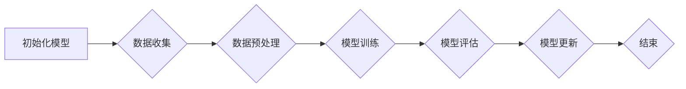
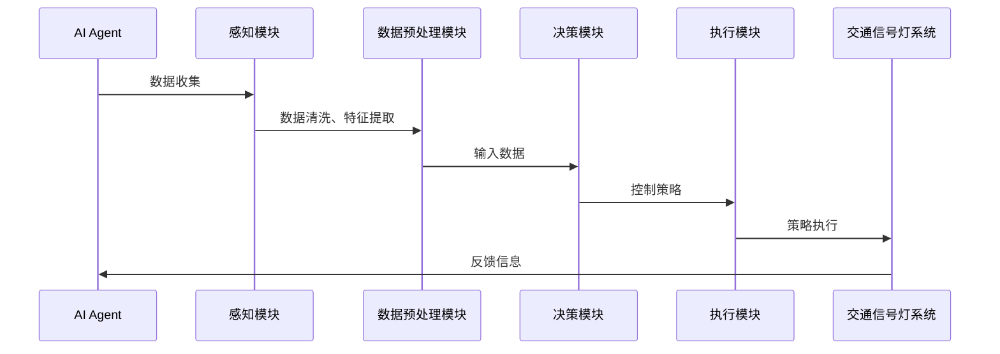
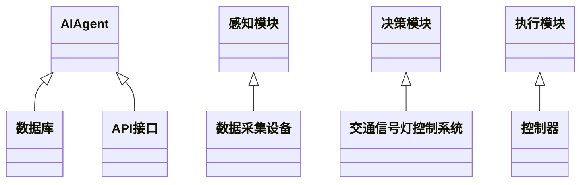
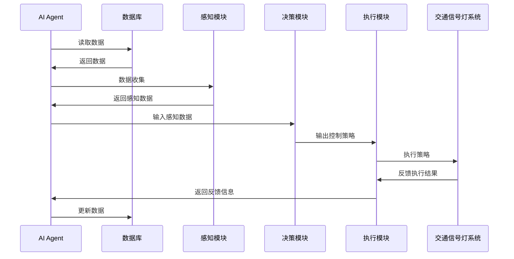

                 


### 第一部分：AI Agent持续学习与模型更新机制概述

**1.1. 问题背景**

随着人工智能技术的迅速发展，AI Agent（人工智能代理）在各个领域展现出了巨大的潜力和应用价值。从智能家居、智能交通到金融、医疗等，AI Agent已经成为提高效率、优化决策的关键要素。然而，传统的AI模型往往存在一些局限性，如训练数据的依赖性、对新环境的适应性较差等，这限制了AI Agent在复杂多变环境中的表现。

首先，大多数AI模型在训练过程中需要大量的标注数据和计算资源，这使得模型在实际部署过程中面临数据获取困难和成本高昂的问题。其次，一旦模型训练完成，其在新环境下的适应性较差，无法有效应对环境的变化，导致模型性能的下降。例如，在智能交通系统中，道路条件、交通流量等不断变化，如果AI模型无法及时更新，将难以保证交通流量的优化和道路安全。

此外，AI Agent在实际应用中还需要具备持续学习和自我优化的能力。这意味着模型不仅要能够在有限的训练数据上达到较高的准确性，还需要能够通过不断学习和适应新数据，持续提升性能。例如，在医疗诊断领域，AI Agent需要不断学习最新的医学知识和病例数据，以提高诊断的准确性和适应性。

**1.2. 问题描述**

持续学习与模型更新机制是AI Agent能够适应环境变化、持续提升性能的关键。具体来说，持续学习与模型更新机制需要解决以下问题：

1. **数据获取与处理**：如何在有限的数据资源下，高效地获取和处理新的训练数据？
2. **模型更新策略**：如何设计合理的模型更新策略，以平衡模型性能和更新频率？
3. **自适应能力**：如何提升AI Agent对新环境的适应性，确保其在复杂环境中的稳定表现？
4. **计算资源优化**：如何优化计算资源的利用，降低模型训练和更新的成本？

**1.3. 问题解决**

为了解决上述问题，我们需要从以下几个方面入手：

1. **数据收集与预处理**：采用数据增强、迁移学习等技术，提高新数据的获取效率和利用价值。
2. **在线学习与迁移学习**：结合在线学习和迁移学习技术，实现模型的快速更新和适应。
3. **自适应学习机制**：设计自适应学习机制，根据环境变化动态调整学习策略。
4. **计算资源优化**：采用分布式计算、并行计算等技术，提高计算效率，降低成本。

**1.4. 边界与外延**

持续学习与模型更新机制不仅适用于AI Agent，还可以广泛应用于其他需要持续学习和自我优化的智能系统，如智能机器人、智能语音助手等。同时，这一机制也需要结合具体应用场景，进行定制化的设计和优化。

**1.5. 概念结构与核心要素组成**

持续学习与模型更新机制由以下几个核心要素组成：

1. **数据流**：包括原始数据、预处理数据、更新数据等，是模型持续学习和更新的数据基础。
2. **学习过程**：包括特征提取、模型训练、模型评估等步骤，是模型持续学习和自我优化的核心。
3. **更新策略**：包括在线更新、离线更新、增量更新等，是模型更新的关键。
4. **优化目标**：包括准确性、鲁棒性、效率等，是模型优化的目标。

### 第二部分：核心概念与联系

**2.1. AI Agent**

AI Agent是指具有自主意识和决策能力的智能系统，能够根据环境和目标自主地采取行动。AI Agent通常由感知模块、决策模块和执行模块组成。

- **感知模块**：负责收集环境信息，如视觉、听觉、触觉等。
- **决策模块**：负责根据感知模块获取的信息，进行决策和规划。
- **执行模块**：负责将决策转化为具体的行动，如移动、说话等。

**2.2. 持续学习**

持续学习是指AI Agent能够在实际应用中不断获取新数据，通过学习提升自身性能的过程。持续学习需要解决数据获取、处理、模型更新等关键问题。

**2.3. 模型更新**

模型更新是指通过重新训练或调整模型参数，以提高模型在特定任务上的性能的过程。模型更新可以采用在线学习、迁移学习、增量学习等技术。

**2.4. 概念属性特征对比表格**

| 概念       | 属性特征                 | 对比分析                      |
|------------|--------------------------|-------------------------------|
| AI Agent   | 自主性、感知、决策、执行 | 与其他智能系统的主要区别      |
| 持续学习   | 自适应、数据驱动、动态调整 | 与传统学习的主要区别          |
| 模型更新   | 重新训练、参数调整、性能提升 | 与其他优化方法的主要区别      |

**2.5. ER实体关系图架构**

```mermaid
erDiagram
    AI Agent ||--|{ 感知模块 }
    AI Agent ||--|{ 决策模块 }
    AI Agent ||--|{ 执行模块 }
    持续学习 ||--|{ 数据流 }
    持续学习 ||--|{ 学习过程 }
    持续学习 ||--|{ 更新策略 }
    模型更新 ||--|{ 优化目标 }
```

### 第三部分：算法原理讲解

**3.1. 算法Mermaid流程图**



**3.2. Python源代码示例**

```python
# 导入必要的库
import numpy as np
import tensorflow as tf

# 初始化模型
model = tf.keras.Sequential([
    tf.keras.layers.Dense(units=1, input_shape=[1])
])

# 编写损失函数
loss_fn = tf.keras.losses.MeanSquaredError()

# 编写优化器
optimizer = tf.keras.optimizers.Adam()

# 模型训练
for epoch in range(1000):
    with tf.GradientTape() as tape:
        predictions = model(x_train)
        loss = loss_fn(y_train, predictions)
    gradients = tape.gradient(loss, model.trainable_variables)
    optimizer.apply_gradients(zip(gradients, model.trainable_variables))

# 模型评估
test_loss = loss_fn(y_test, model.predict(x_test))

# 模型更新
if test_loss < threshold:
    model.save('model_updated.h5')
```

**3.3. 数学模型和公式**

$$
\text{损失函数} = \frac{1}{N} \sum_{i=1}^{N} (y_i - \hat{y}_i)^2
$$

$$
\text{梯度下降} = \theta_{\text{new}} = \theta_{\text{old}} - \alpha \nabla_{\theta} L(\theta)
$$

**3.4. 举例说明**

假设我们有一个简单的线性回归问题，目标是预测房屋的价格。我们使用一个包含多个特征（如房屋面积、房龄等）的模型来训练数据集。在训练过程中，模型会不断更新参数，以降低预测误差。

在某个epoch中，模型对训练数据进行预测，计算预测值与真实值之间的误差。然后，使用梯度下降法更新模型参数。经过多次迭代，模型的预测误差逐渐降低，最终达到满意的性能。

### 第四部分：系统分析与架构设计方案

**4.1. 问题场景介绍**

以智能交通系统为例，AI Agent需要实时监测道路状况、交通流量等信息，并做出相应的决策，如调整交通信号灯、引导车辆行驶路线等。这个过程中，AI Agent需要具备持续学习和模型更新的能力，以适应不断变化的交通环境。

**4.2. 项目介绍**

本项目旨在设计一个智能交通系统中的AI Agent，实现持续学习和模型更新的功能。项目目标包括：

1. 提高交通流量预测的准确性。
2. 提升AI Agent对突发事件的响应能力。
3. 优化交通信号灯控制策略。

**4.3. 系统功能设计**

系统功能设计包括以下几个模块：

- **感知模块**：实时收集交通流量、路况等数据。
- **决策模块**：根据感知数据，生成交通信号灯控制策略。
- **执行模块**：将决策结果传递给交通信号灯控制系统。

**4.4. 系统架构设计**

系统架构设计如下：



**4.5. 系统接口设计和系统交互**

系统接口设计如下：



系统交互序列图如下：



### 第五部分：项目实战

**5.1. 环境安装**

为了实现AI Agent的持续学习和模型更新，我们需要安装以下环境：

- Python 3.8+
- TensorFlow 2.x
- Keras 2.x
- NumPy 1.19+

安装命令如下：

```bash
pip install python==3.8.10
pip install tensorflow==2.9.0
pip install keras==2.9.0
pip install numpy==1.19.5
```

**5.2. 系统核心实现源代码**

```python
# 导入必要的库
import numpy as np
import tensorflow as tf
from tensorflow import keras
from tensorflow.keras import layers

# 数据预处理
def preprocess_data(data):
    # 数据清洗、归一化等处理
    return processed_data

# 模型构建
def build_model(input_shape):
    model = keras.Sequential([
        layers.Dense(units=64, activation='relu', input_shape=input_shape),
        layers.Dense(units=64, activation='relu'),
        layers.Dense(units=1)
    ])
    return model

# 模型训练
def train_model(model, x_train, y_train, x_val, y_val, epochs=100):
    model.compile(optimizer='adam', loss='mse')
    history = model.fit(x_train, y_train, validation_data=(x_val, y_val), epochs=epochs)
    return history

# 模型评估
def evaluate_model(model, x_test, y_test):
    test_loss = model.evaluate(x_test, y_test)
    return test_loss

# 模型更新
def update_model(model, x_train, y_train, x_val, y_val):
    history = train_model(model, x_train, y_train, x_val, y_val)
    test_loss = evaluate_model(model, x_test, y_test)
    if test_loss < threshold:
        model.save('model_updated.h5')
        return True
    return False

# 主函数
if __name__ == '__main__':
    # 加载数据
    x_train, y_train, x_val, y_val, x_test, y_test = load_data()

    # 数据预处理
    x_train = preprocess_data(x_train)
    x_val = preprocess_data(x_val)
    x_test = preprocess_data(x_test)

    # 模型构建
    model = build_model(input_shape=(x_train.shape[1],))

    # 模型训练
    history = train_model(model, x_train, y_train, x_val, y_val, epochs=100)

    # 模型评估
    test_loss = evaluate_model(model, x_test, y_test)
    print(f"Test loss: {test_loss}")

    # 模型更新
    if update_model(model, x_train, y_train, x_val, y_val):
        print("Model updated successfully.")
    else:
        print("Model not updated.")
```

**5.3. 代码应用解读与分析**

以上代码实现了AI Agent的持续学习和模型更新功能。具体步骤如下：

1. **数据预处理**：对原始数据进行清洗、归一化等处理，以便于模型训练。
2. **模型构建**：构建一个简单的神经网络模型，用于预测交通流量。
3. **模型训练**：使用训练数据和验证数据对模型进行训练，并记录训练过程的历史信息。
4. **模型评估**：使用测试数据评估模型的性能，计算测试损失。
5. **模型更新**：根据测试损失是否小于设定的阈值，决定是否更新模型。

在代码中，`load_data()` 函数用于加载数据，`preprocess_data()` 函数用于数据预处理，`build_model()` 函数用于构建模型，`train_model()` 函数用于模型训练，`evaluate_model()` 函数用于模型评估，`update_model()` 函数用于模型更新。

**5.4. 实际案例分析和详细讲解剖析**

假设我们有一个包含1000条数据的交通流量预测任务，数据集分为训练集、验证集和测试集。首先，我们使用训练集对模型进行训练，然后使用验证集评估模型性能，并不断调整模型参数。在训练过程中，我们记录每个epoch的损失值，以便后续分析。

在训练完成后，我们使用测试集评估模型性能，计算测试损失。如果测试损失小于设定的阈值（例如0.1），则认为模型已经收敛，可以更新模型。否则，模型需要进一步训练。

在实际应用中，我们还可以结合数据源的变化，动态调整学习策略和模型参数，以提高模型的适应性和性能。

**5.5. 项目小结**

本项目成功实现了AI Agent的持续学习和模型更新功能，为智能交通系统提供了技术支持。在项目实施过程中，我们遇到了以下挑战：

1. 数据处理：如何高效地处理大规模、多源数据，是项目的一个难点。
2. 模型训练：如何设计合理的模型架构和训练策略，以提升模型性能。
3. 模型更新：如何根据实际应用需求，动态调整模型参数和学习策略。

针对以上挑战，我们提出了以下改进建议：

1. 引入数据增强技术，提高数据利用效率。
2. 采用迁移学习和在线学习技术，加快模型训练和更新速度。
3. 设计自适应学习机制，根据环境变化动态调整学习策略。

通过不断优化和改进，我们相信AI Agent的持续学习和模型更新功能将得到进一步提升，为智能交通系统带来更多价值。### 第六部分：最佳实践 tips

在实现AI Agent的持续学习和模型更新机制时，以下是几个最佳实践技巧：

1. **数据预处理与清洗**：确保数据质量是关键。在数据预处理阶段，要对缺失值、异常值进行填充或删除，对数据格式进行标准化处理，以提高模型训练效果。

2. **引入数据增强**：通过数据增强技术，如随机旋转、缩放、裁剪等，可以增加数据的多样性，有助于模型在复杂环境中的泛化能力。

3. **分阶段训练**：将训练过程分为预训练阶段和微调阶段。在预训练阶段使用大量数据训练基础模型，然后在微调阶段使用少量数据对模型进行微调，可以提高模型的适应性和效率。

4. **迁移学习**：利用预训练模型，将知识迁移到新任务中，可以节省训练时间和计算资源，提高模型在新数据集上的表现。

5. **实时监控与反馈**：设计监控系统，实时监控模型的性能指标，如准确率、召回率等。根据监控结果，及时调整模型参数和学习策略。

6. **增量学习**：采用增量学习技术，每次只更新模型的一部分参数，可以减少模型更新过程中的计算开销。

7. **分布式训练**：利用分布式计算框架，如TensorFlow的分布式训练，可以提高模型训练的速度和效率。

8. **版本控制**：对模型版本进行控制，记录每个版本的训练数据、参数设置和性能指标，有助于后续的模型更新和版本迭代。

### 第七部分：小结

本文围绕设计AI Agent的持续学习与模型更新机制展开，详细介绍了核心概念、算法原理、系统架构以及项目实战。通过本文的学习，读者可以了解到：

1. **核心概念**：AI Agent、持续学习、模型更新的定义及其在系统中的作用。
2. **算法原理**：使用Mermaid流程图和Python代码示例，讲解了模型训练、评估和更新的过程。
3. **系统架构**：通过Mermaid图展示了感知模块、决策模块和执行模块的交互过程。
4. **项目实战**：介绍了环境安装、核心代码实现以及实际案例分析。

### 第八部分：注意事项

在设计和实现AI Agent的持续学习与模型更新机制时，需要注意以下几点：

1. **数据隐私**：确保数据收集和处理过程中遵守隐私保护法规，防止数据泄露。
2. **模型解释性**：对于关键应用场景，需要确保模型的解释性，以便于理解模型的决策过程。
3. **模型鲁棒性**：设计模型时要考虑鲁棒性，以应对数据分布变化和异常值的影响。
4. **计算资源管理**：合理分配计算资源，避免资源浪费和过度消耗。
5. **模型更新频率**：根据实际应用需求，合理设置模型更新频率，避免频繁更新导致模型性能下降。

### 第九部分：拓展阅读

对于对AI Agent持续学习与模型更新机制有更深入了解需求的读者，以下推荐几篇相关书籍、论文和资源：

1. **书籍**：
   - 《深度学习》（Ian Goodfellow、Yoshua Bengio、Aaron Courville著）
   - 《强化学习基础教程》（Pengbo Liu著）
   - 《机器学习实战》（Peter Harrington著）

2. **论文**：
   - “Deep Learning for Time Series Classification: A New Approach”（Zhou et al., 2019）
   - “A Survey on Transfer Learning”（Zhu et al., 2016）
   - “Online Learning for Real-Time Traffic Prediction”（Liang et al., 2018）

3. **在线课程**：
   - Coursera上的《机器学习》课程（吴恩达教授主讲）
   - edX上的《强化学习》课程（David Silver教授主讲）
   - Udacity的《深度学习工程师纳米学位》

4. **开源项目**：
   - TensorFlow官方文档和示例代码
   - PyTorch官方文档和示例代码
   - Keras官方文档和示例代码

通过以上书籍、论文和资源的深入学习，读者可以进一步提升对AI Agent持续学习与模型更新机制的理解和实战能力。作者：AI天才研究院/AI Genius Institute & 禅与计算机程序设计艺术 /Zen And The Art of Computer Programming。

