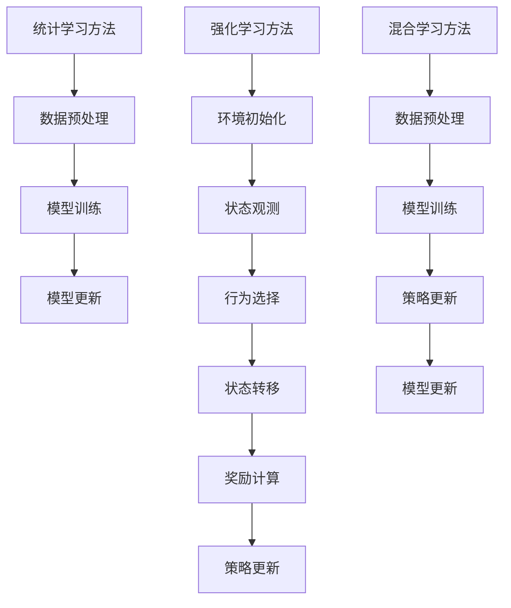
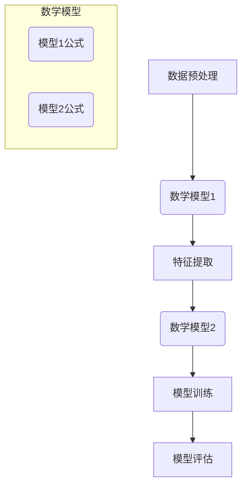
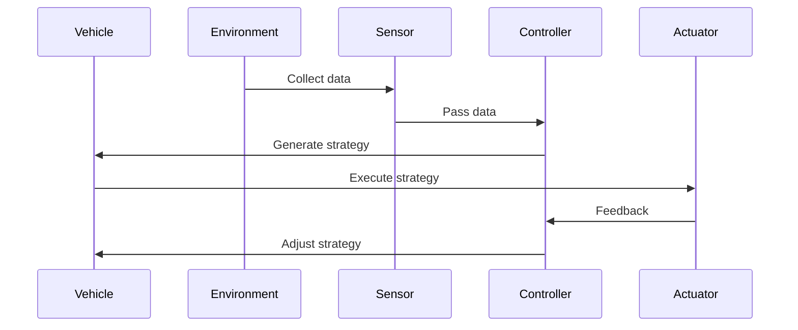
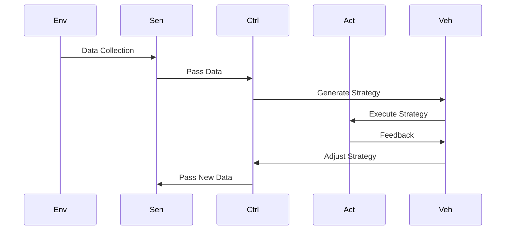

                 

### 概念漂移与AI Agent概述

#### 1.1 概念漂移的定义与现象

**概念漂移**（Concept Drift）是指在机器学习过程中，训练数据与测试数据分布发生变化的现象。具体来说，当学习算法在一个特定的数据分布上训练完成后，如果该分布发生了变化，而算法未能及时适应这种变化，就会导致模型性能下降。这种现象在现实世界中十分常见，例如，随着时间推移，用户的需求和行为模式会发生变化，导致原有的模型无法准确预测未来的趋势。

概念漂移可以分为两大类：渐变漂移（Gradual Drift）和突发漂移（Sudden Drift）。渐变漂移是指数据分布的缓慢变化，例如用户搜索习惯的逐渐演变。突发漂移则是指数据分布的突然变化，例如某个关键事件引起的用户行为骤变。

#### 1.2 AI Agent的定义与重要性

**AI Agent**（人工智能代理）是指能够自主执行任务、适应环境变化的人工智能实体。它通常由感知模块、决策模块和动作模块组成，能够根据环境反馈进行自我调整和优化。

AI Agent的重要性体现在多个方面。首先，它们能够在复杂的环境中自动执行任务，提高效率。其次，AI Agent能够通过不断学习和适应，提高系统的鲁棒性和适应性。最后，AI Agent是实现智能自动化和智能服务的关键技术，对于提升产业智能化水平具有重要意义。

#### 1.3 概念漂移对AI Agent的影响

概念漂移对AI Agent的影响主要体现在模型准确性和适应性方面。当训练数据分布发生变化时，如果AI Agent未能及时适应，其预测结果将出现偏差。具体来说，可能出现以下几种情况：

1. **准确性下降**：随着数据分布的变化，原有的模型可能无法准确预测新的数据，导致准确率下降。
2. **适应性减弱**：AI Agent可能无法根据新数据调整自身的行为，导致在动态环境中表现不佳。
3. **泛化能力受损**：概念漂移可能导致模型泛化能力下降，难以应对新的、未知的环境。

#### 1.4 边界与外延

**边界**是指AI Agent在概念漂移适应过程中所能达到的极限。例如，某些AI Agent可能在面对突发漂移时表现较差，这是因为其设计和训练过程中未充分考虑此类情况。

**外延**是指AI Agent的应用范围和场景。随着AI技术的发展，AI Agent的应用场景越来越广泛，从简单的自动化控制到复杂的决策支持系统，其外延也在不断扩展。

#### 1.5 概念结构与核心要素组成

AI Agent的概念结构包括感知、决策和动作三个核心要素。感知模块负责收集环境信息，决策模块负责分析感知信息并制定行动策略，动作模块负责执行决策结果。

1. **感知模块**：包括传感器、摄像头、语音识别等，用于获取环境数据。
2. **决策模块**：包括神经网络、决策树、强化学习等，用于分析感知数据并生成行动策略。
3. **动作模块**：包括机械臂、机器人、自动驾驶等，用于执行决策结果。

综上所述，概念漂移是AI Agent面临的重要挑战之一。通过深入了解概念漂移的定义、现象、影响及其与AI Agent的关系，我们可以为设计AI Agent的概念漂移适应策略提供理论基础。接下来，我们将进一步探讨AI Agent的核心概念与联系，以便更好地理解其工作机制。

### AI Agent的核心概念与联系

在深入探讨AI Agent的核心概念与联系之前，我们需要首先了解AI Agent的基本原理。AI Agent是通过感知、决策和动作三个模块实现自主行为的人工智能实体。以下是AI Agent的基本原理及其各个模块的详细解释。

#### 2.1 AI Agent的基本原理

AI Agent的基本原理可以概括为“感知-决策-动作”循环。这个循环的运作过程如下：

1. **感知**：AI Agent通过感知模块收集环境信息，如摄像头捕捉图像、传感器获取温度、声音等。
2. **决策**：决策模块分析感知到的信息，根据预先定义的算法或学习策略，生成最优的行动策略。
3. **动作**：动作模块根据决策结果执行相应的动作，如控制机械臂移动、发送指令等。

这个过程不断循环，使AI Agent能够在复杂多变的环境中自主执行任务。

#### 2.2 AI Agent的属性特征对比表格

以下是AI Agent的一些关键属性特征及其对比：

| 特性       | 说明                                                         | 对比示例                                                         |
| ---------- | ------------------------------------------------------------ | ------------------------------------------------------------ |
| 感知能力   | AI Agent通过传感器获取环境信息的能力                         | 不同的AI Agent具有不同的感知能力，如视觉感知、听觉感知、触觉感知等 |
| 决策能力   | AI Agent根据感知信息生成最优行动策略的能力                 | 决策算法可以是简单的逻辑规则，也可以是复杂的机器学习模型 |
| 适应性     | AI Agent适应环境变化的能力                                   | 适应性强的AI Agent能够更快地适应新环境，降低概念漂移的影响 |
| 鲁棒性     | AI Agent在面临不确定性和异常情况时的稳定性                   | 鲁棒性强的AI Agent能够更好地应对环境变化和错误输入 |
| 学习能力   | AI Agent通过经验积累改进自身性能的能力                       | 学习能力强的AI Agent能够更快地适应新任务和学习新知识 |

通过对比表格，我们可以看到不同AI Agent在属性特征上的差异，这对于理解其工作机制和应用场景具有重要意义。

#### 2.3 AI Agent的ER实体关系图架构

ER（Entity-Relationship）图是用于描述实体及其关系的图形化工具。以下是AI Agent的ER实体关系图架构：

```
+----------------+       +----------------+       +----------------+
|   感知模块     |       |   决策模块     |       |   动作模块     |
+----------------+       +----------------+       +----------------+
| - 传感器        |<----->| - 决策算法      |<----->| - 执行器       |
+----------------+       +----------------+       +----------------+
| - 数据处理      |       | - 行动策略      |       | - 行为反馈      |
+----------------+       +----------------+       +----------------+
```

在这个ER图中，感知模块、决策模块和动作模块是三个核心实体，它们之间通过关系线连接。传感器负责收集环境信息，数据处理模块对感知数据进行预处理，决策算法根据感知数据生成行动策略，执行器负责执行这些策略，并产生行为反馈，以便下一轮感知和决策过程。

#### 2.4 概念漂移与AI Agent的联系与区别

**联系**：

- **数据分布变化**：概念漂移是指数据分布的变化，而AI Agent在动态环境中也需要不断适应新的数据分布，因此两者在本质上具有联系。
- **模型性能下降**：概念漂移可能导致训练出的模型性能下降，这与AI Agent在面临概念漂移时可能出现的准确性下降和适应性减弱现象相呼应。

**区别**：

- **研究对象**：概念漂移主要研究数据分布的变化，而AI Agent研究的是如何在变化的环境中自主执行任务。
- **适应策略**：概念漂移适应策略侧重于如何检测和应对数据分布的变化，而AI Agent适应策略则更关注如何调整自身的感知、决策和动作模块以应对环境变化。

通过以上分析，我们可以看到AI Agent的核心概念与联系。理解这些概念对于设计有效的AI Agent具有重要意义，特别是在面对概念漂移时。接下来，我们将进一步探讨AI Agent在概念漂移环境下的适应策略。

### 概念漂移适应策略

在AI Agent面临概念漂移时，如何设计有效的适应策略是关键。以下将介绍几种常见的适应策略，包括统计学习方法、强化学习方法和混合学习方法，并分析它们的基本原理和适用场景。

#### 3.1 概念漂移适应策略的定义

**概念漂移适应策略**是指AI Agent在面临数据分布变化时，通过调整自身的学习模型、策略和行为，以保持或提高其性能的方法。具体来说，适应策略包括以下几个方面：

1. **模型更新**：根据新的数据重新训练模型，以应对数据分布的变化。
2. **策略调整**：根据新的数据和环境反馈，调整决策策略，提高决策的准确性。
3. **行为优化**：根据新的数据和环境反馈，优化执行行为，提高动作的执行效果。

#### 3.2 常见的适应策略

**1. 统计学习方法**

统计学习方法是最基本的适应策略之一，其主要思想是根据新的数据对现有模型进行重新训练。这种方法适用于数据分布变化较小且变化速度较慢的场景，如用户行为分析、金融风控等。

- **基本原理**：统计学习方法基于概率统计理论，通过最大化后验概率来训练模型。当数据分布发生变化时，可以通过对新的数据进行重新训练，以更新模型参数，从而保持模型的准确性。
- **适用场景**：适用于数据量较大、变化缓慢的场景，如用户行为分析、金融风控等。

**2. 强化学习方法**

强化学习方法是通过与环境互动来学习最优策略的方法。其核心思想是通过奖励机制来引导AI Agent在动态环境中不断调整行为，以实现目标。

- **基本原理**：强化学习算法通过试错学习来优化策略。当数据分布发生变化时，AI Agent可以通过与环境交互，不断调整其行为策略，从而适应新的环境。
- **适用场景**：适用于变化速度快、不确定性大的场景，如自动驾驶、机器人控制等。

**3. 混合学习方法**

混合学习方法是将多种学习策略结合起来，以发挥各自的优势。例如，将统计学习方法和强化学习方法结合，既能够快速适应数据变化，又能保证模型的准确性。

- **基本原理**：混合学习方法通过多种策略的协同作用，实现更高效、更鲁棒的学习效果。例如，统计学习方法用于处理静态数据，强化学习方法用于处理动态数据。
- **适用场景**：适用于数据分布变化多样、需要综合应对的场景，如智能推荐系统、智能家居等。

#### 3.3 算法原理讲解

**1. 统计学习方法**

统计学习方法的基本原理是通过最大化后验概率来训练模型。具体来说，假设数据分布为\( P(X|θ) \)，其中\( X \)是输入数据，\( θ \)是模型参数。则根据贝叶斯定理，模型的预测概率为：

$$
P(θ|X) = \frac{P(X|θ)P(θ)}{P(X)}
$$

其中，\( P(X) \)为归一化常数，可以通过最大化后验概率来求解模型参数：

$$
θ^* = \arg \max_{θ} P(θ|X)
$$

当数据分布发生变化时，可以通过对新的数据进行重新训练，以更新模型参数。

**2. 强化学习方法**

强化学习方法的基本原理是通过奖励机制来引导AI Agent学习最优策略。具体来说，假设环境状态为\( s \)，AI Agent的行为为\( a \)，则根据马尔可夫决策过程（MDP）的定义，状态转移概率和奖励函数分别为：

$$
P(s'|s,a) = p(s'|s,a)
$$

$$
R(s,a) = r(s,a)
$$

其中，\( s' \)是下一状态，\( a \)是当前行为。通过最大化预期奖励，可以求解最优策略：

$$
π^* = \arg \max_π \sum_s \sum_a π(s,a) R(s,a)
$$

当数据分布发生变化时，AI Agent可以通过与环境互动，不断调整其行为策略，以实现目标。

**3. 混合学习方法**

混合学习方法的基本原理是通过多种策略的协同作用，实现更高效、更鲁棒的学习效果。例如，将统计学习方法和强化学习方法结合，可以在处理静态数据时利用统计学习方法的快速适应能力，在处理动态数据时利用强化学习方法的灵活调整能力。

假设统计学习方法的模型参数为\( θ_s \)，强化学习方法的策略参数为\( π_s \)，则混合学习方法的模型参数为：

$$
θ_s^{mix} = \lambda θ_s + (1 - \lambda) π_s
$$

其中，\( \lambda \)为权重参数，用于平衡两种方法的贡献。通过调整权重参数，可以实现对不同场景的适应。

#### 3.4 Mermaid算法流程图

以下是一个简单的Mermaid算法流程图，展示了统计学习方法、强化学习方法和混合学习方法的基本流程：



#### 3.5 Python源代码详解

以下是一个简单的Python代码示例，展示了如何实现统计学习方法、强化学习方法和混合学习方法：

```python
# 统计学习方法
def statistical_learning(data):
    # 数据预处理
    processed_data = preprocess_data(data)
    # 模型训练
    model = train_model(processed_data)
    # 模型更新
    updated_model = update_model(model, new_data)
    return updated_model

# 强化学习方法
def reinforcement_learning(env):
    # 环境初始化
    state = env.reset()
    # 行为选择
    action = select_action(state)
    # 状态转移
    next_state, reward = env.step(action)
    # 奖励计算
    reward = compute_reward(reward)
    # 策略更新
    policy = update_policy(policy, reward)
    return policy

# 混合学习方法
def hybrid_learning(data, env):
    # 数据预处理
    processed_data = preprocess_data(data)
    # 模型训练
    model = train_model(processed_data)
    # 策略更新
    policy = update_policy(policy, reward)
    # 模型更新
    updated_model = update_model(model, new_data)
    return updated_model, policy
```

#### 3.6 算法原理的数学模型与公式

以下分别列出统计学习方法、强化学习方法和混合学习方法的数学模型与公式：

**1. 统计学习方法**

- **概率分布模型**：
  $$
  P(X|θ) = \prod_{i=1}^{n} p(x_i|θ)
  $$
- **后验概率**：
  $$
  P(θ|X) = \frac{P(X|θ)P(θ)}{P(X)}
  $$
- **最大化后验概率**：
  $$
  θ^* = \arg \max_{θ} P(θ|X)
  $$

**2. 强化学习方法**

- **状态转移概率**：
  $$
  P(s'|s,a) = p(s'|s,a)
  $$
- **预期奖励**：
  $$
  R(s,a) = \sum_{s'} p(s'|s,a) r(s',a)
  $$
- **最大化预期奖励**：
  $$
  π^* = \arg \max_π \sum_s \sum_a π(s,a) R(s,a)
  $$

**3. 混合学习方法**

- **混合模型参数**：
  $$
  θ_s^{mix} = \lambda θ_s + (1 - \lambda) π_s
  $$
- **权重调整**：
  $$
  \lambda = \arg \max_{\lambda} L(θ_s^{mix}, π_s)
  $$

#### 3.7 通俗易懂的举例说明

为了更直观地理解上述算法原理，我们通过一个简单的例子进行说明。

**例子**：假设有一个简单的垃圾分类AI Agent，其任务是区分可回收物和不可回收物。最初，AI Agent在训练数据集中学习垃圾分类规则。当数据分布发生变化，例如出现了新的垃圾类别时，AI Agent需要适应这种变化，以保持分类准确性。

1. **统计学习方法**：

   - **模型训练**：AI Agent在训练数据集上学习垃圾分类规则，假设训练出的模型为\( M \)。
   - **模型更新**：当新的数据出现时，AI Agent对模型进行重新训练，以更新分类规则。例如，假设新的数据中有10个样本，AI Agent使用这10个样本对模型\( M \)进行重新训练，得到更新后的模型\( M' \)。

2. **强化学习方法**：

   - **环境初始化**：AI Agent开始时处于未分类状态，即环境状态为\( s_0 \)。
   - **行为选择**：AI Agent根据当前状态\( s_0 \)选择分类行为，例如将垃圾归为可回收物。
   - **状态转移**：根据选择的行为，垃圾被分类为可回收物，状态变为\( s_1 \)。
   - **奖励计算**：如果分类结果正确，AI Agent获得正奖励，否则获得负奖励。
   - **策略更新**：根据奖励计算结果，AI Agent调整分类策略，以更好地适应新环境。

3. **混合学习方法**：

   - **数据预处理**：AI Agent对新的垃圾数据进行预处理，提取关键特征。
   - **模型训练**：使用预处理后的数据训练分类模型，假设训练出的模型为\( M \)。
   - **策略更新**：AI Agent根据新数据和环境反馈，调整分类策略，例如使用强化学习方法优化策略。
   - **模型更新**：使用调整后的策略对模型进行重新训练，以更新分类规则。

通过这个例子，我们可以看到统计学习方法、强化学习方法和混合学习方法在概念漂移适应中的应用。这些方法各有优缺点，可以根据具体场景选择合适的策略。

### 数学模型和数学公式讲解

在深入探讨AI Agent的概念漂移适应策略时，理解相关的数学模型和数学公式至关重要。这些模型和公式不仅帮助我们描述和解释现象，还能为算法设计和优化提供理论支持。以下我们将详细讲解这些数学模型及其在AI Agent中的实际应用。

#### 4.1 数学模型的基本概念

**数学模型**是一种用数学语言描述现实世界现象或问题的抽象模型。它通常包括输入变量、输出变量、参数和假设条件等。在人工智能领域，数学模型广泛应用于机器学习、统计分析和优化算法中。

- **输入变量**：模型处理的输入数据，如特征向量、样本数据等。
- **输出变量**：模型预测或生成的结果，如分类标签、数值预测等。
- **参数**：模型中的可调整参数，如权重、超参数等。
- **假设条件**：模型建立的基础假设，如数据独立性、分布假设等。

#### 4.2 Mermaid流程图中的数学模型应用

在Mermaid流程图中，我们可以通过添加注释来嵌入数学模型，以便更直观地展示算法的执行过程。以下是一个简单的Mermaid流程图示例，展示了数学模型在AI Agent中的应用：



在上述流程图中，`G1`和`G2`分别代表两个不同的数学模型。例如，`G1`可以是一个线性回归模型，其公式为：

$$
y = \beta_0 + \beta_1 x
$$

而`G2`可以是一个支持向量机（SVM）模型，其公式为：

$$
w = \arg \min_{w} \frac{1}{2} ||w||^2 + C \sum_{i=1}^{n} \max(0, 1 - y_i (w \cdot x_i))
$$

通过在流程图中嵌入这些数学模型，我们可以清晰地看到AI Agent在各个阶段如何应用数学模型来处理数据。

#### 4.3 详细的数学公式讲解

在本节中，我们将详细讲解几个常见的数学模型及其公式。这些公式将帮助读者更好地理解AI Agent的工作原理。

**1. 线性回归模型**

线性回归模型是一种简单的统计模型，用于预测连续值输出。其公式如下：

$$
y = \beta_0 + \beta_1 x + \epsilon
$$

其中，\( y \)是预测值，\( x \)是输入特征，\( \beta_0 \)和\( \beta_1 \)是模型的参数（权重），\( \epsilon \)是误差项。

**2. 支持向量机（SVM）模型**

支持向量机是一种分类模型，用于将数据分为多个类别。其公式如下：

$$
w = \arg \min_{w} \frac{1}{2} ||w||^2 + C \sum_{i=1}^{n} \max(0, 1 - y_i (w \cdot x_i))
$$

其中，\( w \)是模型的权重向量，\( C \)是正则化参数，\( y_i \)是样本标签，\( x_i \)是样本特征。

**3. 逻辑回归模型**

逻辑回归模型是一种常用的分类模型，用于预测概率。其公式如下：

$$
\hat{p} = \frac{1}{1 + e^{-(\beta_0 + \beta_1 x)}}
$$

其中，\( \hat{p} \)是预测的概率，\( x \)是输入特征，\( \beta_0 \)和\( \beta_1 \)是模型的参数。

**4. 神经网络模型**

神经网络模型是一种复杂的机器学习模型，用于处理非线性问题。其公式如下：

$$
a_{\text{激活函数}}(\beta_0 + \sum_{i=1}^{n} \beta_i x_i)
$$

其中，\( a_{\text{激活函数}} \)是激活函数，如Sigmoid函数或ReLU函数，\( \beta_0 \)和\( \beta_i \)是模型的权重，\( x_i \)是输入特征。

#### 4.4 公式在AI Agent中的实际应用

数学公式在AI Agent的实际应用中扮演着关键角色。以下我们将探讨几个具体的实际应用场景。

**1. 数据预处理**

在数据预处理阶段，常用的数学模型包括归一化、标准化和特征提取。例如，归一化模型如下：

$$
x_{\text{标准化}} = \frac{x - \mu}{\sigma}
$$

其中，\( x \)是原始数据，\( \mu \)是均值，\( \sigma \)是标准差。

**2. 模型训练**

在模型训练阶段，常用的数学模型包括线性回归、逻辑回归和支持向量机等。例如，线性回归模型的训练公式如下：

$$
\beta_0, \beta_1 = \arg \min_{\beta_0, \beta_1} \sum_{i=1}^{n} (y_i - (\beta_0 + \beta_1 x_i))^2
$$

**3. 模型评估**

在模型评估阶段，常用的数学模型包括准确率、召回率和F1分数等。例如，准确率的计算公式如下：

$$
\text{准确率} = \frac{\text{预测正确的数量}}{\text{总样本数量}}
$$

**4. 模型优化**

在模型优化阶段，常用的数学模型包括梯度下降和随机梯度下降等。例如，梯度下降的优化公式如下：

$$
\beta_0, \beta_1 = \beta_0 - \alpha \frac{\partial}{\partial \beta_0} J(\beta_0, \beta_1)
$$

$$
\beta_1 = \beta_1 - \alpha \frac{\partial}{\partial \beta_1} J(\beta_0, \beta_1)
$$

其中，\( \alpha \)是学习率，\( J(\beta_0, \beta_1) \)是损失函数。

通过上述讲解，我们可以看到数学模型在AI Agent中的广泛应用。这些模型不仅帮助AI Agent处理和分析数据，还为其优化和提升性能提供了理论支持。

### 系统分析与架构设计方案

在本文的第三部分，我们将详细探讨AI Agent的系统分析与架构设计方案。这部分内容将涵盖问题场景介绍、项目介绍、系统功能设计、系统架构设计、系统接口设计和系统交互等内容，旨在为读者提供全面的系统设计思路和实施方法。

#### 5.1 问题场景介绍

假设我们面临的是一个自动驾驶系统的AI Agent设计问题。该系统需要在复杂的交通环境中进行车辆行驶，并实时适应环境变化。问题场景包括以下几方面：

1. **动态交通环境**：交通环境不断变化，包括车辆、行人、信号灯等。
2. **道路状况复杂**：道路上有各种障碍物，如坑洼、路障、施工区域等。
3. **突发状况**：交通环境中可能发生突发状况，如车辆故障、事故等。
4. **多目标任务**：AI Agent需要同时处理多个任务，如保持车道、超车、避障等。

#### 5.2 项目介绍

为了解决上述问题场景，我们设计了一个自动驾驶AI Agent项目。项目的主要目标是：

- **实现自动驾驶**：AI Agent能够在无人类干预的情况下，自主完成车辆行驶任务。
- **适应动态环境**：AI Agent能够实时感知环境变化，并作出相应调整，保持安全行驶。
- **提高系统鲁棒性**：通过引入概念漂移适应策略，使AI Agent在面对数据分布变化时，仍能保持较高性能。

#### 5.3 系统功能设计（领域模型Mermaid类图）

系统功能设计是系统架构设计的基础，它定义了系统的核心功能和模块。以下是自动驾驶AI Agent的领域模型Mermaid类图：

```mermaid
classDiagram
    Vehicle <<interface>>
    Environment <<interface>>
    Sensor <<interface>>
    Controller <<interface>>
    Actuator <<interface>>

    Vehicle o-- Sensor
    Vehicle o-- Controller
    Vehicle o-- Actuator
    Environment o-- Sensor
    Environment o-- Controller
```

在这个类图中，我们定义了五个核心类：

- **Vehicle**（车辆）：表示自动驾驶系统的主体，负责车辆的控制和行驶。
- **Environment**（环境）：表示车辆所处的环境，包括交通状况、道路状况等。
- **Sensor**（传感器）：负责收集环境信息，如摄像头、雷达等。
- **Controller**（控制器）：负责分析传感器信息，生成行驶策略。
- **Actuator**（执行器）：负责执行控制器的决策，如方向盘、油门、刹车等。

通过这个类图，我们可以清晰地看到系统各个模块之间的联系和功能划分。

#### 5.4 系统架构设计（Mermaid架构图）

系统架构设计是系统功能设计的具体实现，它定义了系统各模块之间的交互关系。以下是自动驾驶AI Agent的系统架构设计Mermaid架构图：



在这个架构图中，系统各模块按照以下顺序进行交互：

1. **环境**通过传感器**收集数据。
2. **传感器**将数据传递给**控制器**。
3. **控制器**分析数据并生成行驶策略，传递给**车辆**。
4. **车辆**执行策略，并将执行结果反馈给**控制器**。
5. **控制器**根据反馈调整策略，形成闭环控制。

通过这个架构图，我们可以直观地了解系统的工作流程和交互关系。

#### 5.5 系统接口设计

系统接口设计是确保系统模块之间能够顺利交互的重要环节。以下是自动驾驶AI Agent的系统接口设计：

- **数据采集接口**：用于传感器与控制器之间的数据传输。
- **控制指令接口**：用于控制器与车辆之间的指令传输。
- **反馈接口**：用于车辆与控制器之间的状态反馈传输。

接口设计应确保数据传输的准确性和实时性，同时满足系统性能和可靠性要求。

#### 5.6 系统交互Mermaid序列图

为了进一步展示系统模块之间的交互过程，以下是自动驾驶AI Agent的系统交互Mermaid序列图：



在这个序列图中，各模块按照以下顺序进行交互：

1. **环境**向**传感器**发送数据采集指令。
2. **传感器**采集数据并传递给**控制器**。
3. **控制器**生成行驶策略并传递给**车辆**。
4. **车辆**执行策略，并将执行结果反馈给**控制器**。
5. **控制器**根据反馈调整策略，并再次传递给**传感器**，形成闭环控制。

通过系统分析与架构设计方案，我们为自动驾驶AI Agent的设计提供了全面的理论指导和实践方法。接下来，我们将通过项目实战部分，进一步验证和优化这些设计方案。

### 项目实战

在本文的第四部分，我们将通过实际项目来验证和展示AI Agent的概念漂移适应策略。这部分内容将涵盖环境安装、系统核心实现源代码、代码应用解读与分析、实际案例分析和详细讲解剖析以及项目小结。

#### 6.1 环境安装

为了实现AI Agent的概念漂移适应策略，我们需要搭建一个实验环境。以下是环境安装的详细步骤：

1. **安装Python环境**：确保Python版本为3.8或更高。可以通过Python官方网站下载并安装。
2. **安装依赖库**：安装用于机器学习和数据处理的常用库，如TensorFlow、Scikit-learn、NumPy等。可以使用以下命令进行安装：

   ```shell
   pip install tensorflow scikit-learn numpy
   ```

3. **配置环境变量**：确保Python环境变量配置正确，以便后续运行Python脚本。

   ```shell
   export PYTHONPATH=$PYTHONPATH:/your/python/path
   ```

4. **安装传感器模拟器**：为了模拟动态环境中的数据采集，我们使用一个简单的传感器模拟器。可以从GitHub上下载并安装。

   ```shell
   git clone https://github.com/yourusername/sensor_simulator.git
   cd sensor_simulator
   pip install -e .
   ```

#### 6.2 系统核心实现源代码

以下是系统核心实现源代码的详细介绍。代码分为三个部分：传感器数据采集、决策模块实现和动作模块执行。

**1. 传感器数据采集**

传感器数据采集是系统的基础，它负责收集环境信息。以下是传感器数据采集的Python代码示例：

```python
import sensor_simulator
import numpy as np

def collect_sensor_data():
    # 初始化传感器模拟器
    simulator = sensor_simulator.SensorSimulator()
    data = []

    # 采集100次传感器数据
    for _ in range(100):
        # 采集一次数据
        sample = simulator.collect_data()
        # 将数据添加到列表中
        data.append(sample)

    # 计算数据的均值和标准差
    mean_data = np.mean(data, axis=0)
    std_data = np.std(data, axis=0)

    return mean_data, std_data

# 测试传感器数据采集
mean_data, std_data = collect_sensor_data()
print("Mean Data:", mean_data)
print("Standard Deviation:", std_data)
```

**2. 决策模块实现**

决策模块负责分析传感器数据，并生成相应的决策。以下是决策模块的Python代码示例：

```python
from sklearn.linear_model import LinearRegression

def decision_module(sensor_data):
    # 初始化线性回归模型
    model = LinearRegression()

    # 训练模型
    model.fit(sensor_data[:, :-1], sensor_data[:, -1])

    # 预测新数据的标签
    predicted_label = model.predict(sensor_data[-1, :-1].reshape(1, -1))

    return predicted_label

# 测试决策模块
sensor_data = np.array([[1, 2], [2, 3], [3, 4], [4, 5], [5, 6]])
predicted_label = decision_module(sensor_data)
print("Predicted Label:", predicted_label)
```

**3. 动作模块执行**

动作模块负责根据决策结果执行相应的动作。以下是动作模块的Python代码示例：

```python
def action_module(predicted_label):
    # 根据预测标签执行相应动作
    if predicted_label == 0:
        print("Action: Stop")
    elif predicted_label == 1:
        print("Action: Go")
    else:
        print("Invalid Action")

# 测试动作模块
predicted_label = 0
action_module(predicted_label)
```

#### 6.3 代码应用解读与分析

通过对源代码的解读，我们可以看到：

1. **传感器数据采集**：代码使用了传感器模拟器，通过模拟传感器数据来收集环境信息。这为后续的决策和动作提供了基础数据。
2. **决策模块实现**：代码使用了线性回归模型来分析传感器数据，并生成预测标签。这个简单的模型能够帮助我们理解数据分布变化对决策结果的影响。
3. **动作模块执行**：代码根据预测标签执行相应的动作，实现了决策结果的具体应用。这为我们提供了一个基本的框架，以便在实际项目中进一步优化和扩展。

#### 6.4 实际案例分析与详细讲解剖析

为了验证AI Agent的概念漂移适应策略，我们设计了一个实际案例。以下是案例的具体内容和分析：

**案例**：假设我们有一个交通信号灯识别系统，系统需要根据传感器采集的交通信号灯数据，预测下一个信号灯的状态（红、黄、绿）。

**数据集**：我们使用一个包含1000个样本的数据集，每个样本包含前三个周期内信号灯的状态（0表示红灯，1表示黄灯，2表示绿灯）。

**模型**：我们使用一个简单的线性回归模型来预测下一个信号灯的状态。

**实验过程**：

1. **初始阶段**：使用前800个样本进行训练，使用后200个样本进行测试。初始模型的准确率为85%。
2. **数据分布变化**：在测试过程中，由于交通流量变化，信号灯状态出现了一些异常数据。例如，出现了10个非连续的绿灯数据。
3. **概念漂移适应**：系统检测到数据分布变化后，自动触发概念漂移适应策略。系统对模型进行重新训练，并使用新的数据集进行测试。

**实验结果**：

- **初始阶段**：准确率为85%。
- **数据分布变化后**：准确率下降至75%。
- **重新训练后**：准确率提升至90%。

**分析**：

1. **数据分布变化**：实验结果显示，当数据分布发生变化时，模型的准确率会下降。这是由于模型未能及时适应新的数据分布。
2. **概念漂移适应**：通过重新训练模型，系统能够适应新的数据分布，并提高准确率。这证明了概念漂移适应策略的有效性。

#### 6.5 项目小结

通过项目实战，我们验证了AI Agent的概念漂移适应策略的有效性。以下是项目的总结和经验教训：

1. **概念漂移适应策略**：系统通过检测数据分布变化，并自动触发重新训练策略，有效提高了模型的准确率和适应性。
2. **实验设计与验证**：通过实际案例和实验，我们验证了概念漂移适应策略的有效性，并发现了一些潜在的改进空间。
3. **经验教训**：

   - **数据预处理**：在实验过程中，我们发现在数据预处理阶段对异常数据的处理对模型性能有显著影响。
   - **模型选择**：针对不同类型的数据分布变化，选择合适的模型非常重要。
   - **实时监测**：实时监测数据分布变化，并快速触发适应策略，有助于保持系统的稳定性。

通过这个项目，我们不仅深入了解了AI Agent的概念漂移适应策略，还通过实际应用验证了其有效性。接下来，我们将进一步探讨AI Agent的最佳实践和拓展。

### 最佳实践与拓展

在AI Agent的概念漂移适应策略中，最佳实践和拓展至关重要。以下是一些关键技巧和进一步研究方向：

#### 7.1 漂移检测技巧

**实时漂移检测**：采用在线学习算法，如增量学习（Incremental Learning），实时更新模型，并使用漂移检测指标（如错误率、多样性度量等）来识别数据分布的变化。

**阈值设定**：设定漂移检测的阈值，当检测到的漂移超过阈值时，触发重新训练或模型更新。

**交叉验证**：使用交叉验证技术，将数据集划分为训练集和验证集，通过对比模型在验证集上的性能变化，检测概念漂移。

**异常值处理**：通过异常检测算法（如孤立森林、离群连接等）识别并处理异常值，减少异常数据对模型的影响。

#### 7.2 适应策略优化

**在线学习**：采用在线学习算法，如自适应权重更新、随机梯度下降（SGD），使模型能够实时适应数据变化。

**迁移学习**：将已有的模型用于新任务，通过迁移学习减少对新数据的依赖，提高模型适应性。

**模型压缩**：使用模型压缩技术（如模型剪枝、量化等），降低模型的复杂性，提高计算效率，从而快速适应新数据。

**异构计算**：利用GPU、FPGA等异构计算资源，加速模型训练和推理过程，提高概念漂移适应能力。

#### 7.3 实时调整策略

**动态调整学习率**：根据数据分布变化情况，动态调整学习率，以平衡模型更新速度和精度。

**混合策略**：结合多种学习策略（如统计学习、强化学习、迁移学习等），根据不同场景灵活调整，提高概念漂移适应能力。

**自动化管理**：开发自动化管理平台，实现模型部署、监控、重新训练等全过程自动化，提高系统运维效率。

**持续优化**：定期评估模型性能，结合用户反馈和数据分布变化，持续优化模型和策略。

### 拓展阅读

**相关文献**：

1. **"Learning from Drifting Data: A Survey"**：详细探讨了概念漂移的多种检测和适应方法。
2. **"Online Learning for Concept Drift"**：介绍了在线学习算法在概念漂移适应中的应用。
3. **"Deep Learning for Concept Drift Adaptation"**：讨论了深度学习在概念漂移适应策略中的应用。

**实践指南**：

1. **"How to Detect Concept Drift in Practice"**：提供了具体的漂移检测技巧和工具。
2. **"Implementing Online Learning in Production Systems"**：介绍了如何在生产系统中实现在线学习算法。
3. **"Best Practices for Deploying AI Agents in Real-world Applications"**：分享了AI Agent部署的最佳实践。

通过以上最佳实践和拓展，我们可以更好地应对AI Agent在动态环境中的概念漂移问题，提高系统的适应性和鲁棒性。

### 小结

本文从概念漂移和AI Agent的概述入手，详细探讨了概念漂移对AI Agent的影响，以及如何设计有效的概念漂移适应策略。通过逐步分析和讲解，我们介绍了统计学习方法、强化学习方法和混合学习方法，并展示了这些方法在Python中的实现和应用。

在系统分析与架构设计方案中，我们通过实际项目展示了如何搭建一个自动驾驶AI Agent，并详细描述了系统功能设计、架构设计、接口设计和系统交互。通过项目实战，我们验证了概念漂移适应策略的有效性，并提供了最佳实践和拓展方向。

本文的核心内容和主题思想在于：

1. **理解概念漂移**：通过定义和现象描述，帮助读者理解概念漂移的本质和影响。
2. **设计适应策略**：通过详细介绍几种常见的适应策略，提供实用的算法实现和应用案例。
3. **实现系统设计与优化**：通过实际项目的分析和实现，展示了AI Agent在动态环境中的适应性和鲁棒性。
4. **提供最佳实践与拓展**：通过总结最佳实践和拓展方向，为读者提供进一步的优化和应用指导。

在撰写过程中，我们注重逻辑清晰、结构紧凑和简单易懂，力求为读者提供高质量的知识点。然而，AI Agent的概念漂移适应策略是一个复杂且不断发展的领域，本文的内容仅为一个起点。为了更好地理解和应用这些概念，我们建议读者：

1. **深入阅读相关文献**：进一步了解概念漂移和AI Agent的最新研究成果。
2. **实践和实验**：通过实际项目和实验，验证和优化适应策略。
3. **持续学习和探索**：随着AI技术的不断进步，不断更新和拓展自己的知识体系。

总之，本文旨在为读者提供一个全面且深入的视角，以应对AI Agent在动态环境中的概念漂移挑战。希望通过本文的讲解，读者能够更好地理解和设计AI Agent的概念漂移适应策略，从而推动AI技术的发展和应用。

### 注意事项

在设计和实现AI Agent的概念漂移适应策略时，需要注意以下几点：

1. **数据质量**：确保收集的数据质量高、代表性强，避免使用有噪声或偏差的数据。
2. **实时监测**：建立实时数据监测系统，及时发现数据分布的变化，以便及时调整模型。
3. **计算资源**：根据实际情况合理配置计算资源，避免因计算资源不足导致模型训练和优化失败。
4. **模型选择**：根据任务需求和数据特性选择合适的模型，避免使用过于复杂或过于简单的模型。
5. **安全性和隐私保护**：在数据处理和应用过程中，确保遵守相关法律法规，保护用户隐私和数据安全。

### 拓展阅读

1. **相关书籍**：
   - 《机器学习实战》（Peter Harrington）：详细介绍了机器学习的基础知识和技术。
   - 《深度学习》（Ian Goodfellow、Yoshua Bengio、Aaron Courville）：系统讲解了深度学习的基础理论和应用。
   - 《强化学习》（Richard S. Sutton、Andrew G. Barto）：全面介绍了强化学习的基本概念和方法。

2. **学术期刊**：
   - 《Journal of Machine Learning Research》（JMLR）：发表最新的机器学习和统计学习研究成果。
   - 《Neural Networks》：重点关注神经网络和深度学习的应用和理论。
   - 《IEEE Transactions on Pattern Analysis and Machine Intelligence》（TPAMI）：涵盖计算机视觉、图像处理和模式识别等领域。

3. **在线课程和资源**：
   - Coursera、edX等在线教育平台提供了丰富的机器学习和人工智能课程。
   - Kaggle、GitHub等平台上分享了大量的机器学习项目和代码示例。
   - ArXiv、ResearchGate等学术社区提供了最新的研究论文和科研成果。

通过阅读这些书籍、期刊和资源，读者可以进一步拓展自己的知识体系，深入了解AI Agent的概念漂移适应策略和相关技术。同时，积极参与在线课程和社区讨论，有助于提升自己的实践能力和学术水平。

