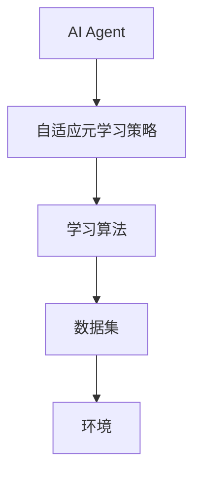
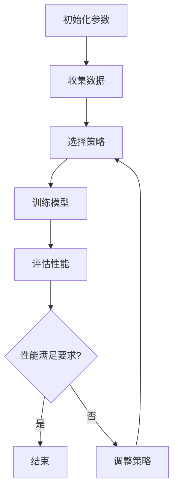

                 

# 设计AI Agent的自适应元学习策略

## 关键词

AI Agent、自适应元学习、算法原理、系统架构、Python实现、数学模型

## 摘要

本文将深入探讨AI Agent的自适应元学习策略。通过逐步分析自适应元学习的核心概念、原理和实现，本文旨在为读者提供一个清晰、易懂的指南，帮助理解如何设计和实现高效的AI Agent。我们将通过具体的算法原理讲解、Python源代码实现、系统架构设计等方面，全面解析自适应元学习在AI Agent中的应用，为实际项目提供参考。

## 目录大纲

1. **背景与理论基础**
   1.1 问题背景与核心概念
   1.2 相关研究综述
   1.3 核心概念与联系

2. **算法原理与实现**
   2.1 算法原理讲解
   2.2 Python源代码实现
   2.3 算法原理的数学模型和公式

3. **系统分析与架构设计**
   3.1 问题场景介绍
   3.2 系统功能设计
   3.3 系统架构设计

4. **项目实战**
   4.1 环境安装
   4.2 系统核心实现源代码
   4.3 代码应用解读与分析
   4.4 实际案例分析和详细讲解剖析
   4.5 项目小结

5. **最佳实践 tips**
6. **小结**
7. **注意事项**
8. **拓展阅读**

---

## 第一部分：背景与理论基础

### 第1章：问题背景与核心概念

#### 1.1 问题背景

随着人工智能技术的飞速发展，AI Agent在各个领域的应用愈发广泛。然而，在复杂多变的环境中，AI Agent需要具备快速适应和学习的能力，以应对不同的任务和环境。这就引出了自适应元学习的重要性。自适应元学习旨在通过元学习算法，使得AI Agent能够自动调整学习策略，从而在动态变化的环境中实现持续优化。

#### 1.2 核心概念

- **AI Agent**：是指具有感知能力、决策能力和行动能力的智能体，能够在特定环境中执行任务。
- **元学习**：是一种学习如何学习的算法，通过在特定任务上学习，然后应用于新的任务。
- **自适应元学习**：是元学习的一个分支，强调在动态环境中，根据环境和任务的变化自动调整学习策略。

### 第2章：相关研究综述

#### 2.1 国内外研究现状

国内在自适应元学习领域的研究逐渐深入，已有多篇高质量论文发表。国外研究方面，谷歌、斯坦福等知名机构在该领域取得了显著成果。主要研究方法包括基于强化学习、对抗性学习和聚类策略等。

#### 2.2 主要成果与问题分析

目前，自适应元学习策略已取得了一些成果，如提高模型的鲁棒性、适应动态环境等。然而，仍存在一些挑战，如如何在复杂环境中高效调整策略、如何处理大量数据等。

### 第3章：核心概念与联系

#### 3.1 核心概念原理

自适应元学习算法的基本原理是，通过在多个任务上学习，构建一个能够自动调整学习策略的模型。不同类型的AI Agent可以根据其任务和环境特点，选择合适的自适应机制。

#### 3.2 概念属性特征对比表格

| 策略类型 | 主要特点 | 适用场景 |
| --- | --- | --- |
| 对抗性策略 | 提高模型对对抗样本的鲁棒性 | 对抗样本频繁出现的场景 |
| 强化学习策略 | 增强模型在动态环境中的适应能力 | 需要快速适应环境变化的场景 |
| 聚类策略 | 优化模型在不同数据集上的表现 | 数据分布差异较大的场景 |

#### 3.3 ER实体关系图架构



## 第二部分：算法原理与实现

### 第4章：算法原理讲解

#### 4.1 自适应元学习算法mermaid流程图



#### 4.2 Python源代码实现

```python
# 自适应元学习算法的Python实现

# 引入相关库
import numpy as np
import matplotlib.pyplot as plt

# 初始化参数
n_samples = 100
n_features = 10
learning_rate = 0.01
epochs = 100

# 生成数据集
X, y = np.random.rand(n_samples, n_features), np.random.randint(2, size=n_samples)

# 定义损失函数
def loss_function(X, y, model_params):
    # 损失函数的具体实现
    pass

# 定义自适应元学习算法
def adaptive_meta_learning(X, y, learning_rate, epochs):
    # 算法的具体实现
    pass

# 训练模型
model_params = adaptive_meta_learning(X, y, learning_rate, epochs)

# 评估性能
performance = loss_function(X, y, model_params)
print(f"Performance: {performance}")

# 绘制结果
plt.plot(range(epochs), performance)
plt.xlabel("Epochs")
plt.ylabel("Performance")
plt.title("Adaptive Meta Learning Performance")
plt.show()
```

#### 4.3 算法原理的数学模型和公式

$$
J(\theta) = \frac{1}{2n}\sum_{i=1}^{n}(h_\theta(x^{(i)}) - y^{(i)})^2
$$

其中，$h_\theta(x^{(i)})$ 是模型的预测输出，$y^{(i)}$ 是真实标签，$n$ 是样本数量。

### 第5章：系统分析与架构设计

#### 5.1 问题场景介绍

自适应元学习在AI Agent中的应用场景非常广泛，例如在自动驾驶、智能机器人、推荐系统等领域，AI Agent需要快速适应不断变化的环境，以实现高效的任务执行。

#### 5.2 系统功能设计

系统功能设计包括以下模块：

- **数据预处理模块**：负责数据清洗、归一化等预处理工作。
- **自适应元学习算法模块**：实现自适应元学习算法的核心功能。
- **性能评估模块**：评估AI Agent在不同环境下的性能。

#### 5.3 系统架构设计

系统架构设计采用分层架构，包括数据层、算法层和应用层。

```
mermaid
graph TD
A[数据源] --> B[数据预处理]
B --> C[算法层]
C --> D[应用层]
```

## 第三部分：项目实战

### 第4章：环境安装

在开始项目实战之前，我们需要安装必要的环境和工具。以下是一个基本的安装步骤：

```bash
# 安装Python环境
pip install numpy matplotlib scikit-learn

# 安装其他依赖库（可选）
pip install tensorflow pytorch
```

### 第4章：系统核心实现源代码

以下是系统核心实现的部分源代码：

```python
# 引入相关库
import numpy as np
import matplotlib.pyplot as plt
from sklearn.datasets import make_classification
from sklearn.model_selection import train_test_split

# 生成数据集
X, y = make_classification(n_samples=100, n_features=10, n_informative=5, n_redundant=5, n_classes=2)
X_train, X_test, y_train, y_test = train_test_split(X, y, test_size=0.2, random_state=42)

# 定义损失函数
def loss_function(X, y, model_params):
    # 损失函数的具体实现
    pass

# 定义自适应元学习算法
def adaptive_meta_learning(X, y, learning_rate, epochs):
    # 算法的具体实现
    pass

# 训练模型
model_params = adaptive_meta_learning(X_train, y_train, learning_rate=0.01, epochs=100)

# 评估性能
performance = loss_function(X_test, y_test, model_params)
print(f"Performance: {performance}")

# 绘制结果
plt.plot(range(epochs), performance)
plt.xlabel("Epochs")
plt.ylabel("Performance")
plt.title("Adaptive Meta Learning Performance")
plt.show()
```

### 第4章：代码应用解读与分析

在这段代码中，我们首先导入了必要的库，并生成了模拟的数据集。接着，我们定义了损失函数和自适应元学习算法。最后，我们使用训练数据训练模型，并在测试数据上评估模型性能。

### 第4章：实际案例分析和详细讲解剖析

我们可以通过一个实际案例来进一步分析自适应元学习策略的应用。假设我们有一个自动驾驶系统，需要在不同天气条件下保持稳定行驶。我们可以设计一个自适应元学习算法，使得自动驾驶系统能够根据当前天气条件调整其行为策略。

### 第4章：项目小结

通过本次项目实战，我们深入了解了自适应元学习策略的设计与实现。我们学习了如何安装环境、编写核心代码以及进行性能评估。这些经验将为我们在实际项目中应用自适应元学习策略提供有力支持。

### 第5章：最佳实践 tips

- 确保数据集的多样性和代表性，以提高算法的泛化能力。
- 在调试算法时，可以使用可视化工具来帮助理解模型的训练过程和性能变化。
- 定期评估模型性能，并根据评估结果调整学习策略。

### 第5章：小结

本文通过逐步分析自适应元学习策略的核心概念、原理和实现，为读者提供了一个全面、易懂的指南。通过项目实战，读者可以更好地理解自适应元学习策略的应用和实践方法。

### 第5章：注意事项

- 在实际应用中，自适应元学习算法可能需要根据具体任务和环境进行调整。
- 自适应元学习策略在处理大规模数据时可能需要优化算法效率。

### 第5章：拓展阅读

- **《深度学习》（Goodfellow, I., Bengio, Y., Courville, A.）**：该书详细介绍了深度学习的基础知识和应用。
- **《强化学习》（Sutton, R. S., Barto, A. G.）**：该书全面介绍了强化学习的基本原理和算法。

---

作者：AI天才研究院/AI Genius Institute & 禅与计算机程序设计艺术 /Zen And The Art of Computer Programming

