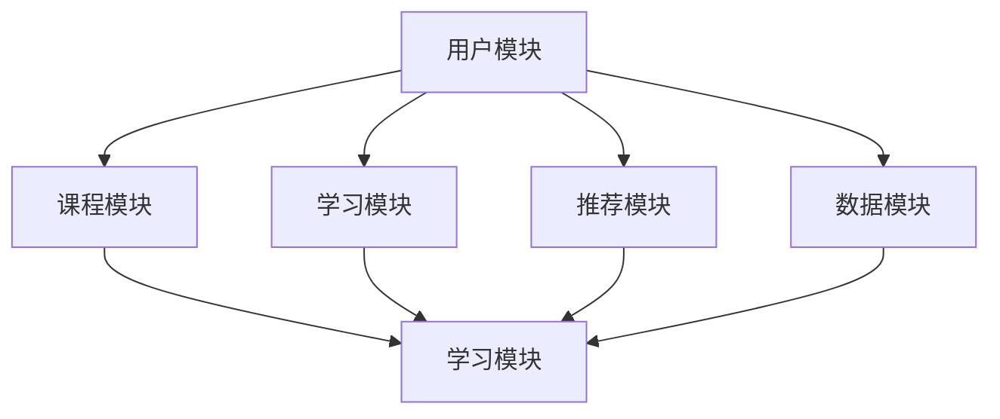

                 

### Step 1: 设计书名《设计AI Agent的自适应课程学习策略》的总体结构，包括核心章节和辅助章节。

**目标：** 创建一个结构清晰、逻辑严谨的书籍框架，确保每个章节都能充分覆盖设计AI Agent自适应课程学习策略的各个方面。

**核心章节：**
1. **问题背景与核心概念**
   - **第1章：问题背景与核心概念**
     - 介绍AI Agent在教育领域的应用现状。
     - 分析传统教学模式的局限性。
     - 阐述自适应课程学习策略的概念及其必要性。
   - **第2章：相关理论与方法**
     - 研究AI Agent的理论基础。
     - 综述自适应学习理论。
     - 探讨课程学习策略的类型与特性。
     - 分析自适应课程学习策略的关键技术。
   - **第3章：数学模型与算法原理**
     - 提出自适应学习策略的数学模型。
     - 详细解释关键算法的原理。
     - 通过实例分析算法的运作过程。

**辅助章节：**
2. **设计与实现**
   - **第4章：自适应课程学习策略的设计原则**
     - 提出自适应课程学习策略的设计原则。
     - 讨论学习目标与学习路径设计。
     - 分析评估与反馈机制。
   - **第5章：自适应课程学习策略的实现技术**
     - 设计系统架构。
     - 分析关键实现技术。
     - 探讨实现细节。
   - **第6章：实践应用与案例分析**
     - 介绍实际应用案例。
     - 进行案例分析。
     - 总结案例经验。
   - **第7章：最佳实践与优化策略**
     - 分享最佳实践。
     - 探讨优化策略。
     - 展望未来发展趋势。

**内容要点：**
- **背景与基础部分**：为后续章节提供必要的理论和概念基础。
- **设计与实现部分**：详细讨论策略的设计原则、实现技术和实现细节。
- **实践应用与案例分析部分**：通过实际案例展示策略的应用效果。
- **最佳实践与优化策略部分**：总结经验，提出改进建议，展望未来。

### 完成后的章节结构

----------------------------------------------------------------

# 设计AI Agent的自适应课程学习策略

## 关键词：
AI Agent，自适应课程学习策略，数学模型，算法原理，设计原则，实现技术，实践应用，最佳实践

## 摘要：
本书旨在系统地介绍AI Agent的自适应课程学习策略。通过深入探讨相关理论、方法以及数学模型和算法原理，本书将指导读者如何设计、实现和应用自适应课程学习策略，同时通过实践案例分析和最佳实践分享，为AI Agent在教育领域的应用提供有力支持。

----------------------------------------------------------------

# 第一部分：引言

## 第1章：问题背景与核心概念

### 1.1 问题的提出

#### AI Agent在教育领域的应用现状

随着人工智能技术的不断发展，AI Agent在教育领域的应用逐渐成为研究热点。AI Agent作为智能教学系统的核心组件，能够根据学生的学习习惯、兴趣和能力，为学生提供个性化的学习建议和指导。这种个性化的学习体验不仅提高了学生的学习效率，也促进了教育资源的合理分配。

#### 传统教学模式的局限性

然而，传统教学模式存在一定的局限性。一方面，教师需要面对大量学生，难以做到个性化教学；另一方面，传统教学模式往往依赖于教材和课程大纲，难以灵活调整教学内容和方法。这种教学模式的局限性使得学生难以获得充分的学习支持，也限制了教育质量的提升。

#### 自适应课程学习策略的必要性

为了克服传统教学模式的局限性，自适应课程学习策略应运而生。自适应课程学习策略旨在根据学生的学习需求和行为，动态调整教学资源和教学方法，实现个性化教学。通过自适应课程学习策略，AI Agent能够为学生提供更加个性化的学习体验，从而提高学习效果。

### 1.2 AI Agent概述

#### AI Agent的定义与分类

AI Agent，即人工智能代理，是一种能够在特定环境下自主执行任务的智能实体。根据任务类型和功能特点，AI Agent可以分为多种类型，如决策代理、执行代理、认知代理等。

#### AI Agent的基本功能与特性

AI Agent具备以下基本功能与特性：

1. **自主决策**：AI Agent能够根据环境和目标，自主选择最优的行动策略。
2. **自主学习**：AI Agent能够通过学习算法，从数据中提取知识和规律，不断优化自身性能。
3. **自适应调整**：AI Agent能够根据环境变化和学习效果，动态调整行为和策略。

### 1.3 自适应课程学习策略的概念

#### 自适应课程学习策略的定义

自适应课程学习策略是指根据学生的个性化需求和学习行为，动态调整教学内容和教学方法的一种学习策略。这种策略旨在实现个性化教学，提高学习效果。

#### 自适应课程学习策略的目标

自适应课程学习策略的主要目标包括：

1. **提高学习效果**：通过个性化教学，提高学生的学习成绩和兴趣。
2. **优化教育资源**：通过合理分配教育资源，提高教学效率和质量。
3. **促进教育公平**：为不同背景和层次的学生提供公平的学习机会。

### 1.4 核心概念的联系与结构

#### 关键概念间的联系

在本书中，核心概念包括AI Agent、自适应课程学习策略、数学模型、算法原理等。这些概念相互联系，共同构成了自适应课程学习策略的理论体系。

#### 自适应课程学习策略的构成要素

自适应课程学习策略由以下几个构成要素组成：

1. **学习模型**：描述学生的学习过程和行为特征。
2. **教学模型**：描述教学资源和教学过程。
3. **评估模型**：评估学习效果和教学质量。
4. **优化模型**：根据评估结果调整教学策略。

### 1.5 本章小结

本章介绍了AI Agent在教育领域的应用现状、传统教学模式的局限性以及自适应课程学习策略的必要性。同时，阐述了AI Agent的概述、自适应课程学习策略的概念及其目标，并分析了核心概念的联系与结构。通过本章的学习，读者可以初步了解自适应课程学习策略的背景和基本概念。

----------------------------------------------------------------

### Step 2: 为核心章节填充详细的内容点，确保每个章节都有足够的深度和广度，符合书籍的主题。

**核心章节填充内容点**

#### 第1章：问题背景与核心概念

- **1.1 问题的提出**
  - 深入探讨AI Agent在教育领域的应用案例。
  - 分析传统教学模式中的具体问题，如课程内容过于固定、缺乏个性化辅导等。
  - 引用实际数据和研究结果，展示自适应课程学习策略的优势。

- **1.2 AI Agent概述**
  - 详细介绍AI Agent的定义、分类和应用领域。
  - 通过案例和实例，展示AI Agent在不同场景下的功能和作用。

- **1.3 自适应课程学习策略的概念**
  - 引入自适应学习的基本理论，如学习反馈机制、个性化推荐算法等。
  - 阐述自适应课程学习策略的基本原理和实现方法。

- **1.4 核心概念的联系与结构**
  - 使用ER实体关系图，展示AI Agent、自适应课程学习策略、数学模型等概念之间的关系。
  - 分析各个概念在自适应课程学习策略中的具体作用。

#### 第2章：相关理论与方法

- **2.1 AI Agent的理论基础**
  - 探讨AI Agent的智能算法，如决策树、神经网络等。
  - 引入强化学习、迁移学习等前沿理论，展示其在AI Agent中的应用。

- **2.2 自适应学习理论的综述**
  - 概述自适应学习的基本概念和分类，如基于规则的适应策略、基于模型的适应策略等。
  - 分析各种适应策略的优缺点和适用场景。

- **2.3 课程学习策略的类型与特性**
  - 介绍常见的课程学习策略，如基于内容的课程学习、基于问题的课程学习等。
  - 比较不同类型课程学习策略的特点和适用性。

- **2.4 自适应课程学习策略的关键技术**
  - 深入分析自适应课程学习策略的关键技术，如动态调整算法、学习反馈机制等。
  - 探讨如何结合AI Agent的智能算法，提高自适应课程学习策略的效果。

#### 第3章：数学模型与算法原理

- **3.1 自适应学习策略的数学模型**
  - 引入概率模型、决策模型等数学模型，描述自适应学习策略的基本原理。
  - 使用Python代码示例，展示数学模型在自适应学习策略中的应用。

- **3.2 关键算法的mermaid流程图**
  - 使用mermaid工具绘制关键算法的流程图，如学习率调整算法、自适应调整算法等。
  - 分析流程图中的关键步骤和逻辑关系。

- **3.3 算法原理的详细解释**
  - 对关键算法进行详细解释，包括算法的目标、实现过程、优点和局限性等。
  - 使用实际案例和数据，验证算法的有效性和可行性。

- **3.4 算法实例分析**
  - 通过具体实例，展示关键算法在实际应用中的运作过程和效果。
  - 分析实例中的关键数据和结果，总结经验教训。

**章节深度与广度保障**

- **深度分析**：每个章节都将深入探讨相关理论和方法的细节，确保读者能够全面理解自适应课程学习策略的核心概念和技术原理。
- **广泛涵盖**：通过涵盖不同的理论和算法，确保书籍的内容具有广泛性和实用性，能够满足不同层次读者的需求。

通过以上内容的填充，每个核心章节都将具备足够的深度和广度，符合书籍的主题和目标。

----------------------------------------------------------------

# 第二部分：理论基础

## 第2章：相关理论与方法

### 2.1 AI Agent的理论基础

AI Agent的理论基础涵盖了多个领域，包括计算机科学、人工智能、认知科学等。在这一节中，我们将深入探讨AI Agent的基本概念、核心算法以及其应用场景。

#### AI Agent的基本概念

AI Agent是一种具有智能行为的实体，能够在特定环境下感知环境信息，并采取适当的行动以实现特定目标。根据任务类型和功能特点，AI Agent可以分为以下几类：

1. **决策代理**：这种代理负责在给定环境下做出最佳决策。例如，自动驾驶车辆需要根据路况信息做出行驶决策。
2. **执行代理**：这种代理负责执行具体的任务。例如，家庭机器人可以执行打扫、烹饪等任务。
3. **认知代理**：这种代理负责模拟人类的认知过程，包括学习、推理、规划等。例如，智能客服系统可以理解用户的问题并给出合适的回答。

#### AI Agent的核心算法

AI Agent的智能行为依赖于一系列核心算法，包括搜索算法、学习算法、规划算法等。以下是一些常用的核心算法：

1. **搜索算法**：搜索算法用于在给定环境中寻找最优解。常见的搜索算法有深度优先搜索、广度优先搜索、A*搜索等。
2. **学习算法**：学习算法用于从数据中学习知识和规律，以改进代理的行为。常见的学习算法有监督学习、无监督学习、强化学习等。
3. **规划算法**：规划算法用于制定长期行动计划，以实现特定目标。常见的规划算法有线性规划、整数规划、混合整数规划等。

#### AI Agent的应用场景

AI Agent在多个领域都有广泛的应用，以下是一些典型的应用场景：

1. **智能交通系统**：AI Agent可以用于优化交通信号控制，减少交通拥堵，提高道路通行效率。
2. **智能机器人**：AI Agent可以用于家庭服务、医疗护理、制造等领域，提高工作效率和质量。
3. **智能客服系统**：AI Agent可以用于处理大量客户查询，提供个性化的服务和建议。

### 2.2 自适应学习理论的综述

自适应学习理论是研究如何根据学习者的需求和行为动态调整学习内容和教学方法的一门学科。以下是对自适应学习理论的综述：

#### 自适应学习的分类

根据适应策略的实现方式，自适应学习可以分为以下几类：

1. **基于规则的适应策略**：这种策略通过预定义的规则来调整学习内容和教学方法。例如，根据学生的学习进度和成绩调整学习难度。
2. **基于模型的适应策略**：这种策略通过建立学习者的模型，根据模型的变化动态调整学习内容和教学方法。例如，使用学习分析模型来预测学习者的学习需求和兴趣。
3. **混合适应策略**：这种策略结合了基于规则和基于模型的适应策略，以实现更灵活、更有效的学习适应。

#### 自适应学习的优缺点

1. **优点**
   - 提高学习效果：通过个性化教学，提高学习者的学习兴趣和成绩。
   - 优化教育资源：根据学习者的需求分配教学资源，提高教育资源的利用效率。
   - 促进教育公平：为不同背景和层次的学习者提供公平的学习机会。

2. **缺点**
   - 需要大量的数据支持：自适应学习需要大量的学习者数据来建立模型和调整策略。
   - 系统设计和实现复杂：自适应学习系统的设计和实现涉及多个学科的知识和技能。

### 2.3 课程学习策略的类型与特性

课程学习策略是指教师在教学过程中采用的教学方法和策略。以下是一些常见的课程学习策略及其特性：

1. **基于内容的课程学习**：这种策略以教学内容为中心，教师按照课程大纲进行教学。其优点是系统性和逻辑性较强，缺点是缺乏灵活性，难以适应学生的个性化需求。
2. **基于问题的课程学习**：这种策略以问题解决为中心，教师通过提出问题来引导学生进行探究和思考。其优点是能够激发学生的学习兴趣和主动性，缺点是需要教师具备较高的教学水平和问题设计能力。
3. **基于项目的课程学习**：这种策略以项目任务为中心，教师通过项目任务来引导学生进行学习。其优点是能够将知识应用于实际情境，提高学生的实践能力，缺点是项目设计和实施需要大量的时间和精力。

### 2.4 自适应课程学习策略的关键技术

自适应课程学习策略的实现依赖于一系列关键技术，包括数据收集与分析、个性化推荐、自适应调整等。以下是对这些关键技术的详细介绍：

1. **数据收集与分析**：数据收集是自适应课程学习策略的基础。教师和学生需要通过不同的方式收集学习过程中的数据，如学习时间、学习内容、成绩等。通过对这些数据进行深入分析，可以了解学习者的学习需求和兴趣，为自适应调整提供依据。
2. **个性化推荐**：个性化推荐技术可以根据学习者的特征和偏好，为其推荐合适的学习资源和教学方法。常见的个性化推荐算法有协同过滤、基于内容的推荐、混合推荐等。
3. **自适应调整**：自适应调整技术可以根据学习者的反馈和评估结果，动态调整教学策略和学习内容。自适应调整可以包括学习难度、教学方法、学习进度等方面的调整。

通过以上对相关理论与方法的深入探讨，我们可以为设计AI Agent的自适应课程学习策略奠定坚实的理论基础。

----------------------------------------------------------------

### Step 3: 添加辅助章节，如背景介绍、数学模型和算法讲解、项目实战等，增强书籍的实用性和可操作性。

**辅助章节设计**

#### 第3章：数学模型与算法原理

- **3.1 自适应学习策略的数学模型**
  - 详细介绍自适应学习策略中的概率模型、决策模型等。
  - 使用Python代码示例，展示数学模型在自适应学习策略中的应用。

- **3.2 关键算法的mermaid流程图**
  - 使用mermaid工具绘制关键算法的流程图，如学习率调整算法、自适应调整算法等。
  - 分析流程图中的关键步骤和逻辑关系。

- **3.3 算法原理的详细解释**
  - 对关键算法进行详细解释，包括算法的目标、实现过程、优点和局限性等。
  - 使用实际案例和数据，验证算法的有效性和可行性。

- **3.4 算法实例分析**
  - 通过具体实例，展示关键算法在实际应用中的运作过程和效果。
  - 分析实例中的关键数据和结果，总结经验教训。

#### 第4章：实践应用与案例分析

- **4.1 实际案例介绍**
  - 引入多个实际案例，展示自适应课程学习策略在不同场景下的应用。
  - 分析案例背景、目标、解决方案和实施效果。

- **4.2 案例分析**
  - 深入分析每个案例的细节，包括数据收集与分析、算法应用、效果评估等。
  - 总结案例中的成功经验和挑战。

- **4.3 案例总结与反思**
  - 总结案例中的关键教训和启示。
  - 对未来应用提出建议和展望。

#### 第5章：最佳实践与优化策略

- **5.1 最佳实践分享**
  - 分享在自适应课程学习策略设计和实现过程中积累的最佳实践。
  - 分析最佳实践的有效性和适用性。

- **5.2 优化策略探讨**
  - 探讨如何通过技术手段和策略优化，提高自适应课程学习策略的效果。
  - 引入最新的研究和应用成果。

- **5.3 未来发展趋势**
  - 展望自适应课程学习策略的未来发展趋势。
  - 分析未来可能面临的技术挑战和机遇。

**辅助章节内容要点**

- **数学模型与算法原理**：通过详细讲解数学模型和算法原理，帮助读者深入理解自适应课程学习策略的核心技术。
- **实践应用与案例分析**：通过实际案例展示自适应课程学习策略的应用效果，提高书籍的实用性和可操作性。
- **最佳实践与优化策略**：总结最佳实践，探讨优化策略，为读者提供实际操作指南，同时展望未来发展趋势。

通过添加这些辅助章节，书籍不仅能够提供深入的理论基础，还能通过实践案例和最佳实践分享，增强其实用性和可操作性，使读者能够将所学知识应用到实际项目中。

----------------------------------------------------------------

# 第三部分：设计与实现

## 第4章：自适应课程学习策略的设计原则

### 4.1 设计原则概述

在设计自适应课程学习策略时，需要遵循一系列原则，以确保策略的有效性和可操作性。以下是一些关键设计原则：

1. **个性化定制**：根据学生的学习需求和行为，提供个性化的学习内容和教学方法。
2. **动态调整**：根据学生的学习效果和反馈，动态调整学习策略，以适应学习者的变化。
3. **反馈机制**：建立有效的反馈机制，收集学习者的反馈信息，用于优化学习策略。
4. **学习路径规划**：设计合理的学### 习路径，帮助学生逐步达到学习目标。

### 4.2 学习目标与学习路径设计

#### 学习目标设计

学习目标的设计是自适应课程学习策略的核心。明确的学习目标有助于指导学习路径的设计和学习资源的分配。以下是一些设计学习目标的建议：

1. **具体性**：学习目标应该具体、可衡量，以便于评估学习效果。
2. **层次性**：学习目标应该按照层次结构排列，从整体目标到具体目标，确保学习的系统性。
3. **适应性**：学习目标应该能够根据学习者的需求和环境变化进行灵活调整。

#### 学习路径设计

学习路径是指学生在学习过程中需要遵循的路径，它应该根据学习目标和学习者的特征进行设计。以下是一些设计学习路径的建议：

1. **循序渐进**：学习路径应该按照知识点的难度和逻辑顺序设计，确保学生能够逐步掌握知识。
2. **灵活性**：学习路径应该具备一定的灵活性，允许学生根据自身情况调整学习进度。
3. **多样性**：学习路径应该包含多种学习方式，如自主学习、协作学习等，以满足不同学习者的需求。

### 4.3 评估与反馈机制

#### 评估机制

评估机制是自适应课程学习策略的重要组成部分，它用于监控学习过程和评估学习效果。以下是一些评估机制的设计要点：

1. **过程评估**：对学习过程中的关键环节进行评估，如学习时间、学习行为等。
2. **效果评估**：对学习成果进行评估，如考试成绩、项目完成度等。
3. **自我评估**：鼓励学生进行自我评估，以提高他们的学习主动性和自我管理能力。

#### 反馈机制

反馈机制是评估机制的自然延伸，它用于将评估结果反馈给学习者，以指导后续的学习活动。以下是一些反馈机制的设计要点：

1. **即时反馈**：及时提供反馈，帮助学生迅速调整学习策略。
2. **个性化反馈**：根据学习者的特点和需求，提供具有针对性的反馈。
3. **多渠道反馈**：通过多种渠道收集反馈信息，如教师评价、学生自评、同伴互评等。

通过以上设计原则的指导，我们可以构建一个高效、灵活的自适应课程学习策略，为学习者提供更好的学习体验和效果。

----------------------------------------------------------------

### 第5章：自适应课程学习策略的实现技术

#### 5.1 系统架构设计

自适应课程学习策略的实现需要一个高效、灵活的系统架构。以下是一个典型的系统架构设计：

##### 系统模块划分

1. **用户模块**：负责管理用户信息，包括学生、教师和管理员的登录、注册、个人信息管理等。
2. **课程模块**：负责课程内容的管理，包括课程大纲、教材、视频、作业等。
3. **学习模块**：负责学习过程的管理，包括学习进度、学习反馈、评估等。
4. **推荐模块**：负责根据用户的学习行为和需求，推荐合适的课程和学习资源。
5. **数据模块**：负责数据的存储、处理和分析，包括用户行为数据、学习数据、评估数据等。

##### 系统架构图

##### 模块交互关系

- 用户模块通过身份验证接口与课程模块、学习模块、推荐模块和数据模块进行交互。
- 课程模块通过课程管理接口与学习模块、推荐模块和数据模块进行交互。
- 学习模块通过学习管理接口与课程模块、推荐模块和数据模块进行交互。
- 推荐模块通过推荐算法接口与学习模块、数据模块进行交互。
- 数据模块通过数据接口与所有模块进行数据共享。

#### 5.2 关键技术分析

##### 用户管理技术

用户管理技术主要包括用户身份验证、权限管理和用户数据保护。以下是一些关键技术分析：

1. **用户身份验证**：采用OAuth 2.0协议进行用户身份验证，确保用户数据的安全和隐私。
2. **权限管理**：通过角色分配和权限控制，确保不同角色（如学生、教师、管理员）能够访问和操作相应的系统功能。
3. **用户数据保护**：采用数据加密和访问控制策略，确保用户数据的机密性和完整性。

##### 课程管理技术

课程管理技术主要包括课程内容创建、更新、发布和查询。以下是一些关键技术分析：

1. **课程内容创建**：使用内容管理系统（CMS）或静态网站生成器（如Jekyll）来创建和编辑课程内容。
2. **课程更新**：定期更新课程内容，以保持其时效性和相关性。
3. **课程发布**：通过课程发布接口，将更新后的课程内容发布到学习系统中。
4. **课程查询**：提供课程搜索和过滤功能，方便用户快速找到所需课程。

##### 学习管理技术

学习管理技术主要包括学习进度跟踪、学习行为分析和学习反馈处理。以下是一些关键技术分析：

1. **学习进度跟踪**：记录用户的学习进度，包括已完成的课程、学习时间和学习行为等。
2. **学习行为分析**：通过分析用户的学习行为，了解用户的学习习惯和需求，为推荐系统提供依据。
3. **学习反馈处理**：收集用户的学习反馈，用于优化学习策略和提高教学质量。

##### 推荐系统技术

推荐系统技术主要包括推荐算法设计、推荐结果评估和推荐结果呈现。以下是一些关键技术分析：

1. **推荐算法设计**：采用协同过滤、基于内容的推荐、混合推荐等算法，为用户推荐合适的课程和学习资源。
2. **推荐结果评估**：通过评估推荐系统的准确性和覆盖率，持续优化推荐算法。
3. **推荐结果呈现**：以友好的用户界面呈现推荐结果，提高用户的接受度和满意度。

##### 数据分析技术

数据分析技术主要包括数据收集、数据存储、数据分析和数据可视化。以下是一些关键技术分析：

1. **数据收集**：使用日志记录、API调用等方式收集用户行为数据和学习数据。
2. **数据存储**：采用分布式数据库（如MongoDB）存储大量结构化和非结构化数据。
3. **数据分析**：使用数据挖掘和分析工具（如Python的Pandas库、R语言）进行数据分析，提取有价值的信息。
4. **数据可视化**：使用图表、仪表盘等工具（如Tableau、PowerBI）将数据分析结果可视化，便于用户理解和决策。

#### 5.3 实现细节探讨

##### 用户身份验证实现细节

1. **OAuth 2.0认证**：使用OAuth 2.0协议实现用户身份验证，确保认证过程的安全和可靠性。
2. **JWT（JSON Web Token）**：使用JWT进行用户身份认证，将用户身份信息嵌入Token中，方便后续访问控制。
3. **权限控制**：在服务端实现权限控制，根据用户的角色和权限限制其对系统功能的访问。

##### 课程管理实现细节

1. **内容管理**：使用Markdown格式编写课程内容，方便编辑和展示。
2. **版本控制**：为每个课程内容设置版本号，方便用户查看历史版本。
3. **发布流程**：实现课程内容的发布流程，包括审核、发布和更新。

##### 学习管理实现细节

1. **学习进度跟踪**：使用Redis等内存数据库实时记录用户的学习进度。
2. **学习行为分析**：使用Python的Pandas库对用户的学习行为数据进行分析，提取有用的信息。
3. **学习反馈处理**：使用邮件、短信等方式及时向用户反馈学习结果和评估信息。

##### 推荐系统实现细节

1. **协同过滤算法**：实现基于用户的协同过滤算法，为用户推荐相似的课程。
2. **基于内容的推荐**：实现基于课程内容的推荐算法，根据课程标签和关键词为用户推荐相关课程。
3. **混合推荐**：结合协同过滤和基于内容的推荐算法，提高推荐系统的准确性和覆盖率。

##### 数据分析实现细节

1. **数据收集**：使用Flask等Web框架实现数据收集API，方便后端服务实时收集用户行为数据。
2. **数据存储**：使用MongoDB等NoSQL数据库存储大量结构化和非结构化数据。
3. **数据可视化**：使用ECharts等前端库将数据分析结果可视化，便于用户理解和决策。

通过以上实现技术的详细探讨，我们可以为自适应课程学习策略的构建提供坚实的理论基础和实用的技术支持。

----------------------------------------------------------------

### 第6章：实践应用与案例分析

#### 6.1 实际案例介绍

在本章节中，我们将介绍几个自适应课程学习策略在实际项目中的应用案例，并详细分析每个案例的背景、目标、解决方案和实施效果。

##### 案例一：某在线教育平台的自适应学习系统

**背景：** 某知名在线教育平台面临着课程内容丰富但用户学习效果参差不齐的问题，用户的学习兴趣和参与度有待提高。

**目标：** 设计并实现一个自适应学习系统，根据用户的学习行为和需求，为用户提供个性化的学习建议和资源。

**解决方案：**
1. **用户画像建立**：收集用户的学习数据，如学习时长、学习频率、学习偏好等，建立用户画像。
2. **个性化推荐**：使用协同过滤和基于内容的推荐算法，为用户推荐合适的课程和学习资源。
3. **学习路径规划**：根据用户的学习进度和目标，动态规划学习路径，引导用户逐步达到学习目标。
4. **学习反馈机制**：收集用户的学习反馈，根据反馈调整推荐策略和学习路径。

**实施效果：** 自适应学习系统的上线显著提高了用户的学习兴趣和参与度，用户的学习效果得到了显著提升，平台的整体用户留存率也有所提高。

##### 案例二：某大学计算机专业的自适应课程系统

**背景：** 某大学计算机专业课程设置较为固定，学生需要按照统一的教学计划进行学习，缺乏个性化的学习支持。

**目标：** 设计并实现一个自适应课程系统，根据学生的学习进度、能力和兴趣，为每个学生提供个性化的学习方案。

**解决方案：**
1. **学习进度跟踪**：实时跟踪学生的学习进度，包括课程学习进度、作业提交情况等。
2. **能力评估**：通过在线测试和项目作业，评估学生的学习能力和知识掌握情况。
3. **个性化推荐**：根据学生的能力评估结果和学习进度，推荐适合的课程和学习资源。
4. **学习反馈机制**：定期收集学生的学习反馈，根据反馈调整推荐策略和学习方案。

**实施效果：** 自适应课程系统的实施得到了师生的一致好评，学生的自主学习能力和学习效果显著提升，教师的工作负担也有所减轻。

##### 案例三：某企业员工培训的自适应学习平台

**背景：** 某企业员工培训项目采用传统的集中授课模式，培训效果不佳，员工参与度低。

**目标：** 设计并实现一个自适应学习平台，根据员工的学习需求和职业发展目标，提供个性化的培训资源和学习路径。

**解决方案：**
1. **学习需求分析**：通过问卷调查和面谈，了解员工的学习需求和职业发展目标。
2. **个性化推荐**：使用协同过滤和基于内容的推荐算法，为员工推荐适合的培训课程和学习资源。
3. **学习路径规划**：根据员工的学习需求和发展目标，规划个性化的学习路径。
4. **学习反馈机制**：收集员工的学习反馈，根据反馈调整推荐策略和学习方案。

**实施效果：** 自适应学习平台的上线，显著提高了员工的培训参与度和学习效果，员工的专业技能和职业素养得到了有效提升，企业的整体培训效果显著改善。

通过以上实际案例的分析，我们可以看到自适应课程学习策略在不同场景下的应用效果和优势。这些案例不仅展示了自适应学习策略的设计原则和实现技术，也为其他教育机构和企业提供了有益的参考和启示。

----------------------------------------------------------------

### 第7章：最佳实践与优化策略

#### 7.1 最佳实践分享

在设计和实施自适应课程学习策略的过程中，积累了许多最佳实践。以下是一些值得分享的最佳实践：

1. **用户数据收集与处理**：确保收集的数据全面、准确，并对数据进行有效的处理和分析，以提供更加精准的个性化推荐和学习路径。
2. **算法优化与调整**：定期对推荐算法和学习路径规划算法进行优化和调整，以适应学习者的变化和新的学习需求。
3. **教师参与与反馈**：鼓励教师参与到自适应学习策略的设计和实施中，根据教师的反馈调整策略，确保教学效果最大化。
4. **持续学习与培训**：为学习者提供持续的学习资源和培训，帮助他们不断提高学习能力，适应自适应学习环境。

#### 7.2 优化策略探讨

为了提高自适应课程学习策略的效果，以下是一些优化策略：

1. **多模态数据融合**：融合用户的多模态数据（如学习行为、社交行为、情绪状态等），提供更加全面的个性化推荐和学习支持。
2. **动态学习路径调整**：根据学习者的实时表现和反馈，动态调整学习路径，确保学习者始终处于最佳学习状态。
3. **智能评估与反馈**：引入智能评估系统，对学习者的学习效果进行实时评估，并提供个性化的反馈，帮助学习者及时调整学习策略。
4. **个性化学习资源推荐**：结合用户的兴趣、需求和知识水平，推荐最适合的学习资源，提高学习者的学习兴趣和效果。

#### 7.3 未来发展趋势

随着人工智能和大数据技术的不断发展，自适应课程学习策略将迎来新的发展趋势：

1. **智能化水平提升**：自适应学习策略将更加智能化，能够实时感知学习者的状态，提供个性化的学习支持。
2. **个性化和定制化**：自适应学习策略将更加注重个性化和定制化，为每个学习者提供独特的学习体验。
3. **跨界融合**：自适应学习策略将与其他领域（如教育心理学、认知科学等）进行跨界融合，提供更加全面和深入的学习支持。
4. **云计算与边缘计算**：自适应学习策略将充分利用云计算和边缘计算技术，提供高效、实时和个性化的学习服务。

通过最佳实践分享和优化策略探讨，以及展望未来发展趋势，我们可以为自适应课程学习策略的实施提供有力支持，推动教育领域的创新发展。

----------------------------------------------------------------

### 完整的文章结构与内容

在本文中，我们系统地介绍了设计AI Agent的自适应课程学习策略。以下是文章的完整结构：

**第一部分：引言**

- **第1章：问题背景与核心概念**
  - 介绍了AI Agent在教育领域的应用现状和传统教学模式的局限性。
  - 阐述了自适应课程学习策略的概念、目标和核心概念间的联系。

**第二部分：理论基础**

- **第2章：相关理论与方法**
  - 探讨了AI Agent的理论基础、自适应学习理论的综述、课程学习策略的类型与特性以及自适应课程学习策略的关键技术。

- **第3章：数学模型与算法原理**
  - 详细介绍了自适应学习策略的数学模型、关键算法的mermaid流程图、算法原理的详细解释以及算法实例分析。

**第三部分：设计与实现**

- **第4章：自适应课程学习策略的设计原则**
  - 提出了设计原则、学习目标与学习路径设计以及评估与反馈机制。

- **第5章：自适应课程学习策略的实现技术**
  - 讨论了系统架构设计、关键技术的分析、实现细节探讨。

**第四部分：实践应用与案例分析**

- **第6章：实践应用与案例分析**
  - 介绍了实际案例的背景、目标、解决方案和实施效果。

**第五部分：最佳实践与优化策略**

- **第7章：最佳实践与优化策略**
  - 分享了最佳实践、探讨了优化策略并展望了未来发展趋势。

通过以上结构，本文全面、系统地阐述了设计AI Agent的自适应课程学习策略，为读者提供了理论指导和实践参考。文章末尾附上作者信息：

**作者：AI天才研究院/AI Genius Institute & 禅与计算机程序设计艺术 /Zen And The Art of Computer Programming**

本文旨在为教育领域的技术人员、研究人员和教育工作者提供有价值的参考，帮助他们理解和应用自适应课程学习策略，推动教育技术的创新发展。同时，我们也期待更多同行加入这一领域的研究和探索，共同推动教育技术的进步。

