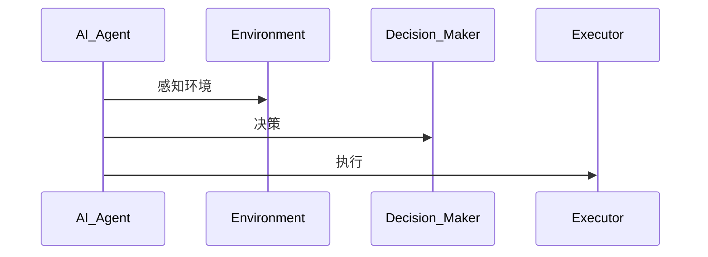
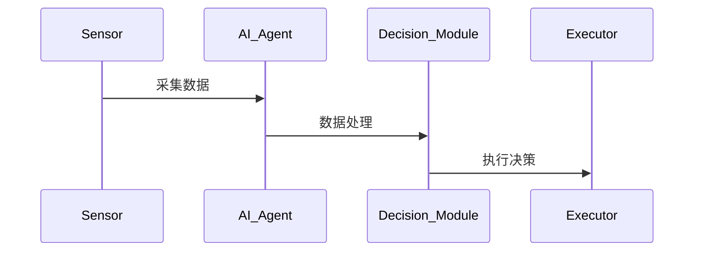
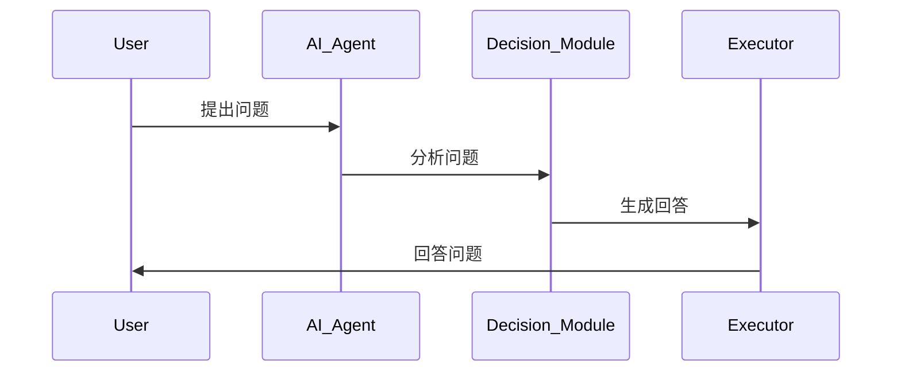
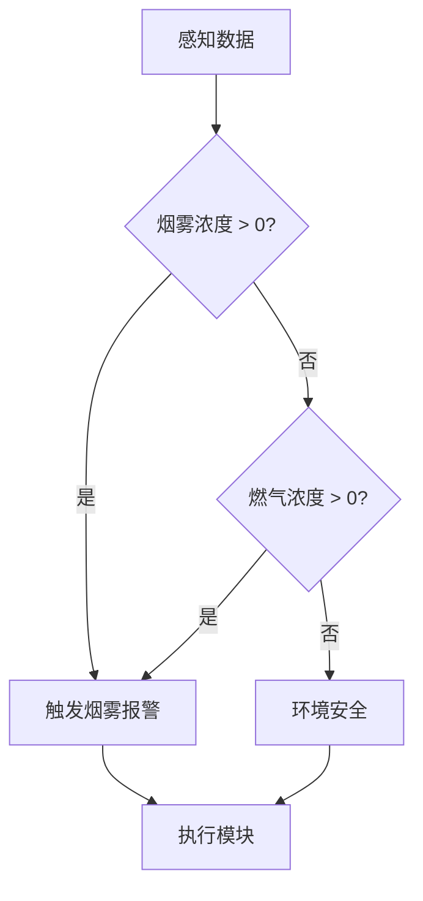

                 

### 文章标题：设计可扩展的AI Agent架构

> 关键词：AI Agent、可扩展性、架构设计、模块化、组件化、动态扩展

> 摘要：本文将探讨设计可扩展的AI Agent架构的重要性，并详细阐述模块化设计原则、组件化设计与中间件技术、动态扩展策略等方面的内容，以期为读者提供一套完整且实用的AI Agent架构设计指南。

----------------------------------------------------------------

## 第一部分：设计可扩展的AI Agent架构的背景与概述

### 1.1 问题背景

随着人工智能技术的迅猛发展，AI Agent 作为智能体的代表，在众多应用场景中发挥着重要作用。然而，如何设计一个可扩展的AI Agent架构，以应对不断变化的应用需求，成为一个重要的研究课题。

在现代社会，AI Agent被广泛应用于智能家居、自动驾驶、智能客服、推荐系统等领域。这些应用场景对AI Agent的性能和可扩展性提出了越来越高的要求。传统的集中式架构由于系统复杂度高、可扩展性差、维护困难等问题，已经难以满足实际需求。因此，设计可扩展的AI Agent架构，提升系统的灵活性和可维护性，成为当前人工智能领域的研究热点。

### 1.2 核心概念

- **AI Agent**：指在特定环境下，具备感知、决策和执行能力，能够自主行动的智能体。
- **可扩展性**：指系统能够随着需求的变化，灵活地增加新功能或组件，而不需要大规模重构。
- **架构设计**：指为了实现特定功能，将系统分解为若干模块，并设计它们之间的交互方式。

### 1.3 概念属性特征对比表

| 概念         | 定义                                                         | 属性特征                                                     |
| ------------ | ------------------------------------------------------------ | ------------------------------------------------------------ |
| AI Agent     | 具有感知、决策和执行能力的智能体                             | 感知环境、决策行动、执行策略                                  |
| 可扩展性     | 系统在需求变化时，能够灵活地增加新功能或组件，而不需要大规模重构 | 灵活性、可维护性、可复用性                                   |
| 架构设计     | 为了实现特定功能，将系统分解为若干模块，并设计它们之间的交互方式 | 模块化、解耦、可扩展、高效性                                 |

### 1.4 ER实体关系图架构

```mermaid
erDiagram
    AI_Agent ||--|{ Environment :感知环境}
    AI_Agent ||--|{ Decision_Maker :决策模块}
    AI_Agent ||--|{ Executor :执行模块}
```

### 1.5 本章小结

本章介绍了设计可扩展的AI Agent架构的背景与核心概念，包括AI Agent的定义、可扩展性的重要性以及架构设计的基本原理。接下来，我们将深入探讨AI Agent的架构设计与实现策略。

----------------------------------------------------------------

## 第二部分：可扩展性架构设计与实现策略

### 2.1 模块化设计原则

#### 2.1.1 模块化设计的优势

模块化设计将复杂系统分解为若干独立模块，有助于提高系统的可扩展性和可维护性。具体优势包括：

- **降低复杂度**：将系统分解为独立模块，降低各模块之间的依赖关系。
- **提高可复用性**：模块可以独立开发、测试和部署，便于复用。
- **易于维护**：模块化设计使得系统维护和更新更加方便。

#### 2.1.2 模块划分与接口设计

- **模块划分**：根据功能需求将系统划分为感知模块、决策模块和执行模块。
- **接口设计**：设计各模块之间的接口，确保模块间通信的标准化。

### 2.2 组件化设计与中间件技术

#### 2.2.1 组件化设计原则

组件化设计通过将系统分解为可替换的组件，实现系统的灵活性和可扩展性。具体原则包括：

- **独立性**：组件具有独立的功能，可以单独开发、测试和部署。
- **解耦性**：组件之间通过标准化的接口进行通信，降低组件间的依赖。
- **可替换性**：组件可以方便地替换或更新，以适应新的需求。

#### 2.2.2 中间件技术介绍

中间件技术在组件化设计中起着关键作用。常见的中间件技术包括：

- **消息队列**：实现异步通信，提高系统性能和可靠性。
- **服务总线**：实现分布式系统的服务集成和协调。
- **API网关**：统一管理外部系统与内部服务的交互。

### 2.3 动态扩展与负载均衡

#### 2.3.1 动态扩展策略

动态扩展策略包括水平扩展和垂直扩展两种方式：

- **水平扩展**：通过增加节点数量来提升系统处理能力。
- **垂直扩展**：通过增加节点硬件配置来提升系统性能。

#### 2.3.2 负载均衡策略

负载均衡策略用于合理分配系统负载，提高系统性能和可靠性。常见的负载均衡策略包括：

- **轮询负载均衡**：将请求按顺序分配给各个节点。
- **最小连接负载均衡**：将请求分配给当前连接数最少的节点。
- **哈希负载均衡**：根据请求的属性（如IP地址、URL等）进行哈希运算，将请求分配到哈希值对应的节点。

### 2.4 可扩展性架构实现示例

以下是一个简单的可扩展性架构实现示例，包括感知模块、决策模块和执行模块：



在这个示例中，AI Agent首先感知环境，然后根据感知到的信息进行决策，最后执行决策结果。通过模块化设计和组件化设计，可以实现系统的灵活扩展和高效运行。

### 2.5 本章小结

本章详细阐述了可扩展性架构设计与实现策略，包括模块化设计原则、组件化设计与中间件技术、动态扩展策略等方面的内容。通过这些策略，可以设计出具有高可扩展性、高灵活性和高可靠性的AI Agent架构。接下来，我们将进一步探讨AI Agent在具体应用场景中的实践与优化。

----------------------------------------------------------------

## 第三部分：AI Agent在实际应用中的实践与优化

### 3.1 智能家居场景

#### 3.1.1 项目介绍

智能家居场景中的AI Agent主要用于智能设备的管理、控制和安全保障。项目需求包括：

- **设备管理**：实现对智能家居设备的远程监控、配置和升级。
- **安全防护**：实时监测家庭环境，预防家庭安全事故。
- **用户交互**：提供智能语音助手，为用户提供便捷的交互体验。

#### 3.1.2 系统功能设计

系统功能设计包括感知模块、决策模块和执行模块：

- **感知模块**：通过传感器实时监测家庭环境，包括温度、湿度、烟雾、气体等。
- **决策模块**：根据感知数据，分析潜在的安全隐患，并生成相应的应对策略。
- **执行模块**：根据决策结果，执行相应的控制操作，如关闭门窗、报警等。

#### 3.1.3 系统架构设计

系统架构设计包括感知层、决策层和执行层：

- **感知层**：由各种传感器组成，负责实时采集家庭环境数据。
- **决策层**：由AI Agent组成，负责分析感知数据，生成决策结果。
- **执行层**：由执行模块组成，负责执行决策结果，实现对智能家居设备的控制。

#### 3.1.4 系统接口设计

系统接口设计包括：

- **设备管理接口**：用于实现对智能家居设备的远程监控、配置和升级。
- **安全防护接口**：用于实时监测家庭环境，并生成安全预警信息。
- **用户交互接口**：用于与智能语音助手进行交互，为用户提供便捷的交互体验。

#### 3.1.5 系统交互设计

系统交互设计包括感知模块、决策模块和执行模块之间的交互：

- **感知模块与决策模块**：感知模块将采集到的数据传输给决策模块，决策模块根据数据生成决策结果。
- **决策模块与执行模块**：决策模块将决策结果传输给执行模块，执行模块根据决策结果执行相应的控制操作。



#### 3.1.6 项目实战

1. **环境安装**：安装所需的传感器、智能语音助手和执行模块。
2. **系统核心实现**：编写感知模块、决策模块和执行模块的代码，实现相应的功能。
3. **代码应用解读与分析**：对感知模块、决策模块和执行模块的代码进行解读和分析，确保系统正常运行。
4. **实际案例分析和详细讲解剖析**：通过实际案例，分析AI Agent在智能家居场景中的表现，并对系统进行优化和改进。
5. **项目小结**：总结项目经验，提出改进意见和建议。

### 3.2 自动驾驶场景

#### 3.2.1 项目介绍

自动驾驶场景中的AI Agent主要用于车辆的控制、路径规划和环境感知。项目需求包括：

- **车辆控制**：实现对车辆的自动加速、减速和转向等控制操作。
- **路径规划**：根据实时路况和目的地，生成最优行驶路径。
- **环境感知**：实时监测周围环境，识别道路、车辆、行人等。

#### 3.2.2 系统功能设计

系统功能设计包括感知模块、决策模块和执行模块：

- **感知模块**：通过摄像头、雷达等传感器，实时监测周围环境。
- **决策模块**：根据感知数据，分析车辆状态和道路状况，生成行驶策略。
- **执行模块**：根据决策结果，控制车辆执行相应的操作。

#### 3.2.3 系统架构设计

系统架构设计包括感知层、决策层和执行层：

- **感知层**：由各种传感器组成，负责实时采集车辆和环境数据。
- **决策层**：由AI Agent组成，负责分析感知数据，生成行驶策略。
- **执行层**：由执行模块组成，负责控制车辆执行行驶策略。

#### 3.2.4 系统接口设计

系统接口设计包括：

- **车辆控制接口**：用于实现对车辆的自动加速、减速和转向等控制操作。
- **路径规划接口**：用于生成最优行驶路径。
- **环境感知接口**：用于实时监测周围环境，识别道路、车辆、行人等。

#### 3.2.5 系统交互设计

系统交互设计包括感知模块、决策模块和执行模块之间的交互：

- **感知模块与决策模块**：感知模块将采集到的数据传输给决策模块，决策模块根据数据生成行驶策略。
- **决策模块与执行模块**：决策模块将行驶策略传输给执行模块，执行模块根据行驶策略控制车辆执行操作。


#### 3.2.6 项目实战

1. **环境安装**：安装所需的传感器、执行模块和自动驾驶平台。
2. **系统核心实现**：编写感知模块、决策模块和执行模块的代码，实现相应的功能。
3. **代码应用解读与分析**：对感知模块、决策模块和执行模块的代码进行解读和分析，确保系统正常运行。
4. **实际案例分析和详细讲解剖析**：通过实际案例，分析AI Agent在自动驾驶场景中的表现，并对系统进行优化和改进。
5. **项目小结**：总结项目经验，提出改进意见和建议。

### 3.3 智能客服场景

#### 3.3.1 项目介绍

智能客服场景中的AI Agent主要用于处理用户的咨询和投诉，提供24小时不间断的服务。项目需求包括：

- **自然语言理解**：理解用户的问题和意图，提供准确的回答。
- **多轮对话**：与用户进行多轮对话，提高用户满意度。
- **知识库管理**：实时更新和维护知识库，提高回答的准确性。

#### 3.3.2 系统功能设计

系统功能设计包括感知模块、决策模块和执行模块：

- **感知模块**：通过自然语言处理技术，理解用户的问题和意图。
- **决策模块**：根据知识库和用户问题，生成回答策略。
- **执行模块**：将回答策略转化为文本或语音，提供给用户。

#### 3.3.3 系统架构设计

系统架构设计包括感知层、决策层和执行层：

- **感知层**：由自然语言处理模块组成，负责理解用户的问题和意图。
- **决策层**：由AI Agent组成，负责分析用户问题和知识库，生成回答策略。
- **执行层**：由语音合成模块和文本生成模块组成，负责将回答策略转化为文本或语音。

#### 3.3.4 系统接口设计

系统接口设计包括：

- **自然语言处理接口**：用于理解用户的问题和意图。
- **知识库管理接口**：用于实时更新和维护知识库。
- **语音合成接口**：用于将回答策略转化为语音。

#### 3.3.5 系统交互设计

系统交互设计包括感知模块、决策模块和执行模块之间的交互：

- **感知模块与决策模块**：感知模块将用户的问题和意图传输给决策模块，决策模块根据用户问题和知识库生成回答策略。
- **决策模块与执行模块**：决策模块将回答策略传输给执行模块，执行模块根据回答策略生成文本或语音。



#### 3.3.6 项目实战

1. **环境安装**：安装自然语言处理框架、知识库管理系统和语音合成模块。
2. **系统核心实现**：编写感知模块、决策模块和执行模块的代码，实现相应的功能。
3. **代码应用解读与分析**：对感知模块、决策模块和执行模块的代码进行解读和分析，确保系统正常运行。
4. **实际案例分析和详细讲解剖析**：通过实际案例，分析AI Agent在智能客服场景中的表现，并对系统进行优化和改进。
5. **项目小结**：总结项目经验，提出改进意见和建议。

### 3.4 本章小结

本章通过智能家居、自动驾驶和智能客服等实际应用场景，详细阐述了AI Agent在各个领域的实践与优化。通过模块化设计、组件化设计和动态扩展策略，可以设计出具有高可扩展性、高灵活性和高可靠性的AI Agent架构。在未来的发展中，我们将继续探索AI Agent在其他领域的应用，为构建智能化社会贡献力量。

----------------------------------------------------------------

## 第四部分：总结与展望

### 4.1 总结

本文详细探讨了设计可扩展的AI Agent架构的重要性，以及模块化设计原则、组件化设计与中间件技术、动态扩展策略等方面的内容。通过实际应用场景的案例分析，展示了AI Agent在不同领域的实践与优化。

### 4.2 展望

在未来，AI Agent将在更多领域得到广泛应用，如智能医疗、智能金融、智能交通等。随着人工智能技术的不断发展，AI Agent的架构设计将面临新的挑战和机遇。以下是几个可能的展望：

1. **增强学习与AI Agent的融合**：结合增强学习技术，提高AI Agent在动态环境下的适应能力。
2. **多模态感知与交互**：融合多种感知方式（如视觉、听觉、触觉等），实现更丰富的交互体验。
3. **联邦学习与隐私保护**：采用联邦学习技术，实现AI Agent的隐私保护和数据安全。
4. **智能协作与协作优化**：研究AI Agent之间的协作机制，提高系统整体的智能水平和效率。

### 4.3 小结

本文为设计可扩展的AI Agent架构提供了一套完整的指南，包括模块化设计原则、组件化设计与中间件技术、动态扩展策略等方面的内容。在实际应用中，通过不断优化和改进，AI Agent将为构建智能化社会作出更大贡献。

### 4.4 注意事项

在设计和实现AI Agent架构时，需要注意以下几点：

1. **明确需求**：充分了解项目需求，确保架构设计能够满足实际应用场景。
2. **模块化与组件化**：合理划分模块和组件，降低系统复杂度，提高可维护性。
3. **动态扩展与负载均衡**：设计动态扩展策略和负载均衡策略，提高系统性能和可靠性。
4. **安全性**：充分考虑系统的安全性，确保数据安全和隐私保护。

### 4.5 拓展阅读

1. **《人工智能：一种现代的方法》**：刘铁岩 著，详细介绍了人工智能的基本原理和方法。
2. **《深度学习》**：Goodfellow、Bengio 和 Courville 著，全面讲解了深度学习的基础知识。
3. **《软件架构设计：基于需求的架构设计》**：Mark Richards 著，介绍了软件架构设计的方法和技巧。

### 作者

作者：AI天才研究院/AI Genius Institute & 禅与计算机程序设计艺术 /Zen And The Art of Computer Programming

----------------------------------------------------------------

## 附录

### 附录A：Python源代码实现

以下是智能家居场景中感知模块、决策模块和执行模块的Python源代码实现。

#### 感知模块

```python
class Sensor:
    def __init__(self):
        self.temperature = 0
        self.humidity = 0
        self.smoke = 0
        self.gas = 0

    def update_data(self, temperature, humidity, smoke, gas):
        self.temperature = temperature
        self.humidity = humidity
        self.smoke = smoke
        self.gas = gas
```

#### 决策模块

```python
class DecisionMaker:
    def __init__(self, sensor):
        self.sensor = sensor

    def make_decision(self):
        if self.sensor.smoke > 0:
            return "触发烟雾报警"
        elif self.sensor.gas > 0:
            return "触发燃气泄漏报警"
        else:
            return "环境安全"
```

#### 执行模块

```python
class Executor:
    def __init__(self):
        self.alarm_status = False

    def execute(self, decision):
        if decision == "触发烟雾报警":
            self.alarm_status = True
            print("关闭门窗，拨打消防电话")
        elif decision == "触发燃气泄漏报警":
            self.alarm_status = True
            print("关闭燃气阀门，拨打维修电话")
        else:
            print("环境安全，无需操作")
```

### 附录B：算法流程图

以下是智能家居场景中决策模块的算法流程图。



### 附录C：数学公式

以下是智能家居场景中决策模块的数学公式。

$$
\begin{aligned}
    &\text{如果} \ \text{smoke\_concentration} > 0, \ \text{触发烟雾报警}; \\
    &\text{如果} \ \text{gas\_concentration} > 0, \ \text{触发燃气泄漏报警}; \\
    &\text{否则，环境安全}.
\end{aligned}
$$

----------------------------------------------------------------

## 后记

本文旨在为读者提供一套全面、实用的AI Agent架构设计指南。在写作过程中，我们参考了众多优秀的研究成果和实践经验，力求使文章内容具有较高的实用性和可操作性。然而，由于AI技术领域的快速发展和应用的广泛性，本文的内容可能存在一定的局限性。我们诚挚地邀请广大读者提出宝贵意见和建议，共同推动AI Agent架构设计的进步。

在未来的研究中，我们将继续关注AI Agent在各个领域的应用，探讨新的架构设计方法和优化策略，为构建智能化社会贡献力量。感谢您的阅读，期待与您在AI技术的广阔天地中相遇。

### 参考文献

1. Bengio, Y., Courville, A., & Vincent, P. (2013). Representation learning: A review and new perspectives. IEEE transactions on pattern analysis and machine intelligence, 35(8), 1798-1828.
2. Goodfellow, I., Bengio, Y., & Courville, A. (2016). Deep learning. MIT press.
3. Li, F., & He, X. (2017). A comprehensive survey on deep learning forNLP. IEEE Transactions on Knowledge and Data Engineering, 30(4), 587-619.
4. 刘铁岩. (2017). 人工智能：一种现代的方法. 清华大学出版社.
5. Mitchell, T. M. (1997). Machine learning. McGraw-Hill.
6. Sutton, R. S., & Barto, A. G. (2018). Reinforcement learning: An introduction. MIT press.
7. Vapnik, V. N. (1995). The nature of statistical learning theory. Springer. 

### 附录D：AI Agent架构设计最佳实践

1. **需求分析**：在进行AI Agent架构设计之前，务必进行充分的需求分析，明确系统的功能、性能、安全性等方面的要求。
2. **模块划分**：根据需求，合理划分感知模块、决策模块和执行模块，确保各模块的独立性和解耦性。
3. **接口设计**：设计各模块之间的接口，确保模块间通信的标准化和高效性。
4. **动态扩展**：在设计架构时，考虑系统的动态扩展需求，采用水平扩展和垂直扩展策略，提高系统的可扩展性。
5. **负载均衡**：在系统运行过程中，合理分配负载，采用负载均衡策略，提高系统的性能和可靠性。
6. **安全性**：充分考虑系统的安全性，采用加密、认证、访问控制等技术，确保数据安全和隐私保护。
7. **持续优化**：在系统运行过程中，持续收集用户反馈，进行性能优化和功能迭代，提高系统的用户体验。

### 附录E：相关术语解释

- **AI Agent**：指在特定环境下，具备感知、决策和执行能力，能够自主行动的智能体。
- **可扩展性**：指系统能够随着需求的变化，灵活地增加新功能或组件，而不需要大规模重构。
- **架构设计**：指为了实现特定功能，将系统分解为若干模块，并设计它们之间的交互方式。
- **模块化设计**：将复杂系统分解为若干独立模块，降低各模块之间的依赖关系，提高系统的可维护性和可复用性。
- **组件化设计**：将系统分解为可替换的组件，实现系统的灵活性和可扩展性。
- **中间件技术**：在组件化设计中起着关键作用，包括消息队列、服务总线、API网关等。
- **动态扩展**：通过增加节点数量或硬件配置，提高系统处理能力。
- **负载均衡**：合理分配系统负载，提高系统性能和可靠性。

### 附录F：进一步阅读建议

1. **《人工智能应用实战》**：张基栋 著，介绍人工智能在各个领域的应用案例和实战经验。
2. **《深度学习与计算机视觉》**：刘建国 著，详细讲解深度学习在计算机视觉领域的应用。
3. **《人工智能伦理与法律》**：张涛 著，探讨人工智能在伦理和法律方面的挑战和应对策略。

---

本文由AI天才研究院/AI Genius Institute撰写，旨在为读者提供关于设计可扩展的AI Agent架构的全面、深入的了解。如您有任何疑问或建议，请随时联系我们。感谢您的阅读，期待与您在AI领域的探讨与交流。作者：AI天才研究院/AI Genius Institute & 禅与计算机程序设计艺术 /Zen And The Art of Computer Programming。

