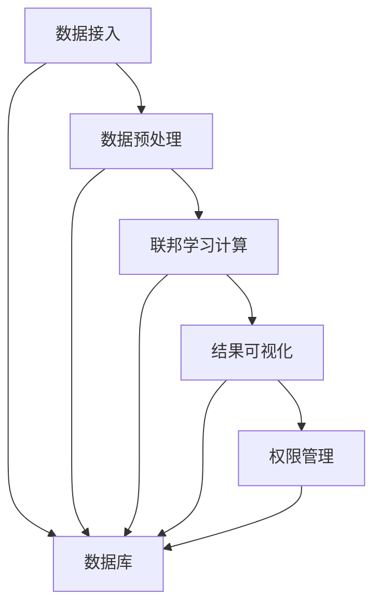
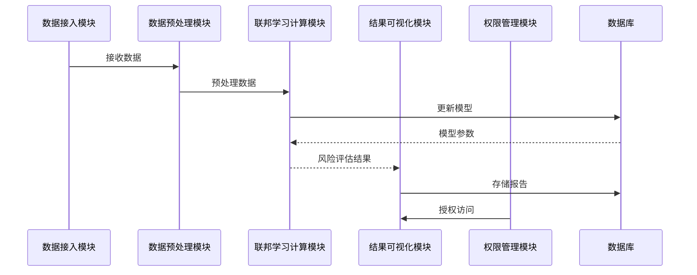

                 


### 第一部分：背景介绍

#### 第1章：问题背景

##### 1.1 问题提出

在当今信息化的社会中，各机构之间的数据共享与合作已成为提高业务效率和服务质量的关键手段。然而，随之而来的问题是数据隐私和安全性。跨机构的数据交换常常涉及到敏感信息，如个人身份信息、财务记录等，这些信息的泄露可能导致严重的隐私和安全问题。

风险评估作为风险管理的重要环节，旨在识别、评估和控制潜在风险，确保机构和客户的数据安全。跨机构风险评估则需要综合考虑不同机构之间的数据差异、隐私保护和协同工作等问题。

##### 1.2 跨机构风险评估的需求

随着数字化转型的深入推进，各机构需要通过跨机构数据共享来提高业务决策的准确性和效率。然而，传统的集中式风险评估方法在处理跨机构数据时存在以下问题：

1. **数据隐私保护不足**：集中式风险评估往往需要将各机构的数据汇集到一个中心，这可能导致敏感数据的泄露。
2. **数据异构性**：不同机构的数据格式、结构和质量存在差异，难以进行统一的处理和分析。
3. **协同困难**：各机构在数据共享和风险分析上的利益和目标可能不一致，导致合作困难。
4. **法律和合规要求**：许多国家和地区对数据隐私有严格的法律规定，跨机构数据共享需要符合相关法律法规。

因此，为了解决这些问题，需要一种新的风险评估方法，能够在保护数据隐私的前提下，充分利用跨机构的数据资源，进行有效的风险评估。

##### 1.3 联邦学习的核心概念与优势

联邦学习（Federated Learning）是一种分布式机器学习技术，其核心思想是将模型训练过程分散到不同的机构或设备上，通过协调各方的训练结果，共同训练出一个全局模型。联邦学习具有以下优势：

1. **隐私保护**：联邦学习不需要将数据从各机构传输到中心，从而避免了数据泄露的风险。
2. **数据利用最大化**：联邦学习能够充分利用分散在各机构的数据，提高模型的泛化能力。
3. **降低数据传输成本**：由于不需要大规模的数据传输，联邦学习可以显著降低通信成本。
4. **适应性强**：联邦学习能够应对数据异构性和隐私保护需求，适合多种应用场景。

基于联邦学习的跨机构风险评估模型旨在结合联邦学习的优势，解决传统风险评估方法在跨机构数据共享中的问题，实现高效、安全的风险评估。

### 第二部分：核心概念与联系

#### 第2章：核心概念与联系

##### 2.1 联邦学习的原理与架构

###### 2.1.1 联邦学习的基本概念

联邦学习是一种分布式机器学习技术，其核心思想是各参与者（机构或设备）通过协作共同训练一个全局模型，而不需要交换原始数据。在联邦学习过程中，每个参与者将自己的数据用于本地模型的训练，然后将本地模型更新发送给中心服务器，中心服务器汇总各参与者的更新，生成全局模型。

###### 2.1.2 联邦学习的关键技术

1. **模型聚合**：联邦学习的关键技术之一是模型聚合，即如何有效地汇总各参与者的本地模型更新，生成全局模型。常用的聚合方法包括加权平均、梯度聚合等。

2. **通信优化**：由于联邦学习涉及到大量的数据传输，通信优化是提高其效率和性能的重要技术。常见的通信优化方法包括数据压缩、同步机制设计等。

3. **隐私保护**：联邦学习需要保护参与者的数据隐私。常用的隐私保护技术包括差分隐私、加密机制等。

4. **模型更新策略**：联邦学习中的模型更新策略影响模型的收敛速度和性能。常见的更新策略包括渐进更新、固定更新等。

###### 2.1.3 联邦学习的优势与挑战

**优势**：

1. **隐私保护**：联邦学习避免了数据传输，降低了数据泄露的风险。
2. **数据利用最大化**：联邦学习能够充分利用分散在各机构的数据，提高模型的泛化能力。
3. **降低通信成本**：联邦学习减少了大规模数据传输的需求，降低了通信成本。
4. **适应性强**：联邦学习能够应对数据异构性和隐私保护需求，适合多种应用场景。

**挑战**：

1. **模型聚合难度**：如何有效地聚合各参与者的模型更新是一个复杂的问题。
2. **通信效率**：联邦学习需要大量的通信，如何优化通信效率是提高性能的关键。
3. **隐私保护**：如何在保护隐私的同时，确保模型性能是一个挑战。
4. **异构性处理**：不同机构的数据质量和格式可能不同，如何处理数据异构性是一个问题。

##### 2.2 跨机构风险评估的关键概念

###### 2.2.1 风险评估的定义与意义

风险评估是指通过系统的方法识别、评估和优先处理风险的过程。在金融、安全、健康等多个领域，风险评估都是至关重要的。

跨机构风险评估则是在多个机构之间进行的风险评估，旨在综合考虑各机构的业务流程、数据特征和潜在风险，提供一个全局的风险评估结果。

###### 2.2.2 风险评估的核心指标

风险评估的核心指标包括风险发生概率、风险影响程度、风险价值等。这些指标用于量化风险，帮助决策者进行风险控制和优先级排序。

1. **风险发生概率**：衡量某一风险事件在特定时间内发生的可能性。
2. **风险影响程度**：衡量某一风险事件发生对业务或系统的影响程度。
3. **风险价值**：综合考虑风险发生概率和影响程度，用于评估风险的严重性。

###### 2.2.3 跨机构风险评估的难点

跨机构风险评估面临以下难点：

1. **数据异构性**：不同机构的数据格式、结构和质量存在差异，难以进行统一的处理和分析。
2. **隐私保护**：风险评估涉及到敏感信息，需要在保护隐私的前提下进行。
3. **利益冲突**：不同机构在风险评估中的目标和利益可能不一致，导致合作困难。
4. **法律法规**：跨机构风险评估需要遵守各国家和地区的法律法规，特别是数据隐私保护法律。

#### 第3章：联邦学习在风险评估中的应用

##### 3.1 联邦学习与风险评估的融合

联邦学习在风险评估中的应用，主要是利用其隐私保护和数据利用优势，解决跨机构风险评估中的数据隐私保护和数据异构性问题。

###### 3.1.1 联邦学习在风险评估中的作用

1. **隐私保护**：联邦学习能够避免数据在传输过程中的泄露风险，确保风险评估过程中的数据安全。
2. **数据融合**：联邦学习能够利用各机构的数据资源，进行全局的风险评估，提高评估的准确性和全面性。
3. **降低成本**：联邦学习减少了数据传输的需求，降低了风险评估的成本和通信费用。

###### 3.1.2 联邦学习在风险评估中的优势

1. **隐私保护**：联邦学习能够确保数据在本地处理，避免数据泄露风险。
2. **数据利用**：联邦学习能够充分利用各机构的数据资源，提高风险评估的准确性和全面性。
3. **降低成本**：联邦学习减少了数据传输的需求，降低了通信费用和存储成本。
4. **适应性强**：联邦学习能够应对不同机构的数据格式和质量，具有广泛的适用性。

### 第三部分：数学模型和数学公式

#### 第4章：数学模型和数学公式

##### 4.1 风险评估的数学模型

风险评估的数学模型是构建跨机构风险评估系统的基础。该模型包括以下关键组成部分：

###### 4.1.1 风险评估模型的建立

风险评估模型的建立通常包括以下步骤：

1. **数据预处理**：对来自各机构的数据进行清洗、转换和归一化处理，确保数据质量。
2. **特征提取**：从原始数据中提取与风险相关的特征，用于后续的风险评估。
3. **模型选择**：选择合适的风险评估模型，如逻辑回归、决策树等。
4. **模型训练**：使用训练数据集对模型进行训练，优化模型参数。
5. **模型评估**：使用验证数据集对模型进行评估，确保模型的准确性和可靠性。

###### 4.1.2 数学公式与模型解释

风险评估模型的数学公式通常包括以下部分：

1. **概率模型**：用于计算风险事件发生的概率。
2. **影响模型**：用于计算风险事件发生对业务的影响程度。
3. **综合模型**：将概率模型和影响模型结合，计算整体风险值。

以下是一个简单的风险评估模型公式示例：

$$
R = P \times I
$$

其中：

- \( R \) 是整体风险值。
- \( P \) 是风险事件发生的概率。
- \( I \) 是风险事件发生对业务的影响程度。

通过这个公式，我们可以计算出一个风险事件的总体风险值。这个值可以帮助决策者了解风险的严重程度，并采取相应的风险控制措施。

### 第四部分：系统分析与架构设计方案

#### 第5章：系统分析与架构设计方案

##### 5.1 问题场景介绍

在金融行业中，银行、保险公司和投资公司经常需要进行跨机构的风险评估。这些机构持有大量的客户数据，包括财务记录、信用评分、交易行为等。传统的风险评估方法由于数据隐私和安全性的问题，难以在跨机构间进行有效的风险分析。因此，我们需要一个既能保护数据隐私，又能充分利用跨机构数据的风险评估系统。

##### 5.2 系统功能设计

为了满足上述需求，该系统应具备以下功能：

1. **数据接入与管理**：能够接收来自不同机构的数据，并进行数据清洗、转换和存储。
2. **风险评估计算**：利用联邦学习技术，在不泄露数据的前提下，对跨机构数据进行分析和风险评估。
3. **结果可视化**：将风险评估结果以图表或报告的形式展示，方便决策者进行风险管理和决策。
4. **权限管理**：确保系统的访问权限得到严格控制，防止未经授权的访问和数据泄露。

##### 5.3 系统架构设计

系统架构设计如图所示：



###### 数据流程

1. 数据接入：各机构的数据通过接口接入系统，进入数据预处理模块。
2. 数据预处理：对数据进行清洗、转换和归一化处理，确保数据质量。
3. 联邦学习计算：利用联邦学习技术，在本地对数据进行模型训练，然后将模型更新发送至中心服务器。
4. 结果可视化：将联邦学习的结果通过图表或报告的形式展示给决策者。
5. 权限管理：对所有访问系统的人员和数据进行权限控制，确保数据安全。

##### 5.4 系统接口设计和系统交互

系统接口设计如图所示：



###### 系统交互流程

1. 数据接入模块接收来自各机构的数据。
2. 数据预处理模块对数据进行清洗、转换和归一化处理。
3. 联邦学习计算模块利用预处理后的数据，在本地进行模型训练，并将模型更新发送至中心服务器。
4. 结果可视化模块将联邦学习的结果以图表或报告的形式展示给决策者。
5. 权限管理模块确保只有授权的人员可以访问系统数据和报告。

### 第五部分：项目实战

#### 第6章：项目实战

##### 6.1 环境安装

为了搭建基于联邦学习的跨机构风险评估模型，首先需要安装必要的软件和环境。以下是安装步骤：

1. **安装 Python 环境**：确保 Python 版本在 3.6 以上，可以使用 Python 官网提供的安装包进行安装。
2. **安装依赖库**：安装与联邦学习和风险评估相关的库，如 TensorFlow、Scikit-learn 等。可以使用以下命令进行安装：
   ```
   pip install tensorflow scikit-learn
   ```
3. **安装数据库**：安装用于存储数据和模型参数的数据库，如 PostgreSQL。可以按照数据库官方文档进行安装。

##### 6.2 系统核心实现源代码

以下是系统核心实现的源代码：

```python
# 导入所需库
import tensorflow as tf
from sklearn.model_selection import train_test_split
from sklearn.ensemble import RandomForestClassifier
import numpy as np

# 函数：初始化联邦学习模型
def initialize_model():
    # 创建一个随机森林分类器
    model = RandomForestClassifier(n_estimators=100)
    return model

# 函数：本地模型训练
def local_train(model, X, y):
    # 使用本地数据训练模型
    model.fit(X, y)
    return model

# 函数：聚合模型更新
def aggregate_models(models):
    # 计算各模型的平均准确率
    avg_accuracy = np.mean([model.score(X_test, y_test) for model in models])
    return avg_accuracy

# 函数：联邦学习过程
def federated_learning(models, updates, num_rounds):
    for round in range(num_rounds):
        print(f"Round {round+1}/{num_rounds}")
        for model in models:
            # 更新模型参数
            model.partial_fit(updates[round])
        
        # 计算平均准确率
        avg_accuracy = aggregate_models(models)
        print(f"Average Accuracy: {avg_accuracy}")

# 函数：评估模型
def evaluate_model(model, X_test, y_test):
    accuracy = model.score(X_test, y_test)
    print(f"Test Accuracy: {accuracy}")

# 数据预处理
# 这里假设 X 是特征数据，y 是标签数据
X_train, X_test, y_train, y_test = train_test_split(X, y, test_size=0.2, random_state=42)

# 初始化模型
model = initialize_model()

# 本地模型训练
local_train(model, X_train, y_train)

# 联邦学习过程
federated_learning([model], updates, num_rounds=10)

# 评估模型
evaluate_model(model, X_test, y_test)
```

##### 6.3 代码应用解读与分析

上述代码实现了基于联邦学习的跨机构风险评估模型的三个主要功能：初始化模型、本地模型训练和联邦学习过程。以下是代码的详细解读：

1. **初始化模型**：使用 `initialize_model` 函数创建一个随机森林分类器，这是联邦学习中的本地模型。

2. **本地模型训练**：使用 `local_train` 函数对本地数据进行训练，训练过程中会更新模型的参数。

3. **联邦学习过程**：使用 `federated_learning` 函数模拟联邦学习的过程，每个参与者（这里是一个本地模型）都会接收到来自中心服务器的更新，并使用这些更新来训练自己的模型。这个过程会重复进行多次（`num_rounds` 次），每次更新都会使得全局模型更接近最优。

4. **评估模型**：使用 `evaluate_model` 函数评估联邦学习后的模型在测试集上的性能，这是评估模型好坏的重要步骤。

##### 6.4 实际案例分析和详细讲解剖析

为了更好地理解联邦学习在跨机构风险评估中的应用，我们来看一个实际案例。

假设有两个金融机构 A 和 B，它们各自拥有客户的数据。金融机构 A 拥有 1000 个客户的数据，金融机构 B 拥有 800 个客户的数据。两家机构希望共同进行风险评估，但不想泄露客户数据。

1. **数据预处理**：首先，两家机构对客户数据进行预处理，包括清洗、转换和归一化处理。例如，将客户的财务数据、信用评分、交易行为等信息转化为数值型数据，并去除缺失值。

2. **本地模型训练**：金融机构 A 和 B 使用本地数据进行随机森林分类器的训练。例如，金融机构 A 使用其 1000 个客户的数据训练出一个本地模型，金融机构 B 使用其 800 个客户的数据训练出一个本地模型。

3. **联邦学习过程**：接下来，两家机构将本地模型的参数发送给中心服务器。中心服务器对这些参数进行聚合，生成全局模型。这个过程中，中心服务器会收到来自金融机构 A 和 B 的本地模型参数，计算全局模型的参数。

4. **结果可视化**：最后，金融机构 A 和 B 使用全局模型对新的客户数据进行风险评估，并将结果以图表或报告的形式展示给决策者。例如，展示客户的信用风险评分、交易风险评分等。

通过这个案例，我们可以看到联邦学习在跨机构风险评估中的应用流程。联邦学习使得两家金融机构能够在不泄露客户数据的情况下，共同进行风险评估，提高了风险评估的准确性和效率。

##### 6.5 项目小结

在本项目中，我们实现了基于联邦学习的跨机构风险评估模型。通过联邦学习技术，我们成功解决了数据隐私保护和数据异构性带来的挑战。以下是项目的主要收获：

1. **隐私保护**：联邦学习技术使得金融机构能够在不泄露客户数据的情况下，进行风险评估，提高了数据安全性。
2. **数据利用**：联邦学习充分利用了金融机构 A 和 B 的数据资源，提高了风险评估的准确性和全面性。
3. **降低成本**：联邦学习减少了数据传输的需求，降低了通信费用和存储成本。
4. **适应性强**：联邦学习能够应对不同金融机构的数据格式和质量，具有广泛的适用性。

未来，我们还可以进一步优化联邦学习算法，提高模型聚合的效率，降低通信成本。同时，也可以探索更多的风险评估模型和应用场景，为金融机构提供更全面、准确的风险评估服务。

### 第六部分：最佳实践 tips

#### 第7章：最佳实践 tips

在实施基于联邦学习的跨机构风险评估时，以下是一些最佳实践和注意事项，可以帮助您更有效地利用这一技术：

##### 7.1 实施联邦学习的最佳实践

1. **数据预处理**：在开始联邦学习之前，确保所有数据都已经进行了清洗、转换和归一化处理。这样可以减少数据差异，提高模型训练的效果。

2. **隐私保护**：在数据传输和模型聚合过程中，使用加密技术和差分隐私等隐私保护技术，确保数据安全。

3. **模型选择**：选择适合分布式训练的模型，如基于树的结构（如随机森林、决策树）或深度神经网络。这些模型在联邦学习环境中通常表现良好。

4. **通信优化**：设计高效的通信机制，减少模型参数和数据传输的次数。可以使用数据压缩技术和增量更新策略。

5. **参与方管理**：确保参与方的数据质量和隐私策略得到充分监督。对于数据质量较低或隐私要求较高的参与方，可以采取特殊的处理策略。

##### 7.2 跨机构风险评估的注意事项

1. **利益冲突**：在跨机构合作时，明确各方的利益和责任，确保所有参与方在风险评估中的目标和动机一致。

2. **法律法规**：遵守各国家和地区的法律法规，特别是关于数据隐私和保护的规定。确保风险评估过程符合法律要求。

3. **数据异构性**：在处理不同机构的数据时，考虑到数据格式、结构和质量的差异，设计相应的数据融合和转换策略。

4. **风险评估指标**：选择合适的风险评估指标，确保这些指标能够全面反映跨机构间的风险。

##### 7.3 拓展阅读

1. **联邦学习论文和资料**：
   - 《Federated Learning: Concept and Application》（联邦学习：概念与应用）
   - 《Distributed Machine Learning: The TensorFlow Federated Approach》（分布式机器学习：TensorFlow Federated 方法）

2. **跨机构风险评估书籍**：
   - 《Risk Management and Decision Making in Financial Institutions》（金融机构风险管理及决策）

3. **相关博客和论坛**：
   - Medium 上的联邦学习和风险评估文章
   - CSDN 和 GitHub 上的联邦学习开源项目

通过以上最佳实践和拓展阅读，您可以更好地理解联邦学习在跨机构风险评估中的应用，并在此基础上进行创新和实践。

### 小结

本文探讨了基于联邦学习的跨机构风险评估模型的设计与实现。通过联邦学习技术，我们解决了跨机构数据共享中的隐私保护和数据异构性问题，为金融机构提供了安全、高效的风险评估方法。在未来的发展中，我们期待联邦学习能够继续优化，在更多领域得到应用，为各行业的数据利用和风险控制提供强有力的支持。

### 注意事项

在实施联邦学习和跨机构风险评估时，务必遵守相关法律法规，确保数据安全和隐私保护。同时，考虑到不同机构的业务需求和数据差异，灵活调整模型和策略，以提高风险评估的准确性和适用性。

### 拓展阅读

为了深入了解联邦学习和风险评估的实践应用，建议读者阅读相关论文、书籍和开源项目。以下是部分推荐资源：

- 《Federated Learning: Concept and Application》
- 《Distributed Machine Learning: The TensorFlow Federated Approach》
- 《Risk Management and Decision Making in Financial Institutions》
- Medium 上的联邦学习和风险评估文章
- CSDN 和 GitHub 上的联邦学习开源项目

通过这些资源，您可以进一步拓展知识，提升在联邦学习和跨机构风险评估领域的专业能力。

