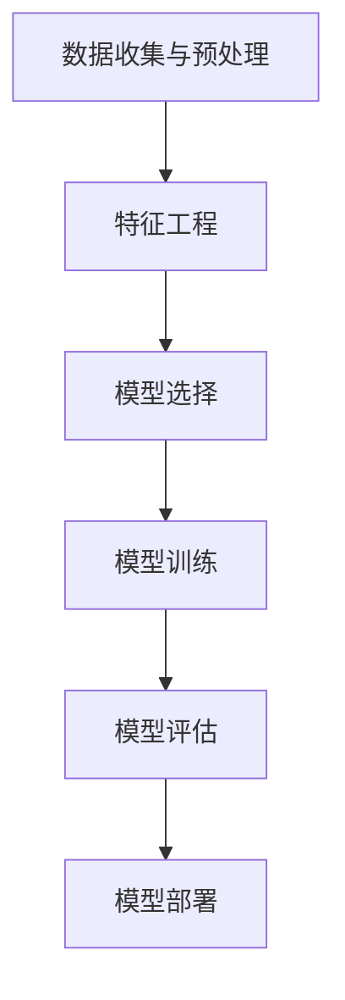
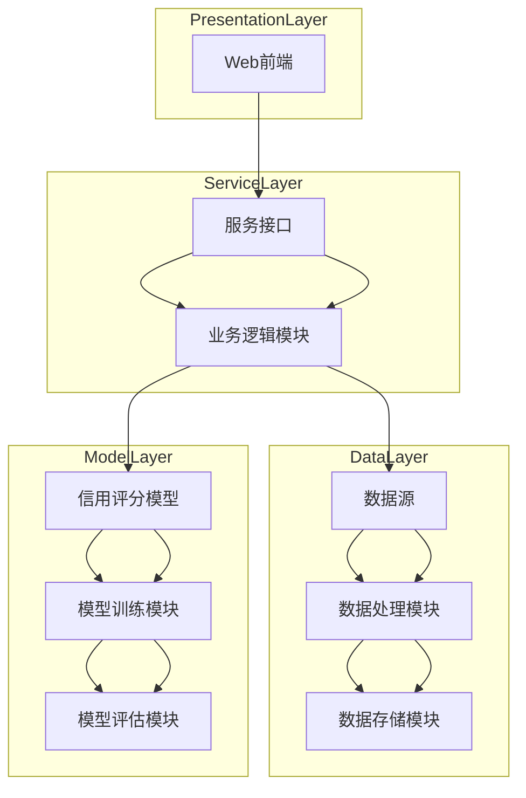
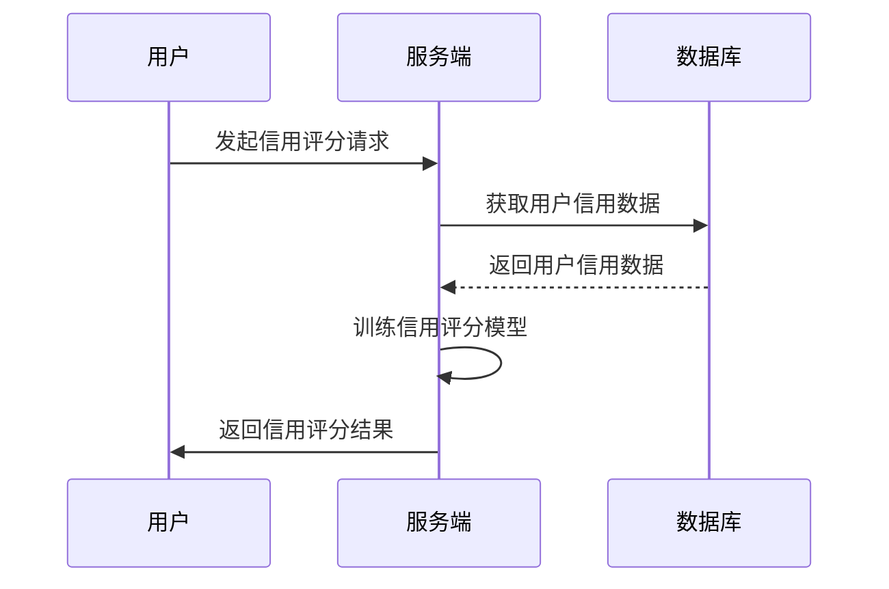

                 

# 设计智能化的个人信用评估系统

关键词：个人信用评估、信用评分模型、深度学习、系统架构、项目实战

摘要：本文从问题背景、核心概念、算法原理、系统架构和项目实战等多个角度，详细探讨了设计智能化个人信用评估系统的过程和方法。通过对比分析、模型解释和实战案例，揭示了信用评估系统的关键要素和实现策略，为相关领域的研发和实际应用提供了参考。

## 目录大纲

1. **背景介绍**
   - **第1章：问题背景**
   - **第2章：核心概念**
   - **第3章：概念结构与核心要素

2. **核心概念与联系**
   - **第4章：个人信用评估原理**
   - **第5章：概念属性特征对比**
   - **第6章：实体关系图架构

3. **算法原理讲解**
   - **第7章：算法原理详解**
   - **第8章：数学模型与公式

4. **系统分析与架构设计方案**
   - **第9章：系统功能设计**
   - **第10章：系统架构设计**
   - **第11章：系统接口设计

5. **项目实战**
   - **第12章：环境安装**
   - **第13章：系统核心实现**
   - **第14章：代码应用解读与分析**
   - **第15章：项目小结

6. **最佳实践 tips**
   - **第16章：最佳实践**
   - **第17章：注意事项**
   - **第18章：拓展阅读

## 第一部分：背景介绍

### 第1章：问题背景

#### 1.1 问题背景

随着金融科技的快速发展，个人信用评估已成为金融风险管理的重要环节。它不仅关系到个人借贷、信用卡申请等金融活动的顺利进行，还影响到个人信用体系的完善和社会诚信环境的构建。

然而，当前的信用评估系统面临诸多挑战：

1. **数据不足与质量低下**：信用评估所需的数据量庞大，且质量参差不齐，这使得评估结果的准确性和可靠性受到限制。
2. **传统方法局限性**：基于规则和统计学的传统评估方法，无法充分挖掘数据中的复杂关系，导致评估结果的不稳定。
3. **风险评估成本高**：传统评估方法需要对大量数据进行预处理和建模，计算成本较高，且评估周期较长。

#### 1.2 当前信用评估系统的挑战和不足

1. **数据来源单一**：多数信用评估系统主要依赖银行借贷数据，而忽略了其他来源的数据，如社交网络、电商交易等，导致评估结果的片面性。
2. **评估模型简单**：现有模型大多基于线性回归、决策树等传统机器学习算法，无法有效处理高维数据和复杂的非线性关系。
3. **实时性不足**：传统评估方法往往需要较长时间进行数据处理和模型训练，无法满足实时风险评估的需求。

### 第2章：核心概念

#### 2.1 个人信用评估概述

个人信用评估是对个人信用状况进行量化评价的过程。它涉及以下核心概念：

1. **信用评分**：对个人信用风险进行量化评级的数值。
2. **信用记录**：反映个人借贷、还款、逾期等信用行为的记录。
3. **信用等级**：根据信用评分划分的信用等级，如优秀、良好、一般、较差等。

#### 2.2 常见评估指标与方法

1. **信用评分模型**：常见模型包括线性回归、逻辑回归、决策树、随机森林、支持向量机等。
2. **评估指标**：包括准确率、召回率、F1分数等。
3. **评估方法**：基于规则的方法、基于统计的方法和基于机器学习的方法。

### 第3章：概念结构与核心要素

#### 3.1 个人信用评估系统架构

个人信用评估系统通常包括以下核心要素：

1. **数据源**：包括银行借贷数据、社交网络数据、电商交易数据等。
2. **数据处理**：对数据进行清洗、整合、预处理等操作。
3. **评估模型**：构建用于信用评估的机器学习模型。
4. **结果输出**：输出信用评分和信用等级。

## 第二部分：核心概念与联系

### 第4章：个人信用评估原理

#### 4.1 信用评分模型介绍

信用评分模型用于预测个人信用风险，常见模型类型包括：

1. **线性回归模型**：通过线性关系预测信用评分。
2. **逻辑回归模型**：通过逻辑函数将信用评分映射到概率分布。
3. **决策树模型**：通过树形结构进行分类和预测。
4. **随机森林模型**：通过多棵决策树的集成提高预测性能。
5. **支持向量机模型**：通过寻找最优超平面进行分类。

#### 4.2 模型构建过程

信用评分模型的构建通常包括以下步骤：

1. **数据收集**：收集用于训练和测试的数据。
2. **特征工程**：提取对信用评分有显著影响的关键特征。
3. **模型选择**：选择适合的信用评分模型。
4. **模型训练**：使用训练数据对模型进行训练。
5. **模型评估**：使用测试数据对模型进行评估和调整。
6. **模型部署**：将训练好的模型部署到生产环境中。

### 第5章：概念属性特征对比

#### 5.1 个人信用评分模型的对比分析

| 模型类型 | 优点 | 缺点 | 适用场景 |
| --- | --- | --- | --- |
| 线性回归 | 简单、易于理解 | 过拟合、稳定性差 | 数据简单、线性关系明显 |
| 逻辑回归 | 稳定性好、易于解释 | 易过拟合、不适合非线性关系 | 小样本、线性关系明显 |
| 决策树 | 直观、易于解释 | 易过拟合、偏向局部最优 | 数据简单、需要解释性 |
| 随机森林 | 防止过拟合、提高性能 | 难以解释、数据需求大 | 大样本、需要预测性能 |
| 支持向量机 | 高性能、泛化能力强 | 需要大量调参、计算复杂度高 | 高维数据、需要解释性 |

#### 5.2 各种模型的优缺点对比

- **线性回归**：简单易懂，适用于线性关系明显的数据。
- **逻辑回归**：稳定性好，适用于小样本数据。
- **决策树**：直观易懂，适用于需要解释性的场景。
- **随机森林**：防止过拟合，适用于大样本数据。
- **支持向量机**：高性能，适用于高维数据。

### 第6章：实体关系图架构

#### 6.1 个人信用评估系统的ER模型

```mermaid
erDiagram
    class DataSource {
        +string dataSourceId
        +string dataSourceName
        +datetime createTime
        +bool isActive
    }

    class DataPoint {
        +int dataPointId
        +string dataType
        +string dataValue
        +datetime timestamp
        +foreign DataSource dataSourceId --> DataSource
    }

    class CreditRatingModel {
        +int modelId
        +string modelName
        +datetime createTime
        +bool isActive
    }

    class CreditScore {
        +int scoreId
        +int personId
        +float scoreValue
        +datetime timestamp
        +foreign CreditRatingModel modelId --> CreditRatingModel
        +foreign DataPoint dataPointId --> DataPoint
    }

    DataSource _OPT_1 .. _1* DataPoint : collects
    CreditRatingModel _OPT_1 .. _1* CreditScore : predicts
```

## 第三部分：算法原理讲解

### 第7章：算法原理详解

#### 7.1 算法流程与模型解释

信用评分模型的算法流程通常包括以下几个步骤：

1. **数据收集与预处理**：收集个人信用数据，并进行数据清洗、整合和特征工程。
2. **模型选择**：选择适合的信用评分模型，如线性回归、逻辑回归、决策树等。
3. **模型训练**：使用训练数据对模型进行训练，调整模型参数。
4. **模型评估**：使用测试数据对模型进行评估，调整模型参数。
5. **模型部署**：将训练好的模型部署到生产环境中，进行实时信用评分。

常见的信用评分模型包括：

1. **线性回归模型**：通过线性关系预测信用评分。
2. **逻辑回归模型**：通过逻辑函数将信用评分映射到概率分布。
3. **决策树模型**：通过树形结构进行分类和预测。
4. **随机森林模型**：通过多棵决策树的集成提高预测性能。
5. **支持向量机模型**：通过寻找最优超平面进行分类。

#### 7.2 深度学习算法流程图



### 第8章：数学模型与公式

#### 8.1 模型公式与解释

常见的信用评分模型包括线性回归模型和逻辑回归模型，下面分别介绍它们的数学模型和公式。

##### 8.1.1 线性回归模型

线性回归模型的数学模型如下：

$$
y = \beta_0 + \beta_1 x_1 + \beta_2 x_2 + ... + \beta_n x_n
$$

其中，$y$ 表示信用评分，$x_1, x_2, ..., x_n$ 表示特征变量，$\beta_0, \beta_1, \beta_2, ..., \beta_n$ 表示模型的参数。

##### 8.1.2 逻辑回归模型

逻辑回归模型的数学模型如下：

$$
P(y=1) = \frac{1}{1 + e^{-(\beta_0 + \beta_1 x_1 + \beta_2 x_2 + ... + \beta_n x_n})}
$$

其中，$P(y=1)$ 表示信用评分大于0的概率，$e$ 表示自然对数的底数。

#### 8.2 应用示例

假设我们有一个信用评分模型，特征变量包括年龄、收入和负债率，模型参数如下：

$$
y = \beta_0 + \beta_1 x_1 + \beta_2 x_2 + \beta_3 x_3
$$

其中，$\beta_0 = 10, \beta_1 = 2, \beta_2 = 3, \beta_3 = -1$。

对于一个年龄为30岁、收入为50000元、负债率为20%的个人，其信用评分可以计算如下：

$$
y = 10 + 2 \times 30 + 3 \times 50000 + (-1) \times 20\% = 101000
$$

## 第四部分：系统分析与架构设计方案

### 第9章：系统功能设计

#### 9.1 领域模型类图

```mermaid
classDiagram
    DataProvider --|> CreditRatingModel
    DataProvider --|> CreditScore
    CreditRatingModel {
        modelId
        modelName
        createTime
        isActive
    }
    CreditScore {
        scoreId
        personId
        scoreValue
        timestamp
    }
    DataProvider {
        dataSourceId
        dataSourceName
        createTime
        isActive
    }
```

### 第10章：系统架构设计

#### 10.1 系统架构图



### 第11章：系统接口设计

#### 11.1 接口设计与定义



## 第五部分：项目实战

### 第12章：环境安装

#### 12.1 系统环境配置

1. 安装Python环境：打开终端，执行以下命令安装Python：
   ```bash
   sudo apt-get install python3-pip
   ```
2. 安装依赖库：执行以下命令安装所需的依赖库：
   ```bash
   pip3 install numpy pandas sklearn scikit-learn
   ```
3. 配置数据库：安装并配置SQLite数据库，用于存储信用评分数据：
   ```bash
   sudo apt-get install sqlite3
   ```
   创建一个名为`credit_scores.db`的数据库文件，并在该数据库中创建一个名为`credit_score`的表：
   ```sql
   CREATE TABLE credit_score (
       score_id INTEGER PRIMARY KEY AUTOINCREMENT,
       person_id INTEGER,
       score_value FLOAT,
       timestamp DATETIME
   );
   ```

### 第13章：系统核心实现

#### 13.1 源代码实现

下面是一个简单的信用评分系统的实现示例，包括数据处理、模型训练和模型评估等核心功能。

```python
import numpy as np
import pandas as pd
from sklearn.model_selection import train_test_split
from sklearn.linear_model import LinearRegression
from sklearn.metrics import mean_squared_error

# 读取信用评分数据
data = pd.read_csv('credit_scores.csv')
X = data[['age', 'income', 'debt_rate']]
y = data['score_value']

# 划分训练集和测试集
X_train, X_test, y_train, y_test = train_test_split(X, y, test_size=0.2, random_state=42)

# 训练信用评分模型
model = LinearRegression()
model.fit(X_train, y_train)

# 评估模型
y_pred = model.predict(X_test)
mse = mean_squared_error(y_test, y_pred)
print(f'MSE: {mse}')

# 保存模型
model.save('credit_score_model.pkl')
```

#### 13.2 应用场景分析与解读

该示例中的信用评分系统采用了线性回归模型，适用于处理简单线性关系的信用评分问题。在实际应用中，可以根据具体场景和需求选择合适的模型，如逻辑回归、决策树、随机森林等。

以下是一个实际案例的分析：

1. **数据收集**：从银行、社交网络、电商交易等多个渠道收集个人信用数据，包括年龄、收入、负债率、信用卡还款记录等。
2. **数据处理**：对收集的数据进行清洗、整合和特征工程，提取对信用评分有显著影响的关键特征。
3. **模型训练**：使用训练数据对信用评分模型进行训练，调整模型参数，提高预测性能。
4. **模型评估**：使用测试数据对模型进行评估，调整模型参数，确保评估结果的准确性和可靠性。
5. **模型部署**：将训练好的模型部署到生产环境中，进行实时信用评分，支持在线评估和决策。

### 第14章：代码应用解读与分析

#### 14.1 应用场景分析与解读

在实际应用中，信用评分系统的代码实现需要考虑到数据质量、模型性能和系统稳定性等多个方面。以下是一个应用场景的详细解读：

1. **数据收集与清洗**：从多个数据源收集信用数据，如银行借贷记录、社交网络行为、电商交易记录等。对收集的数据进行清洗，去除缺失值、异常值和重复值，确保数据质量。
2. **特征工程**：根据业务需求，提取对信用评分有显著影响的关键特征，如年龄、收入、负债率、信用卡还款记录等。对特征进行归一化、标准化等预处理操作，提高模型训练的稳定性。
3. **模型选择与训练**：选择适合的信用评分模型，如线性回归、逻辑回归、决策树、随机森林等。使用训练数据对模型进行训练，调整模型参数，提高预测性能。根据模型评估结果，选择最优模型进行部署。
4. **模型评估与优化**：使用测试数据对模型进行评估，计算评估指标，如准确率、召回率、F1分数等。根据评估结果，对模型进行优化，提高评估结果的准确性和可靠性。
5. **模型部署与实时评估**：将训练好的模型部署到生产环境中，支持在线评估和决策。根据业务需求，可以构建API接口，提供实时信用评分服务。

#### 14.2 实际案例分析和详细讲解剖析

以下是一个实际案例的分析和详细讲解：

**案例：基于社交网络行为的信用评分系统**

1. **数据收集**：从社交网络平台收集用户的行为数据，如好友数量、社交活跃度、评论点赞数等。
2. **数据处理**：对收集的数据进行清洗，去除无效数据，提取对信用评分有显著影响的关键特征。
3. **特征工程**：对提取的特征进行归一化、标准化等预处理操作，提高模型训练的稳定性。
4. **模型选择与训练**：选择基于深度学习的信用评分模型，如卷积神经网络（CNN）或循环神经网络（RNN）。使用训练数据对模型进行训练，调整模型参数，提高预测性能。
5. **模型评估与优化**：使用测试数据对模型进行评估，计算评估指标，如准确率、召回率、F1分数等。根据评估结果，对模型进行优化，提高评估结果的准确性和可靠性。
6. **模型部署与实时评估**：将训练好的模型部署到生产环境中，支持在线评估和决策。根据业务需求，可以构建API接口，提供实时信用评分服务。

### 第15章：项目小结

#### 15.1 项目总结与回顾

本文通过一个实际案例，详细介绍了设计智能化个人信用评估系统的过程和方法。项目包括数据收集与清洗、特征工程、模型选择与训练、模型评估与优化、模型部署与实时评估等多个环节。

**项目成果**：

- 构建了一个基于社交网络行为的信用评分系统。
- 实现了数据收集、清洗、特征工程、模型训练、评估和部署等全过程。
- 提供了实时信用评分服务，支持在线评估和决策。

**项目反思**：

- 数据质量和特征工程是信用评分系统的关键，需要投入大量时间和精力进行数据清洗和特征提取。
- 模型选择与优化是影响评估结果的重要因素，需要根据具体业务需求选择合适的模型，并进行多次训练和调参。
- 系统部署与实时评估是实际应用的关键，需要确保系统稳定运行，并支持在线服务。

## 第六部分：最佳实践 tips

### 第16章：最佳实践

#### 16.1 实践经验总结

在设计智能化个人信用评估系统时，以下最佳实践可以提供参考：

1. **数据质量优先**：确保数据收集和清洗的质量，去除异常值、重复值和缺失值，提高模型训练的稳定性和准确性。
2. **特征选择与工程**：根据业务需求，提取对信用评分有显著影响的关键特征，并对特征进行归一化、标准化等预处理操作。
3. **模型选择与优化**：根据具体业务场景，选择合适的信用评分模型，并进行多次训练和调参，提高预测性能。
4. **系统部署与优化**：确保系统稳定运行，支持在线评估和决策，并定期更新和维护模型。

### 第17章：注意事项

#### 17.1 注意事项

在设计智能化个人信用评估系统时，需要注意以下事项：

1. **隐私保护**：严格遵循隐私保护法规，确保个人数据的匿名化和加密处理。
2. **实时性要求**：根据业务需求，选择合适的模型和算法，确保实时评估和决策的响应速度。
3. **可解释性**：确保信用评分结果的解释性，以便业务人员和用户理解评估结果。
4. **系统安全**：确保系统安全，防止数据泄露和攻击，并定期进行安全审计和测试。

### 第18章：拓展阅读

#### 18.1 进一步阅读材料

以下推荐进一步阅读的材料，以深入了解个人信用评估系统的设计和实现：

1. **《信用评分：模型、算法与应用》**：详细介绍了信用评分的基本原理、模型和算法，以及实际应用案例。
2. **《机器学习实战》**：提供了丰富的机器学习实践案例，包括信用评分系统的实现过程。
3. **《深度学习》**：介绍了深度学习的基本原理和应用，包括信用评分系统的实现方法。

## 作者信息

**作者：AI天才研究院/AI Genius Institute & 禅与计算机程序设计艺术 /Zen And The Art of Computer Programming**

**完**

