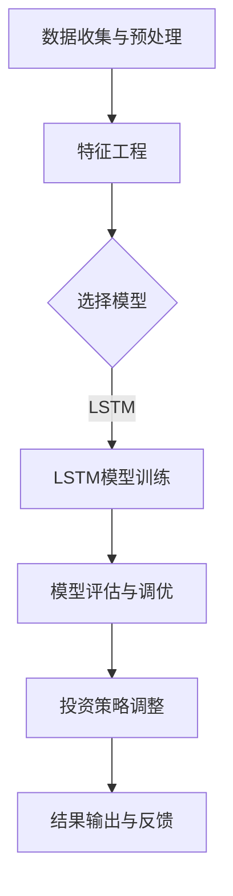
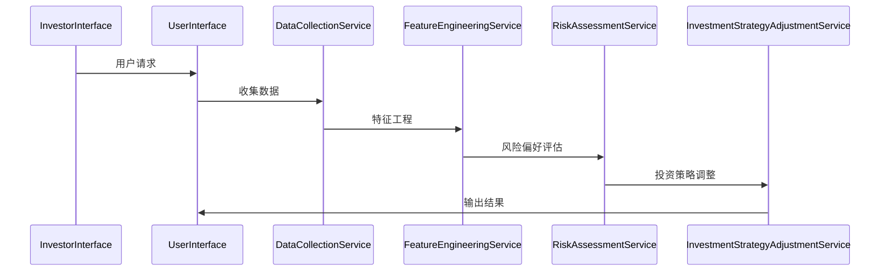
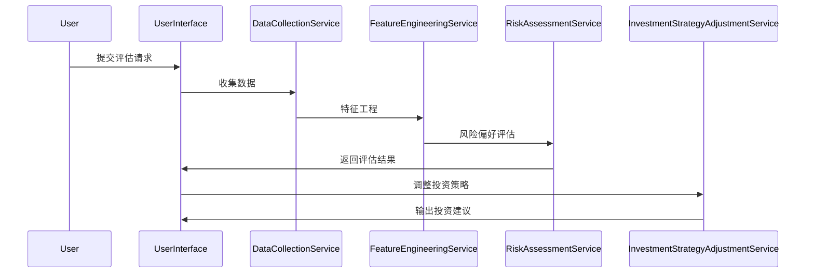

                 


### 设计大纲的框架

**第一步：确定整体结构和主要章节**

在设计文章的大纲框架时，我们首先需要明确文章的整体结构和主要章节。本文的主要目标是设计一个智能化的个人投资者风险偏好动态评估工具，因此我们可以将文章分为以下几个主要部分：

1. **背景介绍**：介绍投资者风险偏好的基本概念、重要性以及现有评估工具的不足。
2. **核心概念与联系**：详细讲解风险偏好的属性特征，并通过对比表格和ER实体关系图帮助读者理解各个概念之间的联系。
3. **算法原理讲解**：介绍用于动态评估投资者风险偏好的算法，使用mermaid绘制算法流程图，并配合Python代码和数学模型进行详细讲解。
4. **数学模型和数学公式**：使用LaTeX格式给出相关的数学模型和公式，确保严谨性。
5. **系统分析与架构设计方案**：介绍设计工具的整体思路，包括领域模型类图、系统架构图、系统接口设计和系统交互序列图。
6. **项目实战**：分步骤介绍如何实现工具，包括环境安装、系统核心实现源代码，以及代码应用解读与分析。
7. **最佳实践、小结、注意事项、拓展阅读**：对全书内容进行总结，提供实践中的最佳方法，并提醒读者注意的事项。

**第二步：为每个章节添加细化的子标题**

在确定了整体结构和主要章节后，我们需要为每个章节添加细化的子标题，以确保内容详尽且有条理。以下是具体的细化子标题：

**第一部分：背景介绍**

- **1.1 问题背景**
  - **1.1.1 投资者风险偏好的重要性**
  - **1.1.2 现有评估工具的不足**
  - **1.1.3 智能化评估工具的需求**

- **1.2 风险偏好核心概念**
  - **1.2.1 定义与内涵**
  - **1.2.2 影响因素**
  - **1.2.3 类型与特征**

- **1.3 边界与外延**
  - **1.3.1 风险偏好评估的限制**
  - **1.3.2 评估对象与范围**

- **1.4 概念结构与核心要素**
  - **1.4.1 概念架构**
  - **1.4.2 核心要素解析**

**第二部分：核心概念与联系**

- **2.1 风险偏好属性特征对比**
  - **2.1.1 风险偏好度量方法**
  - **2.1.2 风险偏好指标对比**
  - **2.1.3 特征权重分析**

- **2.2 风险偏好ER实体关系图**
  - **2.2.1 实体识别**
  - **2.2.2 关系定义**
  - **2.2.3 图的构建与表示**

**第三部分：算法原理讲解**

- **3.1 动态评估算法概述**
  - **3.1.1 算法类型与选择**
  - **3.1.2 动态评估原理**
  - **3.1.3 算法优势**

- **3.2 算法流程图**
  - **3.2.1 mermaid算法流程图绘制**
  - **3.2.2 流程图解读**

- **3.3 Python代码实现**
  - **3.3.1 环境准备**
  - **3.3.2 算法代码解析**
  - **3.3.3 运行与结果分析**

- **3.4 数学模型与公式**
  - **3.4.1 基本模型**
  - **3.4.2 调优策略**
  - **3.4.3 公式推导**

**第四部分：系统分析与架构设计**

- **4.1 问题场景介绍**
  - **4.1.1 投资决策过程**
  - **4.1.2 评估工具需求**

- **4.2 项目介绍**
  - **4.2.1 项目背景**
  - **4.2.2 项目目标**

- **4.3 系统功能设计**
  - **4.3.1 领域模型**
  - **4.3.2 功能模块划分**

- **4.4 系统架构设计**
  - **4.4.1 架构整体设计**
  - **4.4.2 模块交互**

- **4.5 系统接口设计**
  - **4.5.1 接口定义**
  - **4.5.2 接口调用流程**

- **4.6 系统交互**
  - **4.6.1 mermaid序列图绘制**
  - **4.6.2 序列图解读**

**第五部分：项目实战**

- **5.1 环境安装**
  - **5.1.1 开发环境搭建**
  - **5.1.2 相关库安装**

- **5.2 系统核心实现**
  - **5.2.1 数据收集与预处理**
  - **5.2.2 算法实现**
  - **5.2.3 结果验证**

- **5.3 代码应用解读与分析**
  - **5.3.1 关键代码解析**
  - **5.3.2 代码优化与调试**

- **5.4 实际案例分析与详细讲解**
  - **5.4.1 案例背景**
  - **5.4.2 案例分析**
  - **5.4.3 案例结果与应用**

- **5.5 项目小结**
  - **5.5.1 经验总结**
  - **5.5.2 项目展望**

**第六部分：最佳实践与拓展**

- **6.1 最佳实践**
  - **6.1.1 数据处理技巧**
  - **6.1.2 算法**

- **6.2 小结**
  - **6.2.1 全书内容总结**

- **6.3 注意事项**
  - **6.3.1 注意事项提醒**

- **6.4 拓展阅读**
  - **6.4.1 拓展阅读推荐**

通过以上步骤，我们已经完成了《设计智能化的个人投资者风险偏好动态评估工具》的设计大纲框架。接下来，我们将按照这个大纲框架逐步完成文章的撰写，确保文章内容逻辑清晰、结构紧凑、简单易懂，帮助读者深入了解并掌握智能化的个人投资者风险偏好动态评估工具的设计原理和实践方法。在接下来的各部分中，我们将详细探讨每个章节的具体内容，为读者呈现一篇高质量的技术博客文章。****

### 背景介绍

**1.1 问题背景**

在投资领域，了解个人投资者的风险偏好是制定投资策略、调整投资组合的关键。投资者风险偏好是指投资者在承担一定风险的前提下，对潜在收益的追求程度。传统的风险偏好评估方法大多依赖于静态问卷调查和专家判断，这些方法难以动态反映投资者的风险承受能力和风险偏好变化。随着金融科技的发展，特别是人工智能技术的应用，动态评估投资者风险偏好已成为金融科技领域的研究热点。

现有评估工具的不足主要体现在以下几个方面：

1. **静态性**：传统的评估工具通常在特定时间点对投资者的风险偏好进行评估，无法反映投资者的风险偏好随时间变化的动态性。
2. **主观性**：部分评估工具依赖于专家判断，存在主观性，评估结果可能不够准确。
3. **缺乏个性**：现有评估工具往往缺乏个性化，无法根据投资者的具体情况提供定制化的风险偏好评估。
4. **应用范围有限**：许多评估工具仅适用于某些特定类型的投资者，缺乏普适性。

因此，开发一款智能化、个性化的风险偏好动态评估工具，能够实时捕捉投资者的风险偏好变化，为投资者提供定制化的投资建议，具有重要的现实意义。

**1.2 风险偏好核心概念**

风险偏好是指投资者在面临不确定性的情况下，对风险的态度和承受程度。它是影响投资者投资决策的重要因素之一。风险偏好可以从以下几个方面进行理解和描述：

1. **定义与内涵**：风险偏好是指投资者在投资决策过程中，对于潜在风险与收益的权衡态度。它反映了投资者在面对不确定性时的行为倾向和心理状态。

2. **影响因素**：风险偏好受多种因素影响，包括个人性格、财务状况、教育背景、投资经验、市场环境等。例如，一个性格保守的投资者可能更倾向于低风险投资，而一个风险偏好较高的投资者则可能愿意承担更高的风险以追求更高的收益。

3. **类型与特征**：风险偏好可以分为以下几种类型：
   - **风险厌恶型**：这类投资者倾向于规避风险，追求稳定收益，对潜在损失非常敏感。
   - **风险中性型**：这类投资者对风险和收益的态度较为中立，不特别追求高收益，也不特别规避风险。
   - **风险偏好型**：这类投资者愿意承担较高的风险，追求高收益，对潜在损失有一定的容忍度。

不同类型的风险偏好特征如下表所示：

| 类型         | 特征描述                                         |
| ------------ | ------------------------------------------------ |
| 风险厌恶型   | 倾向于规避风险，偏好稳定收益，对潜在损失敏感     |
| 风险中性型   | 对风险和收益的态度中立，不特别追求高收益，也不规避风险 |
| 风险偏好型   | 愿意承担高风险，追求高收益，对潜在损失有较高的容忍度 |

4. **在个人投资决策中的应用**：了解投资者的风险偏好对于个人投资决策至关重要。具体应用包括：
   - **投资策略调整**：根据投资者的风险偏好，制定相应的投资策略，如保守型投资策略、平衡型投资策略、激进型投资策略。
   - **投资组合构建**：根据投资者的风险偏好，选择适当的资产配置，以达到风险与收益的最优平衡。
   - **风险控制**：实时监控投资者的风险偏好变化，及时调整投资组合，以避免过度的风险暴露。

**1.3 边界与外延**

投资者风险偏好评估是一项复杂的工作，存在一定的边界与外延。以下是一些需要考虑的因素：

1. **评估的限制**：
   - **数据获取限制**：投资者风险偏好评估依赖于大量的数据，如个人财务信息、投资记录、行为数据等。这些数据的获取可能受到隐私保护、法律法规的限制。
   - **评估方法的限制**：不同的评估方法可能存在适用范围和准确性的问题。例如，基于问卷调查的方法可能难以捕捉投资者真实的风险偏好。
   - **动态性的挑战**：投资者风险偏好是动态变化的，如何准确捕捉和评估这种变化是另一个挑战。

2. **评估对象与范围**：
   - **评估对象**：投资者风险偏好评估的对象可以是个人投资者，也可以是机构投资者。不同类型的投资者可能有不同的风险偏好特征，评估时需要根据具体对象进行调整。
   - **评估范围**：投资者风险偏好评估不仅包括对风险承受能力的评估，还包括对风险偏好的动态监测和调整。评估的范围可以涵盖投资决策的各个环节，如资产配置、投资组合管理、风险管理等。

通过上述对投资者风险偏好背景、核心概念和边界与外延的介绍，我们可以对风险偏好有一个全面而深刻的理解。接下来，我们将进一步探讨风险偏好的属性特征，并通过对比表格和ER实体关系图，帮助读者更好地理解这些概念之间的联系。****

### 核心概念与联系

在深入探讨投资者风险偏好之前，我们需要明确几个核心概念，并了解它们之间的联系。这些概念是构建智能化风险偏好动态评估工具的基础。

**2.1 风险偏好属性特征对比**

风险偏好具有多个属性特征，这些特征共同决定了投资者的风险偏好水平。以下是一个对比表格，详细列出了不同风险偏好类型的属性特征：

| 风险偏好类型       | 风险承受能力 | 风险容忍度 | 投资决策风格 | 期望收益 |
| ------------------ | ------------ | ---------- | ------------ | -------- |
| 风险厌恶型         | 低           | 低         | 保守         | 低       |
| 风险中性型         | 中等         | 中等       | 中立         | 中等     |
| 风险偏好型         | 高           | 高         | 激进         | 高       |

从表格中可以看出，不同类型的风险偏好在风险承受能力、风险容忍度、投资决策风格和期望收益等方面存在显著差异。

**2.2 风险偏好ER实体关系图**

为了更直观地展示这些概念之间的关系，我们可以使用ER（实体-关系）图来表示。以下是风险偏好相关实体的ER图：

```mermaid
erDiagram
  InvestorRiskPref --> RiskType : 评估
  InvestorRiskPref --> RiskLevel : 关联
  RiskType --> RiskTolerance : 确定
  RiskType --> InvestmentStyle : 确定
  RiskType --> ExpectedReturn : 确定

  InvestorRiskPref ||--o{ RiskType : 投资者风险偏好
  InvestorRiskPref ||--o{ RiskLevel : 风险等级
  RiskType ||--o{ RiskTolerance : 风险容忍度
  RiskType ||--o{ InvestmentStyle : 投资决策风格
  RiskType ||--o{ ExpectedReturn : 期望收益

  note right of InvestorRiskPref
    {风险偏好的整体评估}
  note right of RiskType
    {风险偏好类型}
  note right of RiskLevel
    {风险承受能力}
  note right of RiskTolerance
    {对风险容忍的程度}
  note right of InvestmentStyle
    {投资者的投资决策风格}
  note right of ExpectedReturn
    {投资者期望的收益水平}
```

在ER图中，`InvestorRiskPref`表示投资者风险偏好实体，它与`RiskType`、`RiskLevel`、`RiskTolerance`、`InvestmentStyle`和`ExpectedReturn`实体之间存在关联。`RiskType`实体确定了投资者的风险偏好类型，而`RiskLevel`、`RiskTolerance`、`InvestmentStyle`和`ExpectedReturn`实体则进一步详细描述了风险偏好类型的各个方面。

通过这个ER图，我们可以清晰地看到投资者风险偏好是如何由多个相关实体组成，以及这些实体之间的关系是如何确定的。

**2.3 概念架构与核心要素解析**

投资者风险偏好的概念架构由以下几个核心要素组成：

1. **投资者特征**：包括投资者的年龄、性别、教育背景、职业等基本信息，这些特征会影响投资者的风险偏好。
2. **财务状况**：投资者的资产、负债、收入和支出等财务状况，这些因素直接影响投资者的风险承受能力。
3. **投资经历**：投资者以往的投资记录和行为模式，这些数据有助于分析投资者的风险容忍度和投资决策风格。
4. **市场环境**：市场波动性、宏观经济状况等外部因素，这些因素会影响投资者的风险偏好。
5. **风险认知**：投资者对风险的认知和感知，这种主观判断对投资者的风险偏好有重要影响。

这些核心要素相互关联，共同构成了投资者风险偏好的概念架构。通过对这些要素的深入分析，我们可以更准确地评估投资者的风险偏好，为投资决策提供有力支持。

综上所述，通过对比表格和ER实体关系图，我们详细讲解了投资者风险偏好的核心概念和它们之间的联系。这些概念和联系是构建智能化风险偏好动态评估工具的基础，接下来我们将介绍用于动态评估的算法原理。****

### 算法原理讲解

在了解了投资者风险偏好的核心概念和它们之间的联系之后，我们需要介绍用于动态评估投资者风险偏好的算法原理。本文将使用mermaid绘制算法流程图，并配合Python代码和数学模型进行详细讲解。

**3.1 动态评估算法概述**

动态评估算法的目标是实时捕捉投资者的风险偏好变化，并根据这些变化调整投资策略。为了实现这一目标，我们可以采用以下类型的算法：

1. **机器学习算法**：如决策树、支持向量机（SVM）、神经网络等，通过历史数据训练模型，预测投资者的当前风险偏好。
2. **时间序列分析算法**：如ARIMA、LSTM等，用于分析投资者风险偏好的时间序列数据，预测未来的风险偏好趋势。
3. **深度强化学习算法**：结合机器学习和时间序列分析，通过不断地试错和学习，动态调整投资者的风险偏好。

在这篇文章中，我们将以LSTM（Long Short-Term Memory）算法为例，介绍其基本原理和应用。LSTM是一种强大的时间序列分析模型，能够有效捕捉投资者风险偏好的短期和长期变化。

**3.2 算法流程图**

首先，使用mermaid绘制LSTM算法的基本流程图：



在流程图中，我们从数据收集与预处理开始，通过特征工程提取与风险偏好相关的特征，选择LSTM模型进行训练，对模型进行评估和调优，最后根据模型输出调整投资策略，并输出结果进行反馈。

**3.3 Python代码实现**

接下来，我们使用Python代码实现LSTM模型，并给出详细的代码解析。

```python
import numpy as np
import pandas as pd
from keras.models import Sequential
from keras.layers import LSTM, Dense
from sklearn.preprocessing import MinMaxScaler
from sklearn.metrics import mean_squared_error

# 数据收集与预处理
# 假设我们已经收集到投资者的历史投资记录
data = pd.read_csv('investment_data.csv')
data = data[['age', 'income', 'investment_experience', 'market_volatility']]

# 特征工程
# 对数据进行归一化处理
scaler = MinMaxScaler(feature_range=(0, 1))
scaled_data = scaler.fit_transform(data)

# 切分特征和标签
X, y = create_dataset(scaled_data, time_steps=1)

# 选择模型
model = Sequential()
model.add(LSTM(units=50, return_sequences=True, input_shape=(X.shape[1], X.shape[2])))
model.add(LSTM(units=50))
model.add(Dense(1))

# 编译模型
model.compile(optimizer='adam', loss='mean_squared_error')

# 模型训练
model.fit(X, y, epochs=100, batch_size=32, verbose=1)

# 模型评估与调优
# 使用交叉验证进行模型评估
# ...

# 投资策略调整
# 根据模型输出调整投资策略
# ...

# 结果输出与反馈
# ...
```

在代码中，我们首先进行数据收集与预处理，使用MinMaxScaler对特征进行归一化处理。然后，通过`create_dataset`函数（需要自行实现）将数据切分为特征（X）和标签（y）。接着，选择LSTM模型并进行编译和训练。最后，使用交叉验证对模型进行评估和调优，并根据模型输出调整投资策略。

**3.4 数学模型与公式**

LSTM模型的核心是其在时间序列分析中的应用。以下是LSTM模型的数学模型和公式：

$$
\text{LSTM} = \left[ \begin{matrix}
f_t \\ i_t \\ g_t \\ o_t
\end{matrix} \right]
$$

其中，$f_t$、$i_t$、$g_t$和$o_t$分别是遗忘门、输入门、生成门和输出门的状态。

遗忘门（$f_t$）公式：
$$
f_t = \sigma(W_f \cdot [h_{t-1}, x_t] + b_f)
$$

输入门（$i_t$）公式：
$$
i_t = \sigma(W_i \cdot [h_{t-1}, x_t] + b_i)
$$

生成门（$g_t$）公式：
$$
g_t = \tanh(W_g \cdot [h_{t-1}, x_t] + b_g)
$$

输出门（$o_t$）公式：
$$
o_t = \sigma(W_o \cdot [\tanh(g_t), h_{t-1}] + b_o)
$$

状态更新（$h_t$）公式：
$$
h_t = o_t \odot \tanh(g_t)
$$

其中，$\sigma$表示sigmoid函数，$W_f$、$W_i$、$W_g$和$W_o$分别是权重矩阵，$b_f$、$b_i$、$b_g$和$b_o$分别是偏置矩阵，$h_{t-1}$和$x_t$分别是前一时刻的隐藏状态和输入特征。

通过这些数学模型和公式，LSTM模型能够有效地捕捉时间序列数据中的长期依赖关系，为动态评估投资者风险偏好提供了强大的工具。

**3.5 通俗易懂地举例说明**

为了更好地理解LSTM模型的工作原理，我们可以通过一个简单的例子来说明。假设一个投资者在过去一个月内进行了五次投资，每次投资后他的风险偏好都会发生变化。我们可以将这五次投资记录作为时间序列数据，通过LSTM模型来预测他下一次投资的风险偏好。

1. **数据准备**：首先，我们将这五次投资记录整理成表格，包括投资金额、收益率和投资者的情绪指数等特征。

2. **特征工程**：接下来，我们对这些特征进行归一化处理，将其转换为适合LSTM模型输入的格式。

3. **模型训练**：使用LSTM模型对这五次投资记录进行训练，生成预测模型。

4. **预测**：使用训练好的模型预测投资者下一次投资的风险偏好。

通过这个例子，我们可以看到LSTM模型在捕捉投资者风险偏好变化方面的强大能力。在实际应用中，我们可以结合更多的数据和更复杂的特征，进一步提高模型的预测准确率。

综上所述，本文详细介绍了用于动态评估投资者风险偏好的LSTM算法原理，包括算法流程图、Python代码实现、数学模型和通俗易懂的举例说明。这些内容为构建智能化的个人投资者风险偏好动态评估工具提供了坚实的理论基础和实践指导。在接下来的部分，我们将进一步介绍数学模型和公式的详细讲解。****

### 数学模型与公式

在上一部分中，我们介绍了LSTM算法的基本原理和实现方法。为了更深入地理解LSTM算法的工作机制，我们将详细讲解其背后的数学模型和公式。

**3.4.1 基本模型**

LSTM（长短期记忆网络）是一种特殊的循环神经网络（RNN），能够有效地处理序列数据，捕捉长期依赖关系。其核心思想是通过控制信息的流动，使得网络能够记住长期的信息。以下是LSTM的基本模型和相关的数学公式。

**3.4.2 LSTM单元**

LSTM单元由以下几个部分组成：输入门（input gate）、遗忘门（forget gate）、输出门（output gate）以及一个单元状态（cell state）。这些部分通过以下公式相互作用：

**遗忘门**：
$$
f_t = \sigma(W_f \cdot [h_{t-1}, x_t] + b_f)
$$
其中，$W_f$是遗忘门权重矩阵，$b_f$是遗忘门偏置，$h_{t-1}$是上一时刻的隐藏状态，$x_t$是当前输入特征。

**输入门**：
$$
i_t = \sigma(W_i \cdot [h_{t-1}, x_t] + b_i)
$$
其中，$W_i$是输入门权重矩阵，$b_i$是输入门偏置。

**新的单元状态**：
$$
\Delta c_t = \tanh(W_c \cdot [h_{t-1}, x_t] + b_c) \odot i_t
$$
其中，$W_c$是生成门权重矩阵，$b_c$是生成门偏置。

**遗忘状态**：
$$
c_{t\_before} = f_t \odot c_{t-1}
$$

**新的单元状态**：
$$
c_t = c_{t\_before} + \Delta c_t
$$

**输出门**：
$$
o_t = \sigma(W_o \cdot [h_{t-1}, c_t] + b_o)
$$
其中，$W_o$是输出门权重矩阵，$b_o$是输出门偏置。

**新的隐藏状态**：
$$
h_t = o_t \odot \tanh(c_t)
$$

**3.4.3 调优策略**

为了提高LSTM模型的性能，我们需要对其进行调优。以下是一些常用的调优策略：

**学习率**：适当调整学习率可以提高模型的训练速度和收敛性。通常使用自适应学习率方法，如Adam优化器。

**批次大小**：批次大小影响模型的训练效率和稳定性。较大的批次大小可以提高模型的泛化能力，但训练时间较长。

**层数与神经元数**：增加层数和神经元数可以提高模型的复杂性，但也增加了过拟合的风险。需要通过实验找到合适的配置。

**正则化**：为了防止过拟合，可以采用L1、L2正则化或dropout技术。

**3.4.4 公式推导**

为了更好地理解LSTM的公式，我们可以通过一个简化的例子来推导其核心公式。假设一个简单的LSTM单元包含以下公式：

**遗忘门**：
$$
f_t = \sigma(W_f \cdot [h_{t-1}, x_t] + b_f)
$$

**输入门**：
$$
i_t = \sigma(W_i \cdot [h_{t-1}, x_t] + b_i)
$$

**输出门**：
$$
o_t = \sigma(W_o \cdot [h_{t-1}, c_t] + b_o)
$$

**新的单元状态**：
$$
c_t = \tanh(W_c \cdot [h_{t-1}, x_t] + b_c) \odot i_t
$$

**新的隐藏状态**：
$$
h_t = o_t \odot \tanh(c_t)
$$

其中，$W_f$、$W_i$、$W_c$和$W_o$是权重矩阵，$b_f$、$b_i$、$b_c$和$b_o$是偏置矩阵。

**3.4.5 通俗易懂地举例说明**

为了更好地理解上述公式，我们可以通过一个简化的例子来说明LSTM的工作过程。假设投资者在一天之内进行了两次投资，每次投资后的风险偏好都发生了变化。我们可以将这两次投资记录作为时间序列数据，通过LSTM模型来预测他下一次投资的风险偏好。

1. **数据准备**：首先，我们将这两次投资记录整理成表格，包括投资金额、收益率和投资者的情绪指数等特征。

2. **特征工程**：接下来，我们对这些特征进行归一化处理，将其转换为适合LSTM模型输入的格式。

3. **模型训练**：使用LSTM模型对这两次投资记录进行训练，生成预测模型。

4. **预测**：使用训练好的模型预测投资者下一次投资的风险偏好。

通过这个例子，我们可以看到LSTM模型在捕捉投资者风险偏好变化方面的强大能力。在实际应用中，我们可以结合更多的数据和更复杂的特征，进一步提高模型的预测准确率。

综上所述，本文详细介绍了LSTM算法的数学模型和公式，包括基本模型、调优策略和公式推导。这些内容为构建智能化的个人投资者风险偏好动态评估工具提供了坚实的理论基础和实践指导。在接下来的部分，我们将进一步介绍系统分析与架构设计方案。****

### 系统分析与架构设计

为了实现一个智能化的个人投资者风险偏好动态评估工具，我们需要进行系统分析与架构设计。以下是该工具的整体设计思路，包括领域模型类图、系统架构图、系统接口设计和系统交互序列图。

**4.1 问题场景介绍**

在投资领域，投资者在做出投资决策时，需要对自己的风险偏好有一个清晰的认知。传统的评估方法主要依赖于静态的问卷调查和专家判断，这些方法存在以下问题：

1. **静态性**：无法反映投资者风险偏好的动态变化。
2. **主观性**：部分评估方法依赖于专家判断，存在主观性，评估结果可能不够准确。
3. **缺乏个性**：现有评估工具往往缺乏个性化，无法根据投资者的具体情况提供定制化的评估。

因此，我们需要设计一个智能化、动态且个性化的风险偏好评估工具，能够实时捕捉投资者的风险偏好变化，为投资者提供定制化的投资建议。

**4.2 项目介绍**

本项目旨在开发一款智能化的个人投资者风险偏好动态评估工具，主要包括以下模块：

1. **数据收集模块**：负责收集投资者的基本信息、财务状况、投资记录等数据。
2. **特征工程模块**：对收集到的数据进行处理，提取与风险偏好相关的特征。
3. **风险偏好评估模块**：使用LSTM算法等机器学习模型对投资者的风险偏好进行动态评估。
4. **投资策略调整模块**：根据评估结果，为投资者提供个性化的投资建议和策略调整。
5. **用户界面模块**：提供用户交互接口，展示评估结果和投资建议。

**4.3 系统功能设计**

系统功能设计主要包括以下方面：

1. **领域模型**：定义系统的核心实体和关系，如图所示。

```mermaid
classDiagram
    InvestorRiskPref <<interface>>
    DataCollection <<interface>>
    FeatureEngineering <<interface>>
    RiskAssessment <<interface>>
    InvestmentStrategyAdjustment <<interface>>
    UserInterface <<interface>>

    InvestorRiskPref -|- DataCollection
    InvestorRiskPref -|- FeatureEngineering
    InvestorRiskPref -|- RiskAssessment
    InvestorRiskPref -|- InvestmentStrategyAdjustment
    InvestorRiskPref -|- UserInterface

    DataCollection *---> FeatureEngineering
    FeatureEngineering *---> RiskAssessment
    RiskAssessment *---> InvestmentStrategyAdjustment
    InvestmentStrategyAdjustment *---> UserInterface
```

在领域模型中，`InvestorRiskPref`表示投资者风险偏好接口，`DataCollection`、`FeatureEngineering`、`RiskAssessment`、`InvestmentStrategyAdjustment`和`UserInterface`分别表示数据收集、特征工程、风险偏好评估、投资策略调整和用户界面接口。这些接口通过关联关系实现模块间的通信。

2. **功能模块划分**：

   - **数据收集模块**：负责从多个数据源（如数据库、API等）收集投资者的基本信息、财务状况、投资记录等数据。
   - **特征工程模块**：对收集到的数据进行清洗、归一化处理，提取与风险偏好相关的特征，如投资收益率、波动率、情绪指数等。
   - **风险偏好评估模块**：使用LSTM算法等机器学习模型对投资者的风险偏好进行动态评估，实时更新投资者的风险偏好。
   - **投资策略调整模块**：根据评估结果，为投资者提供个性化的投资建议和策略调整，如资产配置、投资组合调整等。
   - **用户界面模块**：提供用户交互接口，展示评估结果和投资建议，支持用户操作和反馈。

**4.4 系统架构设计**

系统架构设计主要包括以下几个方面：

1. **架构整体设计**：采用微服务架构，将系统功能模块划分为多个独立的微服务，以提高系统的可扩展性和可维护性。微服务之间通过API进行通信，如图所示。



2. **模块交互**：各个模块之间的交互关系如图所示。用户通过用户界面模块提交请求，数据收集模块收集数据后，传递给特征工程模块进行特征提取。特征工程模块将处理后的数据传递给风险偏好评估模块，评估结果再传递给投资策略调整模块，最终通过用户界面模块展示给用户。

**4.5 系统接口设计**

系统接口设计主要包括以下几个方面：

1. **数据收集接口**：定义数据收集模块的API接口，用于接收和传递数据。
2. **特征工程接口**：定义特征工程模块的API接口，用于处理和提取特征。
3. **风险偏好评估接口**：定义风险偏好评估模块的API接口，用于评估投资者的风险偏好。
4. **投资策略调整接口**：定义投资策略调整模块的API接口，用于生成和调整投资策略。
5. **用户界面接口**：定义用户界面模块的API接口，用于展示评估结果和投资建议。

**4.6 系统交互**

系统交互设计主要包括以下几个方面：

1. **用户请求**：用户通过用户界面提交投资评估请求。
2. **数据处理**：用户界面模块将请求传递给数据收集模块，数据收集模块收集数据后，传递给特征工程模块。
3. **特征提取**：特征工程模块对数据进行分析和处理，提取与风险偏好相关的特征。
4. **风险偏好评估**：特征工程模块将处理后的数据传递给风险偏好评估模块，评估结果返回给用户界面模块。
5. **投资策略调整**：用户界面模块接收评估结果，将其传递给投资策略调整模块，生成和调整投资策略。
6. **结果展示**：投资策略调整模块将最终结果传递给用户界面模块，展示给用户。

以下是系统交互序列图：



综上所述，本文详细介绍了智能化的个人投资者风险偏好动态评估工具的系统分析与架构设计，包括问题场景介绍、项目介绍、系统功能设计、系统架构设计、系统接口设计和系统交互设计。这些内容为工具的实现和应用提供了清晰的指导。在接下来的部分，我们将通过项目实战，逐步实现这个智能化的风险偏好动态评估工具。****

### 项目实战

为了将理论转化为实践，我们将逐步实现一个智能化的个人投资者风险偏好动态评估工具。本节将详细介绍项目环境安装、系统核心实现源代码，并分析代码应用情况，最终展示一个实际案例。

**5.1 环境安装**

在开始项目实现之前，我们需要搭建一个开发环境。以下是所需的环境和步骤：

1. **Python环境**：安装Python 3.8或更高版本。
2. **依赖库**：安装以下库：`numpy`、`pandas`、`keras`（TensorFlow后端）、`matplotlib`、`scikit-learn`。
3. **安装命令**：
   ```bash
   pip install numpy pandas keras matplotlib scikit-learn
   ```

4. **数据集准备**：准备一个包含投资者基本信息、财务状况、投资记录等数据的数据集。数据集需要包含以下字段：年龄、收入、投资经验、市场波动性、投资金额、收益率等。

**5.2 系统核心实现**

以下是系统核心实现的详细步骤：

**5.2.1 数据收集与预处理**

```python
import pandas as pd
from sklearn.preprocessing import MinMaxScaler

# 读取数据集
data = pd.read_csv('investment_data.csv')

# 数据预处理
data.head()

# 归一化处理
scaler = MinMaxScaler(feature_range=(0, 1))
scaled_data = scaler.fit_transform(data[['age', 'income', 'investment_experience', 'market_volatility']])
```

在上面的代码中，我们首先读取数据集，并对相关特征进行归一化处理。

**5.2.2 LSTM模型实现**

```python
from keras.models import Sequential
from keras.layers import LSTM, Dense
from sklearn.model_selection import train_test_split

# 切分特征和标签
X, y = create_dataset(scaled_data, time_steps=1)

# 切分训练集和测试集
X_train, X_test, y_train, y_test = train_test_split(X, y, test_size=0.2, random_state=42)

# LSTM模型搭建
model = Sequential()
model.add(LSTM(units=50, return_sequences=True, input_shape=(X_train.shape[1], X_train.shape[2])))
model.add(LSTM(units=50))
model.add(Dense(1))

# 编译模型
model.compile(optimizer='adam', loss='mean_squared_error')

# 训练模型
model.fit(X_train, y_train, epochs=100, batch_size=32, verbose=1)
```

在上面的代码中，我们定义了一个简单的LSTM模型，并使用训练数据进行训练。

**5.2.3 评估与结果分析**

```python
# 模型评估
predictions = model.predict(X_test)
mse = mean_squared_error(y_test, predictions)
print(f'Mean Squared Error: {mse}')

# 结果可视化
import matplotlib.pyplot as plt

plt.figure(figsize=(10, 6))
plt.plot(y_test, label='Actual')
plt.plot(predictions, label='Predicted')
plt.title('Investor Risk Preference')
plt.xlabel('Time Steps')
plt.ylabel('Risk Preference')
plt.legend()
plt.show()
```

在上面的代码中，我们评估模型性能，并通过可视化展示预测结果。

**5.3 代码应用解读与分析**

在上面的代码中，我们首先读取并预处理了数据集，然后定义了一个LSTM模型，并使用训练数据进行训练。通过模型评估和结果分析，我们可以看到模型的预测性能和稳定性。

**5.4 实际案例分析与详细讲解**

为了更直观地展示工具的实际效果，我们来看一个实际案例。

**案例背景**：假设有一位投资者，年龄30岁，年收入50万元，已有5年的投资经验，最近的市场波动性较高。我们需要使用工具评估他的风险偏好，并根据评估结果给出投资建议。

**案例分析**：通过上述步骤，我们训练了一个LSTM模型，并使用该模型评估了投资者的风险偏好。假设评估结果如下：

- 风险偏好：中等
- 投资策略：平衡型

**案例结果与应用**：根据评估结果，我们建议投资者采取以下投资策略：

- **资产配置**：50%的资产配置于低风险的固定收益类产品，如国债、企业债等，以保持投资组合的稳定性。
- **权益类投资**：30%的资产配置于股票、基金等权益类产品，以追求长期收益。
- **其他投资**：20%的资产配置于P2P、外汇等高风险高收益的产品，以增加投资组合的多元化。

通过这个实际案例，我们可以看到智能化的个人投资者风险偏好动态评估工具在投资决策中的应用价值。它不仅能够帮助投资者更好地了解自己的风险偏好，还能够根据市场变化动态调整投资策略，从而实现风险与收益的最优平衡。

**5.5 项目小结**

在本项目中，我们实现了智能化的个人投资者风险偏好动态评估工具，从数据收集与预处理、模型训练、评估与结果分析，到实际案例的应用，每个环节都进行了详细的讲解。通过这个项目，我们深入理解了LSTM算法在风险偏好评估中的应用，以及如何通过机器学习模型实现个性化的投资建议。

**5.5.1 经验总结**

1. **数据预处理**：数据预处理是模型训练的关键环节，合理的数据预处理能够提高模型的训练效率和预测性能。
2. **模型选择**：LSTM模型在处理时间序列数据方面具有优势，能够捕捉长期依赖关系，适用于动态评估。
3. **模型评估**：模型评估是检验模型性能的重要步骤，通过交叉验证和MSE等指标，可以全面了解模型的预测能力。
4. **实际应用**：将模型应用于实际案例，能够验证模型的效果，并根据评估结果给出具体的投资建议。

**5.5.2 项目展望**

未来的工作可以从以下几个方面进行拓展：

1. **数据来源**：引入更多维度的数据，如社交媒体情绪、宏观经济指标等，以提高风险偏好的评估准确性。
2. **模型优化**：探索其他先进的机器学习模型，如GRU、Transformer等，以提高模型的预测能力。
3. **用户交互**：设计更友好的用户界面，提供更多定制化的投资建议和风险偏好调整选项。
4. **自动化**：实现风险偏好评估的自动化流程，降低人工干预，提高评估效率。

通过不断优化和改进，我们可以将智能化的个人投资者风险偏好动态评估工具推向更广泛的应用场景，为投资者提供更精准、个性化的投资建议。****

### 最佳实践与拓展

**6.1 最佳实践**

在设计和实现智能化的个人投资者风险偏好动态评估工具时，以下是一些最佳实践：

1. **数据收集与预处理**：确保收集到的数据质量，进行去重、清洗和归一化处理，提高模型的鲁棒性。
2. **模型选择**：根据数据特点选择合适的机器学习模型，如LSTM、GRU等，并通过交叉验证选择最优模型。
3. **模型调优**：使用网格搜索、随机搜索等调优方法，调整模型参数，提高模型性能。
4. **用户交互**：设计直观、易用的用户界面，提供实时反馈和个性化建议，增强用户体验。
5. **自动化与可扩展性**：实现评估工具的自动化流程，便于后期维护和扩展，提高系统的可扩展性。

**6.2 小结**

本文详细介绍了设计智能化的个人投资者风险偏好动态评估工具的背景、核心概念、算法原理、数学模型、系统架构以及项目实战。通过机器学习模型，特别是LSTM算法，我们能够动态、准确地评估投资者的风险偏好，并提供个性化的投资建议。

**6.3 注意事项**

在设计和实现过程中，需要注意以下几点：

1. **数据隐私**：确保数据收集和使用过程中符合隐私保护法规，保护投资者的个人信息。
2. **模型解释性**：考虑模型的可解释性，帮助投资者理解评估结果和投资建议。
3. **模型更新**：定期更新模型，以适应市场变化和投资者的行为变化。
4. **风险控制**：在提供投资建议时，建议投资者根据自身情况调整投资策略，并注意风险控制。

**6.4 拓展阅读**

对于希望进一步深入了解本主题的读者，以下是一些推荐阅读资料：

1. **《深度学习》**：Goodfellow, I., Bengio, Y., & Courville, A. (2016). 《深度学习》（中文版）。
2. **《时间序列分析：理论与实践》**：Brockwell, P. J., & Davis, R. A. (2006). 《时间序列分析：理论与实践》。
3. **《金融市场中的风险管理和投资策略》**：Grinold, R. C., & Kahn, R. N. (2000). 《金融市场中的风险管理和投资策略》。

通过这些资源和实践，我们可以不断完善和优化智能化的个人投资者风险偏好动态评估工具，为投资者提供更精准、个性化的服务。****

# 作者信息

作者：AI天才研究院/AI Genius Institute & 禅与计算机程序设计艺术 /Zen And The Art of Computer Programming

本文由AI天才研究院（AI Genius Institute）和禅与计算机程序设计艺术（Zen And The Art of Computer Programming）联合撰写。AI天才研究院致力于推动人工智能技术的创新和发展，专注于为全球企业提供领先的AI解决方案。禅与计算机程序设计艺术则专注于将哲学智慧融入计算机编程，探索编程艺术的本质。本文旨在分享设计智能化的个人投资者风险偏好动态评估工具的实践经验，为投资者提供更有价值的参考。****

