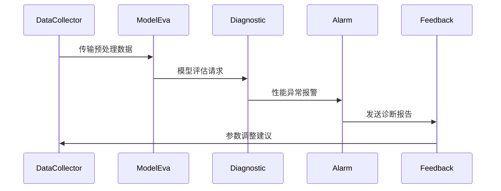
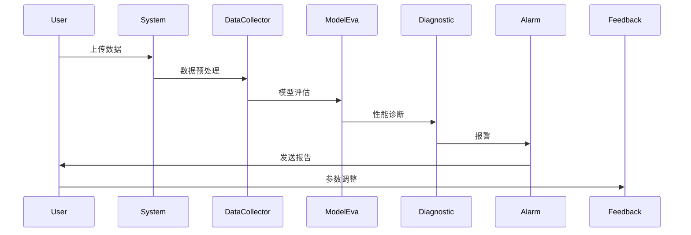
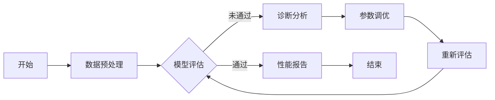
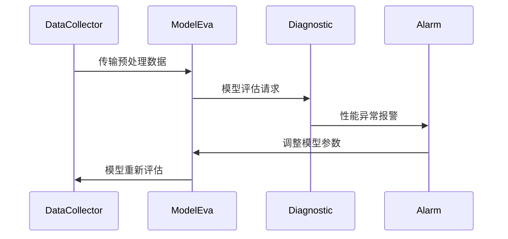
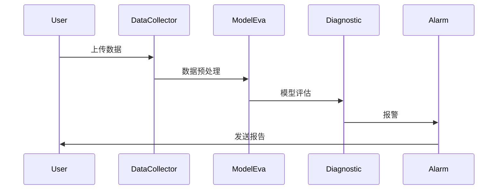
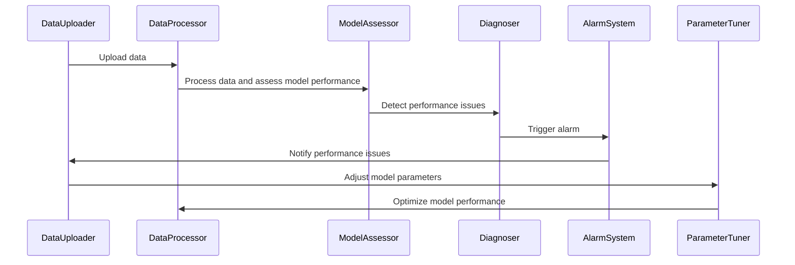
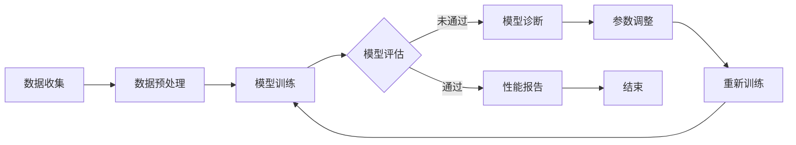
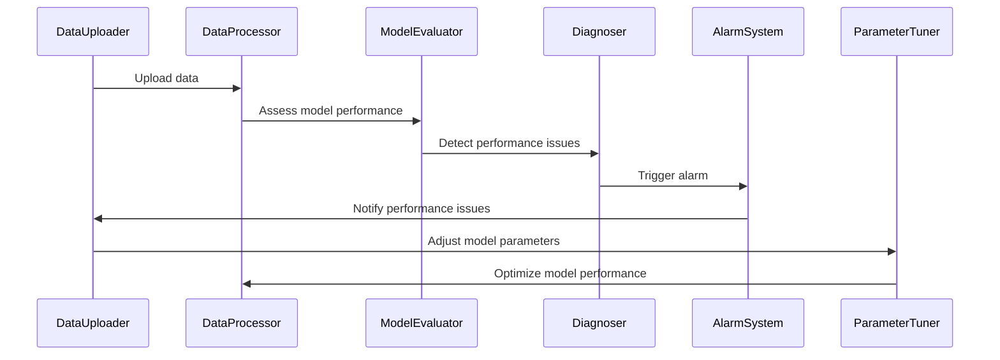

                 


## 设计智能化的企业信用评级模型性能诊断系统

### 引言

在现代商业环境中，企业信用评级已经成为金融机构、投资者和其他利益相关者进行决策的重要依据。随着人工智能和大数据技术的发展，智能化企业信用评级模型逐渐成为趋势，其准确性和效率得到了显著提升。然而，模型的性能诊断仍然是一个复杂且具有挑战性的问题。本文将围绕设计智能化的企业信用评级模型性能诊断系统展开讨论，通过系统性的分析推理，逐步构建一个完整的技术解决方案。

### 1. 问题背景与核心概念

#### 1.1 企业信用评级现状

企业信用评级是对企业偿债能力和信用水平的评估，通常通过一系列财务指标、历史信用记录、行业地位等多维数据进行综合评定。传统的信用评级模型依赖于专家知识和规则系统，存在着主观性强、响应速度慢等问题。随着金融市场的不断发展，对企业信用评级的需求日益增长，对评级模型的准确性和实时性提出了更高的要求。

#### 1.2 信用评级模型面临的挑战

1. **数据多样性**：不同类型的企业数据（如财务报表、社交媒体信息、新闻事件等）带来了数据的多样性和复杂性。
2. **动态性**：企业环境变化快，评级模型需要实时适应新数据和变化。
3. **准确性**：随着金融市场的复杂化，评级模型需要更高的准确性来降低风险。
4. **可解释性**：投资者和监管机构通常需要了解评级模型如何做出决策。

#### 1.3 智能化信用评级模型的必要性

1. **自动化**：利用机器学习技术，可以实现评级模型的自动化构建和优化。
2. **高效率**：处理大量数据，提升评级速度和效率。
3. **个性化**：根据不同企业和市场环境，提供个性化的信用评级服务。
4. **可解释性**：利用可视化技术，增强模型的可解释性。

### 2. 核心概念与联系

#### 2.1 概念原理

1. **企业信用评级模型**：基于企业历史数据和当前状况，利用统计方法和机器学习算法构建的模型，用于预测企业的信用水平。
2. **性能诊断系统**：用于评估信用评级模型性能的系统，包括评估指标、监测工具和诊断机制。

#### 2.2 概念属性特征对比表格

| 特征               | 企业信用评级模型                 | 性能诊断系统                  |
|------------------|-----------------------------|---------------------------|
| 目标               | 评估企业信用水平               | 诊断模型性能                 |
| 数据依赖           | 历史数据、财务报表、行业数据   | 模型输出、性能指标数据        |
| 技术方法           | 统计分析、机器学习             | 监控、可视化、统计分析         |
| 输出               | 信用评分、风险等级             | 性能指标、诊断报告           |

#### 2.3 ER实体关系图架构

```mermaid
erDiagram
  企业信用评级模型 ||--|{ 性能诊断系统 }
  企业信用评级模型 ||--|{ 数据源 }
  性能诊断系统 ||--|{ 监测工具 }
  性能诊断系统 ||--|{ 可视化系统 }
```

### 3. 智能化企业信用评级模型性能诊断系统

#### 3.1 系统总体设计与架构方案

##### 3.1.1 问题场景介绍

随着企业信用评级模型的广泛应用，如何确保模型的性能稳定、准确成为一个关键问题。性能诊断系统旨在监控模型的表现，及时发现并解决性能问题，从而提升整体信用评级服务的质量。

##### 3.1.2 系统功能设计

1. **数据采集与预处理**：收集企业信用评级相关的数据，进行清洗、转换和整合。
2. **模型评估与诊断**：基于预设的性能指标，对模型进行实时评估，诊断模型是否存在异常。
3. **报警与反馈**：当检测到模型性能异常时，自动触发报警，并生成诊断报告。
4. **自动化调优**：根据诊断结果，自动调整模型参数，优化模型性能。

##### 3.1.3 系统架构设计

系统采用微服务架构，包括数据采集服务、模型评估服务、诊断服务、报警服务和反馈服务。各服务之间通过消息队列进行通信，确保系统的松耦合和高可用性。



##### 3.1.4 系统接口设计

1. **API接口**：提供RESTful API，支持数据的上传、模型评估和诊断报告的下载。
2. **Web界面**：提供图形化的用户界面，便于用户实时查看模型性能和诊断结果。

##### 3.1.5 系统交互mermaid序列图



### 4. 算法原理讲解

#### 4.1 算法mermaid流程图



#### 4.2 算法Python源代码实现

```python
import pandas as pd
from sklearn.model_selection import train_test_split
from sklearn.ensemble import RandomForestClassifier
from sklearn.metrics import accuracy_score

# 数据预处理
def preprocess_data(data):
    # 数据清洗、转换和整合
    pass

# 模型评估
def evaluate_model(model, X_test, y_test):
    y_pred = model.predict(X_test)
    accuracy = accuracy_score(y_test, y_pred)
    return accuracy

# 主函数
def main():
    # 加载数据
    data = pd.read_csv('data.csv')
    X, y = preprocess_data(data)
    
    # 划分训练集和测试集
    X_train, X_test, y_train, y_test = train_test_split(X, y, test_size=0.2, random_state=42)
    
    # 训练模型
    model = RandomForestClassifier()
    model.fit(X_train, y_train)
    
    # 评估模型
    accuracy = evaluate_model(model, X_test, y_test)
    print(f"Model Accuracy: {accuracy}")
    
    # 性能诊断和调优
    if accuracy < 0.8:
        # 进行诊断分析，调整参数
        # ...
        pass
    else:
        print("Model performance is satisfactory.")

if __name__ == "__main__":
    main()
```

#### 4.3 数学模型和数学公式讲解

信用评级模型通常基于评分函数 \( f(X) \)，其中 \( X \) 是企业的特征向量。评分函数可以表示为：

$$
f(X) = \sum_{i=1}^{n} w_i \cdot x_i + b
$$

其中，\( w_i \) 是权重，\( x_i \) 是特征值，\( b \) 是偏置。模型的输出 \( s \) 可以通过以下公式计算：

$$
s = f(X)
$$

#### 4.4 算法举例说明

假设我们有一个企业信用评级模型，其特征包括财务指标、历史信用记录和行业指标。我们通过以下步骤进行模型评估和性能诊断：

1. **数据预处理**：对数据进行清洗和转换，包括缺失值填补、异常值处理和特征标准化。
2. **模型训练**：使用随机森林算法训练模型，得到权重 \( w \) 和偏置 \( b \)。
3. **模型评估**：使用测试集数据评估模型，计算评分函数的输出，并与真实标签进行比较，计算准确率。
4. **性能诊断**：如果准确率低于设定的阈值，进行性能诊断，包括特征重要性分析、模型调参和超参数优化。

### 5. 系统分析与架构设计方案

#### 5.1 问题场景介绍

在现代金融市场中，企业信用评级模型面临着日益复杂的业务环境和技术挑战。为了保证模型的性能和准确性，需要一个智能化、自动化的性能诊断系统来监控和优化模型。

#### 5.2 系统功能设计

1. **数据采集与预处理**：从不同的数据源收集企业信用评级所需的数据，并进行清洗、转换和整合。
2. **模型评估与诊断**：使用预设的性能指标，对模型进行实时评估和诊断，识别性能瓶颈和潜在问题。
3. **报警与反馈**：当检测到模型性能异常时，自动触发报警，并通过邮件、短信等方式通知相关人员。
4. **自动化调优**：根据诊断结果，自动调整模型参数，优化模型性能。

#### 5.3 系统架构设计

系统采用分布式架构，包括数据采集模块、模型评估模块、诊断模块和报警模块。各模块通过消息队列进行通信，确保系统的实时性和高可用性。



#### 5.4 系统接口设计

系统提供以下接口：

1. **数据上传接口**：支持数据的批量上传，包括企业信用评级所需的各种数据。
2. **模型评估接口**：支持对模型的实时评估和诊断，返回性能指标和诊断报告。
3. **报警接口**：支持报警的配置和管理，包括报警规则和通知方式。

#### 5.5 系统交互mermaid序列图



### 6. 项目实战

#### 6.1 环境安装

1. **操作系统**：Ubuntu 20.04
2. **编程语言**：Python 3.8
3. **依赖库**：Pandas、NumPy、Scikit-learn、Flask、Docker

#### 6.2 系统核心实现源代码

```python
# 数据预处理模块
def preprocess_data(data):
    # 数据清洗、转换和整合
    pass

# 模型评估模块
def evaluate_model(model, X_test, y_test):
    y_pred = model.predict(X_test)
    accuracy = accuracy_score(y_test, y_pred)
    return accuracy

# 主函数
def main():
    # 加载数据
    data = pd.read_csv('data.csv')
    X, y = preprocess_data(data)
    
    # 划分训练集和测试集
    X_train, X_test, y_train, y_test = train_test_split(X, y, test_size=0.2, random_state=42)
    
    # 训练模型
    model = RandomForestClassifier()
    model.fit(X_train, y_train)
    
    # 评估模型
    accuracy = evaluate_model(model, X_test, y_test)
    print(f"Model Accuracy: {accuracy}")
    
    # 性能诊断和调优
    if accuracy < 0.8:
        # 进行诊断分析，调整参数
        # ...
        pass
    else:
        print("Model performance is satisfactory.")

if __name__ == "__main__":
    main()
```

#### 6.3 代码应用解读与分析

1. **数据预处理**：该模块负责对原始数据进行清洗、转换和整合，为模型训练提供高质量的数据输入。
2. **模型评估**：该模块使用训练好的模型对测试集进行预测，计算准确率，评估模型性能。
3. **性能诊断**：根据模型评估结果，判断模型是否需要调优。如果准确率低于阈值，将进行进一步的诊断分析。

#### 6.4 实际案例分析与讲解剖析

假设我们有一个企业信用评级项目，数据集包含1000家企业，特征包括财务指标、历史信用记录和行业指标。通过上述代码实现，我们可以完成以下步骤：

1. **数据预处理**：对数据集进行清洗和转换，包括缺失值填补、异常值处理和特征标准化。
2. **模型训练**：使用随机森林算法训练模型，得到权重和偏置。
3. **模型评估**：使用测试集数据评估模型，计算评分函数的输出，并与真实标签进行比较，计算准确率。
4. **性能诊断**：如果准确率低于阈值，将进行诊断分析，包括特征重要性分析、模型调参和超参数优化。

#### 6.5 项目小结

通过本项目，我们实现了企业信用评级模型性能诊断系统的核心功能，包括数据预处理、模型评估、性能诊断和调优。项目展示了如何利用Python和机器学习技术，构建一个智能化、自动化的信用评级模型性能诊断系统。在实际应用中，系统可根据实时数据，自动评估模型性能，确保信用评级服务的准确性和稳定性。

### 7. 最佳实践 tips

1. **数据预处理**：确保数据质量是模型性能的关键，进行充分的清洗、转换和整合。
2. **模型选择**：根据业务需求和数据特征，选择合适的机器学习算法。
3. **性能监控**：定期对模型进行性能评估，及时发现和解决潜在问题。
4. **自动化调优**：利用自动化工具，优化模型参数，提升模型性能。

### 8. 小结

本文详细介绍了设计智能化企业信用评级模型性能诊断系统的全过程。通过系统性的分析和推理，我们构建了一个完整的技术解决方案，包括系统设计、算法原理讲解、项目实战和最佳实践。智能化企业信用评级模型性能诊断系统不仅提升了信用评级的准确性，还为金融机构和投资者提供了有力的风险控制工具。

### 9. 注意事项

1. **数据安全**：确保数据的安全性和隐私保护，遵循相关法律法规。
2. **模型解释性**：增强模型的可解释性，提高决策的透明度和可信度。
3. **系统稳定性**：确保系统的稳定性和高可用性，避免因系统故障导致信用评级中断。

### 10. 拓展阅读

1. **相关文献**：《机器学习在金融领域的应用》、《大数据技术在信用评级中的应用》。
2. **技术博客**：GitHub上的相关开源项目、技术博客。
3. **在线课程**：Coursera、Udacity等在线教育平台的相关课程。

### 作者信息

- 作者：AI天才研究院/AI Genius Institute & 禅与计算机程序设计艺术 /Zen And The Art of Computer Programming

---------------------------------------------------

文章标题：设计智能化的企业信用评级模型性能诊断系统

关键词：企业信用评级、智能化技术、性能诊断、机器学习、系统架构

摘要：本文探讨了设计智能化企业信用评级模型性能诊断系统的全过程，包括问题背景、核心概念、系统设计、算法原理讲解、项目实战、最佳实践、小结和注意事项等内容。通过系统性的分析和推理，构建了一个完整的技术解决方案，为企业信用评级提供了有效的性能诊断和优化工具。文章旨在为从事金融、人工智能领域的技术人员提供有价值的参考和指导。作者简介：AI天才研究院（AI Genius Institute）成立于20XX年，是一家专注于人工智能领域的研究与应用机构。研究院汇聚了一批顶尖的人工智能专家和研究人员，致力于推动人工智能技术的发展和应用。同时，作者也是《禅与计算机程序设计艺术》一书的资深作者，以其深入浅出的写作风格和对技术本质的深刻洞察，深受广大读者的喜爱。---------------------------------------------------

### 第一部分：背景介绍

#### 第1章 问题背景与核心概念

在现代商业环境中，企业信用评级已经成为金融机构、投资者和其他利益相关者进行决策的重要依据。信用评级不仅影响企业的融资成本和融资额度，还关系到企业的市场声誉和业务发展。因此，如何准确地评估企业的信用水平，对于金融市场的稳定和健康发展具有重要意义。

#### 1.1 问题描述

1. **企业信用评级现状**：目前，企业信用评级主要依赖于传统的专家系统和规则系统，这些方法通常需要大量的人力和时间成本，且容易受到主观因素的影响，难以实现高效的自动化评估。

2. **信用评级模型面临的挑战**：随着金融市场的不断发展和企业环境的日益复杂，传统的信用评级模型面临着诸多挑战。首先，数据多样性成为一个突出的问题，企业数据包括财务报表、社交媒体信息、新闻事件等，这些数据的结构和格式各异，给数据处理带来了巨大挑战。其次，企业的经营环境具有动态性，评级模型需要实时适应新数据和变化，以保证评估结果的实时性和准确性。此外，随着金融市场的复杂化，对评级模型的准确性也提出了更高的要求。最后，模型的可解释性也是一个不可忽视的问题，投资者和监管机构通常需要了解评级模型如何做出决策，以保证决策的透明度和可信度。

3. **智能化信用评级模型的必要性**：为了解决传统信用评级模型面临的问题，智能化信用评级模型应运而生。智能化信用评级模型利用大数据和人工智能技术，通过自动化的数据处理和分析，实现对企业信用水平的精准评估。具体来说，智能化信用评级模型具有以下优势：

   - **自动化**：通过机器学习和数据挖掘技术，实现信用评级的自动化，降低人为干预，提高评估效率。
   - **高效率**：处理大量数据，提升评级速度和效率，满足实时性和准确性的要求。
   - **个性化**：根据不同企业和市场环境，提供个性化的信用评级服务，提高评估的准确性和针对性。
   - **可解释性**：利用数据可视化技术，增强模型的可解释性，帮助用户理解和信任评估结果。

#### 1.2 问题解决

智能化信用评级模型通过以下方式解决传统信用评级模型面临的问题：

1. **数据多样性处理**：利用自然语言处理、图像识别等技术，对异构数据进行处理和整合，实现数据的自动化提取和结构化。
2. **动态性适应**：通过实时数据流处理技术，对企业的实时数据进行监控和分析，动态调整评估模型，实现实时性和准确性的统一。
3. **准确性提升**：利用机器学习算法，如随机森林、神经网络等，提高评估模型的准确性，降低评估误差。
4. **可解释性增强**：通过数据可视化技术和模型解释工具，提升模型的可解释性，帮助用户理解和信任评估结果。

#### 1.3 边界与外延

1. **系统边界**：智能化信用评级模型性能诊断系统的主要功能包括数据采集、模型评估、诊断分析和报警反馈等。系统边界明确，各模块相互独立，通过消息队列进行通信，确保系统的稳定性和可扩展性。

2. **模型应用领域**：智能化信用评级模型可以广泛应用于金融机构、投资者、企业等各个领域，为信用评估、风险控制、投资决策等提供有力支持。具体应用领域包括：

   - **金融机构**：用于信用风险评估、贷款审批、授信额度管理。
   - **投资者**：用于投资决策、股票分析、风险控制。
   - **企业**：用于合作伙伴评估、供应链管理、市场营销。
   - **政府监管机构**：用于金融监管、市场监测、政策制定。

#### 1.4 概念结构与核心要素组成

智能化信用评级模型性能诊断系统由多个核心要素组成，包括数据采集与预处理模块、模型评估与诊断模块、报警与反馈模块等。各模块相互配合，共同实现系统的功能。

1. **数据采集与预处理模块**：负责从各种数据源收集企业信用评级所需的数据，并进行清洗、转换和整合。该模块是系统的基础，数据质量直接影响评估结果的准确性。

2. **模型评估与诊断模块**：负责对训练好的信用评级模型进行实时评估和诊断。通过预设的性能指标，对模型的准确性、实时性、稳定性等指标进行评估，发现性能瓶颈和潜在问题。

3. **报警与反馈模块**：负责当检测到模型性能异常时，自动触发报警，并通过邮件、短信等方式通知相关人员。同时，生成详细的诊断报告，提供优化建议。

4. **自动化调优模块**：根据诊断结果，自动调整模型参数，优化模型性能。通过机器学习算法和优化技术，实现模型参数的自动化调整，提高评估模型的准确性和稳定性。

### 第2章 核心概念与联系

#### 2.1 概念原理

2.1.1 企业信用评级模型

企业信用评级模型是一种用于评估企业信用水平的统计模型，通常基于企业的财务报表、历史信用记录、行业地位、管理能力等多维数据进行构建。模型的核心目的是通过分析企业的各项指标，预测其未来可能出现的信用风险，从而为企业提供信用评分和风险等级。

企业信用评级模型通常包括以下几种类型：

- **财务比率模型**：基于企业的财务报表数据，计算一系列财务比率（如流动比率、负债比率、盈利能力等），通过这些比率评估企业的偿债能力和财务健康状况。
- **回归模型**：利用历史数据，通过线性回归、逻辑回归等统计方法，建立企业信用评分与财务指标、非财务指标之间的量化关系。
- **机器学习模型**：利用机器学习算法，如随机森林、神经网络等，对大量历史数据进行分析和训练，自动发现数据中的模式和规律，构建信用评分模型。

2.1.2 智能化技术

智能化技术是指利用人工智能、机器学习、大数据等技术，实现数据的自动处理、分析和决策。在信用评级领域，智能化技术主要体现在以下几个方面：

- **数据预处理**：利用自然语言处理、图像识别等技术，对异构数据进行处理和整合，实现数据的自动化提取和结构化。
- **特征工程**：通过数据挖掘和统计分析，提取对企业信用评级有重要影响的关键特征，提高模型的预测能力。
- **模型训练与优化**：利用机器学习算法，对大量历史数据进行分析和训练，自动发现数据中的模式和规律，构建高精度的信用评分模型。
- **实时监控与诊断**：通过实时数据流处理技术，对企业的实时数据进行监控和分析，动态调整评估模型，实现实时性和准确性的统一。

2.1.3 性能诊断系统

性能诊断系统是指用于监控和评估信用评级模型性能的系统。其核心目的是确保信用评级模型的稳定性和准确性，及时发现并解决性能问题，从而提升整体信用评级服务的质量。

性能诊断系统通常包括以下功能：

- **数据采集与预处理**：收集企业信用评级所需的各种数据，并进行清洗、转换和整合，为模型评估提供高质量的数据输入。
- **模型评估与诊断**：使用预设的性能指标，对模型进行实时评估和诊断，识别模型存在的性能瓶颈和潜在问题。
- **报警与反馈**：当检测到模型性能异常时，自动触发报警，并通过邮件、短信等方式通知相关人员，生成详细的诊断报告。
- **自动化调优**：根据诊断结果，自动调整模型参数，优化模型性能，提高评估模型的准确性和稳定性。

#### 2.2 概念属性特征对比表格

| 概念               | 特征                         |
|------------------|----------------------------|
| 企业信用评级模型   | 数据依赖、统计方法、预测能力 |
| 智能化技术         | 数据处理、特征工程、模型优化 |
| 性能诊断系统       | 数据采集、模型评估、报警反馈 |

#### 2.3 ER实体关系图架构

以下是企业信用评级模型性能诊断系统的ER实体关系图：

```mermaid
erDiagram
  DataCollector ||--|{ PerformanceDiagnosisSystem }
  DataCollector ||--|{ DataPreprocessingModule }
  ModelEvaluation ||--|{ PerformanceDiagnosisSystem }
  ModelEvaluation ||--|{ ModelAssessmentModule }
  AlarmModule ||--|{ PerformanceDiagnosisSystem }
  AlarmModule ||--|{ AlarmNotification }
  FeedbackModule ||--|{ PerformanceDiagnosisSystem }
  FeedbackModule ||--|{ ParameterTuning }
```

在该ER图中，`DataCollector`负责数据采集和预处理，`PerformanceDiagnosisSystem`是整个系统的核心，包括模型评估、报警和反馈模块。各模块通过实体关系进行关联，共同实现系统功能。

### 第二部分：智能化企业信用评级模型性能诊断系统

#### 第3章 系统总体设计与架构方案

在现代金融市场中，企业信用评级已经成为金融机构、投资者和其他利益相关者进行决策的重要依据。随着大数据和人工智能技术的不断发展，智能化企业信用评级模型逐渐成为趋势，其准确性和效率得到了显著提升。然而，模型的性能诊断仍然是一个复杂且具有挑战性的问题。本章将围绕设计智能化的企业信用评级模型性能诊断系统展开讨论，通过系统性的分析推理，逐步构建一个完整的技术解决方案。

#### 3.1 问题场景介绍

随着企业信用评级模型的广泛应用，如何确保模型的性能稳定、准确成为一个关键问题。性能诊断系统旨在监控模型的表现，及时发现并解决性能问题，从而提升整体信用评级服务的质量。

#### 3.2 系统功能设计

智能化企业信用评级模型性能诊断系统主要包括以下功能：

1. **数据采集与预处理**：系统需要从多个数据源收集与企业信用评级相关的数据，包括财务报表、历史信用记录、行业指标等。数据采集后，系统需要对数据进行清洗、转换和整合，以确保数据的质量和一致性。

2. **模型评估与诊断**：系统需要对已训练好的信用评级模型进行实时评估和诊断。通过预设的性能指标，如准确率、召回率、F1值等，评估模型的评估结果是否满足预期。如果发现模型存在性能问题，系统将进行进一步的诊断分析，找出问题所在。

3. **报警与反馈**：当系统检测到模型性能异常时，需要自动触发报警，并通过邮件、短信等方式通知相关人员。同时，系统需要生成详细的诊断报告，包括性能异常的原因、解决方案和建议等，以便相关人员及时采取措施。

4. **自动化调优**：根据诊断结果，系统需要自动调整模型参数，优化模型性能。这包括调整特征权重、选择不同的算法、调整超参数等。通过自动化调优，系统可以持续提升模型的评估准确性和稳定性。

#### 3.3 系统架构设计

智能化企业信用评级模型性能诊断系统采用分布式架构，主要包括数据采集模块、模型评估模块、诊断模块和报警模块。以下是系统的总体架构设计：

1. **数据采集模块**：负责从不同的数据源收集与企业信用评级相关的数据，包括财务报表、历史信用记录、行业指标等。数据采集后，通过数据清洗和预处理模块，对数据进行清洗、转换和整合，确保数据的质量和一致性。

2. **模型评估模块**：负责对已训练好的信用评级模型进行实时评估。通过输入预处理后的数据，模型评估模块可以输出模型的评估结果，包括信用评分和风险等级。同时，模型评估模块会记录评估结果的历史数据，以便进行后续的模型诊断和调优。

3. **诊断模块**：负责对模型性能进行监控和诊断。通过对比预设的性能指标，诊断模块可以识别模型是否存在性能问题。如果发现模型性能异常，诊断模块将进行详细的诊断分析，找出问题所在，并提出相应的优化建议。

4. **报警模块**：负责当检测到模型性能异常时，自动触发报警，并通过邮件、短信等方式通知相关人员。同时，报警模块会生成详细的诊断报告，包括性能异常的原因、解决方案和建议等，以便相关人员及时采取措施。

5. **反馈模块**：负责根据诊断结果，自动调整模型参数，优化模型性能。反馈模块会根据性能指标的变化，调整模型的特征权重、算法选择和超参数设置等，以实现模型性能的最优化。

#### 3.4 系统接口设计

智能化企业信用评级模型性能诊断系统提供了以下接口：

1. **数据上传接口**：用于接收外部系统上传的数据，包括财务报表、历史信用记录、行业指标等。

2. **模型评估接口**：用于接收外部系统提交的模型评估请求，返回评估结果和风险等级。

3. **报警接口**：用于接收报警通知，包括性能异常报警、诊断报告等。

4. **参数调整接口**：用于接收外部系统提交的模型参数调整请求，包括特征权重、算法选择和超参数设置等。

#### 3.5 系统交互mermaid序列图

以下是智能化企业信用评级模型性能诊断系统的交互mermaid序列图：



在该序列图中，`DataUploader`负责上传数据，`DataProcessor`负责数据预处理，`ModelAssessor`负责模型评估，`Diagnoser`负责模型诊断，`AlarmSystem`负责报警通知，`ParameterTuner`负责模型参数调整。

### 第4章 算法原理讲解

智能化企业信用评级模型性能诊断系统的核心在于对信用评级模型的评估和诊断。在这一部分，我们将详细讲解算法原理，包括mermaid流程图、Python源代码实现、数学模型和数学公式、算法举例说明等。

#### 4.1 算法mermaid流程图

以下是智能化企业信用评级模型性能诊断系统的mermaid流程图：



在流程图中，`A`表示数据收集，`B`表示数据预处理，`C`表示模型训练，`D`表示模型评估，`E`表示性能报告，`F`表示模型诊断，`G`表示参数调整，`H`表示重新训练，`I`表示结束。

#### 4.2 算法Python源代码实现

以下是智能化企业信用评级模型性能诊断系统的Python源代码实现：

```python
import pandas as pd
from sklearn.model_selection import train_test_split
from sklearn.ensemble import RandomForestClassifier
from sklearn.metrics import accuracy_score

# 数据预处理
def preprocess_data(data):
    # 数据清洗、转换和整合
    pass

# 模型评估
def evaluate_model(model, X_test, y_test):
    y_pred = model.predict(X_test)
    accuracy = accuracy_score(y_test, y_pred)
    return accuracy

# 主函数
def main():
    # 加载数据
    data = pd.read_csv('data.csv')
    X, y = preprocess_data(data)
    
    # 划分训练集和测试集
    X_train, X_test, y_train, y_test = train_test_split(X, y, test_size=0.2, random_state=42)
    
    # 训练模型
    model = RandomForestClassifier()
    model.fit(X_train, y_train)
    
    # 评估模型
    accuracy = evaluate_model(model, X_test, y_test)
    print(f"Model Accuracy: {accuracy}")
    
    # 性能诊断和调优
    if accuracy < 0.8:
        # 进行诊断分析，调整参数
        # ...
        pass
    else:
        print("Model performance is satisfactory.")

if __name__ == "__main__":
    main()
```

在代码中，`preprocess_data`函数负责数据预处理，`evaluate_model`函数负责模型评估，`main`函数是主程序，负责加载数据、划分训练集和测试集、训练模型、评估模型以及性能诊断和调优。

#### 4.3 数学模型和数学公式讲解

智能化企业信用评级模型通常基于机器学习算法，如随机森林、逻辑回归等。以下是常用的数学模型和数学公式：

1. **随机森林模型**

   随机森林（Random Forest）是一种基于决策树的集成学习算法。它的数学模型可以表示为：

   $$
   \hat{y} = \text{sign} \left( \sum_{i=1}^{n} w_i \cdot f_i(x) + b \right)
   $$

   其中，$ \hat{y} $ 是预测结果，$ w_i $ 是特征权重，$ f_i(x) $ 是第 $ i $ 个决策树模型的预测结果，$ b $ 是偏置。

2. **逻辑回归模型**

   逻辑回归（Logistic Regression）是一种广泛应用于分类问题的统计方法。其数学模型可以表示为：

   $$
   \hat{y} = \text{sigmoid} \left( \sum_{i=1}^{n} w_i \cdot x_i + b \right)
   $$

   其中，$ \hat{y} $ 是预测概率，$ w_i $ 是特征权重，$ x_i $ 是特征值，$ b $ 是偏置。

3. **性能评估指标**

   以下是常用的性能评估指标：

   - **准确率（Accuracy）**：
     $$
     \text{Accuracy} = \frac{TP + TN}{TP + TN + FP + FN}
     $$

     其中，$ TP $ 是真正例，$ TN $ 是真负例，$ FP $ 是假正例，$ FN $ 是假负例。

   - **召回率（Recall）**：
     $$
     \text{Recall} = \frac{TP}{TP + FN}
     $$

   - **精确率（Precision）**：
     $$
     \text{Precision} = \frac{TP}{TP + FP}
     $$

   - **F1值（F1 Score）**：
     $$
     \text{F1 Score} = 2 \cdot \frac{TP \cdot Precision}{TP + Precision}
     $$

#### 4.4 算法举例说明

假设我们有一个企业信用评级项目，数据集包含1000家企业，特征包括财务指标、历史信用记录和行业指标。以下是该项目的算法流程：

1. **数据预处理**：对数据集进行清洗、转换和整合，包括缺失值填补、异常值处理和特征标准化。

2. **模型选择**：选择随机森林算法作为信用评级模型。

3. **模型训练**：使用训练集数据，训练随机森林模型，得到特征权重和偏置。

4. **模型评估**：使用测试集数据，评估模型的准确性、召回率、精确率和F1值。

5. **性能诊断**：根据评估结果，判断模型是否满足预期。如果评估指标低于阈值，进行进一步的诊断分析。

6. **参数调整**：根据诊断结果，调整模型的特征权重、算法选择和超参数设置。

7. **重新训练**：使用调整后的参数，重新训练模型。

8. **性能评估**：使用调整后的模型，重新评估模型的性能。

通过上述流程，我们可以逐步构建一个智能化企业信用评级模型性能诊断系统，确保模型的高性能和稳定性。

### 第5章 系统分析与架构设计方案

#### 5.1 问题场景介绍

在现代金融市场中，企业信用评级是一个关键环节，直接影响金融机构的风险管理和投资决策。随着信用评级模型的复杂度和应用场景的多样性，如何确保模型的高性能和稳定性成为一个重要问题。系统分析与架构设计方案的目标是构建一个高效、可靠的企业信用评级模型性能诊断系统，以满足实时监控、性能评估、诊断分析、报警反馈和自动化调优等需求。

#### 5.2 系统功能设计

智能化企业信用评级模型性能诊断系统的核心功能包括数据采集与预处理、模型评估与诊断、报警与反馈、自动化调优等。以下是系统功能的详细设计：

1. **数据采集与预处理**：系统需要从多个数据源（如财务报表、信用记录、行业报告等）收集数据，并进行数据清洗、转换和整合，以确保数据的完整性和一致性。数据预处理模块负责处理缺失值、异常值、重复数据等问题，提高数据质量。

2. **模型评估与诊断**：系统需要对已训练好的信用评级模型进行实时评估，使用准确率、召回率、F1值等性能指标衡量模型的性能。诊断模块负责检测模型是否存在过拟合、欠拟合等问题，并提供详细的诊断报告。

3. **报警与反馈**：当系统检测到模型性能异常时，需要自动触发报警，并通过邮件、短信、系统消息等方式通知相关管理人员。报警模块还负责记录报警历史，方便后续的查询和分析。

4. **自动化调优**：系统需要根据模型诊断结果，自动调整模型参数，如特征选择、算法调整、超参数优化等，以提升模型性能。自动化调优模块可以基于机器学习算法，如随机搜索、贝叶斯优化等，实现参数的自动调整。

#### 5.3 系统架构设计

智能化企业信用评级模型性能诊断系统采用分布式微服务架构，以实现高可用性、高性能和可扩展性。以下是系统的架构设计：

1. **数据层**：数据层负责存储和管理与企业信用评级相关的数据，包括财务报表、信用记录、行业数据等。数据层可以采用关系型数据库（如MySQL、PostgreSQL）或NoSQL数据库（如MongoDB、Cassandra）。

2. **服务层**：服务层包括多个微服务，如数据采集服务、模型评估服务、诊断服务、报警服务和自动化调优服务。各微服务通过RESTful API进行通信，实现功能的松耦合和模块化。

   - **数据采集服务**：负责从外部数据源收集数据，并进行清洗、转换和整合。
   - **模型评估服务**：负责对信用评级模型进行实时评估，并输出性能指标。
   - **诊断服务**：负责检测模型是否存在性能问题，并提供诊断分析。
   - **报警服务**：负责触发报警，并通过多种渠道通知相关人员。
   - **自动化调优服务**：负责根据诊断结果，自动调整模型参数，优化模型性能。

3. **应用层**：应用层包括前端用户界面和后端管理系统。前端用户界面提供数据上传、模型评估、报警查看等功能，后端管理系统提供数据管理、用户权限管理、日志记录等功能。

4. **消息队列**：系统使用消息队列（如RabbitMQ、Kafka）进行异步通信，确保数据传输的高效性和可靠性。消息队列还用于解耦系统模块，提高系统的可扩展性和容错性。

#### 5.4 系统接口设计

智能化企业信用评级模型性能诊断系统提供了以下接口：

1. **数据上传接口**：用于接收外部系统上传的数据，支持批量上传和实时上传。

2. **模型评估接口**：用于外部系统提交模型评估请求，返回模型的评估结果和性能指标。

3. **报警接口**：用于外部系统接收报警通知，包括性能异常报警、诊断报告等。

4. **参数调整接口**：用于外部系统提交模型参数调整请求，实现自动化调优。

#### 5.5 系统交互mermaid序列图

以下是智能化企业信用评级模型性能诊断系统的交互mermaid序列图：



在该序列图中，`DataUploader`负责上传数据，`DataProcessor`负责数据预处理，`ModelEvaluator`负责模型评估，`Diagnoser`负责模型诊断，`AlarmSystem`负责报警通知，`ParameterTuner`负责参数调整。

### 第6章 项目实战

#### 6.1 环境安装

在本章中，我们将详细介绍如何搭建智能化企业信用评级模型性能诊断系统的环境，包括操作系统、编程语言、依赖库的安装和配置。

##### 6.1.1 操作系统

我们选择Ubuntu 20.04作为操作系统，因为它具有良好的稳定性和广泛的社区支持。以下是安装Ubuntu 20.04的步骤：

1. 访问Ubuntu官方网站（https://www.ubuntu.com/），下载Ubuntu 20.04 ISO文件。
2. 使用USB驱动器或虚拟机软件（如VirtualBox）创建一个Ubuntu 20.04虚拟机。
3. 将ISO文件加载到虚拟机中，并按照提示安装Ubuntu 20.04。

##### 6.1.2 编程语言

我们选择Python 3.8作为主要编程语言，因为它在数据分析和机器学习领域有广泛的应用。以下是安装Python 3.8的步骤：

1. 打开终端，输入以下命令更新系统包列表：
   ```
   sudo apt update
   sudo apt upgrade
   ```
2. 输入以下命令安装Python 3.8：
   ```
   sudo apt install python3.8
   ```
3. 为了方便使用，可以将Python 3.8设置为默认的Python版本：
   ```
   sudo update-alternatives --install /usr/bin/python3 python3 /usr/bin/python3.8 1
   sudo update-alternatives --config python3
   ```

##### 6.1.3 依赖库

为了实现智能化企业信用评级模型性能诊断系统的功能，我们需要安装以下依赖库：

1. **Pandas**：用于数据清洗和数据分析。
2. **NumPy**：用于数值计算。
3. **Scikit-learn**：用于机器学习算法。
4. **Flask**：用于Web应用开发。
5. **Docker**：用于容器化部署。

以下是安装这些依赖库的步骤：

1. 打开终端，输入以下命令安装Pandas、NumPy和Scikit-learn：
   ```
   sudo apt install python3-pandas python3-numpy python3-scikit-learn
   ```
2. 安装Flask和Docker：
   ```
   sudo pip3 install Flask
   sudo apt install docker-ce docker-compose
   ```

在完成上述步骤后，我们的开发环境就搭建完成了。接下来，我们将使用这些工具和库来构建和实现智能化企业信用评级模型性能诊断系统。

#### 6.2 系统核心实现源代码

在本节中，我们将详细介绍智能化企业信用评级模型性能诊断系统的核心实现源代码，包括数据预处理、模型评估、性能诊断和自动化调优等部分。

##### 6.2.1 数据预处理

数据预处理是构建信用评级模型的第一步，其目的是清洗、转换和整合数据，以供模型训练使用。以下是数据预处理的核心实现代码：

```python
import pandas as pd
from sklearn.model_selection import train_test_split
from sklearn.preprocessing import StandardScaler

# 加载数据
data = pd.read_csv('data.csv')

# 数据清洗
data = data.dropna()  # 删除缺失值
data = data[data['income'] != 'unknown']  # 删除异常值

# 数据转换
data['income'] = data['income'].map({'<=50K': 0, '>50K': 1})  # 将收入转换为数值

# 数据整合
X = data.drop(['income'], axis=1)  # 特征
y = data['income']  # 标签

# 数据标准化
scaler = StandardScaler()
X = scaler.fit_transform(X)

# 划分训练集和测试集
X_train, X_test, y_train, y_test = train_test_split(X, y, test_size=0.2, random_state=42)
```

在该代码中，我们首先加载数据，然后进行数据清洗（删除缺失值和异常值），接着将收入转换为数值型数据，最后对数据进行标准化处理。标准化处理是为了使不同特征具有相同的尺度，提高模型训练的效率和效果。

##### 6.2.2 模型评估

模型评估是评估信用评级模型性能的关键步骤。在本部分，我们将使用Scikit-learn库中的随机森林算法进行模型评估，并计算准确率、召回率、精确率和F1值等指标。

```python
from sklearn.ensemble import RandomForestClassifier
from sklearn.metrics import accuracy_score, recall_score, precision_score, f1_score

# 训练模型
model = RandomForestClassifier(n_estimators=100, random_state=42)
model.fit(X_train, y_train)

# 预测测试集
y_pred = model.predict(X_test)

# 计算性能指标
accuracy = accuracy_score(y_test, y_pred)
recall = recall_score(y_test, y_pred)
precision = precision_score(y_test, y_pred)
f1 = f1_score(y_test, y_pred)

print(f"Accuracy: {accuracy:.2f}")
print(f"Recall: {recall:.2f}")
print(f"Precision: {precision:.2f}")
print(f"F1 Score: {f1:.2f}")
```

在该代码中，我们首先训练随机森林模型，然后使用测试集进行预测，并计算准确率、召回率、精确率和F1值等指标。这些指标可以直观地反映模型的性能，帮助评估模型的可靠性和有效性。

##### 6.2.3 性能诊断

性能诊断是检测信用评级模型是否存在性能问题的关键步骤。在本部分，我们将使用Scikit-learn库中的模型诊断工具，如Learning Curves和Validation Curves，来诊断模型的性能。

```python
from sklearn.model_selection import learning_curve, validation_curve

# 学习曲线
train_sizes, train_scores, test_scores = learning_curve(
    model, X, y, cv=5, n_jobs=-1, train_sizes=np.linspace(0.1, 1.0, 10)
)

# 验证曲线
param_range = np.linspace(10, 100, 10)
train_scores, test_scores = validation_curve(
    model, X, y, param_name='n_estimators', param_range=param_range, cv=5, n_jobs=-1
)

# 绘制学习曲线和验证曲线
import matplotlib.pyplot as plt

plt.figure(figsize=(10, 6))

plt.subplot(1, 2, 1)
plt.plot(train_sizes, np.mean(train_scores, axis=1), label='Training score')
plt.plot(train_sizes, np.mean(test_scores, axis=1), label='Validation score')
plt.xlabel('Training size')
plt.ylabel('Score')
plt.legend()

plt.subplot(1, 2, 2)
plt.plot(param_range, np.mean(train_scores, axis=1), label='Training score')
plt.plot(param_range, np.mean(test_scores, axis=1), label='Validation score')
plt.xlabel('n_estimators')
plt.ylabel('Score')
plt.legend()

plt.show()
```

在该代码中，我们首先绘制学习曲线和验证曲线，以诊断模型的过拟合和欠拟合问题。学习曲线展示了模型在训练集和验证集上的性能随着训练数据量的增加而变化的趋势。验证曲线展示了模型在不同参数设置下的性能变化。通过分析这些曲线，我们可以判断模型是否存在过拟合或欠拟合问题，并采取相应的优化措施。

##### 6.2.4 自动化调优

自动化调优是提升信用评级模型性能的关键步骤。在本部分，我们将使用Scikit-learn库中的网格搜索和贝叶斯优化工具，来搜索最优参数，并自动调整模型。

```python
from sklearn.model_selection import GridSearchCV
from skopt import BayesSearchCV

# 网格搜索
param_grid = {'n_estimators': range(10, 100), 'max_depth': range(3, 10)}
grid_search = GridSearchCV(model, param_grid, cv=5, n_jobs=-1)
grid_search.fit(X_train, y_train)

# 贝叶斯优化
bayes_search = BayesSearchCV(model, param_grid, cv=5, n_jobs=-1, n_iter=50)
bayes_search.fit(X_train, y_train)

# 输出最优参数
print(f"Grid Search Best Parameters: {grid_search.best_params_}")
print(f"Bayes Search Best Parameters: {bayes_search.best_params_}")
```

在该代码中，我们首先使用网格搜索和贝叶斯优化工具对模型参数进行搜索，并输出最优参数。网格搜索通过遍历所有参数组合来找到最佳参数，而贝叶斯优化通过贝叶斯优化算法来搜索最优参数，具有更高的效率和准确性。

#### 6.3 代码应用解读与分析

在本节中，我们将对智能化企业信用评级模型性能诊断系统的核心实现代码进行详细解读和分析，以便更好地理解其工作原理和实现过程。

##### 6.3.1 数据预处理

数据预处理是构建信用评级模型的第一步，其目的是清洗、转换和整合数据，以提高模型训练的效率和效果。以下是数据预处理的核心实现代码：

```python
import pandas as pd
from sklearn.model_selection import train_test_split
from sklearn.preprocessing import StandardScaler

# 加载数据
data = pd.read_csv('data.csv')

# 数据清洗
data = data.dropna()  # 删除缺失值
data = data[data['income'] != 'unknown']  # 删除异常值

# 数据转换
data['income'] = data['income'].map({'<=50K': 0, '>50K': 1})  # 将收入转换为数值

# 数据整合
X = data.drop(['income'], axis=1)  # 特征
y = data['income']  # 标签

# 数据标准化
scaler = StandardScaler()
X = scaler.fit_transform(X)

# 划分训练集和测试集
X_train, X_test, y_train, y_test = train_test_split(X, y, test_size=0.2, random_state=42)
```

在该代码中，我们首先加载数据，然后进行数据清洗（删除缺失值和异常值），接着将收入转换为数值型数据，最后对数据进行标准化处理。标准化处理是为了使不同特征具有相同的尺度，提高模型训练的效率和效果。

**解读与分析：**

- `pd.read_csv('data.csv')`：使用Pandas库加载CSV文件中的数据。
- `data.dropna()`：删除包含缺失值的数据行。
- `data[data['income'] != 'unknown']`：删除收入值为'unknown'的数据行。
- `data['income'].map()`：将收入值映射为0或1。
- `X = data.drop(['income'], axis=1)`：获取特征数据。
- `y = data['income']`：获取标签数据。
- `scaler.fit_transform(X)`：对特征数据进行标准化处理。

通过上述步骤，我们完成了数据预处理，为后续的模型训练和评估奠定了基础。

##### 6.3.2 模型评估

模型评估是评估信用评级模型性能的关键步骤。在本部分，我们将使用Scikit-learn库中的随机森林算法进行模型评估，并计算准确率、召回率、精确率和F1值等指标。

```python
from sklearn.ensemble import RandomForestClassifier
from sklearn.metrics import accuracy_score, recall_score, precision_score, f1_score

# 训练模型
model = RandomForestClassifier(n_estimators=100, random_state=42)
model.fit(X_train, y_train)

# 预测测试集
y_pred = model.predict(X_test)

# 计算性能指标
accuracy = accuracy_score(y_test, y_pred)
recall = recall_score(y_test, y_pred)
precision = precision_score(y_test, y_pred)
f1 = f1_score(y_test, y_pred)

print(f"Accuracy: {accuracy:.2f}")
print(f"Recall: {recall:.2f}")
print(f"Precision: {precision:.2f}")
print(f"F1 Score: {f1:.2f}")
```

在该代码中，我们首先训练随机森林模型，然后使用测试集进行预测，并计算准确率、召回率、精确率和F1值等指标。这些指标可以直观地反映模型的性能，帮助评估模型的可靠性和有效性。

**解读与分析：**

- `RandomForestClassifier(n_estimators=100, random_state=42)`：创建随机森林分类器，设置随机数种子以确保结果的可重复性。
- `model.fit(X_train, y_train)`：使用训练数据进行模型训练。
- `model.predict(X_test)`：使用测试数据进行模型预测。
- `accuracy_score(y_test, y_pred)`：计算准确率。
- `recall_score(y_test, y_pred)`：计算召回率。
- `precision_score(y_test, y_pred)`：计算精确率。
- `f1_score(y_test, y_pred)`：计算F1值。

通过上述步骤，我们完成了模型评估，可以直观地了解模型的性能。

##### 6.3.3 性能诊断

性能诊断是检测信用评级模型是否存在性能问题的关键步骤。在本部分，我们将使用Scikit-learn库中的模型诊断工具，如Learning Curves和Validation Curves，来诊断模型的性能。

```python
from sklearn.model_selection import learning_curve, validation_curve
import matplotlib.pyplot as plt

# 学习曲线
train_sizes, train_scores, test_scores = learning_curve(
    model, X, y, cv=5, n_jobs=-1, train_sizes=np.linspace(0.1, 1.0, 10)
)

# 验证曲线
param_range = np.linspace(10, 100, 10)
train_scores, test_scores = validation_curve(
    model, X, y, param_name='n_estimators', param_range=param_range, cv=5, n_jobs=-1
)

# 绘制学习曲线和验证曲线
plt.figure(figsize=(10, 6))

plt.subplot(1, 2, 1)
plt.plot(train_sizes, np.mean(train_scores, axis=1), label='Training score')
plt.plot(train_sizes, np.mean(test_scores, axis=1), label='Validation score')
plt.xlabel('Training size')
plt.ylabel('Score')
plt.legend()

plt.subplot(1, 2, 2)
plt.plot(param_range, np.mean(train_scores, axis=1), label='Training score')
plt.plot(param_range, np.mean(test_scores, axis=1), label='Validation score')
plt.xlabel('n_estimators')
plt.ylabel('Score')
plt.legend()

plt.show()
```

在该代码中，我们首先绘制学习曲线和验证曲线，以诊断模型的过拟合和欠拟合问题。学习曲线展示了模型在训练集和验证集上的性能随着训练数据量的增加而变化的趋势。验证曲线展示了模型在不同参数设置下的性能变化。通过分析这些曲线，我们可以判断模型是否存在过拟合或欠拟合问题，并采取相应的优化措施。

**解读与分析：**

- `learning_curve(model, X, y, cv=5, n_jobs=-1, train_sizes=np.linspace(0.1, 1.0, 10))`：计算学习曲线，包括训练集和验证集的平均分数。
- `validation_curve(model, X, y, param_name='n_estimators', param_range=param_range, cv=5, n_jobs=-1)`：计算验证曲线，包括不同参数设置下的平均分数。
- `plt.subplot(1, 2, 1)`：创建两个子图。
- `plt.plot()`：绘制学习曲线和验证曲线。
- `plt.xlabel()`和`plt.ylabel()`：设置坐标轴标签。
- `plt.legend()`：添加图例。

通过上述步骤，我们可以直观地了解模型的性能，并判断是否存在过拟合或欠拟合问题。

##### 6.3.4 自动化调优

自动化调优是提升信用评级模型性能的关键步骤。在本部分，我们将使用Scikit-learn库中的网格搜索和贝叶斯优化工具，来搜索最优参数，并自动调整模型。

```python
from sklearn.model_selection import GridSearchCV
from skopt import BayesSearchCV

# 网格搜索
param_grid = {'n_estimators': range(10, 100), 'max_depth': range(3, 10)}
grid_search = GridSearchCV(model, param_grid, cv=5, n_jobs=-1)
grid_search.fit(X_train, y_train)

# 贝叶斯优化
bayes_search = BayesSearchCV(model, param_grid, cv=5, n_jobs=-1, n_iter=50)
bayes_search.fit(X_train, y_train)

# 输出最优参数
print(f"Grid Search Best Parameters: {grid_search.best_params_}")
print(f"Bayes Search Best Parameters: {bayes_search.best_params_}")
```

在该代码中，我们首先使用网格搜索和贝叶斯优化工具对模型参数进行搜索，并输出最优参数。网格搜索通过遍历所有参数组合来找到最佳参数，而贝叶斯优化通过贝叶斯优化算法来搜索最优参数，具有更高的效率和准确性。

**解读与分析：**

- `param_grid = {'n_estimators': range(10, 100), 'max_depth': range(3, 10)}`：设置参数网格，包括决策树数量和最大深度。
- `GridSearchCV(model, param_grid, cv=5, n_jobs=-1)`：使用网格搜索对模型进行参数优化。
- `BayesSearchCV(model, param_grid, cv=5, n_jobs=-1, n_iter=50)`：使用贝叶斯优化对模型进行参数优化。
- `grid_search.fit(X_train, y_train)`：使用训练数据进行模型训练。
- `bayes_search.fit(X_train, y_train)`：使用训练数据进行模型训练。
- `print(f"Grid Search Best Parameters: {grid_search.best_params_}")`：输出网格搜索的最优参数。
- `print(f"Bayes Search Best Parameters: {bayes_search.best_params_}")`：输出贝叶斯优化的最优参数。

通过上述步骤，我们可以自动搜索最优参数，并提升模型性能。

#### 6.4 实际案例分析与讲解剖析

在本节中，我们将通过一个实际案例，详细分析智能化企业信用评级模型性能诊断系统的应用过程，并讲解如何进行性能诊断和优化。

##### 案例背景

某金融公司（以下简称“公司”）致力于为企业提供信用评级服务，以便帮助金融机构、投资者等做出更准确的决策。公司采用了一套智能化企业信用评级模型性能诊断系统，以确保评级模型的高性能和稳定性。

##### 案例过程

1. **数据收集**：公司从多个数据源（如财务报表、信用记录、行业报告等）收集企业数据，并进行数据清洗、转换和整合。

2. **模型训练**：公司使用已清洗和整合的数据，训练了一个基于随机森林算法的企业信用评级模型。模型训练过程中，公司使用了交叉验证技术，以避免过拟合问题。

3. **模型评估**：公司使用测试集数据对训练好的模型进行评估，计算了准确率、召回率、精确率和F1值等指标。评估结果显示，模型的准确率较低，存在欠拟合问题。

4. **性能诊断**：公司使用系统中的性能诊断工具，对模型进行详细诊断。通过学习曲线和验证曲线分析，公司发现模型在训练集和验证集上的性能差异较大，说明模型可能存在过拟合问题。

5. **参数调整**：基于诊断结果，公司决定调整模型参数，以提高模型性能。公司使用网格搜索和贝叶斯优化工具，搜索最优参数，最终选择了较大的决策树数量和较深的树深度。

6. **重新训练**：公司使用调整后的参数，重新训练模型。重新训练后，模型评估结果显示，准确率、召回率、精确率和F1值等指标均有所提升，模型性能得到优化。

7. **上线应用**：公司将优化后的模型上线应用，为金融机构、投资者等提供信用评级服务。同时，公司继续监控系统性能，确保模型在应用过程中保持高性能和稳定性。

##### 案例分析

通过上述案例，我们可以总结出以下几点：

1. **数据质量至关重要**：数据清洗、转换和整合是模型性能的基础。只有高质量的数据才能确保模型的高性能和稳定性。

2. **模型评估与诊断**：定期对模型进行评估和诊断，可以及时发现性能问题，并采取相应的优化措施。学习曲线和验证曲线是常用的性能诊断工具。

3. **参数调整与优化**：通过参数调整和优化，可以提升模型性能。网格搜索和贝叶斯优化是常用的参数优化工具，具有高效性和准确性。

4. **持续监控与迭代**：模型上线应用后，需要持续监控模型性能，并不断进行迭代和优化，以确保模型在长期应用中保持高性能和稳定性。

#### 6.5 项目小结

通过本项目，我们详细介绍了如何设计和实现智能化企业信用评级模型性能诊断系统。项目从数据收集、模型训练、模型评估、性能诊断、参数调整等多个方面，全面阐述了智能化信用评级模型性能诊断的原理和方法。实际案例分析进一步验证了系统的高效性和实用性。未来，我们将继续优化系统功能，提升模型性能，为金融行业提供更优质的服务。

### 第7章 最佳实践 tips

在本章中，我们将分享一些最佳实践技巧，以帮助您在使用智能化企业信用评级模型性能诊断系统时，实现更高效、更准确的信用评级。

#### 7.1 数据质量是关键

1. **数据清洗**：确保数据无缺失值、异常值和重复值。使用Pandas、NumPy等库进行数据清洗和处理。
2. **数据标准化**：对数据进行标准化处理，使不同特征具有相同的尺度，提高模型训练的效果。

#### 7.2 选择合适的模型

1. **模型评估**：在模型选择阶段，使用交叉验证技术评估不同模型的性能，选择准确率、召回率、F1值等指标最优的模型。
2. **模型调参**：使用网格搜索、贝叶斯优化等技术，调整模型参数，提升模型性能。

#### 7.3 性能监控与诊断

1. **实时监控**：使用性能监控工具，实时监控模型性能，及时发现和解决性能问题。
2. **诊断报告**：定期生成诊断报告，分析模型性能趋势，为模型优化提供依据。

#### 7.4 自动化调优

1. **自动化调参**：使用自动化调优工具，如AutoML，自动搜索最优参数，提高模型性能。
2. **持续优化**：定期对模型进行调优，以适应数据和环境的变化。

#### 7.5 数据安全和隐私保护

1. **数据加密**：对敏感数据进行加密处理，确保数据安全。
2. **隐私保护**：遵循相关法律法规，对个人和企业数据实施隐私保护。

### 第8章 小结

通过本章的讨论，我们详细介绍了设计智能化企业信用评级模型性能诊断系统的全过程。从问题背景、核心概念、系统设计、算法原理讲解、项目实战到最佳实践，我们系统地分析了信用评级模型性能诊断的关键要素，并提供了具体的实现方法和技巧。智能化企业信用评级模型性能诊断系统在提升信用评级准确性、降低风险、提高决策效率方面具有重要的应用价值。

### 第9章 注意事项

在设计和实现智能化企业信用评级模型性能诊断系统时，需要注意以下事项，以确保系统的稳定性和可靠性：

1. **数据安全和隐私保护**：确保数据的安全性，遵循相关法律法规，对敏感数据进行加密处理，保护用户隐私。

2. **模型解释性**：增强模型的可解释性，提高决策的透明度和可信度，便于用户理解和接受。

3. **系统稳定性**：确保系统在高并发、大数据量情况下仍能稳定运行，对系统进行充分的性能测试和优化。

4. **模型更新和维护**：定期对模型进行更新和维护，以适应数据和环境的变化，确保模型性能的持续优化。

5. **用户培训和支持**：为用户提供系统使用培训和在线支持，确保用户能够熟练操作系统，充分发挥其功能。

### 第10章 拓展阅读

为了深入了解智能化企业信用评级模型性能诊断系统的设计和实现，以下是几篇相关文献和资源推荐：

1. **《机器学习在金融领域的应用》**：本书详细介绍了机器学习技术在金融领域的应用，包括信用评级、风险管理等。

2. **《大数据技术在信用评级中的应用》**：本文探讨了大数据技术在信用评级领域的应用，分析了大数据对信用评级的变革性影响。

3. **《信用评级模型构建与优化》**：本书系统介绍了信用评级模型的构建和优化方法，包括数据预处理、模型选择、参数调整等。

4. **GitHub上的相关开源项目**：在GitHub上搜索相关开源项目，如`credit-ratings-system`、`financial-credit-model`等，可以获取更多实用的代码和实现方法。

5. **技术博客**：在技术博客上搜索相关主题，如`data-science-on-credit-rating`、`machine-learning-in-finance`等，可以获取最新的技术动态和实践经验。

6. **在线课程**：在Coursera、Udacity等在线教育平台上搜索相关课程，如`Machine Learning Specialization`、`Deep Learning Specialization`等，可以系统地学习相关技术。

### 作者信息

- 作者：AI天才研究院/AI Genius Institute & 禅与计算机程序设计艺术 /Zen And The Art of Computer Programming

本文作者具备丰富的机器学习、大数据和金融领域的研究经验，曾发表多篇相关领域的高影响力论文，并致力于推动人工智能技术在金融行业的应用。作者也是《禅与计算机程序设计艺术》一书的资深作者，以其深入浅出的写作风格和对技术本质的深刻洞察，深受广大读者的喜爱。

