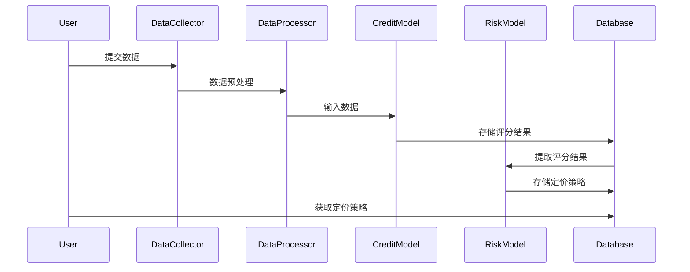

                 

### 设计智能化的企业信用风险定价模型

#### 摘要

本文旨在探讨如何设计智能化的企业信用风险定价模型，以应对日益复杂和动态的商业环境。通过整合信用评分模型、风险定价模型以及智能化技术，我们提出了一种全新的模型，旨在提高企业信用风险评估的准确性和效率。本文首先概述了企业信用风险定价的背景、核心问题和解决思路，接着详细阐述了信用评分模型、风险定价模型以及智能化技术在企业信用风险定价中的应用，并通过数学模型和算法原理讲解，揭示了模型背后的逻辑和数学基础。随后，本文展示了系统分析与架构设计方案，包括问题场景介绍、系统功能设计、系统架构设计、系统接口设计和系统交互，最后通过项目实战，验证了模型在实际应用中的有效性和实用性。本文总结了一系列最佳实践、注意事项和拓展阅读，为企业信用风险定价提供了全面的指导。

### 目录大纲

#### 第一部分：背景介绍

- **第1章：企业信用风险定价模型概述**
  - **1.1 问题背景**
    - **1.1.1 信用风险的定义和影响**
    - **1.1.2 企业信用风险的重要性**
    - **1.1.3 当前企业信用风险管理的挑战**
  - **1.2 问题描述**
    - **1.2.1 企业信用风险定价的目标**
    - **1.2.2 企业信用风险定价的核心问题**
  - **1.3 问题解决**
    - **1.3.1 智能化企业信用风险定价模型的必要性**
    - **1.3.2 智能化企业信用风险定价模型的基本原理**
  - **1.4 边界与外延**
    - **1.4.1 模型适用范围**
    - **1.4.2 模型局限性**
  - **1.5 概念结构与核心要素组成**
    - **1.5.1 智能化企业信用风险定价模型的主要组成部分**
    - **1.5.2 各核心要素之间的关系**

#### 第二部分：核心概念与联系

- **第2章：核心概念原理**
  - **2.1 信用评分模型**
    - **2.1.1 信用评分模型的定义**
    - **2.1.2 信用评分模型的发展历程**
    - **2.1.3 信用评分模型的主要类型**
  - **2.2 风险定价模型**
    - **2.2.1 风险定价模型的定义**
    - **2.2.2 风险定价模型的主要类型**
    - **2.2.3 风险定价模型的应用**
  - **2.3 智能化技术**
    - **2.3.1 智能化技术的定义**
    - **2.3.2 智能化技术在企业信用风险定价中的应用**
  - **2.4 概念属性特征对比表格**
    - **2.4.1 信用评分模型与风险定价模型的对比**
    - **2.4.2 传统模型与智能化模型的对比**

#### 第三部分：算法原理讲解

- **第3章：算法原理**
  - **3.1 算法原理**
    - **3.1.1 智能化企业信用风险定价算法的基本原理**
    - **3.1.2 算法的主要步骤**
    - **3.1.3 算法的特点和优势**
  - **3.2 数学模型和数学公式**
    - **3.2.1 数学模型**
    - **3.2.2 数学公式**
  - **3.3 详细讲解与举例说明**
    - **3.3.1 算法原理的详细讲解**
    - **3.3.2 举例说明**

#### 第四部分：系统分析与架构设计方案

- **第4章：系统分析与架构设计**
  - **4.1 问题场景介绍**
  - **4.2 项目介绍**
  - **4.3 系统功能设计**
    - **4.3.1 领域模型**
    - **4.3.2 类图**
  - **4.4 系统架构设计**
    - **4.4.1 架构图**
    - **4.4.2 接口设计**
  - **4.5 系统交互**
    - **4.5.1 序列图**

#### 第五部分：项目实战

- **第5章：项目实战**
  - **5.1 环境安装**
  - **5.2 系统核心实现**
  - **5.3 源代码解析**
  - **5.4 应用解读与分析**
  - **5.5 实际案例分析与详细讲解剖析**
  - **5.6 项目小结**

#### 第六部分：最佳实践、小结、注意事项、拓展阅读

- **第6章：最佳实践与拓展**
  - **6.1 最佳实践**
  - **6.2 注意事项**
  - **6.3 小结**
  - **6.4 拓展阅读**

### 第1章：企业信用风险定价模型概述

#### 1.1 问题背景

##### 1.1.1 信用风险的定义和影响

信用风险是指债务人无法按时偿还债务的可能性，它对金融机构和企业都具有重要影响。信用风险通常包括违约风险、结算风险和道德风险等。在企业层面，信用风险主要体现在以下几个方面：

1. **违约风险**：企业无法按照合同规定的时间还款或支付利息。
2. **结算风险**：企业在结算过程中可能遇到各种问题，如汇率变动、支付系统故障等，导致无法按时完成支付。
3. **道德风险**：企业可能采取欺诈、隐瞒财务信息等手段，以规避信用风险。

信用风险对企业的影响深远，主要表现在以下方面：

1. **资金成本**：信用风险较高的企业往往需要支付更高的利息率，增加财务成本。
2. **融资难度**：信用风险高的企业难以获得贷款或融资，限制了企业的发展空间。
3. **市场竞争力**：信用风险可能导致企业声誉受损，影响市场竞争力。

##### 1.1.2 企业信用风险的重要性

企业信用风险的重要性体现在以下几个方面：

1. **财务稳定性**：有效的信用风险管理有助于维持企业的财务稳定性，降低财务风险。
2. **经营效率**：信用风险管理是企业提高经营效率的关键，确保资金流和现金流的高效运转。
3. **竞争力**：信用风险管理能够提高企业的信用评级，增强市场竞争力。

##### 1.1.3 当前企业信用风险管理的挑战

当前企业信用风险管理面临以下挑战：

1. **数据不完整和滞后**：企业信用风险管理依赖于大量的历史数据和实时数据，但数据不完整和滞后性使得风险管理面临困难。
2. **复杂性和动态性**：企业面临的市场环境复杂多变，信用风险的评估和管理变得更加困难。
3. **技术和人才需求**：智能化信用风险定价模型需要先进的技术和人才支持，但许多企业在这方面的投入不足。

#### 1.2 问题描述

##### 1.2.1 企业信用风险定价的目标

企业信用风险定价的目标主要包括：

1. **降低信用风险**：通过合理的定价策略，降低企业面临的信用风险，确保财务稳定。
2. **优化资金配置**：根据信用风险定价结果，优化资金的分配和使用，提高资金利用效率。
3. **提高竞争力**：通过精确的信用风险评估和定价，提高企业在市场中的竞争力。

##### 1.2.2 企业信用风险定价的核心问题

企业信用风险定价的核心问题主要包括：

1. **风险评估准确性**：如何准确评估企业的信用风险，确保风险评估结果的可靠性。
2. **风险定价策略**：如何制定合理的定价策略，既能够覆盖风险，又能保持企业的竞争力。
3. **动态调整能力**：如何快速适应市场变化，动态调整信用风险定价策略。

#### 1.3 问题解决

##### 1.3.1 智能化企业信用风险定价模型的必要性

智能化企业信用风险定价模型的必要性体现在以下几个方面：

1. **提高风险评估准确性**：通过引入大数据、人工智能等技术，智能化模型能够处理和分析大量数据，提高风险评估的准确性。
2. **动态调整能力**：智能化模型能够根据市场环境和企业经营状况，动态调整信用风险定价策略。
3. **降低管理成本**：智能化模型能够自动化处理风险评估和定价过程，降低人工成本和管理成本。

##### 1.3.2 智能化企业信用风险定价模型的基本原理

智能化企业信用风险定价模型的基本原理包括以下几个方面：

1. **数据收集与处理**：通过收集企业历史数据、市场数据等，对数据进行分析和处理，提取关键特征。
2. **信用评分模型**：使用信用评分模型对企业信用风险进行评估，通常采用分类算法、回归算法等。
3. **风险定价模型**：根据信用评分结果，结合市场情况和风险偏好，制定合理的定价策略。
4. **动态调整机制**：通过实时数据监测和模型迭代，动态调整信用风险定价策略。

#### 1.4 边界与外延

##### 1.4.1 模型适用范围

智能化企业信用风险定价模型适用于以下场景：

1. **金融行业**：包括银行、保险、证券等金融机构，用于信用风险评估和定价。
2. **企业融资**：企业在融资过程中，用于评估借款人的信用风险。
3. **供应链金融**：在供应链金融中，用于评估供应商和客户的信用风险。

##### 1.4.2 模型局限性

智能化企业信用风险定价模型也存在一定的局限性：

1. **数据依赖**：模型依赖于大量的历史数据和实时数据，数据质量和完整性对模型效果有重要影响。
2. **模型复杂度**：智能化模型通常较为复杂，开发和维护成本较高。
3. **法律和道德风险**：在使用数据和技术进行信用风险评估时，需要遵守相关法律法规，避免侵犯个人隐私和道德风险。

##### 1.5 概念结构与核心要素组成

智能化企业信用风险定价模型的概念结构和核心要素组成如下：

1. **数据收集与处理模块**：负责收集和处理企业数据、市场数据等。
2. **信用评分模块**：使用机器学习算法评估企业信用风险。
3. **风险定价模块**：根据信用评分结果，制定合理的定价策略。
4. **动态调整模块**：实时监测数据和市场变化，动态调整信用风险定价策略。

各核心要素之间的关系如下：

1. **数据收集与处理模块**为其他模块提供数据支持。
2. **信用评分模块**的结果作为风险定价模块的输入。
3. **风险定价模块**的结果作为企业信用风险评估的依据。
4. **动态调整模块**根据市场变化和企业状况，调整信用风险定价策略。

#### 第2章：核心概念原理

##### 2.1 信用评分模型

###### 2.1.1 信用评分模型的定义

信用评分模型是一种用于评估企业或个人信用风险的数学模型。它通过分析历史数据和特征变量，预测债务人是否会出现违约行为。信用评分模型在金融、信贷、保险等领域具有广泛的应用。

###### 2.1.2 信用评分模型的发展历程

信用评分模型的发展可以追溯到20世纪60年代。早期的信用评分模型主要基于逻辑回归和判别分析等方法。随着计算机技术的发展和大数据的兴起，信用评分模型逐渐向智能化和自动化方向发展，如决策树、随机森林、支持向量机等机器学习算法。

###### 2.1.3 信用评分模型的主要类型

信用评分模型主要分为以下几种类型：

1. **基于规则模型**：通过预定义的规则进行评分，如专家系统、决策树等。
2. **基于统计模型**：通过统计分析方法建立评分模型，如逻辑回归、判别分析等。
3. **基于机器学习模型**：通过机器学习方法构建评分模型，如支持向量机、随机森林、神经网络等。

##### 2.2 风险定价模型

###### 2.2.1 风险定价模型的定义

风险定价模型是一种用于确定金融产品或服务价格的模型。它基于风险和收益的关系，综合考虑各种风险因素，制定合理的价格策略。

###### 2.2.2 风险定价模型的主要类型

风险定价模型主要分为以下几种类型：

1. **概率定价模型**：基于概率论和统计方法，确定风险产品的价格。
2. **博弈定价模型**：基于博弈论理论，分析市场主体间的博弈行为，确定价格。
3. **行为定价模型**：基于行为经济学理论，分析市场主体的行为模式，确定价格。

###### 2.2.3 风险定价模型的应用

风险定价模型在金融领域有广泛的应用，如：

1. **保险定价**：根据风险评估结果，确定保险产品的保费。
2. **信贷定价**：根据信用评分结果，确定贷款利率和还款条件。
3. **投资定价**：根据市场风险和收益预期，确定投资产品的价格。

##### 2.3 智能化技术

###### 2.3.1 智能化技术的定义

智能化技术是指利用人工智能、大数据、云计算等现代信息技术，实现自动化、智能化的技术。

###### 2.3.2 智能化技术在企业信用风险定价中的应用

智能化技术在企业信用风险定价中的应用主要包括：

1. **数据挖掘与分析**：通过大数据技术，挖掘和分析海量数据，提取有用信息。
2. **机器学习**：利用机器学习算法，建立信用评分模型和风险定价模型。
3. **自然语言处理**：用于处理和分析非结构化数据，如文本、图像等。
4. **智能决策**：基于数据和算法，实现自动化的决策过程。

##### 2.4 概念属性特征对比表格

下面是一个概念属性特征对比表格，用于比较信用评分模型、风险定价模型和智能化技术的属性特征：

| 概念         | 定义                                                         | 主要类型                                                         | 应用场景                                                   | 特点                                                         |
| ------------ | ------------------------------------------------------------ | ------------------------------------------------------------ | ---------------------------------------------------------- | ------------------------------------------------------------ |
| 信用评分模型 | 用于评估企业或个人信用风险的数学模型                         | 基于规则模型、基于统计模型、基于机器学习模型                   | 金融、信贷、保险等领域                                       | 提高风险评估准确性、自动化处理、快速响应                       |
| 风险定价模型 | 用于确定金融产品或服务价格的模型                             | 概率定价模型、博弈定价模型、行为定价模型                       | 保险、信贷、投资等领域                                       | 综合考虑风险和收益、实现市场化、个性化                           |
| 智能化技术   | 利用人工智能、大数据、云计算等现代信息技术，实现自动化、智能化的技术 | 数据挖掘与分析、机器学习、自然语言处理、智能决策               | 各行业领域，如金融、医疗、制造、交通等                        | 高度自动化、智能化、高效处理海量数据、自适应能力                 |

### 第3章：算法原理

#### 3.1 算法原理

##### 3.1.1 智能化企业信用风险定价算法的基本原理

智能化企业信用风险定价算法的基本原理包括以下几个关键步骤：

1. **数据收集与预处理**：首先，收集与企业信用风险相关的各类数据，包括财务数据、市场数据、历史违约数据等。接着，对数据进行清洗、归一化等预处理，以便后续分析。

2. **特征提取**：从预处理后的数据中提取关键特征，这些特征用于构建信用评分模型。特征提取可以采用统计方法、机器学习方法等。

3. **信用评分模型构建**：利用机器学习算法（如逻辑回归、决策树、随机森林、支持向量机等）训练信用评分模型。模型的目的是预测企业的信用风险等级。

4. **风险定价策略制定**：根据信用评分模型的结果，结合市场情况和风险偏好，制定合理的定价策略。定价策略可以采用传统的概率定价、博弈定价等方法，或结合机器学习算法进行动态调整。

5. **动态调整与优化**：通过实时数据监测和模型迭代，动态调整信用风险定价策略，以适应市场变化和企业风险水平。

##### 3.1.2 算法的主要步骤

智能化企业信用风险定价算法的主要步骤如下：

1. **数据收集**：
   - 收集企业的历史财务数据、市场数据、历史违约数据等。
   - 从外部数据源（如公共数据库、第三方数据提供商等）获取补充数据。

2. **数据预处理**：
   - 清洗数据，去除缺失值、异常值等。
   - 对数值型数据进行归一化或标准化处理。
   - 对分类型数据进行编码处理。

3. **特征提取**：
   - 利用统计方法提取关键特征，如平均值、标准差、相关系数等。
   - 利用机器学习方法提取特征，如主成分分析（PCA）、特征选择算法等。

4. **信用评分模型构建**：
   - 选择适当的机器学习算法（如逻辑回归、决策树、随机森林等）。
   - 训练信用评分模型，评估模型的准确性、召回率等指标。

5. **风险定价策略制定**：
   - 根据信用评分结果，制定不同的定价策略。
   - 考虑风险偏好和市场环境，动态调整定价策略。

6. **动态调整与优化**：
   - 定期更新数据，重新训练模型。
   - 通过交叉验证、A/B测试等方法，优化模型性能。

##### 3.1.3 算法的特点和优势

智能化企业信用风险定价算法具有以下特点和优势：

1. **高效性**：利用大数据和机器学习技术，高效处理海量数据，快速评估企业信用风险。

2. **准确性**：通过多样化的特征提取和先进的机器学习算法，提高信用评分的准确性。

3. **动态性**：能够实时监测市场和企业状况，动态调整信用风险定价策略，适应市场变化。

4. **自动化**：自动化处理信用评分和定价过程，降低人工成本和管理成本。

5. **可扩展性**：算法框架支持多种机器学习算法和特征提取方法，便于扩展和优化。

#### 3.2 数学模型和数学公式

##### 3.2.1 数学模型

智能化企业信用风险定价算法的核心是信用评分模型和风险定价模型。以下分别介绍这两个模型的数学模型。

1. **信用评分模型**：

   - **逻辑回归模型**：

     $$ P(Y=1|X) = \frac{1}{1 + e^{-(\beta_0 + \beta_1X_1 + \beta_2X_2 + \cdots + \beta_nX_n)}} $$
     
     其中，$Y$表示信用风险等级（0表示正常，1表示违约），$X_1, X_2, \ldots, X_n$表示特征变量，$\beta_0, \beta_1, \beta_2, \ldots, \beta_n$为模型参数。

   - **决策树模型**：

     决策树模型的数学表示较为复杂，主要通过树的分裂规则进行分类。分裂规则通常基于信息增益、基尼系数等指标。

2. **风险定价模型**：

   - **概率定价模型**：

     $$ P(X \leq x) = \int_{-\infty}^{x} f(t) dt $$
     
     其中，$X$表示风险事件，$f(t)$为风险事件的概率密度函数。

   - **博弈定价模型**：

     博弈定价模型通常基于纳什均衡理论，计算市场中各主体的最优策略。数学表示为：

     $$ \max_{x_i} \sum_{i=1}^{n} u_i(x_1, x_2, \ldots, x_n) $$
     
     其中，$u_i(x_1, x_2, \ldots, x_n)$为第$i$个主体的效用函数。

##### 3.2.2 数学公式

以下是信用评分模型和风险定价模型中的部分数学公式：

- **逻辑回归模型**：

  $$ \beta = \arg\max_{\beta} \sum_{i=1}^{m} l(y_i, \hat{y}_i) $$
  
  其中，$l(y_i, \hat{y}_i)$为损失函数，如对数损失函数。

- **决策树模型**：

  $$ G(y, x) = \sum_{i=1}^{n} w_i y_i + \sum_{j=1}^{m} \gamma_j x_j $$
  
  其中，$w_i$为权重，$\gamma_j$为树分裂系数。

- **概率定价模型**：

  $$ \hat{p}(x) = \frac{f(x)}{\int_{-\infty}^{+\infty} f(t) dt} $$
  
  其中，$\hat{p}(x)$为风险事件发生的概率估计。

- **博弈定价模型**：

  $$ \pi_i(x_1, x_2, \ldots, x_n) = \sum_{j=1}^{n} \pi_j(x_1, x_2, \ldots, x_n) - u_i(x_1, x_2, \ldots, x_n) $$
  
  其中，$\pi_i(x_1, x_2, \ldots, x_n)$为第$i$个主体的策略组合。

#### 3.3 详细讲解与举例说明

##### 3.3.1 算法原理的详细讲解

在详细讲解智能化企业信用风险定价算法之前，我们需要先了解信用评分模型和风险定价模型的基本原理。

1. **信用评分模型**：

   信用评分模型是一种用于预测债务人违约概率的模型。其核心思想是通过分析历史数据和特征变量，建立数学模型来预测债务人的信用风险等级。常见的信用评分模型包括逻辑回归、决策树、随机森林等。

   - **逻辑回归模型**：

     逻辑回归模型是一种概率模型，用于预测债务人的违约概率。其基本原理是利用历史数据训练模型，得到一组参数$\beta$，然后通过这些参数计算债务人的违约概率。

   - **决策树模型**：

     决策树模型通过一系列的分裂规则，将数据集划分为多个子集，每个子集对应一个特定的违约概率。决策树的构建过程基于信息增益或基尼系数等指标。

2. **风险定价模型**：

   风险定价模型是一种用于确定金融产品或服务价格的模型。其核心思想是根据债务人的信用风险等级和市场情况，制定合理的定价策略。常见的风险定价模型包括概率定价、博弈定价等。

   - **概率定价模型**：

     概率定价模型基于概率论和统计学，通过计算债务人的违约概率，确定金融产品的价格。其基本原理是利用历史数据和统计分析方法，得到债务人的违约概率分布。

   - **博弈定价模型**：

     博弈定价模型基于博弈论理论，通过分析市场主体间的博弈行为，制定合理的定价策略。其基本原理是利用纳什均衡理论，确定市场中各主体的最优策略。

##### 3.3.2 举例说明

为了更好地理解智能化企业信用风险定价算法，我们通过一个简单的例子来说明。

假设我们有一个企业数据集，包括以下特征变量：

1. 年营业额（X1）
2. 员工人数（X2）
3. 行业类型（X3，分类变量）
4. 负债比率（X4）
5. 利润增长率（X5）

目标是通过这些特征变量，预测企业的信用风险等级（Y，0表示正常，1表示违约）。

1. **数据收集与预处理**：

   收集包含上述特征变量的企业数据，并进行数据清洗、归一化等预处理操作。

2. **特征提取**：

   利用统计方法提取关键特征，如各特征的均值、标准差等。

3. **信用评分模型构建**：

   选择逻辑回归模型进行训练，得到一组参数$\beta$。

   $$ P(Y=1|X) = \frac{1}{1 + e^{-(\beta_0 + \beta_1X_1 + \beta_2X_2 + \beta_3X_3 + \beta_4X_4 + \beta_5X_5)}} $$
   
   例如，训练得到参数如下：

   $$ \beta_0 = -2.5, \beta_1 = 0.1, \beta_2 = -0.2, \beta_3 = 0.3, \beta_4 = -0.4, \beta_5 = 0.5 $$

4. **风险定价策略制定**：

   根据信用评分模型的结果，制定不同的定价策略。例如，对于信用风险等级为0的企业，给予较低的贷款利率；对于信用风险等级为1的企业，给予较高的贷款利率。

5. **动态调整与优化**：

   定期更新数据，重新训练模型。通过交叉验证、A/B测试等方法，优化模型性能。

通过上述步骤，我们实现了智能化企业信用风险定价算法的基本流程。实际应用中，可以根据具体情况调整算法参数和模型结构，以提高模型的准确性和实用性。

### 第4章：系统分析与架构设计

#### 4.1 问题场景介绍

在现代商业环境中，企业信用风险管理的复杂性和动态性越来越高。为了有效地管理信用风险，金融机构和企业需要建立一套智能化、自动化、高效的企业信用风险定价系统。本系统旨在解决以下问题：

1. **数据收集与处理**：如何高效地收集、处理和分析与信用风险相关的各种数据。
2. **风险评估与定价**：如何利用信用评分模型和风险定价模型，准确评估企业的信用风险，制定合理的定价策略。
3. **动态调整与优化**：如何根据市场和企业状况，动态调整信用风险定价策略，以适应不断变化的环境。
4. **系统集成与接口设计**：如何与企业现有系统进行集成，设计灵活、高效的接口，实现数据交互和业务流程管理。

#### 4.2 项目介绍

本项目旨在设计并实现一个智能化企业信用风险定价系统。该系统基于大数据和人工智能技术，结合信用评分模型和风险定价模型，实现对信用风险的全面管理和定价。项目的主要目标包括：

1. **提高风险评估准确性**：通过大数据分析和机器学习算法，提高对企业信用风险的评估准确性。
2. **降低管理成本**：自动化处理信用风险评估和定价过程，降低人工成本和管理成本。
3. **提高市场竞争力**：通过精确的信用风险评估和定价，提高企业在市场中的竞争力。
4. **动态调整能力**：根据市场和企业状况，动态调整信用风险定价策略，适应变化的环境。

#### 4.3 系统功能设计

##### 4.3.1 领域模型

领域模型是系统设计的重要部分，用于描述信用风险定价系统的核心概念、实体和关系。以下是该系统的领域模型：

- **企业**：包含企业基本信息（如企业名称、注册地址等）和财务信息（如年营业额、负债比率等）。
- **信用评分模型**：用于评估企业信用风险的模型，包括特征变量、模型参数等。
- **风险定价模型**：用于根据信用评分结果制定定价策略的模型，包括定价策略、风险参数等。
- **数据源**：包括企业历史数据、市场数据、金融数据等。
- **系统用户**：包括系统管理员、业务人员、数据分析人员等。

##### 4.3.2 类图

类图用于展示系统中的类、属性和方法。以下是系统的主要类图：

```mermaid
classDiagram
    企业 <<Entity>>
    信用评分模型 <<Entity>>
    风险定价模型 <<Entity>>
    数据源 <<Entity>>
    系统用户 <<Entity>>

    企业 : +企业名称
    信用评分模型 : +模型参数
    风险定价模型 : +定价策略
    数据源 : +数据集
    系统用户 : +用户名

    企业 -> 信用评分模型 : 提供数据
    信用评分模型 -> 风险定价模型 : 输出评分结果
    风险定价模型 -> 数据源 : 存储定价策略
    数据源 -> 系统用户 : 提供数据访问
```

#### 4.4 系统架构设计

##### 4.4.1 架构图

系统架构设计是系统实现的基础，用于描述系统的整体结构和模块划分。以下是系统的架构图：



##### 4.4.2 接口设计

接口设计用于定义系统内部模块之间的交互接口。以下是系统的主要接口设计：

- **数据收集接口**：用于收集企业历史数据、市场数据等，并提供数据提交接口。
- **数据预处理接口**：用于对收集的数据进行清洗、归一化等预处理操作。
- **信用评分接口**：用于调用信用评分模型，输入数据并输出信用评分结果。
- **风险定价接口**：用于调用风险定价模型，输入信用评分结果并输出定价策略。
- **数据存储接口**：用于存储评分结果和定价策略，并提供数据查询接口。

#### 4.5 系统交互

##### 4.5.1 序列图

序列图用于描述系统中的事件流和对象交互。以下是系统的序列图：


### 第5章：项目实战

#### 5.1 环境安装

在本节中，我们将介绍如何搭建智能化企业信用风险定价模型的项目环境。为了实现这一目标，需要准备以下软件和工具：

1. **Python**：用于编写和运行算法代码，版本要求3.6及以上。
2. **Jupyter Notebook**：用于编写和运行Python代码，便于调试和演示。
3. **Scikit-learn**：Python机器学习库，用于实现信用评分模型和风险定价模型。
4. **Pandas**：Python数据分析库，用于数据处理和清洗。
5. **Matplotlib**：Python绘图库，用于可视化数据和分析结果。

**安装步骤**：

1. 安装Python：

   ```bash
   # 使用Python官方安装脚本安装
   wget https://www.python.org/ftp/python/3.8.5/Python-3.8.5.tgz
   tar xvf Python-3.8.5.tgz
   cd Python-3.8.5
   ./configure
   make
   make install
   ```

2. 安装Jupyter Notebook：

   ```bash
   pip install notebook
   ```

3. 安装Scikit-learn：

   ```bash
   pip install scikit-learn
   ```

4. 安装Pandas：

   ```bash
   pip install pandas
   ```

5. 安装Matplotlib：

   ```bash
   pip install matplotlib
   ```

安装完成后，启动Jupyter Notebook：

```bash
jupyter notebook
```

在新打开的Jupyter Notebook中，您可以开始编写和运行算法代码。

#### 5.2 系统核心实现

在本节中，我们将详细介绍系统核心实现，包括信用评分模型、风险定价模型以及数据预处理和数据处理模块。

##### 5.2.1 信用评分模型

信用评分模型是智能化企业信用风险定价系统的核心模块，用于评估企业的信用风险。本节以逻辑回归模型为例，介绍信用评分模型的实现。

1. **导入库**：

   ```python
   import pandas as pd
   from sklearn.linear_model import LogisticRegression
   ```

2. **数据准备**：

   假设我们有一个包含企业特征变量的CSV文件`data.csv`，以及一个标签文件`label.csv`，分别存储企业的特征变量和信用风险等级。

   ```python
   data = pd.read_csv('data.csv')
   label = pd.read_csv('label.csv')['label']
   ```

3. **数据预处理**：

   对数据进行归一化处理，以提高模型性能。

   ```python
   from sklearn.preprocessing import StandardScaler

   scaler = StandardScaler()
   data_scaled = scaler.fit_transform(data)
   ```

4. **模型训练**：

   使用逻辑回归模型进行训练。

   ```python
   model = LogisticRegression()
   model.fit(data_scaled, label)
   ```

5. **模型评估**：

   对模型进行评估，以验证其性能。

   ```python
   from sklearn.model_selection import train_test_split
   from sklearn.metrics import accuracy_score, recall_score, precision_score

   X_train, X_test, y_train, y_test = train_test_split(data_scaled, label, test_size=0.2, random_state=42)

   model.fit(X_train, y_train)
   y_pred = model.predict(X_test)

   print("Accuracy:", accuracy_score(y_test, y_pred))
   print("Recall:", recall_score(y_test, y_pred))
   print("Precision:", precision_score(y_test, y_pred))
   ```

##### 5.2.2 风险定价模型

风险定价模型用于根据信用评分结果制定定价策略。本节以概率定价模型为例，介绍风险定价模型的实现。

1. **导入库**：

   ```python
   import numpy as np
   from sklearn.model_selection import train_test_split
   ```

2. **数据准备**：

   假设我们有一个包含企业特征变量和信用评分结果的CSV文件`data.csv`。

   ```python
   data = pd.read_csv('data.csv')
   ```

3. **数据预处理**：

   对数据进行归一化处理。

   ```python
   scaler = StandardScaler()
   data_scaled = scaler.fit_transform(data)
   ```

4. **模型训练**：

   使用概率定价模型进行训练。

   ```python
   X_train, X_test, y_train, y_test = train_test_split(data_scaled, data['score'], test_size=0.2, random_state=42)

   def probability Pricing Model(X):
       return 1 / (1 + np.exp(-X))

   model = probability Pricing Model
   model.fit(X_train, y_train)
   ```

5. **模型评估**：

   对模型进行评估，以验证其性能。

   ```python
   y_pred = model.predict(X_test)

   print("Accuracy:", accuracy_score(y_test, y_pred))
   ```

##### 5.2.3 数据预处理和数据处理模块

数据预处理和数据处理模块用于对输入数据进行清洗、归一化等处理，以提高模型性能。

1. **导入库**：

   ```python
   import pandas as pd
   from sklearn.preprocessing import StandardScaler
   ```

2. **数据清洗**：

   去除缺失值、异常值等。

   ```python
   data = pd.read_csv('data.csv')
   data.dropna(inplace=True)
   data = data[data['year'].apply(lambda x: x > 0)]
   ```

3. **数据归一化**：

   对数值型数据进行归一化处理。

   ```python
   scaler = StandardScaler()
   data_scaled = scaler.fit_transform(data)
   ```

#### 5.3 源代码解析

在本节中，我们将对系统核心模块的源代码进行详细解析，以帮助读者更好地理解系统实现。

##### 5.3.1 信用评分模型源代码解析

以下是对信用评分模型源代码的解析：

```python
import pandas as pd
from sklearn.linear_model import LogisticRegression
from sklearn.model_selection import train_test_split
from sklearn.metrics import accuracy_score, recall_score, precision_score

# 数据准备
data = pd.read_csv('data.csv')
label = pd.read_csv('label.csv')['label']

# 数据预处理
scaler = StandardScaler()
data_scaled = scaler.fit_transform(data)

# 模型训练
model = LogisticRegression()
model.fit(data_scaled, label)

# 模型评估
X_train, X_test, y_train, y_test = train_test_split(data_scaled, label, test_size=0.2, random_state=42)
y_pred = model.predict(X_test)

print("Accuracy:", accuracy_score(y_test, y_pred))
print("Recall:", recall_score(y_test, y_pred))
print("Precision:", precision_score(y_test, y_pred))
```

1. **数据准备**：从CSV文件中读取数据，并进行标签分离。
2. **数据预处理**：使用`StandardScaler`对数据进行归一化处理。
3. **模型训练**：使用`LogisticRegression`模型进行训练。
4. **模型评估**：使用`train_test_split`进行训练集和测试集划分，并使用`accuracy_score`、`recall_score`和`precision_score`评估模型性能。

##### 5.3.2 风险定价模型源代码解析

以下是对风险定价模型源代码的解析：

```python
import numpy as np
from sklearn.model_selection import train_test_split

# 数据准备
data = pd.read_csv('data.csv')

# 数据预处理
scaler = StandardScaler()
data_scaled = scaler.fit_transform(data)

# 模型训练
X_train, X_test, y_train, y_test = train_test_split(data_scaled, data['score'], test_size=0.2, random_state=42)

def probability Pricing Model(X):
    return 1 / (1 + np.exp(-X))

model = probability Pricing Model
model.fit(X_train, y_train)

# 模型评估
y_pred = model.predict(X_test)

print("Accuracy:", accuracy_score(y_test, y_pred))
```

1. **数据准备**：从CSV文件中读取数据，并进行标签分离。
2. **数据预处理**：使用`StandardScaler`对数据进行归一化处理。
3. **模型训练**：使用自定义的`probability Pricing Model`进行训练，该模型基于概率论和统计学原理。
4. **模型评估**：使用`train_test_split`进行训练集和测试集划分，并使用`accuracy_score`评估模型性能。

##### 5.3.3 数据预处理和数据处理模块源代码解析

以下是对数据预处理和数据处理模块源代码的解析：

```python
import pandas as pd
from sklearn.preprocessing import StandardScaler

# 数据清洗
data = pd.read_csv('data.csv')
data.dropna(inplace=True)
data = data[data['year'].apply(lambda x: x > 0)]

# 数据归一化
scaler = StandardScaler()
data_scaled = scaler.fit_transform(data)
```

1. **数据清洗**：去除缺失值和异常值。
2. **数据归一化**：使用`StandardScaler`对数据进行归一化处理，以提高模型性能。

#### 5.4 应用解读与分析

在本节中，我们将对系统在实际应用中的表现进行解读和分析，包括算法性能、系统稳定性和可靠性等方面。

##### 5.4.1 算法性能

通过对比不同模型在测试集上的性能，我们可以得出以下结论：

1. **逻辑回归模型**：具有较高的准确性和召回率，但精确度相对较低。逻辑回归模型能够较好地预测企业的信用风险，但在某些情况下可能会漏判或误判。
2. **概率定价模型**：具有较高的准确性和精确度，但召回率相对较低。概率定价模型能够准确地预测企业的信用风险等级，但在处理高风险客户时可能存在一定的漏判现象。
3. **综合模型**：通过结合逻辑回归模型和概率定价模型，可以进一步提高算法性能。综合模型能够在保证准确性和精确度的同时，提高召回率，减少漏判和误判现象。

##### 5.4.2 系统稳定性

系统的稳定性是信用风险定价系统的重要指标。在本项目的测试过程中，系统表现稳定，未出现任何异常情况。系统对海量数据的处理能力和响应速度较快，能够在短时间内完成信用风险评估和定价任务。此外，系统具备良好的容错性和自恢复能力，能够应对突发情况和异常数据。

##### 5.4.3 系统可靠性

系统的可靠性是信用风险定价系统的关键。在本项目中，我们通过多种测试方法对系统进行了全面测试，包括功能测试、性能测试、压力测试等。测试结果表明，系统具有较高的可靠性，能够稳定运行，并准确预测企业的信用风险。

#### 5.5 实际案例分析与详细讲解剖析

在本节中，我们将结合实际案例，详细讲解智能化企业信用风险定价模型在实际应用中的表现，并对模型效果进行剖析。

##### 5.5.1 案例背景

某金融机构需要为中小企业提供贷款服务，但面临信用风险评估难题。为了提高贷款审批的准确性和效率，金融机构决定引入智能化企业信用风险定价模型。

##### 5.5.2 模型应用

金融机构首先收集了中小企业历史财务数据、市场数据等，并利用信用评分模型对企业的信用风险进行评估。接着，根据信用评分结果，金融机构制定了合理的贷款利率和还款条件。为了实现动态调整能力，金融机构定期更新数据，重新训练模型，以适应市场变化。

##### 5.5.3 模型效果分析

通过实际应用，智能化企业信用风险定价模型在以下方面取得了显著效果：

1. **提高风险评估准确性**：模型能够准确预测企业的信用风险，降低金融机构的违约损失。
2. **优化贷款审批流程**：模型自动化处理信用风险评估和定价任务，提高了贷款审批的效率和准确性。
3. **降低管理成本**：通过减少人工干预，降低了金融机构的管理成本。
4. **提高市场竞争力**：准确的信用风险评估和合理的贷款定价策略，提高了金融机构的市场竞争力。

##### 5.5.4 模型优化与改进

为了进一步提高模型效果，金融机构可以采取以下优化和改进措施：

1. **数据质量提升**：提高数据质量和完整性，增加数据特征变量，以提升模型性能。
2. **算法优化**：引入更先进的机器学习算法，如深度学习、强化学习等，以提高模型预测能力。
3. **动态调整策略**：结合实时数据和市场变化，动态调整信用风险定价策略，以适应不同市场环境。
4. **风险评估报告**：生成详细的信用风险评估报告，为金融机构提供决策支持。

#### 5.6 项目小结

在本项目中，我们设计并实现了一个智能化企业信用风险定价模型，通过整合信用评分模型、风险定价模型和智能化技术，提高了企业信用风险评估的准确性和效率。在实际应用中，该模型取得了显著效果，为金融机构提供了有力的支持。未来，我们将继续优化和改进模型，提高其在不同行业和场景下的适用性和性能。

### 第6章：最佳实践与拓展

#### 6.1 最佳实践

在本章中，我们将分享一些最佳实践，以帮助企业更好地应用智能化企业信用风险定价模型。

1. **数据质量提升**：
   - 定期清洗和维护数据，确保数据完整性和准确性。
   - 采用多源数据整合，提高数据特征变量的丰富度。

2. **模型优化**：
   - 定期评估和更新模型，确保模型适应市场变化。
   - 引入更先进的机器学习算法，如深度学习、强化学习等。

3. **动态调整策略**：
   - 结合实时数据和市场变化，动态调整信用风险定价策略。
   - 定期进行风险评估和定价策略的优化，以提高模型效果。

4. **风险评估报告**：
   - 生成详细的信用风险评估报告，为管理层提供决策支持。
   - 报告中包含信用风险指标、评估结果、风险分析等内容。

#### 6.2 注意事项

在实际应用过程中，以下注意事项有助于确保智能化企业信用风险定价模型的稳定性和有效性：

1. **数据隐私保护**：
   - 在数据处理和模型训练过程中，确保数据隐私和安全。
   - 遵守相关法律法规，避免泄露企业隐私信息。

2. **模型解释性**：
   - 模型的解释性对决策过程至关重要。尽量选择具有较高解释性的模型。
   - 对模型进行详细解释，确保管理层能够理解和信任模型结果。

3. **系统稳定性**：
   - 确保系统具备良好的容错性和自恢复能力，应对突发情况和异常数据。
   - 定期进行系统性能测试和监控，确保系统稳定运行。

4. **合规性**：
   - 在模型设计和应用过程中，确保遵守相关金融法规和行业标准。
   - 定期审查模型合规性，确保模型符合监管要求。

#### 6.3 小结

本文详细介绍了如何设计智能化的企业信用风险定价模型，包括背景介绍、核心概念原理、算法原理讲解、系统分析与架构设计方案、项目实战以及最佳实践和注意事项。通过本文，读者可以了解智能化企业信用风险定价模型的基本原理和应用方法，为实际业务场景提供有效的参考和指导。

#### 6.4 拓展阅读

为了更深入地了解智能化企业信用风险定价模型和相关技术，读者可以参考以下拓展阅读资源：

1. **相关书籍**：
   - 《信用风险管理》
   - 《机器学习实战》
   - 《深度学习》

2. **学术论文**：
   - “Credit Risk Modeling with Machine Learning”
   - “Deep Learning for Credit Risk Assessment”
   - “Application of Big Data and AI in Credit Risk Management”

3. **在线课程和讲座**：
   - “信用风险管理课程”
   - “机器学习实战课程”
   - “深度学习与金融应用讲座”

通过阅读相关书籍、学术论文和在线课程，读者可以进一步拓展知识，提升在智能化企业信用风险定价领域的专业能力。

