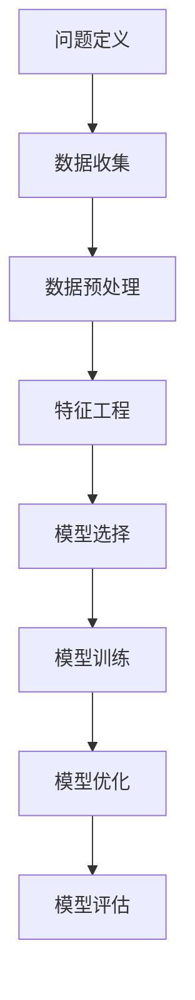

                 

### 文章标题：设计智能化的企业并购协同效应评估模型

#### 关键词：
- 智能化并购
- 协同效应
- 评估模型
- 数据分析
- 机器学习

#### 摘要：
本文将探讨设计一个智能化企业并购协同效应评估模型的方法和步骤。我们将从背景介绍、核心概念、智能模型基础、评估方法、数据收集与预处理、模型开发与验证、实际应用案例以及面临的挑战和未来展望等多个方面进行详细阐述。通过本文的阅读，读者将了解如何利用先进技术构建一个高效、准确的企业并购协同效应评估模型，从而为企业决策提供有力的支持。

## 引言

### 问题背景

企业并购作为企业扩张和优化资源配置的重要手段，在全球范围内被广泛应用。然而，并购过程中的协同效应评估是一个复杂且具有挑战性的问题。传统的评估方法通常依赖于经验和定性分析，缺乏系统性和定量分析，导致评估结果存在较大的不确定性。

近年来，随着人工智能和大数据技术的发展，智能化评估方法逐渐成为研究热点。通过引入机器学习算法和数据分析技术，可以有效提高协同效应评估的精度和效率。因此，设计一个智能化企业并购协同效应评估模型具有重要的理论和实践意义。

### 重要性

智能化并购协同效应评估模型的重要性体现在以下几个方面：

1. **提高决策质量**：通过精确评估协同效应，企业可以更好地把握并购的机会和风险，提高决策的科学性和有效性。
2. **优化资源配置**：智能评估模型可以帮助企业合理配置资源，降低并购后的整合成本，提高并购的整体收益。
3. **促进创新和发展**：智能评估模型能够识别并挖掘潜在的协同效应，推动企业创新和发展。
4. **降低并购风险**：智能评估模型可以为企业提供全面的风险评估，帮助企业规避潜在的风险。

### 目标

本文旨在设计一个智能化企业并购协同效应评估模型，实现以下目标：

1. **构建核心概念体系**：明确企业并购协同效应评估的基本概念、原理和方法。
2. **设计智能评估模型**：利用机器学习算法和数据分析技术，构建一个高效、准确的评估模型。
3. **验证模型性能**：通过实际案例验证模型的有效性和可靠性。
4. **探讨未来发展方向**：分析当前面临的挑战，提出未来研究的方向。

## 基础概念

### 企业并购

企业并购是指一家企业通过购买另一家企业的全部或部分资产、股权，实现对其控制的行为。并购可以分为横向并购、纵向并购和混合并购等类型。

### 协同效应

协同效应是指并购后，新企业整体价值大于各独立企业价值的总和。协同效应可以分为财务协同、经营协同和管理协同等类型。

### 智能化

智能化是指利用人工智能、大数据、云计算等先进技术，实现信息处理、决策分析、自动化等功能的提升。在并购协同效应评估中，智能化主要体现在数据分析和算法优化方面。

### 评估模型

评估模型是指用于评估并购协同效应的方法和工具。传统的评估模型主要包括财务分析法、经营协同分析法、管理协同分析法等。智能化评估模型则利用机器学习算法和数据分析技术，实现更精确、高效的评估。

### 关系图

#### 概念属性特征对比表格

| 概念       | 特征                     | 对比 |
|------------|------------------------|------|
| 企业并购   | 控制权变更、资产整合     |      |
| 协同效应   | 整体价值增加、效益提升   |      |
| 智能化     | 数据驱动、自动化分析     |      |
| 评估模型   | 定量评估、精确预测       |      |

#### ER实体关系图架构

```mermaid
erDiagram
    企业并购 ||--o> 协同效应 : 有益
    协同效应 ||--o> 智能化评估 : 利用
    智能化评估 ||--o> 评估模型 : 实现
```

## 智能模型基础

### 智能模型的基本原理

智能模型是基于人工智能技术构建的数据处理和分析工具。在并购协同效应评估中，智能模型通常包括以下几个基本原理：

1. **数据驱动**：智能模型通过大量历史数据学习，从而形成对协同效应的预测能力。
2. **机器学习**：利用机器学习算法，从数据中提取特征，建立评估模型。
3. **自适应优化**：智能模型可以根据新的数据和环境变化，不断调整和优化评估结果。

### 智能模型的核心技术

智能模型的核心技术主要包括：

1. **特征工程**：通过对数据进行预处理和特征提取，提高模型的预测性能。
2. **机器学习算法**：如线性回归、决策树、随机森林、支持向量机等，用于构建评估模型。
3. **模型优化**：利用交叉验证、网格搜索等技术，优化模型参数，提高评估精度。

### 智能模型的发展趋势

随着人工智能技术的不断进步，智能模型在并购协同效应评估中的应用趋势包括：

1. **深度学习**：深度学习算法在特征提取和模型优化方面具有显著优势，有望在未来的并购评估中得到更广泛的应用。
2. **多模态数据融合**：通过整合多种数据源（如文本、图像、语音等），实现更全面、准确的评估。
3. **实时评估**：利用实时数据分析和预测技术，实现并购过程中的动态评估，为决策提供实时支持。

## 数据收集与预处理

### 数据收集方法

数据收集是智能模型构建的关键步骤。在并购协同效应评估中，数据收集方法主要包括：

1. **公开数据**：从公共数据库、财经网站等获取企业财务报表、并购案例等公开数据。
2. **企业内部数据**：从企业内部系统获取经营数据、员工数据等。
3. **外部数据**：通过网络爬虫、API接口等获取与并购相关的新闻报道、市场数据等。

### 数据预处理步骤

数据预处理是提高数据质量和模型性能的重要环节。在并购协同效应评估中，数据预处理步骤主要包括：

1. **数据清洗**：去除重复数据、缺失值填充、异常值处理等。
2. **数据转换**：将不同类型的数据转换为统一格式，如将文本数据转换为数值数据。
3. **特征工程**：提取与协同效应相关的特征，如财务指标、市场份额等。

### 数据质量评估

数据质量评估是确保模型性能的重要环节。在并购协同效应评估中，数据质量评估主要包括：

1. **数据完整性**：检查数据是否存在缺失、重复等问题。
2. **数据准确性**：验证数据的真实性和可靠性。
3. **数据一致性**：确保不同数据源之间的数据一致。

## 模型开发与验证

### 模型开发流程

模型开发流程主要包括以下几个步骤：

1. **问题定义**：明确评估目标，确定评估指标。
2. **数据收集与预处理**：获取并处理用于训练和评估的数据。
3. **特征工程**：提取与协同效应相关的特征。
4. **模型选择**：选择合适的机器学习算法。
5. **模型训练与优化**：使用训练数据训练模型，并通过交叉验证、网格搜索等方法优化模型参数。
6. **模型评估**：使用验证数据评估模型性能。

### 算法原理讲解

#### 算法mermaid流程图



#### Python源代码实现

```python
# 导入相关库
import pandas as pd
from sklearn.model_selection import train_test_split
from sklearn.ensemble import RandomForestRegressor
from sklearn.metrics import mean_squared_error

# 数据收集与预处理
data = pd.read_csv('data.csv')
X = data.drop(['target'], axis=1)
y = data['target']

# 特征工程
# ...（具体操作）

# 模型选择与训练
X_train, X_test, y_train, y_test = train_test_split(X, y, test_size=0.2, random_state=42)
model = RandomForestRegressor(n_estimators=100, random_state=42)
model.fit(X_train, y_train)

# 模型优化
# ...（具体操作）

# 模型评估
y_pred = model.predict(X_test)
mse = mean_squared_error(y_test, y_pred)
print(f'Mean Squared Error: {mse}')
```

#### 数学模型和公式

$$
\text{协同效应得分} = f(\text{特征1}, \text{特征2}, ..., \text{特征n})
$$

其中，$f$ 是一个基于机器学习算法的函数，用于计算协同效应得分。

#### 举例说明

假设我们使用随机森林算法构建评估模型，特征包括企业A的市场份额（$x_1$）、企业B的员工数量（$x_2$）等。通过训练数据，模型可以学习到特征之间的关系，并生成协同效应得分。

$$
\text{协同效应得分} = f(x_1, x_2) = 0.5 \cdot x_1 + 0.3 \cdot x_2 + 0.2 \cdot \text{其他特征}
$$

对于一个新的企业并购案例，企业A的市场份额为40%，企业B的员工数量为1000人，则：

$$
\text{协同效应得分} = 0.5 \cdot 40\% + 0.3 \cdot 1000 + 0.2 \cdot \text{其他特征} = 20\% + 300 + 0.2 \cdot \text{其他特征}
$$

通过计算，可以得出该并购案例的协同效应得分，从而为决策提供参考。

## 模型验证与优化

### 模型验证方法

模型验证是评估模型性能的重要环节，主要包括以下方法：

1. **交叉验证**：通过将数据集划分为多个子集，多次训练和验证模型，以避免数据分布不均和过拟合问题。
2. **ROC曲线**：通过绘制真实值和预测值的关系曲线，评估模型的分类性能。
3. **PR曲线**：通过绘制精确率和召回率的关系曲线，评估模型的分类性能。

### 模型优化策略

模型优化策略主要包括以下方法：

1. **参数调优**：通过网格搜索、随机搜索等方法，寻找最佳参数组合，提高模型性能。
2. **特征选择**：通过特征选择方法，筛选出对协同效应评估有显著影响的特征，降低模型复杂度。
3. **模型集成**：通过集成多个模型，提高模型的稳定性和预测性能。

### 性能评估指标

性能评估指标是衡量模型性能的重要标准，主要包括以下指标：

1. **准确率**：预测正确的样本占总样本的比例。
2. **召回率**：预测正确的正样本占总正样本的比例。
3. **F1值**：准确率和召回率的调和平均值。
4. **均方误差（MSE）**：预测值与真实值之差的平方的平均值。
5. **均方根误差（RMSE）**：MSE的平方根。

### 优化过程

优化过程主要包括以下步骤：

1. **数据预处理**：对数据集进行清洗、归一化等处理，提高数据质量。
2. **模型选择**：选择合适的机器学习算法，如随机森林、支持向量机等。
3. **参数调优**：通过交叉验证和网格搜索等方法，寻找最佳参数组合。
4. **特征选择**：通过特征选择方法，筛选出对协同效应评估有显著影响的特征。
5. **模型集成**：通过集成多个模型，提高模型的稳定性和预测性能。
6. **性能评估**：使用验证集和测试集，评估模型性能。

## 实际应用案例

### 案例背景

某知名科技公司A计划收购另一家科技公司B，以扩大市场份额和提升技术实力。为了评估该并购项目的协同效应，公司决定利用智能评估模型进行评估。

### 模型应用过程

1. **数据收集与预处理**：收集两家公司的历史财务数据、市场数据等，并进行预处理。
2. **特征工程**：提取与协同效应相关的特征，如市场份额、员工数量、研发投入等。
3. **模型选择与训练**：选择随机森林算法构建评估模型，并使用训练数据训练模型。
4. **模型验证与优化**：使用验证数据评估模型性能，并通过参数调优和特征选择等方法优化模型。
5. **评估结果**：使用测试数据评估模型性能，得出并购项目的协同效应得分。

### 案例分析与讲解

1. **协同效应得分分析**：根据评估结果，计算出并购项目的协同效应得分。
2. **风险分析**：分析并购过程中可能面临的风险，如整合难度、市场波动等。
3. **建议**：根据评估结果和风险分析，提出具体的并购建议，如调整并购策略、优化整合方案等。

## 挑战与未来展望

### 当前面临的挑战

设计智能化并购协同效应评估模型面临以下挑战：

1. **数据质量和多样性**：数据质量和多样性对模型性能有重要影响，但获取高质量、多样化的数据具有挑战性。
2. **模型复杂度和计算效率**：随着模型复杂度的增加，计算效率成为重要问题，特别是在大规模数据集上。
3. **模型泛化能力**：如何提高模型的泛化能力，使其在不同场景下都能保持良好的性能，是一个挑战。

### 未来研究方向

未来研究方向包括：

1. **多模态数据融合**：利用多模态数据（如文本、图像、语音等），提高评估模型的精度和可靠性。
2. **实时评估与动态调整**：研究实时评估方法，实现并购过程中动态调整评估模型，为决策提供实时支持。
3. **模型可解释性**：提高模型的可解释性，使其更易于理解和应用。
4. **模型自动化与智能化**：研究如何自动化和智能化模型开发与优化过程，降低开发成本和难度。

## 结论

本文介绍了设计智能化企业并购协同效应评估模型的方法和步骤，包括背景介绍、核心概念、智能模型基础、数据收集与预处理、模型开发与验证、实际应用案例以及面临的挑战和未来展望。通过本文的阅读，读者可以了解到如何利用先进技术构建一个高效、准确的评估模型，为企业决策提供有力支持。未来，我们将继续探索智能化并购评估领域的研究方向，为企业创造更大价值。

## 作者信息

作者：AI天才研究院/AI Genius Institute & 禅与计算机程序设计艺术 /Zen And The Art of Computer Programming

## 最佳实践 Tips

1. **数据质量是关键**：确保数据质量是模型成功的基础，投入时间和资源进行数据清洗和预处理。
2. **选择合适的算法**：根据评估目标和数据特性，选择合适的机器学习算法，以获得最佳性能。
3. **持续优化模型**：定期更新数据和模型，以应对新的市场环境和变化。
4. **注重模型解释性**：提高模型的可解释性，使其更易于理解和应用。

## 小结

本文详细介绍了设计智能化企业并购协同效应评估模型的方法和步骤，包括核心概念、数据收集与预处理、模型开发与验证、实际应用案例以及面临的挑战和未来展望。通过本文的阅读，读者可以了解到如何利用先进技术构建一个高效、准确的评估模型，为企业决策提供有力支持。

## 注意事项

1. **数据隐私和合规性**：在进行数据收集和处理时，务必遵守相关法律法规，确保数据隐私和安全。
2. **模型解释性**：在应用智能评估模型时，要注意模型的可解释性，避免过度依赖黑盒模型。
3. **动态调整**：根据市场环境和并购项目的实际情况，及时调整评估模型，以提高预测准确性。

## 拓展阅读

1. **《企业并购理论与实务》**：详细介绍了企业并购的理论基础和实践操作。
2. **《机器学习实战》**：介绍了多种机器学习算法和应用案例，适用于希望深入了解机器学习的读者。
3. **《大数据时代》**：探讨了大数据对社会、经济和科技发展的影响，有助于理解大数据在并购评估中的应用价值。

