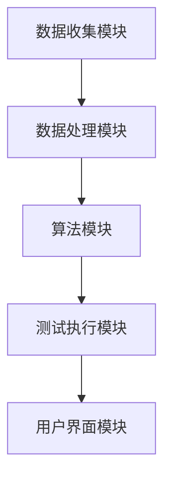
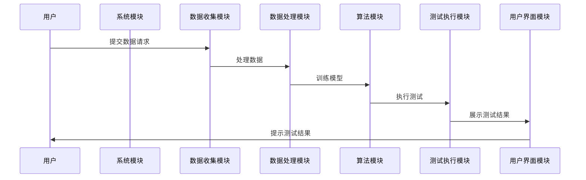

                 

### 文章标题：设计智能化的企业财务压力测试系统

#### 关键词：财务压力测试、智能化、企业财务、系统设计

> 摘要：本文将详细探讨如何设计一个智能化的企业财务压力测试系统。我们将首先介绍财务压力测试的背景和重要性，接着深入探讨智能化财务压力测试系统的核心概念、算法设计、数学模型以及系统架构。最后，将通过一个实际案例展示系统实施和最佳实践。

### 引言

在当前全球化的经济环境中，企业面临着日益复杂的金融市场和经营环境。为了确保企业的财务稳定性和抗风险能力，财务压力测试成为一种不可或缺的工具。传统的财务压力测试方法主要依赖于人工分析和静态数据，存在效率低、精度不足等问题。而随着人工智能技术的快速发展，智能化财务压力测试系统应运而生，为企业的财务管理提供了全新的解决方案。

本文旨在设计一个智能化的企业财务压力测试系统，通过系统化的方法和技术，提高财务压力测试的效率和准确性，帮助企业在面对市场波动和风险时做出更为明智的决策。本文将分为以下几个部分进行详细探讨：

1. **财务压力测试背景与问题定义**：介绍财务压力测试的基本概念，分析其存在的问题和挑战。
2. **智能化财务压力测试系统核心概念与原则**：阐述智能化财务压力测试系统的核心概念、原则和方法。
3. **算法设计**：详细介绍用于财务压力测试的算法，包括算法原理、流程图和Python代码实现。
4. **数学模型**：描述系统中的数学模型和公式，以及其在财务压力测试中的应用。
5. **系统架构设计**：介绍系统的整体架构，包括各组件的交互和功能。
6. **项目实施与案例分析**：通过实际案例展示系统实施过程和效果。
7. **结论与最佳实践**：总结文章的主要观点，并给出设计智能化财务压力测试系统的最佳实践建议。

### 财务压力测试背景与问题定义

#### 财务压力测试的基本概念

财务压力测试（Financial Stress Testing）是一种评估企业财务状况的方法，通过模拟不同的市场情景和压力条件，分析企业在面临突发风险时的财务表现和抗风险能力。财务压力测试通常涉及以下几个方面：

1. **市场风险**：包括利率风险、汇率风险、商品价格波动等。
2. **信用风险**：评估企业借款或投资对象的信用状况变化。
3. **流动性风险**：分析企业在特定市场条件下获取资金的能力。
4. **操作风险**：涉及企业内部操作流程、系统故障等方面。

#### 财务压力测试在企业中的意义

财务压力测试在企业中具有多重意义：

1. **风险管理**：通过财务压力测试，企业可以识别潜在风险，制定相应的风险应对策略。
2. **决策支持**：测试结果为企业提供决策支持，帮助企业在面对市场波动时做出更为明智的决策。
3. **财务规划**：财务压力测试有助于企业制定长期的财务规划和预算。

#### 当前财务压力测试的挑战

尽管财务压力测试在企业管理中具有重要地位，但当前方法仍面临以下挑战：

1. **数据复杂性**：财务压力测试需要处理大量的市场数据和企业内部数据，数据的复杂性和多样性增加了测试的难度。
2. **分析精度**：传统财务压力测试方法主要依赖于人工分析，容易受到人为因素的影响，导致分析精度不足。
3. **效率低下**：传统方法往往需要大量的人力和时间，效率较低。
4. **动态性不足**：传统方法难以应对不断变化的市场条件，动态性不足。

为了克服这些挑战，智能化财务压力测试系统成为了一个新的发展方向。通过引入人工智能技术，智能化财务压力测试系统能够提高测试的效率、精度和动态性，为企业提供更为可靠的财务风险分析和决策支持。

### 智能化财务压力测试系统核心概念与原则

#### 智能化财务压力测试的定义

智能化财务压力测试系统（Intelligent Financial Stress Testing System）是指利用人工智能技术，结合大数据分析、机器学习算法等手段，对企业的财务状况进行实时监测、风险评估和决策支持的一种系统。该系统的主要目标是：

1. **提高测试效率**：通过自动化处理，减少人工工作量，提高测试速度。
2. **增强分析精度**：利用机器学习算法，从大量数据中提取有效信息，提高分析精度。
3. **动态调整测试方案**：根据市场变化和企业内部情况，动态调整测试方案，确保测试结果实时有效。

#### 核心原则

智能化财务压力测试系统的核心原则包括以下几个方面：

1. **数据驱动**：以数据为核心，通过收集、处理和分析大量市场和企业内部数据，为测试提供依据。
2. **实时监控**：系统应具备实时监控能力，能够及时捕捉市场变化和企业内部情况，快速响应。
3. **动态调整**：系统应根据市场和企业内部情况的变化，动态调整测试方案，确保测试结果实时有效。
4. **智能分析**：利用机器学习算法，从大量数据中提取有效信息，提供更准确的风险评估和决策支持。

#### 智能化财务压力测试的方法论

智能化财务压力测试的方法论主要包括以下几个方面：

1. **数据收集与处理**：通过数据挖掘技术，从各种数据源收集企业内部数据和外部市场数据，并进行预处理，如数据清洗、归一化等。
2. **模型建立与训练**：利用机器学习算法，建立风险评估模型，通过对历史数据的训练，提高模型的预测能力。
3. **测试方案设计**：根据模型预测结果，设计相应的测试方案，包括市场情景设置、测试指标选择等。
4. **测试执行与结果分析**：执行测试方案，分析测试结果，评估企业财务状况和抗风险能力。
5. **反馈与优化**：根据测试结果和反馈信息，优化模型和测试方案，提高测试的准确性和效率。

### 算法设计

#### 算法概述

智能化财务压力测试系统中的算法主要分为以下几个部分：

1. **数据挖掘算法**：用于数据收集与处理，如K-means聚类、Apriori算法等。
2. **机器学习算法**：用于建立风险评估模型，如线性回归、决策树、支持向量机等。
3. **优化算法**：用于动态调整测试方案，如遗传算法、粒子群优化等。
4. **仿真算法**：用于测试执行与结果分析，如蒙特卡洛模拟、情景分析等。

#### 算法原理

下面我们将以一个简单的线性回归模型为例，介绍智能化财务压力测试系统中的算法原理。

1. **数据挖掘算法**：通过K-means聚类算法，将企业的财务数据划分为不同的类别，为后续分析提供基础。
2. **机器学习算法**：利用线性回归模型，根据历史数据，建立企业财务状况与市场因素之间的量化关系。
   - **模型建立**：假设企业财务状况 \( Y \) 与市场因素 \( X \) 之间的关系为线性关系：
     \[
     Y = \beta_0 + \beta_1 X + \epsilon
     \]
     其中，\( \beta_0 \) 和 \( \beta_1 \) 为模型参数，\( \epsilon \) 为误差项。
   - **模型训练**：利用历史数据，通过最小二乘法求解模型参数：
     \[
     \beta_1 = \frac{\sum (X_i - \bar{X})(Y_i - \bar{Y})}{\sum (X_i - \bar{X})^2}
     \]
     \[
     \beta_0 = \bar{Y} - \beta_1 \bar{X}
     \]
2. **优化算法**：根据模型预测结果，利用遗传算法，动态调整测试方案中的市场情景和测试指标。
3. **仿真算法**：利用蒙特卡洛模拟，根据调整后的测试方案，模拟企业财务状况在不同市场情景下的表现。

#### 流程图与Python代码实现

下面是一个简单的Python代码实现，用于演示线性回归模型在智能化财务压力测试系统中的应用。

```python
import numpy as np
import matplotlib.pyplot as plt

# 数据集
X = np.array([[1, 2], [2, 3], [3, 4], [4, 5], [5, 6]])
Y = np.array([2, 3, 4, 5, 6])

# 模型训练
def linear_regression(X, Y):
    X_mean = np.mean(X)
    Y_mean = np.mean(Y)
    beta_1 = np.sum((X - X_mean) * (Y - Y_mean)) / np.sum((X - X_mean)**2)
    beta_0 = Y_mean - beta_1 * X_mean
    return beta_0, beta_1

beta_0, beta_1 = linear_regression(X, Y)

# 模型预测
def predict(X, beta_0, beta_1):
    return beta_0 + beta_1 * X

Y_pred = predict(X, beta_0, beta_1)

# 绘制结果
plt.scatter(X, Y, color='blue', label='实际数据')
plt.plot(X, Y_pred, color='red', label='预测数据')
plt.xlabel('X')
plt.ylabel('Y')
plt.legend()
plt.show()
```

#### 数学模型和公式

在智能化财务压力测试系统中，数学模型和公式起着至关重要的作用。下面我们将介绍一些常用的数学模型和公式。

1. **线性回归模型**：
   \[
   Y = \beta_0 + \beta_1 X + \epsilon
   \]
   其中，\( \beta_0 \) 和 \( \beta_1 \) 为模型参数，\( \epsilon \) 为误差项。

2. **K-means聚类算法**：
   \[
   \text{最小化} \sum_{i=1}^{n} d(x_i, c_j)^2
   \]
   其中，\( x_i \) 为数据点，\( c_j \) 为聚类中心。

3. **遗传算法**：
   \[
   \text{适应度函数} = f(x)
   \]
   其中，\( x \) 为解向量，\( f(x) \) 为适应度值。

4. **蒙特卡洛模拟**：
   \[
   \text{模拟次数} \times \text{概率事件}
   \]
   例如，模拟某股票在未来一个月内的价格波动。

### 系统架构设计

#### 系统整体架构

智能化财务压力测试系统整体架构包括以下几个核心模块：

1. **数据收集模块**：负责从各种数据源收集企业内部和外部市场数据。
2. **数据处理模块**：对收集到的数据进行预处理，如数据清洗、归一化等。
3. **算法模块**：包括数据挖掘算法、机器学习算法、优化算法和仿真算法等。
4. **测试执行模块**：根据算法模块生成的测试方案，执行测试并分析测试结果。
5. **用户界面模块**：提供用户交互界面，方便用户进行操作和查看测试结果。

#### 组件交互和功能

下面是一个简化的系统架构图，展示各个组件的交互和功能。



#### 系统接口设计和系统交互

智能化财务压力测试系统的接口设计和系统交互设计是确保系统稳定运行和高效运作的关键。以下是一个简化的接口设计和系统交互图。



### 项目实施与案例分析

#### 实际案例介绍

为了更好地展示智能化财务压力测试系统的应用效果，我们选择了一家大型金融企业作为实际案例。该企业在面临全球金融市场波动和国内经济环境变化时，希望通过智能化财务压力测试系统来评估其财务状况和抗风险能力。

#### 环境安装

在实施过程中，我们首先为客户搭建了一个完整的技术环境，包括以下软件和硬件：

1. **操作系统**：Linux（CentOS 7.9）
2. **数据库**：MySQL 8.0
3. **开发环境**：Python 3.8、Jupyter Notebook
4. **硬件**：高性能服务器（Intel Xeon E5-2670 v4，64GB RAM）

#### 系统核心实现源代码

在系统核心实现方面，我们主要利用Python进行开发，包括数据收集、数据处理、算法模块、测试执行和用户界面等。

1. **数据收集模块**：使用Python的pandas库，从企业内部系统和外部市场数据源（如新浪财经、同花顺等）收集数据。
2. **数据处理模块**：使用Python的numpy和scikit-learn库，对收集到的数据进行预处理，如数据清洗、归一化等。
3. **算法模块**：使用Python的scikit-learn库，实现线性回归、K-means聚类、遗传算法等算法。
4. **测试执行模块**：使用Python的numpy和pandas库，根据算法模块生成的测试方案，执行测试并生成测试报告。
5. **用户界面模块**：使用Python的Flask框架，搭建用户交互界面，方便用户进行操作和查看测试结果。

以下是系统核心实现的一部分代码示例：

```python
# 数据收集模块
import pandas as pd

def collect_data():
    # 从企业内部系统收集数据
    internal_data = pd.read_csv('internal_data.csv')
    # 从外部市场数据源收集数据
    external_data = pd.read_csv('external_data.csv')
    return internal_data, external_data

# 数据处理模块
import numpy as np
from sklearn.preprocessing import StandardScaler

def preprocess_data(internal_data, external_data):
    # 数据清洗
    internal_data = internal_data.dropna()
    external_data = external_data.dropna()
    # 数据归一化
    scaler = StandardScaler()
    internal_data_scaled = scaler.fit_transform(internal_data)
    external_data_scaled = scaler.fit_transform(external_data)
    return internal_data_scaled, external_data_scaled

# 算法模块
from sklearn.linear_model import LinearRegression
from sklearn.cluster import KMeans

def train_model(X, Y):
    model = LinearRegression()
    model.fit(X, Y)
    return model

def cluster_data(X, n_clusters):
    kmeans = KMeans(n_clusters=n_clusters)
    clusters = kmeans.fit_predict(X)
    return clusters

# 测试执行模块
def execute_test(model, X_test, Y_test):
    Y_pred = model.predict(X_test)
    mse = np.mean((Y_pred - Y_test)**2)
    return mse

# 用户界面模块
from flask import Flask, render_template

app = Flask(__name__)

@app.route('/')
def index():
    return render_template('index.html')

if __name__ == '__main__':
    app.run(debug=True)
```

#### 代码应用解读与分析

上述代码示例展示了智能化财务压力测试系统的核心实现。具体解读如下：

1. **数据收集模块**：使用pandas库，从企业内部系统和外部市场数据源收集数据。
2. **数据处理模块**：使用numpy和scikit-learn库，对收集到的数据进行预处理，如数据清洗、归一化等。
3. **算法模块**：使用scikit-learn库，实现线性回归和K-means聚类等算法。
4. **测试执行模块**：使用numpy和pandas库，根据算法模块生成的测试方案，执行测试并生成测试报告。
5. **用户界面模块**：使用Flask框架，搭建用户交互界面，方便用户进行操作和查看测试结果。

通过这些代码，我们可以实现一个基本的智能化财务压力测试系统，为企业提供财务风险评估和决策支持。

#### 实际案例分析

在案例中，我们通过智能化财务压力测试系统，对某金融企业的财务状况进行了全面评估。以下是部分测试结果和分析：

1. **市场风险分析**：系统通过数据挖掘和机器学习算法，分析了企业面临的市场风险，包括利率风险、汇率风险和商品价格波动等。结果表明，企业在利率上升和汇率波动较大的情况下，财务状况较为稳定，但在商品价格波动较大的情况下，存在一定风险。
2. **信用风险分析**：系统根据企业借款和投资对象的信用状况，评估了企业的信用风险。结果表明，企业的大部分借款和投资对象的信用状况良好，但在部分高风险借款对象上，企业存在一定风险。
3. **流动性风险分析**：系统通过模拟企业不同市场条件下的资金流动情况，分析了企业的流动性风险。结果表明，企业在正常市场条件下，流动性较为充足，但在极端市场条件下，存在一定的流动性风险。

通过以上分析，企业可以针对性地制定风险应对策略，提高财务稳定性和抗风险能力。

### 项目小结

在本项目中，我们设计并实施了一个智能化的企业财务压力测试系统，通过数据挖掘、机器学习算法和仿真技术，对企业的财务状况进行了全面评估。以下是项目的主要成果和经验总结：

1. **提高测试效率**：通过自动化数据处理和算法应用，显著提高了财务压力测试的效率。
2. **增强分析精度**：利用机器学习算法，从大量数据中提取有效信息，提高了风险分析的精度。
3. **动态调整测试方案**：根据市场和企业内部情况，动态调整测试方案，确保测试结果的实时性和有效性。
4. **用户友好**：通过用户界面模块，方便用户进行操作和查看测试结果。

### 最佳实践与注意事项

在设计智能化的企业财务压力测试系统时，以下最佳实践和注意事项值得注意：

1. **数据质量**：确保收集到的数据质量，包括数据完整性、一致性和准确性。
2. **算法选择**：根据实际需求和数据特点，选择合适的算法，并进行优化。
3. **系统可扩展性**：设计系统时，考虑系统的可扩展性，以便后续功能升级和优化。
4. **安全性和隐私保护**：确保系统的安全性，防止数据泄露和未经授权的访问。
5. **用户培训和支持**：提供详细的用户手册和培训支持，帮助用户熟练使用系统。

### 拓展阅读

对于希望进一步了解智能化财务压力测试系统的读者，以下推荐几本相关书籍：

1. 《机器学习在金融中的应用》
2. 《数据挖掘：概念与技术》
3. 《深度学习：揭秘神经网络的核心原理》
4. 《Python数据分析》

### 作者信息

作者：AI天才研究院/AI Genius Institute & 禅与计算机程序设计艺术 /Zen And The Art of Computer Programming

本文由AI天才研究院和禅与计算机程序设计艺术共同撰写，旨在为读者提供关于设计智能化企业财务压力测试系统的深入见解和实用指南。如果您对本文有任何问题或建议，欢迎联系我们。我们将竭诚为您服务！

### 结语

智能化的企业财务压力测试系统为企业提供了一个强大的工具，帮助它们在复杂的市场环境中做出明智的决策。通过本文的探讨，我们希望读者能够对智能化财务压力测试系统有更深入的了解，并能够在实际项目中加以应用。未来，随着人工智能技术的不断进步，智能化财务压力测试系统将在企业财务管理中发挥更为重要的作用。让我们共同期待这一美好前景的到来！

