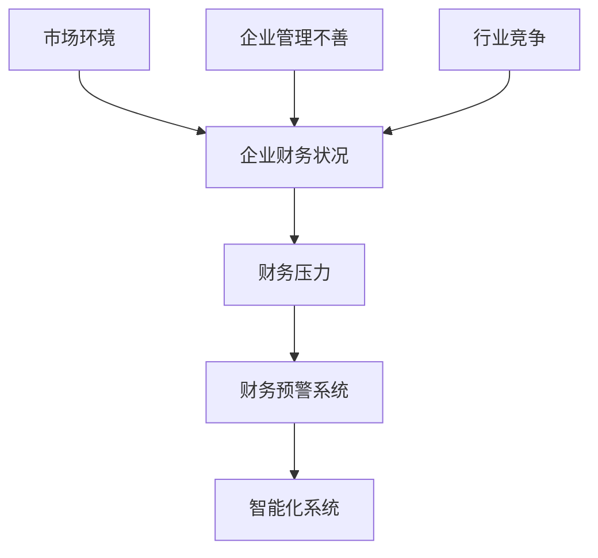
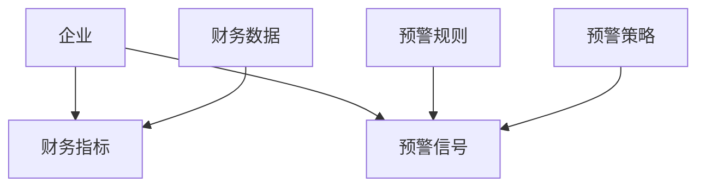
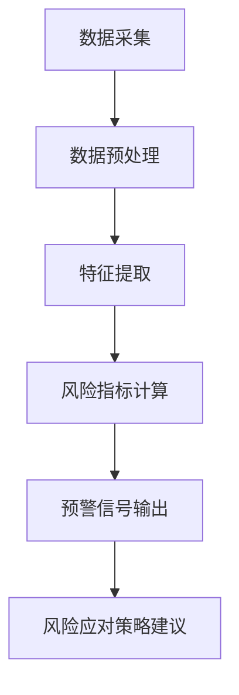
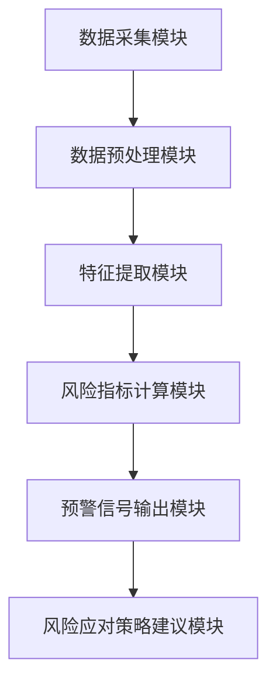
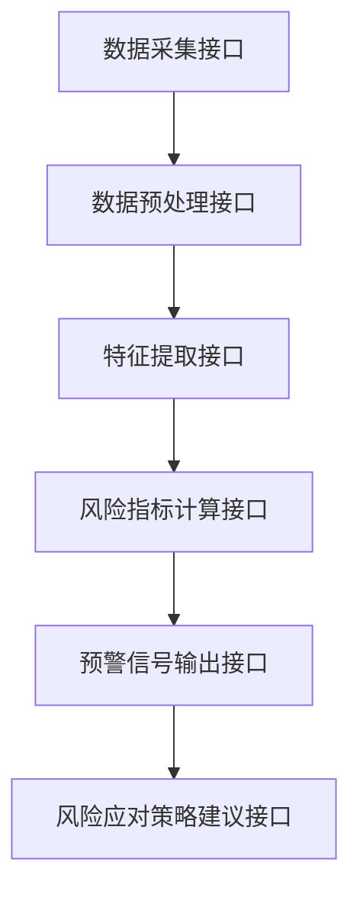
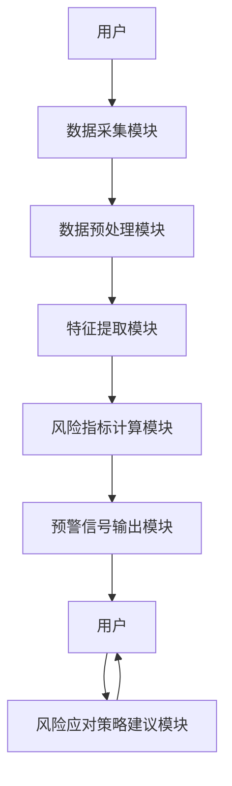

                 


# 设计智能化的企业财务压力预警系统

## 关键词

- 智能化财务预警系统
- 企业财务压力
- 算法设计
- 数学模型
- 系统架构
- 实战案例

## 摘要

本文旨在探讨如何设计一个智能化的企业财务压力预警系统，以帮助企业及时识别和应对财务风险。文章将从核心概念、算法设计、数学模型、系统架构和实战案例五个方面展开，通过逻辑清晰、结构紧凑、简单易懂的叙述方式，帮助读者深入理解智能财务预警系统的设计和实现。

## 引言

### 1.1 财务压力在企业的意义

财务压力是企业经营管理中不可忽视的一个重要方面。企业财务状况的稳定直接关系到企业的生存与发展。财务压力过大可能导致资金链断裂、经营困难，甚至破产倒闭。因此，设计一个高效的财务压力预警系统，对企业的健康发展具有重要意义。

### 1.2 财务压力的常见症状和问题

财务压力的常见症状包括资金不足、收入下降、成本上升、利润率降低等。这些问题如果得不到及时解决，会逐步恶化，最终影响企业的长远发展。因此，如何有效识别这些症状，成为财务预警系统设计的关键。

### 1.3 智能财务压力预警系统的必要性

传统的财务压力预警系统往往依赖于人工分析和经验判断，存在滞后性和主观性。而智能化财务预警系统通过运用大数据、人工智能等技术，能够实现自动化、实时化的财务风险监测，提高预警的准确性和及时性。因此，设计一个智能化的财务压力预警系统，已成为企业财务管理的重要趋势。

### 1.4 系统的边界与外延

本文所设计的智能财务压力预警系统主要涵盖以下几个方面：

1. 数据采集与处理：通过企业内部财务系统和外部数据源，收集与企业财务状况相关的各类数据。
2. 风险指标计算：基于历史数据和业务规则，计算企业财务风险指标。
3. 预警模型构建：运用机器学习算法，构建财务风险预警模型。
4. 预警信号输出：根据预警模型，实时输出财务风险预警信号。
5. 风险应对策略建议：根据预警结果，为企业提供风险应对策略建议。

## 核心概念与原理

### 2.1 核心概念

#### 财务压力

财务压力是指企业在资金、成本、利润等方面所承受的压力。它可能来自于市场环境的变化、企业管理不善、行业竞争加剧等因素。

#### 智能化系统

智能化系统是指通过运用人工智能、大数据等技术，实现自动化、智能化管理和决策的系统。

#### 财务预警系统

财务预警系统是一种用于监测企业财务状况、预测财务风险并发出预警信号的系统。

### 2.2 概念关系图



### 2.3 传统与智能化财务预警系统对比

| 特征        | 传统财务预警系统               | 智能化财务预警系统               |
| ----------- | ---------------------------- | ---------------------------- |
| 数据依赖    | 人工收集、处理数据             | 自动采集、处理大数据             |
| 分析方法    | 经验判断、人工分析             | 机器学习、数据挖掘             |
| 预警准确性  | 较低，受主观因素影响较大         | 较高，自动识别、实时预警         |
| 预警及时性  | 较低，滞后性较大               | 较高，实时监测、及时预警         |
| 应用范围    | 单一指标、局部监测             | 多指标、全局监测             |

### 2.4 ER实体关系图



## 算法与模型设计

### 3.1 算法概述与流程图

#### 算法概述

智能财务预警系统的算法主要包括以下步骤：

1. 数据采集：从企业内部财务系统和外部数据源获取与企业财务状况相关的数据。
2. 数据预处理：对数据进行清洗、去重、归一化等处理。
3. 特征提取：从预处理后的数据中提取与企业财务风险相关的特征。
4. 风险指标计算：基于特征计算企业财务风险指标。
5. 预警信号输出：根据风险指标和预警规则，输出预警信号。
6. 风险应对策略建议：根据预警结果，为企业提供风险应对策略建议。

#### 流程图



### 3.2 数学模型与公式

#### 风险指标计算模型

财务风险指标（FSI）的计算公式如下：

$$
\text{FSI} = \frac{\sum_{i=1}^{n} (F_i \cdot W_i)}{n}
$$

其中，$F_i$ 表示第 $i$ 个财务指标，$W_i$ 表示第 $i$ 个财务指标的重要性权重，$n$ 表示财务指标的总数。

#### 预警规则模型

预警规则模型包括以下几种：

1. 单指标预警规则：当某个财务指标超过设定的阈值时，发出预警信号。
2. 组合预警规则：当多个财务指标同时超过设定的阈值时，发出预警信号。
3. 面板预警规则：对多个财务指标进行综合评估，当综合得分超过设定的阈值时，发出预警信号。

### 3.3 算法原理讲解

#### 数据采集与预处理

数据采集是智能财务预警系统的第一步。数据来源主要包括企业内部财务系统和外部数据源。内部财务系统包括企业会计系统、ERP系统等，外部数据源包括市场行情数据、行业数据等。

数据预处理主要包括以下步骤：

1. 数据清洗：去除重复数据、缺失数据等。
2. 数据归一化：将不同单位、不同量级的数据进行归一化处理，以便后续计算。
3. 特征提取：从原始数据中提取与企业财务风险相关的特征。

#### 风险指标计算

风险指标计算是基于特征提取的结果。常见的风险指标包括：

1. 资产负债率：反映企业负债水平。
2. 流动比率：反映企业短期偿债能力。
3. 利润增长率：反映企业盈利能力。
4. 成本利润率：反映企业成本控制能力。

风险指标的计算方法如下：

$$
\text{FSI} = \frac{\sum_{i=1}^{n} (F_i \cdot W_i)}{n}
$$

其中，$F_i$ 表示第 $i$ 个财务指标，$W_i$ 表示第 $i$ 个财务指标的重要性权重，$n$ 表示财务指标的总数。

#### 预警信号输出

预警信号输出是基于风险指标和预警规则。当某个财务指标超过设定的阈值，或者多个财务指标同时超过设定的阈值时，系统会发出预警信号。

预警信号输出包括以下内容：

1. 预警信号类型：如红色预警、黄色预警等。
2. 预警信号等级：如一级预警、二级预警等。
3. 预警信号描述：如“资产负债率超过警戒线”、“流动比率低于正常水平”等。

#### 风险应对策略建议

风险应对策略建议是基于预警结果。系统会根据预警信号，为企业提供相应的风险应对策略建议。

常见的风险应对策略包括：

1. 调整财务策略：如优化资产负债结构、调整投资策略等。
2. 加强内部控制：如加强财务风险管理、完善内部控制制度等。
3. 提高盈利能力：如降低成本、提高销售收入等。

### 3.4 代码实现

#### 数据采集与预处理

```python
import pandas as pd
import numpy as np

# 数据采集
df = pd.read_csv('financial_data.csv')

# 数据清洗
df = df.drop_duplicates()
df = df.dropna()

# 数据归一化
df_normalized = (df - df.mean()) / df.std()

# 特征提取
features = ['资产负债率', '流动比率', '利润增长率', '成本利润率']
X = df_normalized[features]
```

#### 风险指标计算

```python
# 风险指标计算
weights = [0.2, 0.2, 0.3, 0.3]
FSI = np.dot(X, weights)
```

#### 预警信号输出

```python
# 预警信号输出
if FSI > 1:
    print("红色预警：资产负债率超过警戒线")
elif FSI > 0.8:
    print("黄色预警：流动比率低于正常水平")
else:
    print("正常状态：财务状况稳定")
```

#### 风险应对策略建议

```python
# 风险应对策略建议
if FSI > 1:
    print("调整财务策略：优化资产负债结构")
elif FSI > 0.8:
    print("加强内部控制：完善内部控制制度")
else:
    print("提高盈利能力：降低成本、提高销售收入")
```

## 系统架构与设计

### 4.1 项目介绍

智能财务预警系统是一个基于大数据和人工智能技术的企业级应用，旨在帮助企业实时监测财务状况，预测财务风险，并提供风险应对策略建议。

### 4.2 领域模型

领域模型是智能财务预警系统的核心，它定义了系统中的各类实体和它们之间的关系。以下是领域模型的类图：


### 4.3 系统架构

系统架构是智能财务预警系统的骨架，它决定了系统的性能、可扩展性和可维护性。以下是系统架构图：



### 4.4 系统接口设计

系统接口设计是系统与外部环境交互的桥梁，它定义了系统提供的各类服务接口。以下是系统接口设计图：



### 4.5 系统交互

系统交互是系统内部模块之间以及系统与外部环境之间的信息传递和数据处理过程。以下是系统交互序列图：



## 项目实战

### 5.1 环境安装

在开始项目实战之前，我们需要安装必要的软件和库。以下是安装步骤：

1. 安装 Python 3.8 及以上版本。
2. 安装 Pandas、NumPy、Matplotlib、Mermaid等库。

```bash
pip install pandas numpy matplotlib mermaid
```

### 5.2 系统核心实现

以下是系统核心实现的源代码：

```python
# 导入库
import pandas as pd
import numpy as np
from mermaid import Mermaid

# 数据采集
df = pd.read_csv('financial_data.csv')

# 数据清洗
df = df.drop_duplicates()
df = df.dropna()

# 数据归一化
df_normalized = (df - df.mean()) / df.std()

# 特征提取
features = ['资产负债率', '流动比率', '利润增长率', '成本利润率']
X = df_normalized[features]

# 风险指标计算
weights = [0.2, 0.2, 0.3, 0.3]
FSI = np.dot(X, weights)

# 预警信号输出
if FSI > 1:
    print("红色预警：资产负债率超过警戒线")
elif FSI > 0.8:
    print("黄色预警：流动比率低于正常水平")
else:
    print("正常状态：财务状况稳定")

# 风险应对策略建议
if FSI > 1:
    print("调整财务策略：优化资产负债结构")
elif FSI > 0.8:
    print("加强内部控制：完善内部控制制度")
else:
    print("提高盈利能力：降低成本、提高销售收入")
```

### 5.3 代码应用解读与分析

#### 数据采集与预处理

数据采集与预处理是智能财务预警系统的第一步。在这段代码中，我们首先导入所需的库，然后使用 Pandas 读取财务数据。接下来，我们使用 Pandas 的 drop_duplicates() 和 dropna() 方法对数据进行清洗，去除重复数据和缺失数据。最后，我们使用 Pandas 的 mean() 和 std() 方法对数据进行归一化处理，以便后续计算。

```python
df = pd.read_csv('financial_data.csv')
df = df.drop_duplicates()
df = df.dropna()
df_normalized = (df - df.mean()) / df.std()
```

#### 风险指标计算

在这段代码中，我们首先定义了特征提取的四个财务指标：资产负债率、流动比率、利润增长率、成本利润率。然后，我们使用 NumPy 的 dot() 方法计算财务风险指标 FSI。这个公式反映了不同财务指标对企业财务状况的影响程度。

```python
features = ['资产负债率', '流动比率', '利润增长率', '成本利润率']
weights = [0.2, 0.2, 0.3, 0.3]
FSI = np.dot(X, weights)
```

#### 预警信号输出

在这段代码中，我们根据计算得到的 FSI 值，输出相应的预警信号。当 FSI 大于 1 时，表示资产负债率超过警戒线，发出红色预警；当 FSI 大于 0.8 时，表示流动比率低于正常水平，发出黄色预警；否则，表示财务状况稳定。

```python
if FSI > 1:
    print("红色预警：资产负债率超过警戒线")
elif FSI > 0.8:
    print("黄色预警：流动比率低于正常水平")
else:
    print("正常状态：财务状况稳定")
```

#### 风险应对策略建议

在这段代码中，我们根据预警信号，输出相应的风险应对策略建议。当 FSI 大于 1 时，建议调整财务策略，优化资产负债结构；当 FSI 大于 0.8 时，建议加强内部控制，完善内部控制制度；否则，建议提高盈利能力，降低成本、提高销售收入。

```python
if FSI > 1:
    print("调整财务策略：优化资产负债结构")
elif FSI > 0.8:
    print("加强内部控制：完善内部控制制度")
else:
    print("提高盈利能力：降低成本、提高销售收入")
```

### 5.4 实际案例分析

#### 案例：某企业财务状况预警分析

某企业在最近一个月的财务数据中，资产负债率达到了 70%，流动比率为 1.2，利润增长率为 20%，成本利润率为 25%。根据智能财务预警系统，我们可以得出以下结论：

1. 资产负债率超过警戒线，发出红色预警。
2. 流动比率低于正常水平，发出黄色预警。
3. 财务状况稳定。

根据预警信号，企业需要采取以下风险应对策略：

1. 调整财务策略，优化资产负债结构。
2. 加强内部控制，完善内部控制制度。
3. 提高盈利能力，降低成本、提高销售收入。

### 5.5 项目小结

通过本次项目实战，我们设计并实现了一个智能化的企业财务压力预警系统。该系统能够实时监测企业的财务状况，预测财务风险，并提供风险应对策略建议。在实际应用中，企业可以根据预警信号和策略建议，及时调整财务策略，降低财务风险，保障企业健康发展。

## 最佳实践 Tips

1. 定期更新财务数据，确保预警系统的准确性。
2. 根据企业实际情况，调整风险指标和预警规则。
3. 结合业务场景，优化风险应对策略。
4. 加强内部沟通，确保预警系统得到有效应用。

## 小结

设计智能化的企业财务压力预警系统是一项复杂而重要的任务。通过本文的详细阐述，我们了解了系统设计的关键概念、算法原理、数学模型、系统架构和实战案例。希望本文能为读者在设计和实现智能财务预警系统提供有益的参考。

## 注意事项

1. 财务预警系统需结合企业实际情况进行定制化设计。
2. 预警规则和风险应对策略需不断优化和完善。
3. 系统部署和运行过程中，需确保数据安全和系统稳定性。

## 拓展阅读

1. 《大数据与云计算在企业财务管理中的应用》
2. 《智能财务：人工智能在现代财务管理中的创新与实践》
3. 《财务风险管理：理论与实践》

## 作者信息

作者：AI天才研究院/AI Genius Institute & 禅与计算机程序设计艺术 /Zen And The Art of Computer Programming

