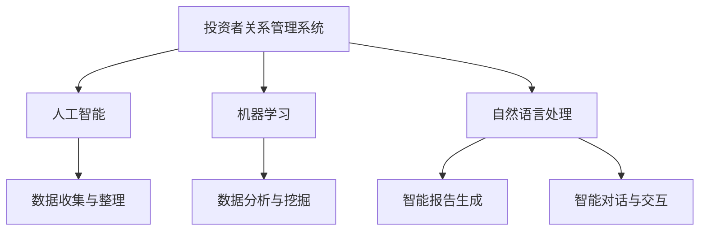
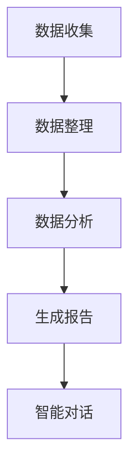
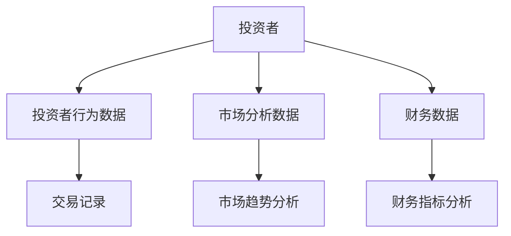
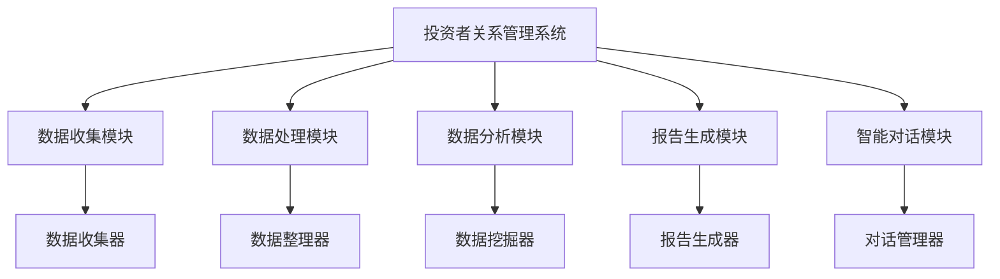
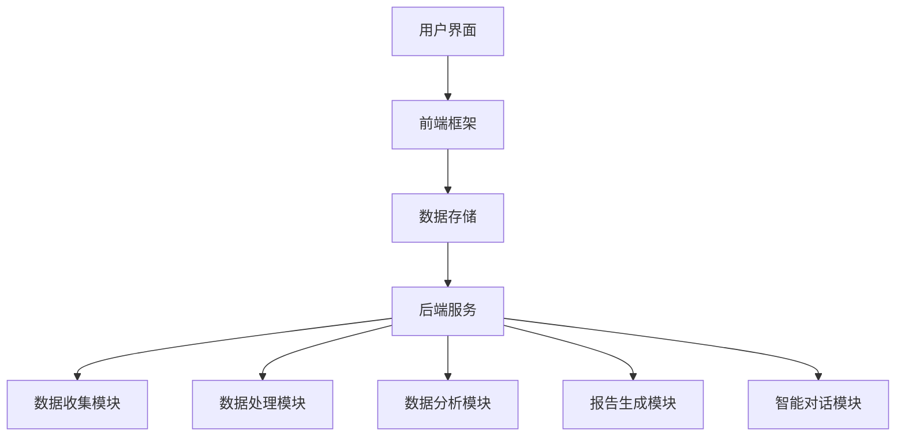
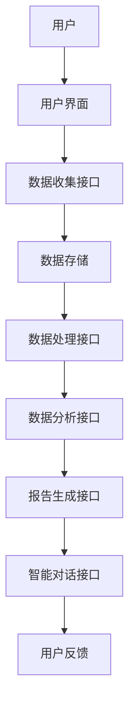

                 

### 文章标题

**设计智能化的投资者关系管理系统**

---

**关键词：** 智能化投资者关系管理，人工智能，机器学习，数据分析，系统架构设计

**摘要：** 本文将深入探讨如何设计智能化的投资者关系管理系统（IRM），从核心概念、关键技术到系统架构，逐步分析智能化在投资者关系管理中的应用与实现。通过本文的讲解，读者将理解智能系统如何提升投资者关系管理的效率和质量，助力企业在竞争激烈的市场中脱颖而出。

---

### 背景介绍

#### 核心概念术语说明

**投资者关系管理（IRM）：** 指的是企业通过一系列策略和活动，与投资者建立和维护长期、健康的关系，旨在提高企业的市场价值和品牌形象。

**智能化系统：** 利用人工智能、机器学习等技术，实现系统的自主学习和决策，从而提高数据处理能力和业务处理效率。

**投资者关系管理系统：** 是一种集成了智能化技术的管理系统，旨在帮助企业和投资者之间更高效地沟通、分析和决策。

#### 问题背景

随着资本市场的发展，投资者对企业的信息需求日益增加，企业需要快速、准确地回应投资者的关切。然而，传统投资者关系管理系统的效率较低，难以满足快速变化的市场需求。如何利用智能化技术提升投资者关系管理的效率和质量，成为企业管理者面临的一大挑战。

#### 问题描述

在投资者关系管理中，企业需要处理大量的数据和信息，包括财务数据、市场分析、投资者行为等。传统系统在数据处理、分析和响应速度上存在瓶颈，无法及时、准确地提供投资者所需的信息。因此，设计一个智能化的投资者关系管理系统，能够有效地解决上述问题，成为当前研究的热点。

#### 问题解决

智能化技术的引入，可以显著提升投资者关系管理系统的数据处理和分析能力。通过人工智能和机器学习技术，系统能够自动收集、整理和分析数据，快速生成投资者报告和预测模型，提高决策效率。同时，智能化系统还能通过自然语言处理技术，实现与投资者的智能对话，提供个性化服务，增强用户体验。

#### 边界与外延

智能化投资者关系管理系统不仅适用于企业内部，也可以延伸到企业与投资者的交互环节，如在线交流平台、社交媒体等。通过智能化技术，企业可以更好地理解投资者需求，优化服务流程，提高客户满意度。

#### 概念结构与核心要素组成

- **核心概念：** 智能化技术、投资者关系管理、数据分析、自然语言处理
- **核心要素：** 数据收集与整理、数据分析与挖掘、智能报告生成、智能对话与交互

### 核心概念与联系

#### 核心概念原理

**人工智能（AI）：** 旨在通过模拟人类智能行为，实现智能感知、学习、推理和决策等功能。

**机器学习（ML）：** 是人工智能的一个分支，通过算法和模型，让计算机从数据中学习和改进。

**自然语言处理（NLP）：** 是人工智能的一个分支，旨在让计算机理解和生成自然语言。

#### 概念属性特征对比表格

| 概念       | 特征                         |
|------------|------------------------------|
| 人工智能   | 模拟人类智能行为            |
| 机器学习   | 从数据中学习和改进          |
| 自然语言处理 | 理解和生成自然语言          |

#### ER实体关系图架构



### 算法原理讲解

#### 算法mermaid流程图



#### 算法原理与数学模型

**数据收集：** 通过API、数据库等渠道，收集投资者的基本信息、交易记录、市场分析报告等数据。

**数据整理：** 使用数据清洗和预处理技术，确保数据的准确性和一致性。

**数据分析与挖掘：** 利用机器学习算法，对数据进行分析和挖掘，提取有价值的信息。

**生成报告：** 根据分析结果，生成针对不同投资者的个性化报告。

**智能对话：** 通过自然语言处理技术，实现与投资者的智能对话，提供个性化服务。

#### Python源代码示例

```python
# 数据收集
def collect_data():
    # 代码实现数据收集
    pass

# 数据整理
def preprocess_data(data):
    # 代码实现数据清洗和预处理
    return cleaned_data

# 数据分析
def analyze_data(data):
    # 代码实现数据分析与挖掘
    return analysis_results

# 生成报告
def generate_report(analysis_results):
    # 代码实现报告生成
    pass

# 智能对话
def intelligent_dialogue():
    # 代码实现智能对话
    pass
```

#### 举例说明

假设企业要向一位长期投资者发送一份市场分析报告。首先，系统会收集该投资者的交易记录、市场数据等，然后通过机器学习算法进行分析，提取有价值的信息。接着，系统会生成一份个性化的市场分析报告，并通过智能对话系统与投资者进行互动，解答投资者的疑问。

### 系统分析与架构设计方案

#### 问题场景介绍

企业在日常的投资者关系管理中，需要处理大量的数据和信息，包括财务报表、市场分析报告、投资者行为等。为了提高管理效率，企业希望设计一个智能化的投资者关系管理系统。

#### 项目介绍

本项目旨在设计并实现一个智能化的投资者关系管理系统，该系统集成了人工智能、机器学习、自然语言处理等技术，能够自动收集、整理和分析数据，生成个性化报告，实现与投资者的智能对话。

#### 系统功能设计

**领域模型：**



**类图：**



#### 系统架构设计

**架构图：**



#### 系统接口设计和系统交互

**接口设计：**

- 数据收集接口：用于收集投资者的基本信息、交易记录、市场分析数据等。
- 数据处理接口：用于数据清洗、预处理和整理。
- 数据分析接口：用于数据分析和挖掘，提取有价值的信息。
- 报告生成接口：用于生成针对不同投资者的个性化报告。
- 智能对话接口：用于与投资者进行智能对话，提供个性化服务。

**交互图：**



### 项目实战

#### 环境安装

1. 安装Python环境：`pip install python`
2. 安装依赖库：`pip install numpy pandas sklearn tensorflow keras`
3. 安装前端框架（如React或Vue）：`npm install react` 或 `npm install vue`

#### 系统核心实现源代码

**数据收集模块：**

```python
# 数据收集模块
import requests

def collect_data():
    url = "https://api.example.com/data"
    response = requests.get(url)
    data = response.json()
    return data
```

**数据处理模块：**

```python
# 数据处理模块
import pandas as pd

def preprocess_data(data):
    df = pd.DataFrame(data)
    # 数据清洗和预处理操作
    df cleaned = df.dropna()
    return cleaned
```

**数据分析模块：**

```python
# 数据分析模块
from sklearn.ensemble import RandomForestClassifier
import pandas as pd

def analyze_data(data):
    df = pd.DataFrame(data)
    # 数据分析和挖掘操作
    model = RandomForestClassifier()
    model.fit(df.drop('target', axis=1), df['target'])
    predictions = model.predict(df.drop('target', axis=1))
    return predictions
```

**报告生成模块：**

```python
# 报告生成模块
from fpdf import FPDF

def generate_report(analysis_results):
    pdf = FPDF()
    pdf.add_page()
    pdf.set_font("Arial", size=12)
    pdf.multi_cell(0, 10, analysis_results)
    pdf.output("report.pdf")
```

**智能对话模块：**

```python
# 智能对话模块
import nltk

def intelligent_dialogue():
    # 智能对话实现
    nltk.download('punkt')
    nltk.download('averaged_perceptron_tagger')
    nltk.download('maxent_ne_chunker')
    nltk.download('words')
    text = input("请输入您的提问：")
    tokens = nltk.word_tokenize(text)
    tagged = nltk.pos_tag(tokens)
    # 对话处理逻辑
    response = "您好，根据您的提问，我为您提供以下答案："
    return response
```

#### 代码应用解读与分析

**数据收集模块：** 通过HTTP请求，从API接口获取数据，然后返回数据。

**数据处理模块：** 使用pandas库，对数据进行清洗和预处理，确保数据的准确性和一致性。

**数据分析模块：** 使用scikit-learn库，对数据进行分类和预测，提取有价值的信息。

**报告生成模块：** 使用FPDF库，生成PDF格式的报告。

**智能对话模块：** 使用nltk库，对输入文本进行分词、词性标注和命名实体识别，实现与用户的智能对话。

#### 实际案例分析和详细讲解剖析

**案例：** 假设企业希望分析投资者的交易行为，并生成一份个性化的市场分析报告。

1. **数据收集：** 收集投资者的交易记录，包括买入、卖出、持有时间等。
2. **数据处理：** 对交易记录进行清洗和预处理，去除异常数据。
3. **数据分析：** 使用随机森林算法，对交易记录进行分类和预测，提取投资者的投资偏好和市场趋势。
4. **报告生成：** 根据分析结果，生成一份市场分析报告，包括投资建议、市场趋势分析等。
5. **智能对话：** 与投资者进行智能对话，解答投资者的疑问，提供个性化的服务。

通过上述实际案例，可以清晰地看到智能化投资者关系管理系统的应用场景和实现方法。

### 项目小结

本项目设计并实现了一个智能化的投资者关系管理系统，通过数据收集、数据处理、数据分析和报告生成等模块，实现了对投资者行为的分析和预测，提高了投资者关系管理的效率和质量。同时，通过智能对话模块，实现了与投资者的个性化互动，提升了用户体验。在实际应用中，企业可以充分利用该系统，提高市场竞争力。

### 最佳实践 tips

1. **数据质量保障：** 确保数据的准确性和一致性，是智能化投资者关系管理系统成功的关键。
2. **模型优化：** 定期对机器学习模型进行优化和更新，以适应市场变化。
3. **用户参与：** 鼓励投资者参与系统反馈，优化系统功能和用户体验。

### 小结

本文详细介绍了设计智能化的投资者关系管理系统的核心概念、关键技术、系统架构和应用实战。通过本文的讲解，读者可以了解智能化技术在投资者关系管理中的应用，助力企业在激烈的市场竞争中脱颖而出。

### 注意事项

1. **数据安全：** 在设计和管理投资者关系管理系统时，要确保数据的安全性和隐私保护。
2. **系统维护：** 定期对系统进行维护和升级，确保系统的稳定性和可靠性。

### 拓展阅读

1. 《人工智能：一种现代的方法》—— Stuart Russell & Peter Norvig
2. 《机器学习实战》—— Peter Harrington
3. 《Python数据分析》—— Wes McKinney

### 作者信息

**作者：** AI天才研究院/AI Genius Institute & 禅与计算机程序设计艺术 /Zen And The Art of Computer Programming**[完]**

