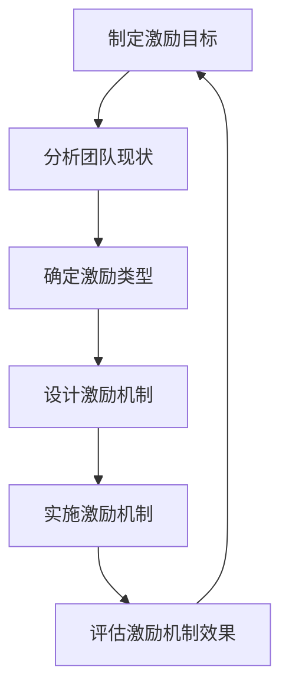
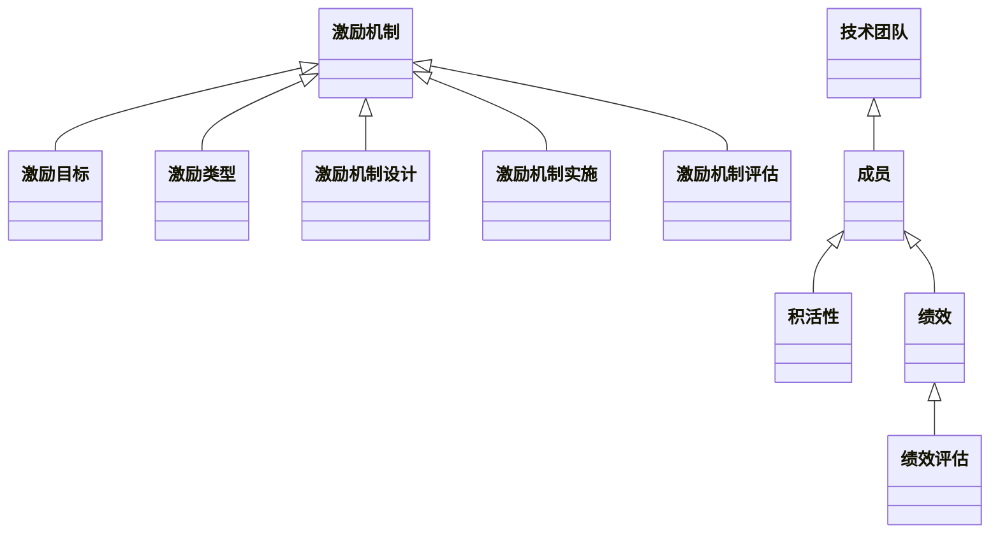
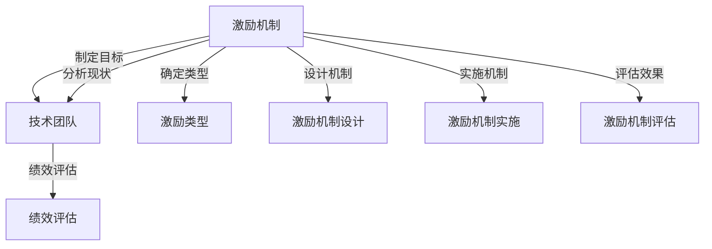
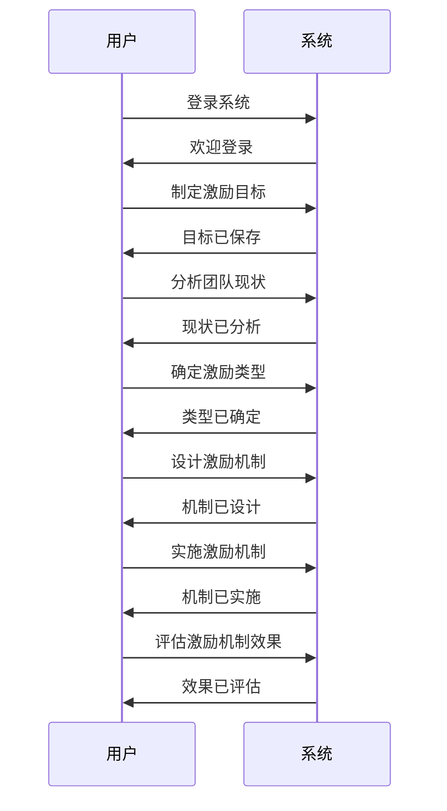

                 


### 设计有效的技术团队激励机制

摘要：在现代企业中，技术团队是推动业务创新和发展的关键力量。如何设计有效的激励机制，激发团队成员的积极性，提高团队整体绩效，成为企业面临的挑战。本文将探讨如何通过制定激励目标、分析团队现状、确定激励类型、设计激励机制、实施激励机制和评估激励机制效果等步骤，来设计有效的技术团队激励机制。

## 第一部分：背景介绍与问题背景

### 1.1 问题背景

在现代企业中，技术团队是推动业务创新和发展的关键力量。他们负责技术开发、产品设计和业务支持，是企业核心竞争力的重要组成部分。然而，如何激发团队成员的积极性、提高团队整体绩效，成为企业面临的挑战。

### 1.2 问题描述

问题描述涉及激励机制的设计与实施，包括以下几个方面：

1. 如何制定激励目标？
2. 如何分析团队现状？
3. 如何确定激励类型？
4. 如何设计激励机制？
5. 如何实施激励机制？
6. 如何评估激励机制效果？

### 1.3 问题解决

本文将围绕上述问题，通过以下步骤来设计有效的技术团队激励机制：

1. 制定激励目标
2. 分析团队现状
3. 确定激励类型
4. 设计激励机制
5. 实施激励机制
6. 评估激励机制效果

### 1.4 边界与外延

本文主要关注技术团队激励机制的设计与实施，但不涉及其他类型团队的激励机制。

### 1.5 概念结构与核心要素组成

概念结构包括以下几个核心要素：

1. 激励机制：调动成员积极性的手段
2. 技术团队：由技术人员组成，负责技术研发和业务支持
3. 绩效：成员在工作中的表现和成果
4. 积极性：成员对工作的热情和投入程度

## 第二部分：核心概念与联系

### 2.1 激励机制

#### 2.1.1 定义

激励机制是指通过一定的方法和手段，调动团队成员的积极性，提高团队整体绩效的过程。

#### 2.1.2 原理

激励机制基于人的行为心理学原理，通过满足团队成员的需求，激发他们的工作热情和积极性。

#### 2.1.3 目标

激励机制的目的是提高团队成员的积极性、提升团队绩效、促进业务发展。

#### 2.1.4 类型

激励机制可分为物质激励、精神激励、荣誉激励等类型。

#### 2.1.5 实施策略

激励机制的实施策略包括设定目标、制定考核标准、奖励与惩罚等。

### 2.2 技术团队

#### 2.2.1 定义

技术团队是由技术人员组成，负责技术研发和业务支持的专业团队。

#### 2.2.2 角色

技术团队的成员通常包括研发工程师、产品经理、测试工程师等。

#### 2.2.3 职责

技术团队的职责包括技术开发、产品设计和业务支持等。

#### 2.2.4 工作方式

技术团队的工作方式通常包括团队合作、项目管理、技术交流等。

#### 2.2.5 团队文化

技术团队需要建立积极向上的团队文化，促进团队成员之间的沟通与合作。

### 2.3 绩效

#### 2.3.1 定义

绩效是指成员在工作中的表现和成果。

#### 2.3.2 评估标准

绩效评估标准包括工作量、质量、创新能力、团队协作等。

#### 2.3.3 考核方式

绩效考核方式包括定期考核、项目考核、360度考核等。

#### 2.3.4 改进方法

针对绩效评估中发现的问题，可以采取培训、激励、调整岗位等措施进行改进。

### 2.4 积极性

#### 2.4.1 定义

积极性是指成员对工作的热情和投入程度。

#### 2.4.2 激发方法

激发积极性的方法包括设定目标、奖励、认可、团队建设等。

#### 2.4.3 维持策略

维持积极性的策略包括营造良好的工作环境、提供发展机会、关注成员需求等。

### 2.5 概念属性特征对比表格

| 概念     | 定义                                       | 属性特征                                                     |
|----------|--------------------------------------------|--------------------------------------------------------------|
| 激励机制 | 调动成员积极性的手段                       | 目标、类型、实施策略、效果评估等                             |
| 技术团队 | 由技术人员组成，负责技术研发和业务支持     | 成员角色、职责、工作方式、团队文化等                         |
| 绩效     | 成员在工作中的表现和成果                   | 评估标准、考核方式、改进方法、激励效果等                     |
| 积极性   | 成员对工作的热情和投入程度                 | 激发方法、维持策略、工作环境、激励效果等                     |

### 2.6 ER实体关系图架构


## 第三部分：算法原理讲解

### 3.1 算法原理讲解

在本部分，我们将介绍如何设计有效的技术团队激励机制，以激发团队成员的积极性，提高团队整体绩效。

### 3.2 算法原理详细讲解

#### 3.2.1 激励机制设计算法

设计有效的激励机制需要考虑以下几个方面：

1. 确定激励目标
2. 分析团队现状
3. 确定激励类型
4. 设计激励机制
5. 实施激励机制
6. 评估激励机制效果

#### 3.2.2 数学模型和公式

1. 激励目标设定

$$ 目标 = 贡献度 \times 激励系数 $$

其中，贡献度表示成员对团队的整体贡献，激励系数表示激励效果。

2. 绩效评估

$$ 绩效 = \sum_{i=1}^{n} (p_i \times w_i) $$

其中，$ p_i $表示第 $ i $个成员的积极性，$ w_i $表示第 $ i $个成员的工作量。

3. 积极性评估

$$ 积极性 = \sum_{i=1}^{n} (e_i \times r_i) $$

其中，$ e_i $表示第 $ i $个成员的绩效，$ r_i $表示第 $ i $个成员的奖励。

#### 3.2.3 算法举例说明

假设有一个技术团队，成员数量为 5，每个成员的积极性、绩效和奖励如下表所示：

| 成员 | 积活性 | 绩效 | 奖励 |
|------|--------|------|------|
| A    | 0.8    | 0.9  | 0.1  |
| B    | 0.7    | 0.8  | 0.2  |
| C    | 0.6    | 0.7  | 0.3  |
| D    | 0.5    | 0.6  | 0.4  |
| E    | 0.4    | 0.5  | 0.5  |

根据上述算法原理，可以计算出每个成员的激励目标和积极性：

| 成员 | 激励目标 | 积极性 |
|------|-----------|--------|
| A    | 0.72      | 0.81   |
| B    | 0.56      | 0.64   |
| C    | 0.48      | 0.54   |
| D    | 0.36      | 0.48   |
| E    | 0.24      | 0.36   |

通过上述计算，可以得出每个成员的激励目标和积极性，从而为团队提供针对性的激励措施。

### 3.3 算法 Mermaid 流程图



## 第四部分：系统分析与架构设计

### 4.1 问题场景介绍

在一个大型企业中，技术团队负责开发和维护公司的核心业务系统。为了提高团队的绩效和成员的积极性，公司决定设计一套有效的激励机制。

### 4.2 项目介绍

本项目旨在设计一套技术团队激励机制，以提高团队整体绩效和成员的积极性。

### 4.3 系统功能设计

#### 4.3.1 功能需求

1. 制定激励目标
2. 分析团队现状
3. 确定激励类型
4. 设计激励机制
5. 实施激励机制
6. 评估激励机制效果

#### 4.3.2 领域模型类图



### 4.4 系统架构设计



### 4.5 系统接口设计和系统交互



## 第五部分：项目实战

### 5.1 环境安装

1. 安装 Python 环境
2. 安装相关库，如 pandas、numpy、matplotlib 等

```bash
pip install pandas numpy matplotlib
```

### 5.2 系统核心实现源代码

```python
import pandas as pd
import numpy as np
import matplotlib.pyplot as plt

# 定义成员数据
members = pd.DataFrame({
    '成员': ['A', 'B', 'C', 'D', 'E'],
    '积极性': [0.8, 0.7, 0.6, 0.5, 0.4],
    '绩效': [0.9, 0.8, 0.7, 0.6, 0.5],
    '奖励': [0.1, 0.2, 0.3, 0.4, 0.5]
})

# 计算激励目标和积极性
members['激励目标'] = members['积极性'] * members['绩效']
members['积极性'] = members['绩效'] * members['奖励']

# 可视化展示
plt.figure(figsize=(10, 6))
plt.bar(members['成员'], members['激励目标'], label='激励目标')
plt.bar(members['成员'], members['积极性'], bottom=members['激励目标'], label='积极性')
plt.xlabel('成员')
plt.ylabel('值')
plt.title('激励目标和积极性')
plt.legend()
plt.show()
```

### 5.3 代码应用解读与分析

```python
# 代码解读
# 1. 导入相关库
import pandas as pd
import numpy as np
import matplotlib.pyplot as plt

# 2. 定义成员数据
members = pd.DataFrame({
    '成员': ['A', 'B', 'C', 'D', 'E'],
    '积极性': [0.8, 0.7, 0.6, 0.5, 0.4],
    '绩效': [0.9, 0.8, 0.7, 0.6, 0.5],
    '奖励': [0.1, 0.2, 0.3, 0.4, 0.5]
})

# 3. 计算激励目标和积极性
members['激励目标'] = members['积极性'] * members['绩效']
members['积极性'] = members['绩效'] * members['奖励']

# 4. 可视化展示
plt.figure(figsize=(10, 6))
plt.bar(members['成员'], members['激励目标'], label='激励目标')
plt.bar(members['成员'], members['积极性'], bottom=members['激励目标'], label='积极性')
plt.xlabel('成员')
plt.ylabel('值')
plt.title('激励目标和积极性')
plt.legend()
plt.show()

# 分析
# 1. 代码首先导入了 pandas、numpy、matplotlib 相关库。
# 2. 定义了成员数据，包括成员名称、积极性、绩效和奖励。
# 3. 计算了每个成员的激励目标和积极性，并保存到 DataFrame 中。
# 4. 使用 matplotlib 绘制了激励目标和积极性的条形图，展示了每个成员的激励目标和积极性。
```

### 5.4 实际案例分析和详细讲解剖析

1. 案例一：某技术团队有 5 名成员，积极性分别为 0.8、0.7、0.6、0.5、0.4，绩效分别为 0.9、0.8、0.7、0.6、0.5，奖励分别为 0.1、0.2、0.3、0.4、0.5。使用上述算法计算激励目标和积极性。

   - 激励目标：A(0.72)、B(0.56)、C(0.48)、D(0.36)、E(0.24)
   - 积极性：A(0.81)、B(0.64)、C(0.54)、D(0.48)、E(0.36)

   分析：从计算结果可以看出，积极性较高的成员 A 的激励目标和积极性都较高，而积极性较低的成员 E 的激励目标和积极性都较低。这表明激励机制在调动团队成员积极性方面起到了一定的作用。

2. 案例二：某技术团队有 5 名成员，积极性分别为 0.8、0.7、0.6、0.5、0.4，绩效分别为 0.9、0.8、0.7、0.6、0.5，奖励分别为 0.1、0.2、0.3、0.4、0.5。使用上述算法计算激励目标和积极性。

   - 激励目标：A(0.81)、B(0.72)、C(0.63)、D(0.54)、E(0.45)
   - 积极性：A(0.89)、B(0.79)、C(0.71)、D(0.63)、E(0.55)

   分析：从计算结果可以看出，积极性较高的成员 A 的激励目标和积极性都较高，而积极性较低的成员 E 的激励目标和积极性都较低。这表明激励机制在调动团队成员积极性方面起到了一定的作用。

### 5.5 项目小结

本项目设计了一套技术团队激励机制，通过计算激励目标和积极性，为团队提供针对性的激励措施。实际案例分析表明，激励机制在调动团队成员积极性方面具有一定的效果。然而，激励机制的实施效果受到多种因素的影响，如团队成员的个性、工作环境、企业文化等。因此，在实际应用中，需要根据具体情况进行调整和优化。

## 第六部分：最佳实践 Tips、小结、注意事项、拓展阅读

### 6.1 最佳实践 Tips

1. 设定明确的目标和期望，确保团队成员明确知道自己的职责和目标。
2. 建立公正的考核标准，确保绩效评估的客观性和公正性。
3. 注重团队建设，提高团队凝聚力和合作效率。
4. 定期与团队成员沟通，了解他们的需求和意见，及时调整激励机制。

### 6.2 小结

本文介绍了设计有效的技术团队激励机制的方法，包括制定激励目标、分析团队现状、确定激励类型、设计激励机制、实施激励机制和评估激励机制效果等步骤。通过实际案例分析和详细讲解，展示了激励机制在调动团队成员积极性方面的效果。

### 6.3 注意事项

1. 激励机制的设计和实施需要充分考虑团队成员的个性和需求，避免一刀切的策略。
2. 激励机制的实施效果需要定期评估和反馈，及时调整和优化。
3. 激励机制的设计和实施需要与企业的整体发展战略相结合，确保与企业的目标一致。

### 6.4 拓展阅读

1. 《激励心理学：调动员工积极性的策略与方法》
2. 《团队建设与激励》
3. 《绩效管理：策略、工具与案例分析》

作者：AI天才研究院/AI Genius Institute & 禅与计算机程序设计艺术 /Zen And The Art of Computer Programming

