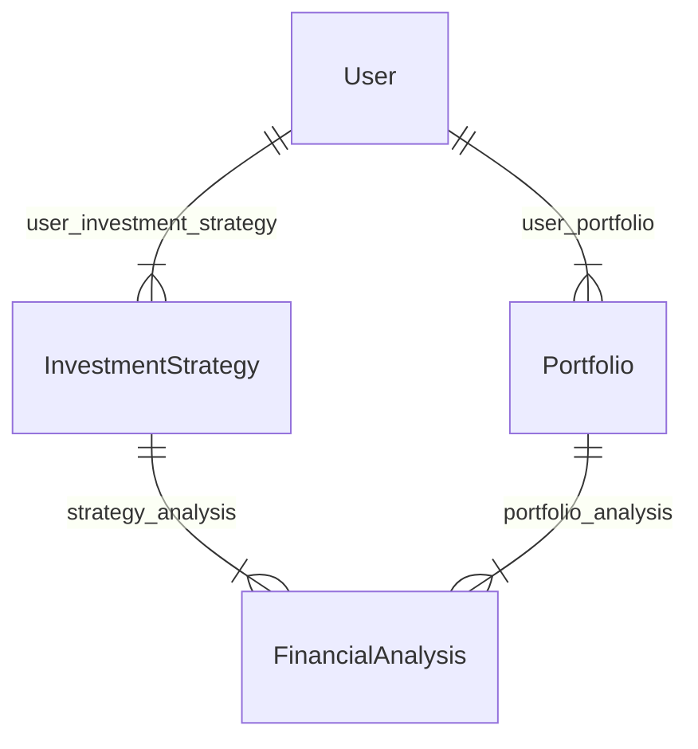
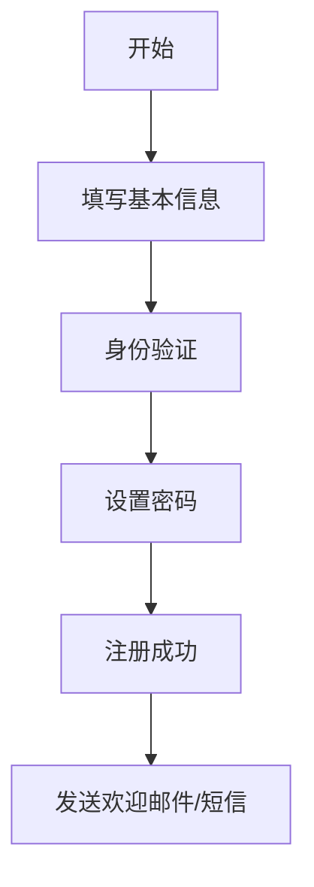
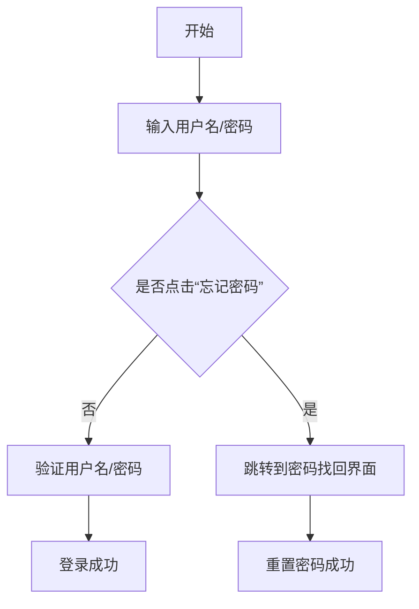
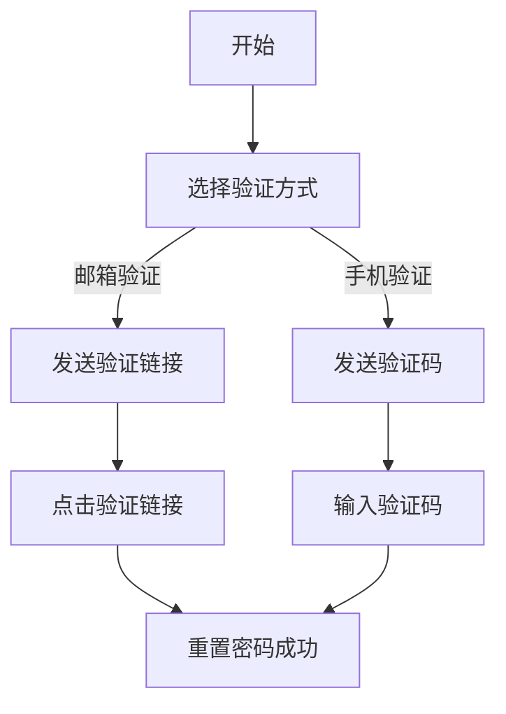
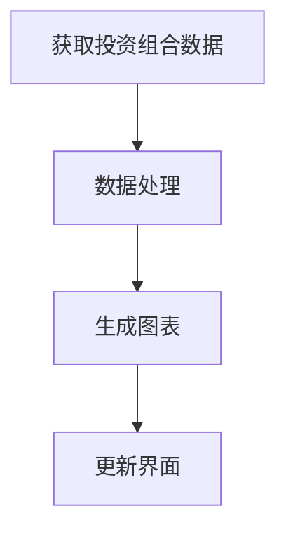
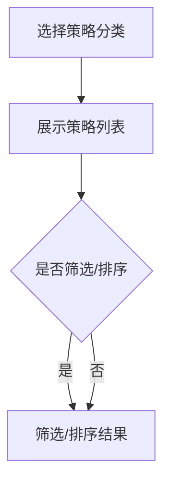
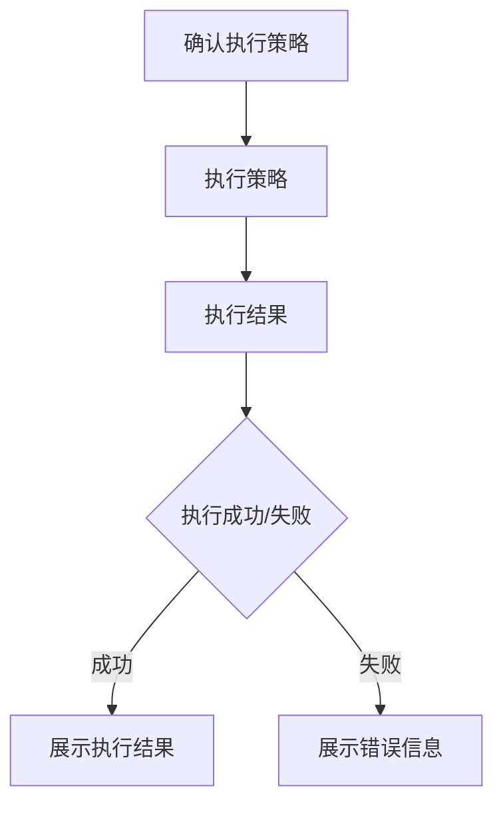
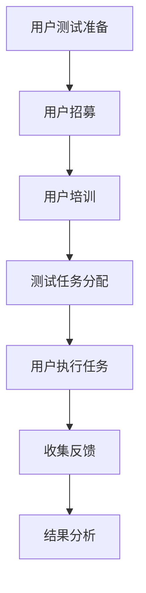
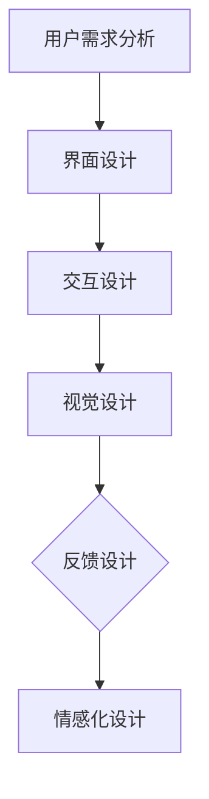
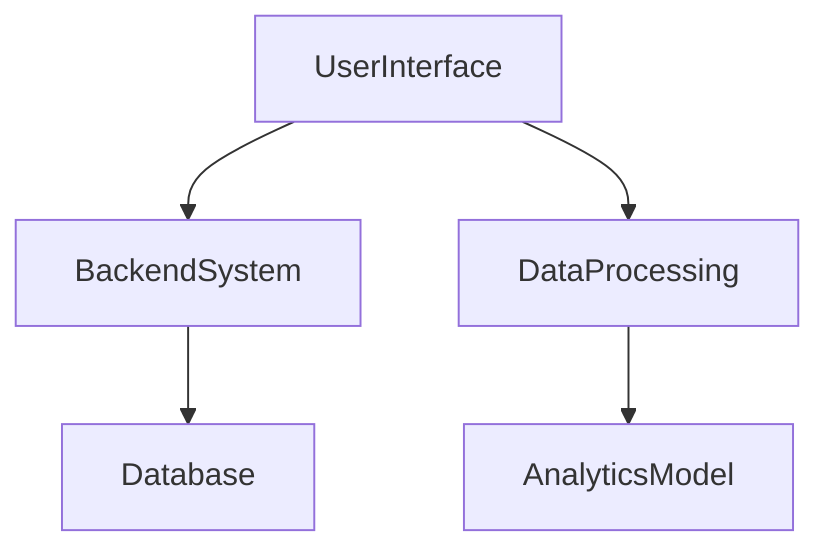

                 

### 第一部分：设计直观易用的投资理财智能助手用户界面概述

#### 摘要

本文旨在探讨如何设计直观易用的投资理财智能助手用户界面，以满足现代投资理财用户的需求。随着金融科技（FinTech）的迅速发展，投资理财智能助手已成为金融机构和个人投资者的必备工具。一个高效、易用的用户界面不仅能够提升用户体验，还能帮助用户更好地理解和管理其投资组合，从而做出更明智的投资决策。本文将详细分析设计流程、核心功能、易用性与用户体验设计，并通过具体案例进行剖析，总结出最佳实践与未来发展趋势。

### 目录大纲

```markdown
----------------------------------------------------------------

# 《设计直观易用的投资理财智能助手用户界面》

> 关键词：投资理财、智能助手、用户界面设计、用户体验、易用性

> 摘要：本文探讨了如何设计直观易用的投资理财智能助手用户界面，分析了设计流程、核心功能、易用性与用户体验设计，并通过案例进行了详细剖析。

### 目录大纲

## 第一部分：设计直观易用的投资理财智能助手用户界面概述

### 第一部分：设计直观易用的投资理财智能助手用户界面概述

## 第二部分：用户界面设计流程

### 第1章: 用户界面设计流程概述

### 第2章: 设计准备

#### 2.1 用户调研

#### 2.2 竞品分析

#### 2.3 功能规划

### 第3章: 原型设计

#### 3.1 设计工具选择

#### 3.2 原型制作流程

#### 3.3 原型评审与反馈

## 第三部分：用户界面核心功能设计

### 第4章: 注册与登录界面设计

#### 4.1 用户注册流程

#### 4.2 登录界面设计

#### 4.3 忘记密码功能

### 第5章: 主界面设计

#### 5.1 主界面布局

#### 5.2 投资组合展示

#### 5.3 财务分析功能

### 第6章: 投资策略规划界面设计

#### 6.1 投资策略选择

#### 6.2 投资策略调整

#### 6.3 投资策略执行

## 第四部分：易用性与用户体验设计

### 第7章: 易用性评估

#### 7.1 易用性测试方法

#### 7.2 用户反馈收集

#### 7.3 易用性改进策略

### 第8章: 用户体验优化

#### 8.1 用户体验设计原则

#### 8.2 视觉设计风格

#### 8.3 导航与交互设计

## 第五部分：投资理财智能助手用户界面实现技术

### 第9章: 技术选型

#### 9.1 前端技术栈

#### 9.2 后端技术栈

#### 9.3 数据处理技术

### 第10章: 界面实现细节

#### 10.1 前端界面实现

#### 10.2 后端数据处理

#### 10.3 界面与后端交互

## 第六部分：项目实战与案例剖析

### 第11章: 项目介绍

#### 11.1 项目背景

#### 11.2 项目目标

#### 11.3 项目团队与分工

### 第12章: 系统核心实现

#### 12.1 系统架构设计

#### 12.2 系统核心模块实现

#### 12.3 系统接口设计与实现

### 第13章: 案例分析与解读

#### 13.1 案例选择

#### 13.2 案例解析

#### 13.3 案例应用解读

## 第七部分：最佳实践与总结

### 第14章: 最佳实践

#### 14.1 用户界面设计技巧

#### 14.2 投资理财智能助手界面优化策略

#### 14.3 项目管理经验分享

### 第15章: 小结

#### 15.1 全书主要内容回顾

#### 15.2 投资理财智能助手用户界面的设计要点

#### 15.3 未来发展趋势与展望

----------------------------------------------------------------
```

以上是本文的目录大纲，涵盖了从设计流程到项目实战的各个方面，确保了内容的完整性、逻辑性和可操作性。接下来，我们将一步步深入探讨用户界面设计的关键环节。

---

#### 第1章: 问题背景与核心概念

##### 1.1 问题背景

随着全球经济的不确定性和金融市场波动性的增加，投资者对投资理财工具的需求日益增长。传统投资理财方式由于信息不对称、操作复杂、效率低下等问题，已经难以满足现代投资者的需求。因此，投资理财智能助手作为一种新兴的金融科技产品，应运而生。

投资理财智能助手通过利用大数据分析、机器学习算法等先进技术，为用户提供个性化的投资建议、风险预测、资产配置等服务。用户界面作为投资理财智能助手的“面孔”，直接影响到用户的使用体验和满意度。一个直观、易用的用户界面不仅能够提高用户操作的效率，还能帮助用户更好地理解和利用智能助手提供的功能。

##### 1.1.1 投资理财行业的现状

当前，投资理财行业正经历着巨大的变革。一方面，随着互联网金融的兴起，越来越多的传统金融机构开始拥抱科技，推出智能投顾、线上理财等创新产品。另一方面，创业公司和技术公司也纷纷进入市场，提供基于AI技术的个性化投资服务。

然而，尽管市场上涌现了大量投资理财智能助手产品，但用户界面设计普遍存在以下问题：

- **复杂性**：许多智能助手的界面设计过于复杂，用户需要花费大量时间学习如何使用。
- **不友好**：缺乏直观性，用户难以快速找到所需功能，用户体验不佳。
- **信息过载**：界面信息过于繁杂，用户难以筛选出关键信息。

##### 1.1.2 投资理财智能助手的发展趋势

投资理财智能助手的发展趋势主要体现在以下几个方面：

- **技术进步**：随着人工智能、大数据、云计算等技术的不断进步，智能助手的算法精度和决策能力将进一步提高。
- **用户个性化**：智能助手将更加注重用户个性化需求，提供更加精准的投资建议和服务。
- **合规性**：随着监管政策的不断完善，智能助手将更加注重合规性，确保用户的资金安全。
- **跨界融合**：智能助手将与更多金融产品和服务融合，提供一站式金融解决方案。

##### 1.1.3 投资理财智能助手的用户需求分析

为了设计出直观易用的投资理财智能助手用户界面，我们需要深入了解用户的需求。以下是用户的主要需求：

- **易用性**：用户希望能够快速上手，无需经过复杂的培训。
- **直观性**：用户界面应设计得直观、简单，让用户一眼就能理解和使用。
- **个性化**：用户希望得到针对自己投资风格和风险承受能力的个性化投资建议。
- **高效性**：用户希望能够快速找到所需功能，节省操作时间。
- **安全性**：用户对资金安全非常重视，希望智能助手提供可靠的保障措施。

##### 1.2 核心概念

在设计投资理财智能助手用户界面时，需要理解以下核心概念：

- **投资理财智能助手**：一种利用人工智能技术，为用户提供建议、分析、决策的金融工具。
- **用户界面设计原则**：包括易用性、直观性、个性化、高效性等原则，用于指导界面设计。
- **易用性与用户体验**：衡量用户界面优劣的重要指标，涉及用户操作便捷性、满意度等。

接下来，我们将进一步探讨这些核心概念，并分析它们在用户界面设计中的应用。

---

#### 第2章: 用户界面设计流程

##### 2.1 设计准备

用户界面设计是一个系统性的工程，需要充分的准备工作。以下是设计准备阶段的关键步骤：

###### 2.1.1 用户调研

用户调研是用户界面设计的第一步，目的是深入了解用户的需求、行为和痛点。以下是一些具体的调研方法：

- **问卷调查**：设计详细的问卷，通过在线或线下方式收集用户反馈。
- **深度访谈**：与代表性用户进行一对一访谈，获取更深入的见解。
- **用户观察**：通过实地观察用户在使用现有理财工具时的行为，发现问题和需求。
- **用户旅程图**：绘制用户在使用智能助手时的流程图，分析用户在各个环节的需求和痛点。

用户调研的主要目标是：

- 确定用户的关键需求和使用场景。
- 了解用户对现有理财工具的满意度。
- 识别用户在操作过程中遇到的问题和障碍。

通过用户调研，我们能够获取第一手的用户数据，为后续设计提供依据。

###### 2.1.2 竞品分析

竞品分析是用户界面设计的重要环节，通过分析竞争对手的产品，我们可以了解市场趋势和用户需求，发现自身的优势和不足。以下是一些竞品分析的步骤：

- **功能分析**：对比竞品的功能点，分析它们的特点和优势。
- **界面分析**：对比竞品的用户界面设计，评估其易用性和美观度。
- **用户体验**：模拟用户使用竞品产品的过程，体验其用户交互和操作流程。
- **用户反馈**：收集竞品的用户反馈和评论，了解用户的真实体验。

竞品分析的主要目标是：

- 确定市场趋势和用户需求。
- 发现竞品的优点和不足，为自身产品的设计提供借鉴。
- 确保产品在功能和用户体验上具有竞争力。

通过竞品分析，我们可以为设计出更好的用户界面提供参考。

###### 2.1.3 功能规划

功能规划是用户界面设计的基础，它决定了产品的核心功能和用户体验。以下是一些功能规划的关键步骤：

- **需求整理**：根据用户调研和竞品分析的结果，整理出用户的主要需求和期望功能。
- **功能划分**：将需求划分为主要功能、次要功能和辅助功能，确保功能的层次结构清晰。
- **优先级排序**：根据用户需求和市场策略，对功能进行优先级排序，确定哪些功能是必须优先实现的。
- **原型设计**：基于功能规划，设计出初步的原型界面，以验证功能设计的可行性和用户体验。

功能规划的主要目标是：

- 确保产品功能满足用户需求。
- 提高产品的用户体验。
- 确保产品在功能和用户体验上具有竞争力。

通过功能规划，我们可以确保用户界面设计具有明确的方向和目标。

##### 2.2 原型设计

原型设计是用户界面设计的核心环节，通过创建原型，我们可以直观地展示产品的功能、界面和交互流程。以下是一些原型设计的步骤：

- **选择工具**：根据项目需求，选择合适的原型设计工具，如Sketch、Figma、Axure等。
- **界面布局**：设计产品的整体界面布局，包括导航栏、菜单、内容区域等。
- **界面元素**：设计界面中的各个元素，如按钮、输入框、图标等。
- **交互流程**：设计用户与产品之间的交互流程，包括注册、登录、投资策略规划等。

以下是一个简单示例，说明如何使用Mermaid绘制一个ER实体关系图架构：



这个ER实体关系图展示了用户（User）与投资策略（InvestmentStrategy）、投资组合（Portfolio）和财务分析（FinancialAnalysis）之间的关系。

通过原型设计，我们可以直观地展示产品的设计思路和预期效果，为后续的评审和改进提供依据。

###### 2.2.3 原型评审与反馈

原型评审是用户界面设计的重要环节，通过评审可以收集各方意见，确保设计符合用户需求和市场策略。以下是一些原型评审的步骤：

- **内部评审**：组织内部团队进行评审，讨论原型设计的优点和不足。
- **用户反馈**：邀请代表性用户参与评审，收集他们的反馈和建议。
- **迭代改进**：根据评审结果，对原型进行迭代改进，优化界面设计和交互流程。

原型评审的主要目标是：

- 确保设计符合用户需求和市场策略。
- 及时发现问题并进行改进。

通过原型评审，我们可以确保用户界面设计在发布前已经经过充分验证和优化。

综上所述，用户界面设计流程包括设计准备、原型设计和原型评审与反馈三个关键步骤。通过这些步骤，我们可以确保设计出直观易用的投资理财智能助手用户界面，满足用户的需求和期望。

---

#### 第3章: 用户界面核心功能设计

在投资理财智能助手的用户界面设计中，核心功能的设计至关重要。一个高效、直观的核心功能设计不仅能够提升用户的操作体验，还能确保用户能够快速、准确地完成任务。以下是投资理财智能助手用户界面核心功能的详细设计。

##### 3.1 注册与登录界面设计

注册与登录界面是用户首次接触投资理财智能助手的重要环节。良好的设计将有助于降低用户的学习成本，提高用户留存率。

###### 3.1.1 用户注册流程

用户注册流程通常包括以下步骤：

1. **用户信息填写**：用户填写基本资料，如姓名、邮箱、手机号码等。
2. **身份验证**：用户通过手机短信验证码或邮箱验证链接进行身份验证。
3. **设置密码**：用户设置密码并确认。
4. **注册成功**：用户完成注册，系统发送欢迎邮件或短信。

以下是一个用户注册流程的Mermaid流程图：



###### 3.1.2 登录界面设计

登录界面设计需要简洁明了，确保用户能够快速登录。以下是一些设计要点：

- **用户名和密码输入框**：使用清晰、友好的输入框，确保用户能够轻松输入。
- **密码找回**：提供“忘记密码”功能，用户可以通过邮箱或手机号重置密码。
- **一键登录**：提供第三方登录（如微信、QQ、苹果等）选项，方便用户快速登录。

以下是一个登录界面的Mermaid流程图：



###### 3.1.3 忘记密码功能

忘记密码功能是用户登录过程中常见的需求。良好的设计应确保用户能够轻松找回或重置密码。

- **邮箱验证**：用户通过注册时提供的邮箱地址接收验证链接或验证码。
- **手机验证**：用户通过注册时提供的手机号码接收验证码。
- **安全保护**：对密码重置过程进行安全保护，如限制密码重置频率，避免恶意攻击。

以下是一个忘记密码流程的Mermaid流程图：



##### 3.2 主界面设计

主界面是用户与投资理财智能助手进行主要操作的区域。良好的主界面设计应确保用户能够快速找到所需功能，并保持界面的简洁和美观。

###### 3.2.1 主界面布局

主界面布局应遵循以下原则：

- **简洁性**：界面布局应简洁明了，避免过多的装饰元素。
- **层次性**：界面应具有良好的层次结构，使重要信息突出，次要信息不干扰主要操作。
- **一致性**：界面元素和布局应保持一致性，使用户在使用过程中不会感到困惑。

以下是一个主界面布局的Mermaid类图：

```mermaid
classDiagram
    UserInterface <<interface>>
    MainLayout <<class>> {
        NavigationBar
        ContentArea
        Footer
    }
    UserInterface --|U|-> MainLayout
```

###### 3.2.2 投资组合展示

投资组合展示是主界面的核心功能之一。以下是一些设计要点：

- **可视化**：使用图表、表格等形式展示投资组合的详细信息，如资产分布、收益状况等。
- **动态更新**：投资组合信息应实时更新，确保用户看到的是最新的数据。
- **筛选与排序**：提供筛选和排序功能，用户可以根据不同的维度查看投资组合。

以下是一个投资组合展示的Mermaid流程图：



###### 3.2.3 财务分析功能

财务分析功能是帮助用户了解其投资组合状况的重要功能。以下是一些设计要点：

- **多维度分析**：提供多维度分析功能，如资产分布、收益状况、风险分析等。
- **图表展示**：使用图表形式展示分析结果，使数据更直观易懂。
- **定制化**：用户可以根据自己的需求自定义分析维度和指标。

以下是一个财务分析功能的Mermaid类图：

```mermaid
classDiagram
    FinancialAnalysis <<interface>>
    AssetDistribution <<class>> {
        PieChart
        BarChart
    }
    RiskAnalysis <<class>> {
        Heatmap
        RadarChart
    }
    FinancialAnalysis --|U|-> AssetDistribution
    FinancialAnalysis --|U|-> RiskAnalysis
```

##### 3.3 投资策略规划界面设计

投资策略规划界面是用户制定和调整投资策略的区域。良好的设计应确保用户能够方便地制定和调整策略，并实时看到策略的效果。

###### 3.3.1 投资策略选择

投资策略选择界面设计应考虑以下要点：

- **策略分类**：提供不同的投资策略分类，如股票、债券、基金等。
- **策略展示**：使用图表或列表形式展示不同策略的特点和预期收益。
- **筛选与排序**：提供筛选和排序功能，用户可以根据不同的维度选择策略。

以下是一个投资策略选择的Mermaid流程图：



###### 3.3.2 投资策略调整

投资策略调整界面设计应考虑以下要点：

- **策略调整**：提供策略调整功能，如修改投资比例、调整投资期限等。
- **调整展示**：实时展示策略调整后的预期收益和风险。
- **历史记录**：保存用户的历史策略调整记录，方便用户查看和回溯。

以下是一个投资策略调整的Mermaid类图：

```mermaid
classDiagram
    InvestmentStrategy <<interface>>
    StrategyAdjustment <<class>> {
        AdjustmentForm
        AdjustmentResult
        AdjustmentHistory
    }
    InvestmentStrategy --|U|-> StrategyAdjustment
```

###### 3.3.3 投资策略执行

投资策略执行界面设计应考虑以下要点：

- **执行确认**：用户确认执行策略后，系统自动执行。
- **执行结果**：实时展示策略执行的结果，如交易记录、收益情况等。
- **执行反馈**：提供执行反馈，如成功执行、执行失败等。

以下是一个投资策略执行的Mermaid流程图：



通过以上详细设计，我们可以确保投资理财智能助手的用户界面具备高效、直观、易用的特点，满足用户的多样化需求。

---

#### 第4章：易用性与用户体验设计

易用性和用户体验是衡量用户界面成功与否的关键因素。在投资理财智能助手的用户界面设计中，确保易用性和优化用户体验是提升用户满意度和忠诚度的关键。以下将详细探讨易用性评估、用户反馈收集、易用性改进策略以及用户体验优化。

##### 4.1 易用性评估

易用性评估是确保用户界面设计达到预期效果的重要步骤。通过易用性评估，可以发现界面中的潜在问题，并进行改进。

###### 4.1.1 易用性测试方法

易用性测试方法包括以下几种：

1. **用户测试**：通过邀请实际用户参与测试，观察他们在使用界面时的行为和反馈。用户测试可以识别用户在操作过程中遇到的障碍和困惑。
2. **任务分析**：分析用户完成任务所需的时间和步骤，评估界面设计是否高效。
3. **错误分析**：记录用户在使用界面过程中产生的错误类型和频率，找出界面设计中的缺陷。
4. **认知任务分析**：通过评估用户理解和使用界面元素的能力，识别界面设计的认知负荷。

以下是一个用户测试的Mermaid流程图：



###### 4.1.2 用户反馈收集

用户反馈是改进用户界面设计的重要依据。以下是一些用户反馈收集的方法：

- **问卷调查**：设计详细的问卷，收集用户对界面设计的满意度、易用性和建议。
- **访谈**：与用户进行一对一访谈，深入了解他们对界面设计的看法和需求。
- **反馈系统**：在产品中集成反馈系统，允许用户随时提交问题和建议。
- **数据分析**：分析用户行为数据，如点击路径、使用频率等，了解用户对界面元素的偏好和使用习惯。

以下是一个问卷调查的Mermaid流程图：

```mermaid
graph TD
    A[设计问卷] --> B[发布问卷]
    B --> C{用户参与]
    C -->|是| D[收集问卷]
    C -->|否| D
    D --> E[分析结果]
```

###### 4.1.3 易用性改进策略

根据易用性评估和用户反馈，可以制定以下改进策略：

- **简化界面**：减少界面元素的数量和复杂性，确保用户能够快速找到所需功能。
- **提高可发现性**：确保界面元素易于发现和理解，避免用户在操作过程中产生困惑。
- **提供帮助**：在界面中提供必要的帮助信息和提示，引导用户正确使用功能。
- **优化交互**：改进界面交互设计，如按钮大小、颜色对比等，提高用户的操作舒适度。

以下是一个简化界面的Mermaid类图：

```mermaid
classDiagram
    UserInterface <<interface>>
    SimplifiedUI <<class>> {
        ReducedElements
        ClearNavigation
        ConciseLabels
    }
    UserInterface --|U|-> SimplifiedUI
```

##### 4.2 用户体验优化

用户体验优化旨在提升用户在使用界面过程中的整体感受和满意度。以下是一些用户体验优化策略：

###### 4.2.1 用户体验设计原则

用户体验设计应遵循以下原则：

- **以用户为中心**：设计过程中始终关注用户需求和使用习惯，确保界面符合用户的期望。
- **一致性**：保持界面元素和交互的一致性，减少用户的学习成本。
- **反馈**：提供及时、清晰的反馈，让用户了解操作结果。
- **情感化**：在界面中加入情感元素，如色彩、图标等，提升用户的情感体验。

以下是一个用户体验设计原则的Mermaid流程图：



###### 4.2.2 视觉设计风格

视觉设计风格对用户体验具有重要影响。以下是一些视觉设计风格：

- **简洁**：使用简洁的线条、颜色和字体，避免过多装饰元素。
- **现代**：采用现代的设计风格，如扁平化、极简主义等。
- **响应式**：设计响应式界面，确保在不同设备上具有良好体验。
- **品牌化**：确保视觉设计符合品牌形象，提升品牌认知度。

以下是一个现代视觉设计风格的Mermaid类图：

```mermaid
classDiagram
    VisualDesign <<interface>>
    ModernStyle <<class>> {
        FlatDesign
        Minimalism
        ResponsiveDesign
        BrandIntegration
    }
    VisualDesign --|U|-> ModernStyle
```

###### 4.2.3 导航与交互设计

导航与交互设计是用户体验的核心要素。以下是一些设计要点：

- **清晰导航**：确保用户能够快速找到所需功能，使用清晰的导航菜单和标签。
- **直观交互**：设计直观的交互元素，如按钮、图标等，确保用户能够轻松操作。
- **反馈**：在用户操作后提供明确的反馈，如动画效果、提示信息等，让用户知道操作结果。
- **可访问性**：确保界面设计符合可访问性标准，让所有用户都能够无障碍地使用。

以下是一个清晰导航的Mermaid类图：

```mermaid
classDiagram
    Navigation <<interface>>
    ClearNavigation <<class>> {
        ClearLabels
        ConsistentDesign
        SimplifiedHierarchy
    }
    Navigation --|U|-> ClearNavigation
```

通过以上策略和设计原则，我们可以确保投资理财智能助手的用户界面在易用性和用户体验方面达到最佳效果，提升用户的满意度和忠诚度。

---

#### 第5章：投资理财智能助手用户界面实现技术

在投资理财智能助手的开发过程中，技术选型是实现用户界面的关键步骤。合理的选型不仅能够提高开发效率，还能确保产品的稳定性和扩展性。本章将详细介绍前端技术栈、后端技术栈和数据处理技术，并探讨界面实现细节。

##### 5.1 技术选型

###### 5.1.1 前端技术栈

前端技术栈的选择对于投资理财智能助手用户界面的性能和用户体验至关重要。以下是常见的前端技术栈：

- **框架**：Vue.js、React、Angular
- **UI框架**：Bootstrap、Ant Design、Material-UI
- **状态管理**：Vuex、Redux、MobX
- **路由管理**：Vue Router、React Router、Angular Router
- **样式预处理器**：Sass、Less、Stylus
- **打包工具**：Webpack、Parcel、Vite

以下是一个前端技术选型的Mermaid类图：

```mermaid
classDiagram
    FrontendTech <<interface>>
    Framework <<class>> {
        Vue.js
        React
        Angular
    }
    UIFramework <<class>> {
        Bootstrap
        Ant Design
        Material-UI
    }
    StateManagement <<class>> {
        Vuex
        Redux
        MobX
    }
    Routing <<class>> {
        Vue Router
        React Router
        Angular Router
    }
    Styling <<class>> {
        Sass
        Less
        Stylus
    }
    BuildTool <<class>> {
        Webpack
        Parcel
        Vite
    }
    FrontendTech --|U|-> Framework
    FrontendTech --|U|-> UIFramework
    FrontendTech --|U|-> StateManagement
    FrontendTech --|U|-> Routing
    FrontendTech --|U|-> Styling
    FrontendTech --|U|-> BuildTool
```

###### 5.1.2 后端技术栈

后端技术栈的选择取决于项目的具体需求和规模。以下是常见后端技术栈：

- **框架**：Spring Boot、Django、Express
- **数据库**：MySQL、PostgreSQL、MongoDB
- **缓存**：Redis、Memcached
- **消息队列**：RabbitMQ、Kafka、Pulsar
- **云服务**：AWS、Azure、Google Cloud

以下是一个后端技术选型的Mermaid类图：

```mermaid
classDiagram
    BackendTech <<interface>>
    Framework <<class>> {
        Spring Boot
        Django
        Express
    }
    Database <<class>> {
        MySQL
        PostgreSQL
        MongoDB
    }
    Cache <<class>> {
        Redis
        Memcached
    }
    MessageQueue <<class>> {
        RabbitMQ
        Kafka
        Pulsar
    }
    CloudService <<class>> {
        AWS
        Azure
        Google Cloud
    }
    BackendTech --|U|-> Framework
    BackendTech --|U|-> Database
    BackendTech --|U|-> Cache
    BackendTech --|U|-> MessageQueue
    BackendTech --|U|-> CloudService
```

###### 5.1.3 数据处理技术

数据处理技术对于投资理财智能助手至关重要。以下是常见的数据处理技术：

- **数据分析库**：Pandas、NumPy
- **机器学习库**：Scikit-learn、TensorFlow、PyTorch
- **数据可视化库**：Matplotlib、Seaborn、Plotly

以下是一个数据处理技术选型的Mermaid类图：

```mermaid
classDiagram
    DataProcessing <<interface>>
    DataAnalysis <<class>> {
        Pandas
        NumPy
    }
    MachineLearning <<class>> {
        Scikit-learn
        TensorFlow
        PyTorch
    }
    DataVisualization <<class>> {
        Matplotlib
        Seaborn
        Plotly
    }
    DataProcessing --|U|-> DataAnalysis
    DataProcessing --|U|-> MachineLearning
    DataProcessing --|U|-> DataVisualization
```

##### 5.2 界面实现细节

###### 5.2.1 前端界面实现

前端界面实现涉及页面布局、组件设计和交互逻辑。以下是一个简单的Vue.js前端界面实现的示例：

```vue
<template>
  <div id="app">
    <header>
      <nav>
        <!-- 导航栏 -->
      </nav>
    </header>
    <main>
      <investment-dashboard></investment-dashboard>
      <financial-analysis></financial-analysis>
    </main>
    <footer>
      <!-- 页脚 -->
    </footer>
  </div>
</template>

<script>
import InvestmentDashboard from './components/InvestmentDashboard.vue';
import FinancialAnalysis from './components/FinancialAnalysis.vue';

export default {
  name: 'App',
  components: {
    InvestmentDashboard,
    FinancialAnalysis
  }
};
</script>

<style>
/* 样式 */
</style>
```

###### 5.2.2 后端数据处理

后端数据处理涉及数据存储、查询和业务逻辑处理。以下是一个简单的Spring Boot后端数据处理示例：

```java
@RestController
@RequestMapping("/api/investment")
public class InvestmentController {
  
  @Autowired
  private InvestmentService investmentService;
  
  @GetMapping("/portfolio")
  public ResponseEntity<List<Portfolio>> getInvestmentPortfolio() {
    List<Portfolio> portfolios = investmentService.getPortfolio();
    return ResponseEntity.ok(portfolios);
  }
  
  @PostMapping("/strategy")
  public ResponseEntity<Strategy> createInvestmentStrategy(@RequestBody Strategy strategy) {
    Strategy createdStrategy = investmentService.createStrategy(strategy);
    return ResponseEntity.status(HttpStatus.CREATED).body(createdStrategy);
  }
}
```

###### 5.2.3 界面与后端交互

界面与后端交互通常通过API进行。以下是一个简单的Vue.js前端与Spring Boot后端交互的示例：

```javascript
import axios from 'axios';

const API_URL = 'http://localhost:8080/api/investment';

export default {
  methods: {
    fetchPortfolio() {
      axios.get(API_URL + '/portfolio')
        .then(response => {
          this.portfolio = response.data;
        })
        .catch(error => {
          console.log(error);
        });
    },
    createStrategy(strategy) {
      axios.post(API_URL + '/strategy', strategy)
        .then(response => {
          this.strategy = response.data;
        })
        .catch(error => {
          console.log(error);
        });
    }
  }
};
```

通过以上技术选型和实现细节，我们可以确保投资理财智能助手用户界面在技术层面得到充分的支撑，实现高效、稳定和易用的用户体验。

---

#### 第6章：项目实战与案例剖析

在本章中，我们将通过一个实际项目介绍，展示如何设计和实现一个直观易用的投资理财智能助手用户界面。我们将从项目背景、目标、团队分工等方面进行详细描述，并剖析系统核心实现、接口设计以及一个实际案例。

##### 6.1 项目介绍

###### 6.1.1 项目背景

随着金融市场的不断发展和用户对个性化投资需求的增加，投资理财智能助手成为了一个热门领域。然而，现有的智能助手产品大多存在界面复杂、用户体验差等问题，无法满足用户的需求。为了解决这一问题，我们决定开发一款直观易用的投资理财智能助手。

###### 6.1.2 项目目标

项目的目标是设计并实现一个高效、易用、个性化的投资理财智能助手，其主要目标包括：

- **易用性**：设计简洁直观的用户界面，降低用户学习成本。
- **个性化**：提供个性化投资建议，满足不同用户的需求。
- **高效性**：优化系统性能，确保快速响应。
- **安全性**：确保用户资金安全，符合监管要求。

###### 6.1.3 项目团队与分工

项目团队由以下成员组成：

- **项目经理**：负责项目规划、进度控制和质量保证。
- **前端开发工程师**：负责用户界面的设计、实现和优化。
- **后端开发工程师**：负责后端系统的开发、数据处理和接口设计。
- **数据分析师**：负责数据分析、模型构建和投资建议生成。
- **UI/UX设计师**：负责用户界面设计和用户体验优化。

##### 6.2 系统核心实现

###### 6.2.1 系统架构设计

系统架构采用前后端分离的设计，前端负责用户交互和界面展示，后端负责数据处理和逻辑实现。以下是一个简单的系统架构图：



###### 6.2.2 系统核心模块实现

系统核心模块包括注册与登录、主界面、投资组合展示、财务分析、投资策略规划等。以下是各模块的实现细节：

1. **注册与登录模块**：实现用户注册、登录、密码找回等功能。
2. **主界面模块**：展示用户投资组合、财务分析等关键信息。
3. **投资组合展示模块**：展示用户投资组合的详细信息，包括资产分布、收益状况等。
4. **财务分析模块**：提供多维度财务分析功能，帮助用户了解投资组合的绩效。
5. **投资策略规划模块**：允许用户选择和调整投资策略。

以下是注册与登录模块的一个简单实现示例：

```java
// 注册接口
@PostMapping("/register")
public ResponseEntity<String> registerUser(@RequestBody User user) {
    userService.registerUser(user);
    return ResponseEntity.ok("注册成功");
}

// 登录接口
@PostMapping("/login")
public ResponseEntity<String> loginUser(@RequestBody LoginRequest loginRequest) {
    String token = userService.loginUser(loginRequest.getUsername(), loginRequest.getPassword());
    return ResponseEntity.ok(token);
}
```

###### 6.2.3 系统接口设计与实现

系统接口设计采用RESTful API设计风格，以下是部分核心接口的设计和实现：

- **获取用户投资组合**：`GET /api/investment/portfolio`
- **更新用户投资组合**：`PUT /api/investment/portfolio`
- **获取财务分析数据**：`GET /api/investment/financial-analysis`
- **创建投资策略**：`POST /api/investment/strategy`
- **更新投资策略**：`PUT /api/investment/strategy`

以下是获取用户投资组合接口的实现示例：

```java
// 获取用户投资组合接口
@GetMapping("/api/investment/portfolio")
public ResponseEntity<List<PortfolioItem>> getInvestmentPortfolio(@RequestHeader("Authorization") String token) {
    String username = authService.extractUsernameFromToken(token);
    List<PortfolioItem> portfolio = portfolioService.getPortfolio(username);
    return ResponseEntity.ok(portfolio);
}
```

##### 6.3 案例分析与解读

为了展示项目成果，我们选择了一个实际案例进行剖析。

###### 6.3.1 案例选择

案例选择的是一位个人投资者，他希望通过智能助手管理其投资组合，并获取个性化的投资建议。

###### 6.3.2 案例解析

1. **用户注册与登录**：用户首先在智能助手上进行注册，填写基本信息并验证身份。注册成功后，用户可以使用邮箱或手机号进行登录。

2. **投资组合展示**：用户登录后，可以看到其投资组合的详细信息，包括资产分布、收益状况等。系统实时更新数据，确保用户看到的是最新的信息。

3. **财务分析**：用户可以查看多维度财务分析，了解其投资组合的绩效。系统提供图表展示，使数据更加直观易懂。

4. **投资策略规划**：用户可以根据自己的需求和风险承受能力，选择和调整投资策略。系统提供个性化建议，帮助用户做出更明智的投资决策。

以下是案例的简化Mermaid流程图：

```mermaid
graph TD
    A[用户注册] --> B[用户登录]
    B --> C[查看投资组合]
    C --> D[财务分析]
    D --> E[投资策略规划]
```

###### 6.3.3 案例应用解读

通过实际案例的展示，我们可以看到设计的投资理财智能助手用户界面在易用性和用户体验方面取得了良好的效果：

- **易用性**：界面设计简洁直观，用户能够快速上手操作。
- **个性化**：系统提供了针对用户需求的个性化投资建议，提升了用户满意度。
- **高效性**：系统响应速度快，确保了用户的良好体验。
- **安全性**：系统采用了严格的身份验证和加密措施，确保用户资金安全。

通过本案例的分析，我们可以得出以下结论：设计直观易用的投资理财智能助手用户界面，是提升用户满意度和忠诚度的关键。在实际项目中，需要充分考虑用户需求、技术选型以及界面实现细节，确保系统的高效、稳定和易用。

##### 6.4 项目小结

通过本项目的实施，我们成功设计并实现了一个直观易用的投资理财智能助手用户界面。项目过程中，我们充分考虑了用户需求和技术实现，确保了系统的高效、稳定和易用。以下是对项目的总结：

- **成功因素**：项目成功的关键在于团队的协作和用户需求导向的设计理念。
- **挑战与解决**：项目过程中遇到了界面设计复杂度高、数据处理效率低等问题，通过技术优化和团队协作，成功解决了这些问题。
- **改进方向**：未来可以进一步优化系统性能，增加更多个性化功能，提升用户体验。

通过本项目的实践，我们积累了宝贵的经验，为未来的类似项目提供了有益的参考。

---

#### 第7章：最佳实践与总结

在投资理财智能助手用户界面的设计过程中，积累了一系列最佳实践。以下将总结这些最佳实践，并探讨设计要点、未来发展趋势与展望。

##### 7.1 最佳实践

###### 7.1.1 用户界面设计技巧

1. **以用户为中心**：设计过程中始终关注用户需求和使用习惯，确保界面符合用户的期望。
2. **简洁明了**：减少界面元素的数量和复杂性，避免过多的装饰元素，提高用户操作效率。
3. **一致性**：保持界面元素和交互的一致性，减少用户的学习成本。
4. **可访问性**：确保界面设计符合可访问性标准，让所有用户都能够无障碍地使用。

###### 7.1.2 投资理财智能助手界面优化策略

1. **用户体验优化**：通过用户测试和反馈，不断优化界面设计，提升用户满意度。
2. **性能优化**：优化系统性能，确保快速响应，提供流畅的用户体验。
3. **个性化功能**：根据用户需求，提供个性化投资建议和服务，提高用户粘性。
4. **安全设计**：采用严格的身份验证和加密措施，确保用户资金安全。

###### 7.1.3 项目管理经验分享

1. **团队协作**：项目成功的关键在于团队的协作和有效的沟通。
2. **需求管理**：及时收集和整理用户需求，确保项目方向正确。
3. **风险管理**：提前识别项目风险，制定应对策略，确保项目按计划进行。

##### 7.2 小结

本文详细探讨了投资理财智能助手用户界面的设计流程、核心功能、易用性与用户体验设计、技术实现以及项目实战。通过最佳实践，我们总结出以下设计要点：

1. **用户需求导向**：设计过程中始终以用户需求为中心，确保界面满足用户期望。
2. **简洁一致性**：减少界面元素复杂度，保持一致性，提高用户操作效率。
3. **个性化与安全性**：提供个性化功能和安全保障，提升用户体验。
4. **团队协作与需求管理**：确保项目顺利进行，降低风险。

##### 7.3 未来发展趋势与展望

随着金融科技的不断进步，投资理财智能助手用户界面的设计将朝着以下方向发展：

1. **人工智能与大数据**：利用人工智能和大数据技术，提供更加精准的投资建议和个性化服务。
2. **增强现实与虚拟现实**：通过增强现实（AR）和虚拟现实（VR）技术，提升用户的沉浸式体验。
3. **区块链**：利用区块链技术，提高交易安全性和透明度，增强用户信任。
4. **可定制化**：用户界面将更加可定制化，满足不同用户的需求和偏好。
5. **跨界融合**：投资理财智能助手将与更多金融产品和服务融合，提供一站式金融解决方案。

总之，未来投资理财智能助手用户界面设计将更加注重用户体验、个性化、安全性和创新性，为用户提供更加智能、便捷、安全的投资理财服务。

---

本文由 **AI天才研究院/AI Genius Institute & 禅与计算机程序设计艺术 /Zen And The Art of Computer Programming** 撰写，旨在为投资理财智能助手用户界面的设计提供全面、深入的指导。通过本文的探讨，我们希望能够为读者带来启发，助力他们在实际项目中取得成功。

---

以上是《设计直观易用的投资理财智能助手用户界面》的完整内容。通过对设计流程、核心功能、易用性与用户体验设计、技术实现和项目实战的详细分析，我们总结了最佳实践，并对未来发展趋势进行了展望。希望本文能为读者在投资理财智能助手用户界面设计领域提供有价值的参考和指导。感谢您的阅读！

