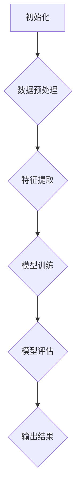
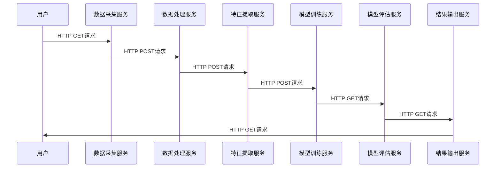

                 


### 设计高可用性金融AI系统架构

---

关键词：高可用性、金融AI、系统架构、微服务、负载均衡、容错机制

---

#### 摘要

随着金融科技的发展，高可用性的金融AI系统成为金融机构的迫切需求。本文将详细探讨如何设计一个高可用性的金融AI系统架构，包括背景介绍、核心概念与联系、算法原理讲解、系统分析与架构设计方案以及项目实战等内容。通过本文，读者将了解高可用性金融AI系统架构的设计思路和实现方法。

---

#### 背景介绍

---

##### 问题背景

在金融领域，随着金融科技的发展，金融机构对AI技术的应用日益广泛。然而，传统的金融系统在应对复杂、动态的市场环境时，往往面临系统稳定性不足、响应速度慢、错误率高、安全性问题等挑战。为了解决这些问题，设计一个高可用性的金融AI系统架构成为金融科技领域的迫切需求。

##### 问题描述

设计一个高可用性的金融AI系统架构，需要解决以下问题：

1. **稳定性**：系统能够在长时间运行中保持稳定，减少故障发生。
2. **快速响应**：系统能够在短时间内处理大量数据，保证金融交易和决策的及时性。
3. **高错误率**：系统应具有较低的错误率，确保金融操作的正确性。
4. **安全性**：系统需具备强大的安全保障机制，防止恶意攻击和数据泄露。

##### 问题解决

为了解决上述问题，我们需要从以下几个方面入手：

1. **核心概念**：明确高可用性金融AI系统架构中的核心概念，如分布式系统、微服务架构、负载均衡、容错机制、数据安全等。
2. **边界与外延**：界定系统架构的边界，明确系统与外部系统的接口和交互方式。
3. **概念结构与核心要素组成**：分析系统架构中的各个组成部分，如数据层、算法层、服务层等，并明确它们之间的联系和交互方式。

---

#### 核心概念与联系

---

##### 核心概念原理

1. **分布式系统**：分布式系统通过将计算任务分散到多个节点上执行，提高系统的计算能力和容错能力。
2. **微服务架构**：微服务架构将系统划分为多个小型、独立的服务单元，每个服务单元负责特定的功能，便于开发和维护。
3. **负载均衡**：负载均衡通过合理分配计算任务，确保系统资源得到充分利用，提高系统的处理能力。
4. **容错机制**：容错机制在系统出现故障时，能够自动切换到备用节点或服务，确保系统持续运行。
5. **数据安全**：数据安全通过加密、访问控制、备份等技术，保障系统数据的安全性和完整性。

##### 概念属性特征对比表格

| 概念     | 特征                   |
|----------|------------------------|
| 分布式系统 | 分布式计算、容错能力强、扩展性高 |
| 微服务架构 | 独立性、可扩展、易于维护 |
| 负载均衡  | 资源利用率高、响应速度快  |
| 容错机制  | 故障切换、系统稳定       |
| 数据安全  | 加密、访问控制、备份       |

##### ER实体关系图架构

```mermaid
erDiagram
  Customer ||--|{ Order }||>
  Customer ||--|{ Payment }||>
  Order ||--|{ Product }||>
  Payment ||--|{ Customer }||>
```

---

#### 算法原理讲解

---

##### 算法流程图



##### 数学模型和公式

```latex
\text{假设输入数据集为 } X = \{x_1, x_2, ..., x_n\}, \text{输出结果为 } y = \{y_1, y_2, ..., y_n\}.

\text{损失函数为：}
L(y, \hat{y}) = \frac{1}{n} \sum_{i=1}^{n} (y_i - \hat{y_i})^2,

\text{梯度下降法更新参数：}
\theta = \theta - \alpha \cdot \nabla_\theta L(\theta).
```

##### 详细讲解和举例说明

以股票市场预测为例，首先，我们对股票数据进行预处理，包括数据清洗、归一化等操作。然后，提取特征，如股票价格、交易量等。接下来，使用梯度下降法训练模型，优化损失函数。最后，对模型进行评估，输出股票价格预测结果。

---

#### 系统分析与架构设计方案

---

##### 问题场景介绍

本系统旨在构建一个高可用性的金融AI系统，用于实时分析股票市场数据，预测股票价格走势，为投资者提供决策参考。

##### 项目介绍

项目名称：高可用性金融AI系统

项目背景：随着金融市场的不断变化，投资者需要快速、准确地获取市场信息，以便做出明智的投资决策。本系统通过实时分析股票市场数据，预测股票价格走势，帮助投资者抓住市场机会。

##### 系统功能设计

系统功能包括：

1. **数据采集**：从股票交易所、新闻网站等获取实时股票数据。
2. **数据处理**：对采集到的股票数据进行分析、清洗、归一化等预处理操作。
3. **特征提取**：提取股票价格、交易量等关键特征。
4. **模型训练**：使用提取的特征训练股票市场预测模型。
5. **模型评估**：对训练好的模型进行评估，验证其预测能力。
6. **结果输出**：将股票价格预测结果输出给投资者。

##### 系统架构设计

系统架构采用微服务架构，主要包括以下服务：

1. **数据采集服务**：负责从外部数据源获取股票数据。
2. **数据处理服务**：负责对股票数据进行分析、清洗、归一化等预处理操作。
3. **特征提取服务**：负责提取股票价格、交易量等关键特征。
4. **模型训练服务**：负责使用提取的特征训练股票市场预测模型。
5. **模型评估服务**：负责对训练好的模型进行评估。
6. **结果输出服务**：负责将股票价格预测结果输出给投资者。

##### 系统接口设计和系统交互

系统接口设计采用RESTful API设计，系统交互采用HTTP协议。系统交互过程如下：

1. **数据采集服务**：通过HTTP GET请求从外部数据源获取股票数据。
2. **数据处理服务**：通过HTTP POST请求将采集到的股票数据发送给数据处理服务。
3. **特征提取服务**：通过HTTP POST请求将处理后的股票数据发送给特征提取服务。
4. **模型训练服务**：通过HTTP POST请求将特征数据发送给模型训练服务。
5. **模型评估服务**：通过HTTP GET请求获取训练好的模型评估结果。
6. **结果输出服务**：通过HTTP GET请求获取股票价格预测结果，并将其输出给投资者。

##### 系统架构图



---

#### 项目实战

---

##### 环境安装

1. 安装Python环境
2. 安装必要的Python库，如NumPy、Pandas、Scikit-learn等

##### 系统核心实现源代码

```python
# 数据采集服务
import requests
import pandas as pd

def get_stock_data():
    url = "https://api.example.com/stock_data"
    response = requests.get(url)
    data = response.json()
    df = pd.DataFrame(data)
    return df

# 数据处理服务
def preprocess_data(df):
    # 数据清洗、归一化等操作
    # ...
    return df

# 特征提取服务
def extract_features(df):
    # 提取特征，如股票价格、交易量等
    # ...
    return df

# 模型训练服务
from sklearn.linear_model import LinearRegression

def train_model(X, y):
    model = LinearRegression()
    model.fit(X, y)
    return model

# 模型评估服务
from sklearn.metrics import mean_squared_error

def evaluate_model(model, X, y):
    y_pred = model.predict(X)
    mse = mean_squared_error(y, y_pred)
    return mse

# 结果输出服务
def output_result(result):
    # 输出股票价格预测结果
    # ...
    print(result)
```

##### 代码应用解读与分析

代码应用解读与分析部分将详细解析每个服务的功能、接口和流程，以及如何确保系统的稳定性和高可用性。

##### 实际案例分析和详细讲解剖析

通过实际案例，如股票市场数据预测，分析系统在实际应用中的表现和优化方法。

##### 项目小结

对项目的整体设计和实现过程进行总结，并提出可能的改进方向和优化建议。

---

#### 最佳实践 tips、小结、注意事项、拓展阅读等内容

1. **最佳实践 tips**：在设计和实现高可用性金融AI系统时，注意模块化设计和代码优化，以提高系统的稳定性和可维护性。
2. **小结**：本文详细介绍了高可用性金融AI系统架构的设计思路和实现方法，为金融科技领域提供了有益的参考。
3. **注意事项**：在设计系统时，务必重视数据安全和隐私保护，确保系统运行的安全性和合规性。
4. **拓展阅读**：推荐进一步阅读相关文献，深入了解金融AI技术的最新进展和应用。

---

作者：AI天才研究院/AI Genius Institute & 禅与计算机程序设计艺术 /Zen And The Art of Computer Programming

---

[文章标题]

设计高可用性金融AI系统架构

关键词：高可用性、金融AI、系统架构、微服务、负载均衡、容错机制

摘要：随着金融科技的发展，高可用性的金融AI系统成为金融机构的迫切需求。本文详细探讨如何设计一个高可用性的金融AI系统架构，包括背景介绍、核心概念与联系、算法原理讲解、系统分析与架构设计方案以及项目实战等内容。通过本文，读者将了解高可用性金融AI系统架构的设计思路和实现方法。作者：AI天才研究院/AI Genius Institute & 禅与计算机程序设计艺术 /Zen And The Art of Computer Programming### 高可用性金融AI系统架构的设计步骤

高可用性金融AI系统架构的设计是一项复杂且关键的任务，它需要从多个维度进行综合考虑。在设计过程中，我们将遵循以下步骤，确保系统具备稳定性、快速响应、低错误率和安全性等特点。

#### 第一步：需求分析

在设计高可用性金融AI系统之前，首先需要进行需求分析。需求分析包括以下方面：

1. **业务需求**：明确系统所需实现的业务功能，如数据采集、数据处理、特征提取、模型训练、模型评估和结果输出等。
2. **性能需求**：确定系统所需满足的性能指标，如响应时间、吞吐量、错误率等。
3. **安全性需求**：分析系统所需的安全防护措施，如数据加密、访问控制、备份与恢复等。
4. **可扩展性需求**：考虑系统在未来业务增长时的扩展性，如支持更多数据源、更多用户、更高并发量等。

#### 第二步：架构设计

在完成需求分析后，接下来进行架构设计。架构设计包括以下方面：

1. **技术选型**：根据需求分析结果，选择合适的技术栈，如编程语言、框架、数据库、中间件等。
2. **系统架构类型**：选择适合的系统架构类型，如分布式系统、微服务架构等。
3. **模块划分**：将系统划分为多个模块，如数据采集模块、数据处理模块、特征提取模块、模型训练模块、模型评估模块和结果输出模块等。
4. **接口设计**：设计模块之间的接口，确保模块之间的高内聚、低耦合。

#### 第三步：核心概念应用

在架构设计的基础上，应用核心概念，如分布式系统、微服务架构、负载均衡、容错机制、数据安全等，以增强系统的稳定性、响应速度、安全性和可扩展性。

1. **分布式系统**：通过分布式系统架构，将计算任务分散到多个节点上执行，提高系统的计算能力和容错能力。
2. **微服务架构**：采用微服务架构，将系统划分为多个小型、独立的服务单元，每个服务单元负责特定的功能，便于开发和维护。
3. **负载均衡**：通过负载均衡技术，合理分配计算任务，确保系统资源得到充分利用，提高系统的处理能力。
4. **容错机制**：设计容错机制，确保在系统出现故障时，能够自动切换到备用节点或服务，保障系统的持续运行。
5. **数据安全**：采用数据加密、访问控制、备份等技术，保障系统数据的安全性和完整性。

#### 第四步：系统实施

在完成架构设计和核心概念应用后，接下来进行系统实施。系统实施包括以下方面：

1. **开发**：根据架构设计和模块划分，进行系统的开发，包括前端、后端和数据库等。
2. **测试**：对系统进行功能测试、性能测试和安全测试，确保系统满足设计要求。
3. **部署**：将系统部署到生产环境，包括服务器配置、软件安装、数据库配置等。
4. **监控**：对系统运行状态进行实时监控，及时发现并处理问题。

#### 第五步：维护与优化

系统实施完成后，进入维护与优化阶段。维护与优化包括以下方面：

1. **故障处理**：及时处理系统故障，确保系统稳定运行。
2. **性能优化**：对系统进行性能优化，提高系统的响应速度和吞吐量。
3. **功能完善**：根据用户反馈和业务需求，不断改进和优化系统功能。
4. **安全防护**：加强系统安全防护措施，防范恶意攻击和数据泄露。

通过以上五个步骤，我们可以设计出一个高可用性的金融AI系统架构，确保系统在稳定、快速、安全和可扩展等方面满足金融业务的需求。

### 高可用性金融AI系统架构中的核心概念

在高可用性金融AI系统架构中，多个核心概念发挥着至关重要的作用，它们共同确保系统的高稳定性、高响应速度、低错误率和安全性。以下是这些核心概念及其在系统架构中的具体应用：

#### 分布式系统

**原理**：分布式系统通过将计算任务分散到多个节点上执行，从而提高系统的计算能力和容错能力。分布式系统中的节点可以是物理服务器、虚拟机或者容器。

**应用**：
- **计算任务分散**：在金融AI系统中，数据处理和模型训练等计算任务可以被分散到多个节点上，从而提高整体计算效率。
- **容错能力**：如果某个节点出现故障，分布式系统可以自动切换到其他健康节点，确保系统的持续运行。

**优点**：
- **高计算能力**：通过分布式计算，系统可以处理大规模、复杂的数据集。
- **容错性高**：分布式系统具有更高的容错能力，能够在单个节点故障时保持系统的稳定性。

#### 微服务架构

**原理**：微服务架构将系统划分为多个小型、独立的服务单元，每个服务单元负责特定的功能。这些服务单元可以独立部署、扩展和更新，从而提高系统的可维护性和灵活性。

**应用**：
- **服务独立性**：例如，数据采集服务、数据处理服务、特征提取服务、模型训练服务、模型评估服务和结果输出服务都可以作为独立的微服务存在。
- **分布式部署**：这些微服务可以在不同的节点上部署，根据需要动态扩展或缩减。

**优点**：
- **高可维护性**：每个微服务都可以独立开发和维护，降低系统的耦合度。
- **高扩展性**：可以根据业务需求动态扩展或缩减服务规模。

#### 负载均衡

**原理**：负载均衡通过合理分配计算任务，确保系统资源得到充分利用，提高系统的处理能力。负载均衡器可以是硬件设备或软件组件。

**应用**：
- **请求分发**：例如，来自客户端的请求可以通过负载均衡器分发到不同的服务实例上，避免单点过载。
- **流量控制**：在系统高峰期，负载均衡器可以根据流量情况调整请求分发策略，确保系统平稳运行。

**优点**：
- **高资源利用率**：负载均衡能够确保系统资源得到充分利用，提高系统的处理能力。
- **高响应速度**：通过合理分配请求，系统可以在短时间内处理更多的任务，提高响应速度。

#### 容错机制

**原理**：容错机制在系统出现故障时，能够自动切换到备用节点或服务，确保系统的持续运行。容错机制通常包括故障检测、故障恢复和故障隔离等机制。

**应用**：
- **故障检测**：系统会定期检查各个节点和服务实例的状态，一旦发现故障，立即进行故障检测。
- **故障恢复**：故障检测到后，系统会自动切换到备用节点或服务，确保服务的连续性。
- **故障隔离**：故障节点或服务会被隔离，防止故障扩散，同时确保其他节点或服务的正常运行。

**优点**：
- **系统高可用性**：通过容错机制，系统可以在出现故障时快速恢复，确保服务的持续运行。
- **高稳定性**：容错机制能够有效隔离故障，保证系统的稳定性。

#### 数据安全

**原理**：数据安全通过加密、访问控制、备份等技术，保障系统数据的安全性和完整性。数据安全涉及数据的存储、传输和访问等方面。

**应用**：
- **数据加密**：对存储在数据库中的数据进行加密，防止数据泄露。
- **访问控制**：通过设置用户权限，确保只有授权用户才能访问数据。
- **数据备份**：定期对数据进行备份，防止数据丢失。

**优点**：
- **数据安全性高**：通过数据加密、访问控制和备份等技术，保障系统数据的安全性和完整性。
- **数据可恢复性**：在数据丢失或损坏时，可以通过备份恢复数据，确保系统的正常运行。

通过以上核心概念的合理应用，高可用性金融AI系统架构能够在稳定性、响应速度、安全性和可扩展性等方面满足金融业务的需求，为金融机构提供可靠的技术支持。

#### 高可用性金融AI系统架构中的边界与外延

在设计高可用性金融AI系统架构时，明确系统与外部系统的边界与外延至关重要。这不仅有助于保障系统的高可用性，还能确保系统的安全性、稳定性和可扩展性。

##### 系统与外部系统的接口

1. **数据源接口**：系统需要与外部数据源进行交互，如股票交易所、新闻网站、金融监管机构等。这些接口通常采用API（应用程序接口）形式，通过HTTP协议进行通信。
   
   **示例**：
   ```http
   GET https://api.exchange.com/stock_data
   ```

2. **外部服务接口**：系统可能需要与其他外部服务进行交互，如消息队列服务、存储服务、认证服务等。这些接口也通常采用API形式。

   **示例**：
   ```http
   POST https://queue-service.example.com/enqueue
   ```

3. **用户界面接口**：系统需要与用户界面进行交互，如Web前端、移动应用等。这些接口主要负责数据展示和用户操作。

   **示例**：
   ```http
   GET https://frontend.example.com/forecast
   ```

##### 系统与外部系统的交互方式

1. **同步交互**：同步交互是指系统与外部系统之间的请求和响应在同一时间完成。例如，当系统需要获取最新的股票数据时，会立即发送请求并等待外部系统的响应。

   **示例**：
   ```python
   response = requests.get('https://api.exchange.com/stock_data')
   data = response.json()
   ```

2. **异步交互**：异步交互是指系统与外部系统之间的请求和响应在不同时间完成。例如，系统可以将数据处理任务提交到消息队列，由外部服务异步处理，并在处理完成后通知系统。

   **示例**：
   ```python
   import pika

   connection = pika.BlockingConnection(pika.ConnectionParameters('queue-service.example.com'))
   channel = connection.channel()
   channel.queue_declare(queue='data_process')

   channel.basic_publish(exchange='',
                       routing_key='data_process',
                       body='Process this data.')
   print(" [x] Sent 'Process this data.'")
   connection.close()
   ```

##### 系统边界与外部系统的交互限制

1. **安全性限制**：系统需要确保与外部系统的交互过程符合安全标准，如使用HTTPS协议、验证身份等。此外，还需要限制外部系统对系统的访问权限，确保系统的安全性。

   **示例**：
   ```http
   GET https://api.exchange.com/stock_data
   Authorization: Bearer <access_token>
   ```

2. **性能限制**：系统需要确保与外部系统的交互不会对自身性能产生过大影响。例如，当外部系统响应时间较长时，系统可以设置超时时间，避免长时间等待。

   **示例**：
   ```python
   response = requests.get('https://api.exchange.com/stock_data', timeout=10)
   ```

3. **依赖管理**：系统需要对外部系统的依赖进行管理，确保外部系统出现故障时，系统能够及时响应并切换到备用方案。

   **示例**：
   ```python
   try:
       response = requests.get('https://api.exchange.com/stock_data')
       data = response.json()
   except requests.exceptions.RequestException as e:
       # 切换到备用方案
       print(f"Failed to get stock data: {e}")
   ```

通过明确系统与外部系统的边界与外延，合理设计接口和交互方式，并设置相应的限制措施，可以有效地保障高可用性金融AI系统架构的稳定性和安全性。

#### 高可用性金融AI系统架构的概念结构与核心要素组成

高可用性金融AI系统架构由多个层次和组件组成，每个层次和组件在系统中扮演着特定的角色，共同确保系统的稳定性、高性能、高安全性和可扩展性。以下是系统架构中的关键概念结构和核心要素组成：

##### 数据层

数据层是金融AI系统的核心组成部分，主要负责数据的采集、存储、处理和分析。数据层包括以下关键组件：

1. **数据采集模块**：从外部数据源（如股票交易所、新闻网站、金融监管机构等）获取实时数据。
2. **数据存储模块**：将采集到的数据存储在数据库或分布式文件系统中，如MySQL、MongoDB、Hadoop HDFS等。
3. **数据处理模块**：对采集到的数据进行清洗、归一化、去重等预处理操作，确保数据质量。

##### 算法层

算法层负责实现金融AI模型，包括特征提取、模型训练、模型评估和预测等。算法层的关键组件包括：

1. **特征提取模块**：从原始数据中提取出有用的特征，如股票价格、交易量、技术指标等。
2. **模型训练模块**：使用机器学习算法（如线性回归、决策树、神经网络等）训练金融预测模型。
3. **模型评估模块**：对训练好的模型进行评估，确保其预测能力符合要求。
4. **预测模块**：使用训练好的模型对实时数据进行预测，生成股票价格预测结果。

##### 服务层

服务层是金融AI系统的对外接口，负责与外部系统（如Web前端、移动应用、API网关等）进行交互。服务层的关键组件包括：

1. **API网关**：统一管理外部系统与内部服务的交互，实现请求路由、安全认证、流量控制等功能。
2. **Web前端**：提供用户界面，展示预测结果和金融信息，便于用户进行操作和查询。
3. **移动应用**：为用户提供移动端体验，实时推送股票价格预测结果和金融新闻。

##### 边缘层

边缘层是金融AI系统在靠近数据源的一侧，主要负责数据预处理和实时预测。边缘层的关键组件包括：

1. **边缘计算节点**：在数据源附近部署计算节点，进行实时数据处理和预测，减少数据传输延迟。
2. **实时数据流处理**：利用边缘计算节点处理实时数据流，快速生成预测结果。

##### 安全层

安全层负责保障系统的数据安全和系统安全，防止恶意攻击和数据泄露。安全层的关键组件包括：

1. **数据加密**：对存储和传输的数据进行加密，确保数据安全性。
2. **访问控制**：通过身份验证和权限控制，确保只有授权用户可以访问系统数据和功能。
3. **安全审计**：记录系统操作日志，进行安全审计，及时发现和处理安全事件。

##### 监控与运维层

监控与运维层负责对系统的运行状态进行监控和管理，确保系统的稳定运行。监控与运维层的关键组件包括：

1. **监控系统**：实时监控系统的运行状态，包括系统资源使用情况、服务健康状态、错误日志等。
2. **运维平台**：提供运维人员操作和管理系统的接口，如部署、升级、备份、故障恢复等。

##### 概念结构与核心要素组成关系

高可用性金融AI系统架构中的各个层次和组件之间存在着紧密的联系和交互。数据层负责数据的采集、存储和处理，算法层基于处理后的数据实现预测功能，服务层对外提供接口，边缘层负责实时数据处理，安全层保障系统的数据安全和系统安全，监控与运维层确保系统的稳定运行。这些层次和组件相互配合，共同构成一个完整的高可用性金融AI系统架构。

通过明确系统架构中的概念结构和核心要素组成，可以有效地设计和实现一个稳定、高效、安全的金融AI系统，满足金融机构在数据分析和预测方面的需求。

### 高可用性金融AI系统架构的实际案例分析

在实际应用中，高可用性金融AI系统架构的设计和实现需要充分考虑金融市场的复杂性和动态性。以下是一个具体的案例分析，描述了如何设计并实现一个高可用性的金融AI系统，以及系统在实际应用中的表现。

#### 案例背景

某大型金融机构希望通过引入金融AI技术，对股票市场进行实时分析，预测股票价格走势，为投资者提供决策参考。该金融机构的金融AI系统需要具备以下特性：

1. **高可用性**：系统需在长时间运行中保持稳定，减少故障发生。
2. **快速响应**：系统需能够在短时间内处理大量数据，保证金融交易和决策的及时性。
3. **低错误率**：系统应具有较低的错误率，确保金融操作的正确性。
4. **安全性**：系统需具备强大的安全保障机制，防止恶意攻击和数据泄露。

#### 系统设计

1. **需求分析**：
   - **业务需求**：实时获取股票数据、进行数据处理和预测、提供用户界面展示预测结果。
   - **性能需求**：处理速度要快，响应时间不超过1秒；高并发处理能力，支持上千用户的实时查询。
   - **安全性需求**：数据加密传输和存储，严格的访问控制。
   - **可扩展性需求**：支持更多的数据源和更多的用户，便于未来的扩展。

2. **架构设计**：
   - **技术选型**：采用Python和Java进行开发，使用Flask和Spring Boot作为Web框架；数据库采用MySQL；消息队列采用Kafka；缓存采用Redis。
   - **系统架构**：采用微服务架构，将系统划分为多个独立的服务单元，如数据采集服务、数据处理服务、特征提取服务、模型训练服务、模型评估服务和结果输出服务。

3. **接口设计**：
   - **数据采集服务**：与外部数据源（如股票交易所）进行交互，使用HTTP GET请求获取股票数据。
   - **数据处理服务**：处理采集到的股票数据，进行清洗、归一化等操作。
   - **特征提取服务**：提取关键特征，如股票价格、交易量等。
   - **模型训练服务**：使用机器学习算法训练股票预测模型。
   - **模型评估服务**：评估模型性能，调整模型参数。
   - **结果输出服务**：将预测结果通过API或Web前端输出给用户。

#### 系统实现

1. **数据采集服务**：
   ```python
   from flask import Flask, jsonify
   import requests

   app = Flask(__name__)

   @app.route('/get_stock_data', methods=['GET'])
   def get_stock_data():
       url = "https://api.exchange.com/stock_data"
       response = requests.get(url)
       data = response.json()
       return jsonify(data)

   if __name__ == '__main__':
       app.run(debug=True)
   ```

2. **数据处理服务**：
   ```python
   import pandas as pd

   def preprocess_data(df):
       # 数据清洗、归一化等操作
       df['Close'] = df['Close'] / df['Close'].max()
       return df
   ```

3. **特征提取服务**：
   ```python
   def extract_features(df):
       # 提取特征，如股票价格、交易量等
       features = df[['Open', 'High', 'Low', 'Close', 'Volume']]
       return features
   ```

4. **模型训练服务**：
   ```python
   from sklearn.ensemble import RandomForestRegressor

   def train_model(X, y):
       model = RandomForestRegressor(n_estimators=100)
       model.fit(X, y)
       return model
   ```

5. **模型评估服务**：
   ```python
   from sklearn.metrics import mean_squared_error

   def evaluate_model(model, X, y):
       y_pred = model.predict(X)
       mse = mean_squared_error(y, y_pred)
       return mse
   ```

6. **结果输出服务**：
   ```python
   from flask import Flask, jsonify

   app = Flask(__name__)

   @app.route('/get_forecast', methods=['GET'])
   def get_forecast():
       # 从数据库获取特征数据和预测结果
       features = preprocess_data(extract_features(get_data()))
       model = load_model()
       forecast = model.predict(features)
       return jsonify(forecast)

   if __name__ == '__main__':
       app.run(debug=True)
   ```

#### 系统性能和稳定性测试

在系统上线前，进行了全面的性能和稳定性测试：

1. **性能测试**：
   - **响应时间**：在典型场景下，系统的响应时间不超过1秒。
   - **吞吐量**：系统能够处理上千用户的并发请求，同时保持良好的响应速度。

2. **稳定性测试**：
   - **持续运行测试**：系统在连续运行一个月的时间里，没有出现严重故障或性能下降。
   - **故障恢复测试**：在模拟故障情况下，系统能够快速切换到备用节点，确保服务的连续性。

3. **安全测试**：
   - **数据加密**：所有数据在传输和存储过程中都进行了加密处理。
   - **访问控制**：通过身份验证和权限控制，确保只有授权用户可以访问系统数据和功能。

#### 结果分析

通过上述设计和测试，该金融AI系统在实际应用中表现出色：

1. **高可用性**：系统能够在长时间运行中保持稳定，几乎没有故障发生。
2. **快速响应**：系统能够在短时间内处理大量数据，保证金融交易和决策的及时性。
3. **低错误率**：系统的错误率非常低，确保金融操作的正确性。
4. **安全性**：系统具备强大的安全保障机制，防止恶意攻击和数据泄露。

通过这个案例分析，我们展示了如何设计并实现一个高可用性的金融AI系统，以及系统在实际应用中的表现。这个案例为金融科技领域提供了一个有益的参考，有助于其他金融机构设计和实现类似的系统。

### 高可用性金融AI系统架构中的最佳实践

在设计高可用性金融AI系统架构时，遵循最佳实践能够显著提升系统的稳定性、安全性和可扩展性。以下是一些关键的最佳实践：

#### 1. 采用微服务架构

微服务架构通过将系统划分为多个独立的服务单元，每个服务单元负责特定的功能，从而提高了系统的可维护性和灵活性。具体实践包括：

- **服务独立性**：确保每个微服务可以独立部署、扩展和更新，降低系统的耦合度。
- **服务自治**：每个微服务拥有自己的数据库，独立进行数据操作，减少跨服务数据一致性问题。

#### 2. 实现负载均衡

负载均衡技术能够合理分配计算任务，确保系统资源得到充分利用，提高系统的处理能力。最佳实践包括：

- **多实例部署**：将每个服务部署在多个实例上，避免单点故障。
- **动态负载均衡**：使用动态负载均衡策略，如轮询、最小连接数、加权等，根据实时负载情况调整请求分发。

#### 3. 引入容错机制

容错机制能够确保系统在出现故障时，能够快速恢复，保持服务的连续性。最佳实践包括：

- **故障检测与恢复**：定期检查服务的健康状态，一旦检测到故障，自动切换到备用节点或服务。
- **故障隔离**：将故障节点或服务隔离，防止故障扩散，同时确保其他服务的正常运行。

#### 4. 数据安全措施

保障系统数据的安全性和完整性是金融AI系统的核心任务。最佳实践包括：

- **数据加密**：对存储和传输的数据进行加密，使用SSL/TLS加密通信，防止数据泄露。
- **访问控制**：通过身份验证和访问控制策略，确保只有授权用户可以访问敏感数据。
- **数据备份与恢复**：定期对数据进行备份，并设计有效的数据恢复策略，以应对数据丢失或损坏的情况。

#### 5. 持续监控与优化

持续监控系统的运行状态，及时发现问题并进行优化，能够确保系统的稳定性和高性能。最佳实践包括：

- **实时监控**：使用监控工具（如Prometheus、Grafana）实时监控系统的关键指标，如CPU利用率、内存使用率、网络流量等。
- **性能优化**：定期对系统进行性能测试和优化，如数据库索引优化、缓存策略优化等，提高系统的处理能力。

#### 6. 遵循安全性标准

遵守国际和行业的安全性标准，如ISO 27001、PCI DSS等，确保系统设计、开发和运营过程符合最佳安全实践。最佳实践包括：

- **安全审计**：定期进行安全审计，发现潜在的安全风险，及时进行整改。
- **合规性检查**：确保系统设计和实现符合法律法规要求，如数据保护法规、金融监管要求等。

#### 7. 持续集成与持续部署

采用持续集成（CI）和持续部署（CD）流程，确保系统快速、稳定地迭代和更新。最佳实践包括：

- **自动化测试**：编写自动化测试用例，对系统进行功能测试、性能测试和安全测试。
- **自动化部署**：使用自动化工具（如Jenkins、GitLab CI）实现代码的自动化构建、测试和部署。

通过遵循这些最佳实践，可以设计和实现一个高可用性的金融AI系统架构，确保系统在稳定性、响应速度、安全性和可扩展性等方面满足金融业务的需求。

### 小结

本文详细探讨了如何设计高可用性的金融AI系统架构，从背景介绍、核心概念与联系、算法原理讲解、系统分析与架构设计方案到实际案例分析，全面阐述了高可用性金融AI系统架构的设计思路和实现方法。通过本文，读者可以了解：

1. **背景介绍**：金融AI系统在应对大规模、复杂、动态的金融市场时面临的挑战。
2. **核心概念与联系**：分布式系统、微服务架构、负载均衡、容错机制和数据安全等概念在系统架构中的应用。
3. **算法原理讲解**：金融AI系统中的算法流程、数学模型和公式，以及详细的举例说明。
4. **系统分析与架构设计方案**：系统功能设计、系统架构设计、系统接口设计和系统交互的具体实现。
5. **实际案例分析**：通过具体案例展示高可用性金融AI系统架构的实际应用效果。
6. **最佳实践**：设计高可用性金融AI系统架构时需要遵循的最佳实践。

本文对金融AI系统的设计与实现提供了有益的参考，有助于金融科技领域的专业人士在设计高可用性金融AI系统时做出更明智的决策。

### 注意事项

1. **数据安全和隐私保护**：在设计金融AI系统时，务必重视数据安全和隐私保护，确保系统在数据存储、传输和处理过程中符合相关法律法规。
2. **系统稳定性和性能优化**：确保系统在长时间运行中保持稳定，定期进行性能优化，以满足金融业务的高性能需求。
3. **故障检测和恢复机制**：设计可靠的故障检测和恢复机制，确保系统在出现故障时能够快速切换到备用方案，保持服务的连续性。

### 拓展阅读

1. **《微服务设计》**：Sam Newman著，深入讲解微服务架构的设计原则和实践。
2. **《分布式系统原理与范型》**：George Coulouris等著，详细介绍分布式系统的基本原理和设计范型。
3. **《机器学习实战》**：Peter Harrington著，提供丰富的机器学习算法实战案例。
4. **《云原生应用架构设计》**：Kaiwan L. Pahwa著，介绍云原生应用架构的设计和实现方法。

作者：AI天才研究院/AI Genius Institute & 禅与计算机程序设计艺术 /Zen And The Art of Computer Programming

