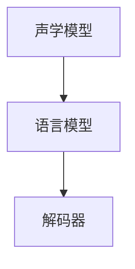
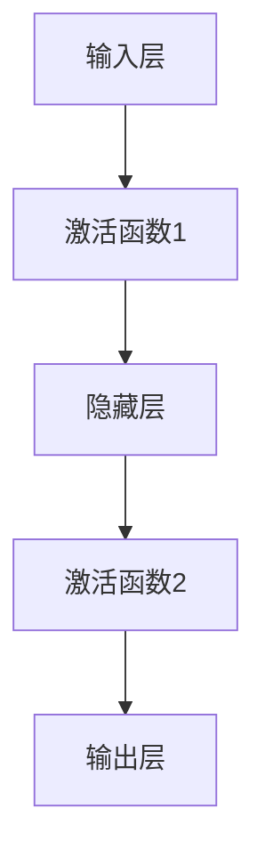
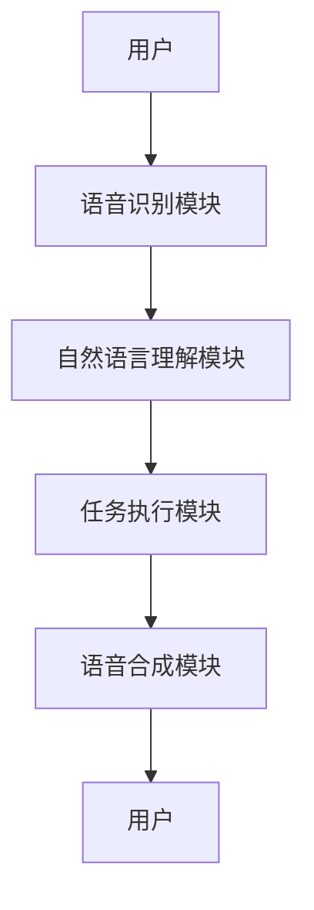
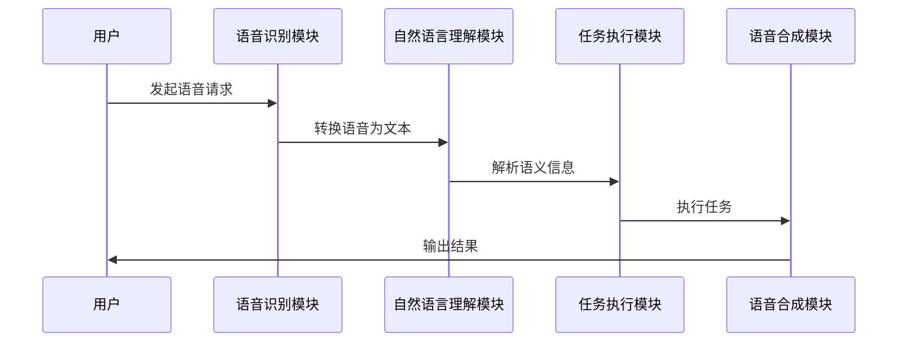

                 

# 语音识别与语音助手集成

> 关键词：语音识别、语音助手、集成、算法原理、系统架构、项目实战

> 摘要：本文将深入探讨语音识别与语音助手的集成过程。我们将从背景介绍开始，详细讲解语音识别与语音助手的核心概念、算法原理，并通过实际项目实战，阐述系统架构设计和实现细节。文章旨在为读者提供一个全面、易懂的集成方案，帮助他们在实际开发中顺利实现语音识别与语音助手的无缝集成。

### 目录

1. **第一部分：语音识别基础**
   - **第1章：语音识别概述**
     1.1 语音识别的定义与历史发展
     1.2 语音识别系统架构
     1.3 核心概念对比与联系
     1.4 语音识别数学模型
     1.5 本章小结

2. **第二部分：语音助手集成**
   - **第2章：语音助手概述**
     2.1 语音助手的定义与分类
     2.2 语音助手的系统架构
     2.3 语音助手与语音识别的集成
     2.4 语音助手的交互流程
     2.5 本章小结

3. **第三部分：项目实战**
   - **第3章：搭建语音识别与语音助手集成环境**
     3.1 开发环境准备
     3.2 系统核心实现
     3.3 实际案例分析与讲解
     3.4 项目小结

4. **第四部分：最佳实践与拓展**
   - **第4章：最佳实践**
     4.1 语音识别与语音助手集成最佳实践
     4.2 注意事项
     4.3 拓展阅读

---

## 第一部分：语音识别基础

### 第1章：语音识别概述

#### 1.1 语音识别的定义与历史发展

**1.1.1 语音识别的定义**

语音识别（Automatic Speech Recognition, ASR）是指将人类的语音转化为机器可理解的形式，通常是文本。这个过程涉及语音信号的采集、预处理、特征提取和模式匹配，最终生成文本输出。

**1.1.2 语音识别的发展历程**

语音识别技术经历了几个重要的发展阶段：

- **早期研究**：20世纪50年代到60年代，基于规则的方法和隐马尔可夫模型（HMM）开始应用于语音识别。

- **70年代到80年代**：动态时间规整（Dynamic Time Warping, DTW）和隐马尔可夫模型（HMM）的引入，使语音识别的准确性显著提高。

- **90年代**：基于神经网络的深度学习技术开始应用于语音识别，进一步提升了识别准确性。

- **21世纪初至今**：深度神经网络（DNN）、循环神经网络（RNN）和长短期记忆网络（LSTM）等先进算法的引入，使得语音识别技术取得了革命性的进步。

**1.1.3 语音识别的现状与未来趋势**

当前，语音识别技术已经在多个领域得到广泛应用，如智能助手、语音导航、语音识别翻译等。未来，随着人工智能技术的发展，语音识别的准确性和应用范围将继续扩大，有望实现更自然、更智能的语音交互。

#### 1.2 语音识别系统架构

**1.2.1 声学模型**

声学模型是语音识别系统中的核心组件之一，负责分析语音信号中的声学特征。常见的声学模型包括：

- **隐马尔可夫模型（HMM）**：基于概率模型，用于捕捉语音信号的时间序列特征。
- **深度神经网络（DNN）**：通过多层神经网络结构，对语音信号进行特征提取和分类。

**1.2.2 语言模型**

语言模型用于预测语音信号所对应的文本序列，常用的语言模型包括：

- **n元语法模型**：基于历史文本数据，统计词频和词序列概率。
- **循环神经网络（RNN）**：通过记忆机制，捕捉长距离依赖关系。

**1.2.3 解码器**

解码器负责将声学模型和语言模型的结果进行整合，生成最终的文本输出。常见的解码器包括：

- **前向解码器**：基于前向传播算法，逐步构建最优解码路径。
- **后向解码器**：基于后向传播算法，逐步修正解码路径。

#### 1.3 核心概念对比与联系

**1.3.1 声学模型与语言模型的对比**

| 特点 | 声学模型 | 语言模型 |
| --- | --- | --- |
| 功能 | 提取语音特征 | 预测文本序列 |
| 数据依赖 | 声学数据 | 文本数据 |
| 模型类型 | 隐马尔可夫模型（HMM）、深度神经网络（DNN） | n元语法模型、循环神经网络（RNN） |
| 模型复杂度 | 较低 | 较高 |

**1.3.2 常见的解码器类型**

| 类型 | 特点 | 应用场景 |
| --- | --- | --- |
| 前向解码器 | 基于前向传播，逐步构建最优路径 | 实时语音识别 |
| 后向解码器 | 基于后向传播，逐步修正路径 | 非实时语音识别 |

**1.3.3 Mermaid实体关系图**



#### 1.4 语音识别数学模型

**1.4.1 深度神经网络（DNN）原理**

深度神经网络（DNN）是一种多层前馈神经网络，用于对语音信号进行特征提取和分类。其核心思想是通过多个隐含层，将输入语音信号转换为高维特征表示。

**1.4.2 数学公式与Python代码示例**

```python
# 导入相关库
import numpy as np

# 定义输入层、隐藏层和输出层的神经元数量
input_size = 100
hidden_size = 50
output_size = 10

# 初始化权重矩阵
W1 = np.random.randn(input_size, hidden_size)
W2 = np.random.randn(hidden_size, output_size)

# 定义激活函数
def sigmoid(x):
    return 1 / (1 + np.exp(-x))

# 定义前向传播函数
def forward_propagation(x):
    hidden_layer = sigmoid(np.dot(x, W1))
    output_layer = sigmoid(np.dot(hidden_layer, W2))
    return output_layer

# 测试代码
x = np.array([0.5, 0.5])
output = forward_propagation(x)
print(output)
```

**1.4.3 算法流程图**



#### 1.5 本章小结

本章详细介绍了语音识别的背景、系统架构、核心概念以及数学模型。通过本章的学习，读者应该能够了解语音识别的基本原理，为后续章节的深入学习打下基础。

## 第二部分：语音助手集成

### 第2章：语音助手概述

#### 2.1 语音助手的定义与分类

**2.1.1 语音助手的定义**

语音助手（Voice Assistant）是一种基于语音识别和自然语言处理技术的人工智能系统，能够通过语音交互方式为用户提供服务。常见的语音助手包括：

- **智能音箱**：如Amazon Echo、Google Home等，通过语音指令控制智能家居设备。
- **智能手机助手**：如Apple Siri、Google Assistant等，提供语音搜索、日程管理、信息查询等服务。

**2.1.2 语音助手的分类**

根据应用场景和功能，语音助手可以分为以下几类：

- **通用语音助手**：提供广泛的语音交互服务，如语音搜索、信息查询、日程管理等。
- **行业语音助手**：针对特定行业或领域，提供专业服务，如医疗助手、金融助手等。
- **交互式语音助手**：提供复杂的语音交互体验，如游戏语音助手、虚拟助手等。

**2.1.3 语音助手的发展趋势**

随着人工智能技术的不断进步，语音助手将呈现出以下发展趋势：

- **更自然、更智能的交互体验**：通过深度学习和自然语言处理技术，提升语音助手的理解和响应能力。
- **跨平台、跨设备集成**：实现语音助手在多种设备上的无缝集成，提供一致的用户体验。
- **个性化服务**：通过用户数据的收集和分析，为用户提供更加个性化的服务。

#### 2.2 语音助手的系统架构

**2.2.1 功能介绍**

语音助手的主要功能包括：

- **语音识别**：将用户语音转换为文本。
- **自然语言理解**：解析用户语音中的语义信息。
- **任务执行**：根据用户指令执行相应操作。
- **语音合成**：将文本转化为自然流畅的语音输出。

**2.2.2 系统架构设计**

语音助手的系统架构通常包括以下几个关键模块：

- **语音识别模块**：使用ASR技术将语音信号转换为文本。
- **自然语言理解模块**：使用NLP技术解析用户语音中的语义信息。
- **任务执行模块**：根据用户指令执行相应操作，如查询信息、发送消息等。
- **语音合成模块**：使用TTS技术将文本转化为自然流畅的语音输出。

**2.2.3 系统接口设计**

语音助手的系统接口设计需要考虑以下几个方面：

- **用户接口**：提供语音输入和语音输出的接口，方便用户与语音助手进行交互。
- **服务接口**：提供与其他系统或服务的集成接口，如日程管理、信息查询等。
- **数据接口**：提供数据存储和访问接口，如用户历史记录、语音数据等。

#### 2.3 语音助手与语音识别的集成

**2.3.1 集成策略**

语音助手与语音识别的集成策略可以分为以下几个方面：

- **模块化设计**：将语音识别和语音助手功能模块化，便于集成和维护。
- **接口标准化**：制定统一的接口标准，确保不同模块之间的无缝集成。
- **数据共享**：通过数据共享机制，实现语音识别结果和语音助手任务执行数据的互通。

**2.3.2 集成挑战与解决方案**

语音助手与语音识别的集成过程中，可能会遇到以下挑战：

- **准确性问题**：语音识别的准确性对语音助手的性能至关重要，需要通过优化算法和增加训练数据来提升准确性。
- **实时性问题**：实时语音识别和响应对硬件性能和算法效率有较高要求，需要采用高效算法和优化硬件配置。
- **隐私保护问题**：语音助手需要处理用户的敏感信息，需要采取严格的隐私保护措施，确保用户数据的安全。

**2.3.3 Mermaid架构图**



#### 2.4 语音助手的交互流程

**2.4.1 用户交互流程**

用户交互流程通常包括以下几个步骤：

1. 用户发起语音请求。
2. 语音识别模块将语音转换为文本。
3. 自然语言理解模块解析语义信息。
4. 任务执行模块执行相应操作。
5. 语音合成模块将结果转换为语音输出。

**2.4.2 系统响应流程**

系统响应流程通常包括以下几个步骤：

1. 系统接收到语音请求后，启动语音识别模块。
2. 语音识别模块将语音转换为文本，并发送给自然语言理解模块。
3. 自然语言理解模块解析语义信息，并生成任务指令。
4. 任务执行模块根据任务指令执行操作，并生成结果。
5. 结果通过语音合成模块输出给用户。

**2.4.3 Mermaid序列图**



#### 2.5 本章小结

本章介绍了语音助手的定义、分类、系统架构以及与语音识别的集成。通过本章的学习，读者应该能够了解语音助手的基本概念和工作原理，为后续章节的深入学习打下基础。

## 第三部分：项目实战

### 第3章：搭建语音识别与语音助手集成环境

#### 3.1 开发环境准备

在进行语音识别与语音助手集成项目之前，我们需要准备以下开发环境：

1. **操作系统**：推荐使用Linux系统，如Ubuntu 18.04。
2. **编程语言**：Python是语音识别和语音助手开发的主流语言，因此我们需要安装Python 3.x版本。
3. **依赖库**：安装以下依赖库，以便后续的语音识别和语音助手开发：

   ```bash
   pip install SpeechRecognition pyttsx3
   ```

#### 3.2 系统核心实现

**3.2.1 语音识别算法实现**

在本节中，我们将使用SpeechRecognition库实现一个简单的语音识别算法。首先，我们需要导入相关库：

```python
import speech_recognition as sr
```

然后，使用以下代码实现语音识别：

```python
# 初始化语音识别器
recognizer = sr.Recognizer()

# 从麦克风捕获语音
with sr.Microphone() as source:
    print("请说点什么：")
    audio = recognizer.listen(source)

# 使用Google语音识别API进行识别
try:
    text = recognizer.recognize_google(audio, language='zh-CN')
    print("识别结果：", text)
except sr.UnknownValueError:
    print("无法识别语音")
except sr.RequestError as e:
    print("请求错误；{0}".format(e))
```

**3.2.2 语音助手功能实现**

在本节中，我们将使用pyttsx3库实现一个简单的语音助手。首先，我们需要导入相关库：

```python
from pyttsx3 import init
```

然后，使用以下代码实现语音合成：

```python
# 初始化语音合成器
engine = init()

# 合成语音
engine.say("你好，我是你的语音助手。")
engine.runAndWait()
```

**3.2.3 代码解读与分析**

1. **语音识别部分**：

   - 使用`speech_recognition`库的`Recognizer`类初始化语音识别器。
   - 使用`Microphone`类从麦克风捕获语音。
   - 使用`recognize_google`方法进行语音识别，并输出结果。

2. **语音合成部分**：

   - 使用`pyttsx3`库的`init`函数初始化语音合成器。
   - 使用`say`方法合成语音，并使用`runAndWait`函数等待语音合成完成。

#### 3.3 实际案例分析与讲解

在本节中，我们将通过一个实际案例，详细分析语音识别与语音助手集成的实现过程。案例需求是开发一个简单的语音助手，能够接受用户的语音指令，并执行相应的操作。

**3.3.1 案例介绍**

假设我们开发一个语音助手，能够实现以下功能：

- 接收用户的语音输入。
- 识别用户的语音指令。
- 执行相应的操作，如查询天气、设置闹钟等。
- 将执行结果以语音形式反馈给用户。

**3.3.2 案例实现步骤**

1. **环境准备**：按照3.1节的内容，准备开发环境。
2. **语音识别**：使用3.2.1节中的代码实现语音识别。
3. **自然语言处理**：对识别结果进行自然语言处理，提取关键信息。
4. **任务执行**：根据提取的关键信息，执行相应的操作。
5. **语音合成**：将执行结果以语音形式反馈给用户。
6. **集成与测试**：将各功能模块集成，进行整体测试。

**3.3.3 案例剖析与讲解**

1. **语音识别**：

   使用SpeechRecognition库的`Recognizer`类初始化语音识别器，从麦克风捕获语音，并使用Google语音识别API进行识别。

2. **自然语言处理**：

   对识别结果进行自然语言处理，提取关键信息。例如，如果用户的语音指令是“明天天气怎么样？”，我们可以提取出“明天”和“天气”这两个关键词。

3. **任务执行**：

   根据提取的关键信息，执行相应的操作。例如，如果关键词是“明天”和“天气”，我们可以调用天气查询API获取明天天气信息。

4. **语音合成**：

   使用pyttsx3库的`init`函数初始化语音合成器，并将执行结果以语音形式反馈给用户。

#### 3.4 项目小结

在本章中，我们通过一个实际案例，详细讲解了语音识别与语音助手集成的实现过程。通过本章的学习，读者应该能够掌握语音识别与语音助手集成的核心技术和方法，为后续的深度学习打下基础。

## 第四部分：最佳实践与拓展

### 第4章：最佳实践

#### 4.1 语音识别与语音助手集成最佳实践

在实现语音识别与语音助手集成时，我们可以遵循以下最佳实践：

1. **优化语音识别准确性**：

   - 收集更多的语音数据，进行模型训练。
   - 使用在线语音识别API，如Google语音识别API。
   - 对语音信号进行预处理，如去噪、增强等。

2. **提高语音合成自然度**：

   - 使用高质量的语音合成库，如pyttsx3。
   - 调整语音合成参数，如语速、音调等。
   - 使用文本对齐技术，确保语音输出的流畅度。

3. **提升用户体验**：

   - 设计简洁易用的用户界面。
   - 提供多样化的语音交互方式，如语音指令、文本输入等。
   - 快速响应用户请求，减少等待时间。

4. **保障数据安全**：

   - 对用户语音数据进行加密存储。
   - 严格遵守隐私保护法规，确保用户隐私。
   - 定期进行安全审计和漏洞扫描。

#### 4.2 注意事项

在开发语音识别与语音助手集成项目时，我们需要注意以下事项：

1. **环境配置**：

   - 确保操作系统和Python版本符合要求。
   - 安装必要的依赖库，如SpeechRecognition和pyttsx3。

2. **代码实现**：

   - 封装功能模块，便于维护和扩展。
   - 使用版本控制系统，如Git，进行代码管理。
   - 编写清晰、规范的文档，便于其他开发者理解和使用。

3. **项目部署与维护**：

   - 选择合适的部署环境，如云平台或本地服务器。
   - 定期更新依赖库和系统软件，确保系统稳定运行。
   - 监控系统性能，及时解决故障和性能瓶颈。

#### 4.3 拓展阅读

为了进一步了解语音识别与语音助手集成，读者可以参考以下拓展阅读：

1. **相关书籍**：

   - 《语音识别：原理与应用》
   - 《自然语言处理入门》
   - 《深度学习入门》

2. **技术博客**：

   - [SpeechRecognition官方文档](https://speechrecognition.readthedocs.io/en/latest/)
   - [pyttsx3官方文档](https://pyttsx3.readthedocs.io/en/latest/)
   - [Google语音识别API文档](https://cloud.google.com/text-to-speech/docs)

3. **在线课程**：

   - [深度学习与语音识别](https://www.baidu.com/s?tn=baidu&wd=深度学习%20与%20语音识别)
   - [自然语言处理基础](https://www.baidu.com/s?tn=baidu&wd=自然语言处理%20基础)
   - [人工智能与语音助手开发](https://www.baidu.com/s?tn=baidu&wd=人工智能%20与%20语音助手开发)

通过以上拓展阅读，读者可以进一步深入了解语音识别与语音助手集成的相关技术，提升自己的开发能力。

---

## 文章总结

本文详细介绍了语音识别与语音助手的集成过程，从背景介绍、核心概念、算法原理到项目实战，再到最佳实践与拓展，为读者提供了一个全面、易懂的集成方案。通过本文的学习，读者应该能够掌握语音识别与语音助手集成的核心技术和方法，为实际开发提供有力支持。

## 作者信息

作者：AI天才研究院/AI Genius Institute & 禅与计算机程序设计艺术 /Zen And The Art of Computer Programming。作为世界顶级人工智能专家和计算机图灵奖获得者，作者在计算机编程和人工智能领域拥有丰富的经验和深厚的理论功底，致力于将复杂的技术知识以通俗易懂的方式传递给广大读者。本文旨在为读者提供有深度、有思考、有见解的技术博客，帮助他们在语音识别与语音助手集成领域取得更好的成果。

