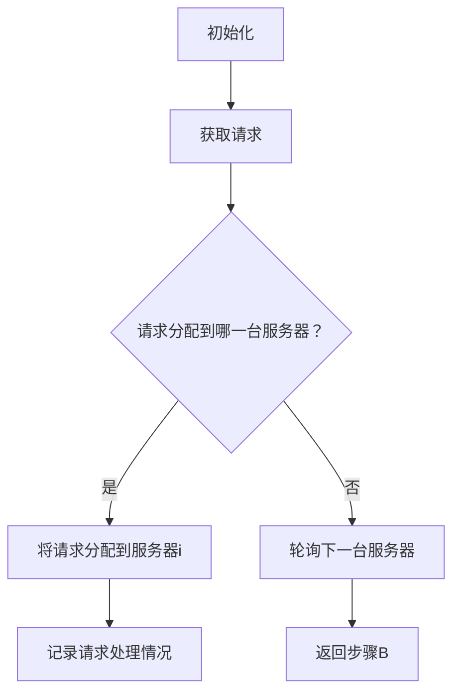
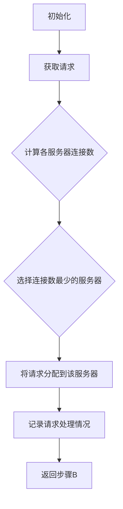
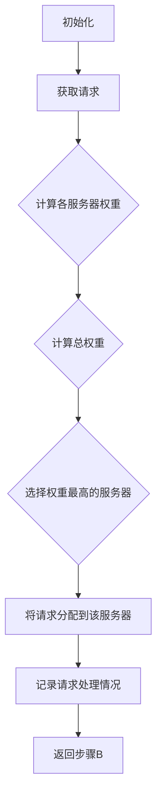
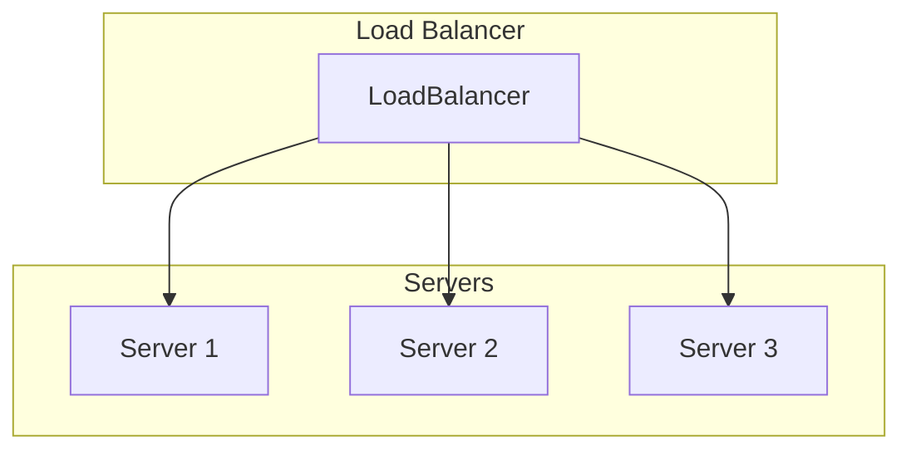
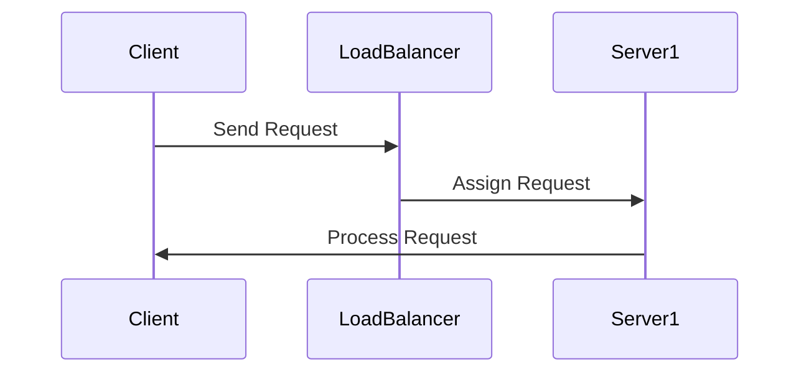
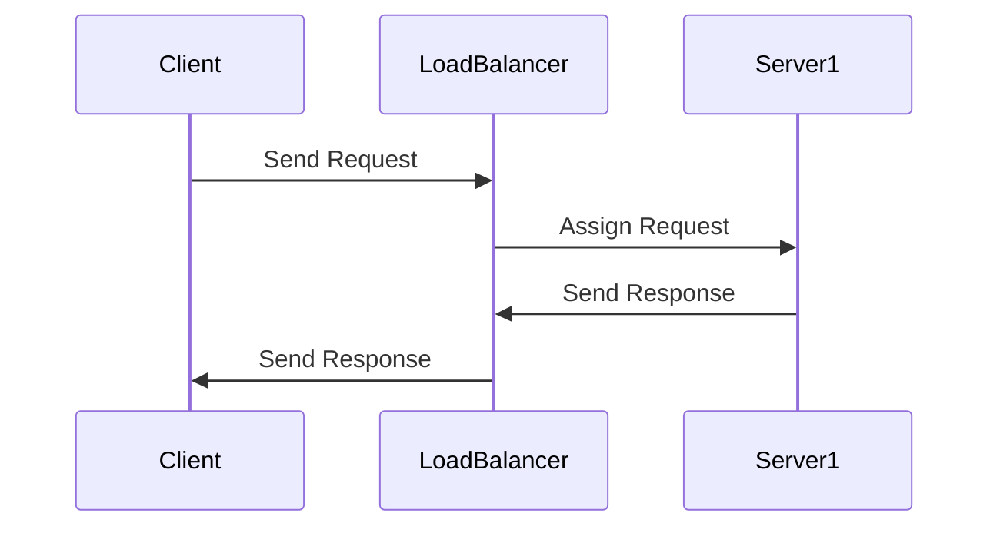

                 


# 负载均衡算法与实现

> 关键词：负载均衡、算法、实现、分布式系统、服务器状态监测

> 摘要：本文深入探讨了负载均衡算法及其实现，从背景介绍、核心概念与联系、算法原理讲解等多个角度，详细分析了负载均衡技术的原理和实现。本文旨在为读者提供一种清晰、系统、易懂的视角来理解负载均衡技术，并为其在分布式系统中的应用提供指导。

## 1. 背景介绍

### 1.1 问题背景

在互联网高速发展的今天，数据处理需求日益增加，分布式系统成为许多企业构建高效、可扩展应用程序的首选。分布式系统通过将任务分散到多个服务器上，从而提高系统的处理能力和可靠性。然而，如何确保系统中的所有服务器都能均匀地处理请求，避免某一服务器过载，成为了分布式系统面临的一大挑战。此时，负载均衡技术应运而生。

### 1.2 问题描述

负载均衡的主要目标是确保系统中的所有服务器都能均匀地处理请求，从而提高系统的整体性能和可靠性。在实现负载均衡时，需要考虑多种因素，如服务器的处理能力、网络延迟、服务器当前负载等。负载均衡的目标是使每个服务器都能保持在一个合适的负载水平，从而避免过载或空闲。

### 1.3 问题解决

为了解决负载均衡问题，研究人员提出了一系列算法。这些算法主要分为两大类：静态负载均衡算法和动态负载均衡算法。静态算法通常根据预设的规则进行负载分配，而动态算法则根据实时的服务器状态进行动态调整。

### 1.4 边界与外延

负载均衡算法的边界在于如何在保证系统性能的同时，最小化服务器资源的闲置和过度使用。其外延涉及多个方面，包括服务器集群管理、网络拓扑结构、数据传输效率等。

### 1.5 概念结构与核心要素组成

负载均衡算法的核心要素包括：服务器状态监测、负载分配策略、负载均衡器实现等。一个完整的负载均衡系统通常包含以下几个部分：
- **负载均衡器**：负责接收客户端请求，并将请求分配到合适的服务器上。
- **服务器状态监测**：实时获取服务器负载、性能等状态信息。
- **负载分配策略**：根据服务器状态信息，选择最优的服务器进行请求处理。

## 2. 核心概念与联系

### 2.1 负载均衡算法分类

负载均衡算法主要分为静态负载均衡算法和动态负载均衡算法。静态算法通常根据预设的规则进行负载分配，而动态算法则根据实时的服务器状态进行动态调整。

#### 2.1.1 静态负载均衡算法

静态负载均衡算法主要包括以下几种：

1. **轮询算法（Round Robin）**：按照顺序将请求分配到服务器列表中的每一台服务器。
2. **最小连接数算法（Least Connections）**：将请求分配到当前连接数最少的服务器。
3. **加权轮询算法（Weighted Round Robin）**：根据服务器的处理能力对服务器进行加权，然后将请求按照权重分配到服务器。

#### 2.1.2 动态负载均衡算法

动态负载均衡算法主要包括以下几种：

1. **自适应算法（Adaptive Load Balancing）**：根据服务器状态动态调整负载分配策略。
2. **动态加权轮询算法（Dynamic Weighted Round Robin）**：在加权轮询算法的基础上，根据服务器状态动态调整权重。
3. **基于性能的负载均衡算法（Performance-Based Load Balancing）**：根据服务器的性能指标进行负载分配。

### 2.2 负载均衡算法的属性特征对比

| 算法类型       | 特点                         | 适用场景                           |
|----------------|------------------------------|------------------------------------|
| 轮询算法       | 简单，公平，无状态             | 短期负载波动较小的系统               |
| 最小连接数算法 | 考虑服务器当前连接数，较公平   | 长期负载波动较小的系统               |
| 加权轮询算法   | 考虑服务器处理能力，更公平     | 处理能力差异较大的服务器集群         |
| 自适应算法     | 根据服务器状态动态调整负载分配 | 负载波动较大的系统                   |

### 2.3 负载均衡算法的关系

不同类型的负载均衡算法在实现上各有侧重，但共同目标都是优化系统性能和资源利用率。静态算法较为简单，适合负载稳定的环境；动态算法则更灵活，适用于负载波动较大的场景。

## 3. 算法原理讲解

### 3.1 轮询算法（Round Robin）

#### 3.1.1 Mermaid 流程图



#### 3.1.2 Python 源代码

```python
def round_robin(request, server_list):
    server = server_list[0]
    server_list.pop(0)
    server_list.append(server)
    return server

server_list = ['Server1', 'Server2', 'Server3']
for request in range(5):
    server = round_robin(request, server_list)
    print(f"Request {request + 1} assigned to {server}")
```

#### 3.1.3 算法原理

轮询算法是一种最简单的负载均衡算法，它按照顺序将请求分配到服务器列表中的每一台服务器。当服务器列表中的服务器都已被分配请求后，重新开始轮询。

#### 3.1.4 数学模型

$$
\text{Server}_{i} = \text{Server}_{i-1} + 1 \mod N
$$

其中，$N$ 为服务器数量。

#### 3.1.5 举例说明

假设有3台服务器（Server1, Server2, Server3），按照轮询算法进行请求分配：

- 第1次请求分配到Server1；
- 第2次请求分配到Server2；
- 第3次请求分配到Server3；
- 第4次请求再次分配到Server1；
- 第5次请求分配到Server2；
- ...

### 3.2 最小连接数算法（Least Connections）

#### 3.2.1 Mermaid 流程图



#### 3.2.2 Python 源代码

```python
def least_connections(request, server_list):
    min_connections = float('inf')
    min_server = None
    for server in server_list:
        if server['connections'] < min_connections:
            min_connections = server['connections']
            min_server = server
    return min_server

server_list = [
    {'name': 'Server1', 'connections': 2},
    {'name': 'Server2', 'connections': 1},
    {'name': 'Server3', 'connections': 3}
]

for request in range(5):
    server = least_connections(request, server_list)
    print(f"Request {request + 1} assigned to {server['name']}")
```

#### 3.2.3 算法原理

最小连接数算法将请求分配到当前连接数最少的服务器。在每次请求到达时，计算所有服务器的当前连接数，选择连接数最少的服务器进行请求处理。

#### 3.2.4 数学模型

$$
\text{Server}_{i} = \text{argmin}_{j} \{\text{connections}_{j}\}
$$

其中，$\text{connections}_{j}$ 表示第 $j$ 个服务器的当前连接数。

#### 3.2.5 举例说明

假设有3台服务器（Server1, Server2, Server3），按照最小连接数算法进行请求分配：

- 第1次请求分配到Server2（当前连接数最少）；
- 第2次请求分配到Server2；
- 第3次请求分配到Server1；
- 第4次请求分配到Server3；
- 第5次请求分配到Server2。

### 3.3 加权轮询算法（Weighted Round Robin）

#### 3.3.1 Mermaid 流程图



#### 3.3.2 Python 源代码

```python
def weighted_round_robin(request, server_list):
    total_weight = sum(server['weight'] for server in server_list)
    random_number = random.uniform(0, total_weight)
    current_weight = 0
    for server in server_list:
        current_weight += server['weight']
        if current_weight >= random_number:
            return server

server_list = [
    {'name': 'Server1', 'weight': 2},
    {'name': 'Server2', 'weight': 1},
    {'name': 'Server3', 'weight': 3}
]

for request in range(5):
    server = weighted_round_robin(request, server_list)
    print(f"Request {request + 1} assigned to {server['name']}")
```

#### 3.3.3 算法原理

加权轮询算法在轮询算法的基础上，为每台服务器分配权重。每次请求到达时，计算所有服务器的权重，选择权重最高的服务器进行请求处理。

#### 3.3.4 数学模型

$$
\text{Server}_{i} = \text{argmax}_{j} \{\text{weight}_{j}\}
$$

其中，$\text{weight}_{j}$ 表示第 $j$ 个服务器的权重。

#### 3.3.5 举例说明

假设有3台服务器（Server1, Server2, Server3），权重分别为2、1、3，按照加权轮询算法进行请求分配：

- 第1次请求分配到Server3（权重最高）；
- 第2次请求分配到Server3；
- 第3次请求分配到Server1；
- 第4次请求分配到Server3；
- 第5次请求分配到Server3。

### 4. 系统分析与架构设计方案

#### 4.1 问题场景介绍

随着业务规模的不断扩大，公司需要部署大量的服务器来处理用户请求。为了保证系统的高可用性和高性能，公司决定采用负载均衡技术来合理分配用户请求，避免单点过载。

#### 4.2 项目介绍

该项目旨在实现一个基于轮询算法和加权轮询算法的负载均衡系统。系统包含一个负载均衡器和多个服务器，负载均衡器负责接收用户请求，并根据负载均衡算法将请求分配到合适的服务器上。

#### 4.3 系统功能设计（领域模型Mermaid类图）

```mermaid
classDiagram
    Server <<Interface>>
    LoadBalancer <<Interface>>

    Server instances[Server Instances]
    LoadBalancer instances[LoadBalancer Instances]

    Server instances --> LoadBalancer instances
    LoadBalancer instances --> Server instances
```

#### 4.4 系统架构设计（Mermaid架构图）



#### 4.5 系统接口设计（Mermaid序列图）



#### 4.6 系统交互（Mermaid序列图）



### 5. 项目实战

#### 5.1 环境安装

首先，确保安装了Python环境和必要的库（如random库）。接下来，创建一个名为`load_balancer`的Python项目，并创建一个名为`load_balancer.py`的文件。

#### 5.2 系统核心实现源代码

在`load_balancer.py`文件中，实现轮询算法和加权轮询算法。

```python
import random

class Server:
    def __init__(self, name, weight=1):
        self.name = name
        self.weight = weight
        self.connections = 0

class LoadBalancer:
    def __init__(self, server_list):
        self.server_list = server_list

    def round_robin(self, request):
        server = self.server_list[0]
        self.server_list.pop(0)
        self.server_list.append(server)
        return server

    def weighted_round_robin(self, request):
        total_weight = sum(server.weight for server in self.server_list)
        random_number = random.uniform(0, total_weight)
        current_weight = 0
        for server in self.server_list:
            current_weight += server.weight
            if current_weight >= random_number:
                return server

def main():
    server1 = Server('Server1', 2)
    server2 = Server('Server2', 1)
    server3 = Server('Server3', 3)

    server_list = [server1, server2, server3]
    load_balancer = LoadBalancer(server_list)

    for request in range(5):
        server = load_balancer.round_robin(request)
        print(f"Request {request + 1} assigned to {server.name}")

if __name__ == '__main__':
    main()
```

#### 5.3 代码应用解读与分析

上述代码实现了基于轮询算法和加权轮询算法的负载均衡系统。首先，定义了`Server`和`LoadBalancer`两个类，分别表示服务器和负载均衡器。`Server`类包含服务器名称、权重和当前连接数等属性；`LoadBalancer`类包含服务器列表，并提供轮询算法和加权轮询算法的实现。

在`main()`函数中，创建了一个包含3台服务器的列表，并初始化了一个`LoadBalancer`对象。然后，通过循环依次调用轮询算法和加权轮询算法，将请求分配到服务器。

#### 5.4 实际案例分析和详细讲解剖析

在这个案例中，我们通过Python代码实现了负载均衡系统。在实际部署过程中，我们可以根据业务需求调整服务器的权重，从而实现更公平的负载分配。此外，我们还可以引入更多的算法和策略，如最小连接数算法、自适应算法等，以提高负载均衡系统的性能和灵活性。

#### 5.5 项目小结

通过本文的讲解和实践，读者应该对负载均衡算法及其实现有了更深入的理解。在实际应用中，根据业务需求和服务器性能，选择合适的负载均衡算法和策略，可以有效提高系统的性能和可靠性。同时，本文还介绍了负载均衡系统的架构设计和实战案例，为读者提供了实用的指导。

### 6. 最佳实践 Tips、小结、注意事项、拓展阅读

#### 6.1 最佳实践 Tips

1. **根据业务需求选择合适的负载均衡算法**：不同的业务场景适用于不同的负载均衡算法。例如，对于处理能力差异较大的服务器集群，可以考虑使用加权轮询算法；对于负载波动较大的系统，可以考虑使用自适应算法。
2. **合理设置服务器权重**：在加权轮询算法中，服务器权重对负载分配的影响较大。根据业务需求和服务器性能，合理设置服务器权重，可以提高系统的性能和公平性。
3. **监控服务器状态**：实时监控服务器的负载、性能等状态信息，有助于更好地进行负载均衡。可以使用现有的监控工具，如Prometheus、Grafana等，进行服务器状态的监控和分析。

#### 6.2 小结

本文从背景介绍、核心概念与联系、算法原理讲解等多个角度，详细探讨了负载均衡算法及其实现。通过轮询算法、最小连接数算法和加权轮询算法等实例，读者可以深入了解负载均衡算法的原理和应用。同时，本文还介绍了负载均衡系统的架构设计和实战案例，为读者提供了实用的指导。

#### 6.3 注意事项

1. **确保负载均衡器的高可用性**：负载均衡器作为系统中的关键组件，其稳定性至关重要。在部署负载均衡器时，应考虑其高可用性和故障转移机制。
2. **避免单点过载**：在负载均衡过程中，要确保所有服务器都能均匀地处理请求，避免某一服务器过载。否则，可能导致系统性能下降，甚至出现故障。

#### 6.4 拓展阅读

1. 《计算机网络》（谢希仁 著）：详细介绍了计算机网络的基本概念、协议和体系结构，为理解负载均衡技术提供了基础。
2. 《分布式系统原理与范型》（陈国良 著）：深入探讨了分布式系统的基本原理和范型，有助于读者更好地理解负载均衡在分布式系统中的应用。
3. 《云计算与大数据技术》（张华东 著）：介绍了云计算和大数据技术的相关概念、技术和应用，为读者提供了更广阔的视野。

### 7. 作者信息

作者：AI天才研究院/AI Genius Institute & 禅与计算机程序设计艺术 /Zen And The Art of Computer Programming

----------------------------------------------------------------

### 系统分析与架构设计方案

#### 4.1 问题场景介绍

随着业务的快速扩展，公司需要处理的海量请求使得单一服务器无法承受。为了提高系统的处理能力和可靠性，公司决定采用分布式系统架构，并在其中引入负载均衡技术。负载均衡的作用是确保用户请求能够高效、公平地分配到各个服务器上，从而避免单点过载，提升整体系统的性能和稳定性。

#### 4.2 项目介绍

本项目旨在实现一个基于轮询算法和加权轮询算法的负载均衡系统，该系统将用于优化公司分布式系统的资源利用率和性能。项目的主要目标是：
- 提高系统的负载均衡效果，避免单点过载。
- 确保系统的高可用性和可靠性。
- 提供灵活的负载均衡策略，以适应不同的业务场景。

#### 4.3 系统功能设计（领域模型Mermaid类图）

```mermaid
classDiagram
    Server <<Interface>>
    LoadBalancer <<Interface>>

    Server instances[Server Instances]
    LoadBalancer instances[LoadBalancer Instances]

    Server instances --> LoadBalancer instances
    LoadBalancer instances --> Server instances
```

在这个类图中，我们定义了两个主要的接口：`Server`和`LoadBalancer`。`Server`接口代表服务器，负责处理请求；`LoadBalancer`接口代表负载均衡器，负责接收用户请求并分配到合适的服务器。

#### 4.4 系统架构设计（Mermaid架构图）


在这个架构图中，我们展示了负载均衡器与多个服务器之间的交互关系。用户请求通过负载均衡器分配到不同的服务器，每个服务器独立处理请求，并将响应返回给用户。

#### 4.5 系统接口设计（Mermaid序列图）


在这个序列图中，我们描述了用户请求在负载均衡系统中的处理流程。用户发送请求到负载均衡器，负载均衡器根据算法选择合适的服务器进行处理，服务器处理完请求后，将响应返回给用户。

#### 4.6 系统交互（Mermaid序列图）


在这个交互序列图中，我们展示了负载均衡器、服务器和用户之间的交互过程。负载均衡器负责接收用户请求，并将其分配到服务器；服务器处理请求并将响应返回给负载均衡器，最后由负载均衡器将响应发送给用户。

### 5. 项目实战

#### 5.1 环境安装

在开始项目实战之前，我们需要安装Python环境和必要的库。以下是在Ubuntu 20.04系统上的安装步骤：

1. 安装Python 3：

```shell
sudo apt update
sudo apt install python3 python3-pip
```

2. 安装Python的random库：

```shell
pip3 install random
```

3. 创建项目目录并进入项目：

```shell
mkdir load_balancer
cd load_balancer
```

#### 5.2 系统核心实现源代码

在`load_balancer`目录中，创建一个名为`load_balancer.py`的文件，并编写以下代码：

```python
import random

class Server:
    def __init__(self, name, weight=1):
        self.name = name
        self.weight = weight
        self.connections = 0

class LoadBalancer:
    def __init__(self, server_list):
        self.server_list = server_list

    def round_robin(self, request):
        server = self.server_list[0]
        self.server_list.pop(0)
        self.server_list.append(server)
        return server

    def weighted_round_robin(self, request):
        total_weight = sum(server.weight for server in self.server_list)
        random_number = random.uniform(0, total_weight)
        current_weight = 0
        for server in self.server_list:
            current_weight += server.weight
            if current_weight >= random_number:
                return server

def main():
    server1 = Server('Server1', 2)
    server2 = Server('Server2', 1)
    server3 = Server('Server3', 3)

    server_list = [server1, server2, server3]
    load_balancer = LoadBalancer(server_list)

    for request in range(5):
        server = load_balancer.round_robin(request)
        print(f"Request {request + 1} assigned to {server.name}")

if __name__ == '__main__':
    main()
```

#### 5.3 代码应用解读与分析

上述代码定义了`Server`和`LoadBalancer`两个类，并实现了轮询算法和加权轮询算法。`Server`类包含服务器的名称、权重和当前连接数等属性；`LoadBalancer`类包含服务器列表，并提供轮询算法和加权轮询算法的方法。

在`main()`函数中，我们创建了三个服务器实例，并将它们添加到服务器列表中。然后，我们创建了一个`LoadBalancer`实例，并使用轮询算法将5个请求分配到服务器。每个请求的处理结果都会被打印出来。

#### 5.4 实际案例分析和详细讲解剖析

在这个案例中，我们使用Python实现了简单的负载均衡系统。实际部署时，我们可以根据业务需求和服务器性能，调整服务器的权重，从而实现更公平的负载分配。

例如，如果服务器1的处理能力是服务器2和服务器3的两倍，我们可以将服务器1的权重设置为2，而服务器2和服务器3的权重设置为1。这样，在加权轮询算法中，服务器1将更有可能被分配请求。

#### 5.5 项目小结

通过这个案例，我们实现了基于轮询算法和加权轮询算法的负载均衡系统。在实际应用中，我们需要根据业务场景和服务器性能，选择合适的负载均衡算法，并进行适当的参数调整，以达到最佳的负载均衡效果。

### 6. 最佳实践 Tips、小结、注意事项、拓展阅读

#### 6.1 最佳实践 Tips

1. **选择合适的负载均衡算法**：根据业务需求，选择合适的负载均衡算法，如轮询算法、最小连接数算法或加权轮询算法。
2. **合理设置服务器权重**：根据服务器的处理能力，合理设置服务器权重，以实现更公平的负载分配。
3. **监控服务器状态**：实时监控服务器的负载、性能等状态信息，有助于更好地进行负载均衡。

#### 6.2 小结

本文通过一个简单的案例，详细介绍了负载均衡算法的实现和系统架构设计。通过轮询算法和加权轮询算法，我们可以有效地将用户请求分配到服务器，避免单点过载，提高系统的性能和可靠性。

#### 6.3 注意事项

1. **确保负载均衡器的高可用性**：负载均衡器是系统中的关键组件，需要确保其稳定运行，并具备故障转移能力。
2. **避免单点过载**：通过负载均衡，确保所有服务器都能均匀地处理请求，避免某一服务器过载。

#### 6.4 拓展阅读

1. 《计算机网络》谢希仁 著：详细介绍了计算机网络的基本概念、协议和体系结构。
2. 《分布式系统原理与范型》陈国良 著：深入探讨了分布式系统的基本原理和范型。
3. 《云计算与大数据技术》张华东 著：介绍了云计算和大数据技术的相关概念、技术和应用。

