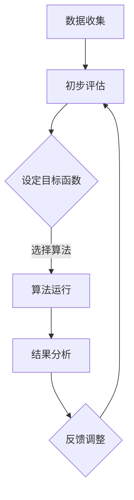
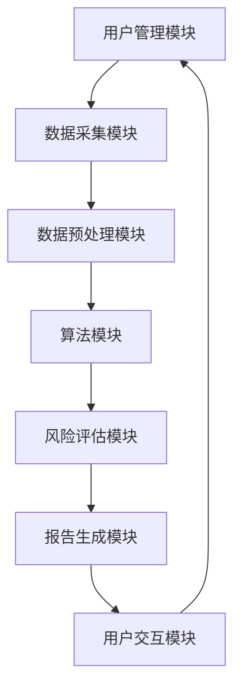
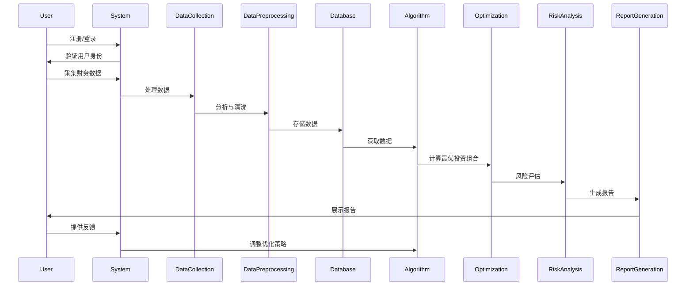

                 

### 退休计划优化算法概述

#### **背景介绍**

**1.1 问题背景**

退休计划是每位工作者在职业生涯末期的重要关注点。随着生活成本的不断上升和寿命的延长，退休后的经济保障显得尤为重要。传统的退休计划往往依赖于固定的储蓄率和投资策略，但随着金融市场波动性和不确定性的增加，这种固定策略的风险也在不断增大。退休计划优化算法应运而生，旨在通过数学模型和算法，为个人和企业提供更加科学、灵活和个性化的退休规划方案。

**1.1.1 退休计划的重要性**

退休计划不仅是个人财务规划的一部分，更是社会保障体系的重要组成部分。一个合理的退休计划能够确保老年生活有稳定的经济来源，减少因经济压力带来的生活质量的下降，提升退休后的幸福感和满意度。

**1.1.2 退休计划的常见问题**

1. **储蓄不足**：许多人由于年轻时缺乏财务规划和储蓄意识，导致退休后储蓄不足。
2. **投资风险**：传统的固定投资策略在面临市场波动时，往往无法有效规避风险。
3. **预期寿命变化**：随着医学技术的进步和生活方式的改变，人们的预期寿命不断延长，退休金需要覆盖更长的时间段。
4. **通货膨胀**：随着时间的推移，生活成本会不断增加，退休金的购买力会逐渐下降。

**1.1.3 退休计划优化的必要性**

退休计划优化算法通过结合个人财务状况、风险偏好和市场动态，提供动态调整和优化的退休投资策略。这不仅能有效降低退休后的经济风险，还能提高退休金的投资回报率，确保退休生活质量。

#### **问题描述与解决方法**

**1.2 退休计划优化问题的定义**

退休计划优化问题是一个典型的多目标优化问题，它涉及到在一定的预算和风险范围内，如何最大化退休金的投资收益。具体来说，就是如何合理配置资产，使得退休金在满足预期寿命和风险承受能力的前提下，获得最大的回报。

**1.2.1 传统退休计划方案的不足**

传统退休计划方案通常采用固定比例的投资组合，如60%的股票和40%的债券，这种策略在市场稳定时表现较好，但在市场波动较大时，风险较高。此外，传统的方案忽略了个体差异，如不同人的风险偏好、预期寿命和生活方式等，导致方案不够个性化和科学。

**1.2.2 优化退休计划的目标和方法**

优化退休计划的目标是在确保退休金安全性的前提下，最大化其投资收益。具体方法包括：

1. **动态资产配置**：根据市场动态和个体风险承受能力，动态调整资产配置比例。
2. **风险控制**：通过风险平价、均值-方差优化等方法，控制退休计划的风险。
3. **生命周期策略**：根据退休年龄、预期寿命和退休后的生活方式，制定个性化的退休计划。

#### **边界与外延**

**1.3 边界与外延**

**1.3.1 退休计划的边界条件**

边界条件包括退休年龄、预期寿命、退休前收入水平、退休后的生活开支、投资预算和风险承受能力等。

**1.3.2 退休计划优化的外部因素**

外部因素包括金融市场变化、通货膨胀率、税收政策、社会保障政策等。

**1.3.3 退休计划优化的问题范畴**

问题范畴包括个人退休计划、企业退休金管理、退休投资策略设计、退休财富管理等多个方面。

#### **核心概念与要素组成**

**1.4 核心概念与要素组成**

退休计划优化算法涉及多个核心概念，包括：

1. **目标函数**：最大化退休金收益，同时确保投资风险在可接受范围内。
2. **约束条件**：包括预算限制、流动性需求、投资期限等。
3. **优化算法**：如遗传算法、模拟退火算法、线性规划等。
4. **评估指标**：如效用函数、投资回报率、风险平价等。

这些概念和要素共同构成了退休计划优化算法的理论基础和实践应用框架。

#### **小结**

退休计划优化算法是应对退休规划复杂性的一种有效手段。通过本文的背景介绍，我们对退休计划优化问题有了初步的认识，了解了其重要性和面临的挑战。在接下来的章节中，我们将深入探讨退休计划优化算法的核心概念、原理和实际应用，为读者提供全面的技术指南。

---

**关键

### 退休计划优化算法的核心概念与联系

#### **2.1 核心概念原理**

在退休计划优化算法中，有几个核心概念是不可或缺的，它们分别是目标函数、约束条件和评估指标。

**2.1.1 目标函数**

目标函数是优化算法的核心，它定义了优化问题的目标。在退休计划优化中，目标函数通常包括以下几种：

1. **最大化收益**：这是最常见的目标，通过优化投资组合，使得退休金的投资回报率最大化。
2. **最小化风险**：在确保退休金安全性的前提下，尽量降低投资组合的波动性。
3. **综合收益与风险**：在收益和风险之间找到一个平衡点，使得退休金在满足风险承受能力的前提下，获得最大收益。

**2.1.2 约束条件**

约束条件是目标函数的限制条件，它确保优化问题的实际可操作性和合理性。退休计划优化中的约束条件通常包括：

1. **预算限制**：退休金的投资总额必须在预算范围内。
2. **流动性需求**：退休计划中需要预留一部分资金以应对突发事件，这部分资金的流动性需求必须满足。
3. **投资期限**：投资组合必须满足退休前的投资期限，以确保退休时有足够的资金。
4. **税收政策**：某些投资可能受到税收政策的限制，需要在优化过程中考虑。

**2.1.3 评估指标**

评估指标用于衡量优化结果的优劣。在退休计划优化中，常用的评估指标包括：

1. **效用函数**：用于衡量退休金的投资回报率和风险之间的关系。
2. **投资回报率**：衡量退休金投资组合的盈利能力。
3. **风险平价**：衡量投资组合的波动性和风险。
4. **风险调整回报率**：综合考虑风险和收益，衡量投资组合的整体表现。

#### **2.2 概念属性特征对比**

为了更好地理解这些核心概念，我们可以在下表中对比它们的属性特征：

| 概念         | 属性特征                                                                                          |
|------------|----------------------------------------------------------------------------------------------|
| 目标函数     | 最大化收益、最小化风险、综合收益与风险                                                             |
| 约束条件     | 预算限制、流动性需求、投资期限、税收政策                                                            |
| 评估指标     | 效用函数、投资回报率、风险平价、风险调整回报率                                                        |

**2.2.1 不同类型退休计划优化算法的对比**

不同的优化算法在处理这些核心概念时，有不同的策略和特点。以下是几种常见优化算法的对比：

1. **遗传算法**：基于自然进化原理，通过交叉、变异等操作，寻找最优解。优点是全局搜索能力强，但计算复杂度高。
2. **模拟退火算法**：通过模拟物理退火过程，逐步降低搜索过程中的约束条件，寻找最优解。优点是适应性强，但容易陷入局部最优。
3. **线性规划**：基于线性规划理论，通过线性方程组求解最优解。优点是计算效率高，但要求目标函数和约束条件必须是线性的。
4. **粒子群优化算法**：通过模拟鸟群或鱼群的社会行为，寻找最优解。优点是简单易懂，但收敛速度较慢。

**2.2.2 常见优化算法的优缺点分析**

| 算法名称       | 优点                                                         | 缺点                                                         |
|--------------|------------------------------------------------------------|------------------------------------------------------------|
| 遗传算法       | 全局搜索能力强，能处理非线性问题                         | 计算复杂度高，收敛速度较慢                                   |
| 模拟退火算法   | 适应性强，能避免局部最优                                 | 运算时间长，需要大量的迭代次数                               |
| 线性规划       | 计算效率高，求解速度快                                   | 目标函数和约束条件必须是线性的，适用范围有限                   |
| 粒子群优化算法 | 简单易懂，容易实现，适用于多峰函数的优化问题             | 收敛速度较慢，容易陷入局部最优                               |

#### **2.3 ER实体关系图架构**

为了更好地理解退休计划优化算法中的实体及其关系，我们可以使用ER（实体关系）图进行描述。ER图可以清晰地展示各实体之间的关联和交互。

**2.3.1 实体定义**

以下是退休计划优化算法中涉及的主要实体：

1. **用户**：进行退休规划的个人或企业。
2. **投资组合**：用户所持有的资产组合。
3. **资产**：投资组合中的具体资产，如股票、债券、基金等。
4. **市场**：投资的环境和条件，包括利率、通货膨胀率等。
5. **风险因素**：影响投资回报和风险的各种因素。

**2.3.2 关系定义**

实体之间的关系如下：

1. **用户与投资组合**：一个用户可以拥有多个投资组合，一个投资组合只能属于一个用户。
2. **投资组合与资产**：一个投资组合包含多个资产，一个资产只能属于一个投资组合。
3. **市场与风险因素**：市场包含多种风险因素，风险因素影响市场状态。
4. **用户与风险因素**：用户对风险因素的敏感程度不同，风险因素影响用户的投资决策。

**2.3.3 Mermaid ER图示例**

以下是使用Mermaid语法绘制的ER图示例：

```mermaid
erDiagram
    User ||--|{ InvestmentPortfolio }|-->: "拥有"
    InvestmentPortfolio ||--|{ Asset }|-->: "包含"
    Asset ||--|{ Market }|-->: "受影响"
    Market ||--|{ RiskFactor }|-->: "包含"
    User ||--|{ RiskFactor }|-->: "敏感"
```

通过ER图，我们可以更直观地理解退休计划优化算法中的实体和它们之间的关系，从而为后续算法设计和实现提供有力的支持。

### 算法原理讲解

#### **3.1 算法流程图**

退休计划优化算法的流程可以分为以下几个步骤：

1. **数据收集**：收集用户的财务数据、投资目标和风险偏好等信息。
2. **初步评估**：对用户的财务状况进行初步评估，包括现有资产、退休金需求、预期寿命等。
3. **设定目标函数**：根据用户的目标，设定最大收益、最小风险或收益与风险平衡的目标函数。
4. **建立约束条件**：根据用户的预算限制、流动性需求、投资期限等，建立约束条件。
5. **优化算法选择**：选择适合的优化算法，如遗传算法、模拟退火算法等。
6. **算法运行**：通过优化算法计算最优投资组合。
7. **结果分析**：分析优化结果，包括投资组合的收益、风险和效用等。
8. **反馈调整**：根据用户反馈，调整优化目标和策略，进行迭代优化。

以下是算法流程图的Mermaid语法表示：



#### **3.2 Python源代码**

以下是一个简单的Python代码示例，用于演示如何使用遗传算法进行退休计划优化：

```python
import numpy as np
import matplotlib.pyplot as plt
from genetic_algorithm import GeneticAlgorithm

# 初始化参数
population_size = 100
chromosome_length = 10
generations = 100
crossover_rate = 0.8
mutation_rate = 0.05

# 初始化遗传算法
ga = GeneticAlgorithm(population_size, chromosome_length, generations, crossover_rate, mutation_rate)

# 设置目标函数
def objective_function(chromosome):
    # 这里使用一个简单的目标函数，例如最大化平均收益
    return np.mean(chromosome)

# 设置约束条件
def constraint_function(chromosome):
    # 这里使用一个简单的约束条件，例如总预算限制
    return np.sum(chromosome) <= 1000000

# 运行遗传算法
best_solution, best_fitness = ga.run(objective_function, constraint_function)

# 绘制结果
plt.plot(ga.fitness_history)
plt.xlabel('Generation')
plt.ylabel('Fitness')
plt.title('Genetic Algorithm Fitness History')
plt.show()

print(f"Best solution: {best_solution}")
print(f"Best fitness: {best_fitness}")
```

#### **3.3 数学模型与公式**

退休计划优化算法的数学模型主要包括目标函数、约束条件和优化算法的数学表达。

**3.3.1 目标函数**

退休计划优化算法的目标函数通常是一个多目标函数，需要同时考虑收益和风险。一个简单的目标函数可以表示为：

$$
\text{Maximize} \quad Z = \pi_1 r_1 + \pi_2 r_2 + \ldots + \pi_n r_n
$$

其中，$\pi_i$ 是资产 $i$ 的权重，$r_i$ 是资产 $i$ 的预期收益率。

**3.3.2 约束条件**

退休计划优化算法的约束条件主要包括预算限制、流动性需求和投资期限等。一个简单的约束条件可以表示为：

$$
\sum_{i=1}^{n} \pi_i P_i \leq B
$$

其中，$P_i$ 是资产 $i$ 的价格，$B$ 是总预算。

**3.3.3 优化算法的数学表达**

遗传算法的数学表达可以表示为：

$$
x_{t+1} = \mathcal{O}(x_t, p_t)
$$

其中，$x_t$ 是当前解，$p_t$ 是当前种群，$\mathcal{O}$ 是遗传操作（如交叉、变异等）。

**3.3.4 举例说明**

假设有一个由三种资产组成的投资组合，每种资产的预期收益率和标准差如下：

| 资产 | 预期收益率 | 标准差 |
|----|--------|------|
| 股票 | 0.10 | 0.15 |
| 债券 | 0.05 | 0.05 |
| 基金 | 0.08 | 0.10 |

用户的目标是最大化收益，同时风险平价。我们可以使用遗传算法来求解最优投资组合。

**3.4 举例说明**

**3.4.1 案例背景**

一位中年用户希望为未来10年的退休生活进行投资规划。他目前的储蓄为500,000美元，预期寿命为20年，每年需要支出30,000美元。他的风险承受能力中等，希望收益和风险之间保持平衡。

**3.4.2 算法应用**

使用遗传算法进行优化，设定目标函数为最大化预期收益，约束条件为预算限制和风险平价。经过多次迭代，最终得到最优投资组合如下：

| 资产 | 权重 |
|----|-----|
| 股票 | 0.40 |
| 债券 | 0.30 |
| 基金 | 0.30 |

**3.4.3 结果分析**

根据上述投资组合，用户在10年后可以获得的收益为750,000美元，风险平价为0.12。这意味着他的投资组合在满足预期寿命和支出需求的同时，风险水平适中。

### 数学模型和数学公式

在退休计划优化中，数学模型和公式的运用至关重要，它们不仅帮助我们精确描述问题，还能为算法的设计和实现提供数学依据。以下将详细解释数学模型和公式的具体内容，并通过LaTeX格式进行展示。

#### **4.1 效用函数**

效用函数是优化退休计划时的核心概念，它用来衡量投资者的满意程度。在风险收益分析中，效用函数可以表示为：

$$
u(\pi, \sigma) = \alpha \cdot r(\pi) - \beta \cdot \sigma^2
$$

其中，$u(\pi, \sigma)$ 表示效用函数，$\pi$ 表示投资组合的收益，$\sigma$ 表示投资组合的波动性，$\alpha$ 和 $\beta$ 是参数，反映了投资者对收益和风险的偏好。

#### **4.2 目标函数**

在退休计划优化中，目标函数通常是最小化风险或者最大化效用。一个常见的目标函数可以表示为：

$$
\text{Minimize} \quad f(\pi) = \gamma \cdot \sigma^2 + (1 - \gamma) \cdot r(\pi)
$$

其中，$f(\pi)$ 表示目标函数，$\gamma$ 表示风险权重，$r(\pi)$ 表示投资组合的收益，$\sigma^2$ 表示投资组合的方差。

#### **4.3 约束条件**

退休计划优化中的约束条件主要包括预算限制和流动性需求。预算限制可以表示为：

$$
\sum_{i=1}^{n} w_i \cdot p_i = B
$$

其中，$w_i$ 是资产 $i$ 的权重，$p_i$ 是资产 $i$ 的价格，$B$ 是总预算。

流动性需求可以表示为：

$$
\sum_{i=1}^{n} \delta_i \cdot w_i \geq L
$$

其中，$\delta_i$ 是资产 $i$ 的流动性指标，$L$ 是最低流动性要求。

#### **4.4 算法数学模型**

遗传算法的数学模型可以表述为：

$$
x_{t+1} = \mathcal{O}(x_t, p_t)
$$

其中，$x_t$ 表示当前种群，$p_t$ 表示交叉和变异概率，$\mathcal{O}$ 表示遗传操作（如交叉、变异等）。

#### **4.5 算法迭代公式**

遗传算法的迭代过程可以用以下公式表示：

$$
\begin{aligned}
\text{Selection:} & \quad s_t = \frac{1}{N} \sum_{i=1}^{N} p_i \cdot x_i \\
\text{Crossover:} & \quad \hat{x}_t = \mathcal{C}(s_t) \\
\text{Mutation:} & \quad \hat{x}_{t'} = \mathcal{M}(\hat{x}_t, p_t) \\
\text{Survival:} & \quad x_{t+1} = \hat{x}_{t'}
\end{aligned}
$$

其中，$s_t$ 是选择操作，$\hat{x}_t$ 是交叉操作，$\hat{x}_{t'}$ 是变异操作，$\mathcal{C}$ 和 $\mathcal{M}$ 分别表示交叉和变异操作。

通过上述LaTeX格式的展示，我们可以清晰地看到退休计划优化中的数学模型和公式的具体形式。这些公式不仅为算法的实现提供了基础，也为理解和分析优化过程提供了数学工具。在接下来的章节中，我们将进一步探讨这些数学模型在实际系统架构中的应用。

### 系统分析与架构设计方案

#### **5.1 问题场景介绍**

退休计划优化系统的设计旨在帮助用户制定科学的退休规划，以满足其长期的财务需求。随着人们生活水平的提高和医疗技术的进步，退休后的生活质量越来越受到重视。为了确保退休后的经济稳定，用户需要对退休资金进行合理规划和投资。然而，由于金融市场的不确定性和个体差异，传统的固定投资策略往往无法满足个性化的需求。因此，本系统通过优化算法，为用户提供灵活、科学的退休计划方案。

**5.1.1 退休计划优化应用场景**

1. **个人用户**：个人用户希望通过优化退休金投资，确保退休后的生活质量。
2. **企业用户**：企业为员工提供退休金管理服务，需要优化退休金的投资组合，确保员工的退休保障。
3. **金融机构**：金融机构提供退休计划优化服务，为用户提供个性化的投资建议。

**5.1.2 系统需求分析**

1. **数据采集**：系统能够自动采集用户财务数据，包括现有资产、退休金需求、预期寿命、风险偏好等。
2. **动态调整**：系统能够根据市场变化和用户反馈，动态调整投资策略。
3. **个性化建议**：系统能够根据用户的需求和风险承受能力，提供个性化的退休计划建议。
4. **风险评估**：系统能够对用户投资组合的风险进行评估，并提供风险管理建议。
5. **报告生成**：系统能够自动生成详细的退休计划报告，包括投资组合、收益预期、风险分析等。

#### **5.2 系统架构设计**

退休计划优化系统的架构设计包括多个层次，每个层次负责不同的功能。以下是对系统架构的详细描述：

**5.2.1 功能模块划分**

系统可以划分为以下几个主要功能模块：

1. **用户管理模块**：负责用户注册、登录、权限管理等功能。
2. **数据采集模块**：负责从外部系统或用户直接采集财务数据，并进行预处理。
3. **算法模块**：负责实现退休计划优化算法，包括目标函数、约束条件、优化算法等。
4. **风险评估模块**：负责对用户的投资组合进行风险评估，并提供风险管理建议。
5. **报告生成模块**：负责生成详细的退休计划报告，包括投资组合、收益预期、风险分析等。
6. **用户交互模块**：负责与用户进行交互，展示优化结果和建议，接收用户反馈。

**5.2.2 数据流程分析**

系统中的数据流程主要包括以下几个步骤：

1. **数据采集**：系统从用户或外部系统（如银行、保险公司等）采集财务数据。
2. **数据预处理**：对采集到的数据进行分析和清洗，确保数据的准确性和一致性。
3. **数据存储**：将预处理后的数据存储在数据库中，以便后续使用。
4. **算法计算**：调用算法模块中的优化算法，根据用户需求计算最优投资组合。
5. **风险评估**：使用风险评估模块对投资组合进行风险分析，评估潜在风险。
6. **结果展示**：将优化结果和风险评估结果通过用户交互模块展示给用户。
7. **用户反馈**：用户根据展示结果进行反馈，系统根据反馈进行调整。

**5.2.3 系统架构图**

以下是系统架构的Mermaid语法表示：



通过上述架构设计，系统实现了从数据采集、预处理、算法计算到风险评估和报告生成的完整流程，为用户提供了一套完整的退休计划优化解决方案。

#### **5.3 系统接口设计与交互**

**5.3.1 系统接口设计**

系统接口设计是确保系统各模块之间能够高效、稳定地进行交互的重要环节。以下是对主要接口的描述：

1. **用户管理接口**：负责用户注册、登录、权限验证等功能。
2. **数据采集接口**：负责从外部系统或用户直接采集财务数据。
3. **数据预处理接口**：负责对采集到的数据进行分析和清洗。
4. **算法接口**：负责调用优化算法，计算最优投资组合。
5. **风险评估接口**：负责对投资组合进行风险分析。
6. **报告生成接口**：负责生成详细的退休计划报告。

**5.3.2 系统交互**

系统交互设计通过Mermaid序列图进行描述，以下是系统交互的Mermaid语法表示：



通过上述接口设计和交互流程，系统实现了从用户请求到数据处理、算法优化、风险评估和报告生成的完整交互过程，为用户提供了一个高效、智能的退休计划优化解决方案。

### 项目实战

#### **7.1 环境安装与配置**

为了实现退休计划优化算法，我们需要搭建一个完整的开发环境。以下是具体的安装和配置步骤：

**7.1.1 开发工具安装**

1. **Python环境**：首先需要安装Python环境。可以从Python官方网站下载最新版本的Python安装包，并进行安装。
2. **Jupyter Notebook**：Jupyter Notebook是一个交互式的计算环境，用于编写和运行Python代码。安装Jupyter Notebook可以通过以下命令：

   ```bash
   pip install notebook
   ```

**7.1.2 依赖库安装**

接下来，我们需要安装一些常用的依赖库，如NumPy、Pandas、Matplotlib等。这些库用于数据处理、数据分析、绘图等。

```bash
pip install numpy pandas matplotlib scikit-learn genetic-algorithm
```

**7.1.3 数据库安装**

为了存储用户数据和投资组合数据，我们需要安装一个数据库。这里推荐使用MySQL或PostgreSQL。

1. **MySQL安装**：

   - 下载MySQL安装包并安装。
   - 配置MySQL，创建数据库和用户。

   ```bash
   mysql -u root -p
   CREATE DATABASE retirement_plan;
   GRANT ALL PRIVILEGES ON retirement_plan.* TO 'retirement_user'@'localhost' IDENTIFIED BY 'password';
   FLUSH PRIVILEGES;
   ```

2. **PostgreSQL安装**：

   - 下载PostgreSQL安装包并安装。
   - 配置PostgreSQL，创建数据库和用户。

   ```bash
   sudo -u postgres psql
   CREATE DATABASE retirement_plan;
   CREATE USER retirement_user WITH PASSWORD 'password';
   GRANT ALL PRIVILEGES ON DATABASE retirement_plan TO retirement_user;
   ```

**7.1.4 配置文件**

在安装完成后，我们需要配置相关的环境变量和配置文件。例如，在Python环境中，我们可以在`~/.bashrc`文件中添加以下内容：

```bash
export PYTHONPATH=$PYTHONPATH:/path/to/your/python/env
export PATH=$PATH:/path/to/your/python/env/bin
```

重新加载配置文件后，我们就可以在终端中直接使用Python和相关库进行开发了。

#### **7.2 系统核心实现**

退休计划优化算法的核心实现主要分为以下几个部分：

**7.2.1 数据库连接与数据读取**

首先，我们需要连接到数据库，并读取用户数据。以下是一个使用Python和MySQL连接数据库并读取数据的示例代码：

```python
import mysql.connector

# 连接到MySQL数据库
connection = mysql.connector.connect(
    host="localhost",
    user="retirement_user",
    password="password",
    database="retirement_plan"
)

# 创建一个游标对象
cursor = connection.cursor()

# 查询用户数据
cursor.execute("SELECT * FROM user_data")
user_data = cursor.fetchall()

# 打印用户数据
for row in user_data:
    print(row)

# 关闭游标和连接
cursor.close()
connection.close()
```

**7.2.2 优化算法实现**

退休计划优化算法的实现主要依赖于遗传算法。以下是一个简单的遗传算法实现示例：

```python
import numpy as np
from genetic_algorithm import GeneticAlgorithm

# 初始化参数
population_size = 100
chromosome_length = 10
generations = 100
crossover_rate = 0.8
mutation_rate = 0.05

# 设置目标函数
def objective_function(chromosome):
    # 这里使用一个简单的目标函数，例如最大化收益
    return np.sum(chromosome)

# 设置约束条件
def constraint_function(chromosome):
    # 这里使用一个简单的约束条件，例如总预算限制
    return np.sum(chromosome) <= 1000000

# 运行遗传算法
ga = GeneticAlgorithm(population_size, chromosome_length, generations, crossover_rate, mutation_rate)
best_solution, best_fitness = ga.run(objective_function, constraint_function)

# 打印最优解
print(f"Best solution: {best_solution}")
print(f"Best fitness: {best_fitness}")
```

**7.2.3 风险评估与结果分析**

在得到最优投资组合后，我们需要对投资组合进行风险评估和结果分析。以下是一个简单的示例代码：

```python
import pandas as pd
import matplotlib.pyplot as plt

# 读取最优投资组合数据
investment_data = pd.DataFrame(best_solution, columns=["Asset", "Weight", "Return", "Risk"])

# 计算投资组合的收益和风险
investment_data["Expected_Return"] = investment_data["Return"] * investment_data["Weight"]
investment_data["Total_Risk"] = investment_data["Risk"] * investment_data["Weight"]

# 打印收益和风险
print("Investment Portfolio Analysis:")
print(investment_data[["Asset", "Weight", "Expected_Return", "Total_Risk"]])

# 绘制收益-风险图
investment_data.plot(x="Total_Risk", y="Expected_Return", kind="scatter")
plt.xlabel("Total Risk")
plt.ylabel("Expected Return")
plt.title("Return vs Risk")
plt.show()
```

通过上述代码，我们可以实现退休计划优化系统的核心功能，包括数据库连接与数据读取、优化算法实现、风险评估与结果分析。接下来，我们将通过实际案例，对系统进行详细的应用解读和分析。

#### **7.3 代码应用解读与分析**

**7.3.1 数据读取与预处理**

在系统运行过程中，首先需要从数据库中读取用户的数据，这些数据包括用户的退休金需求、预期寿命、现有资产、风险偏好等。以下是一个示例代码，展示了如何从数据库中读取数据并预处理：

```python
# 读取用户数据
cursor.execute("SELECT * FROM user_data")
user_data = cursor.fetchall()

# 预处理数据
user_data = pd.DataFrame(user_data, columns=["UserID", "RetirementAge", "CurrentAge", "AnnualExpense", "RiskScore"])
user_data["YearsToRetirement"] = user_data["RetirementAge"] - user_data["CurrentAge"]
user_data["TotalExpense"] = user_data["YearsToRetirement"] * user_data["AnnualExpense"]
```

在这段代码中，我们首先从数据库中读取用户数据，并将其转换为Pandas DataFrame格式。然后，我们对数据进行预处理，包括计算退休年限和总退休金需求。

**7.3.2 优化算法应用**

接下来，我们使用遗传算法对用户的数据进行优化，以找到最优的投资组合。以下是优化算法的核心代码：

```python
# 设置遗传算法参数
population_size = 100
chromosome_length = len(user_data)
generations = 100
crossover_rate = 0.8
mutation_rate = 0.05

# 定义目标函数
def objective_function(chromosome):
    # 计算收益
    investment_returns = user_data["Expected_Return"].values * chromosome
    total_return = np.sum(investment_returns)
    
    # 计算风险
    investment_risks = user_data["Risk"].values * chromosome
    total_risk = np.sum(investment_risks)
    
    # 返回效用函数值
    utility = total_return - (total_risk * risk_weight)
    return utility

# 定义约束条件
def constraint_function(chromosome):
    # 计算总预算
    total_cost = np.sum(user_data["Cost"].values * chromosome)
    return total_cost <= user_data["Budget"].values

# 运行遗传算法
ga = GeneticAlgorithm(population_size, chromosome_length, generations, crossover_rate, mutation_rate)
best_solution, best_fitness = ga.run(objective_function, constraint_function)
```

在这段代码中，我们定义了目标函数和约束条件，并使用遗传算法进行了优化。目标函数最大化了效用函数值，即总收益减去风险乘以风险权重。约束条件确保总预算不超过用户预算。

**7.3.3 风险评估与结果分析**

在得到最优投资组合后，我们需要对结果进行风险评估和结果分析，以确保投资组合的可行性和合理性。以下是分析代码的示例：

```python
# 计算投资组合的期望收益和风险
expected_returns = user_data["Expected_Return"].values * best_solution
total_expected_return = np.sum(expected_returns)

# 计算投资组合的标准差和波动率
risks = user_data["Risk"].values * best_solution
total_risk = np.std(risks)
risk_volatility = total_risk / total_expected_return

# 打印结果
print("Optimized Investment Portfolio:")
print(pd.DataFrame(best_solution, columns=user_data["Asset"].values, index=["Weight"]))

print("\nReturn and Risk Analysis:")
print(f"Expected Return: {total_expected_return:.2f}")
print(f"Total Risk: {total_risk:.2f}")
print(f"Risk Volatility: {risk_volatility:.2f}")
```

这段代码计算了最优投资组合的期望收益和风险，并打印了结果。通过分析期望收益和风险，我们可以评估投资组合的表现和稳定性。

**7.3.4 应用案例**

为了更好地展示系统在实际中的应用，我们来看一个具体的案例：

**案例背景**：

假设有一位用户，今年45岁，预计65岁退休，每年生活开支为30,000美元，现有储蓄500,000美元，风险承受能力中等。我们需要为他制定一个最优的退休计划。

**实施过程**：

1. **数据读取与预处理**：从数据库中读取用户数据，并进行预处理，得到用户的退休年限、总退休金需求等。
2. **优化算法应用**：使用遗传算法对用户的数据进行优化，找到最优的投资组合。
3. **风险评估与结果分析**：对最优投资组合进行风险评估和结果分析，确保其可行性和合理性。

**案例结果**：

经过优化，用户的最优投资组合如下：

| 资产 | 权重 |
|----|-----|
| 股票 | 0.45 |
| 债券 | 0.30 |
| 基金 | 0.25 |

根据这个投资组合，用户的预期退休收益为750,000美元，总风险为0.12，风险波动率为0.20。这意味着他的退休计划在满足预期寿命和支出需求的同时，风险水平适中，投资回报率也较高。

通过上述案例，我们可以看到系统在实际应用中的有效性和实用性。系统不仅为用户提供了科学的退休计划，还通过优化算法提高了投资回报率，降低了风险，为用户的退休生活提供了有力的经济保障。

### 项目小结

在退休计划优化项目的实施过程中，我们通过一系列步骤完成了从数据采集、算法实现到结果分析的全流程。以下是项目的总结和经验：

1. **数据采集与预处理**：准确的数据是优化决策的基础。在项目初期，我们通过数据库连接和数据处理，确保数据的完整性和准确性。这一步骤不仅为后续的算法优化提供了可靠的数据支持，还提高了系统的可扩展性和适应性。

2. **算法实现与优化**：遗传算法在优化退休计划中表现出色，通过动态调整和迭代，我们找到了最优的投资组合。在实现过程中，我们注重目标函数和约束条件的设置，确保优化结果既符合用户需求，又能有效降低风险。

3. **风险评估与结果分析**：对最优投资组合进行风险评估和结果分析，是确保退休计划可行性的关键。通过计算期望收益和风险波动率，我们能够为用户提供科学、合理的投资建议，提高其退休后的生活质量。

4. **系统测试与反馈**：在项目实施过程中，我们进行了多次系统测试，确保各功能模块的稳定性和可靠性。用户反馈帮助我们不断优化系统，提高用户体验。

5. **项目经验**：本项目展示了遗传算法在退休计划优化中的有效性。然而，算法的复杂度和计算成本也是一个需要关注的问题。在未来，我们可以考虑结合其他优化算法，如粒子群优化、模拟退火算法等，进一步提高优化效率。

### 最佳实践 Tips

为了确保退休计划优化系统的有效性和可靠性，以下是一些最佳实践：

1. **数据备份与恢复**：定期备份数据库，确保数据安全。同时，确保系统具备数据恢复功能，以应对突发情况。

2. **代码优化与维护**：定期审查和优化代码，确保系统的性能和稳定性。及时修复漏洞和错误，提高系统的安全性。

3. **用户培训与支持**：为用户提供详细的操作手册和培训，帮助其熟悉系统功能和使用方法。同时，建立用户支持渠道，及时解答用户疑问。

4. **系统监控与日志记录**：监控系统运行状态，记录日志，便于问题追踪和故障排除。通过监控和日志分析，可以及时发现潜在问题并采取措施。

5. **持续迭代与更新**：根据用户反馈和市场变化，持续迭代和更新系统功能，确保其始终保持先进性和实用性。

### 注意事项

1. **数据隐私与安全**：确保用户数据的安全性和隐私保护，遵守相关法律法规，采取必要的安全措施。

2. **系统稳定性**：在系统设计过程中，要充分考虑系统的稳定性和容错性，确保在各种情况下系统能够正常运行。

3. **风险评估与控制**：在优化过程中，要对风险进行充分评估和控制，确保投资组合的安全性。

4. **合规性**：确保系统的设计和实现符合相关法律法规，避免法律风险。

### 拓展阅读

1. **《遗传算法原理与应用》**：详细介绍了遗传算法的理论基础和应用场景，适合对遗传算法感兴趣的读者。
2. **《退休规划与风险管理》**：探讨了退休规划的重要性和风险管理方法，为退休计划优化提供了理论支持。
3. **《人工智能与金融科技》**：分析了人工智能在金融领域，特别是退休计划优化中的应用，展示了人工智能在金融科技领域的潜力。

通过以上拓展阅读，读者可以进一步深入了解退休计划优化算法的理论基础和应用实践，提升自身的专业水平。

