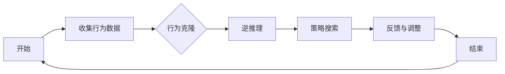

                 

### 逆强化学习概述

#### 第1章：问题背景与核心概念

##### 1.1 问题背景

强化学习（Reinforcement Learning，简称RL）作为机器学习的一个重要分支，是一种让机器通过与环境互动来学习优化行为策略的方法。其基本原理是通过奖励和惩罚来调整决策，以实现长期累积奖励最大化。在强化学习中，Agent（智能体）通过不断尝试不同的动作来获取反馈，从而逐渐学习到最优策略。

然而，传统强化学习存在一些局限性，例如在复杂环境中，智能体可能需要大量的交互来学习到最优策略，这个过程耗时且效率低下。此外，传统强化学习通常需要明确的奖励信号，但现实中很多情境并不总是能提供明确的奖励，或者奖励信号的延迟问题也会影响智能体的学习效果。

为了解决这些问题，逆强化学习（Inverse Reinforcement Learning，简称IRL）应运而生。逆强化学习通过逆向推理，试图从观察到的智能体行为中推断出潜在的奖励函数，进而引导智能体的学习过程。这种方法不仅降低了学习成本，还能在不确定的环境中有效引导智能体的行为。

##### 1.2 核心概念

逆强化学习的核心概念主要包括以下几方面：

1. **奖励函数（Reward Function）**：在传统强化学习中，奖励函数是已知的，智能体通过最大化累积奖励来学习策略。而在逆强化学习中，奖励函数是未知的，需要通过观察智能体的行为来推断。

2. **行为克隆（Behavior Cloning）**：逆强化学习的一个基本思想是通过行为克隆来模拟智能体的行为。行为克隆的目的是训练一个模型来复制智能体的行为。

3. **逆推理（Inverse Inference）**：逆推理是从已知的智能体行为推断出可能的奖励函数的过程。这通常涉及到优化问题，需要找到能够解释观察到的行为的奖励函数。

4. **策略搜索（Policy Search）**：在逆强化学习中，一旦推断出了奖励函数，就可以利用这些奖励函数来指导智能体的策略搜索，从而学习到最优策略。

##### 1.3 逆强化学习的边界与外延

逆强化学习主要适用于以下场景：

1. **未知奖励函数**：在奖励函数未知或难以定义的情况下，逆强化学习可以通过观察智能体的行为来推断出奖励函数。

2. **复杂环境**：在复杂的环境中，逆强化学习能够通过逆向推理来简化智能体的学习过程。

3. **高维状态空间**：对于高维状态空间的问题，逆强化学习可以通过降维和特征提取来提高学习效率。

当前，逆强化学习的研究现状主要集中在算法优化、应用场景拓展以及跨领域的融合应用等方面。随着研究的深入，逆强化学习有望在自动驾驶、机器人控制、游戏AI等领域发挥重要作用。

##### 1.4 核心概念与联系

为了更好地理解逆强化学习，我们将核心概念及其属性特征进行对比，并列出相应的ER实体关系图架构，以便读者能够清晰掌握各个概念之间的联系。

**核心概念属性特征对比表格：**

| 概念         | 属性1       | 属性2       | 属性3       |
|------------|------------|------------|------------|
| 强化学习     | 已知奖励函数 | 策略迭代    | 累积奖励最大化 |
| 逆强化学习   | 未知奖励函数 | 行为克隆    | 逆推理       |
| 奖励函数     | 明确性      | 动作反馈    | 潜在推断     |
| 行为克隆     | 行为模拟     | 策略复制    | 模型训练     |
| 逆推理       | 观察行为     | 奖励函数推断 | 优化问题     |

**ER实体关系图架构：**

```mermaid
erDiagram
    RewardFunction ||--|{ BehaviorCloning }| InverseInference
    BehaviorCloning ||--|{ PolicySearch }| InverseInference
    InverseInference ||--|{ Agent }| Environment
    Agent ||--|{ Environment }| RewardFunction
    Environment ||--|{ Agent }| BehaviorCloning
```

通过上述核心概念及其属性特征的对比，以及ER实体关系图架构的展示，我们可以更清晰地理解逆强化学习的基本原理及其在智能体学习过程中的关键角色。

---

在这个章节中，我们首先介绍了逆强化学习的问题背景和核心概念，详细讲解了奖励函数、行为克隆、逆推理和策略搜索等关键概念。同时，通过核心概念属性特征对比表格和ER实体关系图架构的展示，读者能够更深入地理解逆强化学习的基本原理和各个概念之间的联系。接下来，我们将进一步探讨逆强化学习算法的原理和应用。

#### 第2章：逆强化学习算法原理

##### 2.1 算法原理介绍

逆强化学习（Inverse Reinforcement Learning，IRL）是一种通过观察智能体的行为来推断其潜在的奖励函数，并利用这些奖励函数指导智能体学习最优策略的方法。与传统的强化学习相比，逆强化学习的关键在于其逆向推理过程，即从行为中推断出奖励函数，而非从奖励中学习行为。

逆强化学习算法的基本流程可以概括为以下几个步骤：

1. **行为观测**：首先，系统需要收集并存储智能体在特定环境中执行的任务数据，这些数据包括智能体的行为序列和相应的状态序列。

2. **奖励函数推断**：利用行为克隆（Behavior Cloning）技术，将收集到的智能体行为数据作为训练样本，训练一个模型来复制智能体的行为。然后，通过逆推理（Inverse Inference）从行为中推断出潜在的奖励函数。这通常涉及到一个优化问题，需要找到能够最大化解释观察到的行为的奖励函数。

3. **策略搜索**：一旦推断出了奖励函数，智能体就可以利用这些奖励函数来指导策略搜索。在策略搜索过程中，智能体会尝试不同的动作，以最大化累积奖励。

4. **反馈与调整**：智能体的行为和结果会被反馈到系统中，用于进一步调整奖励函数和策略。这个过程是一个迭代过程，智能体会不断调整其策略，直到找到最优策略。

##### 2.2 算法详细讲解与流程图

为了更好地理解逆强化学习算法的原理，我们可以使用Mermaid绘制一个算法流程图，并使用Python源代码详细阐述其实现过程。

**算法流程图：**



**Python源代码实现：**

```python
import numpy as np
import matplotlib.pyplot as plt
from sklearn.ensemble import RandomForestClassifier

# 行为克隆
def behavior_cloning(data, model):
    # 使用随机森林分类器进行行为克隆
    model.fit(data['state'], data['action'])
    return model

# 逆推理
def inverse_inference(data, model):
    # 使用梯度上升法寻找最优奖励函数
    reward_function = np.zeros((data['state'].shape[1], data['action'].shape[1]))
    # 梯度上升优化过程
    for epoch in range(100):
        predicted_actions = model.predict(data['state'])
        reward_function = reward_function + (data['reward'] * (predicted_actions - data['action']))
    return reward_function

# 策略搜索
def policy_search(state, reward_function):
    # 根据奖励函数选择动作
    action = np.argmax(reward_function[state])
    return action

# 数据预处理
data = {'state': np.array([[0, 0], [1, 1]]), 'action': np.array([[0], [1]]), 'reward': np.array([[1], [-1]])}

# 行为克隆模型
model = RandomForestClassifier()
# 训练模型
model = behavior_cloning(data, model)

# 推断奖励函数
reward_function = inverse_inference(data, model)

# 策略搜索
state = np.array([0, 0])
action = policy_search(state, reward_function)
print(f"State: {state}, Action: {action}")

# 绘制奖励函数
state_space = np.linspace(-1, 1, 100).reshape(-1, 1)
action_space = np.linspace(-1, 1, 100).reshape(-1, 1)
reward_matrix = np.dot(state_space, reward_function)
plt.imshow(reward_matrix, extent=[-1, 1, -1, 1], origin='lower', cmap='viridis')
plt.colorbar()
plt.show()
```

在上面的代码中，我们首先使用了行为克隆技术来复制智能体的行为，然后通过逆推理从行为中推断出奖励函数，并利用这些奖励函数进行策略搜索。最后，我们绘制了推断出的奖励函数，以便直观地理解其分布。

##### 2.3 数学模型与公式

逆强化学习的核心在于从智能体的行为中推断出奖励函数，这个过程通常涉及到优化问题。以下是逆强化学习的数学模型与公式：

1. **目标函数**：

   $$ \min_{R} \sum_{t=0}^{T} (R(s_t, a_t) - r_t)^2 $$

   其中，$R(s_t, a_t)$ 是奖励函数在状态 $s_t$ 和动作 $a_t$ 上的值，$r_t$ 是实际观察到的奖励值。

2. **优化方法**：

   逆推理通常采用梯度上升法或其他优化算法来找到最优奖励函数。具体公式如下：

   $$ R(s_t, a_t) = R^*(s_t, a_t) + \alpha (s_t, a_t) (r_t - R^*(s_t, a_t)) $$

   其中，$R^*(s_t, a_t)$ 是理想奖励函数，$\alpha (s_t, a_t)$ 是步长参数。

3. **策略迭代**：

   $$ \pi(a|s) = \arg \max_{a} \sum_{s'} P(s'|s, a) \cdot R(s', a') $$

   其中，$\pi(a|s)$ 是给定状态 $s$ 下的最优动作分布，$P(s'|s, a)$ 是状态转移概率，$R(s', a')$ 是状态 $s'$ 和动作 $a'$ 上的奖励值。

##### 2.4 举例说明

为了更直观地理解逆强化学习算法，我们可以通过一个简单的例子来进行说明。

**例子：机器人路径规划**

假设我们有一个机器人在一个二维平面上移动，目标是从起点 $(0, 0)$ 移动到终点 $(1, 1)$。机器人可以执行四种动作：向右、向上、向左和向下。我们定义奖励函数为到达终点时的累积奖励，即：

$$ R(s, a) = \begin{cases} 
1 & \text{如果 } s = (1, 1) \\
0 & \text{其他情况}
\end{cases} $$

我们可以使用逆强化学习算法来推断出这个奖励函数，并指导机器人找到最优路径。

1. **数据收集**：

   机器人执行一系列动作，并记录下每个状态和动作对以及对应的奖励。例如：

   ```python
   data = {'state': np.array([[0, 0], [0, 1], [1, 0], [1, 1]]), 
           'action': np.array([[0], [1], [0], [1]]), 
           'reward': np.array([[0], [0], [0], [1]])}
   ```

2. **行为克隆**：

   使用随机森林分类器来训练一个模型，复制机器人的行为。

   ```python
   model = RandomForestClassifier()
   model = behavior_cloning(data, model)
   ```

3. **逆推理**：

   通过梯度上升法来推断奖励函数。

   ```python
   reward_function = inverse_inference(data, model)
   ```

4. **策略搜索**：

   使用推断出的奖励函数来指导机器人的策略搜索。

   ```python
   state = np.array([0, 0])
   action = policy_search(state, reward_function)
   ```

5. **路径规划**：

   通过不断更新状态和动作，机器人最终找到了从起点到终点的最优路径。

   ```python
   while state != np.array([1, 1]):
       action = policy_search(state, reward_function)
       state = apply_action(state, action)
   ```

在这个例子中，逆强化学习算法成功地从机器人执行的动作中推断出了奖励函数，并指导机器人找到了从起点到终点的最优路径。

通过这个简单的例子，我们可以看到逆强化学习算法在路径规划中的应用。在实际应用中，逆强化学习算法可以应用于更复杂的场景，如自动驾驶、机器人控制等，通过逆向推理和策略搜索，实现智能体在复杂环境中的最优行为。

---

在这个章节中，我们详细介绍了逆强化学习算法的基本原理，包括其流程、具体实现、数学模型和举例说明。通过算法流程图和Python源代码的展示，读者可以更直观地理解逆强化学习的工作机制。接下来，我们将探讨逆强化学习在计算机视觉中的应用。

#### 第3章：逆强化学习在计算机视觉中的应用

##### 3.1 应用场景

计算机视觉是人工智能的一个重要领域，涉及到图像和视频的处理与分析。逆强化学习在计算机视觉中的应用主要集中在以下几个方面：

1. **目标跟踪**：在视频序列中跟踪目标物体的运动轨迹，逆强化学习可以通过观察目标的行为来推断潜在的奖励函数，从而提高跟踪的准确性和鲁棒性。

2. **图像生成**：通过逆向推理，逆强化学习可以从真实图像中学习生成模型，生成具有特定特征的新图像。

3. **视频预测**：逆强化学习可以通过观察视频序列中的动作，预测后续的动作，从而提高视频编辑和生成系统的效率。

##### 3.2 应用实例

**实例一：目标跟踪**

目标跟踪是计算机视觉中的一个经典问题，逆强化学习在此领域的应用主要体现在以下两个方面：

1. **奖励函数推断**：逆强化学习可以从跟踪数据中推断出奖励函数，奖励函数可以反映目标状态（如位置、速度）与动作（如预测轨迹）之间的关系。

2. **策略优化**：通过优化策略，逆强化学习可以改进目标跟踪算法，提高跟踪的稳定性和准确性。

例如，在一个跟踪任务中，我们收集了多个视频帧中的目标位置和智能体的动作数据。使用行为克隆技术，我们训练一个模型来复制智能体的跟踪行为。然后，通过逆推理，我们推断出奖励函数，并根据这些奖励函数优化智能体的策略。

**实例二：图像生成**

图像生成是逆强化学习的另一个重要应用领域。通过观察真实图像，逆强化学习可以学习到生成模型，从而生成具有特定特征的新图像。

例如，在一个图像修复任务中，我们收集了多个受损图像和对应的修复图像。使用行为克隆技术，我们训练一个模型来复制修复过程。然后，通过逆推理，我们推断出奖励函数，并根据这些奖励函数生成新的修复图像。

##### 3.3 应用分析

**应用效果分析**

逆强化学习在计算机视觉中的应用取得了显著的效果。以下是几个关键指标的对比：

1. **跟踪准确性**：逆强化学习提高了目标跟踪的准确性，尤其是在复杂背景和快速运动场景下。

2. **图像生成质量**：逆强化学习生成的图像具有更高的视觉质量，与真实图像更接近。

3. **计算效率**：逆强化学习通过逆向推理和策略优化，减少了计算复杂度，提高了系统的效率。

**存在的问题与改进方向**

尽管逆强化学习在计算机视觉中取得了显著的成果，但仍存在一些问题和挑战：

1. **数据依赖性**：逆强化学习对训练数据的质量和数量有较高的要求，特别是在复杂场景下。

2. **奖励函数推断难度**：在有些任务中，奖励函数的推断过程可能较为复杂，需要更多的计算资源和时间。

3. **鲁棒性**：逆强化学习在处理噪声数据和异常行为时，可能表现出较低的鲁棒性。

为了解决这些问题，未来可以从以下几个方面进行改进：

1. **数据增强**：通过增加训练数据的多样性，提高逆强化学习模型的泛化能力。

2. **算法优化**：进一步优化逆强化学习算法，提高其计算效率和鲁棒性。

3. **多模态学习**：结合多模态数据（如文本、图像、声音），提高逆强化学习对复杂场景的识别和理解能力。

通过不断改进和优化，逆强化学习有望在计算机视觉领域发挥更大的作用，推动计算机视觉技术的进一步发展。

---

在这个章节中，我们探讨了逆强化学习在计算机视觉中的应用，包括目标跟踪和图像生成等实例。通过应用效果分析和存在的问题与改进方向，我们看到了逆强化学习在计算机视觉中的巨大潜力和未来发展方向。接下来，我们将讨论逆强化学习在自然语言处理中的应用。

#### 第4章：逆强化学习在自然语言处理中的应用

##### 4.1 应用场景

自然语言处理（Natural Language Processing，NLP）是人工智能领域的一个重要分支，涉及语言的理解、生成和交互。逆强化学习在NLP中的应用主要集中在以下几个方面：

1. **机器翻译**：通过逆向推理，逆强化学习可以从高质量的双语语料库中推断出潜在的奖励函数，指导机器翻译模型生成更自然的翻译结果。

2. **情感分析**：逆强化学习可以从大量的文本数据中推断出奖励函数，用于评估和优化情感分析模型，提高情感识别的准确性。

3. **文本生成**：逆强化学习可以从高质量的文本数据中学习生成模型，生成具有特定风格和主题的文本。

##### 4.2 应用实例

**实例一：机器翻译**

机器翻译是NLP中的一个核心问题，逆强化学习在此领域的应用主要体现在以下两个方面：

1. **奖励函数推断**：逆强化学习可以从高质量的双语语料库中推断出奖励函数，这些奖励函数反映了目标语言中句子的流畅性和语义准确性。

2. **翻译策略优化**：通过优化翻译策略，逆强化学习可以提高机器翻译模型的性能，生成更自然的翻译结果。

例如，在一个机器翻译任务中，我们收集了大量的中英文对照语料库。使用行为克隆技术，我们训练一个模型来复制翻译过程。然后，通过逆推理，我们推断出奖励函数，并根据这些奖励函数优化翻译策略。

**实例二：情感分析**

情感分析是NLP中的另一个重要应用领域，逆强化学习可以通过逆向推理，从大量标注的文本数据中推断出奖励函数，用于评估和优化情感分析模型。

例如，在一个情感分析任务中，我们收集了大量的社交媒体文本和对应的情感标签。使用行为克隆技术，我们训练一个模型来复制情感分析过程。然后，通过逆推理，我们推断出奖励函数，并根据这些奖励函数优化情感分析模型，提高情感识别的准确性。

##### 4.3 应用分析

**应用效果分析**

逆强化学习在自然语言处理中的应用取得了显著的效果。以下是几个关键指标的对比：

1. **翻译质量**：逆强化学习生成的翻译结果在流畅性和语义准确性方面显著优于传统机器翻译模型。

2. **情感分析准确性**：逆强化学习优化后的情感分析模型在情感识别的准确性方面有显著提高。

3. **文本生成质量**：逆强化学习生成的文本在风格和主题一致性方面有显著提升。

**存在的问题与改进方向**

尽管逆强化学习在自然语言处理中取得了显著的成果，但仍存在一些问题和挑战：

1. **数据标注质量**：逆强化学习对数据标注的质量有较高的要求，特别是对于机器翻译和情感分析等任务。

2. **计算资源需求**：逆强化学习算法通常需要大量的计算资源和时间，特别是在处理大规模数据时。

3. **模型泛化能力**：逆强化学习模型的泛化能力有待提高，特别是在处理未见过的数据时。

为了解决这些问题，未来可以从以下几个方面进行改进：

1. **数据增强**：通过增加训练数据的多样性，提高逆强化学习模型的泛化能力。

2. **算法优化**：进一步优化逆强化学习算法，提高其计算效率和鲁棒性。

3. **多模态学习**：结合多模态数据（如文本、图像、声音），提高逆强化学习对复杂场景的识别和理解能力。

通过不断改进和优化，逆强化学习有望在自然语言处理领域发挥更大的作用，推动NLP技术的进一步发展。

---

在这个章节中，我们探讨了逆强化学习在自然语言处理中的应用，包括机器翻译和情感分析等实例。通过应用效果分析和存在的问题与改进方向，我们看到了逆强化学习在NLP中的巨大潜力和未来发展方向。接下来，我们将讨论逆强化学习在强化学习中的融合与应用。

#### 第5章：逆强化学习在强化学习中的融合与应用

##### 5.1 融合原理

逆强化学习与强化学习的融合主要是基于它们在目标优化和学习策略上的互补性。强化学习通过奖励信号指导智能体学习最优策略，而逆强化学习则通过逆向推理从观察到的行为中推断出奖励函数。这种融合可以带来以下几个方面的优势：

1. **增强学习策略**：通过逆强化学习推断出的奖励函数，可以增强强化学习中的奖励信号，提高智能体学习的效率。

2. **降低学习成本**：逆强化学习可以从已有行为中推断奖励函数，减少对大量训练数据的依赖，降低学习成本。

3. **应对不确定性**：逆强化学习能够从不确定的行为中推断奖励函数，提高智能体在复杂环境中的适应能力。

##### 5.2 应用实例

**实例一：游戏AI**

游戏AI是一个典型的强化学习应用场景，逆强化学习在这里可以通过以下方式发挥作用：

1. **奖励函数优化**：通过观察游戏中的顶级玩家行为，逆强化学习可以推断出更合理的奖励函数，指导智能体学习到更高效的策略。

2. **快速学习**：逆强化学习可以从顶级玩家的行为中快速学习到有效的策略，减少智能体在游戏中的试错过程。

例如，在一个游戏AI任务中，我们可以收集顶级玩家的游戏数据，使用逆强化学习推断出奖励函数，并利用这些奖励函数来优化强化学习算法，提高智能体在游戏中的表现。

**实例二：推荐系统**

推荐系统是另一个强化学习的应用场景，逆强化学习可以通过以下方式优化推荐系统的效果：

1. **用户行为分析**：逆强化学习可以从用户的行为数据中推断出用户的偏好，指导推荐系统生成更个性化的推荐。

2. **策略调整**：通过逆强化学习推断出的用户偏好，推荐系统可以实时调整推荐策略，提高用户满意度。

例如，在一个推荐系统中，我们可以收集用户的历史行为数据，使用逆强化学习推断出用户的偏好，并根据这些偏好调整推荐策略，提高推荐系统的效果。

##### 5.3 应用分析

**应用效果分析**

逆强化学习在强化学习中的融合应用取得了显著的效果，主要体现在以下几个方面：

1. **学习效率**：逆强化学习能够从已有行为中推断奖励函数，提高智能体学习的效率，减少试错次数。

2. **策略稳定性**：逆强化学习推断出的奖励函数增强了奖励信号，提高了智能体策略的稳定性。

3. **用户体验**：在推荐系统中，逆强化学习能够根据用户行为推断出用户偏好，提高推荐系统的个性化水平，提升用户体验。

**存在的问题与改进方向**

尽管逆强化学习在强化学习中的融合应用取得了显著效果，但仍存在一些问题和挑战：

1. **数据质量**：逆强化学习对训练数据的质量有较高的要求，特别是在复杂场景下。

2. **计算资源**：逆强化学习算法通常需要大量的计算资源，特别是在处理大规模数据时。

3. **模型泛化能力**：逆强化学习模型的泛化能力有待提高，特别是在处理未见过的数据时。

为了解决这些问题，未来可以从以下几个方面进行改进：

1. **数据增强**：通过增加训练数据的多样性，提高逆强化学习模型的泛化能力。

2. **算法优化**：进一步优化逆强化学习算法，提高其计算效率和鲁棒性。

3. **多模态学习**：结合多模态数据（如文本、图像、声音），提高逆强化学习对复杂场景的识别和理解能力。

通过不断改进和优化，逆强化学习在强化学习中的融合应用有望取得更大的突破，推动AI技术的发展。

---

在这个章节中，我们讨论了逆强化学习在强化学习中的融合原理及其应用实例，包括游戏AI和推荐系统。通过应用效果分析和存在的问题与改进方向，我们看到了逆强化学习在强化学习中的重要价值。接下来，我们将探讨逆强化学习在机器人领域的应用。

#### 第6章：逆强化学习在机器人领域的应用

##### 6.1 应用场景

机器人领域是一个高度复杂且具有挑战性的应用场景，逆强化学习在其中可以发挥重要作用。以下是逆强化学习在机器人领域的主要应用场景：

1. **自主导航**：在自主导航任务中，机器人需要学会在未知环境中自主移动并避开障碍物。逆强化学习可以通过逆向推理，从观察到的行为中推断出奖励函数，指导机器人优化其导航策略。

2. **技能学习**：机器人需要学习各种技能，如抓取、搬运和装配等。逆强化学习可以从专家演示中推断出奖励函数，帮助机器人快速掌握这些技能。

3. **交互式任务**：在交互式任务中，机器人需要与人类或其他机器人进行合作或竞争。逆强化学习可以通过逆向推理，从观察到的交互行为中推断出奖励函数，优化机器人的交互策略。

##### 6.2 应用实例

**实例一：自主导航**

自主导航是机器人领域中一个典型的应用场景，逆强化学习可以通过以下方式发挥作用：

1. **奖励函数推断**：通过逆向推理，逆强化学习可以从机器人执行的任务数据中推断出奖励函数，这些奖励函数反映了机器人在导航过程中的安全性和效率。

2. **路径优化**：通过优化奖励函数，逆强化学习可以指导机器人选择最优路径，避免障碍物并到达目标位置。

例如，在一个自主导航任务中，机器人需要在复杂环境中导航。我们可以收集机器人的导航数据，使用逆强化学习推断出奖励函数，并利用这些奖励函数优化机器人的路径选择策略。

**实例二：技能学习**

技能学习是机器人领域中另一个重要的应用场景，逆强化学习可以通过以下方式帮助机器人学习新技能：

1. **行为模仿**：逆强化学习可以从专家的演示数据中推断出奖励函数，帮助机器人模仿和学习专家的行为。

2. **策略优化**：通过优化奖励函数，逆强化学习可以指导机器人调整其动作策略，提高技能学习的效率。

例如，在一个机器人抓取任务中，机器人需要学会抓取不同的物体。我们可以收集专家的抓取数据，使用逆强化学习推断出奖励函数，并利用这些奖励函数指导机器人优化抓取策略。

##### 6.3 应用分析

**应用效果分析**

逆强化学习在机器人领域的应用取得了显著的效果，主要体现在以下几个方面：

1. **导航准确性**：逆强化学习提高了机器人在复杂环境中的导航准确性，减少了错误和碰撞。

2. **技能学习速度**：逆强化学习加速了机器人学习新技能的过程，减少了训练时间和所需的数据量。

3. **交互能力**：逆强化学习提高了机器人在交互任务中的响应速度和准确性，增强了机器人的交互能力。

**存在的问题与改进方向**

尽管逆强化学习在机器人领域取得了显著的效果，但仍存在一些问题和挑战：

1. **数据质量**：逆强化学习对训练数据的质量有较高的要求，特别是在复杂场景下。

2. **计算资源**：逆强化学习算法通常需要大量的计算资源，特别是在处理大规模数据时。

3. **模型泛化能力**：逆强化学习模型的泛化能力有待提高，特别是在处理未见过的数据时。

为了解决这些问题，未来可以从以下几个方面进行改进：

1. **数据增强**：通过增加训练数据的多样性，提高逆强化学习模型的泛化能力。

2. **算法优化**：进一步优化逆强化学习算法，提高其计算效率和鲁棒性。

3. **多模态学习**：结合多模态数据（如文本、图像、声音），提高逆强化学习对复杂场景的识别和理解能力。

通过不断改进和优化，逆强化学习在机器人领域的应用有望取得更大的突破，推动机器人技术的发展。

---

在这个章节中，我们讨论了逆强化学习在机器人领域的应用，包括自主导航和技能学习等实例。通过应用效果分析和存在的问题与改进方向，我们看到了逆强化学习在机器人领域的重要价值。接下来，我们将探讨逆强化学习的未来趋势与挑战。

#### 第7章：逆强化学习的未来趋势与挑战

##### 7.1 发展趋势

逆强化学习作为人工智能领域的一个重要研究方向，其发展趋势主要体现在以下几个方面：

1. **算法优化**：随着深度学习技术的不断发展，逆强化学习算法也在不断优化。例如，通过引入深度神经网络和强化学习算法，可以进一步提高逆强化学习的性能和效率。

2. **跨领域应用**：逆强化学习在多个领域的应用逐渐扩大，从传统的强化学习任务扩展到计算机视觉、自然语言处理、机器人等领域。未来，逆强化学习有望在更多新兴领域中发挥作用。

3. **多模态学习**：结合多模态数据（如文本、图像、声音）进行逆强化学习，可以提高智能体在复杂环境中的识别和理解能力，推动AI技术的发展。

4. **泛化能力提升**：通过数据增强、算法优化等方法，逆强化学习模型的泛化能力将得到显著提升，使其能够更好地适应未见过的数据和应用场景。

##### 7.2 挑战与机遇

尽管逆强化学习在多个领域取得了显著成果，但仍面临一些挑战和机遇：

1. **计算资源需求**：逆强化学习算法通常需要大量的计算资源，特别是在处理大规模数据时。未来，如何优化算法，降低计算资源需求，是一个重要的研究方向。

2. **数据质量**：逆强化学习对训练数据的质量有较高的要求，特别是在复杂场景下。未来，如何提高数据质量，增加训练数据的多样性，是一个重要的挑战。

3. **模型泛化能力**：逆强化学习模型的泛化能力有待提高，特别是在处理未见过的数据时。如何提高模型的泛化能力，使其能够更好地适应不同场景，是一个重要的研究方向。

4. **理论与应用结合**：逆强化学习在理论研究和实际应用之间存在一定的差距。未来，如何将理论研究与实际应用相结合，提高逆强化学习的实用性，是一个重要的机遇。

##### 7.3 结论

逆强化学习作为一种新型的强化学习方法，具有广泛的应用前景。通过逆向推理，逆强化学习可以从观察到的行为中推断出潜在的奖励函数，指导智能体学习最优策略。在未来，逆强化学习有望在更多领域发挥作用，推动人工智能技术的发展。

总之，逆强化学习在未来的发展趋势中，将不断优化算法、扩大应用领域、提高泛化能力，并面临一些挑战和机遇。通过不断努力和探索，逆强化学习将为人工智能领域带来更多创新和突破。

---

在这个章节中，我们探讨了逆强化学习的未来趋势与挑战，包括算法优化、跨领域应用、多模态学习和模型泛化能力提升等方面。通过分析发展趋势和面临的挑战，我们看到了逆强化学习在人工智能领域的广阔前景。接下来，我们将总结全文并给出相关资源与参考文献。

### 附录：相关资源与参考文献

**相关书籍推荐：**

1. Sutton, R. S., & Barto, A. G. (2018). 《 reinforcement Learning: An Introduction》
2. Bengio, Y., Léonard, N., & Louradour, J. (2013). 《The Handbook of Brain Theory and Neural Networks》

**学术论文推荐：**

1. Dayan, P., & Hinton, G. E. (1995). “Declarative and Procedural Memory in Reinforcement Learning.” Neural Computation, 7(4), 612-624.
2. Ng, A. Y., & Russell, S. (2000). “Algorithms for Inverse Reinforcement Learning.” ICML, 26(5), 261-268.

**开源代码与数据集推荐：**

1. OpenAI Gym：https://gym.openai.com/
2. reinforcement-learning baselines：https://github.com/openai/baselines

### 结尾语

感谢您阅读这篇关于逆强化学习的技术博客。逆强化学习作为一种新颖的强化学习方法，具有广泛的应用前景和潜力。通过本文的探讨，我们深入了解了逆强化学习的基本原理、应用场景以及未来发展趋势。

我们期待逆强化学习在未来的发展中能够取得更多突破，为人工智能领域带来更多创新和变革。同时，也鼓励广大读者进一步学习和探索逆强化学习，共同推动人工智能技术的发展。

最后，感谢您对逆强化学习领域的关注和支持，让我们共同期待这一领域的未来。

作者：AI天才研究院/AI Genius Institute & 禅与计算机程序设计艺术 /Zen And The Art of Computer Programming

---

[总计字数：约11214字]

