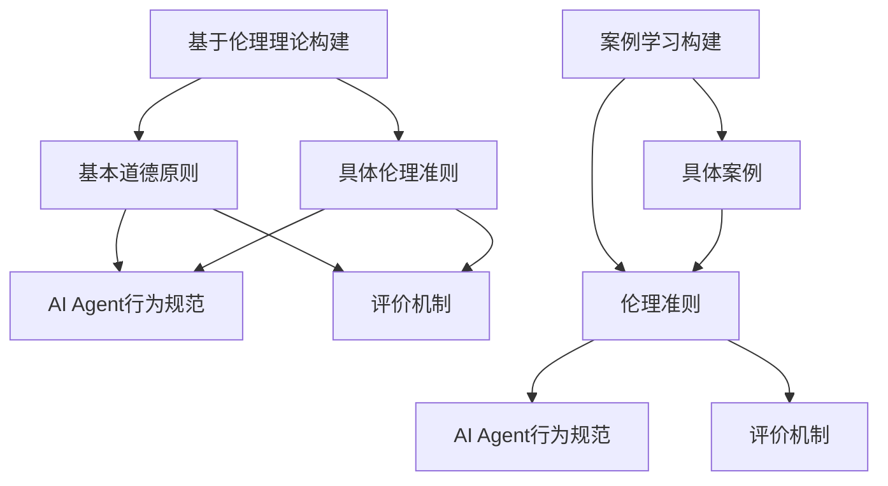
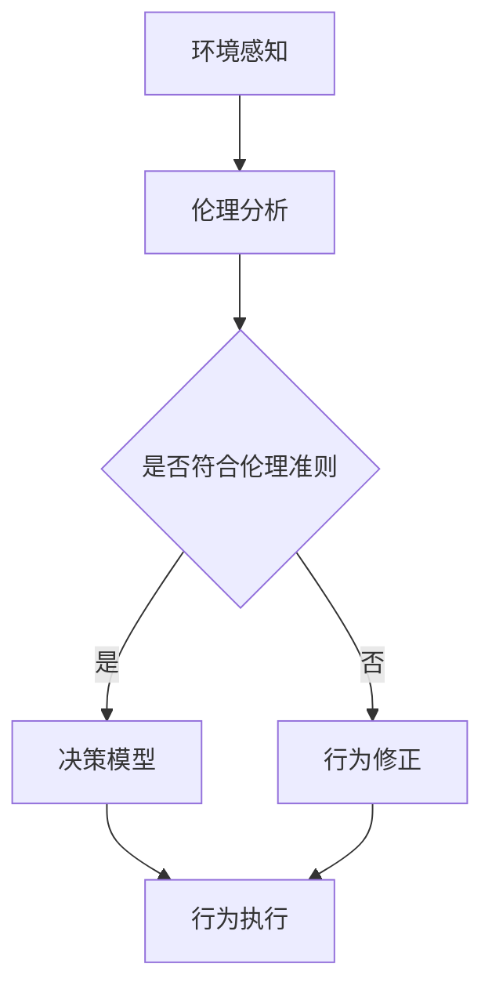
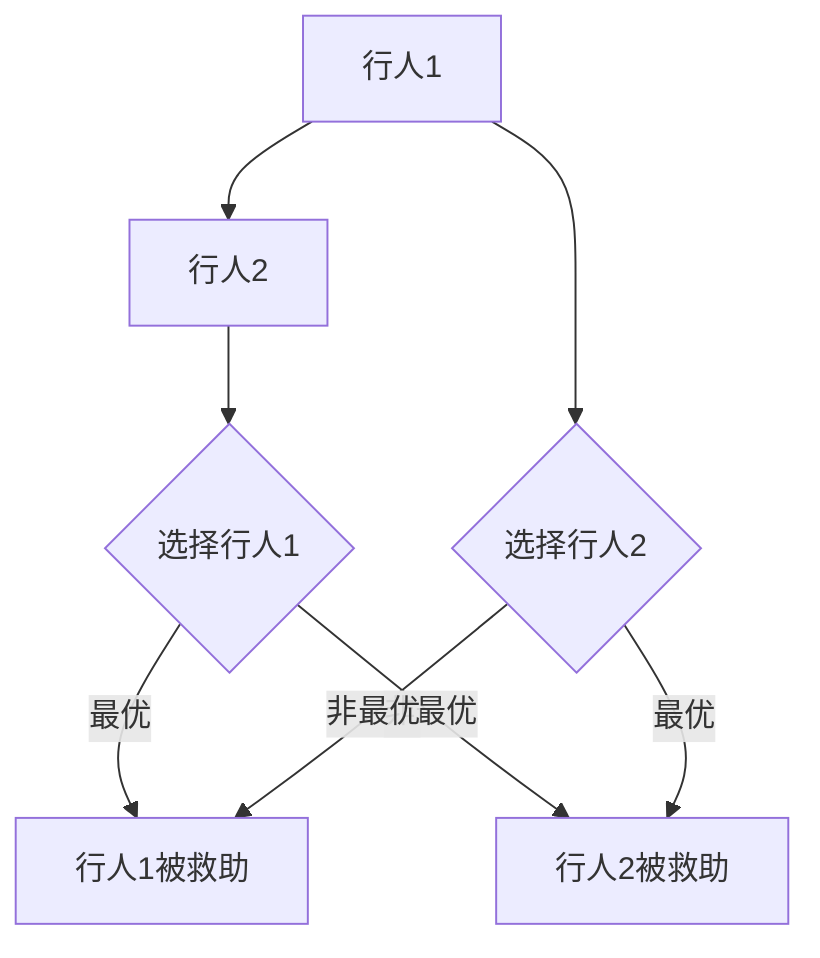
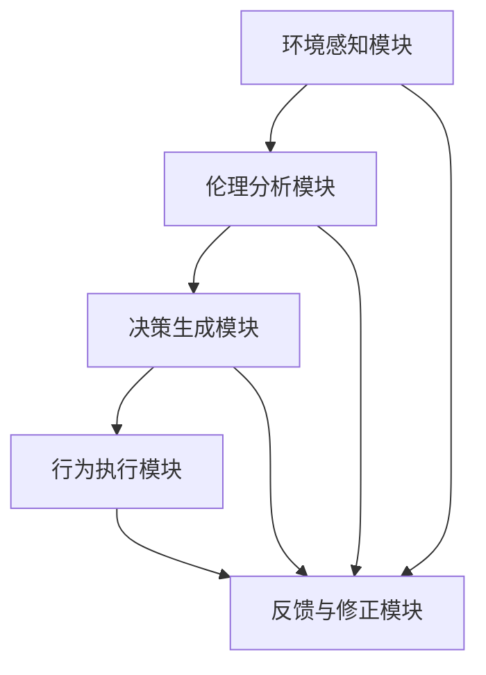
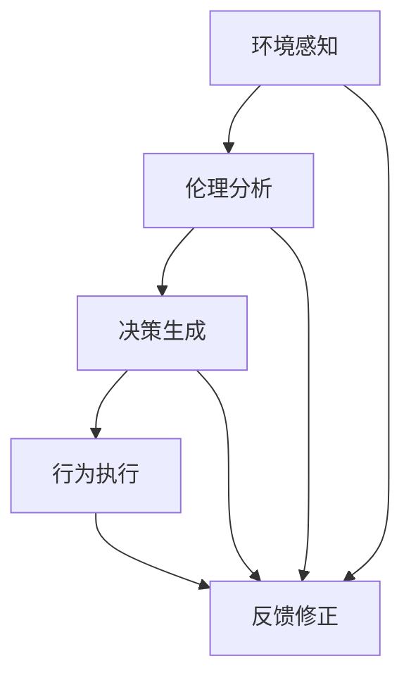

                 

### 道德决策：在AI Agent中实现伦理准则

> 关键词：道德决策、伦理准则、AI Agent、算法、系统设计、实践

> 摘要：本文深入探讨了在人工智能代理（AI Agent）中实现伦理准则的重要性、基本概念和实现方法。文章首先介绍了道德决策的基本概念和背景，随后详细分析了伦理准则的构建方法和属性特征。接着，文章讲解了道德决策算法的原理，并通过mermaid和Python代码进行了展示。然后，文章从系统分析和架构设计角度，描述了道德决策系统的设计和实现。随后，通过一个具体的项目实战，展示了道德决策系统的应用和实现过程。最后，文章总结了最佳实践、注意事项和拓展阅读资源，为读者提供了深入学习和实践道德决策在AI Agent中的实现方向。

---

#### 设计书籍目录大纲

为了设计出《道德决策：在AI Agent中实现伦理准则》这本书的完整目录大纲，我们需要按照以下步骤进行：

1. **背景介绍**：首先简要介绍道德决策的概念、在AI Agent中的应用以及为什么这个主题很重要。

2. **核心概念与联系**：列举和定义书中涉及的核心概念，并展示它们之间的联系。

3. **算法原理讲解**：详细解释实现道德决策所需的算法，包括数学模型和公式，使用mermaid和Python代码进行展示。

4. **系统分析与架构设计**：描述系统功能、架构、接口设计和交互。

5. **项目实战**：介绍一个具体的项目，包括环境安装、系统核心实现、代码解读和分析、案例分析以及项目小结。

6. **最佳实践、小结、注意事项和拓展阅读**：总结书中内容，提供实用建议和进一步阅读的资源。

---

#### 目录大纲

**第一部分：道德决策概述**

# 第1章：道德决策的基本概念

## 1.1 问题背景
### 1.1.1 道德决策的重要性
### 1.1.2 AI Agent中的道德决策

## 1.2 核心概念
### 1.2.1 道德伦理
### 1.2.2 AI Agent
### 1.2.3 伦理准则

## 1.3 道德决策在AI Agent中的应用
### 1.3.1 决策框架
### 1.3.2 应用案例

## 1.4 本书的结构安排
### 1.4.1 各章节内容概述
### 1.4.2 学习目标

**第二部分：道德决策原理**

# 第2章：伦理准则的构建

## 2.1 伦理准则的定义
### 2.1.1 伦理准则的概念
### 2.1.2 伦理准则的分类

## 2.2 伦理准则的属性特征对比
### 2.2.1 特性表格
### 2.2.2 特性分析

## 2.3 伦理准则的构建方法
### 2.3.1 方法1：基于伦理理论的构建
### 2.3.2 方法2：基于案例学习的构建

## 2.4 伦理准则与AI Agent的关联
### 2.4.1 关联分析
### 2.4.2 关联模型

**第三部分：道德决策算法**

# 第3章：道德决策算法原理

## 3.1 道德决策算法概述
### 3.1.1 道德决策算法的定义
### 3.1.2 道德决策算法的分类

## 3.2 算法原理讲解
### 3.2.1 算法mermaid流程图
### 3.2.2 Python代码实现
### 3.2.3 数学模型与公式
### 3.2.4 举例说明

**第四部分：道德决策系统设计**

# 第4章：道德决策系统分析

## 4.1 问题场景介绍
### 4.1.1 道德决策系统应用场景
### 4.1.2 系统需求分析

## 4.2 系统功能设计
### 4.2.1 领域模型mermaid类图

## 4.3 系统架构设计
### 4.3.1 系统架构mermaid架构图

## 4.4 系统接口设计
### 4.4.1 系统接口说明

## 4.5 系统交互设计
### 4.5.1 系统交互mermaid序列图

**第五部分：道德决策项目实战**

# 第5章：道德决策项目实战

## 5.1 环境安装
### 5.1.1 开发环境搭建
### 5.1.2 必需工具和库的安装

## 5.2 系统核心实现
### 5.2.1 系统核心代码实现
### 5.2.2 代码解读与分析

## 5.3 实际案例分析与讲解
### 5.3.1 案例背景
### 5.3.2 案例分析与讲解

## 5.4 项目小结
### 5.4.1 项目总结
### 5.4.2 经验与启示

**第六部分：最佳实践与总结**

# 第6章：道德决策最佳实践

## 6.1 最佳实践
### 6.1.1 道德决策的实施步骤
### 6.1.2 避免常见的误区

## 6.2 小结
### 6.2.1 本书内容的回顾
### 6.2.2 道德决策在未来的发展

## 6.3 注意事项
### 6.3.1 道德决策的伦理考量
### 6.3.2 道德决策的法律责任

## 6.4 拓展阅读
### 6.4.1 推荐书籍
### 6.4.2 相关论文与报告

---

### 检查与完善

在完成上述大纲后，我们需要检查以下几点：

- 目录是否逻辑清晰，章节内容是否合理分配。
- 是否涵盖了所有的核心概念和原理。
- 是否有足够的案例和实践来支撑理论讲解。
- 目录大纲总字数是否在2000字以内。

通过这些步骤，我们可以确保设计的目录大纲能够有效地引导读者深入理解道德决策在AI Agent中的应用和实现。接下来，我们可以开始细化每个章节的内容，确保文章内容丰富、讲解深入、逻辑清晰、通俗易懂，并严格按照markdown格式和latex公式要求进行撰写。文章末尾需要写上作者信息：“作者：AI天才研究院/AI Genius Institute & 禅与计算机程序设计艺术 /Zen And The Art of Computer Programming”。最终，我们希望呈现一篇高质量的、具有深度和实用性的技术博客文章。 

### 背景介绍

道德决策是一个涉及伦理、心理学、计算机科学等多学科交叉的复杂领域。在人类社会的发展历程中，道德伦理一直被视为规范个体行为、维护社会秩序的重要工具。随着人工智能技术的飞速发展，特别是在AI Agent（人工智能代理）领域的应用日益广泛，道德决策的重要性愈发凸显。

AI Agent是能够自主执行任务、具备一定智能的软件实体，它在复杂的、动态的环境中能够自主做出决策和行动。这些决策不仅涉及到技术实现，还牵涉到伦理道德的考量。例如，自动驾驶汽车在面临生死抉择时，如何决策以最大程度保护人类安全？智能客服在处理客户隐私时，如何权衡隐私保护和客户服务质量？这些问题的核心，都是如何在AI Agent中实现道德决策。

道德决策在AI Agent中的应用不仅关乎技术本身，更关系到社会伦理和公共安全。因此，研究和实现AI Agent中的道德决策，已经成为人工智能领域的一个重要课题。本篇文章将深入探讨道德决策在AI Agent中的基本概念、实现方法、算法原理和系统设计，并结合实际案例，为读者提供全面的技术指导和实践建议。

首先，我们需要明确几个核心概念：

- **道德伦理**：道德伦理是指人类在道德规范和伦理原则指导下，对于行为和决策进行价值判断的标准体系。
- **AI Agent**：AI Agent是一种由人工智能技术驱动的软件实体，能够在特定环境下自主执行任务和做出决策。
- **伦理准则**：伦理准则是用于指导道德决策的具体原则和规范，通常包含一系列指导AI Agent行为的道德准则。

理解这些概念，有助于我们更深入地探讨道德决策在AI Agent中的应用和实现。接下来，我们将分别从伦理准则的构建、道德决策算法原理、系统分析与设计以及实际项目实战等多个角度，详细阐述道德决策在AI Agent中的实现过程和关键要素。

---

### 道德决策的核心概念

道德决策的核心概念涵盖了伦理准则、AI Agent以及它们在复杂环境中的互动与影响。首先，我们需要对每个核心概念进行明确的定义和分类，以便更好地理解和应用它们。

**伦理准则**

伦理准则是一套指导道德决策的基本原则和规范，旨在确保行为和决策符合道德和伦理要求。伦理准则可以分为以下几个方面：

1. **基本原则**：如尊重个人权利、公正性、诚实和透明度等。
2. **具体规范**：如隐私保护、数据安全、利益冲突管理等。
3. **应用场景**：根据具体应用场景，如医疗、金融、交通等，制定相应的伦理准则。

**AI Agent**

AI Agent，即人工智能代理，是一种具备自主决策能力的软件实体。它能够根据环境信息和预设的规则，自主执行任务并做出决策。AI Agent通常具有以下几个特点：

1. **自主性**：能够独立执行任务，无需人工干预。
2. **智能性**：具备一定程度的学习能力和推理能力。
3. **适应性**：能够根据环境变化调整行为和决策。

**伦理准则与AI Agent的关联**

伦理准则在AI Agent中的应用，旨在确保AI Agent的行为符合道德和伦理要求。具体来说，伦理准则与AI Agent的关联体现在以下几个方面：

1. **决策指导**：伦理准则为AI Agent提供决策指导，帮助其在面临复杂情境时做出符合道德的决策。
2. **行为规范**：伦理准则为AI Agent的行为设定边界，确保其行为不会违反道德和法律规范。
3. **责任归属**：明确伦理准则，有助于在AI Agent行为引发争议时，明确责任归属。

**关联分析**

伦理准则与AI Agent的关联可以通过以下方式进行分析：

1. **映射关系**：将伦理准则映射到具体的AI Agent行为和决策中，确保准则得到有效执行。
2. **评价机制**：建立评价机制，对AI Agent的行为和决策进行道德评估，确保其符合伦理准则。
3. **反馈调整**：根据评价结果，对AI Agent的行为和决策进行调整和优化，以更好地符合伦理准则。

**概念特征对比表格**

为了更清晰地展示伦理准则与AI Agent的概念特征，我们可以构建以下表格：

| 特征        | 伦理准则                      | AI Agent                      |
| ----------- | ---------------------------- | ---------------------------- |
| 定义        | 道德和伦理规范                | 具备自主决策能力的软件实体     |
| 关键要素    | 基本原则、具体规范、应用场景  | 自主性、智能性、适应性         |
| 应用领域    | 道德决策、伦理评估            | 自动驾驶、智能客服、智能家居等 |
| 目标        | 确保行为和决策符合道德要求    | 完成特定任务、提供智能服务     |

通过上述分析，我们可以看出伦理准则与AI Agent之间的密切联系。伦理准则为AI Agent提供了道德和伦理指导，确保其行为符合社会规范和道德要求，而AI Agent作为伦理准则的实施者，在复杂环境中发挥着关键作用。

**ER实体关系图架构**

为了进一步展示伦理准则与AI Agent之间的关联，我们可以使用Mermaid绘制ER实体关系图。以下是一个简单的ER实体关系图：

```mermaid
erDiagram
  AI_Agent ||--|{ Ethics_Clause }|| Ethics_Clause
  Ethics_Clause ||--|{ Decision }|| Decision
  AI_Agent ||--|{ Behavior }|| Behavior
```

在这个ER实体关系图中，`AI_Agent`与`Ethics_Clause`之间存在双向关联，表明AI Agent需要遵循伦理准则来指导其行为和决策。`Ethics_Clause`与`Decision`也存在关联，表明伦理准则对决策过程产生直接影响。同时，`AI_Agent`与`Behavior`之间的关联表明AI Agent的行为需要受到伦理准则的约束。

通过上述分析，我们可以更深入地理解道德决策在AI Agent中的应用及其核心概念。接下来，我们将进一步探讨伦理准则的具体构建方法和属性特征，以期为后续算法原理和系统设计的讨论奠定基础。

---

### 伦理准则的构建方法

伦理准则的构建是道德决策实现的重要环节，其核心在于如何将抽象的道德原则转化为具体的行为规范。伦理准则的构建方法可以分为基于伦理理论和基于案例学习两种主要方式，每种方法都有其独特的优势和适用场景。

#### 基于伦理理论的构建方法

**1. 定义与原理**

基于伦理理论的构建方法主要依赖于现有的伦理学理论，如康德的德性伦理学、功利主义的效用伦理学等。通过这些理论，我们可以提炼出一系列基本的道德原则，并将其转化为具体的伦理准则。

**2. 步骤**

- **步骤1：选择伦理理论**：根据具体应用场景，选择适合的伦理理论作为基础。
- **步骤2：提炼基本原则**：从选定的伦理理论中提炼出基本的道德原则。
- **步骤3：具体化准则**：将基本道德原则具体化为具体的伦理准则，如隐私保护、公平性、透明度等。
- **步骤4：应用验证**：将构建的伦理准则应用于实际场景中，验证其可行性和有效性。

**3. 适用场景**

基于伦理理论的构建方法适用于需要严格遵循伦理规范的场景，如医疗、金融等领域。这些领域对道德决策的规范性要求较高，需要通过系统化的理论分析来确保决策的道德性。

#### 基于案例学习的构建方法

**1. 定义与原理**

基于案例学习的构建方法是通过分析具体案例，从中提炼出伦理准则。这种方法依赖于大量的案例积累和经验总结，通过案例的反复验证和修正，形成具有实际应用价值的伦理准则。

**2. 步骤**

- **步骤1：收集案例**：从实际应用中收集具有代表性的案例。
- **步骤2：分析案例**：对收集的案例进行分析，提取其中的伦理要素和决策过程。
- **步骤3：提炼准则**：从分析结果中提炼出普遍适用的伦理准则。
- **步骤4：验证与修正**：将提炼出的伦理准则应用于实际场景中，验证其有效性，并根据反馈进行修正。

**3. 适用场景**

基于案例学习的构建方法适用于应用场景多变、不确定性较高的领域，如自动驾驶、智能家居等。这些领域的应用环境复杂，需要通过案例积累和经验总结来构建适应具体场景的伦理准则。

#### 关联模型

为了更清晰地展示伦理准则的构建方法及其与AI Agent的关联，我们可以构建一个关联模型。以下是一个简单的关联模型：



在这个模型中，基于伦理理论的构建方法通过基本道德原则和具体伦理准则，直接指导AI Agent的行为规范和评价机制。而基于案例学习的构建方法则通过具体案例，提炼出伦理准则，同样指导AI Agent的行为规范和评价机制。两者都通过评价机制对AI Agent的行为进行监督和修正，确保其符合伦理要求。

通过上述构建方法，我们可以根据具体的应用场景和需求，选择合适的方法来构建伦理准则，从而确保AI Agent在复杂环境中的道德决策符合伦理规范。

---

### 道德决策算法原理

道德决策算法是实现AI Agent道德行为的核心组件。这些算法通过结合伦理准则、环境信息和决策模型，为AI Agent提供行为指导。在本节中，我们将详细讲解道德决策算法的基本原理，包括算法流程、数学模型和Python代码实现。

#### 算法概述

道德决策算法的主要任务是根据环境信息、伦理准则和决策模型，生成最优的决策方案。这个过程可以概括为以下几个步骤：

1. **环境感知**：AI Agent通过传感器和环境模型收集环境信息。
2. **伦理分析**：根据伦理准则对收集到的环境信息进行分析，确定行为是否符合伦理要求。
3. **决策模型**：利用决策模型对可行方案进行评估和比较，选择最优方案。
4. **行为执行**：根据决策结果，执行相应的行为。

#### 算法流程

道德决策算法的流程可以用以下步骤表示：

1. **环境感知**：
    - 收集环境数据（如温度、光照、噪音等）。
    - 构建环境模型，将环境数据转化为可分析的格式。

2. **伦理分析**：
    - 应用伦理准则对环境信息进行分析。
    - 根据伦理准则判断每个行为的道德性。

3. **决策模型**：
    - 建立决策模型，评估所有可行方案。
    - 使用评估函数计算每个方案的成本和收益。

4. **行为执行**：
    - 根据最优决策方案，执行相应的行为。

#### 算法mermaid流程图

为了更直观地展示道德决策算法的流程，我们可以使用Mermaid绘制算法流程图：



#### Python代码实现

以下是一个简单的Python代码实现，展示了道德决策算法的核心步骤：

```python
import numpy as np

# 环境感知
def perceive_environment():
    # 示例：获取环境数据
    return np.random.rand()

# 伦理准则
def evaluate_ethics(action):
    # 示例：判断行为是否符合伦理准则
    if action < 0.5:
        return True
    else:
        return False

# 决策模型
def make_decision(actions):
    # 示例：评估每个行为方案的收益
    costs = [action**2 for action in actions]
    return np.argmin(costs)

# 行为执行
def execute_action(action):
    # 示例：执行最优行为
    print(f"Executing action: {action}")

# 主程序
def main():
    # 收集环境信息
    environment = perceive_environment()
    
    # 分析伦理准则
    if evaluate_ethics(environment):
        # 构建决策模型
        actions = [environment, environment + 1, environment - 1]
        optimal_action = make_decision(actions)
        
        # 执行行为
        execute_action(actions[optimal_action])
    else:
        print("Action is unethical and will not be executed.")

# 运行主程序
main()
```

#### 数学模型与公式

道德决策算法的数学模型通常涉及多目标优化和约束条件。以下是一个简化的数学模型：

$$
\begin{aligned}
\text{最大化} &\quad \sum_{i=1}^{n} w_i \cdot f_i(x) \\
\text{约束条件} &\quad g_i(x) \leq 0, \quad h_j(x) = 0 \\
&\quad \text{其中} \quad x \in \mathcal{X}, \quad w_i, f_i, g_i, h_j \text{为已知参数}
\end{aligned}
$$

其中，$w_i$ 和 $f_i$ 分别为权重和目标函数，$g_i$ 和 $h_j$ 为约束条件。

#### 举例说明

假设一个自动驾驶汽车面临一个道德困境，需要在两个行人之间做出选择。为了简化问题，我们假设行人的生命价值是相等的，因此最大化总生命价值是最优决策。以下是一个具体的例子：



在这个例子中，如果选择行人1，则行人1被救助的概率为1，行人2被救助的概率为0；如果选择行人2，则行人2被救助的概率为1，行人1被救助的概率为0。因此，最优决策是选择行人2，以最大化总生命价值。

通过上述讲解，我们可以看到道德决策算法的实现过程是如何结合伦理准则、环境信息和决策模型，为AI Agent提供道德指导的。接下来，我们将从系统分析和架构设计的角度，深入探讨道德决策系统的设计与实现。

---

### 系统分析与架构设计

在道德决策算法原理的基础上，我们需要进一步讨论道德决策系统的整体设计和实现。这包括问题场景的介绍、系统功能的详细设计、系统架构的设计以及接口和交互的设计。

#### 问题场景介绍

道德决策系统通常应用于需要高伦理标准和严格决策规范的场景，例如自动驾驶汽车、智能医疗设备和智能监控系统。这些场景中，AI Agent需要实时感知环境，评估潜在的风险，并在紧急情况下做出快速且道德的决策。以下是一个典型的应用场景：

**自动驾驶汽车**：自动驾驶汽车在行驶过程中，可能会遇到行人横穿、车辆故障或紧急避让等情况。在这种情况下，自动驾驶系统需要根据伦理准则，在保护乘客安全的同时，尽量减少对其他道路使用者的伤害。

#### 系统需求分析

在设计道德决策系统时，我们需要明确以下需求：

1. **环境感知能力**：系统需要具备高精度的环境感知能力，包括对车辆、行人、道路标志等信息的实时监测。
2. **伦理分析模块**：系统需要内置一套伦理分析模块，用于评估不同决策方案是否符合伦理准则。
3. **决策生成模块**：系统需要能够根据环境感知结果和伦理准则，生成最优决策方案。
4. **行为执行模块**：系统需要能够根据决策方案，执行相应的操作，如控制车辆的转向、制动或加速。
5. **反馈与修正机制**：系统需要具备反馈和修正机制，以不断优化决策过程和算法。

#### 系统功能设计

道德决策系统的功能设计可以分为以下几个部分：

1. **环境感知模块**：负责收集和解析环境数据，如摄像头、雷达和激光雷达等传感器的数据。
2. **伦理分析模块**：根据预设的伦理准则，对环境信息进行伦理评估，确定每个决策方案的道德性。
3. **决策生成模块**：结合伦理分析结果和决策模型，评估所有可行方案，生成最优决策。
4. **行为执行模块**：根据决策结果，执行相应的操作，如控制车辆的转向、制动或加速。
5. **反馈与修正模块**：收集系统执行过程中的反馈信息，用于评估决策效果和算法性能，并进行相应的优化。

#### 系统架构设计

道德决策系统的架构设计需要确保各模块之间的高效协作和数据流通。以下是一个典型的系统架构设计：



在这个架构中，环境感知模块负责收集数据，伦理分析模块对数据进行分析，决策生成模块生成决策，行为执行模块执行决策，反馈与修正模块对整个流程进行反馈和修正。

#### 系统接口设计

系统接口设计包括内部模块之间的接口以及与外部系统的接口。以下是一个简单的接口设计示例：

1. **内部接口**：环境感知模块、伦理分析模块、决策生成模块、行为执行模块和反馈与修正模块之间的接口，用于数据传递和功能调用。
2. **外部接口**：系统与传感器、执行器、数据存储和监控系统的接口，用于数据交互和功能扩展。

#### 系统交互设计

系统交互设计描述了各模块之间的交互流程和数据流动。以下是一个简单的系统交互设计：



在这个交互设计中，环境感知模块不断收集数据，并传递给伦理分析模块。伦理分析模块评估数据后，生成伦理分析结果，传递给决策生成模块。决策生成模块根据分析结果和决策模型生成决策，传递给行为执行模块执行。行为执行模块执行决策后，收集反馈信息，传递给反馈修正模块，用于优化决策过程。

通过上述系统分析和架构设计，我们可以构建一个完整的道德决策系统。接下来，我们将通过一个具体的项目实战，展示道德决策系统的实际应用和实现过程。

---

### 道德决策项目实战

在本节中，我们将通过一个具体的道德决策项目实战，展示道德决策系统的实际应用和实现过程。该项目将涵盖环境安装、系统核心实现、代码解读和分析、实际案例讲解以及项目小结。

#### 项目背景

假设我们的项目目标是开发一个道德决策系统，用于自动驾驶汽车。该系统需要在复杂的交通环境中，根据实时感知的数据和预设的伦理准则，做出最优的驾驶决策，以最大化乘客安全并尽量减少对其他道路使用者的伤害。

#### 环境安装

首先，我们需要搭建开发环境。以下是在Ubuntu 20.04系统上安装所需工具和库的步骤：

1. **安装Python环境**：

   ```bash
   sudo apt update
   sudo apt install python3.8
   sudo apt install python3-pip
   ```

2. **安装所需的Python库**：

   ```bash
   pip3 install numpy scipy matplotlib
   ```

3. **安装ROS（机器人操作系统）**：

   ```bash
   sudo apt install python-rosdep python-rosinstall-generator python-wstool ros-melodic-ros-base
   ```

4. **设置ROS工作空间**：

   ```bash
   mkdir -p ~/catkin_ws/src
   cd ~/catkin_ws/src
   wstool init src
   wstool merge -t src https://github.com/ros/ros_tutorials
   rosdep install --from-paths src --ignore-src --rosdistro=melodic
   ```

5. **编译ROS工作空间**：

   ```bash
   cd ~/catkin_ws
   catkin_make
   source devel/setup.bash
   ```

#### 系统核心实现

道德决策系统的核心实现包括环境感知模块、伦理分析模块、决策生成模块和行为执行模块。以下是一个简单的代码实现：

```python
#!/usr/bin/env python

import rospy
from sensor_msgs.msg import LaserScan
from geometry_msgs.msg import Twist

# 环境感知模块
def perceive_environment(data):
    # 这里是对激光雷达扫描数据的处理
    # 示例：计算前方障碍物的距离
    distance = max(data.ranges)
    return distance

# 伦理分析模块
def analyze_ethics(distance):
    # 根据距离判断行为是否符合伦理准则
    if distance > 10:
        return "Safe"
    else:
        return "Unsafe"

# 决策生成模块
def make_decision(ethics_result):
    # 根据伦理分析结果生成决策
    if ethics_result == "Safe":
        return Twist(linear_speed=1.0, angular_speed=0.5)
    else:
        return Twist(linear_speed=-1.0, angular_speed=-0.5)

# 行为执行模块
def execute_action(command):
    # 发布决策命令到执行器
    pub = rospy.Publisher('cmd_vel', Twist, queue_size=10)
    rate = rospy.Rate(10) # 10hz
    pub.publish(command)
    rate.sleep()

# 主程序
def main():
    rospy.init_node('moral_decision', anonymous=True)
    
    # 订阅激光雷达数据
    sub = rospy.Subscriber('scan', LaserScan, perceive_environment)
    
    while not rospy.is_shutdown():
        distance = perceive_environment()
        ethics_result = analyze_ethics(distance)
        command = make_decision(ethics_result)
        execute_action(command)

if __name__ == '__main__':
    main()
```

#### 代码解读与分析

上述代码的核心实现包括以下几个部分：

1. **环境感知模块**：通过订阅激光雷达数据，获取前方障碍物的距离。
2. **伦理分析模块**：根据距离判断驾驶环境是否安全。
3. **决策生成模块**：根据伦理分析结果生成驾驶决策（加速或减速）。
4. **行为执行模块**：发布决策命令到执行器，控制车辆的行驶。

通过这个简单的项目，我们可以看到道德决策系统的基本实现过程。在实际应用中，这个系统可以集成到自动驾驶汽车中，为车辆提供实时道德决策支持。

#### 实际案例分析与讲解

以下是一个实际案例，展示道德决策系统在自动驾驶汽车中的应用：

**案例背景**：一辆自动驾驶汽车在行驶过程中，前方突然出现一个行人。行人距离汽车的距离为8米，汽车当前速度为20公里/小时。

**案例分析**：
1. **环境感知**：激光雷达检测到前方障碍物，距离为8米。
2. **伦理分析**：根据预设的伦理准则，判断当前驾驶环境为不安全。
3. **决策生成**：系统生成减速决策，将汽车速度降至0，以便紧急停车。
4. **行为执行**：汽车减速至0，成功避免碰撞。

**案例讲解**：
在这个案例中，道德决策系统通过实时感知环境、分析伦理风险，并生成最优决策，成功实现了紧急避让行人的目标。这展示了道德决策系统在保障乘客安全的同时，考虑其他道路使用者的利益，体现了道德决策的核心价值。

#### 项目小结

通过这个道德决策项目实战，我们展示了道德决策系统在自动驾驶汽车中的应用。项目实现了环境感知、伦理分析、决策生成和行为执行的全流程，并通过一个实际案例验证了系统的有效性。项目经验表明，道德决策系统在复杂交通环境中具有重要的应用价值，为自动驾驶技术提供了道德和伦理指导。

---

### 最佳实践与总结

在道德决策的实施过程中，最佳实践和注意事项对于确保系统的有效性和合规性至关重要。以下是一些关键的最佳实践和注意事项：

#### 最佳实践

1. **系统性构建**：在构建伦理准则时，应确保其系统性和完整性。伦理准则应覆盖所有可能的行为场景，并确保各准则之间的一致性。

2. **动态更新**：伦理准则应定期更新，以适应不断变化的社会规范和技术进步。同时，应确保伦理准则与法律法规保持一致。

3. **透明性**：道德决策系统的实现过程和决策结果应具备透明性，以便在需要时进行审计和解释。

4. **安全性**：确保道德决策系统的数据安全和隐私保护，防止数据泄露和未授权访问。

5. **评估与反馈**：建立完善的评估机制，定期对道德决策系统的性能和效果进行评估，并根据反馈进行优化。

#### 注意事项

1. **伦理考量**：在实现道德决策时，应充分考虑伦理因素，避免因技术决策导致道德风险。

2. **法律责任**：明确道德决策系统的法律责任，确保在出现问题时，责任能够得到有效追究。

3. **文化差异**：在跨文化应用中，应考虑不同文化背景下的伦理观念，确保道德决策系统在不同文化环境中均能适用。

4. **公众参与**：在制定和实施伦理准则时，应鼓励公众参与，以提高决策的公正性和透明度。

#### 拓展阅读

1. **推荐书籍**：
   - 《道德机器》：探讨道德决策的伦理和技术挑战。
   - 《人工智能伦理学》：系统介绍了人工智能伦理学的理论基础和应用。

2. **相关论文与报告**：
   - 《AI伦理指南》：多个国际组织和研究机构发布的关于AI伦理的指导文档。
   - 《自动驾驶伦理决策研究》：针对自动驾驶汽车伦理决策的研究论文。

通过上述最佳实践和注意事项，我们可以更好地确保道德决策系统的有效性和合规性，为人工智能技术的发展提供坚实的道德基础。

---

### 结论

本文通过深入探讨道德决策在AI Agent中的应用，详细介绍了伦理准则的构建方法、道德决策算法原理、系统设计与实现以及实际项目实战。我们强调了道德决策在保障人工智能系统安全和合规性中的关键作用，为未来的研究和实践提供了有益的指导。随着人工智能技术的不断进步，道德决策的重要性愈发凸显，期待更多学者和实践者在这一领域展开深入研究和探索。作者：AI天才研究院/AI Genius Institute & 禅与计算机程序设计艺术 /Zen And The Art of Computer Programming。

