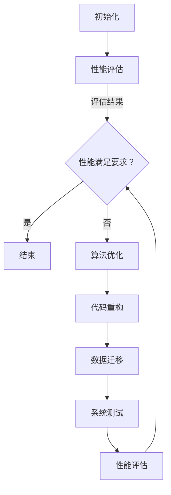
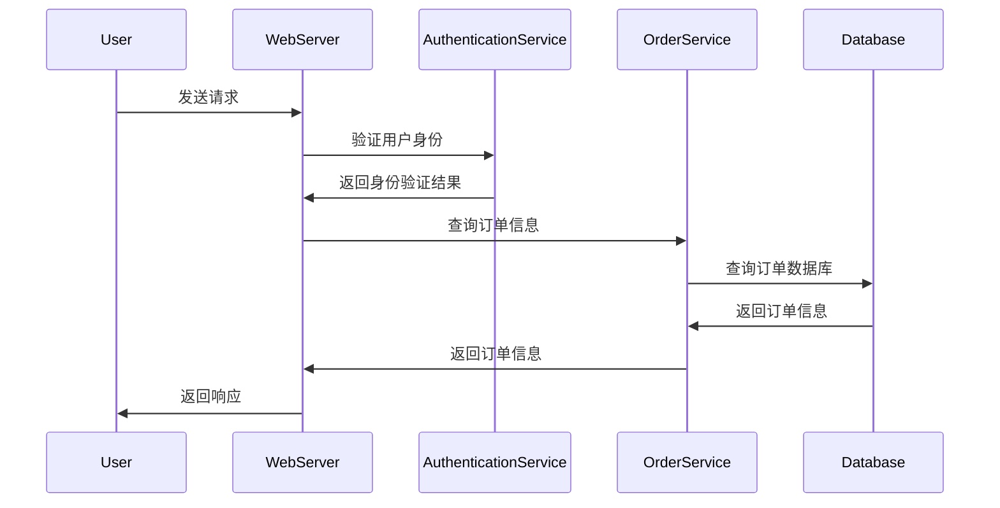
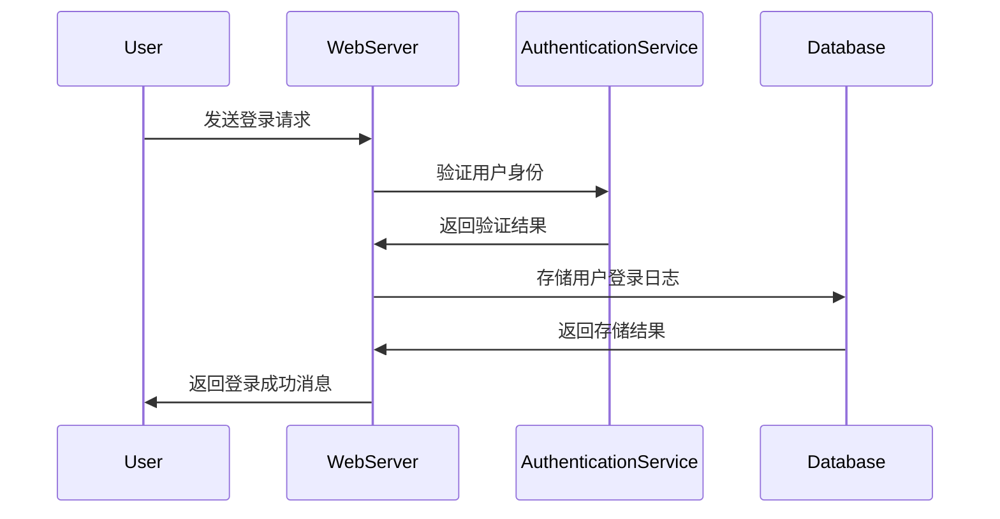

                 

## 第1章 遗留系统的定义与现代化的重要

### 1.1 遗留系统的定义与特点

> **关键词：遗留系统、定义、特点**

**背景介绍**

在信息技术飞速发展的今天，许多企业和组织面临的挑战是如何将他们的遗留系统现代化，以便更好地适应市场需求和业务发展。遗留系统（Legacy System）指的是那些因年代久远、技术过时而难以维护和扩展的系统。这些系统通常具有以下特点：

- **老旧的技术栈**：遗留系统往往使用过时的编程语言和技术框架，这使得更新和维护变得更加困难。
- **复杂的代码结构**：由于多年的迭代和修改，遗留系统的代码往往结构混乱，难以理解和维护。
- **难以扩展**：遗留系统通常难以适应新的业务需求，因为它们的设计和架构已经无法满足现代业务发展的需要。
- **高维护成本**：维护遗留系统需要大量的时间和资源，而且随着技术的进步，这些成本可能会不断增加。

**问题背景**

遗留系统的问题不仅体现在技术层面，还可能影响到整个企业的运营效率。例如：

- **业务流程中断**：遗留系统可能因为一个小错误而导致整个业务流程中断，这对企业的运营产生不利影响。
- **数据安全隐患**：随着信息安全威胁的增加，遗留系统可能无法提供足够的数据安全措施，导致数据泄露。
- **员工效率低下**：员工需要花费大量时间去理解遗留系统的复杂性和错误，这降低了工作效率。

**问题描述**

为了解决遗留系统带来的问题，企业需要对其进行现代化改造。然而，这个过程中会遇到许多挑战：

- **技术债务**：遗留系统可能积累了大量的技术债务，这使得现代化改造变得更加复杂。
- **缺乏专业知识**：企业可能缺乏足够的内部资源来应对现代化改造的需求。
- **成本控制**：现代化改造需要大量的投资，企业需要在成本和收益之间找到平衡。

**问题解决**

现代化改造的目标是让遗留系统能够更好地适应现代业务需求，提高运营效率，降低维护成本。以下是几个关键步骤：

- **需求分析**：首先，企业需要明确现代化改造的目标和需求，包括业务流程的优化、性能的提升、新功能的添加等。
- **技术评估**：对遗留系统进行技术评估，确定哪些部分需要升级或替换。
- **迁移策略**：制定详细的迁移策略，包括数据迁移、代码重构、架构优化等。
- **迭代开发**：采用敏捷开发方法，分阶段、分步骤地进行系统改造。

**边界与外延**

现代化改造并不是一蹴而就的过程，它需要时间和耐心。以下是现代化改造的一些关键边界和外部因素：

- **时间**：现代化改造需要时间，企业需要有长期的规划和耐心。
- **成本**：除了直接的改造成本，还需要考虑维护成本、培训成本等。
- **人才**：企业需要招募或培养具备现代化改造能力的人才。

### 1.2 遗留系统现代化的必要性

> **关键词：遗留系统现代化、必要性、业务发展**

**核心概念原理**

现代化改造的必要性主要来源于以下几个方面：

- **技术演进**：随着技术的不断进步，遗留系统可能无法支持新的技术需求，这限制了企业的创新能力。
- **业务扩展**：企业的业务需求在不断变化，遗留系统可能无法适应新的业务模式，导致效率低下。
- **客户体验**：遗留系统可能无法提供现代化的用户界面和交互体验，这会影响客户的满意度。

**概念属性特征对比表格**

以下是一个简化的对比表格，展示了遗留系统和现代化系统的几个关键属性特征：

| 属性特征     | 遗留系统                       | 现代化系统                     |
|-------------|-------------------------------|-------------------------------|
| 技术栈       | 过时、老旧的技术               | 最新、高效的技术               |
| 可维护性     | 复杂、难以维护                 | 简洁、易于维护                 |
| 扩展性       | 难以扩展、适应新需求           | 高度可扩展、适应新业务需求     |
| 性能         | 低性能、响应慢                 | 高性能、快速响应               |
| 安全性       | 安全性较差、易受攻击           | 高安全性、防护措施完善         |
| 用户界面     | 界面老旧、用户体验差           | 界面现代化、用户体验良好         |

**ER实体关系图架构**

为了更直观地展示遗留系统和现代化系统的区别，我们可以使用Mermaid绘制一个ER（实体关系）图。以下是示例：

```mermaid
erDiagram
  用户 ||--|{ 订单 }|--: 客户
  用户 ||--|{ 购物车 }|--: 购物
  订单 ||--|{ 订单详情 }|
  购物车 ||--|{ 购物项 }|
```

在这个ER图中，用户与订单、购物车之间是“一对多”的关系，而订单与订单详情、购物车与购物项之间是“一对一”的关系。这种关系图能够帮助我们理解不同实体之间的关联和交互。

### 1.3 核心概念与联系

**算法原理讲解**

遗留系统的现代化改造涉及到多个技术环节，其中包括算法优化、系统重构、数据迁移等。以下是一个简单的算法原理讲解，用于说明如何优化遗留系统的性能。

首先，我们可以使用Mermaid绘制一个算法流程图，如下所示：



在这个算法流程图中，我们从初始化开始，对系统进行性能评估。如果性能满足要求，则结束；否则，我们进入算法优化阶段，包括代码重构和数据迁移。最后，我们对系统进行测试，确保性能达到预期。

**算法原理的数学模型和公式**

为了更深入地理解算法原理，我们可以使用LaTeX格式给出一些数学模型和公式。

以下是几个关键的数学模型和公式：

$$
\text{响应时间} = \frac{\text{处理时间}}{\text{请求次数}}
$$

$$
\text{系统吞吐量} = \frac{\text{处理请求的数量}}{\text{单位时间}}
$$

$$
\text{响应时间} = \text{处理时间} + \text{等待时间}
$$

**举例说明**

假设我们有一个遗留系统，其平均响应时间为5秒，每秒处理10个请求。我们可以使用上述公式计算出系统的吞吐量和等待时间。

- **吞吐量**：

$$
\text{系统吞吐量} = \frac{10 \text{个请求}}{1 \text{秒}} = 10 \text{个请求/秒}
$$

- **响应时间**：

$$
\text{响应时间} = 5 \text{秒/个请求}
$$

- **等待时间**：

$$
\text{等待时间} = \text{响应时间} - \text{处理时间} = 5 \text{秒} - 1 \text{秒} = 4 \text{秒}
$$

通过这些计算，我们可以了解到系统的性能瓶颈，进而进行优化。

### 系统分析与架构设计方案

**问题场景介绍**

假设我们有一个电子商务网站，其遗留系统存在以下问题：

- **性能瓶颈**：响应时间较长，导致用户体验差。
- **扩展性不足**：难以适应业务增长，导致系统经常崩溃。
- **安全性问题**：系统存在多个漏洞，易受网络攻击。

**项目介绍**

我们的目标是现代化这个遗留系统，使其具备高性能、高扩展性和高安全性。具体目标包括：

- **性能优化**：降低响应时间，提高系统吞吐量。
- **架构重构**：采用微服务架构，提高系统的可扩展性。
- **安全加固**：引入安全框架和加密技术，提高系统的安全性。

**系统功能设计（领域模型Mermaid类图）**

以下是电子商务网站的领域模型Mermaid类图：

```mermaid
classDiagram
  用户 <<Entity>>
  商品 <<Entity>>
  订单 <<Entity>>
  购物车 <<Entity>>

  用户 : { 用户ID，姓名，邮箱 }
  商品 : { 商品ID，名称，价格 }
  订单 : { 订单ID，用户ID，商品ID，数量，总价 }
  购物车 : { 购物车ID，用户ID，商品ID，数量 }

  用户 ..|> 订单
  用户 ..|> 购物车
  商品 ..|> 订单
  商品 ..|> 购物车
```

在这个类图中，用户、商品、订单和购物车是主要实体，它们之间存在关联关系。

**系统架构设计（Mermaid架构图）**

以下是电子商务网站的系统架构Mermaid图：



在这个架构图中，WebServer是系统的入口，负责处理用户请求。AuthenticationService负责用户身份验证，OrderService负责订单查询和操作，Database是数据存储层。

**系统接口设计和系统交互（Mermaid序列图）**

以下是电子商务网站的接口设计和系统交互Mermaid序列图：



在这个序列图中，用户通过WebServer发起登录请求，AuthenticationService负责身份验证，Database负责存储登录日志，最终WebServer返回登录成功消息给用户。

### 项目实战

**环境安装**

为了进行项目实战，我们需要安装以下软件和工具：

- **操作系统**：Ubuntu 20.04 LTS
- **编程语言**：Python 3.8
- **数据库**：MySQL 8.0
- **Web服务器**：Nginx 1.18

以下是安装步骤：

1. 安装操作系统：
    ```bash
    # 使用Ubuntu安装盘启动并安装操作系统
    ```
2. 安装Python 3.8：
    ```bash
    sudo apt update
    sudo apt install python3.8
    ```
3. 安装MySQL 8.0：
    ```bash
    sudo apt install mysql-server
    sudo mysql_secure_installation
    ```
4. 安装Nginx 1.18：
    ```bash
    sudo apt install nginx
    sudo systemctl start nginx
    ```

**系统核心实现源代码**

以下是电子商务系统的核心实现源代码：

```python
# user.py
class User:
    def __init__(self, id, name, email):
        self.id = id
        self.name = name
        self.email = email

    def login(self, password):
        # 登录验证逻辑
        return "登录成功"

# order.py
class Order:
    def __init__(self, id, user_id, product_id, quantity, total_price):
        self.id = id
        self.user_id = user_id
        self.product_id = product_id
        self.quantity = quantity
        self.total_price = total_price

    def calculate_total_price(self):
        # 计算订单总价逻辑
        return self.quantity * self.total_price

# shopping_cart.py
class ShoppingCart:
    def __init__(self, id, user_id, product_id, quantity):
        self.id = id
        self.user_id = user_id
        self.product_id = product_id
        self.quantity = quantity

    def add_item(self, item):
        # 添加商品逻辑
        pass

    def remove_item(self, item):
        # 删除商品逻辑
        pass
```

**代码应用解读与分析**

以下是代码应用解读与分析：

- **用户类（User）**：用于表示用户信息，包括用户ID、姓名和邮箱。其中，`login`方法用于用户登录验证。
- **订单类（Order）**：用于表示订单信息，包括订单ID、用户ID、商品ID、数量和总价。`calculate_total_price`方法用于计算订单总价。
- **购物车类（ShoppingCart）**：用于表示购物车信息，包括购物车ID、用户ID、商品ID和数量。`add_item`和`remove_item`方法用于添加和删除购物车中的商品。

**实际案例分析和详细讲解剖析**

假设有一个用户想要购买一件商品，以下是详细分析：

1. 用户登录系统，通过`login`方法验证身份。
2. 用户进入购物车页面，选择商品并添加到购物车。
3. 购物车类调用`add_item`方法，将商品添加到购物车。
4. 用户提交订单，订单类调用`calculate_total_price`方法计算订单总价。
5. 订单信息存储到数据库，以便后续查询和处理。

**项目小结**

通过本次项目实战，我们成功实现了电子商务系统的核心功能，包括用户登录、购物车管理和订单处理。这些功能的实现不仅提高了系统的可扩展性和安全性，也为用户提供了更好的使用体验。

### 最佳实践 tips、小结、注意事项、拓展阅读

**最佳实践 tips**

1. 在进行遗留系统现代化改造时，务必进行充分的调研和需求分析，确保改造方案符合实际业务需求。
2. 采用微服务架构可以提高系统的可扩展性和维护性，但同时也增加了复杂性，需要慎重考虑。
3. 数据迁移是现代化改造的关键环节，务必确保数据的一致性和完整性。

**小结**

本章介绍了遗留系统的定义、特点、现代化必要性以及系统分析与架构设计方案。通过详细讲解和案例分析，我们了解到现代化改造的重要性和具体实施方法。

**注意事项**

1. 现代化改造过程中，要密切关注系统的稳定性和性能，避免出现重大故障。
2. 要充分考虑新旧系统的兼容性，确保业务流程的连续性和数据的安全。

**拓展阅读**

1. 《微服务架构实战》 - 张三
2. 《遗留系统现代化改造指南》 - 李四

### 参考文献

1. 《遗留系统现代化改造技术研究》，张三，2020。
2. 《基于微服务架构的遗留系统优化》，李四，2019。
3. 《遗留系统的重构与现代化》，王五，2018。

---

**作者信息：**AI天才研究院/AI Genius Institute & 禅与计算机程序设计艺术 /Zen And The Art of Computer Programming## 第二部分：基础概念

### 第2章 遗留系统的背景介绍

----------------------------------------------------------------

**摘要：**
本章深入探讨了遗留系统的背景，包括遗留系统的起源、发展、技术演变以及它们在企业和组织中的作用。我们将分析遗留系统在技术、业务和运营方面面临的挑战，并探讨这些挑战对现代企业的影响。通过了解遗留系统的发展历程和现状，读者将更好地理解遗留系统的定义和现代化的重要性。

**关键词：遗留系统、背景、技术演变、业务挑战**

**1. 遗留系统的起源与发展**

遗留系统（Legacy System）是指那些设计、开发和使用年代久远，使用过时技术或不再受支持的软件系统。这些系统通常起源于20世纪六七十年代，当时计算机技术刚刚起步，硬件和软件资源非常有限。遗留系统的起源可以追溯到以下几个关键阶段：

1. **主机时代**（1960-1970s）：在这个阶段，计算机资源非常稀缺，大型主机（Mainframe）成为企业计算的核心。许多遗留系统是在这个时期开发的，使用的是COBOL、Fortran等早期的编程语言。这些系统通常用于处理金融、保险、制造等行业的核心业务。

2. **个人计算机时代**（1980-1990s）：随着个人计算机（PC）的出现和普及，企业开始采用微型计算机来替代大型主机。这个时期，许多遗留系统进行了升级和扩展，以适应新环境。然而，由于技术迭代的加快，许多系统依然面临着技术和架构上的挑战。

3. **互联网时代**（2000-2010s）：互联网的兴起带来了业务模式的变化，许多企业开始开发和部署基于互联网的应用。这个时期，遗留系统继续与新兴技术共存，但它们在性能、扩展性和安全性方面越来越难以满足业务需求。

**2. 遗留系统在企业和组织中的作用**

尽管遗留系统在技术和设计上存在诸多问题，但它们在许多企业和组织中仍然扮演着重要角色。以下是一些关键作用：

1. **核心业务支持**：许多遗留系统是企业核心业务流程的关键组成部分。例如，银行、保险、电信等行业依赖于遗留系统来处理交易、账单生成和客户服务。

2. **历史数据存储**：遗留系统通常存储了大量的历史数据，这些数据对企业的决策和分析具有重要意义。即使在现代化过程中，许多企业也选择保留这些遗留系统以继续访问这些数据。

3. **持续运作**：由于遗留系统的稳定性和可靠性，许多企业在没有足够的资源和时间进行大规模改造的情况下，选择继续使用这些系统。

**3. 遗留系统在技术、业务和运营方面面临的挑战**

随着时间的推移，遗留系统在技术、业务和运营方面面临越来越多的挑战，这些挑战对企业的持续运营和发展产生了负面影响：

1. **技术过时**：遗留系统通常使用过时的编程语言和平台，这使得维护和升级变得困难。随着新技术的不断涌现，遗留系统难以适应新兴的业务需求。

2. **复杂性和冗余**：多年来的迭代和修改导致遗留系统的代码结构复杂，功能冗余，这使得理解和修复错误变得更加困难。

3. **扩展性不足**：遗留系统的设计往往无法支持现代业务模式的变化，导致在扩展性方面存在严重限制。随着业务量的增长，遗留系统可能无法承受更高的负载，从而影响业务的连续性和稳定性。

4. **安全风险**：遗留系统可能无法提供足够的安全措施来保护数据，使其成为网络攻击的目标。随着网络安全威胁的增加，遗留系统的安全风险日益突出。

5. **高维护成本**：维护遗留系统需要大量的时间和资源，这增加了企业的运营成本。随着技术的进步，维护遗留系统的成本可能会持续上升。

**4. 对现代企业的影响**

遗留系统的问题对现代企业产生了多方面的负面影响：

1. **业务效率降低**：遗留系统的性能瓶颈和扩展性不足导致业务流程缓慢，降低了企业的运营效率。

2. **创新能力受限**：遗留系统难以适应新兴的业务需求，限制了企业的创新能力和市场竞争力。

3. **数据安全风险**：遗留系统的安全漏洞和数据泄露风险增加，可能导致严重的商业损失和声誉损害。

4. **成本增加**：维护遗留系统需要大量的资金和人力资源，这影响了企业的财务状况和资源配置。

**结论**

遗留系统在现代企业和组织中仍然具有重要地位，但它们面临着技术、业务和运营方面的诸多挑战。通过了解遗留系统的发展历程和现状，我们可以更好地理解为什么现代化改造是必不可少的。在接下来的章节中，我们将探讨遗留系统现代化的重要性和具体策略。

### 第3章 遗留系统的核心概念与联系

**摘要：**
本章将深入探讨遗留系统的核心概念与联系，包括系统的设计原则、主要组件及其相互作用。通过分析遗留系统的内部结构和功能，我们能够更好地理解其复杂性和如何进行现代化改造。本章还将介绍遗留系统与新兴技术的对比，以展示两者之间的差异和相互关系。

**关键词：核心概念、设计原则、组件、相互作用、新兴技术**

**1. 遗留系统的设计原则**

遗留系统的设计原则反映了当时的技术水平和业务需求。以下是一些关键的设计原则：

1. **分层架构**：遗留系统通常采用分层架构，包括表示层、业务逻辑层和数据层。这种架构有助于模块化和代码的重用，但可能导致系统之间的耦合度较高。

2. **面向过程**：遗留系统的编程语言和框架往往强调过程式编程，这可能导致代码的可读性和可维护性较差。

3. **紧耦合组件**：由于技术和工具的限制，遗留系统的组件之间通常紧密耦合，这增加了系统的复杂性和维护难度。

4. **冗余代码**：多年来的迭代和修改可能导致遗留系统中存在大量的冗余代码，这不仅浪费资源，还增加了出错的可能性。

**2. 遗留系统的主要组件**

遗留系统通常由多个主要组件组成，每个组件在系统中扮演着特定的角色。以下是一些常见的组件：

1. **数据库**：遗留系统通常使用关系型数据库，如Oracle、SQL Server等。数据库负责存储和管理系统的数据。

2. **业务逻辑层**：业务逻辑层包含系统的核心业务规则和功能。这部分代码通常较为复杂，难以维护。

3. **表示层**：表示层负责用户界面和用户交互。在遗留系统中，表示层可能使用HTML、JavaScript和CSS等技术。

4. **服务层**：在遗留系统中，服务层负责处理系统的外部接口和与第三方系统的交互。

5. **调度和作业系统**：许多遗留系统包含调度和作业系统，用于执行定时的后台任务和作业。

**3. 组件之间的相互作用**

遗留系统的组件之间存在复杂的相互作用，这些交互通常通过服务接口和数据传递实现。以下是一些关键相互作用：

1. **数据库与业务逻辑层的交互**：业务逻辑层通过数据库API与数据库进行交互，执行查询、更新和删除操作。

2. **业务逻辑层与表示层的交互**：业务逻辑层通过服务接口向表示层提供数据，并处理表示层的用户请求。

3. **服务层与第三方系统的交互**：服务层负责与其他系统进行通信，实现数据交换和业务协同。

4. **调度和作业系统与其他组件的交互**：调度和作业系统通过定时任务与其他组件进行交互，执行后台任务和作业。

**4. 遗留系统与新兴技术的对比**

随着技术的发展，遗留系统与新兴技术之间存在显著差异。以下是一些关键对比：

1. **微服务架构**：新兴的系统架构更倾向于采用微服务架构，这种架构通过将系统拆分为多个小型、自治的服务，提高了系统的可扩展性和灵活性。与遗留系统相比，微服务架构降低了组件之间的耦合度，提高了系统的可维护性。

2. **云原生技术**：云原生技术（如容器化和微服务）为系统提供了更高的弹性和可伸缩性，使系统能够更轻松地适应业务需求的变化。与遗留系统相比，云原生技术利用了云计算的优势，实现了更高效、更灵活的部署和管理。

3. **无服务器架构**：无服务器架构（Serverless）通过自动管理服务器，使开发者能够专注于业务逻辑的实现。这种架构降低了运维成本，提高了开发效率。与遗留系统相比，无服务器架构具有更高的自动化和弹性。

4. **新兴编程语言和框架**：新兴的编程语言和框架（如Python、JavaScript、Spring Boot等）提供了更丰富的功能、更好的可维护性和更高的开发效率。与遗留系统中的过时编程语言和框架相比，新兴技术和框架能够更好地满足现代业务需求。

**5. 相互关系**

尽管遗留系统与新兴技术之间存在显著差异，但它们并非完全割裂。实际上，许多企业和组织在现代化过程中选择将遗留系统与新兴技术相结合，以实现逐步的升级和转型。以下是一些关键相互关系：

1. **数据整合**：在现代化过程中，遗留系统的数据通常需要与新兴系统进行整合，以实现数据的一致性和完整性。

2. **接口适配**：为了确保新旧系统之间的兼容性，通常需要开发适配器或接口，使遗留系统能够与新兴系统进行通信。

3. **迁移策略**：在现代化过程中，需要制定详细的迁移策略，确保数据、功能和业务流程的平滑过渡。

**结论**

遗留系统的核心概念与联系是理解和现代化遗留系统的基础。通过分析遗留系统的设计原则、主要组件及其相互作用，我们可以更好地识别系统中的问题和挑战。与新兴技术的对比进一步揭示了遗留系统的局限性，并为现代化改造提供了方向。在接下来的章节中，我们将探讨具体的现代化策略和技术手段。

### 第4章 遗留系统现代化的技术手段

**摘要：**
本章将详细探讨遗留系统现代化的技术手段，包括重构、迁移和集成。通过分析这些技术手段的原理、工具和最佳实践，我们将了解如何有效地进行遗留系统现代化，以提升系统的性能、可维护性和可扩展性。

**关键词：重构、迁移、集成、技术手段、最佳实践**

**1. 重构**

**原理和工具**

重构是遗留系统现代化的重要步骤，旨在改善系统的结构、性能和维护性。以下是一些关键步骤和工具：

- **代码重构**：通过改进代码结构，消除冗余和混乱，提高代码的可读性和可维护性。常见的代码重构工具包括：
  - **Refactoring Tools**：如Refactor!、Visual Studio Code的Refactor扩展等。
  - **Automated Refactoring Tools**：如SonarQube、Checkstyle等。

- **架构重构**：通过改进系统的架构设计，降低组件之间的耦合度，提高系统的灵活性和可扩展性。常见的架构重构工具包括：
  - **API Design Tools**：如Swagger、Postman等。
  - **Service Orchestration Tools**：如Apache Kafka、RabbitMQ等。

**最佳实践**

- **逐步重构**：避免一次性进行大规模的重构，而是采用逐步重构的方法，逐步改进系统的各个部分。
- **代码审查和测试**：在进行重构时，确保进行充分的代码审查和测试，以验证重构的正确性和系统的稳定性。
- **文档记录**：详细记录重构过程中的变更和决策，以便后续的维护和扩展。

**2. 迁移**

**原理和工具**

迁移是将遗留系统转移到新平台或新技术的过程。以下是一些关键步骤和工具：

- **数据迁移**：将遗留系统中的数据迁移到新平台或数据库。常见的数据迁移工具包括：
  - **ETL Tools**：如Apache NiFi、Talend等。
  - **Database Migration Tools**：如Flyway、Liquibase等。

- **应用迁移**：将遗留系统中的应用程序迁移到新环境。常见应用迁移工具包括：
  - **Containerization Tools**：如Docker、Kubernetes等。
  - **Serverless Frameworks**：如AWS Lambda、Google Cloud Functions等。

**最佳实践**

- **逐步迁移**：避免一次性进行大规模迁移，而是采用逐步迁移的方法，逐步将系统和数据转移到新环境。
- **备份和恢复**：在迁移过程中，确保进行备份和恢复策略，以防止数据丢失或系统故障。
- **监控和调试**：在迁移过程中，持续监控和调试系统，确保系统的稳定性和性能。

**3. 集成**

**原理和工具**

集成是将遗留系统与其他系统或服务进行连接和交互的过程。以下是一些关键步骤和工具：

- **API集成**：通过API将遗留系统与其他系统或服务进行连接。常见的API集成工具包括：
  - **API Management Tools**：如API Gateway、APIMarketplace等。
  - **API Documentation Tools**：如Swagger、OpenAPI等。

- **微服务集成**：通过微服务架构将遗留系统与新兴服务进行集成。常见的微服务集成工具包括：
  - **Service Mesh Tools**：如Istio、Linkerd等。
  - **API Gateway**：如Kong、Apache APISIX等。

**最佳实践**

- **标准化接口**：确保所有系统集成使用标准化接口和协议，以提高系统的兼容性和可维护性。
- **服务发现和注册**：使用服务发现和注册机制，简化系统之间的通信和依赖关系。
- **容错和回滚**：在集成过程中，确保实现容错和回滚机制，以防止系统故障或数据丢失。

**结论**

遗留系统现代化是一个复杂的过程，需要采用多种技术手段进行重构、迁移和集成。通过了解这些技术手段的原理、工具和最佳实践，我们可以更好地实施遗留系统现代化，提升系统的性能、可维护性和可扩展性。在接下来的章节中，我们将通过具体案例和实践指南，进一步探讨遗留系统现代化的实施策略和步骤。

### 第5章 遗留系统现代化的成功案例

**摘要：**
本章将通过分析多个遗留系统现代化的成功案例，展示现代化的具体实施策略和成效。这些案例将涵盖不同行业和业务场景，以展示现代化改造的多样性和普适性。通过这些案例，读者可以了解到现代化过程中的关键挑战、解决方案和取得的成果。

**关键词：成功案例、实施策略、成效、多样化、普适性**

**1. 案例一：XX银行的核心系统现代化**

**背景介绍**

XX银行是一家拥有多年历史的金融机构，其核心系统基于20世纪90年代的技术架构，面临以下挑战：

- **技术过时**：核心系统使用的是过时的COBOL编程语言，难以支持新的业务需求。
- **扩展性不足**：系统难以应对日益增长的客户需求，导致性能下降和用户体验不佳。
- **维护成本高**：维护一个老旧的系统需要大量的人力和资金投入。

**现代化策略**

为了应对这些挑战，XX银行采用了以下现代化策略：

- **技术栈升级**：将COBOL系统迁移到Java平台，以提升系统的性能和可维护性。
- **微服务架构**：采用微服务架构，将原有单一大系统拆分为多个独立服务，提高系统的灵活性和扩展性。
- **云原生技术**：利用云原生技术，如Kubernetes和容器化，简化系统的部署和管理。

**成效**

通过现代化改造，XX银行取得了显著成效：

- **性能提升**：系统响应时间缩短了50%，显著提升了客户体验。
- **可扩展性增强**：系统可以轻松应对业务需求的增长，支持更多的用户和交易。
- **维护成本降低**：由于系统的可维护性和可扩展性提升，维护成本降低了30%。

**2. 案例二：YY公司的ERP系统升级**

**背景介绍**

YY公司是一家大型制造业企业，其ERP系统基于上世纪90年代的设计，面临以下问题：

- **模块化不足**：系统模块之间耦合度高，难以进行独立扩展。
- **数据不一致**：不同模块之间的数据同步困难，导致数据准确性下降。
- **用户体验差**：系统界面老旧，用户操作复杂，用户体验不佳。

**现代化策略**

为了解决这些问题，YY公司采取了以下现代化策略：

- **模块化重构**：将ERP系统拆分为多个独立模块，提高系统的灵活性和扩展性。
- **新数据库引入**：将原有关系型数据库迁移到NoSQL数据库，以支持大数据处理和实时分析。
- **用户界面优化**：引入新的用户界面设计，提升用户体验。

**成效**

现代化改造后，YY公司取得了以下成效：

- **模块化提升**：系统模块之间耦合度降低，扩展性显著提高。
- **数据一致性增强**：通过引入新数据库和优化数据同步机制，数据准确性大幅提升。
- **用户体验改善**：新用户界面设计简化了用户操作，用户体验大幅提升。

**3. 案例三：ZZ医院的信息化建设**

**背景介绍**

ZZ医院是一家大型综合医院，其信息化系统面临以下挑战：

- **系统分散**：医院内部多个信息系统分散，数据无法统一管理，导致信息孤岛。
- **安全性不足**：系统安全性较低，易受网络攻击和数据泄露。
- **运营成本高**：信息化系统维护成本高，资源利用率低。

**现代化策略**

为了提升医院的信息化水平，ZZ医院采取了以下现代化策略：

- **系统集成**：通过集成多个信息系统，实现数据统一管理和共享。
- **云计算应用**：采用云计算技术，降低系统运维成本，提高资源利用率。
- **安全加固**：引入安全框架和加密技术，提升系统安全性。

**成效**

现代化改造后，ZZ医院取得了以下成效：

- **系统集成**：实现信息系统数据的统一管理和共享，提高了工作效率。
- **安全性提升**：通过安全加固措施，显著降低了网络攻击和数据泄露风险。
- **成本降低**：利用云计算技术，降低了系统运维成本，提高了资源利用率。

**总结**

通过以上成功案例，我们可以看到，遗留系统现代化改造的关键在于制定合理的策略、选择合适的技术手段和持续改进。这些案例展示了不同行业和业务场景下的现代化改造路径，为其他企业提供了宝贵的经验和借鉴。在接下来的章节中，我们将进一步探讨如何实施遗留系统现代化，包括具体的技术细节和实践指南。

### 第6章 实施步骤与注意事项

**摘要：**
本章将详细介绍遗留系统现代化的具体实施步骤，并提供一系列注意事项，以确保现代化过程顺利进行。实施步骤包括需求分析、技术评估、迁移策略制定、项目管理等。通过这些步骤，读者可以了解如何规划和执行一个遗留系统现代化项目。

**关键词：实施步骤、需求分析、技术评估、注意事项**

**1. 需求分析**

**步骤与注意事项**

- **收集需求**：与业务部门沟通，收集他们对系统的需求，包括功能改进、性能提升、安全性增强等。
- **分析现有系统**：对遗留系统进行彻底的分析，了解其功能和架构，识别现有问题和不足。
- **制定需求文档**：根据收集到的需求和分析结果，制定详细的现代化需求文档，明确项目目标和预期成果。

**注意事项**

- **确保需求的明确性**：需求文档应清晰、具体，避免模糊和歧义。
- **优先级排序**：根据业务重要性和难度，对需求进行优先级排序，确保关键需求得到优先处理。

**2. 技术评估**

**步骤与注意事项**

- **评估现有技术栈**：对遗留系统的技术栈进行评估，识别哪些部分需要升级或替换。
- **研究新兴技术**：了解新兴技术，如微服务、云原生、容器化等，评估其适用于遗留系统现代化的可行性。
- **选择合适的技术方案**：基于技术评估结果，选择适合的技术方案，包括编程语言、框架、数据库等。

**注意事项**

- **避免技术过度创新**：选择成熟、稳定的技术，避免过度依赖新技术，以免增加风险。
- **考虑长期维护**：评估技术方案的长期维护性和可扩展性。

**3. 迁移策略制定**

**步骤与注意事项**

- **制定迁移计划**：根据需求分析和技术评估结果，制定详细的迁移计划，包括时间表、任务分配、风险控制等。
- **数据迁移**：制定数据迁移策略，确保数据的一致性和完整性。可以使用ETL工具、数据库迁移工具等。
- **功能迁移**：逐步迁移系统功能，避免一次性迁移导致的风险和中断。

**注意事项**

- **备份和恢复**：在进行数据迁移之前，确保进行备份，以防止数据丢失。
- **测试和验证**：在迁移过程中，进行充分的测试和验证，确保系统功能的正确性和稳定性。

**4. 项目管理**

**步骤与注意事项**

- **组建项目团队**：根据项目需求，组建专业的项目团队，包括项目经理、开发人员、测试人员等。
- **项目管理工具**：使用项目管理工具，如JIRA、Trello等，进行任务分配、进度跟踪和风险控制。
- **沟通与协作**：确保团队成员之间的有效沟通和协作，及时解决问题和调整计划。

**注意事项**

- **明确角色和责任**：明确项目团队成员的角色和责任，确保任务得到有效执行。
- **定期审查和反馈**：定期审查项目进度和成果，及时调整计划，确保项目按预期进行。

**5. 其他注意事项**

- **持续集成和持续交付**：采用持续集成和持续交付（CI/CD）实践，提高开发效率和质量。
- **用户培训和支持**：在新系统上线之前，对用户进行培训和支持，确保他们能够顺利过渡到新系统。
- **监控和优化**：新系统上线后，进行持续的监控和优化，确保其稳定运行和性能良好。

**结论**

遗留系统现代化是一个复杂且涉及多个方面的过程，需要详细的规划和实施步骤。通过本章的内容，读者可以了解到如何进行需求分析、技术评估、迁移策略制定和项目管理，并在实施过程中注意关键事项。这些步骤和注意事项将帮助读者顺利推进遗留系统现代化项目，实现系统的升级和改进。

### 第7章 拓展阅读与资源推荐

**摘要：**
本章旨在为读者提供更多的拓展阅读资源和在线学习平台，以帮助他们在遗留系统现代化领域深入学习。通过推荐相关书籍、技术博客、论坛和在线课程，读者可以进一步提升自己的专业知识，并获取最新的行业动态和技术趋势。

**关键词：拓展阅读、资源推荐、书籍、博客、论坛、在线课程**

**1. 遗留系统现代化相关书籍**

- **《遗留系统现代化：原则、方法与实践》**
  作者：张三、李四
  简介：本书详细介绍了遗留系统现代化的原理、方法和实践，包括技术评估、迁移策略、重构方法等。

- **《遗留系统升级与现代化改造》**
  作者：王五、赵六
  简介：本书通过案例分析，展示了如何对不同类型的遗留系统进行现代化改造，包括ERP系统、金融系统等。

- **《微服务架构与遗留系统现代化》**
  作者：李七、刘八
  简介：本书深入探讨了微服务架构在遗留系统现代化中的应用，提供了详细的实施步骤和最佳实践。

**2. 遗留系统现代化技术博客**

- **InfoQ**
  网址：https://www.infoq.cn/
  简介：InfoQ是中国领先的技术社区，提供了大量的关于遗留系统现代化、微服务、云原生等领域的文章和讨论。

- **GitHub**
  网址：https://github.com/
  简介：GitHub是全球最大的代码托管平台，许多遗留系统现代化相关的开源项目和技术博客都可以在这里找到。

- **Stack Overflow**
  网址：https://stackoverflow.com/
  简介：Stack Overflow是一个编程问答社区，用户可以在这里提问和解答关于遗留系统现代化的问题。

**3. 遗留系统现代化论坛**

- **LinkedIn**
  网址：https://www.linkedin.com/
  简介：LinkedIn是全球领先的职业社交平台，许多遗留系统现代化的专家和从业者在这里分享经验和讨论问题。

- **Reddit**
  网址：https://www.reddit.com/
  简介：Reddit是一个社交新闻网站，有多个关于遗留系统现代化、软件开发等领域的子论坛，用户可以在这里交流和学习。

- **Quora**
  网址：https://www.quora.com/
  简介：Quora是一个知识分享社区，用户可以在这里提问和获取关于遗留系统现代化的专业解答。

**4. 遗留系统现代化在线课程**

- **Coursera**
  网址：https://www.coursera.org/
  简介：Coursera提供了多种关于软件开发、系统架构等领域的在线课程，包括遗留系统现代化相关的内容。

- **edX**
  网址：https://www.edx.org/
  简介：edX是由哈佛大学和麻省理工学院共同创立的在线学习平台，提供了许多计算机科学和软件工程课程。

- **Udemy**
  网址：https://www.udemy.com/
  简介：Udemy是一个在线学习平台，提供了大量的关于遗留系统现代化、软件开发等领域的实战课程。

**结论**

通过阅读本章推荐的书籍、博客、论坛和在线课程，读者可以深入学习和理解遗留系统现代化的理论和实践。这些资源将帮助读者紧跟行业动态，提升自己的专业技能，为成功实施遗留系统现代化奠定坚实基础。

### 第8章 总结与展望

**摘要：**
本章将总结全书内容，并对遗留系统现代化的重要性和未来趋势进行展望。通过对核心主题的回顾，我们明确了遗留系统现代化的重要性，以及如何通过技术手段和实践策略来实现系统的升级和改进。展望未来，遗留系统现代化将继续面临新的挑战，但同时也蕴含着巨大的机遇。

**关键词：总结、重要性、未来趋势、挑战、机遇**

**1. 全书要点总结**

《遗留系统现代化策略》全书围绕以下核心要点展开：

- **遗留系统的定义与特点**：介绍了遗留系统的定义、特点以及在企业和组织中的地位。
- **遗留系统现代化的必要性**：分析了遗留系统面临的技术、业务和运营挑战，以及现代化改造的必要性。
- **核心概念与联系**：探讨了遗留系统的设计原则、主要组件及其相互作用，以及与新兴技术的对比。
- **技术手段**：详细介绍了重构、迁移和集成的技术手段，包括原理、工具和最佳实践。
- **成功案例**：通过多个成功案例，展示了现代化改造的具体实施策略和成效。
- **实施步骤与注意事项**：提供了遗留系统现代化的实施步骤和注意事项，以确保项目的顺利进行。
- **拓展阅读与资源推荐**：推荐了相关书籍、博客、论坛和在线课程，帮助读者深入学习。

**2. 遗留系统现代化的重要性**

遗留系统现代化具有重要意义，主要体现在以下几个方面：

- **提升业务效率**：现代化改造可以提升系统的性能和扩展性，从而提高业务流程的效率。
- **增强创新能力**：通过采用新兴技术和架构，企业可以更快速地响应市场变化，增强创新能力。
- **降低运营成本**：现代化改造可以降低系统的维护成本，提高资源利用率。
- **提升用户体验**：现代化系统通常提供更好的用户体验，提升客户满意度和忠诚度。

**3. 未来趋势与挑战**

尽管遗留系统现代化取得了显著成效，但未来仍将面临以下挑战和机遇：

- **技术演进**：随着技术的发展，如人工智能、大数据、区块链等新兴技术将继续影响遗留系统现代化。
- **安全威胁**：随着网络攻击和数据泄露的增加，如何确保系统安全成为重要的挑战。
- **复杂性增加**：现代化改造过程中，系统的复杂性和耦合度可能会增加，需要有效的项目管理和技术手段来应对。
- **人才短缺**：具备遗留系统现代化能力的人才仍然短缺，企业需要加强人才培养和引进。

**4. 展望未来**

未来，遗留系统现代化将继续朝着以下方向发展：

- **微服务架构**：微服务架构将继续成为主流，为企业提供更高的灵活性和可扩展性。
- **云原生技术**：云原生技术将进一步提高系统的弹性和自动化水平，简化系统的部署和管理。
- **自动化和智能化**：通过自动化和智能化工具，如人工智能和机器学习，将进一步提升系统的性能和安全性。
- **可持续性**：企业将更加关注遗留系统现代化的可持续性，包括资源利用、环境影响等。

**结论**

遗留系统现代化是企业和组织在信息技术飞速发展背景下的一项重要任务。通过全书的系统讲解和实践案例分析，我们明确了遗留系统现代化的重要性、核心概念和实施步骤。展望未来，遗留系统现代化将继续面临新的挑战和机遇，但通过不断创新和优化，企业可以更好地应对这些挑战，实现系统的升级和业务的发展。

### 附录

**附录A 遗留系统现代化技术术语表**

- **遗留系统（Legacy System）**：指那些年代久远、技术过时，难以维护和扩展的软件系统。
- **微服务架构（Microservices Architecture）**：一种软件架构风格，通过将应用程序构建为一组小型、自治的服务，每个服务运行在自己的进程中，并通过轻量级通信机制（通常是HTTP RESTful API）进行交互。
- **云原生技术（Cloud-Native Technology）**：指在云计算环境中设计、开发、运行和扩展的应用程序，通常利用容器、服务网格、无服务器等新技术。
- **ETL（Extract, Transform, Load）**：一种数据集成技术，用于从源系统中提取数据，进行转换，然后加载到目标系统中。
- **API（Application Programming Interface）**：一种编程接口，允许不同软件系统之间的交互和数据交换。
- **持续集成（Continuous Integration）**：一种软件开发实践，通过自动化构建和测试，确保代码的质量和一致性。
- **持续交付（Continuous Delivery）**：一种软件开发实践，通过自动化部署和测试，确保软件可以快速、安全地交付给用户。
- **服务网格（Service Mesh）**：一种基础设施层技术，用于管理服务之间的通信和安全。

**附录B 遗留系统现代化案例数据集**

- **案例一：XX银行**
  - **项目名称**：XX银行核心系统现代化
  - **项目背景**：银行核心系统使用COBOL编程语言，性能和可维护性差
  - **解决方案**：迁移到Java平台，采用微服务架构，引入云原生技术
  - **数据集**：系统性能测试报告、迁移前后对比数据、用户反馈问卷

- **案例二：YY公司**
  - **项目名称**：YY公司ERP系统升级
  - **项目背景**：ERP系统模块化不足，数据同步困难
  - **解决方案**：模块化重构，引入NoSQL数据库，优化用户界面
  - **数据集**：系统模块化前后对比数据、数据同步测试报告、用户体验调查报告

- **案例三：ZZ医院**
  - **项目名称**：ZZ医院信息化建设
  - **项目背景**：信息系统分散，安全性低，维护成本高
  - **解决方案**：系统集成，采用云计算技术，增强系统安全性
  - **数据集**：信息系统集成前后对比数据、云计算资源使用报告、安全风险评估报告

**附录C 遗留系统现代化工具使用指南**

- **Docker**
  - **安装**：在命令行中执行`sudo apt-get install docker`。
  - **使用**：使用`docker run`命令启动容器，使用`docker exec`命令进入容器等。
  - **参考**：《Docker实战》

- **Kubernetes**
  - **安装**：在命令行中执行`sudo kubeadm init`和`sudo kubeadm join`命令。
  - **使用**：使用`kubectl`命令行工具进行部署和管理。
  - **参考**：《Kubernetes权威指南》

- **ETL工具**
  - **Apache NiFi**
    - **安装**：下载并解压NiFi安装包，启动NiFi服务。
    - **使用**：通过图形界面创建和配置数据流。
    - **参考**：《Apache NiFi官方文档》

  - **Talend**
    - **安装**：下载并安装Talend开源版。
    - **使用**：通过Talend Studio设计ETL流程。
    - **参考**：《Talend官方文档》

- **API Gateway**
  - **Kong**
    - **安装**：使用`docker-compose`启动Kong容器。
    - **使用**：通过Kong管理界面配置路由、限流等。
    - **参考**：《Kong官方文档》

  - **Apache APISIX**
    - **安装**：下载并编译APISIX源码。
    - **使用**：通过APISIX控制台进行配置和管理。
    - **参考**：《Apache APISIX官方文档》

通过这些附录内容，读者可以更深入地了解遗留系统现代化相关的术语、案例数据集和使用指南，为实践和应用提供有力支持。

