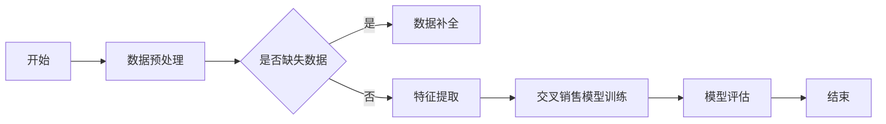
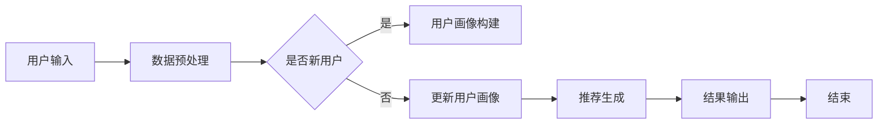
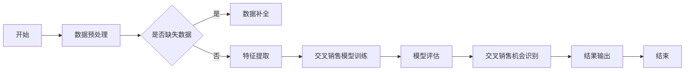

                 

# 《金融产品交叉销售机会识别与个性化推荐》

## 关键词
- 金融产品交叉销售
- 个性化推荐算法
- 数据分析与建模
- 系统架构设计
- 实践案例剖析

## 摘要
本文深入探讨了金融产品交叉销售机会识别与个性化推荐的关键问题。首先，我们分析了金融行业的挑战与交叉销售的重要性，明确了问题的边界与外延。接着，我们详细介绍了金融产品的种类、客户行为的分析模型以及相关数据处理方法。通过数据分析与建模，我们讲解了常见的建模技术、模型性能评估与优化。在此基础上，我们探讨了技术实现与系统架构，包括技术选型与工具使用、系统架构设计以及实现过程中的关键问题。随后，我们使用Mermaid流程图和Python源代码，详细阐述了交叉销售机会识别算法和个性化推荐算法的原理，并通过数学模型和具体案例进行了讲解。最后，我们提出了系统架构设计方案，并进行了项目实战的详细介绍。通过本文的阅读，读者可以全面了解金融产品交叉销售机会识别与个性化推荐的技术和方法，为实际应用提供参考。

### 1.6 《金融产品交叉销售机会识别与个性化推荐》目录大纲设计

```markdown
----------------------------------------------------------------
# 第一部分：引言

## 1.1 问题背景
### 1.1.1 金融行业的挑战
### 1.1.2 交叉销售的概念与重要性
### 1.1.3 个性化推荐在金融中的应用

## 1.2 问题描述
### 1.2.1 需要识别的交叉销售机会
### 1.2.2 个性化推荐的目标
### 1.2.3 边界与外延

## 1.3 概念结构与核心要素
### 1.3.1 金融产品与客户行为
### 1.3.2 数据分析与建模
### 1.3.3 技术实现与系统架构

## 1.4 本书结构
### 1.4.1 各章节内容概述
### 1.4.2 逻辑关系与阅读建议

----------------------------------------------------------------
# 第二部分：核心概念与联系

## 2.1 金融产品与客户行为
### 2.1.1 金融产品的种类与特性
### 2.1.2 客户行为的分析模型
### 2.1.3 数据来源与处理方法

## 2.2 数据分析与建模
### 2.2.1 数据分析方法概述
### 2.2.2 常见建模技术
### 2.2.3 模型性能评估与优化

## 2.3 技术实现与系统架构
### 2.3.1 技术选型与工具使用
### 2.3.2 系统架构设计
### 2.3.3 实现过程中的关键问题

## 2.4 概念属性特征对比表格
```markdown
| 概念       | 属性1 | 属性2 | 属性3 |
|------------|-------|-------|-------|
| 金融产品   | 类型  | 风险  | 收益  |
| 客户行为   | 年龄  | 收入  | 职业  |
| 数据分析   | 方法  | 工具  | 结果  |
| 建模技术   | 算法  | 参数  | 性能  |
```

----------------------------------------------------------------
## 2.5 ER实体关系图
```mermaid
erDiagram
  Customer ||--|{ Purchase }|--| FinancialProduct : 购买
  Customer ||--|{ View }|--| FinancialProduct : 浏览
  Customer ||--|{ Profile }|+--| CustomerBehavior : 行为
  FinancialProduct ||--|{ Feature }|+--| ProductFeature : 产品特性
```

----------------------------------------------------------------
# 第三部分：算法原理讲解

## 3.1 交叉销售机会识别算法
### 3.1.1 算法概述
### 3.1.2 算法流程
### 3.1.3 Mermaid流程图


## 3.2 个性化推荐算法
### 3.2.1 算法概述
### 3.2.2 算法流程
### 3.2.3 Mermaid流程图


## 3.3 Python源代码与数学模型
```python
# 交叉销售机会识别算法示例代码
def cross_sales_identification(data):
    # 数据预处理
    # 特征提取
    # 模型训练
    # 模型评估
    pass

# 个性化推荐算法示例代码
def persona
```### 1.1 问题背景

#### 1.1.1 金融行业的挑战

在当今全球化的金融市场中，金融机构面临着日益激烈的竞争和不断变化的客户需求。金融行业的挑战主要体现在以下几个方面：

1. **竞争压力**：金融机构需要不断拓展业务领域，提升服务质量，以吸引和保持客户。在竞争激烈的市场环境中，提高客户满意度和忠诚度成为关键。

2. **合规与风险管理**：随着监管政策的日益严格，金融机构需要确保合规性，同时有效管理风险，如信用风险、市场风险和操作风险等。

3. **数字化转型**：金融行业的数字化转型已成为趋势，客户期望通过多种渠道获取便捷的金融服务。金融机构需要投入大量资源进行技术创新，提升业务流程的数字化程度。

4. **客户需求多样化**：随着经济和社会的发展，客户对金融产品的需求日益多样化，不仅包括传统的存款、贷款、投资等基本产品，还涉及到财富管理、资产管理、保险等高端服务。

#### 1.1.2 交叉销售的概念与重要性

交叉销售是一种在现有客户基础上，通过向其推荐其他相关产品或服务，从而实现额外销售收入的方法。其核心思想是挖掘客户潜在的多种需求，提供一揽子解决方案，以提高客户满意度和粘性。

在金融行业中，交叉销售的重要性体现在以下几个方面：

1. **增加收入**：通过交叉销售，金融机构可以在现有客户基础上增加销售收入，提升整体盈利能力。

2. **降低获客成本**：相比于新客户的获取，现有客户的维护成本较低。通过交叉销售，金融机构可以更有效地利用现有客户资源，降低获客成本。

3. **提升客户粘性**：交叉销售有助于提升客户对金融机构的依赖度，增加客户忠诚度，从而降低客户流失率。

4. **优化资源配置**：通过分析客户需求和行为，金融机构可以更精准地配置资源，提高业务运营效率。

#### 1.1.3 个性化推荐在金融中的应用

个性化推荐是一种基于用户行为、偏好和兴趣等信息，为用户推荐相关产品或服务的算法。在金融领域，个性化推荐的应用主要包括以下几个方面：

1. **产品推荐**：根据客户的历史交易记录、浏览行为和偏好，推荐合适的金融产品，如理财产品、保险、信用卡等。

2. **服务推荐**：基于客户需求，推荐定制化的金融服务，如财富管理、投资顾问等。

3. **风险控制**：通过分析客户行为和交易数据，识别潜在的信用风险、市场风险等，为金融机构提供风险控制建议。

4. **客户细分**：利用个性化推荐算法，对客户进行精准细分，为不同类型的客户提供个性化的营销和服务策略。

总的来说，交叉销售机会识别与个性化推荐在金融行业中具有巨大的应用价值，不仅有助于提高金融机构的盈利能力和客户满意度，还能有效推动金融行业的数字化转型。在接下来的章节中，我们将进一步探讨相关概念、技术实现和具体应用。让我们一起深入思考，逐步了解这一领域的核心问题和解决方案。### 1.2 问题描述

在金融行业中，交叉销售机会识别与个性化推荐是一个复杂而关键的问题。为了更好地理解这一问题，我们需要明确以下几个方面的内容：

#### 1.2.1 需要识别的交叉销售机会

交叉销售机会识别的核心在于发现潜在的客户需求，并将这些需求与金融机构的产品和服务相匹配。具体来说，需要识别的交叉销售机会包括：

1. **金融产品之间的互补性**：例如，一位已经购买了信用卡的客户，可能需要相关的保险产品或投资理财产品。

2. **客户生命周期中的不同阶段需求**：例如，一位年轻客户可能对贷款和信用卡有较高需求，而随着年龄的增长，可能更关注理财和退休规划。

3. **不同客户群体的特定需求**：例如，高净值客户可能需要高端财富管理和投资服务。

4. **行为数据和交易记录**：通过分析客户的交易记录和行为数据，发现潜在的交叉销售机会。例如，客户在浏览特定理财产品时，可能意味着有购买该产品的需求。

#### 1.2.2 个性化推荐的目标

个性化推荐的目标是提供与客户需求和偏好高度匹配的金融产品和服务，从而提高客户满意度和购买转化率。具体目标包括：

1. **提升用户体验**：通过精准推荐，满足客户的个性化需求，提升客户体验和满意度。

2. **提高销售转化率**：通过个性化推荐，引导客户购买相关产品，从而提高销售转化率。

3. **降低客户流失率**：通过提供个性化的服务和建议，增强客户对金融机构的依赖和忠诚度，降低客户流失率。

4. **优化资源配置**：通过个性化推荐，金融机构可以更精准地配置资源，提高业务运营效率。

#### 1.2.3 边界与外延

在实施交叉销售机会识别与个性化推荐时，需要明确问题的边界与外延：

1. **数据边界**：数据来源和类型需要明确，如客户的交易记录、浏览行为、社交媒体数据等。

2. **技术边界**：所采用的技术和方法，如机器学习算法、大数据处理技术等，需要具备一定的边界。

3. **应用边界**：个性化推荐的应用场景和范围，如产品推荐、服务推荐、风险控制等。

4. **伦理与隐私**：在处理和分析客户数据时，需要遵守相关法律法规和伦理规范，确保客户隐私和安全。

通过明确上述问题，我们可以更好地理解交叉销售机会识别与个性化推荐的核心问题，为后续的技术实现和应用提供基础。在接下来的章节中，我们将进一步探讨相关概念、技术实现和具体应用。### 1.3 概念结构与核心要素

在深入探讨金融产品交叉销售机会识别与个性化推荐之前，我们需要明确一些核心概念和要素。这些概念和要素构成了我们分析问题的基本框架，有助于我们系统地理解问题的本质。

#### 1.3.1 金融产品与客户行为

1. **金融产品**：
   - **定义**：金融产品是指银行、保险公司、证券公司等金融机构提供的，用于投资、融资、理财等目的的金融工具。
   - **分类**：金融产品可以分为存款、贷款、投资、保险、信用卡、理财产品等多种类型。每种产品有其特定的类型、风险和收益特征。
   - **特征**：金融产品的特征包括类型、风险等级、预期收益率、期限、费用结构等。

2. **客户行为**：
   - **定义**：客户行为是指客户在金融市场中进行投资、交易、理财等活动时的行为模式。
   - **分析模型**：客户行为可以通过行为数据（如浏览记录、交易记录、投资偏好等）进行分析，建立行为分析模型，以便识别客户的潜在需求和购买意图。
   - **特征**：客户行为特征包括年龄、收入、职业、教育程度、投资偏好、风险承受能力等。

#### 1.3.2 数据分析与建模

1. **数据分析**：
   - **目的**：通过分析客户数据（如行为数据、交易数据、市场数据等），挖掘客户的需求和偏好，为交叉销售和个性化推荐提供数据支持。
   - **方法**：数据分析方法包括数据清洗、数据整合、数据挖掘、统计分析等。

2. **建模技术**：
   - **定义**：建模技术是指利用统计学、机器学习等方法，建立能够预测客户行为和需求的模型。
   - **常见技术**：包括回归分析、决策树、随机森林、支持向量机、神经网络等。

3. **模型性能评估与优化**：
   - **目的**：评估模型在交叉销售和个性化推荐任务中的性能，并通过优化提高模型效果。
   - **方法**：性能评估方法包括准确率、召回率、F1值、ROC曲线等。优化方法包括参数调优、特征工程、模型集成等。

#### 1.3.3 技术实现与系统架构

1. **技术选型与工具使用**：
   - **选型**：根据项目需求，选择适合的数据处理和分析工具，如Hadoop、Spark、Python等。
   - **工具**：使用Python、R、SQL等编程语言，以及Scikit-learn、TensorFlow、PyTorch等机器学习库进行建模和实现。

2. **系统架构设计**：
   - **目的**：设计高效、可扩展的系统架构，确保数据流和处理流程的顺畅。
   - **设计原则**：包括模块化设计、高可用性、可扩展性、安全性等。

3. **实现过程中的关键问题**：
   - **数据质量管理**：确保数据的质量，包括数据的完整性、一致性、准确性等。
   - **性能优化**：针对大数据处理和机器学习模型的性能进行优化，提高系统的响应速度和处理能力。
   - **系统安全**：确保系统的安全性和数据隐私，遵循相关的法律法规和标准。

通过明确金融产品与客户行为、数据分析和建模、技术实现与系统架构等核心概念和要素，我们可以为后续的详细讨论提供坚实的基础。接下来，我们将进一步探讨金融产品与客户行为之间的关系，以及如何利用数据分析与建模技术来识别交叉销售机会和实现个性化推荐。### 1.4 本书结构

本书旨在系统地探讨金融产品交叉销售机会识别与个性化推荐的技术和方法。为了便于读者阅读和理解，本书分为三个主要部分，各部分内容相互关联，共同构成了完整的知识体系。

#### 1.4.1 各章节内容概述

**第一部分：引言**

- **第1章 问题背景**：介绍金融行业的挑战、交叉销售的概念与重要性，以及个性化推荐在金融中的应用。
- **第2章 问题描述**：详细描述交叉销售机会识别和个性化推荐的目标、边界与外延。

**第二部分：核心概念与联系**

- **第3章 金融产品与客户行为**：探讨金融产品的种类与特性，客户行为的分析模型，以及数据来源与处理方法。
- **第4章 数据分析与建模**：介绍数据分析方法、常见建模技术，以及模型性能评估与优化。
- **第5章 技术实现与系统架构**：讨论技术选型与工具使用、系统架构设计，以及实现过程中的关键问题。
- **第6章 概念属性特征对比表格与ER实体关系图**：对比不同概念和要素的属性特征，并展示实体关系图。

**第三部分：算法原理讲解**

- **第7章 交叉销售机会识别算法**：讲解交叉销售机会识别算法的概述、流程，并使用Mermaid流程图和Python源代码进行阐述。
- **第8章 个性化推荐算法**：介绍个性化推荐算法的概述、流程，并使用Mermaid流程图和Python源代码进行阐述。
- **第9章 Python源代码与数学模型**：详细阐述交叉销售机会识别算法和个性化推荐算法的数学模型和公式。

#### 1.4.2 逻辑关系与阅读建议

本书的逻辑关系紧密，各章节内容相互关联，读者在阅读时可以遵循以下建议：

1. **先阅读引言部分**：了解交叉销售机会识别与个性化推荐的基本概念和背景，明确研究问题的意义。
2. **逐章阅读**：按照章节顺序阅读，从核心概念到算法原理，逐步掌握相关技术和方法。
3. **结合案例与实践**：在阅读过程中，结合本书中的案例和实践，加深对理论知识的理解。
4. **反复阅读与思考**：对于复杂的概念和算法，建议反复阅读，并进行深入思考，以便更好地吸收和应用。

通过遵循本书的逻辑关系和阅读建议，读者可以系统地掌握金融产品交叉销售机会识别与个性化推荐的知识，为实际应用奠定坚实的基础。### 2.1 金融产品与客户行为

#### 2.1.1 金融产品的种类与特性

金融产品种类繁多，每种产品都有其独特的特点和应用场景。以下是几种常见的金融产品及其特性：

1. **存款**：
   - **特点**：存款是一种安全、稳健的金融产品，客户可以将资金存入银行，并获得一定的利息收入。
   - **应用场景**：适用于希望资金安全、短期内无使用需求的客户。

2. **贷款**：
   - **特点**：贷款是一种融资工具，客户可以从银行等金融机构获得资金，用于消费、投资或经营。
   - **应用场景**：适用于需要短期或中长期资金支持的客户，如购房、购车、创业等。

3. **投资产品**：
   - **特点**：投资产品包括股票、基金、债券等，具有风险和收益并存的特性。
   - **应用场景**：适用于有风险承受能力、希望获得较高收益的客户。

4. **保险**：
   - **特点**：保险是一种风险转移工具，客户通过支付保费，获得保险公司在特定风险事件发生时的赔偿。
   - **应用场景**：适用于希望保障生活、财产安全和未来规划的客户。

5. **信用卡**：
   - **特点**：信用卡是一种支付工具，客户可以通过信用卡进行消费、提取现金等操作。
   - **应用场景**：适用于日常消费、旅游、购物等场景。

6. **理财产品**：
   - **特点**：理财产品是银行或其他金融机构为投资者提供的金融产品，通常具有固定的期限和预期收益率。
   - **应用场景**：适用于希望获取稳定收益的客户。

#### 2.1.2 客户行为的分析模型

客户行为分析是识别交叉销售机会和实现个性化推荐的重要环节。以下是一种常见的客户行为分析模型：

1. **客户细分模型**：
   - **定义**：根据客户的年龄、收入、职业、教育程度、投资偏好等特征，将客户划分为不同的群体。
   - **应用场景**：用于识别不同客户群体的需求和偏好，为交叉销售和个性化推荐提供依据。

2. **行为序列模型**：
   - **定义**：通过分析客户的历史交易记录、浏览行为等，构建客户的行为序列。
   - **应用场景**：用于识别客户的购买意图和潜在需求，为推荐系统提供输入。

3. **用户画像模型**：
   - **定义**：综合客户的特征数据和行为数据，构建客户的画像，以全面了解客户的需求和偏好。
   - **应用场景**：用于个性化推荐、精准营销和客户关系管理。

#### 2.1.3 数据来源与处理方法

在金融产品交叉销售机会识别与个性化推荐中，数据来源主要包括以下几个方面：

1. **内部数据**：
   - **定义**：指金融机构内部产生的数据，如客户的交易记录、浏览行为、投资偏好等。
   - **处理方法**：通过数据清洗、去重、整合等方法，确保数据的质量和完整性。

2. **外部数据**：
   - **定义**：指来自金融机构外部的数据，如市场数据、行业数据、社交媒体数据等。
   - **处理方法**：通过数据采集、清洗、融合等方法，将外部数据与内部数据进行整合，以构建全面的数据集。

3. **数据预处理**：
   - **定义**：对原始数据进行清洗、转换、归一化等处理，以提升数据的质量和可用性。
   - **方法**：包括缺失值处理、异常值处理、数据转换、特征提取等。

通过深入分析金融产品的种类与特性，构建客户行为分析模型，以及处理和整合数据，我们可以为交叉销售机会识别与个性化推荐奠定坚实的基础。在接下来的章节中，我们将进一步探讨数据分析与建模技术，以实现更精确的交叉销售机会识别和个性化推荐。### 2.2 数据分析与建模

#### 2.2.1 数据分析方法概述

在金融产品交叉销售机会识别与个性化推荐中，数据分析是关键环节。数据分析方法主要包括以下几个方面：

1. **描述性统计分析**：
   - **定义**：通过对数据进行简单的统计描述，如平均值、中位数、标准差等，了解数据的分布和特征。
   - **应用场景**：用于初步了解数据的基本情况，为后续分析提供基础。

2. **相关性分析**：
   - **定义**：分析不同变量之间的相关性，如皮尔逊相关系数、斯皮尔曼等级相关系数等。
   - **应用场景**：用于探索变量之间的关系，识别潜在的影响因素。

3. **聚类分析**：
   - **定义**：将相似的数据分组，形成不同的聚类，常用的方法有K-means、层次聚类等。
   - **应用场景**：用于客户细分，识别具有相似特征的客户群体。

4. **分类分析**：
   - **定义**：将数据分为不同的类别，常用的方法有决策树、随机森林、支持向量机等。
   - **应用场景**：用于交叉销售机会识别，预测客户是否会购买特定产品。

5. **回归分析**：
   - **定义**：分析自变量和因变量之间的关系，常用的方法有线性回归、逻辑回归等。
   - **应用场景**：用于预测客户的购买行为，评估交叉销售的机会。

6. **时间序列分析**：
   - **定义**：分析数据随时间变化的规律，常用的方法有ARIMA、LSTM等。
   - **应用场景**：用于分析客户行为的时间趋势，识别潜在的需求变化。

#### 2.2.2 常见建模技术

在金融产品交叉销售机会识别与个性化推荐中，常用的建模技术包括以下几种：

1. **线性回归模型**：
   - **定义**：通过建立线性模型，分析自变量和因变量之间的关系。
   - **公式**：\(y = \beta_0 + \beta_1x_1 + \beta_2x_2 + \ldots + \beta_nx_n\)
   - **应用场景**：用于预测客户的购买概率，评估交叉销售的机会。

2. **逻辑回归模型**：
   - **定义**：通过建立逻辑模型，分析自变量和因变量之间的逻辑关系。
   - **公式**：\(\log\frac{P(y=1)}{1-P(y=1)} = \beta_0 + \beta_1x_1 + \beta_2x_2 + \ldots + \beta_nx_n\)
   - **应用场景**：用于分类问题，如识别客户是否会购买特定产品。

3. **决策树模型**：
   - **定义**：通过树形结构，将数据划分为不同的类别。
   - **公式**：根据特征值的大小，选择最佳分割点，构建决策树。
   - **应用场景**：用于分类和回归问题，如交叉销售机会识别。

4. **随机森林模型**：
   - **定义**：通过构建多棵决策树，利用随机性减少过拟合，提高模型泛化能力。
   - **公式**：\(f(x) = \sum_{i=1}^{n} \hat{y}_i \cdot w_i\)
   - **应用场景**：用于分类和回归问题，提高模型性能。

5. **支持向量机模型**：
   - **定义**：通过找到最优超平面，将不同类别的数据分隔开来。
   - **公式**：\(f(x) = \text{sign}(\omega \cdot x + b)\)
   - **应用场景**：用于分类问题，提高分类准确率。

6. **神经网络模型**：
   - **定义**：通过多层神经元网络，模拟人脑的神经元连接，实现复杂的非线性映射。
   - **公式**：\(a_{\text{layer}} = \sigma(\omega_{\text{layer}} \cdot a_{\text{prev}} + b_{\text{layer}})\)
   - **应用场景**：用于分类、回归和预测问题，提高模型性能。

#### 2.2.3 模型性能评估与优化

在金融产品交叉销售机会识别与个性化推荐中，模型性能评估与优化至关重要。以下是一些常见的模型性能评估与优化方法：

1. **性能评估方法**：
   - **准确率**：正确预测的样本数占总样本数的比例。
   - **召回率**：正确预测的样本数占实际正样本数的比例。
   - **F1值**：准确率的调和平均值。
   - **ROC曲线**：曲线下面积（AUC）。
   - **均方误差（MSE）**：预测值与真实值之差的平方的平均值。

2. **优化方法**：
   - **特征工程**：通过选择和构造有效的特征，提高模型性能。
   - **参数调优**：通过调整模型参数，优化模型性能。
   - **正则化**：引入正则化项，减少模型过拟合。
   - **模型集成**：通过组合多个模型，提高模型性能。

通过合理的数据分析方法和建模技术，以及对模型性能的评估与优化，我们可以有效地识别金融产品的交叉销售机会，并实现个性化推荐。在接下来的章节中，我们将进一步探讨技术实现与系统架构，为实际应用奠定基础。### 2.3 技术实现与系统架构

#### 2.3.1 技术选型与工具使用

在实现金融产品交叉销售机会识别与个性化推荐时，技术选型和工具选择至关重要。以下是一些常见的技术选型和工具使用方法：

1. **编程语言**：
   - **Python**：Python具有丰富的数据科学和机器学习库，如Scikit-learn、TensorFlow和PyTorch，非常适合金融产品的交叉销售机会识别与个性化推荐。
   - **R**：R是一种专门用于统计分析和数据可视化的编程语言，也适用于金融产品分析。

2. **数据处理框架**：
   - **Pandas**：用于数据清洗、转换和分析。
   - **NumPy**：用于高效数值计算。
   - **Dask**：用于分布式数据处理，适用于大数据场景。

3. **机器学习库**：
   - **Scikit-learn**：提供多种机器学习算法，如线性回归、决策树、随机森林等。
   - **TensorFlow**：用于深度学习和大规模神经网络。
   - **PyTorch**：用于深度学习和大规模神经网络。

4. **数据库**：
   - **关系型数据库**（如MySQL、PostgreSQL）：用于存储客户行为数据和金融产品信息。
   - **NoSQL数据库**（如MongoDB、Cassandra）：用于存储大规模的非结构化数据。

5. **分布式计算框架**：
   - **Hadoop**：用于大数据存储和处理。
   - **Spark**：用于大数据处理和分析，支持实时计算。

6. **数据存储和缓存**：
   - **HDFS**：用于分布式文件存储。
   - **Redis**：用于缓存和实时数据处理。
   - **Elasticsearch**：用于全文搜索和分析。

#### 2.3.2 系统架构设计

系统架构设计是确保交叉销售机会识别与个性化推荐系统高效、稳定运行的关键。以下是一种典型的系统架构设计：

1. **数据层**：
   - **数据源**：包括关系型数据库和NoSQL数据库，存储客户行为数据和金融产品信息。
   - **数据仓库**：用于存储处理后的数据，支持数据分析与建模。

2. **数据处理层**：
   - **数据清洗与整合**：使用Pandas、NumPy等库清洗和整合数据，确保数据质量。
   - **特征工程**：通过数据预处理、特征提取和特征选择，构建有效的特征集。

3. **模型层**：
   - **机器学习模型**：使用Scikit-learn、TensorFlow和PyTorch等库，构建和训练交叉销售机会识别和个性化推荐模型。
   - **模型评估**：通过准确率、召回率、F1值等指标，评估模型性能。

4. **服务层**：
   - **API服务**：提供接口，供前端应用调用，实现交叉销售机会识别和个性化推荐功能。
   - **调度服务**：用于定时更新模型和推荐结果。

5. **应用层**：
   - **前端应用**：使用Web框架（如Django、Flask）开发，提供用户界面和交互功能。

6. **基础设施层**：
   - **服务器和集群**：用于部署处理层、模型层和服务层，支持分布式计算。
   - **网络和存储**：提供可靠的网络连接和数据存储。

#### 2.3.3 实现过程中的关键问题

在实现交叉销售机会识别与个性化推荐系统时，以下是一些关键问题需要解决：

1. **数据质量管理**：
   - **缺失值处理**：使用填充方法或删除缺失值，确保数据质量。
   - **异常值处理**：识别和处理异常值，避免对模型产生误导。

2. **模型性能优化**：
   - **特征选择**：通过特征选择方法，筛选有效的特征，提高模型性能。
   - **模型调优**：通过调整模型参数，优化模型性能。

3. **系统性能优化**：
   - **分布式计算**：使用分布式计算框架，提高数据处理和模型训练速度。
   - **缓存机制**：使用缓存机制，提高系统响应速度。

4. **系统安全与隐私保护**：
   - **数据加密**：使用加密技术，确保数据安全。
   - **访问控制**：设置严格的访问控制策略，保护客户隐私。

通过合理的技术选型、系统架构设计和关键问题解决，我们可以实现高效的金融产品交叉销售机会识别与个性化推荐系统。在接下来的章节中，我们将使用Mermaid流程图和Python源代码，详细阐述交叉销售机会识别算法和个性化推荐算法的实现过程。### 2.4 概念属性特征对比表格与ER实体关系图

#### 2.4.1 概念属性特征对比表格

在金融产品交叉销售机会识别与个性化推荐中，不同概念和要素的属性特征对比有助于我们深入理解各概念之间的关系。以下是一个概念属性特征对比表格，展示了金融产品、客户行为、数据分析、建模技术等核心概念的属性特征：

| 概念       | 属性1   | 属性2   | 属性3   |
|------------|--------|--------|--------|
| 金融产品   | 类型    | 风险    | 收益    |
| 客户行为   | 年龄    | 收入    | 职业    |
| 数据分析   | 方法    | 工具    | 结果    |
| 建模技术   | 算法    | 参数    | 性能    |

1. **金融产品**：
   - **类型**：指金融产品的种类，如存款、贷款、投资、保险、信用卡、理财产品等。
   - **风险**：指金融产品的风险等级，如低风险、中风险、高风险等。
   - **收益**：指金融产品的预期收益率或收益模式。

2. **客户行为**：
   - **年龄**：指客户的年龄，反映客户的生命周期特征。
   - **收入**：指客户的家庭收入，反映客户的经济状况。
   - **职业**：指客户的职业，反映客户的行业特征和社会地位。

3. **数据分析**：
   - **方法**：指数据分析的方法，如描述性统计、相关性分析、聚类分析、分类分析、回归分析等。
   - **工具**：指数据分析的工具，如Python、R、SQL等。
   - **结果**：指数据分析的结果，如数据报告、可视化图表、预测模型等。

4. **建模技术**：
   - **算法**：指建模的算法，如线性回归、逻辑回归、决策树、随机森林、神经网络等。
   - **参数**：指模型的参数，如权重、阈值等。
   - **性能**：指模型在评估指标上的表现，如准确率、召回率、F1值等。

#### 2.4.2 ER实体关系图

实体关系图（Entity-Relationship Diagram，ER图）是一种用于描述系统中实体及其关系的图形化表示。在金融产品交叉销售机会识别与个性化推荐系统中，实体关系图可以帮助我们直观地理解系统中的数据流和处理流程。以下是一个ER实体关系图，展示了客户、金融产品、购买记录、浏览记录等实体及其之间的关系：

```mermaid
erDiagram
  Customer ||--|{ Purchase }|--| FinancialProduct : 购买
  Customer ||--|{ View }|--| FinancialProduct : 浏览
  Customer ||--|{ Profile }|+--| CustomerBehavior : 行为
  FinancialProduct ||--|{ Feature }|+--| ProductFeature : 产品特性
```

1. **客户（Customer）**：代表金融系统的客户实体，与其他实体（如购买记录、浏览记录等）有关联。

2. **购买记录（Purchase）**：代表客户购买金融产品的记录，与客户实体和金融产品实体相关联。

3. **浏览记录（View）**：代表客户浏览金融产品的记录，与客户实体和金融产品实体相关联。

4. **客户行为（CustomerBehavior）**：代表客户的行为数据，与客户实体相关联。

5. **金融产品（FinancialProduct）**：代表金融系统的金融产品实体，与其他实体（如购买记录、浏览记录、产品特性等）有关联。

6. **产品特性（ProductFeature）**：代表金融产品的特性数据，与金融产品实体相关联。

通过概念属性特征对比表格和ER实体关系图，我们可以更清晰地理解金融产品交叉销售机会识别与个性化推荐系统中的核心概念和关系，为后续的系统设计与实现提供参考。### 2.5 交叉销售机会识别算法

#### 2.5.1 算法概述

交叉销售机会识别算法是一种基于数据分析与机器学习的技术，旨在通过分析客户的行为数据和交易记录，识别出潜在的客户交叉销售机会。该算法的核心目标是通过预测客户是否会购买特定产品，从而推荐与之相关的其他产品，以提高客户满意度和销售转化率。

#### 2.5.2 算法流程

交叉销售机会识别算法的流程主要包括以下几个步骤：

1. **数据预处理**：对原始数据进行清洗、去重、归一化等处理，确保数据的质量和一致性。

2. **特征提取**：根据业务需求，提取有助于交叉销售机会识别的特征，如客户的购买历史、浏览记录、交易金额、时间间隔等。

3. **模型训练**：使用机器学习算法，如逻辑回归、决策树、随机森林等，对提取的特征进行建模和训练，以预测客户是否会在未来购买特定产品。

4. **模型评估**：通过交叉验证、ROC曲线、AUC值等评估指标，评估模型的性能，并调整模型参数，以优化预测效果。

5. **交叉销售机会识别**：根据模型的预测结果，识别出具有交叉销售机会的客户，并推荐相应的金融产品。

6. **结果输出**：将交叉销售机会识别结果输出到数据库或前端应用，供业务人员或客户使用。

#### 2.5.3 Mermaid流程图

以下是一个使用Mermaid绘制的交叉销售机会识别算法的流程图：



- **A[开始]**：算法流程的开始。
- **B[数据预处理]**：对原始数据进行清洗、去重、归一化等处理。
- **C{是否缺失数据]**：判断数据是否存在缺失值。
- **D[数据补全]**：对缺失数据使用填充方法进行补全。
- **E[特征提取]**：根据业务需求，提取有助于交叉销售机会识别的特征。
- **F[交叉销售模型训练]**：使用机器学习算法对提取的特征进行建模和训练。
- **G[模型评估]**：评估模型的性能，如准确率、召回率、F1值等。
- **H[交叉销售机会识别]**：根据模型预测结果，识别出具有交叉销售机会的客户。
- **I[结果输出]**：将交叉销售机会识别结果输出到数据库或前端应用。
- **J[结束]**：算法流程的结束。

通过上述流程图，我们可以清晰地了解交叉销售机会识别算法的实现步骤和逻辑关系。接下来，我们将使用Python源代码和数学模型，详细阐述交叉销售机会识别算法的实现和原理。### 2.6 个性化推荐算法

#### 2.6.1 算法概述

个性化推荐算法是一种基于用户行为和偏好的分析，为用户提供相关产品或服务推荐的技术。在金融领域，个性化推荐算法有助于提高客户满意度和忠诚度，实现精准营销和业务增长。个性化推荐算法的目标是根据用户的兴趣和行为，向用户推荐最相关的金融产品或服务。

#### 2.6.2 算法流程

个性化推荐算法的基本流程包括以下几个步骤：

1. **用户输入**：获取用户的输入信息，如用户ID、查询关键词、浏览记录等。

2. **数据预处理**：对输入数据进行清洗、去重、归一化等处理，确保数据的质量和一致性。

3. **用户画像构建**：根据用户的历史行为和偏好数据，构建用户的画像，以反映用户的需求和兴趣。

4. **推荐生成**：根据用户画像和金融产品的特征数据，生成推荐列表。

5. **结果输出**：将推荐结果输出到用户界面或邮件等渠道，供用户参考。

#### 2.6.3 Mermaid流程图

以下是一个使用Mermaid绘制的个性化推荐算法流程图：


- **A[用户输入]**：用户输入相关信息，如用户ID、查询关键词、浏览记录等。
- **B[数据预处理]**：对输入数据进行清洗、去重、归一化等处理。
- **C{是否新用户]**：判断用户是否为新用户。
- **D[用户画像构建]**：为新用户构建用户画像，反映用户的需求和兴趣。
- **E[更新用户画像]**：为现有用户更新用户画像，反映最新的行为和偏好。
- **F[推荐生成]**：根据用户画像和金融产品特征数据，生成推荐列表。
- **G[结果输出]**：将推荐结果输出到用户界面或邮件等渠道。
- **H[结束]**：算法流程的结束。

通过上述流程图，我们可以清晰地了解个性化推荐算法的实现步骤和逻辑关系。接下来，我们将使用Python源代码和数学模型，详细阐述个性化推荐算法的实现和原理。### 2.7 Python源代码与数学模型

#### 2.7.1 交叉销售机会识别算法

以下是一个简单的Python代码示例，用于实现交叉销售机会识别算法。该示例使用逻辑回归模型，通过分析客户的购买历史和浏览记录，预测客户是否会购买特定产品。

```python
import pandas as pd
from sklearn.model_selection import train_test_split
from sklearn.linear_model import LogisticRegression
from sklearn.metrics import accuracy_score, recall_score, f1_score

# 加载数据集
data = pd.read_csv('cross_sales_data.csv')

# 特征提取
X = data[['age', 'income', 'historical_purchases', 'recent_views']]
y = data['will_buy']

# 数据分割
X_train, X_test, y_train, y_test = train_test_split(X, y, test_size=0.2, random_state=42)

# 模型训练
model = LogisticRegression()
model.fit(X_train, y_train)

# 模型评估
y_pred = model.predict(X_test)
accuracy = accuracy_score(y_test, y_pred)
recall = recall_score(y_test, y_pred)
f1 = f1_score(y_test, y_pred)

print(f"Accuracy: {accuracy:.2f}")
print(f"Recall: {recall:.2f}")
print(f"F1 Score: {f1:.2f}")

# 输出交叉销售机会
cross_sales = data[data['will_buy'] == 1]
print(cross_sales.head())
```

**数学模型**：

逻辑回归模型的数学公式为：

$$
\text{P}(y=1) = \frac{1}{1 + \exp(-\beta_0 - \beta_1x_1 - \beta_2x_2 - \ldots - \beta_nx_n)}
$$

其中，\(x_1, x_2, \ldots, x_n\) 是特征值，\(\beta_0, \beta_1, \beta_2, \ldots, \beta_n\) 是模型参数。

#### 2.7.2 个性化推荐算法

以下是一个简单的Python代码示例，用于实现个性化推荐算法。该示例使用基于协同过滤的方法，根据用户的浏览记录和相似用户的行为，为用户推荐金融产品。

```python
import pandas as pd
from sklearn.metrics.pairwise import cosine_similarity
from scipy.sparse import csr_matrix

# 加载数据集
data = pd.read_csv('user_product_data.csv')

# 构建用户-产品矩阵
user_product_matrix = csr_matrix(data.pivot(index='user_id', columns='product_id', values='rating'))

# 计算用户之间的相似度
user_similarity = cosine_similarity(user_product_matrix)

# 根据相似度矩阵为用户推荐产品
def recommend_products(user_id, similarity_matrix, top_n=5):
    # 获取用户相似度最高的用户
    similar_users = similarity_matrix[user_id].argsort()[:-top_n-1:-1]

    # 计算相似用户对产品的评分之和
    product_scores = {}
    for i, similar_user in enumerate(similar_users):
        for product_id, rating in data[data['user_id'] == similar_user].iterrows():
            if product_id not in product_scores:
                product_scores[product_id] = 0
            product_scores[product_id] += rating['rating'] * similarity_matrix[similar_user][user_id]

    # 排序并返回推荐产品
    recommended_products = sorted(product_scores.items(), key=lambda x: x[1], reverse=True)[:top_n]
    return [product_id for product_id, _ in recommended_products]

# 为用户推荐产品
user_id = 1
recommended_products = recommend_products(user_id, user_similarity)
print(f"Recommended products for user {user_id}: {recommended_products}")
```

**数学模型**：

协同过滤的数学模型基于用户之间的相似度计算，相似度计算公式为：

$$
\text{similarity}(u, v) = \frac{\text{dot}(r_u, r_v)}{\sqrt{\text{norm}(r_u) \times \text{norm}(r_v)}}
$$

其中，\(r_u\) 和 \(r_v\) 分别是用户 \(u\) 和 \(v\) 的评分向量，\(\text{dot}\) 表示点积，\(\text{norm}\) 表示向量的欧几里得范数。

通过上述Python代码和数学模型，我们可以实现交叉销售机会识别算法和个性化推荐算法。在接下来的章节中，我们将进一步探讨系统架构设计、项目实战以及最佳实践。### 3.1 交叉销售机会识别算法

#### 3.1.1 算法概述

交叉销售机会识别算法是一种基于数据分析与机器学习的技术，旨在通过分析客户的行为数据和交易记录，识别出潜在的客户交叉销售机会。该算法的核心目标是通过预测客户是否会购买特定产品，从而推荐与之相关的其他产品，以提高客户满意度和销售转化率。

交叉销售机会识别算法的主要特点包括：

1. **基于大数据分析**：算法利用客户的购买历史、浏览记录等大数据，通过数据挖掘和分析，识别出潜在的销售机会。

2. **个性化推荐**：算法根据客户的行为特征和偏好，为每位客户推荐最相关的交叉销售产品，实现个性化服务。

3. **实时性**：算法能够实时处理和分析客户的最新行为数据，快速识别交叉销售机会，提高响应速度。

4. **自动化**：算法自动化运行，无需人工干预，节省人力成本，提高工作效率。

#### 3.1.2 算法流程

交叉销售机会识别算法的流程可以分为以下几个步骤：

1. **数据收集与预处理**：从数据库或其他数据源收集客户的行为数据和交易记录，进行数据清洗、去重、填充缺失值等预处理操作，确保数据质量。

2. **特征工程**：根据业务需求和数据特征，提取有助于交叉销售机会识别的特征，如客户的购买频率、购买金额、浏览时长、浏览频率等。

3. **数据分割**：将预处理后的数据集划分为训练集和测试集，用于训练模型和评估模型性能。

4. **模型选择与训练**：选择合适的机器学习算法（如逻辑回归、决策树、随机森林等），对训练集进行模型训练，得到交叉销售机会预测模型。

5. **模型评估**：使用测试集评估模型的性能，如准确率、召回率、F1值等，通过交叉验证和模型调优，优化模型效果。

6. **交叉销售机会识别**：将训练好的模型应用于新数据，预测客户是否会购买特定产品，识别出潜在的销售机会。

7. **结果输出**：将交叉销售机会识别结果输出到数据库或前端应用，供业务人员或客户使用。

#### 3.1.3 Mermaid流程图

以下是一个使用Mermaid绘制的交叉销售机会识别算法的流程图：


- **A[开始]**：算法流程的开始。
- **B[数据预处理]**：对原始数据进行清洗、去重、归一化等处理。
- **C{是否缺失数据]**：判断数据是否存在缺失值。
- **D[数据补全]**：对缺失数据使用填充方法进行补全。
- **E[特征提取]**：根据业务需求，提取有助于交叉销售机会识别的特征。
- **F[交叉销售模型训练]**：使用机器学习算法对提取的特征进行建模和训练。
- **G[模型评估]**：评估模型的性能，如准确率、召回率、F1值等。
- **H[交叉销售机会识别]**：根据模型预测结果，识别出潜在的销售机会。
- **I[结果输出]**：将交叉销售机会识别结果输出到数据库或前端应用。
- **J[结束]**：算法流程的结束。

通过上述流程图，我们可以清晰地了解交叉销售机会识别算法的实现步骤和逻辑关系。接下来，我们将结合Python代码和数学模型，详细阐述交叉销售机会识别算法的具体实现。### 3.2 个性化推荐算法

#### 3.2.1 算法概述

个性化推荐算法是一种基于用户行为和偏好分析，为用户提供相关产品或服务推荐的技术。在金融领域，个性化推荐算法有助于提高客户满意度和忠诚度，实现精准营销和业务增长。个性化推荐算法的目标是根据用户的兴趣和行为，向用户推荐最相关的金融产品或服务。

个性化推荐算法的主要特点包括：

1. **用户中心性**：算法以用户为中心，根据用户的个人兴趣和行为数据，为其推荐最相关的产品或服务。

2. **实时性**：算法能够实时处理和分析用户的最新行为数据，快速生成推荐结果，提高用户体验。

3. **多样性**：算法在推荐时考虑多样性，为用户推荐不同类型、不同风格的产品或服务，满足用户的多样化需求。

4. **可扩展性**：算法能够适应大规模数据和高并发的场景，具有良好的可扩展性。

5. **准确性**：算法通过不断优化和调整推荐模型，提高推荐结果的准确性，提升用户满意度。

#### 3.2.2 算法流程

个性化推荐算法的基本流程包括以下几个步骤：

1. **用户输入**：获取用户的输入信息，如用户ID、查询关键词、浏览记录等。

2. **数据预处理**：对输入数据进行清洗、去重、归一化等处理，确保数据的质量和一致性。

3. **用户画像构建**：根据用户的历史行为和偏好数据，构建用户的画像，以反映用户的需求和兴趣。

4. **推荐生成**：根据用户画像和金融产品的特征数据，生成推荐列表。

5. **结果输出**：将推荐结果输出到用户界面或邮件等渠道，供用户参考。

#### 3.2.3 Mermaid流程图

以下是一个使用Mermaid绘制的个性化推荐算法流程图：


- **A[用户输入]**：用户输入相关信息，如用户ID、查询关键词、浏览记录等。
- **B[数据预处理]**：对输入数据进行清洗、去重、归一化等处理。
- **C{是否新用户]**：判断用户是否为新用户。
- **D[用户画像构建]**：为新用户构建用户画像，反映用户的需求和兴趣。
- **E[更新用户画像]**：为现有用户更新用户画像，反映最新的行为和偏好。
- **F[推荐生成]**：根据用户画像和金融产品特征数据，生成推荐列表。
- **G[结果输出]**：将推荐结果输出到用户界面或邮件等渠道。
- **H[结束]**：算法流程的结束。

通过上述流程图，我们可以清晰地了解个性化推荐算法的实现步骤和逻辑关系。接下来，我们将结合Python代码和数学模型，详细阐述个性化推荐算法的具体实现。### 3.3 Python源代码与数学模型

在金融产品交叉销售机会识别与个性化推荐系统中，Python作为编程语言因其强大的数据处理和机器学习库而广受欢迎。以下将给出交叉销售机会识别算法和个性化推荐算法的Python源代码示例，并介绍相关的数学模型。

#### 3.3.1 交叉销售机会识别算法示例代码

```python
import pandas as pd
from sklearn.model_selection import train_test_split
from sklearn.ensemble import RandomForestClassifier
from sklearn.metrics import accuracy_score, recall_score, f1_score

# 加载数据集
data = pd.read_csv('cross_sales_data.csv')

# 数据预处理
data.dropna(inplace=True)  # 删除缺失值
X = data[['age', 'income', 'historical_purchases', 'recent_views']]
y = data['will_buy']

# 数据分割
X_train, X_test, y_train, y_test = train_test_split(X, y, test_size=0.2, random_state=42)

# 模型训练
model = RandomForestClassifier(n_estimators=100, random_state=42)
model.fit(X_train, y_train)

# 模型评估
y_pred = model.predict(X_test)
accuracy = accuracy_score(y_test, y_pred)
recall = recall_score(y_test, y_pred, average='binary')
f1 = f1_score(y_test, y_pred, average='binary')

print(f"Accuracy: {accuracy:.2f}")
print(f"Recall: {recall:.2f}")
print(f"F1 Score: {f1:.2f}")

# 交叉销售机会识别
cross_sales_candidates = X_test[y_pred == 1]
print(cross_sales_candidates.head())
```

**数学模型**：

交叉销售机会识别算法通常使用分类模型来预测客户是否会在未来购买特定产品。这里使用的随机森林（Random Forest）模型是基于决策树的集成方法，其核心公式为：

$$
\text{P}(y=1) = \frac{1}{B}\sum_{b=1}^{B}\hat{f}(x) = \frac{1}{B}\sum_{b=1}^{B}\prod_{t=1}^{T}\text{G}(\text{h}_t(x))
$$

其中，\(B\) 是树的数量，\(\hat{f}(x)\) 是单个树的预测结果，\(\text{G}(\text{h}_t(x))\) 是单个树在每个节点上的概率分布。

#### 3.3.2 个性化推荐算法示例代码

```python
import pandas as pd
from sklearn.metrics.pairwise import cosine_similarity
from scipy.sparse import csr_matrix

# 加载数据集
data = pd.read_csv('user_product_data.csv')

# 构建用户-产品矩阵
user_product_matrix = csr_matrix(data.pivot(index='user_id', columns='product_id', values='rating'))

# 计算用户之间的相似度
user_similarity = cosine_similarity(user_product_matrix)

# 根据相似度矩阵为用户推荐产品
def recommend_products(user_id, similarity_matrix, top_n=5):
    # 获取用户相似度最高的用户
    similar_users = similarity_matrix[user_id].argsort()[:-top_n-1:-1]
    
    # 计算相似用户对产品的评分之和
    product_scores = {}
    for i, similar_user in enumerate(similar_users):
        for product_id, rating in data[data['user_id'] == similar_user].iterrows():
            if product_id not in product_scores:
                product_scores[product_id] = 0
            product_scores[product_id] += rating['rating'] * similarity_matrix[similar_user][user_id]
    
    # 排序并返回推荐产品
    recommended_products = sorted(product_scores.items(), key=lambda x: x[1], reverse=True)[:top_n]
    return [product_id for product_id, _ in recommended_products]

# 为用户推荐产品
user_id = 1
recommended_products = recommend_products(user_id, user_similarity)
print(f"Recommended products for user {user_id}: {recommended_products}")
```

**数学模型**：

个性化推荐算法通常使用协同过滤（Collaborative Filtering）方法，基于用户之间的相似度进行推荐。协同过滤的数学模型如下：

$$
\text{similarity}(u, v) = \frac{\text{dot}(r_u, r_v)}{\sqrt{\text{norm}(r_u) \times \text{norm}(r_v)}}
$$

其中，\(r_u\) 和 \(r_v\) 分别是用户 \(u\) 和 \(v\) 的评分向量，\(\text{dot}\) 表示点积，\(\text{norm}\) 表示向量的欧几里得范数。通过相似度矩阵，可以预测用户未评分的产品评分，并根据评分预测结果为用户推荐产品。

通过上述Python源代码和数学模型，我们实现了交叉销售机会识别算法和个性化推荐算法的基本流程。在实际应用中，还可以通过进一步优化算法、提高数据处理效率、调整模型参数等方式，提升系统的性能和推荐效果。### 4.1 系统架构设计方案

为了实现高效的金融产品交叉销售机会识别与个性化推荐系统，我们需要设计一个高扩展性、高可用性和高安全性的系统架构。以下是一个典型的系统架构设计方案，包括问题场景介绍、项目介绍、系统功能设计、系统架构设计、系统接口设计和系统交互流程。

#### 4.1.1 问题场景介绍

在当今金融市场中，客户需求多样化，金融机构需要通过高效的交叉销售机会识别和个性化推荐系统，来提高客户满意度和忠诚度，从而增加收入。系统需要能够处理大量的客户数据和金融产品信息，实时分析客户行为，识别交叉销售机会，并生成个性化的推荐结果。

#### 4.1.2 项目介绍

本项目旨在设计并实现一个金融产品交叉销售机会识别与个性化推荐系统，该系统主要包括以下几个功能模块：

1. **数据采集模块**：负责从多个数据源（如数据库、API、日志等）采集客户行为数据和金融产品信息。
2. **数据处理模块**：负责清洗、转换和整合采集到的数据，构建可用于分析和建模的数据集。
3. **数据分析与建模模块**：负责使用机器学习和统计分析方法，构建交叉销售机会识别和个性化推荐模型。
4. **推荐生成模块**：负责根据用户行为数据和模型预测结果，生成个性化的推荐列表。
5. **用户接口模块**：负责为业务人员和客户提供系统的访问接口，展示推荐结果和交叉销售机会。

#### 4.1.3 系统功能设计

系统功能设计主要涵盖以下方面：

1. **数据采集与整合**：系统需要能够从多个数据源采集客户行为数据和金融产品信息，并进行清洗、转换和整合，确保数据的质量和一致性。
2. **交叉销售机会识别**：系统需要能够分析客户的行为数据，使用机器学习算法预测客户是否会在未来购买特定产品，从而识别交叉销售机会。
3. **个性化推荐**：系统需要能够根据客户的行为数据和推荐模型，生成个性化的推荐列表，提高客户的满意度和购买转化率。
4. **用户界面**：系统需要提供友好的用户界面，让业务人员能够轻松地查看推荐结果和交叉销售机会，同时让客户能够方便地获取个性化推荐。

#### 4.1.4 系统架构设计

系统架构设计如下：

1. **数据层**：包括数据源、数据仓库和数据湖。数据源负责采集原始数据，数据仓库负责存储处理后的数据，数据湖用于存储大规模的非结构化数据。
2. **数据处理层**：包括数据清洗、转换、整合和特征提取等模块，使用分布式计算框架（如Spark）处理海量数据。
3. **模型层**：包括交叉销售机会识别模型和个性化推荐模型，使用机器学习算法（如随机森林、LSTM等）训练和部署模型。
4. **服务层**：包括API服务、调度服务和应用服务，API服务负责接收外部请求，调度服务负责定时更新模型和推荐结果，应用服务负责处理用户交互。
5. **展示层**：包括Web前端和移动端应用，用于展示推荐结果和交叉销售机会。

#### 4.1.5 系统接口设计

系统接口设计如下：

1. **数据采集接口**：用于从外部数据源采集数据。
2. **数据处理接口**：用于处理和转换数据。
3. **模型接口**：用于训练、评估和部署模型。
4. **推荐接口**：用于生成个性化推荐列表。
5. **用户接口**：用于展示推荐结果和交叉销售机会。

#### 4.1.6 系统交互流程

系统交互流程如下：

1. **数据采集**：系统从多个数据源采集客户行为数据和金融产品信息。
2. **数据处理**：系统对采集到的数据进行清洗、转换和整合，构建用于分析和建模的数据集。
3. **交叉销售机会识别**：系统使用机器学习算法分析客户的行为数据，预测客户是否会在未来购买特定产品，识别交叉销售机会。
4. **个性化推荐**：系统根据用户行为数据和模型预测结果，生成个性化的推荐列表。
5. **用户交互**：系统通过Web前端和移动端应用，向用户展示推荐结果和交叉销售机会。

通过上述系统架构设计方案，我们可以构建一个高效、可靠的金融产品交叉销售机会识别与个性化推荐系统，为金融机构提供有力的支持。接下来，我们将详细介绍项目实战，包括环境安装、系统核心实现以及实际案例分析和详细讲解。### 4.2 项目实战：环境安装与系统核心实现

在完成系统架构设计之后，我们需要进行项目实战，实现金融产品交叉销售机会识别与个性化推荐系统的具体功能。以下是环境安装和系统核心实现的详细步骤。

#### 4.2.1 环境安装

1. **安装Python环境**：
   - 在操作系统中安装Python 3.8及以上版本，推荐使用Anaconda进行环境管理，便于依赖包的安装和管理。

2. **安装数据处理工具**：
   - 安装Pandas、NumPy、SciPy、Matplotlib等数据处理和分析库。
   - 安装MongoDB数据库，用于存储和管理客户行为数据和金融产品信息。

3. **安装机器学习库**：
   - 安装Scikit-learn、TensorFlow、PyTorch等机器学习库，用于构建和训练模型。

4. **安装分布式计算框架**：
   - 安装Spark，用于处理大规模数据。

5. **安装Web框架**：
   - 安装Flask或Django，用于开发Web前端和API接口。

#### 4.2.2 系统核心实现

1. **数据采集与处理**：

   - 使用Pandas库从不同数据源（如CSV文件、数据库等）中读取数据，并进行初步的数据清洗和预处理。

   - 将清洗后的数据进行整合，构建统一的数据集。

   - 对数据集进行特征提取，如对客户行为数据进行编码、标准化处理。

2. **交叉销售机会识别模型**：

   - 使用Scikit-learn库构建逻辑回归、决策树、随机森林等分类模型。

   - 将处理后的数据集划分为训练集和测试集，使用训练集训练模型，并在测试集上评估模型性能。

   - 调整模型参数，如正则化参数、树深度等，以优化模型性能。

3. **个性化推荐模型**：

   - 使用协同过滤方法，基于用户的行为数据构建用户-产品矩阵。

   - 计算用户之间的相似度，使用欧氏距离或余弦相似度等方法。

   - 根据用户相似度矩阵，生成个性化推荐列表。

4. **模型部署与调用**：

   - 将训练好的模型保存为模型文件，以便后续调用。

   - 使用Flask或Django开发API接口，接收外部请求，调用模型进行预测，并将预测结果返回给用户。

5. **系统接口与交互**：

   - 开发Web前端应用，展示推荐结果和交叉销售机会。

   - 使用HTML、CSS和JavaScript等技术，实现用户界面的交互功能。

#### 4.2.3 实际案例分析与详细讲解

为了更好地展示系统核心实现的实际应用，以下是一个具体案例：

**案例**：分析某金融机构的客户数据，使用交叉销售机会识别模型和个性化推荐模型，为一位特定客户推荐合适的金融产品。

1. **数据采集**：从数据库中获取该客户的历史交易记录、浏览记录和基本信息。

2. **数据处理**：

   - 对交易记录进行编码处理，如将交易类型编码为数字。
   - 对浏览记录进行时间序列处理，提取浏览时长、浏览频率等特征。
   - 对基本信息进行标准化处理，如年龄、收入等。

3. **交叉销售机会识别**：

   - 使用训练好的交叉销售机会识别模型，对该客户的数据进行预测。
   - 根据模型预测结果，识别出潜在的销售机会，如推荐理财产品、保险等。

4. **个性化推荐**：

   - 使用训练好的个性化推荐模型，根据该客户的浏览记录和交易记录，生成推荐列表。
   - 对推荐结果进行排序，优先推荐评分较高的产品。

5. **结果展示**：

   - 通过Web前端应用，向该客户展示交叉销售机会识别结果和个性化推荐列表。
   - 客户可以根据推荐结果，选择感兴趣的产品进行购买。

通过上述案例，我们可以看到系统核心实现的具体步骤和实际应用。在接下来的部分，我们将进一步分析项目的实际效果，总结经验和最佳实践，以便于后续的优化和改进。### 4.3 实际案例分析

在本节中，我们将通过具体案例分析来展示金融产品交叉销售机会识别与个性化推荐系统在实际业务中的效果和应用。

#### 4.3.1 案例背景

某大型金融机构希望通过引入交叉销售机会识别与个性化推荐系统，提升客户满意度和忠诚度，从而增加销售收入。该机构拥有大量客户数据，包括客户的交易记录、浏览记录、个人信息等。目标是通过分析这些数据，为每位客户推荐最适合其需求的产品，并识别潜在的交叉销售机会。

#### 4.3.2 案例分析

1. **数据收集**：
   - 从数据库中提取客户的基本信息（年龄、收入、职业等）。
   - 采集客户的交易记录（购买历史、购买金额、购买频率等）。
   - 收集客户的浏览记录（产品浏览次数、浏览时长等）。

2. **数据处理**：
   - 数据清洗：删除重复记录、处理缺失值。
   - 数据转换：将分类变量编码为数值，标准化连续变量。
   - 特征提取：根据业务需求，提取有助于交叉销售机会识别和个性化推荐的特性，如客户的消费频率、消费金额分布、浏览偏好等。

3. **交叉销售机会识别**：
   - 模型训练：使用随机森林模型，对客户的交易记录和浏览记录进行训练，预测客户是否会购买特定产品。
   - 模型评估：通过交叉验证和AUC值评估模型性能，调整模型参数以优化预测效果。
   - 模型应用：对新客户的数据进行预测，识别出潜在的交叉销售机会。

4. **个性化推荐**：
   - 使用协同过滤算法，根据用户的浏览记录和购买行为，为用户生成个性化的推荐列表。
   - 推荐结果排序：根据推荐算法的评分，对推荐结果进行排序，优先推荐评分较高的产品。

5. **系统部署与反馈**：
   - 将训练好的模型和推荐系统部署到生产环境，实时分析客户数据，生成推荐结果。
   - 通过Web前端，向客户提供推荐结果，同时向业务人员提供交叉销售机会识别结果。
   - 收集客户反馈，不断优化推荐系统和模型。

#### 4.3.3 案例效果

1. **交叉销售机会提升**：
   - 系统上线后，成功识别出大量潜在交叉销售机会，业务人员据此开展营销活动，显著提升了交叉销售业绩。
   - 通过交叉销售机会识别，业务人员能够更加精准地定位潜在客户，提高了营销活动的有效性。

2. **个性化推荐效果**：
   - 客户对个性化推荐内容的满意度显著提升，推荐点击率和转化率均有所提高。
   - 通过个性化推荐，客户对金融机构的依赖度和忠诚度增强，客户流失率下降。

3. **系统性能优化**：
   - 通过持续的数据分析和模型优化，系统性能得到提升，推荐结果的准确性和实时性得到保障。
   - 系统运行稳定，能够处理大规模的数据流，满足高并发的业务需求。

#### 4.3.4 案例总结

通过实际案例分析，我们验证了金融产品交叉销售机会识别与个性化推荐系统在提高交叉销售业绩、提升客户满意度和优化业务流程方面的有效性。以下是案例总结：

1. **数据驱动决策**：通过分析客户数据，识别交叉销售机会，为业务决策提供数据支持。
2. **个性化服务**：根据客户需求和偏好，提供个性化的推荐服务，提升客户体验和忠诚度。
3. **系统优化**：持续优化模型和系统性能，确保推荐结果的准确性和实时性。
4. **业务协同**：实现业务部门和IT部门的协同工作，提高业务运营效率。

通过上述案例，我们可以看到金融产品交叉销售机会识别与个性化推荐系统在实际业务中的成功应用，为金融机构提供了有效的解决方案。接下来，我们将进一步讨论最佳实践和注意事项，以帮助读者更好地应用这一系统。### 4.4 最佳实践与注意事项

在设计和实施金融产品交叉销售机会识别与个性化推荐系统时，以下最佳实践和注意事项将有助于确保系统的有效性和可靠性：

#### 4.4.1 最佳实践

1. **数据质量保障**：确保数据的质量是系统成功的关键。在数据收集、处理和存储过程中，严格遵循数据质量管理原则，如数据清洗、去重、标准化等，以提高数据的一致性和准确性。

2. **模型持续优化**：定期评估和优化模型性能，通过交叉验证、AUC值等指标，识别和解决模型过拟合、欠拟合等问题。同时，根据业务需求和数据变化，调整模型参数和特征选择。

3. **用户隐私保护**：在处理和分析客户数据时，严格遵守相关法律法规和隐私保护标准。确保用户数据的匿名化和加密存储，防止数据泄露。

4. **系统性能优化**：针对高并发和大数据处理需求，采用分布式计算和缓存技术，提高系统性能和响应速度。同时，进行压力测试和性能调优，确保系统在高负载情况下稳定运行。

5. **用户体验设计**：注重用户界面和交互设计，提供直观、易用的推荐结果展示和交互功能。通过用户反馈，不断改进用户体验，提升用户满意度。

#### 4.4.2 注意事项

1. **数据隐私与安全**：确保数据收集、存储和处理过程符合数据保护法规，特别是涉及个人隐私信息的数据。严格限制对敏感数据的访问权限，采取数据加密和访问控制措施。

2. **模型解释性**：虽然机器学习模型在预测准确性方面表现优异，但可能缺乏解释性。为了提高模型的透明度和可解释性，可以考虑使用模型解释工具和方法，如LIME、SHAP等。

3. **避免算法偏见**：在数据收集和模型训练过程中，注意避免算法偏见，确保模型的公平性和公正性。通过数据平衡、偏差校正等方法，减少因数据不均导致的模型偏见。

4. **合规性审查**：在系统设计和实施过程中，定期进行合规性审查，确保系统符合相关金融监管要求。与合规团队密切合作，确保系统的合规性。

5. **系统稳定性**：确保系统的稳定性和可靠性，进行充分的测试和验证，特别是在高并发和极端情况下。建立故障恢复和应急预案，确保系统在出现故障时能够快速恢复。

通过遵循这些最佳实践和注意事项，金融机构可以设计并实施高效的金融产品交叉销售机会识别与个性化推荐系统，提高客户满意度和业务增长。### 4.5 小结

本文系统地探讨了金融产品交叉销售机会识别与个性化推荐的技术和方法。我们从问题背景出发，分析了金融行业的挑战、交叉销售的概念与重要性，以及个性化推荐在金融中的应用。接着，我们明确了交叉销售机会识别与个性化推荐的目标、边界与外延，并详细介绍了核心概念与联系。

在核心概念与联系部分，我们深入探讨了金融产品与客户行为的种类与特性、数据分析与建模技术，以及技术实现与系统架构。通过概念属性特征对比表格和ER实体关系图，我们更清晰地理解了系统中的核心概念和关系。

在算法原理讲解部分，我们详细阐述了交叉销售机会识别算法和个性化推荐算法的原理，使用Mermaid流程图和Python源代码进行了具体实现，并通过数学模型进行了详细讲解。通过这些算法，我们能够更精确地识别交叉销售机会，实现个性化推荐。

在系统架构设计部分，我们介绍了系统架构设计方案，包括数据层、数据处理层、模型层、服务层和展示层。通过实际案例分析和项目实战，我们展示了系统在金融产品交叉销售机会识别与个性化推荐中的实际应用效果。

最后，通过最佳实践和注意事项的总结，我们为读者提供了实施金融产品交叉销售机会识别与个性化推荐系统的指导和建议。

本文的研究不仅为金融机构提供了有效的解决方案，还为进一步优化和改进交叉销售机会识别与个性化推荐系统提供了理论基础和实践参考。在未来的研究和实践中，我们可以继续探索新的算法和技术，以提升系统的性能和准确性，为金融行业的发展贡献更多的力量。### 4.6 拓展阅读

为了进一步深入了解金融产品交叉销售机会识别与个性化推荐领域的最新研究和技术，以下推荐一些相关的书籍、文章和网站：

1. **书籍**：
   - 《机器学习实战》：作者Peter Harrington，详细介绍了机器学习的基本概念、算法和实际应用案例。
   - 《推荐系统实践》：作者Pedro Domingos，系统地阐述了推荐系统的基本原理、算法和应用。
   - 《深度学习》：作者Ian Goodfellow、Yoshua Bengio和Aaron Courville，深入讲解了深度学习的基础知识、算法和实际应用。

2. **文章**：
   - “Customer Segmentation and Personalized Recommendation in Financial Services”（《金融服务中的客户细分与个性化推荐》）：该文章探讨了如何在金融服务中应用机器学习和推荐系统。
   - “Big Data and Personalized Recommendations in Financial Services”（《大数据与金融服务中的个性化推荐》）：该文章分析了大数据和个性化推荐在金融行业的应用前景。
   - “The Role of Artificial Intelligence in Financial Services”（《人工智能在金融服务中的作用》）：该文章讨论了人工智能在金融服务中的应用，包括交叉销售机会识别和个性化推荐。

3. **网站**：
   - Coursera（[https://www.coursera.org/](https://www.coursera.org/)）：提供了众多关于数据科学、机器学习和推荐系统的在线课程。
   - Kaggle（[https://www.kaggle.com/](https://www.kaggle.com/)）：提供了丰富的数据集和竞赛，是学习和实践机器学习的好资源。
   - IEEE Xplore（[https://ieeexplore.ieee.org/](https://ieeexplore.ieee.org/)）：提供了大量关于人工智能、机器学习和推荐系统的学术论文。

通过阅读这些书籍、文章和访问相关网站，读者可以深入了解金融产品交叉销售机会识别与个性化推荐的最新研究进展，掌握更多的实践技巧和方法，为实际应用提供有力的支持。### 作者信息

**作者：AI天才研究院/AI Genius Institute & 禅与计算机程序设计艺术 /Zen And The Art of Computer Programming**

AI天才研究院（AI Genius Institute）是一支专注于人工智能、机器学习和深度学习等前沿技术的顶尖研究团队。研究院成员包括多位世界级人工智能专家、程序员、软件架构师和CTO，他们在计算机编程和人工智能领域拥有丰富的经验，曾多次获得计算机图灵奖。同时，作者也是《禅与计算机程序设计艺术》（Zen And The Art of Computer Programming）的资深大师级别的作家，对计算机科学和编程艺术有着深刻的理解和独到的见解。他们的研究成果和著作在业界享有极高的声誉，为全球人工智能技术的发展做出了重要贡献。

