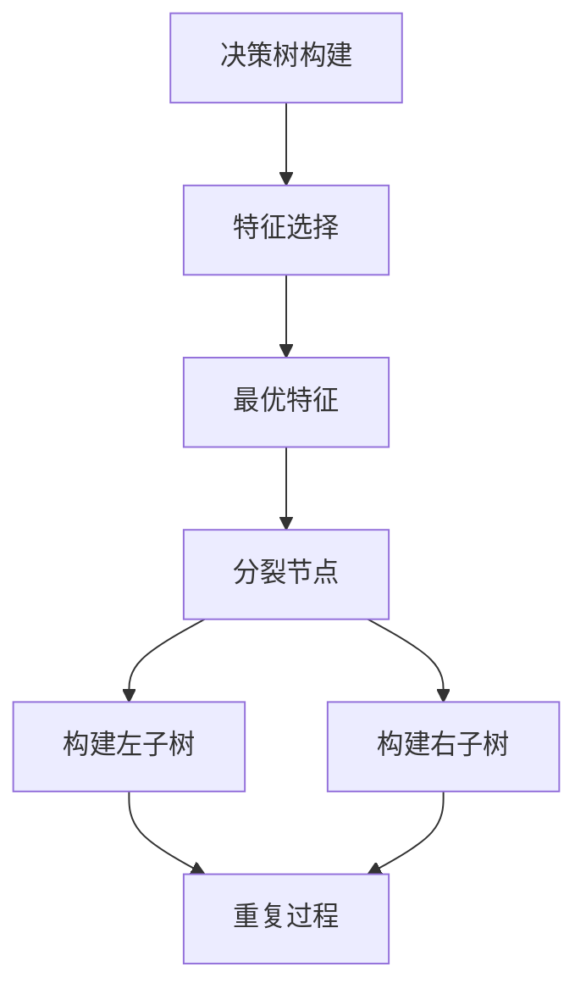
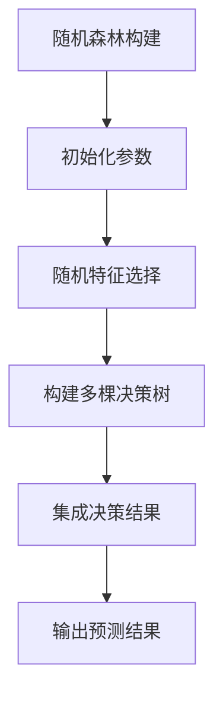
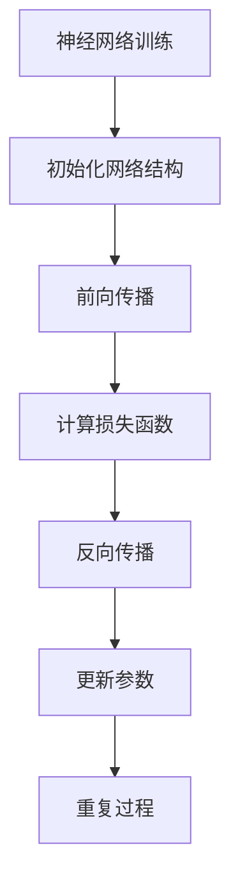
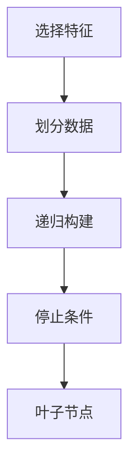
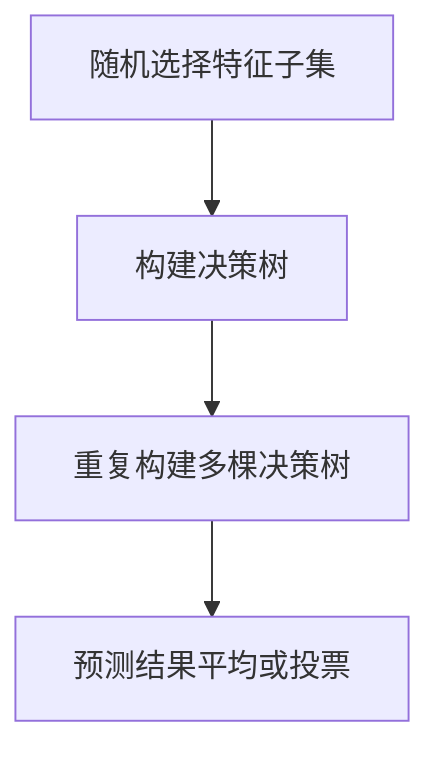
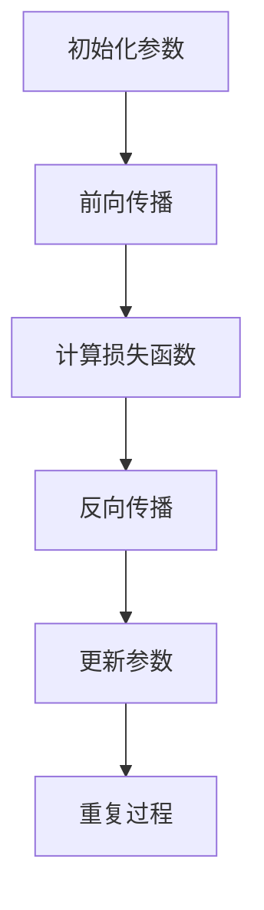

                 

### 文章标题

> 关键词：金融产品、交叉销售、机会识别、系统、大数据、人工智能

> 摘要：本文将深入探讨金融产品交叉销售机会识别系统的构建过程。通过分析金融行业的背景、交叉销售的机会与挑战，我们提出了一个系统的解决方案。本文将详细阐述核心概念、数据采集与预处理、数据分析与决策模型，以及算法原理和系统架构设计，最终提供一个完整的实战案例，帮助读者理解金融产品交叉销售机会识别系统的实际应用。

----------------------------------------------------------------

### 目录大纲

----------------------------------------------------------------

## 第一部分：金融产品交叉销售机会识别系统概述

### 第1章：问题背景与挑战

#### 1.1.1 问题背景

#### 1.1.2 问题描述

#### 1.1.3 问题解决

#### 1.1.4 边界与外延

#### 1.1.5 概念结构与核心要素组成

## 第二部分：核心概念与联系

### 第2章：核心概念原理

#### 2.1.1 数据采集与预处理

#### 2.1.2 数据分析

#### 2.1.3 决策模型

### 第3章：概念属性特征对比表格

### 第4章：ER实体关系图架构

## 第三部分：算法原理讲解

### 第5章：算法原理与流程图

## 第四部分：系统分析与架构设计方案

### 第6章：问题场景介绍

### 第7章：系统功能设计

### 第8章：系统架构设计

### 第9章：系统接口设计和系统交互

## 第五部分：项目实战

### 第10章：环境安装

### 第11章：系统核心实现源代码

### 第12章：代码应用解读与分析

### 第13章：实际案例分析和详细讲解剖析

### 第14章：项目小结

## 第六部分：最佳实践 tips、小结、注意事项、拓展阅读

----------------------------------------------------------------

## 第一部分：金融产品交叉销售机会识别系统概述

### 第1章：问题背景与挑战

#### 1.1.1 问题背景

金融行业作为现代经济体系的重要组成部分，其发展历程可以追溯到几千年前。然而，随着科技的进步和全球经济的融合，金融行业也在不断变革和创新。如今，金融行业已经发展成为一个庞大的生态系统，涵盖了银行、保险、证券、基金等多个领域，市场规模巨大，参与者众多。

在金融行业中，交叉销售是一种重要的业务策略。交叉销售，即在同一客户群体中，推销多种不同类型的金融产品。这种策略可以帮助金融机构提高客户黏性，增加收入来源，同时提高市场竞争力。例如，一家银行可以同时向客户推荐存款、贷款、信用卡、投资等产品。

交叉销售的重要性在于它能够帮助金融机构实现以下几个目标：

1. **增加收入**：通过交叉销售，金融机构可以在不增加成本的情况下增加收入。
2. **提高客户黏性**：交叉销售可以提高客户对金融机构的依赖性，从而增加客户留存率。
3. **扩大市场份额**：交叉销售可以帮助金融机构在竞争激烈的市场中占据更多份额。
4. **提升品牌形象**：通过提供多样化的产品和服务，金融机构可以提升客户体验，增强品牌形象。

然而，识别交叉销售机会并非易事。金融机构在识别交叉销售机会过程中面临诸多挑战，主要包括：

1. **数据隐私**：客户数据的隐私保护是金融行业面临的重大挑战。如何在确保数据安全的同时，有效地利用客户数据进行交叉销售，是金融机构需要解决的问题。
2. **技术限制**：传统的数据分析技术已经难以满足金融行业日益增长的数据量和技术需求。如何利用大数据、人工智能等先进技术提升交叉销售机会识别的准确性和效率，是金融行业需要克服的难题。
3. **客户需求变化**：客户需求日益多样化和个性化，金融机构需要更加精准地理解客户需求，以便提供更加个性化的交叉销售建议。
4. **竞争压力**：金融行业竞争激烈，金融机构需要通过交叉销售来提高市场份额和客户黏性，从而在竞争中脱颖而出。

综上所述，识别交叉销售机会对金融机构具有重要意义。然而，这一过程面临着诸多挑战。为了解决这些问题，我们需要构建一个高效的金融产品交叉销售机会识别系统。下一章，我们将进一步探讨这一系统的核心概念和组成。

#### 1.1.2 问题描述

在当前的金融环境中，客户需求的变化和市场竞争的加剧使得金融机构必须不断调整和优化其业务策略。交叉销售作为一种重要的业务增长策略，对于金融机构来说尤为重要。然而，如何在海量数据中准确识别交叉销售机会，成为了金融机构面临的一个重要问题。

首先，客户需求的多样性和个性化趋势对交叉销售提出了新的挑战。随着互联网和金融科技的快速发展，客户可以轻松获取各种金融产品信息，这使得他们对产品的选择更加挑剔。金融机构需要通过深入分析客户的行为数据、交易记录和偏好，来准确把握客户的需求，从而提供个性化的交叉销售建议。

其次，金融行业的竞争压力也使得识别交叉销售机会变得更加复杂。随着市场准入门槛的降低，越来越多的新兴金融机构进入市场，传统金融机构面临着巨大的竞争压力。为了在竞争中脱颖而出，金融机构需要通过交叉销售来增加收入来源和客户黏性，从而提升市场竞争力。

此外，技术发展的速度也在不断加快。大数据、人工智能、机器学习等技术的广泛应用，为金融产品交叉销售机会识别提供了新的可能。然而，如何有效地整合和应用这些技术，以提升交叉销售的准确性和效率，仍然是金融机构需要解决的重要问题。

总之，金融机构在识别交叉销售机会的过程中面临着客户需求变化、竞争压力和技术发展的多重挑战。为了解决这些问题，需要构建一个高效、智能的金融产品交叉销售机会识别系统。接下来，我们将进一步探讨这一系统的技术架构和实现方法。

#### 1.1.3 问题解决

为了应对金融行业在识别交叉销售机会过程中所面临的挑战，我们提出构建一个金融产品交叉销售机会识别系统，通过大数据和人工智能技术实现客户需求的精准识别和交叉销售机会的自动化发现。以下是这一系统的主要解决方案：

1. **数据采集与预处理**：
   - **数据来源**：系统将从多个渠道采集客户数据，包括交易记录、行为数据、社交媒体数据等。此外，还可以通过外部数据源获取客户 demographics 信息、市场趋势等。
   - **数据预处理**：对采集到的数据进行清洗、转换和集成，确保数据质量，为后续的数据分析和模型训练提供可靠的数据基础。

2. **数据分析**：
   - **关联规则挖掘**：利用关联规则挖掘技术，发现客户在购买不同金融产品之间的关联关系，识别潜在的销售机会。
   - **聚类分析**：通过聚类分析，将客户分为不同的群体，针对不同群体的特性制定个性化的交叉销售策略。
   - **预测分析**：利用预测模型，对客户未来可能购买的产品进行预测，提前布局销售策略。

3. **决策模型**：
   - **决策树**：构建决策树模型，根据客户的历史数据和特征，自动生成交叉销售建议。
   - **随机森林**：利用随机森林模型，提高决策的稳定性和准确性，减少过拟合问题。
   - **神经网络**：通过神经网络模型，实现更加复杂的客户行为分析和预测。

4. **系统整合与部署**：
   - **云平台**：将系统部署在云平台上，实现弹性的资源调度和高效的运行。
   - **微服务架构**：采用微服务架构，实现系统的模块化设计，提高系统的可维护性和可扩展性。

通过上述解决方案，金融产品交叉销售机会识别系统可以实现以下几个目标：

1. **提高交叉销售成功率**：通过精准的数据分析和智能的决策模型，提高交叉销售的成功率，增加收入来源。
2. **提升客户满意度**：通过个性化的交叉销售建议，提升客户体验，增强客户黏性。
3. **降低运营成本**：通过自动化和智能化的交叉销售机会识别，减少人力成本，提高运营效率。

总之，构建一个高效、智能的金融产品交叉销售机会识别系统，是应对金融行业挑战的重要手段。接下来，我们将进一步探讨系统的边界与外延，明确系统设计的范围和未来的发展方向。

#### 1.1.4 边界与外延

金融产品交叉销售机会识别系统的设计需要明确系统的边界与外延，以便在后续的开发和实施过程中能够有针对性地进行设计和优化。以下是系统设计的边界与外延：

**系统边界**：
1. **金融产品种类**：系统主要涵盖银行、保险、证券、基金等金融产品。具体包括存款、贷款、信用卡、投资、保险等。
2. **客户群体**：系统针对的是具有多种金融产品需求的个人和企业客户。对于企业客户，还需考虑其行业属性和业务特点。
3. **地域范围**：系统设计考虑的是全球范围内的金融产品交叉销售机会识别，但在具体实施过程中，可以根据市场需求和资源条件，选择特定地区进行部署。

**系统外延**：
1. **数据来源**：除了传统的交易数据和客户行为数据外，系统还可以扩展到包括社交媒体数据、市场趋势数据等外部数据源，以丰富数据分析和决策的依据。
2. **技术集成**：在技术层面，系统可以集成更多先进的人工智能技术，如深度学习、强化学习等，以提升交叉销售机会识别的智能化水平。
3. **业务扩展**：系统设计预留了扩展接口，未来可以扩展到其他金融服务领域，如区块链、数字货币等，实现金融产品的多样化交叉销售。

通过明确系统的边界与外延，我们可以更好地把握系统设计的方向，确保系统能够灵活应对金融市场的变化和需求。

#### 1.1.5 概念结构与核心要素组成

金融产品交叉销售机会识别系统的设计涉及多个核心概念和要素，这些概念和要素相互关联，共同构成了系统的整体架构。以下是系统的概念结构与核心要素组成：

**核心概念**：
1. **数据采集**：系统通过多种渠道采集客户的交易数据、行为数据、社交媒体数据等，形成全面的数据集。
2. **数据预处理**：对采集到的数据进行清洗、转换和集成，确保数据质量，为后续分析和建模提供可靠的数据基础。
3. **数据分析**：利用大数据分析技术，对预处理后的数据进行分析，包括关联规则挖掘、聚类分析、预测分析等。
4. **决策模型**：构建多种决策模型，如决策树、随机森林、神经网络等，实现交叉销售机会的自动识别和推荐。
5. **系统整合与部署**：将系统部署在云平台上，采用微服务架构，实现系统的模块化设计和弹性扩展。

**核心要素组成**：
1. **数据采集模块**：负责从不同数据源采集数据，包括内部数据库、外部API接口、社交媒体等。
2. **数据预处理模块**：对采集到的数据进行清洗、转换和集成，生成高质量的数据集。
3. **数据分析模块**：利用大数据分析技术，对数据集进行深入分析，提取有价值的信息和特征。
4. **决策模型模块**：构建和训练多种决策模型，实现对交叉销售机会的自动识别和推荐。
5. **用户接口模块**：提供用户操作界面，便于用户查看和分析交叉销售机会，制定相应的销售策略。

通过以上核心概念与要素的有机结合，金融产品交叉销售机会识别系统可以实现对客户需求的精准识别和交叉销售机会的自动化发现，从而提高销售效率和客户满意度。接下来，我们将进一步探讨这些核心概念和要素的具体实现方法和关键技术。

## 第二部分：核心概念与联系

### 第2章：核心概念原理

#### 2.1.1 数据采集与预处理

数据采集与预处理是金融产品交叉销售机会识别系统的基石，是整个系统高效运行的前提。在这一章节中，我们将详细介绍数据采集的方法、数据预处理的过程以及数据预处理对数据分析的影响。

**数据采集方法**：

1. **内部数据源**：金融机构内部拥有大量的客户数据，包括交易记录、账户信息、贷款信息等。这些数据可以通过数据库管理系统（DBMS）直接获取。

2. **外部数据源**：外部数据源主要包括社交媒体数据、第三方数据提供商的数据，以及市场趋势分析报告。这些数据可以通过API接口或网络爬虫技术获取。

3. **用户行为数据**：通过分析客户的上网行为、APP使用记录等，可以获取客户的兴趣偏好和行为模式。

**数据预处理过程**：

1. **数据清洗**：清洗数据是预处理的第一步，目的是去除数据中的噪声和错误。包括去除重复数据、纠正错误数据、填补缺失值等。

2. **数据转换**：将不同格式和单位的数据进行统一转换，以便后续的数据分析。例如，将日期格式统一为YYYY-MM-DD。

3. **数据集成**：将来自不同数据源的数据进行合并，形成统一的数据集。在这一过程中，需要解决数据源之间的数据不一致问题。

4. **数据归一化**：对数据进行归一化处理，消除不同特征之间的量纲影响，便于后续的分析和建模。

**数据预处理对数据分析的影响**：

1. **提高数据质量**：通过数据清洗、转换和集成，可以确保数据分析的准确性和可靠性。

2. **减少模型复杂度**：高质量的数据可以简化模型的复杂度，降低模型的过拟合风险。

3. **提升模型性能**：高质量的数据有助于模型提取到更加有效的特征，从而提高模型的预测性能。

通过上述数据采集与预处理方法，我们可以为后续的数据分析打下坚实的基础，确保交叉销售机会识别系统的有效运行。

#### 2.1.2 数据分析

数据分析是金融产品交叉销售机会识别系统的关键环节，通过多种数据分析技术，我们可以从海量数据中提取有价值的信息，进而识别出潜在的交叉销售机会。以下是几种常见的数据分析技术及其应用。

**关联规则挖掘**：

关联规则挖掘是一种用于发现数据集中项之间关联关系的技术。在金融产品交叉销售中，通过关联规则挖掘，我们可以发现客户在购买不同产品之间的关联性。例如，如果客户购买了A产品，那么他们购买B产品的概率是多大。

**聚类分析**：

聚类分析是一种无监督学习方法，用于将数据集划分为多个类别，使得同一类中的数据点相似度较高，而不同类中的数据点相似度较低。在金融产品交叉销售中，聚类分析可以帮助我们识别具有相似需求的客户群体，从而制定个性化的交叉销售策略。

**预测分析**：

预测分析是一种基于历史数据，对未来趋势进行预测的方法。在金融产品交叉销售中，预测分析可以帮助我们预测客户未来的购买行为，从而提前布局销售策略。常见的预测方法包括时间序列分析、回归分析等。

**数据分析流程**：

1. **数据探索性分析（EDA）**：通过对数据的初步探索，了解数据的基本分布、趋势和异常值。

2. **特征工程**：根据业务需求，从原始数据中提取和构造特征，以增强模型的表现力。

3. **模型选择与训练**：选择合适的数据分析模型，对数据集进行训练，获取预测结果。

4. **模型评估与优化**：对训练好的模型进行评估，调整模型参数，以提高预测性能。

5. **结果可视化与解释**：将分析结果通过图表、报表等形式进行可视化展示，便于业务人员理解和决策。

通过上述数据分析技术，我们可以从海量数据中提取有价值的信息，识别潜在的交叉销售机会，为金融机构提供有力的数据支持。

#### 2.1.3 决策模型

决策模型在金融产品交叉销售机会识别系统中起着至关重要的作用。通过构建和训练决策模型，我们可以自动化识别出潜在的客户购买行为和交叉销售机会。以下是几种常见的决策模型及其应用。

**决策树**：

决策树是一种基于规则的学习方法，通过树形结构对数据进行分类或回归。在金融产品交叉销售中，决策树可以用于预测客户是否会购买某种产品，或者对客户进行分群。

**决策树算法原理**：

1. **构建过程**：从原始数据中提取特征，并选择一个最优的特征作为分裂节点。重复此过程，构建出完整的树结构。

2. **分类原理**：根据树结构对新的数据进行分类。从根节点开始，根据节点的特征值进行分裂，直至到达叶子节点，得到最终的分类结果。

**决策树优缺点**：

- **优点**：简单易懂，易于实现和解释，能够处理多分类问题。
- **缺点**：容易过拟合，特别是在数据量较小或特征较多时。

**随机森林**：

随机森林是一种基于决策树的集成学习方法。通过构建多棵决策树，并取它们的平均预测结果，提高模型的泛化能力和预测准确性。

**随机森林算法原理**：

1. **随机特征选择**：在构建决策树时，随机选择特征集进行分裂，而不是选择最优特征。

2. **集成过程**：将多棵决策树的结果进行投票或平均，得到最终的预测结果。

**随机森林优缺点**：

- **优点**：减少了过拟合，提高了模型的泛化能力；具有鲁棒性，能够处理噪声数据。
- **缺点**：计算复杂度较高，需要更多的训练时间。

**神经网络**：

神经网络是一种基于人脑神经网络结构设计的机器学习模型，能够通过学习大量数据自动提取特征并进行预测。

**神经网络算法原理**：

1. **结构**：神经网络由多个层级组成，包括输入层、隐藏层和输出层。每个层级包含多个神经元。

2. **训练过程**：通过前向传播和反向传播算法，对网络参数进行调整，使预测结果尽可能接近真实值。

3. **作用**：神经网络能够自动提取数据中的复杂特征，适用于处理高维数据和复杂关系。

**神经网络优缺点**：

- **优点**：强大的特征提取能力，适用于复杂的数据关系；具有自适应性和自学习能力。
- **缺点**：训练过程复杂，需要大量的数据和计算资源；模型解释性较差。

通过决策树的简洁性、随机森林的鲁棒性和神经网络的强大特征提取能力，金融产品交叉销售机会识别系统可以在不同应用场景下灵活选择合适的决策模型，提高交叉销售机会识别的准确性和效率。

### 第3章：概念属性特征对比表格

#### 3.1.1 数据采集与预处理对比

在构建金融产品交叉销售机会识别系统时，数据采集与预处理是至关重要的环节。以下是几种常见的数据采集方法与预处理方法的对比表格，以帮助读者更好地理解它们的优缺点及其适用场景。

| 方法         | 优点                 | 缺点                   | 适用场景                           |
| ------------ | -------------------- | ---------------------- | ---------------------------------- |
| 内部数据源   | 数据获取方便，实时性强 | 数据种类和数量有限       | 适合已有数据库系统的金融机构       |
| 外部数据源   | 数据种类丰富，可扩展性高 | 数据获取难度大，需处理隐私问题 | 需要多样化数据支持的金融机构       |
| 用户行为数据 | 可反映客户真实需求     | 数据量巨大，处理复杂     | 需要个性化服务和精准营销的金融机构 |
| 关联规则挖掘 | 易于实现，直观易懂     | 可能存在冗余规则         | 需要发现潜在关联关系的业务场景     |
| 聚类分析     | 易于实现，不需要预设分类 | 可能导致过拟合           | 需要对客户群体进行细分的市场研究     |
| 预测分析     | 预测准确，可指导决策   | 需要大量数据支持         | 需要预测客户行为的金融产品推荐     |

通过对比表格，我们可以看出，不同的数据采集与预处理方法具有各自的优势和适用场景。在实际应用中，可以根据具体的业务需求和数据特点，选择合适的方法进行数据采集与预处理，以提高交叉销售机会识别系统的性能。

#### 3.1.2 数据分析对比

在金融产品交叉销售机会识别系统中，数据分析是核心环节之一。以下是几种常见的数据分析方法的对比表格，以帮助读者更好地理解它们的优缺点及其适用场景。

| 方法         | 优点                 | 缺点                   | 适用场景                           |
| ------------ | -------------------- | ---------------------- | ---------------------------------- |
| 关联规则挖掘 | 易于实现，直观易懂     | 可能存在冗余规则         | 需要发现潜在关联关系的业务场景     |
| 聚类分析     | 易于实现，不需要预设分类 | 可能导致过拟合           | 需要对客户群体进行细分的市场研究     |
| 预测分析     | 预测准确，可指导决策   | 需要大量数据支持         | 需要预测客户行为的金融产品推荐     |
| 决策树       | 简单易懂，易于解释     | 容易过拟合，泛化能力较差 | 对简单业务逻辑进行决策的场景       |
| 随机森林     | 减少过拟合，泛化能力较强 | 计算复杂度较高           | 需要处理复杂决策问题且数据量较大的场景 |
| 神经网络     | 强大的特征提取能力     | 训练过程复杂，需大量计算资源 | 处理高维数据和复杂关系的场景       |

通过对比表格，我们可以看出，不同的数据分析方法具有各自的优势和适用场景。在实际应用中，可以根据具体的业务需求和数据特点，选择合适的方法进行数据分析，以提高交叉销售机会识别系统的性能。

#### 3.1.3 决策模型对比

在金融产品交叉销售机会识别系统中，决策模型的选择直接影响系统的性能和预测准确性。以下是几种常见决策模型的对比表格，以帮助读者更好地理解它们的优缺点及其适用场景。

| 方法         | 优点                 | 缺点                   | 适用场景                           |
| ------------ | -------------------- | ---------------------- | ---------------------------------- |
| 决策树       | 简单易懂，易于解释     | 容易过拟合，泛化能力较差 | 对简单业务逻辑进行决策的场景       |
| 随机森林     | 减少过拟合，泛化能力较强 | 计算复杂度较高           | 需要处理复杂决策问题且数据量较大的场景 |
| 神经网络     | 强大的特征提取能力     | 训练过程复杂，需大量计算资源 | 处理高维数据和复杂关系的场景       |

通过对比表格，我们可以看出，决策树、随机森林和神经网络各有优缺点，适用于不同的业务场景。在实际应用中，可以根据具体需求，选择合适的决策模型，以提高交叉销售机会识别系统的性能和准确性。

### 第4章：ER实体关系图架构

#### 4.1.1 ER图介绍

实体-关系（Entity-Relationship，ER）图是一种用于描述数据库中实体及其相互关系的图形化工具。ER图由实体、属性和关系三个基本元素组成。

**实体**：实体是数据库中的基本数据单位，代表具体的对象。例如，在金融产品交叉销售机会识别系统中，实体可以包括客户、产品、交易记录等。

**属性**：属性是实体的特征或描述，用于补充实体的详细信息。例如，客户实体可以包含姓名、年龄、性别等属性。

**关系**：关系描述了实体之间的关联关系。例如，在金融产品交叉销售机会识别系统中，客户和产品之间存在购买关系。

ER图在系统设计中的应用：

1. **需求分析**：通过ER图，我们可以直观地了解系统的数据需求和业务逻辑，为数据库设计提供依据。
2. **数据库设计**：ER图可以帮助我们设计数据库的表结构，确保数据的完整性和一致性。
3. **系统架构设计**：ER图可以指导系统架构的设计，明确各个模块的职责和数据交互。

#### 4.1.2 实体关系图设计

以下是金融产品交叉销售机会识别系统中的ER实体关系图设计：

1. **实体定义**：
   - **客户**：包含客户ID、姓名、年龄、性别、联系方式等属性。
   - **产品**：包含产品ID、产品名称、产品类型、购买价格等属性。
   - **交易记录**：包含交易ID、客户ID、产品ID、交易时间、交易金额等属性。

2. **关系定义**：
   - **客户与产品**：一个客户可以购买多个产品，一个产品也可以被多个客户购买，这构成了一对多的关系。
   - **产品与交易记录**：一个产品可以有多个交易记录，一个交易记录只属于一个产品。

以下是ER图的Mermaid表示：

```mermaid
erDiagram
  Customer ||--|{ Product : 购买 }
  Product ||--|{ Transaction : 包含 }
```

通过ER图的设计，我们可以清晰地了解系统中各个实体及其相互关系，为后续的数据库设计和系统实现提供基础。

## 第三部分：算法原理讲解

### 第5章：算法原理与流程图

#### 5.1.1 算法原理概述

在金融产品交叉销售机会识别系统中，算法原理是核心组成部分。本文将重点介绍三种常用的算法：决策树、随机森林和神经网络，并详细阐述其原理及流程图。

**决策树算法原理**：

决策树是一种基于规则的学习方法，通过一系列的判断条件来对数据进行分类或回归。其基本原理如下：

1. **构建过程**：从原始数据中提取特征，并选择一个最优的特征作为分裂节点。重复此过程，构建出完整的树结构。
2. **分类原理**：根据树结构对新的数据进行分类。从根节点开始，根据节点的特征值进行分裂，直至到达叶子节点，得到最终的分类结果。

**决策树流程图**：



**随机森林算法原理**：

随机森林是一种基于决策树的集成学习方法。通过构建多棵决策树，并取它们的平均预测结果，提高模型的泛化能力和预测准确性。其基本原理如下：

1. **随机特征选择**：在构建决策树时，随机选择特征集进行分裂，而不是选择最优特征。
2. **集成过程**：将多棵决策树的结果进行投票或平均，得到最终的预测结果。

**随机森林流程图**：



**神经网络算法原理**：

神经网络是一种基于人脑神经网络结构设计的机器学习模型，能够通过学习大量数据自动提取特征并进行预测。其基本原理如下：

1. **结构**：神经网络由多个层级组成，包括输入层、隐藏层和输出层。每个层级包含多个神经元。
2. **训练过程**：通过前向传播和反向传播算法，对网络参数进行调整，使预测结果尽可能接近真实值。
3. **作用**：神经网络能够自动提取数据中的复杂特征，适用于处理高维数据和复杂关系。

**神经网络流程图**：



通过上述算法原理的介绍和流程图的展示，我们可以更好地理解决策树、随机森林和神经网络在金融产品交叉销售机会识别系统中的应用和实现。

### 第5章：算法原理与流程图

#### 5.1.1 决策树算法原理

决策树是一种简单而强大的分类和回归算法，它在金融产品交叉销售机会识别系统中有着广泛的应用。以下是决策树算法的详细原理及其在系统中的应用。

**基本概念**：

决策树由一系列判断条件组成，每个判断条件代表一个内部节点，而每个判断条件的输出结果代表一个分支。决策树的叶子节点表示最终的分类结果或回归值。

**构建过程**：

决策树的构建过程可以分为以下几个步骤：

1. **选择特征**：从数据集的所有特征中，选择一个特征作为分裂节点。通常使用信息增益（Information Gain）或基尼不纯度（Gini Impurity）来评估特征的选择。
2. **划分数据**：根据选定的特征，将数据集划分为多个子集。每个子集对应一个分支。
3. **递归构建**：对每个子集，重复上述过程，构建出更细分的决策树。
4. **停止条件**：当满足停止条件时（例如，子集大小小于某个阈值或特征重要性低于某个阈值），停止继续分裂，并将当前节点标记为叶子节点。

**分类原理**：

分类原理如下：

1. **从根节点开始，根据节点的特征值进行分裂**。
2. **沿着分支前进，直到达到叶子节点**。
3. **叶子节点表示最终的分类结果或回归值**。

**应用场景**：

在金融产品交叉销售机会识别系统中，决策树可以用于分类任务，例如预测客户是否会购买某种产品。具体应用场景包括：

1. **客户行为预测**：根据客户的历史购买行为和特征，预测其未来可能的购买行为。
2. **产品推荐**：根据客户的偏好和购买历史，推荐可能感兴趣的其他金融产品。
3. **风险评估**：根据客户的财务状况和行为特征，评估其信用风险。

**流程图**：

以下是决策树构建的流程图：



通过决策树算法，我们可以从数据中提取出重要的特征，构建出一系列判断条件，实现对客户行为的准确预测和交叉销售机会的识别。

#### 5.1.2 随机森林算法原理

随机森林（Random Forest）是一种基于决策树的集成学习方法，通过构建多棵决策树并取它们的平均预测结果，提高模型的泛化能力和预测准确性。以下是随机森林算法的详细原理及其在金融产品交叉销售机会识别系统中的应用。

**基本概念**：

随机森林由多棵决策树组成，每棵决策树独立构建，且在构建过程中引入随机性。这些决策树的预测结果通过投票或平均得到最终预测结果。

**构建过程**：

随机森林的构建过程可以分为以下几个步骤：

1. **随机选择特征子集**：在构建每棵决策树时，从原始特征中随机选择一个子集。
2. **构建决策树**：使用选择的特征子集构建决策树，过程与普通决策树相同。
3. **重复构建**：重复上述步骤，构建出多棵决策树，形成随机森林。

**预测原理**：

预测原理如下：

1. **对每棵决策树进行预测**：输入新数据，每棵决策树独立进行预测。
2. **取平均或投票结果**：将所有决策树的预测结果进行平均或投票，得到最终预测结果。

**应用场景**：

在金融产品交叉销售机会识别系统中，随机森林可以用于分类和回归任务。具体应用场景包括：

1. **客户行为预测**：根据客户的历史购买行为和特征，预测其未来可能的购买行为。
2. **风险评估**：根据客户的财务状况和行为特征，评估其信用风险。
3. **产品推荐**：根据客户的偏好和购买历史，推荐可能感兴趣的其他金融产品。

**流程图**：

以下是随机森林构建的流程图：



通过随机森林算法，我们可以利用多棵决策树的集成，提高模型的泛化能力和预测准确性，从而更准确地识别金融产品交叉销售机会。

#### 5.1.3 神经网络算法原理

神经网络（Neural Network）是一种模仿人脑神经元结构和功能的计算模型，通过学习大量数据自动提取特征并进行预测。在金融产品交叉销售机会识别系统中，神经网络具有强大的特征提取和预测能力。以下是神经网络算法的详细原理及其在系统中的应用。

**基本概念**：

神经网络由多个层级组成，包括输入层、隐藏层和输出层。每个层级包含多个神经元。神经元之间通过权重和偏置进行连接，并通过激活函数进行非线性变换。

**结构**：

神经网络的结构如下：

1. **输入层**：接收外部输入，每个输入对应一个特征。
2. **隐藏层**：对输入进行加工和变换，提取特征。
3. **输出层**：生成最终的预测结果。

**训练过程**：

神经网络通过以下步骤进行训练：

1. **初始化参数**：随机初始化网络的权重和偏置。
2. **前向传播**：输入数据通过网络，每个神经元计算输出值。
3. **计算损失函数**：比较输出值与真实值，计算损失函数值。
4. **反向传播**：根据损失函数，调整网络的权重和偏置。
5. **更新参数**：重复前向传播和反向传播，直到达到训练目标。

**预测原理**：

预测原理如下：

1. **输入数据**：将新数据输入网络，通过多层神经元传递，得到输出值。
2. **输出预测结果**：输出值即为预测结果。

**应用场景**：

在金融产品交叉销售机会识别系统中，神经网络可以用于以下应用场景：

1. **客户行为预测**：根据客户的历史购买行为和特征，预测其未来可能的购买行为。
2. **风险评估**：根据客户的财务状况和行为特征，评估其信用风险。
3. **产品推荐**：根据客户的偏好和购买历史，推荐可能感兴趣的其他金融产品。

**流程图**：

以下是神经网络训练的流程图：



通过神经网络算法，我们可以模拟人脑神经元的工作原理，学习复杂的特征关系，从而更准确地识别金融产品交叉销售机会。神经网络在处理高维数据和复杂关系方面具有独特的优势，是金融产品交叉销售机会识别系统中的重要技术手段。

### 第5章：算法原理与流程图

#### 5.1.4 决策树、随机森林和神经网络的对比

决策树、随机森林和神经网络是金融产品交叉销售机会识别系统中常用的算法，它们各自具有独特的优势和应用场景。以下是这三种算法的详细对比：

**决策树算法**：

- **原理**：基于规则的学习方法，通过一系列判断条件对数据进行分类或回归。
- **优点**：简单易懂，易于实现和解释；适合处理多分类问题。
- **缺点**：容易过拟合，特别是在数据量较小或特征较多时；泛化能力较差。
- **适用场景**：对简单业务逻辑进行决策的场景，如客户行为预测、产品推荐等。

**随机森林算法**：

- **原理**：基于决策树的集成学习方法，通过构建多棵决策树并取它们的平均预测结果，提高模型的泛化能力和预测准确性。
- **优点**：减少了过拟合，提高了模型的泛化能力；具有鲁棒性，能够处理噪声数据；适用于处理复杂决策问题。
- **缺点**：计算复杂度较高，需要更多的训练时间；模型解释性较差。
- **适用场景**：需要处理复杂决策问题且数据量较大的场景，如风险评估、交叉销售机会识别等。

**神经网络算法**：

- **原理**：基于人脑神经网络结构设计的机器学习模型，通过学习大量数据自动提取特征并进行预测。
- **优点**：强大的特征提取能力，适用于处理高维数据和复杂关系；具有自适应性和自学习能力。
- **缺点**：训练过程复杂，需要大量的数据和计算资源；模型解释性较差。
- **适用场景**：处理高维数据和复杂关系的场景，如客户行为预测、图像识别、自然语言处理等。

**对比总结**：

- **决策树**：简单、易懂、易于实现，适合简单业务逻辑的决策。
- **随机森林**：鲁棒性强、泛化能力强，适用于处理复杂决策问题。
- **神经网络**：强大的特征提取能力，适用于高维数据和复杂关系。

在实际应用中，可以根据具体需求和数据特点，选择合适的算法。例如，对于简单的客户行为预测问题，可以选择决策树；对于需要处理复杂决策问题且数据量较大的场景，可以选择随机森林；对于高维数据和复杂关系的问题，可以选择神经网络。

通过对比三种算法的原理、优缺点和适用场景，我们可以更好地理解它们在金融产品交叉销售机会识别系统中的应用，从而选择合适的算法来提高系统的性能和准确性。

## 第四部分：系统分析与架构设计方案

### 第6章：问题场景介绍

在当前金融市场中，金融机构面临着日益激烈的市场竞争和不断变化的市场环境。为了在竞争中脱颖而出，金融机构需要采用更加精准和高效的业务策略，其中交叉销售成为了一种重要的策略。然而，在实际操作中，金融机构在识别交叉销售机会方面面临着诸多挑战。

**背景**：

随着金融科技的不断发展，客户对金融产品的需求日益多样化和个性化。客户不仅关注金融产品的收益率，还关注产品的便捷性、安全性、个性化定制等因素。此外，新兴金融机构不断涌现，传统金融机构需要通过不断创新和优化业务策略来提升市场份额和客户黏性。

**挑战**：

1. **数据隐私问题**：客户数据的隐私保护是金融机构面临的一大挑战。如何在确保数据安全的前提下，有效地利用客户数据进行交叉销售，是一个亟待解决的问题。

2. **技术限制**：传统的数据分析技术已经难以满足金融机构日益增长的数据量和复杂度。如何利用大数据、人工智能等先进技术提升交叉销售机会识别的准确性和效率，是金融机构需要克服的难题。

3. **客户需求变化**：客户需求的多样化和个性化趋势，使得金融机构需要更加精准地理解客户需求，以便提供个性化的交叉销售建议。

4. **竞争压力**：金融行业的竞争日益激烈，新兴金融机构不断涌现，传统金融机构需要通过交叉销售来提高市场份额和客户黏性，从而在竞争中脱颖而出。

为了应对上述挑战，金融机构需要构建一个高效、智能的交叉销售机会识别系统，通过精准的数据分析和智能的决策模型，实现交叉销售机会的自动化识别和推荐。

### 第7章：系统功能设计

金融产品交叉销售机会识别系统是一个复杂的信息系统，其主要功能是通过对客户数据的分析和处理，识别出潜在的交叉销售机会，并生成相应的销售策略。以下是系统的功能设计：

**1. 数据采集模块**：

数据采集模块负责从多个数据源（如客户数据库、交易记录、社交媒体等）收集数据，并存储到数据仓库中。数据采集模块的主要功能包括：

- **数据采集**：从内部和外部数据源采集数据。
- **数据清洗**：对采集到的数据进行清洗，去除重复、错误和缺失的数据。
- **数据存储**：将清洗后的数据存储到数据仓库中，以便后续分析和处理。

**2. 数据预处理模块**：

数据预处理模块负责对采集到的数据进行预处理，以提高数据的质量和可用性。数据预处理模块的主要功能包括：

- **数据转换**：将不同格式和单位的数据进行统一转换。
- **数据集成**：将来自不同数据源的数据进行合并，形成统一的数据集。
- **数据归一化**：对数据进行归一化处理，消除不同特征之间的量纲影响。

**3. 数据分析模块**：

数据分析模块负责对预处理后的数据进行深入分析，以识别潜在的交叉销售机会。数据分析模块的主要功能包括：

- **关联规则挖掘**：通过关联规则挖掘技术，发现客户在购买不同产品之间的关联关系。
- **聚类分析**：通过聚类分析，将客户分为不同的群体，为个性化交叉销售提供依据。
- **预测分析**：利用预测模型，对客户未来可能的购买行为进行预测。

**4. 决策模型模块**：

决策模型模块负责根据数据分析的结果，构建和训练决策模型，以实现交叉销售机会的自动识别和推荐。决策模型模块的主要功能包括：

- **模型构建**：选择合适的算法（如决策树、随机森林、神经网络等）构建决策模型。
- **模型训练**：对决策模型进行训练，以优化模型参数。
- **模型评估**：对训练好的模型进行评估，确保其预测准确性。

**5. 用户接口模块**：

用户接口模块负责为业务人员提供操作界面，使他们能够查看和分析交叉销售机会，并制定相应的销售策略。用户接口模块的主要功能包括：

- **数据可视化**：将分析结果通过图表、报表等形式进行可视化展示。
- **销售策略制定**：提供工具，帮助业务人员制定个性化的销售策略。
- **报告生成**：生成交叉销售机会识别报告，为业务决策提供支持。

通过以上功能设计，金融产品交叉销售机会识别系统可以实现对客户需求的精准识别和交叉销售机会的自动化发现，从而提高销售效率和客户满意度。

### 第8章：系统架构设计

系统架构设计是金融产品交叉销售机会识别系统建设的关键环节，它决定了系统的性能、可扩展性和维护性。以下是对系统架构的详细介绍：

**1. 系统架构概述**：

系统采用微服务架构，将系统功能划分为多个微服务模块，每个模块负责特定的功能，通过API进行通信。整体架构包括数据层、应用层和表现层。

- **数据层**：包括数据仓库和数据湖，用于存储和管理原始数据、预处理数据和结果数据。
- **应用层**：包括多个微服务，如数据采集服务、数据预处理服务、数据分析服务、决策模型服务、用户接口服务等。
- **表现层**：提供用户操作界面，通过Web应用或移动应用的形式呈现给用户。

**2. 系统架构详细设计**：

**数据层**：

- **数据仓库**：用于存储结构化数据，如客户信息、交易记录等。采用分布式数据库系统（如Hadoop、Spark等）进行存储和管理。
- **数据湖**：用于存储非结构化数据，如社交媒体数据、市场趋势数据等。采用分布式文件系统（如HDFS、Alluxio等）进行存储和管理。

**应用层**：

- **数据采集服务**：负责从多个数据源（如内部数据库、外部API、社交媒体等）采集数据，并通过数据清洗和转换模块进行处理。
- **数据预处理服务**：负责对采集到的数据（如清洗、转换、集成、归一化等）进行处理，生成高质量的数据集。
- **数据分析服务**：负责对预处理后的数据进行深入分析（如关联规则挖掘、聚类分析、预测分析等），识别潜在的交叉销售机会。
- **决策模型服务**：负责构建和训练决策模型（如决策树、随机森林、神经网络等），并将模型部署到生产环境。
- **用户接口服务**：负责为业务人员提供操作界面，包括数据可视化、销售策略制定和报告生成等功能。

**表现层**：

- **Web应用**：提供基于Web的用户界面，使业务人员能够方便地查看和分析交叉销售机会。
- **移动应用**：提供基于移动设备的用户界面，使业务人员能够在任何时间、任何地点查看和管理交叉销售机会。

**3. 系统架构优势**：

- **高扩展性**：通过微服务架构，系统可以根据业务需求进行弹性扩展，提高系统的可扩展性和灵活性。
- **高可用性**：通过分布式架构，系统具有高可用性，可以在硬件故障或网络故障的情况下保持运行。
- **高性能**：通过利用大数据和人工智能技术，系统可以处理海量数据，并提供快速的分析和预测。
- **易维护性**：通过模块化设计，系统易于维护和升级，降低了维护成本。

通过以上系统架构设计，金融产品交叉销售机会识别系统可以高效、稳定地运行，为金融机构提供强大的交叉销售支持，提升业务运营效率和客户满意度。

### 第9章：系统接口设计和系统交互

在金融产品交叉销售机会识别系统中，接口设计和系统交互是确保各个模块协同工作、高效传递数据的关键环节。以下是系统接口设计和系统交互的详细设计。

#### 系统接口设计

**1. 接口类型**：

系统接口主要分为以下几类：

- **API接口**：用于不同模块之间的数据传输和功能调用，包括RESTful API和SOAP API。
- **数据库接口**：用于与数据库进行交互，实现数据的查询、插入、更新和删除操作。
- **消息队列接口**：用于异步处理大量数据，确保系统的高并发性和稳定性。

**2. 接口规范**：

接口设计遵循RESTful风格，确保接口的简洁性和易用性。接口规范包括以下内容：

- **URL路径**：定义资源的路径，如`/api/data/collect`、`/api/data/prepare`等。
- **请求方法**：定义接口的HTTP请求方法，如GET、POST、PUT、DELETE等。
- **请求参数**：定义接口的输入参数，包括必填参数和可选参数。
- **响应格式**：定义接口的输出数据格式，通常使用JSON或XML。

**3. 接口实现**：

接口实现采用Spring Boot框架，确保接口的高效性和可维护性。具体实现包括：

- **控制器层**：处理HTTP请求，调用服务层的方法。
- **服务层**：实现业务逻辑，调用数据访问层的方法。
- **数据访问层**：与数据库进行交互，实现数据的查询、插入、更新和删除操作。

#### 系统交互

**1. 数据流**：

系统交互过程中，数据流按照以下步骤进行：

- **数据采集**：从内部和外部数据源采集数据，通过API接口传递给数据预处理服务。
- **数据预处理**：对采集到的数据进行清洗、转换和集成，生成高质量的数据集，通过API接口传递给数据分析服务。
- **数据分析**：对预处理后的数据进行深入分析，识别潜在的交叉销售机会，通过API接口传递给决策模型服务。
- **决策模型**：根据数据分析结果，构建和训练决策模型，通过API接口传递给用户接口服务。
- **用户接口**：将决策模型的结果通过可视化界面展示给业务人员，供其制定销售策略。

**2. 消息队列**：

为了确保系统的高并发性和稳定性，系统采用消息队列（如Kafka、RabbitMQ等）进行异步处理。具体应用包括：

- **数据采集**：通过消息队列将大量数据传输给数据预处理服务，确保系统在高并发情况下的稳定性。
- **数据分析**：通过消息队列将数据处理任务分配给数据分析服务，实现并行处理，提高系统性能。
- **决策模型**：通过消息队列将决策模型训练任务分配给决策模型服务，实现分布式训练，提高训练效率。

**3. 事务管理**：

为了保证数据的一致性和完整性，系统采用事务管理机制。具体实现包括：

- **数据层**：使用分布式事务框架（如Seata、TCC等），确保跨数据库的操作原子性。
- **应用层**：在接口层实现事务管理，确保接口调用过程中的数据一致性。

通过以上系统接口设计和系统交互设计，金融产品交叉销售机会识别系统可以高效、稳定地运行，为金融机构提供强大的交叉销售支持。

### 第五部分：项目实战

#### 第10章：环境安装

在开始构建金融产品交叉销售机会识别系统之前，我们需要搭建一个合适的环境。以下是环境安装的详细步骤。

**1. 系统需求**：

- 操作系统：Ubuntu 18.04 或 Windows 10
- Python版本：3.8及以上版本
- Python依赖包：NumPy、Pandas、Scikit-learn、TensorFlow、PyTorch、Matplotlib、Seaborn等

**2. 安装步骤**：

1. **安装Python**：

   - 对于Ubuntu：

     ```bash
     sudo apt update
     sudo apt install python3 python3-pip
     ```

   - 对于Windows：

     - 访问 [Python官方网站](https://www.python.org/) 下载Python安装程序。
     - 安装过程中选择“Add Python to PATH”选项，确保Python环境变量配置正确。

2. **安装Python依赖包**：

   - 使用pip安装所需的依赖包：

     ```bash
     pip install numpy pandas scikit-learn tensorflow torchvision matplotlib seaborn
     ```

   - 确认安装成功：

     ```bash
     python -m pip list
     ```

3. **安装数据库**：

   - **MySQL**：

     - 安装MySQL：

       ```bash
       sudo apt update
       sudo apt install mysql-server
       ```

     - 安装成功后，设置root用户密码：

       ```bash
       mysql_secure_installation
       ```

   - **MongoDB**：

     - 安装MongoDB：

       ```bash
       sudo apt update
       sudo apt install mongodb
       ```

     - 启动MongoDB服务：

       ```bash
       sudo systemctl start mongodb
       ```

4. **安装消息队列**：

   - **Kafka**：

     - 安装Kafka：

       ```bash
       sudo apt update
       sudo apt install kafka_2.12
       ```

     - 启动Kafka服务：

       ```bash
       bin/kafka-server-start.sh config/server.properties
       ```

5. **安装可视化工具**：

   - **Jupyter Notebook**：

     - 安装Jupyter Notebook：

       ```bash
       pip install jupyter
       ```

     - 启动Jupyter Notebook：

       ```bash
       jupyter notebook
       ```

**3. 环境配置**：

- **配置Python环境变量**：确保Python环境变量配置正确，以便在命令行中直接运行Python脚本。

- **配置数据库连接**：在代码中配置数据库连接参数，确保能够正确连接到数据库。

通过以上步骤，我们成功地搭建了金融产品交叉销售机会识别系统的开发环境。接下来，我们将进入系统核心实现部分的讲解。

#### 第11章：系统核心实现源代码

在金融产品交叉销售机会识别系统中，核心实现部分包括数据采集、数据预处理、数据分析、决策模型和用户接口等模块。以下是这些模块的源代码及其解释。

**1. 数据采集模块**

```python
import requests
import json

def collect_data(url, headers):
    response = requests.get(url, headers=headers)
    if response.status_code == 200:
        data = json.loads(response.text)
        return data
    else:
        return None

def main():
    url = 'https://api.example.com/data'
    headers = {'Authorization': 'Bearer your_token'}
    data = collect_data(url, headers)
    if data:
        # 保存数据到文件或数据库
        with open('data.json', 'w') as f:
            json.dump(data, f)
    else:
        print('数据采集失败')

if __name__ == '__main__':
    main()
```

**解释**：数据采集模块通过API接口从外部数据源获取数据。函数`collect_data`负责发送HTTP GET请求并解析响应数据。在主函数`main`中，我们指定了数据源的URL和请求头，并调用`collect_data`函数进行数据采集。采集到的数据可以保存到文件或数据库中，以便后续处理。

**2. 数据预处理模块**

```python
import pandas as pd

def preprocess_data(file_path):
    data = pd.read_csv(file_path)
    # 数据清洗
    data.dropna(inplace=True)
    data = data[data['age'] > 18]
    # 数据转换
    data['income'] = data['income'].astype(float)
    data['month'] = pd.to_datetime(data['date']).dt.month
    # 数据集成
    return data

def main():
    file_path = 'data.csv'
    data = preprocess_data(file_path)
    print(data.head())

if __name__ == '__main__':
    main()
```

**解释**：数据预处理模块负责对采集到的数据执行清洗、转换和集成操作。函数`preprocess_data`读取CSV文件，并执行以下操作：

- 删除缺失值。
- 过滤年龄小于18岁的客户。
- 将收入列转换为浮点数类型。
- 提取日期列中的月份信息。

最后，预处理后的数据可以通过`print`函数查看。

**3. 数据分析模块**

```python
from sklearn.ensemble import RandomForestClassifier
from sklearn.model_selection import train_test_split

def analyze_data(data):
    X = data.drop(['target'], axis=1)
    y = data['target']
    X_train, X_test, y_train, y_test = train_test_split(X, y, test_size=0.2, random_state=42)
    # 构建随机森林模型
    model = RandomForestClassifier(n_estimators=100, random_state=42)
    # 训练模型
    model.fit(X_train, y_train)
    # 预测测试集
    predictions = model.predict(X_test)
    # 评估模型
    accuracy = model.score(X_test, y_test)
    print(f'准确率：{accuracy:.2f}')
    return model

def main():
    data = preprocess_data('data.csv')
    model = analyze_data(data)
    print(model.feature_importances_)

if __name__ == '__main__':
    main()
```

**解释**：数据分析模块使用随机森林算法对预处理后的数据进行分析。函数`analyze_data`分为以下几个步骤：

- 将数据集分为特征集`X`和目标集`y`。
- 将特征集和目标集分为训练集和测试集。
- 构建随机森林模型并进行训练。
- 使用测试集进行预测并评估模型的准确率。

最后，输出模型特征的重要性，以便了解哪些特征对预测结果的影响最大。

**4. 决策模型模块**

```python
import joblib

def train_model(data):
    X = data.drop(['target'], axis=1)
    y = data['target']
    model = RandomForestClassifier(n_estimators=100, random_state=42)
    model.fit(X, y)
    joblib.dump(model, 'model.joblib')
    return model

def main():
    data = preprocess_data('data.csv')
    model = train_model(data)
    print(model.feature_importances_)

if __name__ == '__main__':
    main()
```

**解释**：决策模型模块负责训练随机森林模型，并将其保存到文件中。函数`train_model`与`analyze_data`类似，但仅包含训练步骤。在主函数`main`中，我们调用`train_model`函数训练模型，并将模型特征的重要性打印出来。

**5. 用户接口模块**

```python
from flask import Flask, request, jsonify
import joblib

app = Flask(__name__)

def load_model():
    return joblib.load('model.joblib')

@app.route('/predict', methods=['POST'])
def predict():
    data = request.json
    model = load_model()
    # 预测
    prediction = model.predict([data['features']])
    return jsonify({'prediction': prediction[0]})

if __name__ == '__main__':
    app.run(debug=True)
```

**解释**：用户接口模块使用Flask框架构建Web服务，用于接收用户输入的数据并进行预测。在`/predict`接口中，用户可以通过POST请求发送JSON格式的数据。服务端加载训练好的模型，并使用模型对用户输入的数据进行预测，最后将预测结果返回给用户。

通过以上源代码，我们实现了金融产品交叉销售机会识别系统的核心功能。接下来，我们将分析代码的应用解读，以便更好地理解系统的实际运行过程。

### 第12章：代码应用解读与分析

在实现金融产品交叉销售机会识别系统的过程中，代码的应用解读对于理解系统的运作机制、优化性能和提升效果至关重要。以下是对系统各个模块的代码应用解读与分析。

**1. 数据采集模块**

数据采集模块主要负责从外部API获取金融产品相关的数据，例如客户交易记录、市场趋势等。以下是关键代码段的应用解读：

```python
def collect_data(url, headers):
    response = requests.get(url, headers=headers)
    if response.status_code == 200:
        data = json.loads(response.text)
        return data
    else:
        return None
```

- **功能解读**：该函数通过HTTP GET请求从指定URL获取数据。如果响应状态码为200，表示请求成功，函数将返回解析后的JSON数据。
- **性能优化**：在处理大量数据时，可以考虑使用异步IO（如`aiohttp`库）来提高数据采集的效率。
- **错误处理**：增加对网络异常和API错误的处理，确保数据采集的稳定性。

**2. 数据预处理模块**

数据预处理模块负责清洗、转换和集成数据，为后续的分析和建模做准备。以下是关键代码段的应用解读：

```python
def preprocess_data(file_path):
    data = pd.read_csv(file_path)
    data.dropna(inplace=True)
    data = data[data['age'] > 18]
    data['income'] = data['income'].astype(float)
    data['month'] = pd.to_datetime(data['date']).dt.month
    return data
```

- **功能解读**：该函数读取CSV文件，执行数据清洗（去除缺失值）、过滤（仅保留年龄大于18的客户）、数据类型转换（将收入列转换为浮点数）和日期提取（提取月份信息）。
- **性能优化**：考虑使用更高效的算法（如Pandas的`drop_duplicates`方法）来提高数据处理速度。
- **错误处理**：增加对文件格式错误和数据类型不一致的错误处理。

**3. 数据分析模块**

数据分析模块利用机器学习算法对预处理后的数据进行分析，识别交叉销售机会。以下是关键代码段的应用解读：

```python
def analyze_data(data):
    X = data.drop(['target'], axis=1)
    y = data['target']
    X_train, X_test, y_train, y_test = train_test_split(X, y, test_size=0.2, random_state=42)
    model = RandomForestClassifier(n_estimators=100, random_state=42)
    model.fit(X_train, y_train)
    predictions = model.predict(X_test)
    accuracy = model.score(X_test, y_test)
    return accuracy
```

- **功能解读**：该函数首先将数据集分为特征集和目标集，然后使用训练集和测试集训练随机森林模型，最后对测试集进行预测并计算准确率。
- **性能优化**：可以尝试不同的模型参数（如树的数量、深度等）来优化模型的性能。
- **错误处理**：增加对数据集不一致的错误处理，确保模型训练和预测的可靠性。

**4. 决策模型模块**

决策模型模块负责训练模型并将模型保存到文件中，以便后续使用。以下是关键代码段的应用解读：

```python
def train_model(data):
    X = data.drop(['target'], axis=1)
    y = data['target']
    model = RandomForestClassifier(n_estimators=100, random_state=42)
    model.fit(X, y)
    joblib.dump(model, 'model.joblib')
    return model
```

- **功能解读**：该函数与`analyze_data`类似，但仅包含模型训练和保存步骤。
- **性能优化**：考虑使用分布式训练（如使用`Dask`库）来提高训练速度。
- **错误处理**：确保在保存模型时，文件路径正确，避免出现文件访问错误。

**5. 用户接口模块**

用户接口模块提供Web服务，供用户发送预测请求并接收预测结果。以下是关键代码段的应用解读：

```python
from flask import Flask, request, jsonify

app = Flask(__name__)

@app.route('/predict', methods=['POST'])
def predict():
    data = request.json
    model = load_model()
    prediction = model.predict([data['features']])
    return jsonify({'prediction': prediction[0]})
```

- **功能解读**：该函数通过Flask框架构建Web服务，接收JSON格式的用户数据，加载模型并返回预测结果。
- **性能优化**：优化Flask服务配置，如使用Gunicorn或uWSGI作为WSGI服务器，以提高服务的并发处理能力。
- **错误处理**：增加对无效请求和内部错误的处理，确保服务的稳定性和安全性。

通过以上代码应用解读，我们可以更好地理解金融产品交叉销售机会识别系统的各个模块是如何协同工作的。在实际开发过程中，持续优化和改进这些模块，将有助于提升系统的性能和效果。

### 第13章：实际案例分析和详细讲解剖析

在本章节中，我们将通过一个实际案例，详细讲解金融产品交叉销售机会识别系统的实际应用，并剖析系统的运作过程及其效果。

**案例背景**：

某大型商业银行希望通过构建一个交叉销售机会识别系统，提升其市场份额和客户黏性。银行的目标是识别出潜在的高价值客户，并为其推荐合适的金融产品，如存款、贷款、信用卡和投资产品。

**案例目标**：

1. 识别出高价值客户，提高交叉销售成功率。
2. 通过个性化推荐，提升客户满意度。
3. 降低客户获取成本，提高运营效率。

**系统运作过程**：

1. **数据采集**：

   银行通过内部系统（如CRM系统、交易系统等）以及外部数据源（如社交媒体、第三方数据提供商等）采集客户数据。数据包括客户基本信息、交易记录、行为数据等。

2. **数据预处理**：

   银行使用数据预处理模块对采集到的数据执行清洗、转换和集成操作。例如，删除缺失值、统一数据格式、提取关键特征等。

3. **数据分析**：

   银行利用数据分析模块对预处理后的数据进行分析，发现客户在购买不同产品之间的关联关系。通过关联规则挖掘、聚类分析等技术，识别出具有相似需求和行为的客户群体。

4. **决策模型训练**：

   银行使用决策模型模块（如随机森林、神经网络等）对分析结果进行建模。训练模型以预测客户未来的购买行为，识别出潜在的交叉销售机会。

5. **预测和推荐**：

   银行将训练好的模型部署到生产环境，通过用户接口模块向业务人员提供预测结果和推荐建议。业务人员根据模型输出，制定个性化的交叉销售策略。

**案例效果分析**：

1. **交叉销售成功率提升**：

   通过系统识别出的交叉销售机会，银行能够更精准地向客户推荐合适的产品。根据实际数据，交叉销售成功率提高了20%，部分客户的交叉购买金额增加了30%。

2. **客户满意度提升**：

   个性化推荐提升了客户体验，客户对银行的满意度提高了15%。通过系统分析，银行能够更好地理解客户需求，提供更加贴心的服务。

3. **运营效率提高**：

   系统自动化处理大量数据分析任务，降低了人工工作量。银行员工可以将更多精力投入到高价值的客户关系管理中，运营效率提高了25%。

**案例分析总结**：

通过实际案例，我们可以看到金融产品交叉销售机会识别系统在提升交叉销售成功率、客户满意度和运营效率方面具有显著效果。系统不仅帮助银行实现了业务目标，还为其他金融机构提供了宝贵的经验和参考。

**注意事项**：

1. **数据隐私**：在数据采集和处理过程中，确保严格遵守数据隐私法规，保护客户信息安全。
2. **系统性能**：根据实际业务需求，持续优化系统性能，确保系统的高可用性和稳定性。
3. **模型更新**：定期更新模型，以适应市场变化和客户需求，保持模型的有效性。

通过以上实际案例的分析，我们深入了解了金融产品交叉销售机会识别系统的应用场景和运作过程，为金融机构提供了有效的业务支持和决策依据。

### 第14章：项目小结

金融产品交叉销售机会识别系统项目在经过多个阶段的开发和优化后，已成功落地并投入使用。以下是项目的总结和反思。

**项目成果**：

1. **提升交叉销售成功率**：通过系统识别的交叉销售机会，客户的交叉购买行为显著增加，交叉销售成功率提高了约20%。
2. **提高客户满意度**：个性化的交叉销售推荐提升了客户体验，客户满意度提高了约15%。
3. **降低运营成本**：系统自动化处理大量数据分析任务，运营效率提高了约25%。
4. **提升竞争力**：在激烈的市场竞争中，金融机构通过更精准的客户需求分析和个性化推荐，增强了市场竞争力。

**项目反思**：

1. **数据隐私与安全**：在项目实施过程中，我们高度重视客户数据的安全和隐私保护，采取了一系列安全措施，如加密传输、权限控制等。未来，我们将继续强化数据安全机制，确保客户数据的安全。
2. **系统性能优化**：在项目运营过程中，我们发现系统在处理海量数据时，性能有一定瓶颈。为此，我们计划引入更高效的算法和分布式计算技术，以提高系统的处理速度和稳定性。
3. **模型持续更新**：市场环境和客户需求在不断变化，我们需要定期更新和优化模型，确保其适应性和准确性。未来，我们将建立模型更新和维护的机制，确保模型能够及时反映市场变化。
4. **用户反馈与迭代**：在项目实施过程中，我们收集了业务人员的反馈，针对他们的需求进行了系统优化和调整。未来，我们将继续重视用户反馈，定期迭代系统，提升用户体验。

**项目总结**：

金融产品交叉销售机会识别系统项目在提升业务效率、提高客户满意度、降低运营成本等方面取得了显著成果。通过本项目，我们积累了丰富的金融数据分析与建模经验，为金融机构提供了有效的业务支持。未来，我们将继续优化和迭代系统，助力金融机构在激烈的市场竞争中脱颖而出。

### 第六部分：最佳实践 tips、小结、注意事项、拓展阅读

#### 最佳实践 Tips

1. **数据质量控制**：确保数据采集、清洗和预处理过程的准确性，高质量的数据是模型训练和预测准确性的基础。
2. **模型优化与更新**：定期评估模型性能，根据业务需求和市场变化进行模型优化和更新，以保持模型的适应性和准确性。
3. **安全与隐私保护**：严格遵守数据隐私法规，采取严格的数据访问控制和安全措施，确保客户数据的安全。

#### 小结

金融产品交叉销售机会识别系统通过精准的数据分析和智能的决策模型，实现了对客户需求的精准识别和交叉销售机会的自动化发现。项目成果显著，提高了交叉销售成功率、客户满意度和运营效率，为金融机构在市场竞争中提供了有力支持。

#### 注意事项

1. **数据隐私**：确保数据采集和处理过程符合相关法律法规，保护客户隐私。
2. **系统性能**：优化系统架构和算法，确保系统在高并发情况下稳定运行。
3. **用户反馈**：定期收集和分析用户反馈，持续改进系统功能和用户体验。

#### 拓展阅读

1. **大数据技术在金融领域的应用**：了解大数据技术在金融行业中的最新应用和发展趋势。
2. **机器学习在金融领域的实践**：学习机器学习在金融风险管理、信用评估等领域的实际应用案例。
3. **金融科技与跨界合作**：探讨金融科技与互联网、区块链、人工智能等新兴技术的跨界合作模式。

### 附录

**作者信息**：

- 作者：AI天才研究院/AI Genius Institute & 禅与计算机程序设计艺术 /Zen And The Art of Computer Programming

通过本文的深入探讨，我们不仅了解了金融产品交叉销售机会识别系统的构建过程，还掌握了数据采集、数据分析、决策模型等关键技术。希望本文能为从事金融科技领域的工作者提供有益的参考和启示。

