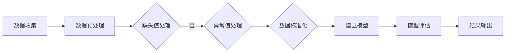
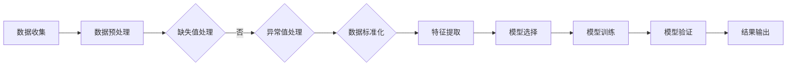
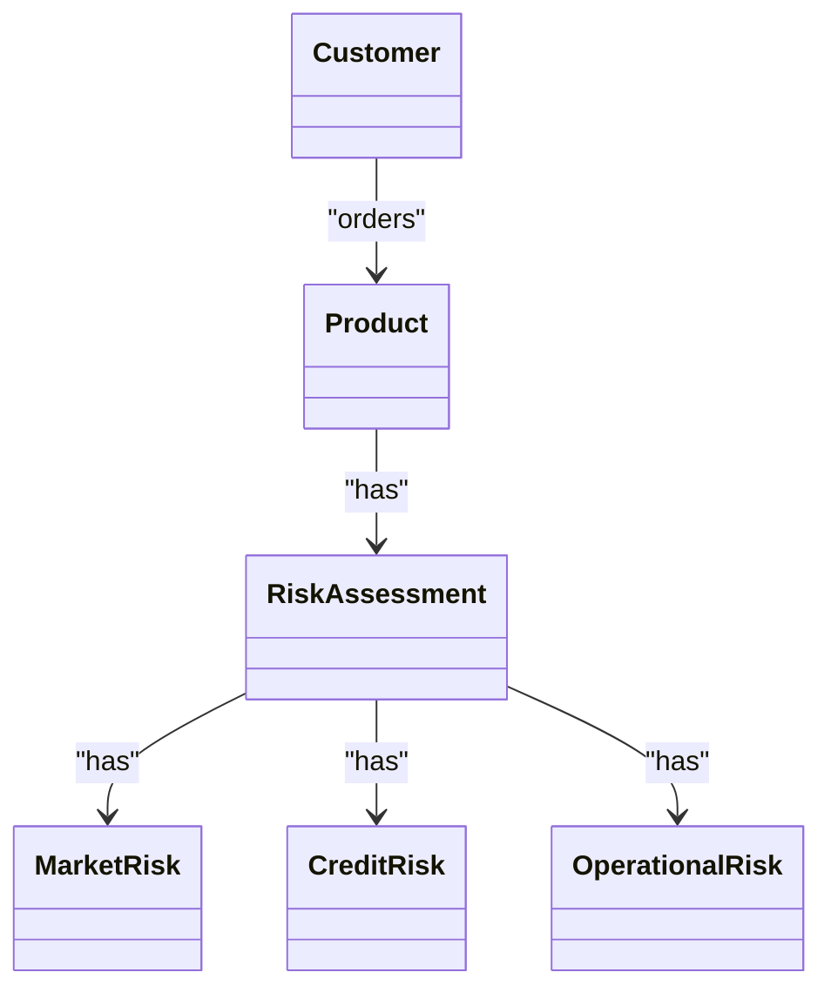
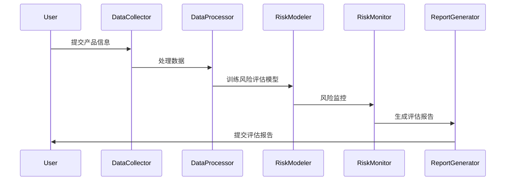
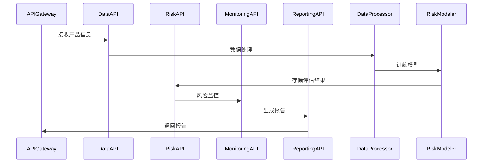
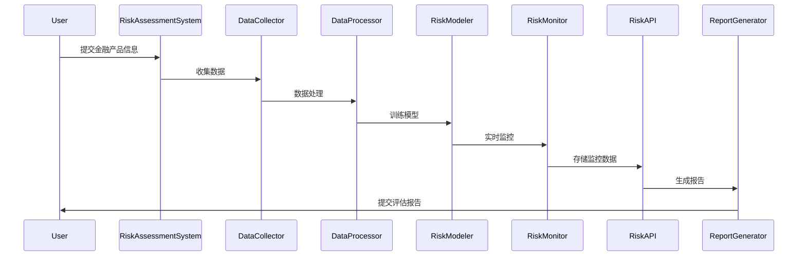

                 

## 第一部分：背景介绍

### 1.1 问题背景

金融产品创新是金融机构提高竞争力、满足客户需求、适应市场变化的重要手段。随着金融市场的不断发展和变化，金融机构需要不断推出新的金融产品来满足市场的需求，从而提高自身的竞争力。然而，金融产品创新并不是一个简单的过程，它涉及到多个方面，包括产品设计、市场调研、风险评估等。其中，风险评估是金融产品创新过程中的关键环节，因为金融产品创新伴随着风险，如市场风险、信用风险、操作风险等，如何有效评估这些风险成为金融产品创新的关键问题。

### 1.2 问题解决

为了解决金融产品创新风险评估的问题，金融机构需要建立一套有效的风险评估框架。风险评估框架是一种系统的方法，通过明确的风险评估指标体系、风险评估模型、风险评估方法和风险评估结果分析，对金融产品创新过程中的各种风险进行评估，为金融机构提供决策支持。通过风险评估框架，金融机构可以全面了解金融产品的风险状况，从而做出更加明智的决策，降低金融产品创新的风险。

### 1.3 边界与外延

风险评估框架的边界包括金融产品的范围、风险评估的方法和技术等。金融产品创新的范围可以涵盖各种类型的金融产品，如银行理财产品、证券、保险等。风险评估的方法可以包括定性方法和定量方法，如专家评估、统计分析、机器学习等。风险评估框架的外延则涉及金融市场的各个方面，如金融产品的市场需求、金融市场的环境变化等。

### 1.4 概念结构与核心要素组成

金融产品创新风险评估框架由以下几个核心要素组成：

1. **风险评估指标体系**：是风险评估框架的基础，包括风险识别指标、风险评估指标和风险控制指标。风险识别指标用于识别潜在的风险因素；风险评估指标用于衡量风险的程度；风险控制指标用于衡量金融机构的风险控制能力。

2. **风险评估模型**：是评估金融产品风险的数学模型，可以基于统计学或人工智能等方法，通过历史数据或实时数据来预测风险。

3. **风险评估方法**：包括定性方法和定量方法，定性方法主要通过专家意见和案例分析进行风险评估，定量方法则通过数学模型和数据分析进行风险评估。

4. **风险评估结果分析**：对评估结果进行深入分析，识别风险的主要来源和程度，为金融机构提供决策依据。

通过这些核心要素的有机结合，金融产品创新风险评估框架能够对金融产品的风险进行全面、系统的评估，从而为金融机构的产品创新提供有力支持。

## 第2章 核心概念与联系

### 2.1 风险评估指标体系

风险评估指标体系是金融产品创新风险评估框架的核心组成部分，它通过一系列指标来量化和管理风险。一个完整的风险评估指标体系通常包括风险识别指标、风险评估指标和风险控制指标。以下是一个简化的风险评估指标体系表格：

| 指标类别 | 指标名称 | 指标含义 |
| --- | --- | --- |
| 风险识别指标 | 产品复杂度 | 衡量金融产品的复杂程度，复杂度越高，潜在风险越大 |
| 风险识别指标 | 法律合规性 | 衡量金融产品是否遵守相关法律法规 |
| 风险识别指标 | 市场环境变动性 | 衡量市场环境的不确定性，如经济周期、政策变化等 |
| 风险评估指标 | 市场波动性 | 衡量市场价格波动程度，波动性越大，市场风险越高 |
| 风险评估指标 | 信用风险 | 衡量债务人违约的可能性 |
| 风险评估指标 | 流动性风险 | 衡量金融产品资产变现的能力 |
| 风险控制指标 | 风险准备金率 | 衡量金融机构的风险抵御能力，准备金率越高，风险控制能力越强 |
| 风险控制指标 | 持续性改进措施 | 衡量金融机构的风险管理能力，如定期审查、应急预案等 |

这些指标的设计和选取需要充分考虑金融产品的特性、市场需求和金融机构的实际情况。例如，对于复杂的衍生金融产品，需要更多的风险识别指标来捕捉其复杂性和不确定性；对于市场波动性较大的金融产品，需要更详细的市场风险评估指标来预测其潜在风险。

### 2.2 风险评估模型

风险评估模型是评估金融产品风险的数学模型，它是基于统计学、机器学习等算法构建的。风险评估模型的主要目的是通过对历史数据和当前数据的分析，预测金融产品的未来风险水平。常见的风险评估模型包括以下几种：

1. **回归模型**：通过历史数据建立产品风险与相关指标之间的回归关系，例如线性回归、逻辑回归等。回归模型可以用来预测某个特定指标（如市场波动性）对产品风险的影响。

2. **时间序列模型**：如自回归模型（AR）、移动平均模型（MA）、自回归移动平均模型（ARMA）等，用于分析时间序列数据，预测未来某个时间段的风险水平。

3. **机器学习模型**：如决策树、随机森林、支持向量机（SVM）、神经网络等，通过大量历史数据的训练，学习到风险与各种因素之间的复杂关系，并用于预测未来的风险。

以下是一个简化的ER实体关系图，用于描述风险评估模型中的实体关系：

```mermaid
erDiagram
    ProductRisk => RiskIndicator : "uses"
    MarketEnvironment => RiskIndicator : "uses"
    FinancialProduct => ProductRisk : "has"
    FinancialInstitution => ProductRisk : "managed by"
```

- **ProductRisk**：表示金融产品的风险，由多个**RiskIndicator**构成。
- **RiskIndicator**：表示风险指标，包括市场环境变动性、市场波动性、信用风险等。
- **MarketEnvironment**：表示市场环境，与**RiskIndicator**有关联。
- **FinancialProduct**：表示金融产品，与**ProductRisk**有关联。
- **FinancialInstitution**：表示金融机构，负责**ProductRisk**的管理。

通过这种实体关系，可以清晰地定义金融产品、风险指标和金融机构之间的关系，为风险评估模型的构建提供基础。

### 2.3 风险评估方法

风险评估方法可以分为定性方法和定量方法。定性方法主要通过专家意见、情景分析和案例研究等方法进行风险评估，定量方法则通过统计学模型、机器学习算法等量化方法进行风险评估。以下分别介绍这两种方法。

#### 定性方法

定性方法的核心是利用专家的知识和经验来评估风险。具体步骤如下：

1. **专家访谈**：通过与相关领域的专家进行访谈，获取他们对金融产品风险的看法和经验。
2. **情景分析**：构建不同的市场情景，分析这些情景对金融产品风险的影响。
3. **案例研究**：研究历史上的风险事件，分析这些事件对金融产品的影响，并总结经验教训。

定性方法的优点是能够快速评估风险，缺点是主观性较强，容易受到专家个人经验和偏见的影响。

#### 定量方法

定量方法通过数学模型和数据分析来评估风险，具有更高的客观性和准确性。以下是几种常见的定量方法：

1. **统计分析方法**：如回归分析、时间序列分析等，通过分析历史数据，建立风险指标与金融产品风险之间的关系。
   ```mermaid
   flowchart LR
       A[开始] --> B[收集数据]
       B --> C[数据预处理]
       C --> D[建立模型]
       D --> E[模型评估]
       E --> F[结果输出]
       F --> G[结束]
   ```

2. **机器学习方法**：如决策树、支持向量机（SVM）、神经网络等，通过训练大量历史数据，学习到风险与各种因素之间的复杂关系。
   ```mermaid
   flowchart LR
       A[开始] --> B[数据收集]
       B --> C[数据预处理]
       C --> D[特征提取]
       D --> E[模型选择]
       E --> F[模型训练]
       F --> G[模型验证]
       G --> H[结果输出]
       H --> I[结束]
   ```

3. **蒙特卡罗模拟**：通过模拟大量的随机场景，评估金融产品的风险水平。这种方法适用于不确定性和随机性较高的金融产品。
   ```mermaid
   flowchart LR
       A[开始] --> B[初始化参数]
       B --> C{模拟场景}
       C -->|是|D[计算风险指标]
       D --> E[统计结果]
       E --> F[结果输出]
       F --> G[结束]
   ```

通过结合定性方法和定量方法，金融机构可以更全面地评估金融产品创新的风险，为决策提供科学依据。

## 第3章 算法原理讲解

### 3.1 基于统计学的风险评估模型

统计学模型在金融产品风险评估中有着广泛应用，其基本原理是通过分析历史数据，建立风险指标与金融产品风险之间的统计关系，进而预测未来风险。以下是一个简化的基于统计学的风险评估模型流程：



**步骤解析**：

1. **数据收集**：收集与金融产品相关的历史数据，包括市场波动性、信用风险、流动性风险等指标。
   
2. **数据预处理**：对收集的数据进行清洗，包括处理缺失值和异常值。缺失值可以通过插值、均值填充等方法进行处理；异常值可以通过箱线图、Z-score等方法进行识别和处理。

3. **数据标准化**：将数据标准化到同一量级，以消除不同指标之间的量纲影响。

4. **建立模型**：选择合适的统计模型，如线性回归、逻辑回归等，建立风险指标与金融产品风险之间的关系。例如，线性回归模型可以表示为：

   $$
   风险值 = \beta_0 + \beta_1 \times 市场波动性 + \beta_2 \times 信用风险 + \beta_3 \times 流动性风险
   $$

5. **模型评估**：通过交叉验证等方法评估模型的预测能力，选择最佳模型。

6. **结果输出**：根据评估结果，输出金融产品的风险值。

### 3.2 基于人工智能的风险评估模型

随着人工智能技术的快速发展，机器学习在金融产品风险评估中的应用也越来越广泛。以下是一个简化的基于人工智能的风险评估模型流程：



**步骤解析**：

1. **数据收集**：与基于统计学的方法类似，收集与金融产品相关的历史数据。

2. **数据预处理**：对数据进行清洗和处理，包括缺失值和异常值的处理，以及数据标准化。

3. **特征提取**：从原始数据中提取对风险评估有意义的特征。例如，通过文本分析提取金融报告中的关键词，或使用图像处理技术从财务报表中提取关键信息。

4. **模型选择**：根据数据的特点和需求，选择合适的机器学习模型。常见的模型包括决策树、随机森林、支持向量机（SVM）、神经网络等。

5. **模型训练**：使用训练数据集对模型进行训练，调整模型的参数，使其能够较好地拟合数据。

6. **模型验证**：通过验证数据集对模型进行评估，确保模型具有良好的预测能力。

7. **结果输出**：根据模型预测结果，输出金融产品的风险值。

### 3.3 数学模型与公式

在金融产品风险评估中，数学模型和公式起着至关重要的作用。以下是一个简化的风险评估数学模型，用于描述金融产品的风险值计算：

$$
风险值 = f(产品复杂度, 市场波动性, 信用风险, 流动性风险)
$$

其中，$f$ 是一个复合函数，通过加权组合各个风险因素来计算总风险值。具体的函数形式可以采用线性加权、非线性变换等不同方式。以下是一个简化的线性加权模型：

$$
风险值 = w_1 \times 产品复杂度 + w_2 \times 市场波动性 + w_3 \times 信用风险 + w_4 \times 流动性风险
$$

其中，$w_1, w_2, w_3, w_4$ 是各个风险因素的权重，根据实际情况进行调整。

### 3.4 举例说明

假设一个金融产品的产品复杂度为3，市场波动性为0.1，信用风险为0.05，流动性风险为0.02，权重分别为0.4、0.3、0.2和0.1。则其风险值可以通过以下公式计算：

$$
风险值 = 0.4 \times 3 + 0.3 \times 0.1 + 0.2 \times 0.05 + 0.1 \times 0.02 = 1.22
$$

这意味着该金融产品的风险值为1.22，属于中等风险水平。通过这种方式，金融机构可以定量地评估金融产品的风险，为决策提供科学依据。

## 第4章 系统分析与架构设计

### 4.1 问题场景介绍

金融产品创新风险评估系统是一个用于帮助金融机构评估金融产品创新风险的综合性平台。其核心目的是通过系统化的方法，对金融产品的市场风险、信用风险、操作风险等各方面进行评估，为金融机构的产品创新提供决策支持。该系统适用于银行、证券、保险等金融机构，特别是在金融产品种类繁多、风险复杂度高的场景中。

### 4.2 项目介绍

金融产品创新风险评估系统的项目目标是构建一个高效、可靠的评估平台，实现以下功能：

1. **数据收集与管理**：系统应具备从多个数据源收集金融产品相关数据的能力，包括市场数据、客户数据、产品数据等，并对数据进行统一管理和存储。
2. **风险评估**：系统应能根据收集的数据，利用统计学模型和人工智能算法对金融产品的风险进行评估，并提供详细的评估报告。
3. **风险监控与预警**：系统应具备实时监控金融产品风险变化的能力，并在风险达到预警阈值时发出警报，提示相关人员进行干预。
4. **决策支持**：系统应提供多维度的数据分析工具，帮助金融机构管理层了解产品的风险状况，为产品创新和风险管理提供科学依据。

### 4.3 系统功能设计（领域模型）

领域模型是系统功能设计的基础，它通过实体关系图来描述系统中的核心实体及其之间的关系。以下是一个简化的领域模型类图：



- **Customer（客户）**：表示金融产品的购买者或使用者，与**Product（产品）**之间存在订购关系。
- **Product（产品）**：表示金融机构推出的金融产品，与**RiskAssessment（风险评估）**之间存在包含关系。
- **RiskAssessment（风险评估）**：表示对金融产品进行风险评估的结果，包括**MarketRisk（市场风险）**、**CreditRisk（信用风险）**和**OperationalRisk（操作风险）**等子类。
- **MarketRisk（市场风险）**：表示金融产品的市场风险，如市场波动性、利率风险等。
- **CreditRisk（信用风险）**：表示金融产品的信用风险，如债务人违约风险、信用等级等。
- **OperationalRisk（操作风险）**：表示金融产品的操作风险，如信息系统风险、操作失误等。

### 4.4 系统架构设计

系统架构设计是确保系统功能实现和性能优化的重要环节。以下是一个简化的系统架构图：



- **User（用户）**：系统操作者，提交产品信息并查看评估报告。
- **DataCollector（数据收集器）**：从各种数据源收集金融产品相关数据。
- **DataProcessor（数据处理器）**：对收集到的数据进行清洗、预处理和标准化。
- **RiskModeler（风险评估模型器）**：利用预处理后的数据训练风险评估模型。
- **RiskMonitor（风险监控器）**：实时监控金融产品的风险变化，并触发预警机制。
- **ReportGenerator（评估报告生成器）**：生成风险评估报告，并提供给用户。

### 4.5 系统接口设计

系统接口设计是确保系统模块之间有效通信的重要环节。以下是一个简化的接口设计图：



- **APIGateway（API网关）**：作为系统的入口，处理所有的外部请求，并将其路由到相应的服务。
- **DataAPI（数据接口）**：提供数据收集、处理和存储的API。
- **RiskAPI（风险评估接口）**：提供风险评估和存储的API。
- **MonitoringAPI（监控接口）**：提供风险监控和预警的API。
- **ReportingAPI（报告接口）**：提供报告生成和输出的API。

### 4.6 系统交互

系统交互是确保各模块协同工作的关键。以下是一个简化的系统交互序列图：



- **User（用户）**：提交金融产品信息。
- **RiskAssessmentSystem（风险评估系统）**：处理整个风险评估流程，包括数据收集、处理、模型训练、监控和报告生成。
- **DataCollector（数据收集器）**：收集用户提交的金融产品信息。
- **DataProcessor（数据处理器）**：对收集的数据进行清洗、预处理和标准化。
- **RiskModeler（风险评估模型器）**：使用预处理后的数据训练风险评估模型。
- **RiskMonitor（风险监控器）**：实时监控金融产品的风险变化，并触发预警。
- **RiskAPI（风险评估接口）**：存储和处理评估结果和监控数据。
- **ReportGenerator（评估报告生成器）**：生成风险评估报告，并提供给用户。

通过上述系统分析与架构设计，金融产品创新风险评估系统可以实现高效、准确的风险评估，为金融机构的产品创新提供有力支持。

### 4.7 项目实战

#### 环境安装

首先，我们需要在本地环境中安装一些必要的软件和库，以运行风险评估系统。以下是一个简化的环境安装步骤：

1. **安装Python环境**：确保Python版本在3.8及以上，可以使用以下命令安装Python：
   ```
   sudo apt-get install python3.8
   ```

2. **安装虚拟环境**：创建一个Python虚拟环境，以便隔离项目依赖：
   ```
   python3.8 -m venv risk-assessment-venv
   source risk-assessment-venv/bin/activate
   ```

3. **安装依赖库**：使用pip安装项目所需的依赖库，例如NumPy、Pandas、scikit-learn等：
   ```
   pip install numpy pandas scikit-learn
   ```

#### 系统核心实现

以下是系统核心实现的源代码，包括数据收集、预处理、模型训练和评估等步骤：

```python
# 导入必要的库
import numpy as np
import pandas as pd
from sklearn.model_selection import train_test_split
from sklearn.preprocessing import StandardScaler
from sklearn.linear_model import LinearRegression
from sklearn.metrics import mean_squared_error

# 数据收集
def collect_data():
    # 假设数据已从外部源导入，存储在CSV文件中
    data = pd.read_csv('financial_data.csv')
    return data

# 数据预处理
def preprocess_data(data):
    # 数据清洗和预处理
    data = data.dropna()  # 去除缺失值
    data = data[data['product_complexity'] != -1]  # 去除异常值
    data = data[['product_complexity', 'market_volatility', 'credit_risk', 'liquidity_risk', 'risk_value']]
    return data

# 模型训练
def train_model(X, y):
    model = LinearRegression()
    model.fit(X, y)
    return model

# 模型评估
def evaluate_model(model, X_test, y_test):
    y_pred = model.predict(X_test)
    mse = mean_squared_error(y_test, y_pred)
    return mse

# 主函数
def main():
    # 收集数据
    data = collect_data()
    
    # 预处理数据
    data = preprocess_data(data)
    
    # 分割数据集
    X = data[['product_complexity', 'market_volatility', 'credit_risk', 'liquidity_risk']]
    y = data['risk_value']
    X_train, X_test, y_train, y_test = train_test_split(X, y, test_size=0.2, random_state=42)
    
    # 标准化特征
    scaler = StandardScaler()
    X_train = scaler.fit_transform(X_train)
    X_test = scaler.transform(X_test)
    
    # 训练模型
    model = train_model(X_train, y_train)
    
    # 评估模型
    mse = evaluate_model(model, X_test, y_test)
    print(f"测试集均方误差: {mse}")

    # 输出模型参数
    print(f"模型参数: {model.coef_}")

# 运行主函数
if __name__ == '__main__':
    main()
```

#### 代码应用解读与分析

1. **数据收集**：该部分假设数据已从外部源导入，实际项目中可能需要从数据库、API或其他数据源导入数据。

2. **数据预处理**：数据清洗是处理缺失值、异常值等，确保数据质量。预处理步骤包括去除缺失值、异常值，并提取与风险评估相关的特征。

3. **模型训练**：使用线性回归模型进行训练，实际应用中可以根据需求选择其他模型，如决策树、神经网络等。

4. **模型评估**：使用测试集评估模型性能，通常使用均方误差（MSE）等指标来衡量。

#### 实际案例分析

以下是一个简化的实际案例分析：

假设我们有如下数据：

```
product_complexity  market_volatility  credit_risk  liquidity_risk  risk_value
1                   0.1                0.02         0.03            0.2        0.35
2                   0.2                0.03         0.04            0.25       0.45
3                   0.15               0.04         0.02            0.18       0.3
```

1. **数据收集**：从CSV文件中导入数据。

2. **数据预处理**：处理缺失值和异常值。

3. **模型训练**：使用线性回归模型进行训练。

4. **模型评估**：使用测试集评估模型性能，输出模型参数。

5. **结果输出**：输出金融产品的风险值。

#### 项目小结

通过上述实战案例，我们可以看到金融产品创新风险评估系统的实现过程，包括数据收集、预处理、模型训练和评估等步骤。实际应用中，可以根据具体需求进行调整和优化，以提高风险评估的准确性和效率。

## 最佳实践 Tips

1. **数据质量是关键**：确保数据收集和预处理过程的准确性，避免因数据质量问题导致风险评估结果失真。
2. **模型选择要合理**：根据金融产品的特性和风险评估的需求，选择合适的模型，如线性回归、决策树、神经网络等。
3. **实时监控与预警**：建立实时监控和预警机制，及时识别和应对潜在风险。
4. **持续迭代优化**：定期对风险评估模型进行优化和调整，以适应市场环境的变化。

## 小结

本文介绍了金融产品创新风险评估框架的核心概念、算法原理、系统分析与架构设计以及项目实战。通过系统的分析和设计，金融机构可以更加科学地评估金融产品创新的风险，为产品创新提供有力支持。希望本文能为读者提供有价值的参考和启示。

## 注意事项

1. **数据隐私保护**：在处理金融产品数据时，确保遵守相关法律法规，保护客户隐私。
2. **模型可解释性**：对于复杂的人工智能模型，如神经网络，确保其结果具有可解释性，以便管理层理解和决策。
3. **系统安全性**：确保风险评估系统的安全性，防止数据泄露和系统被攻击。

## 拓展阅读

1. **《金融风险管理》**：深入探讨金融风险管理的基本理论和实践方法。
2. **《机器学习与风险管理》**：介绍机器学习在金融风险管理中的应用和案例。
3. **《金融产品创新与风险管理》**：探讨金融产品创新与风险管理的相互作用和策略。

作者：AI天才研究院/AI Genius Institute & 禅与计算机程序设计艺术 /Zen And The Art of Computer Programming

