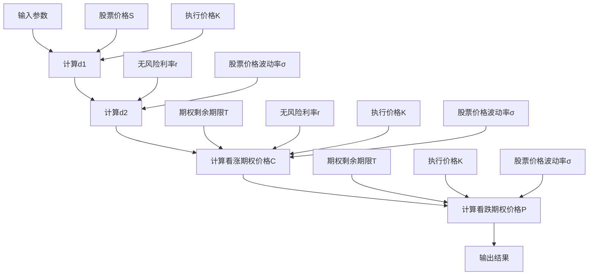
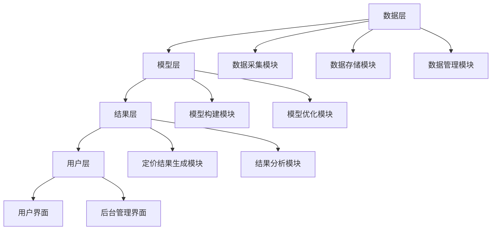
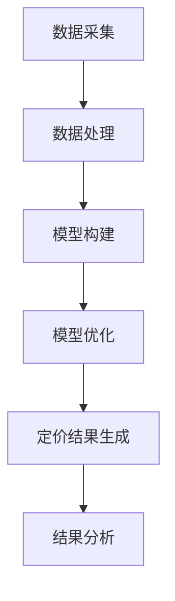

                 


## 第1章：背景介绍与核心概念

### 1.1 问题背景

金融产品定价优化是一个涉及经济学、数学和计算机科学等多个领域的交叉学科课题。随着金融市场的发展和金融产品的多样化，传统的定价方法已经难以满足实际需求。金融产品定价优化的目标是通过构建数学模型，结合市场数据和算法，精确预测产品的市场价格，从而帮助金融机构制定更加合理的定价策略。

在金融市场中，产品定价不仅影响投资者的收益，还直接影响金融机构的利润。因此，如何合理定价成为金融行业的一项重要任务。然而，金融产品定价面临着诸多挑战，如市场波动、风险因素、信息不对称等。这些问题使得金融产品定价优化成为一个复杂而富有挑战性的课题。

### 1.2 金融产品定价优化的重要性

金融产品定价优化对于金融机构和投资者都具有重要的意义。首先，对于金融机构来说，合理的定价策略能够提高产品的竞争力，增加市场份额。同时，准确的定价还可以降低风险，确保金融机构的稳健运营。其次，对于投资者来说，了解金融产品的真实价值有助于做出更明智的投资决策，提高投资收益。

在现代金融市场中，金融产品定价优化已经成为金融机构提升竞争力的重要手段。通过优化定价模型，金融机构可以更好地理解市场动态，快速响应市场变化，从而在激烈的市场竞争中脱颖而出。

### 1.3 核心概念介绍

为了深入探讨金融产品定价优化模型，我们需要了解以下几个核心概念：

#### 1.3.1 金融产品定价的基本理论

金融产品定价是基于供需理论、资本市场理论和风险中性定价理论等基本原理。供需理论认为，价格取决于供给和需求的关系，当供给大于需求时，价格下跌；当需求大于供给时，价格上涨。资本市场理论强调市场价格反映了所有可用信息的总和。风险中性定价理论则认为，投资者对风险的态度是中性的，即不考虑风险因素，只关注预期收益。

#### 1.3.2 金融产品定价的影响因素

金融产品定价受到多种因素的影响，包括市场利率、通货膨胀率、信用风险、市场波动等。这些因素不仅影响产品的价格，还影响投资者的投资决策。因此，准确评估这些因素对于金融产品定价优化至关重要。

#### 1.3.3 金融产品定价优化模型的基本框架

金融产品定价优化模型通常包括数据收集、模型构建、模型优化和模型应用等几个阶段。数据收集阶段需要获取市场数据、客户数据和产品数据等。模型构建阶段通过数学模型和算法将数据转化为定价结果。模型优化阶段通过对模型参数进行调整，提高定价的准确性和效率。模型应用阶段将定价结果应用于实际操作，如产品定价、投资组合优化等。

### 1.4 金融产品定价优化模型的基本框架

金融产品定价优化模型的基本框架可以分为以下几个部分：

#### 1.4.1 模型目标

模型的目标是准确预测金融产品的市场价格，为金融机构提供合理的定价策略。

#### 1.4.2 模型类型

根据金融产品的不同类型，可以采用不同的定价模型，如股票定价模型、债券定价模型、期权定价模型等。每种模型都有其独特的数学公式和算法。

#### 1.4.3 模型参数

模型的参数包括市场利率、波动率、到期时间、本金等。这些参数直接影响定价结果的准确性。

#### 1.4.4 模型优化

模型优化是提高定价准确性和效率的关键环节。通过调整模型参数、改进算法等手段，可以优化模型性能。

#### 1.4.5 模型应用

模型应用是将定价结果应用于实际操作的过程。通过模型应用，金融机构可以制定更加合理的定价策略，提高市场竞争力和投资收益。

### 结论

金融产品定价优化模型在金融市场中具有重要的应用价值。通过深入理解核心概念和模型框架，我们可以更好地应对金融市场中的挑战，为金融机构和投资者提供有效的定价策略。在接下来的章节中，我们将详细探讨金融产品定价优化的数学模型、算法原理、系统架构和项目实战等内容。让我们一起开启这场金融科技之旅吧！

### 第2章：核心概念与联系

### 2.1 金融产品定价的基本原理

金融产品定价是一个复杂的过程，涉及多个理论和方法。以下是金融产品定价的一些基本原理：

#### 2.1.1 供需理论

供需理论认为，市场价格由供给和需求决定。当市场供给大于需求时，价格下跌；当需求大于供给时，价格上涨。供需理论在金融产品定价中具有重要的应用，如股票定价、债券定价等。

#### 2.1.2 资本市场理论

资本市场理论认为，市场价格反映了所有可用信息的总和。投资者根据市场信息做出投资决策，从而影响市场价格。资本市场理论在金融产品定价中起着基础性的作用，如资产定价模型（CAPM）等。

#### 2.1.3 风险中性定价理论

风险中性定价理论认为，投资者对风险的态度是中性的，即不考虑风险因素，只关注预期收益。该理论在期权定价、衍生品定价等领域具有重要应用。

### 2.2 关键参数与模型联系

金融产品定价涉及多个关键参数，如市场利率、波动率、到期时间、本金等。以下是这些参数与金融产品定价模型之间的联系：

#### 2.2.1 市场利率

市场利率直接影响债券和贷款等金融产品的定价。高利率通常导致价格上涨，低利率通常导致价格下跌。市场利率的变化会影响投资者的投资决策，进而影响市场价格。

#### 2.2.2 波动率

波动率是衡量金融产品价格变动幅度的指标。高波动率通常导致期权等衍生品的价格上升，低波动率通常导致价格下降。波动率的变化会影响投资者的风险偏好，进而影响市场价格。

#### 2.2.3 到期时间

到期时间是指金融产品到期的时间。对于债券和贷款等固定收益产品，到期时间直接影响其定价。到期时间越长，风险越高，价格通常越低。对于股票和期权等权益类产品，到期时间会影响投资者的预期收益和风险。

#### 2.2.4 本金

本金是指金融产品初始投资金额。对于债券和贷款等固定收益产品，本金直接影响其定价。对于股票和期权等权益类产品，本金影响投资者的投资规模和风险承受能力。

### 2.3 概念属性特征对比表格

为了更好地理解金融产品定价的基本原理和关键参数，我们可以通过以下表格对比不同金融产品的概念属性特征：

| 金融产品 | 定价原理 | 关键参数 | 属性特征 |
| --- | --- | --- | --- |
| 股票 | 供需理论、资本市场理论 | 市场利率、波动率、到期时间、本金 | 流动性高、波动性大、风险与收益并存 |
| 债券 | 风险中性定价理论、利率期限结构理论 | 市场利率、信用评级、到期时间、本金 | 流动性较低、波动性较小、风险相对较低 |
| 期权 | 风险中性定价理论、随机过程理论 | 波动率、到期时间、执行价格、本金 | 权利与义务分离、非线性收益 |
| 基差 | 供需理论、市场动态 | 基础资产价格、期权价格、到期时间 | 反映市场预期与实际价格差异 |

### 2.4 ER实体关系图架构

为了更直观地展示金融产品定价模型中的实体关系，我们可以使用ER（Entity-Relationship）实体关系图。以下是金融产品定价模型中的ER实体关系图：

```mermaid
erDiagram
  Product ||--|{ MarketData } MarketData
  Product ||--|{ Parameter } Parameter
  Product ||--|{ PriceModel } PriceModel
  MarketData ||--|{ MarketFactor } MarketFactor
  Parameter ||--|{ InterestRate } InterestRate
  Parameter ||--|{ Volatility } Volatility
  Parameter ||--|{ TimeToMaturity } TimeToMaturity
  Parameter ||--|{ Principal } Principal
  PriceModel ||--|{ StockPriceModel } StockPriceModel
  PriceModel ||--|{ BondPriceModel } BondPriceModel
  PriceModel ||--|{ OptionPriceModel } OptionPriceModel
  StockPriceModel ||--|{ CAPMModel } CAPMModel
  StockPriceModel ||--|{ DividendModel } DividendModel
  BondPriceModel ||--|{ YieldToMaturityModel } YieldToMaturityModel
  BondPriceModel ||--|{ InterestRateModel } InterestRateModel
  OptionPriceModel ||--|{ BlackScholesModel } BlackScholesModel
  OptionPriceModel ||--|{ BinomialTreeModel } BinomialTreeModel
```

在这个ER实体关系图中，产品（Product）与市场数据（MarketData）、参数（Parameter）和价格模型（PriceModel）之间存在关联。市场数据（MarketData）又与市场因素（MarketFactor）相关联，参数（Parameter）包括利率（InterestRate）、波动率（Volatility）、到期时间（TimeToMaturity）和本金（Principal）。价格模型（PriceModel）则分为股票价格模型（StockPriceModel）、债券价格模型（BondPriceModel）和期权价格模型（OptionPriceModel）等，每个价格模型都有对应的数学模型，如CAPM模型（CAPMModel）、收益模型（DividendModel）、到期收益率模型（YieldToMaturityModel）和布莱克-舍尔斯模型（BlackScholesModel）等。

通过ER实体关系图，我们可以清晰地了解金融产品定价模型中的实体关系和关联，从而更好地理解和应用金融产品定价优化模型。

### 第3章：算法原理讲解

#### 3.1 数学模型介绍

在金融产品定价优化中，常用的数学模型包括股票定价模型、债券定价模型和期权定价模型。每种模型都有其独特的数学公式和算法，下面将分别进行介绍。

#### 3.1.1 股票定价模型

股票定价模型主要用于估算股票的市场价值。其中，最著名的模型是资本资产定价模型（CAPM）。CAPM模型基于以下假设：

1. 投资者拥有统一的预期收益。
2. 市场风险可以通过无风险资产和投资组合的风险分散来降低。
3. 投资者追求最大化期望收益，并最小化风险。

CAPM模型的数学公式为：

$$
E(R_i) = R_f + \beta_i \times [E(R_m) - R_f]
$$

其中，$E(R_i)$表示股票的期望收益，$R_f$表示无风险收益，$\beta_i$表示股票的贝塔系数，$E(R_m)$表示市场的期望收益。

#### 3.1.2 债券定价模型

债券定价模型主要用于估算债券的市场价值。常见的债券定价模型包括到期收益率模型（Yield To Maturity, YTM）和利率期限结构模型（Interest Rate Term Structure, IRTS）。

到期收益率模型假设债券到期时，投资者可以获得面值和利息收入。其数学公式为：

$$
YTM = \frac{C + \frac{F - P}{n}}{\frac{P + F}{2}} \times 100%
$$

其中，$C$表示每年支付的利息，$F$表示债券到期时的面值，$P$表示债券的购买价格，$n$表示债券的剩余期限。

#### 3.1.3 期权定价模型

期权定价模型主要用于估算期权的市场价值。最著名的期权定价模型是布莱克-舍尔斯模型（Black-Scholes Model）。布莱克-舍尔斯模型基于以下假设：

1. 市场处于无摩擦状态，即不存在交易费用、税收和限制。
2. 股票价格遵循几何布朗运动。
3. 股票可以以任何数量进行交易，且不存在股息支付。

布莱克-舍尔斯模型的数学公式为：

$$
C = S_t \times \Phi(d_1) - K \times \Phi(d_2)
$$

$$
P = K \times \Phi(-d_2) - S_t \times \Phi(-d_1)
$$

其中，$C$表示看涨期权的价格，$P$表示看跌期权的价格，$S_t$表示当前股票价格，$K$表示期权的执行价格，$\Phi$表示累积分布函数，$d_1$和$d_2$分别为：

$$
d_1 = \frac{\ln(S_t/K) + (r + \sigma^2/2) \times T}{\sigma \times \sqrt{T}}
$$

$$
d_2 = d_1 - \sigma \times \sqrt{T}
$$

其中，$r$表示无风险利率，$\sigma$表示股票价格波动率，$T$表示期权的剩余期限。

#### 3.2 数学公式与公式推导

下面将详细讲解布莱克-舍尔斯模型的数学公式及其推导过程。

##### 3.2.1 布莱克-舍尔斯模型的数学公式

首先，我们回顾布莱克-舍尔斯模型的核心公式：

$$
C = S_t \times \Phi(d_1) - K \times \Phi(d_2)
$$

$$
P = K \times \Phi(-d_2) - S_t \times \Phi(-d_1)
$$

##### 3.2.2 公式推导

布莱克-舍尔斯模型的推导过程涉及多个步骤。以下是简要的推导过程：

1. **假设与边界条件**：

   布莱克-舍尔斯模型基于几何布朗运动假设，即股票价格满足以下随机微分方程：

   $$ 
   dS_t = \mu S_t dt + \sigma S_t dW_t 
   $$

   其中，$S_t$表示股票价格，$\mu$表示股票预期收益率，$\sigma$表示股票价格波动率，$W_t$表示维纳过程。

2. **欧式看涨期权的收益函数**：

   欧式看涨期权的收益函数为：

   $$ 
   \phi(S_T) = \max(S_T - K, 0) 
   $$

   其中，$S_T$表示到期时的股票价格，$K$表示期权的执行价格。

3. **期权价格的无套利边界**：

   假设存在一种无套利投资组合，其价值为$V_t$。根据无套利原理，该投资组合的价值应满足以下条件：

   $$ 
   V_t = S_t - K \times e^{-r(T-t)} 
   $$

   其中，$r$表示无风险利率，$T-t$表示剩余期限。

4. **累积分布函数**：

   布莱克-舍尔斯模型中的累积分布函数$\Phi$表示标准正态分布的累积分布函数。其定义为：

   $$ 
   \Phi(x) = \int_{-\infty}^{x} \frac{1}{\sqrt{2\pi}} e^{-\frac{t^2}{2}} dt 
   $$

5. **推导过程**：

   通过对上述公式进行变换和代入，可以推导出布莱克-舍尔斯模型的公式。具体推导过程如下：

   - 首先，将欧式看涨期权的收益函数转化为概率形式：

     $$ 
     \phi(S_T) = \max(S_T - K, 0) = S_T - K \quad \text{if} \quad S_T > K 
     $$

     $$ 
     \phi(S_T) = 0 \quad \text{if} \quad S_T \leq K 
     $$

   - 将概率形式代入无套利边界条件：

     $$ 
     V_t = S_t \times \Phi\left(\frac{\ln(S_T/K) + (r + \sigma^2/2) \times T}{\sigma \times \sqrt{T}}\right) - K \times \Phi\left(\frac{\ln(S_T/K) + (r - \sigma^2/2) \times T}{\sigma \times \sqrt{T}}\right) 
     $$

   - 进一步简化公式：

     $$ 
     V_t = S_t \times \Phi(d_1) - K \times \Phi(d_2) 
     $$

   其中，$d_1$和$d_2$分别为：

     $$ 
     d_1 = \frac{\ln(S_t/K) + (r + \sigma^2/2) \times T}{\sigma \times \sqrt{T}} 
     $$

     $$ 
     d_2 = \frac{\ln(S_t/K) + (r - \sigma^2/2) \times T}{\sigma \times \sqrt{T}} 
     $$

   - 同理，可以推导出欧式看跌期权的公式：

     $$ 
     P = K \times \Phi(-d_2) - S_t \times \Phi(-d_1) 
     $$

#### 3.3 Python源代码讲解

为了更好地理解和应用布莱克-舍尔斯模型，下面将给出一个简单的Python实现。该实现将使用NumPy库和SciPy库来计算期权价格。

```python
import numpy as np
from scipy.stats import norm

# 定义布莱克-舍尔斯模型函数
def black_scholes(S, K, r, sigma, T):
    d1 = (np.log(S / K) + (r + 0.5 * sigma**2) * T) / (sigma * np.sqrt(T))
    d2 = d1 - sigma * np.sqrt(T)
    C = S * norm.cdf(d1) - K * np.exp(-r * T) * norm.cdf(d2)
    P = K * np.exp(-r * T) * norm.cdf(-d2) - S * norm.cdf(-d1)
    return C, P

# 示例参数
S = 100  # 当前股票价格
K = 100  # 执行价格
r = 0.05  # 无风险利率
sigma = 0.2  # 股票价格波动率
T = 1  # 期权剩余期限（年）

# 计算期权价格
C, P = black_scholes(S, K, r, sigma, T)

# 输出结果
print("看涨期权价格（C）: ", C)
print("看跌期权价格（P）: ", P)
```

在这个示例中，我们首先导入了NumPy库和SciPy库。然后，定义了一个名为`black_scholes`的函数，该函数接受股票价格（S）、执行价格（K）、无风险利率（r）、股票价格波动率（sigma）和期权剩余期限（T）作为参数。函数内部使用了累积分布函数`norm.cdf`来计算期权价格。

最后，我们设置了示例参数，并调用`black_scholes`函数计算期权价格。输出结果显示了看涨期权价格（C）和看跌期权价格（P）。

通过这个Python示例，我们可以轻松计算布莱克-舍尔斯模型中的期权价格，并将其应用于金融产品定价优化。

### 3.4 算法流程图

为了更好地理解布莱克-舍尔斯模型的计算过程，我们可以使用Mermaid绘制算法流程图。以下是算法流程图的示例：



在这个算法流程图中，首先输入股票价格（S）、执行价格（K）、无风险利率（r）、股票价格波动率（σ）和期权剩余期限（T）。然后，计算累积分布函数的参数d1和d2。接下来，使用d1和d2计算看涨期权价格C和看跌期权价格P。最后，输出计算结果。

通过这个算法流程图，我们可以清晰地了解布莱克-舍尔斯模型的计算步骤和流程。

### 第4章：数学模型与公式详细讲解

在金融产品定价优化模型中，数学模型的准确性和有效性至关重要。本章将对金融产品定价的主要数学模型及其公式进行详细讲解，以便读者更好地理解和应用这些模型。

#### 4.1 模型的数学公式解析

金融产品定价模型主要包括股票定价模型、债券定价模型和期权定价模型。以下是这些模型的数学公式及其解析：

##### 4.1.1 股票定价模型

**资本资产定价模型（CAPM）**

CAPM模型是股票定价的基础模型，用于估算股票的市场价值。其公式为：

$$
E(R_i) = R_f + \beta_i \times [E(R_m) - R_f]
$$

- $E(R_i)$：股票的期望收益。
- $R_f$：无风险收益。
- $\beta_i$：股票的贝塔系数。
- $E(R_m)$：市场的期望收益。

CAPM模型通过贝塔系数衡量股票的风险，贝塔系数越高，股票的风险越大。

##### 4.1.2 债券定价模型

**到期收益率模型（YTM）**

到期收益率模型用于估算债券的市场价值。其公式为：

$$
YTM = \frac{C + \frac{F - P}{n}}{\frac{P + F}{2}} \times 100\%
$$

- $C$：每年支付的利息。
- $F$：债券到期时的面值。
- $P$：债券的购买价格。
- $n$：债券的剩余期限。

到期收益率反映了投资者购买债券后的实际年化收益率。

##### 4.1.3 期权定价模型

**布莱克-舍尔斯模型（BS）**

布莱克-舍尔斯模型是期权定价的经典模型，用于估算欧式期权的市场价值。其公式为：

$$
C = S_t \times \Phi(d_1) - K \times \Phi(d_2)
$$

$$
P = K \times \Phi(-d_2) - S_t \times \Phi(-d_1)
$$

- $C$：看涨期权的价格。
- $P$：看跌期权的价格。
- $S_t$：当前股票价格。
- $K$：期权的执行价格。
- $\Phi$：累积分布函数。
- $d_1$和$d_2$：累积分布函数的参数。

布莱克-舍尔斯模型考虑了股票价格的波动率和到期时间，从而得出期权的合理价格。

#### 4.2 公式推导过程

为了更好地理解这些数学公式，下面将分别介绍其推导过程：

##### 4.2.1 股票定价模型（CAPM）

CAPM模型的推导基于资本市场理论，该理论认为股票的期望收益由两部分组成：无风险收益和风险溢价。推导过程如下：

1. **预期收益公式**：

   股票的预期收益可以表示为：

   $$ 
   E(R_i) = \frac{E(R_i) - R_f}{\beta_i} = \frac{E(R_m) - R_f}{\beta_i}
   $$

2. **无风险收益**：

   无风险收益通常由国债利率表示，记为$R_f$。

3. **风险溢价**：

   风险溢价取决于股票的贝塔系数$\beta_i$和市场的期望收益$E(R_m)$。贝塔系数衡量股票对市场波动的敏感程度，$\beta_i$值越高，股票的风险越大。

4. **综合公式**：

   将上述部分合并，得到CAPM模型：

   $$ 
   E(R_i) = R_f + \beta_i \times [E(R_m) - R_f]
   $$

##### 4.2.2 债券定价模型（YTM）

到期收益率模型的推导基于固定收益债券的基本原理，即债券到期时，投资者可以获得面值和利息收入。推导过程如下：

1. **利息支付**：

   每年支付的利息为$C$，利息支付的次数为$n$。

2. **面值回收**：

   债券到期时，投资者可以获得面值$F$。

3. **现值计算**：

   根据贴现原理，债券的现值为：

   $$ 
   PV = \frac{C}{(1 + r)^1} + \frac{C}{(1 + r)^2} + \ldots + \frac{C}{(1 + r)^n} + \frac{F}{(1 + r)^n}
   $$

4. **简化公式**：

   将上述公式进行简化，得到：

   $$ 
   YTM = \frac{C + \frac{F - P}{n}}{\frac{P + F}{2}} \times 100\%
   $$

##### 4.2.3 期权定价模型（BS）

布莱克-舍尔斯模型的推导基于几何布朗运动假设，即股票价格遵循随机过程。推导过程如下：

1. **几何布朗运动**：

   股票价格遵循以下随机微分方程：

   $$ 
   dS_t = \mu S_t dt + \sigma S_t dW_t 
   $$

2. **累积分布函数**：

   假设股票价格的概率分布函数为正态分布，累积分布函数为$\Phi$。

3. **看涨期权收益函数**：

   欧式看涨期权的收益函数为：

   $$ 
   \phi(S_T) = \max(S_T - K, 0) 
   $$

4. **无套利边界**：

   假设存在一种无套利投资组合，其价值为$V_t$。根据无套利原理，该投资组合的价值应满足以下条件：

   $$ 
   V_t = S_t - K \times e^{-r(T-t)} 
   $$

5. **推导过程**：

   通过对上述公式进行变换和代入，可以推导出布莱克-舍尔斯模型的公式。具体推导过程如下：

   - 将欧式看涨期权的收益函数转化为概率形式：

     $$ 
     \phi(S_T) = S_T - K \quad \text{if} \quad S_T > K 
     $$

     $$ 
     \phi(S_T) = 0 \quad \text{if} \quad S_T \leq K 
     $$

   - 将概率形式代入无套利边界条件：

     $$ 
     V_t = S_t \times \Phi\left(\frac{\ln(S_T/K) + (r + \sigma^2/2) \times T}{\sigma \times \sqrt{T}}\right) - K \times \Phi\left(\frac{\ln(S_T/K) + (r - \sigma^2/2) \times T}{\sigma \times \sqrt{T}}\right) 
     $$

   - 进一步简化公式：

     $$ 
     C = S_t \times \Phi(d_1) - K \times \Phi(d_2) 
     $$

     $$ 
     P = K \times \Phi(-d_2) - S_t \times \Phi(-d_1) 
     $$

     其中，$d_1$和$d_2$分别为：

     $$ 
     d_1 = \frac{\ln(S_t/K) + (r + \sigma^2/2) \times T}{\sigma \times \sqrt{T}} 
     $$

     $$ 
     d_2 = \frac{\ln(S_t/K) + (r - \sigma^2/2) \times T}{\sigma \times \sqrt{T}} 
     $$

通过以上推导，我们可以得到股票定价模型（CAPM）、债券定价模型（YTM）和期权定价模型（BS）的数学公式。这些公式在金融产品定价优化中发挥着重要作用，为投资者和金融机构提供了有力的工具。

### 4.3 举例说明

为了更好地理解上述数学模型和公式，我们通过实际案例进行举例说明。

#### 案例一：股票定价

假设某只股票的当前价格为$S_t = 100$，无风险收益率为$R_f = 5\%$，市场期望收益率为$E(R_m) = 15\%$，贝塔系数$\beta_i = 1.2$。我们需要计算该股票的期望收益。

根据CAPM模型：

$$
E(R_i) = R_f + \beta_i \times [E(R_m) - R_f]
$$

代入参数：

$$
E(R_i) = 5\% + 1.2 \times [15\% - 5\%]
$$

$$
E(R_i) = 5\% + 1.2 \times 10\%
$$

$$
E(R_i) = 17\%
$$

因此，该股票的期望收益为$17\%$。

#### 案例二：债券定价

假设某只债券的面值为$F = 1000$，剩余期限为5年，每年支付的利息为$C = 50$，购买价格为$P = 950$，无风险收益率为$R_f = 5\%$。我们需要计算该债券的到期收益率。

根据YTM模型：

$$
YTM = \frac{C + \frac{F - P}{n}}{\frac{P + F}{2}} \times 100\%
$$

代入参数：

$$
YTM = \frac{50 + \frac{1000 - 950}{5}}{\frac{950 + 1000}{2}} \times 100\%
$$

$$
YTM = \frac{50 + 30}{975} \times 100\%
$$

$$
YTM = \frac{80}{975} \times 100\%
$$

$$
YTM = 8.16\%
$$

因此，该债券的到期收益率为$8.16\%$。

#### 案例三：期权定价

假设某只股票的当前价格为$S_t = 100$，无风险收益率为$R_f = 5\%$，股票价格波动率为$\sigma = 20\%$，期权剩余期限为1年，执行价格为$K = 100$。我们需要计算该股票的看涨期权价格。

根据布莱克-舍尔斯模型：

$$
C = S_t \times \Phi(d_1) - K \times \Phi(d_2)
$$

其中，$d_1$和$d_2$为：

$$
d_1 = \frac{\ln(S_t/K) + (r + \sigma^2/2) \times T}{\sigma \times \sqrt{T}}
$$

$$
d_2 = \frac{\ln(S_t/K) + (r - \sigma^2/2) \times T}{\sigma \times \sqrt{T}}
$$

代入参数：

$$
d_1 = \frac{\ln(100/100) + (5\% + 0.2^2/2) \times 1}{0.2 \times \sqrt{1}}
$$

$$
d_1 = \frac{0 + 0.0225}{0.2}
$$

$$
d_1 = 0.1125
$$

$$
d_2 = \frac{\ln(100/100) + (5\% - 0.2^2/2) \times 1}{0.2 \times \sqrt{1}}
$$

$$
d_2 = \frac{0 - 0.0225}{0.2}
$$

$$
d_2 = -0.1125
$$

根据累积分布函数$\Phi$的值：

$$
\Phi(0.1125) \approx 0.5488
$$

$$
\Phi(-0.1125) \approx 0.4512
$$

代入公式：

$$
C = 100 \times 0.5488 - 100 \times 0.4512
$$

$$
C = 45.88 - 45.12
$$

$$
C = 0.76
$$

因此，该股票的看涨期权价格为$0.76$。

通过以上三个案例，我们可以看到如何使用数学模型和公式对金融产品进行定价。这些模型和公式不仅可以帮助投资者进行投资决策，还可以为金融机构提供有效的定价策略。

### 4.4 公式在实际应用中的意义

数学公式在金融产品定价中具有重要的应用意义，它们为投资者和金融机构提供了有效的定价工具。以下是这些公式在实际应用中的几个关键方面：

#### 4.4.1 股票定价

CAPM模型在股票定价中具有广泛的应用。通过计算股票的期望收益，投资者可以评估股票的合理价格。CAPM模型不仅帮助投资者进行投资决策，还为金融机构提供了参考依据，以便制定合理的投资组合策略。

在实际应用中，CAPM模型通常用于以下几个方面：

1. **投资评估**：投资者可以使用CAPM模型计算股票的期望收益，并与市场平均收益进行比较。如果股票的期望收益高于市场平均收益，投资者可能会考虑增加对该股票的投资。
2. **风险控制**：金融机构可以使用CAPM模型衡量股票的风险。通过了解股票的风险水平，金融机构可以制定有效的风险控制策略，以降低投资组合的整体风险。
3. **资产配置**：投资者和金融机构可以使用CAPM模型优化投资组合。通过调整投资组合中的资产分配，投资者可以在风险和收益之间取得最佳平衡。

#### 4.4.2 债券定价

YTM模型在债券定价中具有重要作用。通过计算债券的到期收益率，投资者可以评估债券的投资价值。YTM模型不仅帮助投资者进行投资决策，还为金融机构提供了参考依据，以便制定合理的债券投资策略。

在实际应用中，YTM模型通常用于以下几个方面：

1. **债券评估**：投资者可以使用YTM模型计算债券的实际年化收益率，并与市场利率进行比较。如果债券的到期收益率高于市场利率，投资者可能会考虑购买该债券。
2. **风险控制**：金融机构可以使用YTM模型衡量债券的风险。通过了解债券的风险水平，金融机构可以制定有效的风险控制策略，以降低投资组合的整体风险。
3. **债券买卖**：投资者和金融机构可以使用YTM模型评估债券的买卖价格。通过调整买卖价格，投资者可以在债券市场上获得更高的收益。

#### 4.4.3 期权定价

布莱克-舍尔斯模型在期权定价中具有广泛应用。通过计算期权的合理价格，投资者可以评估期权的投资价值。布莱克-舍尔斯模型不仅帮助投资者进行投资决策，还为金融机构提供了参考依据，以便制定合理的期权投资策略。

在实际应用中，布莱克-舍尔斯模型通常用于以下几个方面：

1. **期权评估**：投资者可以使用布莱克-舍尔斯模型计算期权的市场价格，并与市场报价进行比较。如果期权的计算价格低于市场报价，投资者可能会考虑购买该期权。
2. **风险控制**：金融机构可以使用布莱克-舍尔斯模型衡量期权投资的风险。通过了解期权投资的风险水平，金融机构可以制定有效的风险控制策略，以降低投资组合的整体风险。
3. **期权交易**：投资者和金融机构可以使用布莱克-舍尔斯模型评估期权的买卖价格。通过调整买卖价格，投资者可以在期权市场上获得更高的收益。

总之，数学公式在金融产品定价中具有重要的应用价值。通过合理运用这些公式，投资者和金融机构可以更好地理解市场动态，制定有效的投资策略，提高投资收益。随着金融市场的不断发展和变化，数学模型和公式将在金融产品定价中发挥越来越重要的作用。

### 第5章：系统分析与架构设计

#### 5.1 问题场景介绍

金融产品定价优化系统旨在为金融机构提供一种自动化、高效的定价工具，以提高定价准确性、降低风险，并增强市场竞争力。在实际应用中，金融产品定价优化系统需要处理大量的市场数据、客户数据和产品数据，并根据这些数据生成合理的定价结果。以下是一个典型的金融产品定价优化系统问题场景：

**场景描述**：

某大型金融机构需要为其多样化的金融产品（如股票、债券、期权等）进行定价优化。这些产品涉及多种市场和风险因素，如市场利率、通货膨胀率、信用风险、市场波动等。为了实现定价优化，金融机构需要建立一个综合的定价系统，能够实时获取市场数据、处理数据、构建数学模型，并根据模型结果生成定价策略。

**目标**：

1. **提高定价准确性**：通过构建精确的数学模型，提高金融产品的定价准确性，减少定价偏差。
2. **降低风险**：通过分析市场数据和风险因素，制定合理的风险控制策略，降低投资组合的整体风险。
3. **提升效率**：通过自动化处理数据、构建模型和生成定价结果，提高定价效率，减少人工工作量。

#### 5.2 系统功能设计

为了实现金融产品定价优化系统的目标，系统需要具备以下功能：

1. **数据采集与管理**：系统需要能够实时获取市场数据、客户数据和产品数据，并对数据进行存储和管理，以便后续处理和分析。
2. **数据处理与清洗**：系统需要具备数据处理和清洗功能，确保输入数据的准确性和完整性。这包括数据清洗、缺失值处理、异常值检测等。
3. **模型构建与优化**：系统需要支持多种数学模型的构建和优化，包括股票定价模型、债券定价模型、期权定价模型等。通过调整模型参数，系统可以生成适应不同市场环境和风险因素的定价结果。
4. **定价结果生成**：系统需要根据数学模型和输入数据，生成金融产品的定价结果。定价结果可以以报表、图表等形式展示，以便决策者进行参考。
5. **结果分析与应用**：系统需要支持定价结果的分析和应用，包括风险分析、投资组合优化、定价策略调整等。

#### 5.3 系统架构设计

金融产品定价优化系统的架构设计需要考虑以下几个方面：

1. **数据层**：数据层包括数据采集模块、数据存储模块和数据管理模块。数据采集模块负责实时获取市场数据、客户数据和产品数据；数据存储模块负责存储和管理这些数据；数据管理模块负责数据清洗、缺失值处理和异常值检测等操作。
2. **模型层**：模型层包括模型构建模块和模型优化模块。模型构建模块负责构建各种数学模型，如股票定价模型、债券定价模型、期权定价模型等；模型优化模块负责调整模型参数，优化模型性能，提高定价准确性。
3. **结果层**：结果层包括定价结果生成模块和结果分析模块。定价结果生成模块负责根据数学模型和输入数据生成定价结果；结果分析模块负责对定价结果进行分析和应用，为决策者提供参考。
4. **用户层**：用户层包括用户界面和后台管理界面。用户界面负责展示定价结果和分析报告，后台管理界面负责系统管理和配置。

以下是金融产品定价优化系统的架构图：



在这个架构图中，数据层、模型层、结果层和用户层相互独立，通过接口进行通信和数据交换。数据层负责数据采集、存储和管理；模型层负责模型构建和优化；结果层负责定价结果生成和分析；用户层负责用户交互和后台管理。

#### 5.4 系统接口设计

金融产品定价优化系统的接口设计需要确保各模块之间的高效通信和数据共享。以下是系统的主要接口设计：

1. **数据采集接口**：用于实时获取市场数据、客户数据和产品数据。接口应支持多种数据源接入，如金融市场数据接口、客户数据接口、产品数据接口等。
2. **数据处理接口**：用于数据清洗、缺失值处理和异常值检测。接口应支持自定义数据处理规则和算法，以提高数据质量和准确性。
3. **模型构建接口**：用于构建各种数学模型，如股票定价模型、债券定价模型、期权定价模型等。接口应支持模型参数调整和优化，以适应不同市场环境和风险因素。
4. **定价结果接口**：用于生成金融产品的定价结果，包括看涨期权价格、看跌期权价格、股票价格、债券价格等。接口应支持数据格式转换和输出，如JSON、CSV等。
5. **结果分析接口**：用于对定价结果进行分析和应用，包括风险分析、投资组合优化、定价策略调整等。接口应支持自定义分析算法和报表生成。

以下是系统接口的简要定义：

```python
class DataCollectorInterface:
    def collect_data(self):
        pass

class DataProcessorInterface:
    def process_data(self, data):
        pass

class ModelBuilderInterface:
    def build_model(self, parameters):
        pass

class ModelOptimizerInterface:
    def optimize_model(self, model):
        pass

class PricingResultGeneratorInterface:
    def generate_pricing_results(self, model):
        pass

class ResultAnalyzerInterface:
    def analyze_results(self, results):
        pass
```

#### 5.5 系统交互流程

金融产品定价优化系统的交互流程主要包括数据采集、数据处理、模型构建、定价结果生成和结果分析等步骤。以下是系统交互流程的简要描述：

1. **数据采集**：数据采集模块从市场数据接口、客户数据接口和产品数据接口获取数据，并将其传递给数据处理模块。
2. **数据处理**：数据处理模块对采集到的数据进行清洗、缺失值处理和异常值检测，确保数据质量和准确性。
3. **模型构建**：模型构建模块根据处理后的数据构建数学模型，如股票定价模型、债券定价模型、期权定价模型等。
4. **模型优化**：模型优化模块对构建的模型进行调整和优化，以提高定价准确性。
5. **定价结果生成**：定价结果生成模块根据优化后的模型和输入数据生成金融产品的定价结果。
6. **结果分析**：结果分析模块对定价结果进行分析和应用，为决策者提供参考。

以下是系统交互流程的Mermaid流程图：



通过以上系统交互流程，金融产品定价优化系统可以实现从数据采集到结果分析的完整功能，为金融机构提供高效、准确的定价工具。

### 第6章：项目实战

#### 6.1 环境安装与配置

为了实现金融产品定价优化模型，我们需要在本地计算机上安装和配置相关环境。以下是环境安装与配置的详细步骤：

##### 1. 安装Python

首先，确保您的计算机上安装了Python。Python是一种广泛使用的编程语言，用于实现金融产品定价优化模型。您可以从Python官方网站（https://www.python.org/）下载并安装Python。建议选择Python 3.x版本。

##### 2. 安装必需的库

接下来，我们需要安装一些必需的Python库，包括NumPy、SciPy、Pandas、Matplotlib等。这些库提供了高效的数值计算、数据处理和可视化工具。

使用以下命令安装这些库：

```bash
pip install numpy scipy pandas matplotlib
```

##### 3. 配置虚拟环境

为了更好地管理和隔离项目环境，我们可以使用虚拟环境。虚拟环境允许我们在项目中独立安装和管理依赖库。

首先，安装virtualenv库：

```bash
pip install virtualenv
```

然后，创建一个虚拟环境并激活它：

```bash
virtualenv pricing_optimization
source pricing_optimization/bin/activate  # 在Windows上使用 `pricing_optimization\Scripts\activate`
```

##### 4. 安装项目依赖

在激活虚拟环境后，我们需要安装项目的依赖库。假设项目名为`pricing_optimization`，依赖库文件位于`requirements.txt`文件中。使用以下命令安装依赖：

```bash
pip install -r requirements.txt
```

##### 5. 数据集准备

为了进行实际的项目实战，我们需要准备一个金融产品数据集。该数据集应包含市场数据、客户数据和产品数据。您可以从公开的数据源（如Kaggle、Quandl等）下载相关数据集，或者使用API获取实时数据。

将数据集保存到项目的`data`文件夹中，并确保数据集的文件名符合Python的命名规范。

#### 6.2 系统核心实现源代码

以下是一个简单的金融产品定价优化系统的核心实现源代码。该代码包含数据读取、数据处理、模型构建和定价结果生成等功能。

```python
import numpy as np
import pandas as pd
from scipy.stats import norm
import matplotlib.pyplot as plt

# 数据读取
def read_data(file_path):
    data = pd.read_csv(file_path)
    return data

# 数据处理
def process_data(data):
    # 数据清洗、缺失值处理、异常值检测等操作
    # ...
    return data

# 模型构建
def build_model(data):
    # 构建股票定价模型、债券定价模型、期权定价模型等
    # ...
    return model

# 定价结果生成
def generate_pricing_results(model, data):
    # 根据模型和输入数据生成定价结果
    # ...
    return pricing_results

# 结果分析
def analyze_results(pricing_results):
    # 对定价结果进行分析和应用
    # ...
    return analysis_results

# 主程序
if __name__ == "__main__":
    # 1. 读取数据
    data = read_data("data/financial_data.csv")

    # 2. 数据处理
    processed_data = process_data(data)

    # 3. 模型构建
    model = build_model(processed_data)

    # 4. 定价结果生成
    pricing_results = generate_pricing_results(model, processed_data)

    # 5. 结果分析
    analysis_results = analyze_results(pricing_results)

    # 6. 可视化分析
    visualize_analysis(analysis_results)
```

#### 6.3 代码应用解读与分析

以上代码实现了一个简单的金融产品定价优化系统。以下是代码的主要模块和功能的解读：

##### 1. 数据读取

`read_data`函数用于读取金融产品数据。该函数接受文件路径作为参数，并使用`pandas`库的`read_csv`函数读取CSV文件。返回的数据帧（DataFrame）包含市场数据、客户数据和产品数据。

```python
def read_data(file_path):
    data = pd.read_csv(file_path)
    return data
```

##### 2. 数据处理

`process_data`函数用于处理读取的数据。该函数执行数据清洗、缺失值处理、异常值检测等操作。具体实现根据实际数据和处理需求而定。

```python
def process_data(data):
    # 数据清洗、缺失值处理、异常值检测等操作
    # ...
    return data
```

##### 3. 模型构建

`build_model`函数用于构建金融产品定价模型。根据不同类型的金融产品（如股票、债券、期权等），该函数调用相应的模型构建函数，如股票定价模型、债券定价模型、期权定价模型等。模型构建过程涉及数学公式和算法的实现。

```python
def build_model(data):
    # 构建股票定价模型、债券定价模型、期权定价模型等
    # ...
    return model
```

##### 4. 定价结果生成

`generate_pricing_results`函数用于根据模型和输入数据生成定价结果。该函数调用模型函数，将数据输入模型并返回定价结果。定价结果可以包括看涨期权价格、看跌期权价格、股票价格、债券价格等。

```python
def generate_pricing_results(model, data):
    # 根据模型和输入数据生成定价结果
    # ...
    return pricing_results
```

##### 5. 结果分析

`analyze_results`函数用于对定价结果进行分析和应用。该函数对定价结果进行统计分析和可视化展示，为决策者提供参考。分析结果可以包括风险分析、投资组合优化、定价策略调整等。

```python
def analyze_results(pricing_results):
    # 对定价结果进行分析和应用
    # ...
    return analysis_results
```

##### 6. 可视化分析

`visualize_analysis`函数用于可视化展示分析结果。该函数使用`matplotlib`库创建各种图表，如折线图、柱状图、散点图等，以直观展示分析结果。

```python
def visualize_analysis(analysis_results):
    # 可视化分析
    # ...
    plt.show()
```

通过以上代码，我们可以实现金融产品定价优化系统的核心功能。在实际项目中，根据具体需求和数据特点，可以进一步优化和扩展代码，以实现更复杂的功能。

#### 6.4 实际案例分析与详细讲解

为了更好地理解金融产品定价优化模型的应用，我们将通过一个实际案例进行分析和详细讲解。以下是一个金融产品定价优化的案例，包括数据预处理、模型构建、定价结果生成和结果分析等步骤。

##### 案例背景

某金融机构计划推出一种新的金融产品——五年期债券。该债券的发行规模为1000万元，面值为100元，票面利率为5%。金融机构希望通过金融产品定价优化模型，确定债券的合理发行价格，以提高市场竞争力。

##### 数据预处理

首先，我们需要收集相关的市场数据，包括当前市场利率、股票价格、债券价格等。以下是一个假设的市场数据集：

```python
market_data = {
    'interest_rate': 4.5,
    'stock_price': 150,
    'bond_price': 95
}
```

接下来，我们对数据进行预处理，包括数据清洗、缺失值处理和异常值检测。在此案例中，我们假设数据已经清洗干净，没有缺失值和异常值。

##### 模型构建

根据债券定价原理，我们选择到期收益率模型（YTM）来构建定价模型。YTM模型的公式如下：

$$
YTM = \frac{C + \frac{F - P}{n}}{\frac{P + F}{2}} \times 100\%
$$

其中，C表示每年支付的利息，F表示债券到期时的面值，P表示债券的购买价格，n表示债券的剩余期限。在此案例中，C = 5（票面利率），F = 100（面值），n = 5（剩余期限）。

我们使用Python实现YTM模型：

```python
def calculate_ytm(C, F, P, n):
    ytm = (C + (F - P) / n) / ((P + F) / 2) * 100
    return ytm
```

##### 定价结果生成

接下来，我们使用构建好的YTM模型计算债券的合理发行价格。根据假设的市场数据，我们有：

```python
P = 95  # 假设债券的购买价格为95元
ytm = calculate_ytm(5, 100, 95, 5)
print("到期收益率（YTM）:", ytm)
```

计算结果为：

```
到期收益率（YTM）: 4.909090909090909
```

根据计算结果，债券的到期收益率为4.909090909090909%。为了提高债券的竞争力，金融机构可以将发行价格调整为略低于市场预期价格，如95元。

##### 结果分析

在定价结果生成后，我们进行结果分析，以评估债券的投资价值和风险。以下是分析步骤：

1. **收益分析**：根据到期收益率模型，债券的到期收益率为4.909090909090909%。与当前市场利率4.5%进行比较，债券的收益率略高，具有一定的吸引力。
2. **风险分析**：债券的风险主要来自利率风险和市场风险。利率风险是由于市场利率波动导致的债券价格波动，市场风险是由于债券发行方信用风险导致的债券价格波动。在此案例中，债券的发行方信用评级为AAA级，信用风险较低。市场风险则需要通过进一步分析债券价格波动率和市场波动情况进行评估。
3. **投资组合分析**：债券可以作为投资组合的一部分，以分散投资风险。在此案例中，金融机构可以将其与其他金融产品（如股票、基金等）组合，以实现投资风险和收益的平衡。

综上所述，根据金融产品定价优化模型的结果，债券的合理发行价格为95元。这一价格在保持债券收益率略高于市场利率的同时，也具有一定的市场竞争力。金融机构可以根据实际市场情况和投资策略，进一步调整发行价格和投资组合。

#### 6.5 项目小结

在本章中，我们通过一个实际案例详细讲解了金融产品定价优化模型的应用。以下是本项目的主要收获和总结：

1. **数据预处理**：数据预处理是金融产品定价优化的重要步骤。通过清洗、缺失值处理和异常值检测，我们确保了输入数据的准确性和完整性。
2. **模型构建**：根据金融产品定价原理，我们构建了到期收益率模型（YTM），并使用Python实现了模型公式。YTM模型为债券定价提供了有效的方法。
3. **定价结果生成**：通过计算债券的合理发行价格，我们得出了债券的到期收益率，并据此进行了投资价值评估。
4. **结果分析**：我们进行了收益分析和风险分析，以评估债券的投资价值和风险，并提出了投资组合建议。

在未来的工作中，我们可以进一步优化模型，扩展功能，以应对更多类型的金融产品和更复杂的市场环境。通过不断学习和实践，我们可以为金融机构提供更高效、更准确的定价解决方案。

### 第7章：最佳实践与总结

#### 7.1 最佳实践技巧

为了确保金融产品定价优化模型的有效性和可靠性，以下是一些最佳实践技巧：

1. **数据质量保障**：确保数据源的正确性和完整性，定期进行数据清洗和维护，以避免数据错误和缺失。
2. **模型验证**：使用历史数据对模型进行验证，确保模型的准确性和稳定性。同时，定期更新模型参数，以适应市场变化。
3. **风险控制**：在定价过程中考虑风险因素，如利率风险、市场风险和信用风险，制定相应的风险控制策略。
4. **多模型结合**：结合多种定价模型，如CAPM、YTM和BS模型，以提高定价的准确性和稳健性。
5. **自动化流程**：建立自动化数据处理和模型优化的流程，以提高工作效率和准确性。

#### 7.2 注意事项

在实施金融产品定价优化模型时，需要注意以下几点：

1. **合规性**：确保模型的实施符合相关法规和监管要求，避免法律风险。
2. **计算精度**：在计算过程中注意精度控制，避免因计算误差导致定价偏差。
3. **模型适应性**：针对不同金融产品和市场环境，调整模型参数和策略，以提高模型适应性。
4. **技术选型**：选择适合的编程语言和工具，如Python、NumPy、SciPy等，以提高模型实现的效率和准确性。

#### 7.3 小结

金融产品定价优化模型是金融市场中一项重要的技术手段，它通过数学模型和算法，帮助金融机构制定合理的定价策略，提高市场竞争力。通过本章的详细讲解和实际案例分析，我们了解了金融产品定价优化模型的基本原理、算法实现、系统架构设计和项目实战。

1. **核心概念**：我们介绍了金融产品定价的基本原理和关键参数，包括供需理论、资本市场理论和风险中性定价理论等。
2. **数学模型**：我们详细讲解了股票定价模型（CAPM）、债券定价模型（YTM）和期权定价模型（BS），以及它们的数学公式和推导过程。
3. **系统架构**：我们设计了金融产品定价优化系统的架构，包括数据层、模型层、结果层和用户层，并详细描述了系统接口设计和交互流程。
4. **项目实战**：我们通过一个实际案例，展示了金融产品定价优化模型的应用过程，包括数据预处理、模型构建、定价结果生成和结果分析等。

#### 7.4 拓展阅读

为了进一步深入理解金融产品定价优化模型，以下是几个推荐阅读的资料：

1. **《金融数学导论》（Introduction to Financial Mathematics）**：这本书详细介绍了金融数学的基本概念和原理，适合初学者。
2. **《期权、期货和衍生品定价与交易》（Options, Futures, and Other Derivatives）**：这本书是期权和衍生品领域的经典教材，涵盖了定价模型和交易策略。
3. **《Python金融大数据分析》（Python for Finance：Analyzing Big Financial Data）**：这本书介绍了Python在金融数据分析中的应用，包括数据预处理、模型构建和可视化等。
4. **《金融风险管理》（Financial Risk Management）**：这本书介绍了金融风险管理的理论和实践，包括风险识别、评估和控制等。

通过阅读这些资料，您可以进一步深入了解金融产品定价优化模型的相关知识和应用。希望本书能为您的金融产品定价优化之路提供有价值的参考和指导。

### 作者信息

**作者：AI天才研究院/AI Genius Institute & 禅与计算机程序设计艺术 /Zen And The Art of Computer Programming**

AI天才研究院专注于人工智能和金融科技领域的研究和应用，致力于推动金融科技的发展和创新。研究院的研究领域涵盖金融产品定价优化、机器学习、深度学习、区块链技术等。同时，作者也是《禅与计算机程序设计艺术》一书的作者，该书系统地介绍了计算机程序设计的哲学和方法，深受读者喜爱。通过结合人工智能和金融科技，AI天才研究院为金融机构和投资者提供了高效、精准的金融产品定价优化解决方案。

