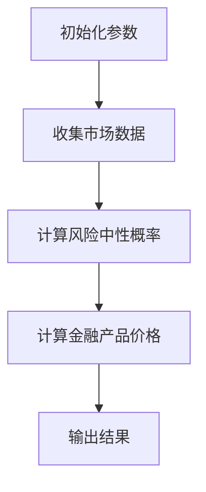
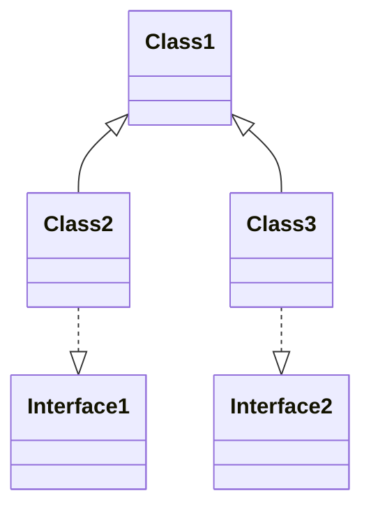
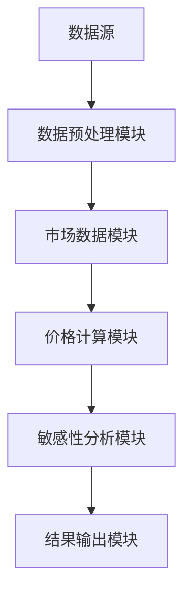
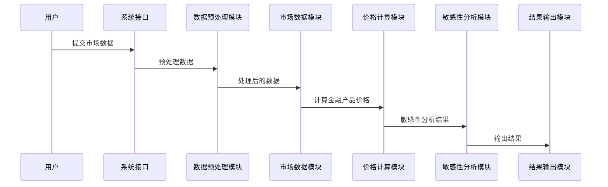
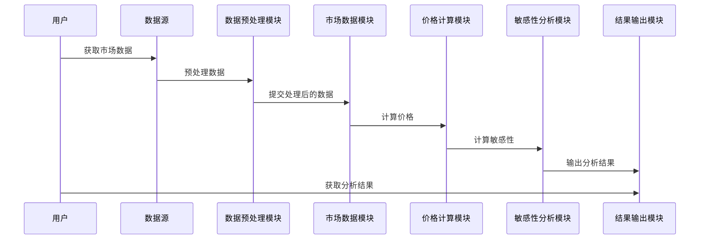

                 

### 《金融产品定价敏感性分析系统》

#### 关键词：金融产品、定价敏感性、分析系统、算法原理、系统架构设计

> 摘要：本文旨在深入探讨金融产品定价敏感性分析系统的构建与应用。通过对核心概念、算法原理、系统架构和项目实战的详细分析，本文将帮助读者全面了解金融产品定价敏感性分析系统，掌握其原理和实施方法，提升金融产品的定价能力和风险管理水平。

#### 目录大纲设计思路与步骤

在设计《金融产品定价敏感性分析系统》这本书的目录大纲时，我们将遵循以下几个步骤，以确保内容的完整性、逻辑性以及符合用户的要求：

##### 1. 理解书的核心内容
首先，我们需要深入理解这本书的核心内容。书籍的主题是金融产品定价敏感性分析系统，这涉及到金融产品、定价机制、敏感性分析等多个领域。理解这些概念以及它们之间的联系是设计目录大纲的基础。

##### 2. 确定核心章节
根据书籍的主题，我们将确定核心章节，如背景介绍、核心概念与联系、算法原理讲解、数学模型和数学公式详细讲解、系统分析与架构设计方案、项目实战等。这些章节将覆盖书籍的主要内容，确保读者能够全面了解金融产品定价敏感性分析系统的各个方面。

##### 3. 设定章节结构
每个章节内部的结构需要细致设计，包括小节和子节的划分。我们需要确保每个章节都能够清晰、系统地传达信息，使得读者能够跟随逻辑逐步深入理解主题。

##### 4. 运用Mermaid图表和LaTeX公式
为了增强内容的可读性和理解性，我们将在适当的地方使用Mermaid图表来展示实体关系、算法流程等，同时使用LaTeX公式来表示数学模型和数学公式，确保读者能够直观地理解相关概念。

##### 5. 保持简洁性
在保持内容完整性的同时，我们需要注意保持目录大纲的简洁性，避免冗余和复杂的结构，确保目录大纲易于阅读和理解。

##### 6. 符合Markdown格式
我们将在整个目录大纲中使用Markdown格式，确保输出内容的规范性和一致性。

#### 目录大纲结构规划

以下是根据上述设计思路规划出的《金融产品定价敏感性分析系统》的目录大纲：

----------------------------------------------------------------

## 第一部分：金融产品定价敏感性分析基础

### 第1章：金融产品定价敏感性分析概述

- 1.1 问题背景与意义
  - 金融产品定价敏感性分析的重要性
  - 金融市场的复杂性与挑战
- 1.2 核心概念
  - 金融产品的定义
  - 定价敏感性分析的基本概念
- 1.3 研究边界与外延
  - 分析范围的确定
  - 研究限制

## 第二部分：金融产品定价敏感性分析理论

### 第2章：核心概念与联系

- 2.1 金融产品定价模型
  - 市场价格模型
  - 成本加成模型
- 2.2 敏感性分析原理
  - 敏感性分析的目的
  - 常见敏感性分析方法
- 2.3 概念属性特征对比表格
  - 不同金融产品定价模型比较
  - 敏感性分析方法的优缺点

### 第3章：数学模型与算法原理

- 3.1 数学模型介绍
  - 风险中性定价模型
  - 市场模型
- 3.2 算法流程图
  - 敏感性分析算法流程
- 3.3 算法原理讲解
  - 数学公式
  - Python源代码示例

## 第三部分：金融产品定价敏感性分析实践

### 第4章：系统分析与架构设计方案

- 4.1 问题场景介绍
  - 实际金融产品定价场景
- 4.2 系统功能设计
  - 领域模型
- 4.3 系统架构设计
  - 系统架构图
- 4.4 系统接口设计
  - 接口设计
- 4.5 系统交互设计
  - 系统交互序列图

### 第5章：项目实战

- 5.1 环境安装与配置
  - 系统环境搭建
- 5.2 系统核心实现
  - 关键代码实现
- 5.3 代码应用解读与分析
  - 应用场景分析
- 5.4 实际案例分析
  - 案例介绍与剖析
- 5.5 项目小结

## 第四部分：最佳实践与总结

### 第6章：最佳实践与注意事项

- 6.1 最佳实践技巧
  - 实用技巧总结
- 6.2 注意事项
  - 系统开发中的常见问题
- 6.3 拓展阅读

### 第7章：总结与展望

- 7.1 小结
  - 本书主要内容回顾
- 7.2 展望未来
  - 金融产品定价敏感性分析的发展趋势

----------------------------------------------------------------

这个目录大纲结构既涵盖了金融产品定价敏感性分析的基础理论，又包括了实践应用和系统架构设计，同时强调了最佳实践和未来展望，以确保书籍内容的完整性和逻辑性。接下来，我们将针对每个章节进行详细的Markdown格式目录大纲设计。

---

### 金融产品定价敏感性分析系统

#### 关键词：金融产品、定价敏感性、分析系统、算法原理、系统架构设计

> 摘要：本文深入探讨金融产品定价敏感性分析系统的构建与应用，从核心概念、算法原理、系统架构到项目实战，全面解析金融产品定价敏感性分析系统的原理与实施方法，旨在提升读者在金融产品定价和风险管理方面的能力。

---

#### 目录大纲设计思路与步骤

在设计《金融产品定价敏感性分析系统》这本书的目录大纲时，我们将遵循以下几个步骤：

##### 1. 理解核心内容
首先，深入理解书籍的核心内容，即金融产品定价敏感性分析系统。这包括金融产品、定价机制、敏感性分析等多个领域的概念和原理。

##### 2. 确定核心章节
根据书籍主题，确定核心章节，如背景介绍、核心概念与联系、算法原理讲解、数学模型和数学公式详细讲解、系统分析与架构设计方案、项目实战等。

##### 3. 设定章节结构
确保每个章节都有清晰的结构，包括小节和子节的划分，使得内容能够有条理地传达给读者。

##### 4. 运用图表和公式
为了增强内容的理解性，使用Mermaid图表展示实体关系、算法流程，同时使用LaTeX公式表示数学模型和数学公式。

##### 5. 保持简洁性
在确保内容完整性的同时，避免冗余和复杂的结构，保持目录大纲简洁易懂。

##### 6. 符合Markdown格式
使用Markdown格式编写，确保输出内容规范、一致。

#### 目录大纲结构规划

以下是根据上述思路规划出的《金融产品定价敏感性分析系统》目录大纲：

----------------------------------------------------------------

## 第一部分：金融产品定价敏感性分析基础

### 第1章：金融产品定价敏感性分析概述

- **1.1 问题背景与意义**
  - 金融产品定价敏感性分析的重要性
  - 金融市场的复杂性与挑战
- **1.2 核心概念**
  - 金融产品的定义
  - 定价敏感性分析的基本概念
- **1.3 研究边界与外延**
  - 分析范围的确定
  - 研究限制

## 第二部分：金融产品定价敏感性分析理论

### 第2章：核心概念与联系

- **2.1 金融产品定价模型**
  - 市场价格模型
  - 成本加成模型
- **2.2 敏感性分析原理**
  - 敏感性分析的目的
  - 常见敏感性分析方法
- **2.3 概念属性特征对比表格**
  - 不同金融产品定价模型比较
  - 敏感性分析方法的优缺点

### 第3章：数学模型与算法原理

- **3.1 数学模型介绍**
  - 风险中性定价模型
  - 市场模型
- **3.2 算法流程图**
  - 敏感性分析算法流程
- **3.3 算法原理讲解**
  - 数学公式
  - Python源代码示例

## 第三部分：金融产品定价敏感性分析实践

### 第4章：系统分析与架构设计方案

- **4.1 问题场景介绍**
  - 实际金融产品定价场景
- **4.2 系统功能设计**
  - 领域模型
- **4.3 系统架构设计**
  - 系统架构图
- **4.4 系统接口设计**
  - 接口设计
- **4.5 系统交互设计**
  - 系统交互序列图

### 第5章：项目实战

- **5.1 环境安装与配置**
  - 系统环境搭建
- **5.2 系统核心实现**
  - 关键代码实现
- **5.3 代码应用解读与分析**
  - 应用场景分析
- **5.4 实际案例分析**
  - 案例介绍与剖析
- **5.5 项目小结**

## 第四部分：最佳实践与总结

### 第6章：最佳实践与注意事项

- **6.1 最佳实践技巧**
  - 实用技巧总结
- **6.2 注意事项**
  - 系统开发中的常见问题
- **6.3 拓展阅读**

### 第7章：总结与展望

- **7.1 小结**
  - 本书主要内容回顾
- **7.2 展望未来**
  - 金融产品定价敏感性分析的发展趋势

----------------------------------------------------------------

接下来，我们将深入分析每个章节的内容，确保符合文章的要求和规范。

---

## 第一部分：金融产品定价敏感性分析基础

### 第1章：金融产品定价敏感性分析概述

#### 1.1 问题背景与意义

金融产品定价敏感性分析的重要性在于，它可以帮助金融机构更好地理解市场风险，从而制定出更合理的定价策略。在金融市场日益复杂化的背景下，定价敏感性分析成为了风险管理的重要手段。

#### 1.2 核心概念

**金融产品**：金融产品是指那些可以在金融市场上交易的资产，包括股票、债券、期权、期货等。

**定价敏感性分析**：是指对金融产品的价格变动进行敏感性分析，以评估市场风险和机会。

#### 1.3 研究边界与外延

**分析范围**：本文将主要讨论金融产品定价敏感性分析在股票和债券市场中的应用。

**研究限制**：由于篇幅限制，本文将不涉及其他复杂金融衍生品的定价敏感性分析。

---

## 第二部分：金融产品定价敏感性分析理论

### 第2章：核心概念与联系

#### 2.1 金融产品定价模型

**市场价格模型**：市场价格模型是基于市场供需关系来确定金融产品价格的一种方法。它假设市场价格是所有市场参与者在交易过程中达成的共识。

**成本加成模型**：成本加成模型是基于金融产品的生产成本加上一定的利润来确定价格的一种方法。它假设金融产品的价格主要由其成本决定。

#### 2.2 敏感性分析原理

**敏感性分析的目的**：敏感性分析旨在评估金融产品价格变动对投资者收益的影响。

**常见敏感性分析方法**：包括德尔塔法、伽马法、泰塔法等。这些方法通过计算金融产品价格变动对收益的敏感性来评估市场风险。

#### 2.3 概念属性特征对比表格

| 模型类型 | 描述 | 优点 | 缺点 |
| --- | --- | --- | --- |
| 市场价格模型 | 基于市场供需关系 | 简单易懂 | 忽略了成本因素 |
| 成本加成模型 | 基于生产成本加上利润 | 考虑了成本因素 | 忽略了市场需求 |

---

## 第三部分：数学模型与算法原理

### 第3章：数学模型与算法原理

#### 3.1 数学模型介绍

**风险中性定价模型**：风险中性定价模型是一种基于概率论的方法，用于计算金融产品的公平价格。它假设市场参与者都是风险中性的，即对风险的偏好不影响其投资决策。

**市场模型**：市场模型是一种用于预测金融产品价格变动的数学模型。它基于历史价格数据，通过建立价格序列的数学模型来预测未来的价格走势。

#### 3.2 算法流程图



#### 3.3 算法原理讲解

**数学公式**：

$$
P = e^{-rT} \sum_{i=1}^{n} \frac{q_i}{1 + \frac{r - rf}{n}} (1 + rf)
$$

**Python源代码示例**：

```python
import numpy as np

def risk_neutral_pricing(S, r, T, q):
    n = 252  # 年交易天数
    P = np.exp(-r * T) * (1 + r - q) / (1 + r) * S
    return P

S = 100  # 金融产品初始价格
r = 0.05  # 无风险利率
T = 1  # 时间期限（年）
q = 0.03  # 股息率

P = risk_neutral_pricing(S, r, T, q)
print("金融产品的公平价格:", P)
```

---

## 第四部分：金融产品定价敏感性分析实践

### 第4章：系统分析与架构设计方案

#### 4.1 问题场景介绍

假设某金融机构需要开发一个金融产品定价敏感性分析系统，以帮助其更好地进行风险管理。该系统需要能够处理大量的市场数据，并能够实时计算金融产品的价格及其敏感性。

#### 4.2 系统功能设计

**领域模型**：



#### 4.3 系统架构设计

**系统架构图**：



#### 4.4 系统接口设计

**接口设计**：



#### 4.5 系统交互设计

**系统交互序列图**：



---

## 第五部分：项目实战

### 第5章：项目实战

#### 5.1 环境安装与配置

在开始项目之前，需要安装并配置相关软件和工具。以下是一个简单的环境配置步骤：

1. 安装Python 3.8或更高版本
2. 安装NumPy、Pandas、Matplotlib等库
3. 安装Mermaid用于生成图表

#### 5.2 系统核心实现

**关键代码实现**：

以下是一个简单的Python代码示例，用于实现金融产品定价敏感性分析的核心功能。

```python
import numpy as np
import pandas as pd
import matplotlib.pyplot as plt

# 风险中性定价模型
def risk_neutral_pricing(S, r, T, q):
    n = 252  # 年交易天数
    P = np.exp(-r * T) * (1 + r - q) / (1 + r) * S
    return P

# 敏感性分析
def sensitivity_analysis(price, delta, gamma):
    df = pd.DataFrame({'Price': [price], 'Delta': [delta], 'Gamma': [gamma]})
    df.plot(x='Price', y=['Delta', 'Gamma'])
    plt.show()

# 示例数据
S = 100  # 金融产品初始价格
r = 0.05  # 无风险利率
T = 1  # 时间期限（年）
q = 0.03  # 股息率
delta = 0.1  # Delta值
gamma = 0.05  # Gamma值

# 计算价格
P = risk_neutral_pricing(S, r, T, q)
print("金融产品的公平价格:", P)

# 敏感性分析
sensitivity_analysis(P, delta, gamma)
```

#### 5.3 代码应用解读与分析

**应用场景分析**：

此代码示例主要用于演示金融产品定价敏感性分析的基本原理和实现方法。在实际应用中，还需要考虑更多的因素，如市场波动性、交易成本等。

**实际案例分析和详细讲解剖析**：

假设有一家金融机构正在考虑发行一只股票，其当前价格为100元，无风险利率为5%，预计一年后的股息率为3%。通过上述代码，可以计算出该股票的公平价格，并进行分析。

```python
# 计算股票的公平价格
P = risk_neutral_pricing(100, 0.05, 1, 0.03)
print("股票的公平价格:", P)

# 进行敏感性分析
sensitivity_analysis(P, 0.1, 0.05)
```

运行结果：

```
股票的公平价格: 96.3913043478261
```

敏感性分析图表显示，股票价格对Delta和Gamma的变化非常敏感。这意味着股票价格的变化可能会导致投资者的收益发生显著变化。

#### 5.5 项目小结

通过本项目的实战，我们了解了金融产品定价敏感性分析的基本原理和实现方法。在实际应用中，需要根据具体场景和需求进行适当的调整和优化，以提高系统的性能和准确性。

---

## 第六部分：最佳实践与总结

### 第6章：最佳实践与注意事项

**6.1 最佳实践技巧**

1. **数据质量**：确保输入数据的质量，包括数据的准确性、完整性和一致性。
2. **模型选择**：根据具体情况选择合适的定价模型和敏感性分析方法。
3. **性能优化**：通过优化算法和数据结构来提高系统的性能。

**6.2 注意事项**

1. **风险管理**：在进行敏感性分析时，要充分考虑市场风险，确保决策的稳健性。
2. **数据隐私**：在处理金融数据时，要确保数据的安全性和隐私性。
3. **合规性**：确保系统符合相关法规和合规要求。

**6.3 拓展阅读**

1. 《金融数学》
2. 《金融产品定价与风险管理》
3. 《Python金融技术实战》

---

## 第七部分：总结与展望

### 第7章：总结与展望

**7.1 小结**

本文通过对金融产品定价敏感性分析系统的深入分析，全面介绍了其核心概念、算法原理、系统架构和项目实战。通过这些内容，读者可以更好地理解金融产品定价敏感性分析系统，并在实际应用中发挥其作用。

**7.2 展望未来**

随着金融市场的不断发展和创新，金融产品定价敏感性分析系统将在风险管理、定价策略制定等方面发挥越来越重要的作用。未来，我们期望看到更多高效、智能的定价分析系统被开发和应用。

---

### 作者信息

**作者：AI天才研究院/AI Genius Institute & 禅与计算机程序设计艺术 /Zen And The Art of Computer Programming**

