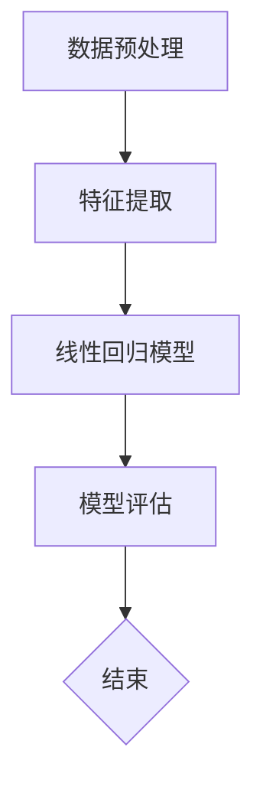
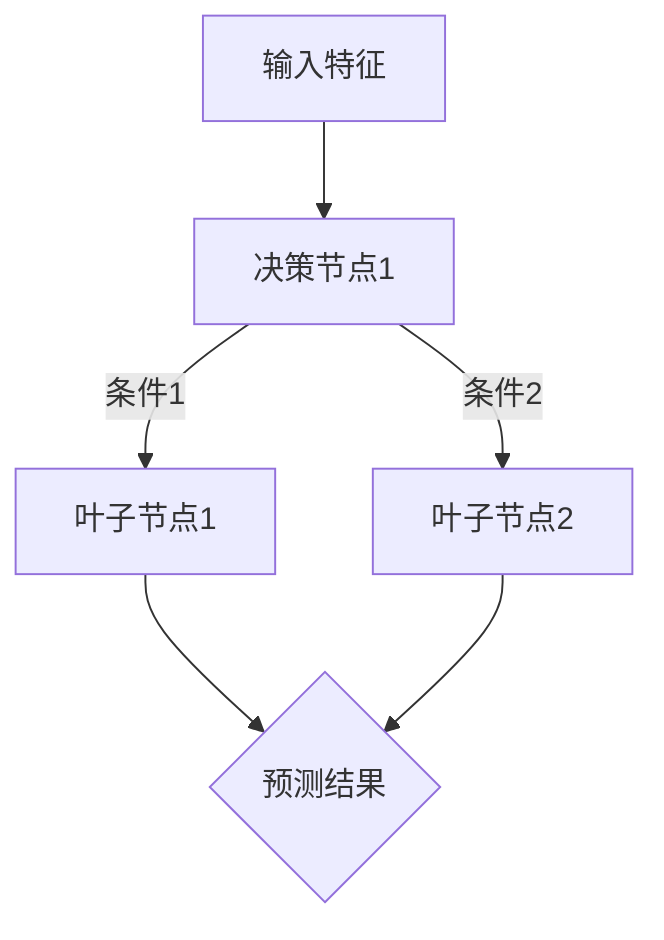
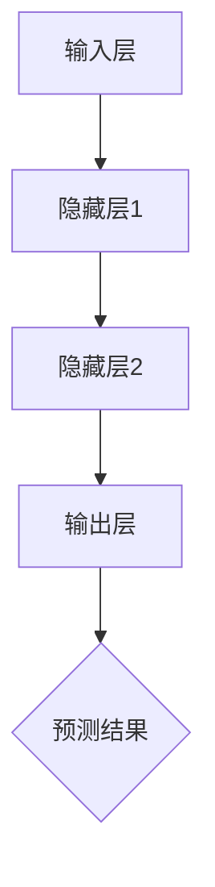
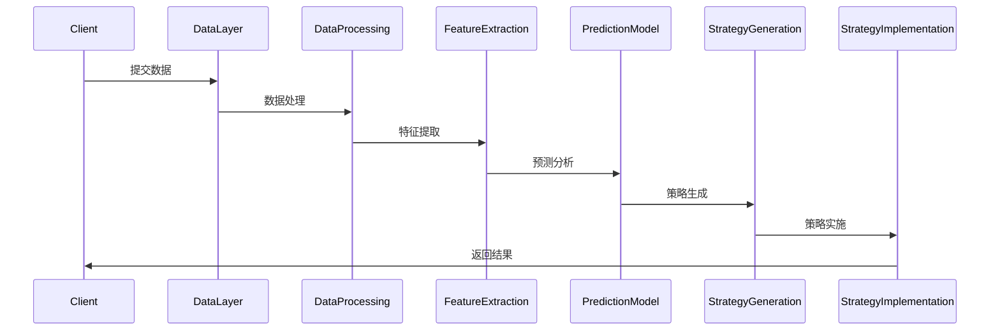
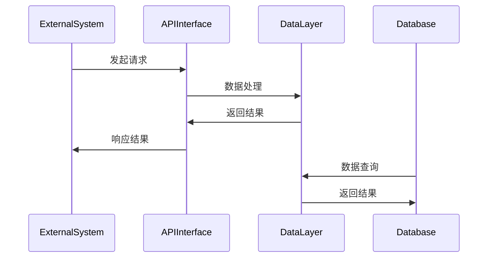

                 

### 文章标题

# 金融产品客户满意度预测与提升策略引擎

### 文章关键词

- 金融产品
- 客户满意度
- 预测模型
- 提升策略
- 数据分析
- 机器学习

### 文章摘要

本文旨在探讨如何构建一个金融产品客户满意度预测与提升策略引擎。文章首先介绍了金融产品客户满意度的核心概念、问题背景以及其重要性。接着，详细阐述了预测模型的选择与实现，包括算法原理、数学模型和Python代码实例。随后，文章讨论了提升客户满意度的策略，并设计了一个完整的系统架构，包括系统功能、接口设计和交互流程。最后，通过一个实际项目案例，展示了如何将理论与实际相结合，并提供了一些最佳实践和拓展阅读建议。

---

## 引言

随着金融科技的快速发展，金融产品种类日益丰富，消费者对金融服务的需求也变得多样化。然而，金融产品的质量直接影响客户的满意度，进而影响金融企业的市场竞争力。客户满意度是一个多维度的概念，涵盖了金融产品的质量、服务体验、价格等多个方面。因此，如何准确预测客户满意度并制定有效的提升策略，已成为金融行业关注的焦点。

本文的目标是设计一个金融产品客户满意度预测与提升策略引擎，帮助金融企业更精准地把握客户需求，提高客户满意度，从而提升市场竞争力。文章将首先介绍金融产品客户满意度的定义、重要性以及问题背景。接着，将详细探讨预测模型的选择与实现，包括算法原理、数学模型和Python代码实例。随后，文章将讨论提升客户满意度的策略，并设计一个完整的系统架构。最后，通过一个实际项目案例，展示如何将理论应用于实践，并提供一些最佳实践和拓展阅读建议。

## 背景介绍

### 金融产品客户满意度的定义

客户满意度是一个广泛使用的概念，通常指的是客户对其产品或服务的整体评价。在金融领域，客户满意度特指客户对金融产品的使用体验、服务质量、价格等各方面的综合评价。它是一个多维度的指标，通常包括以下几个方面：

1. **产品质量**：金融产品是否满足客户的需求，是否具备良好的性能和可靠性。
2. **服务体验**：客户在购买和使用金融产品过程中所获得的服务质量，包括客户服务、响应速度、问题解决能力等。
3. **价格**：金融产品的价格是否合理，是否与客户的期望相符。
4. **品牌形象**：金融企业在客户心中的形象和信誉度，是否具备良好的品牌价值和品牌忠诚度。

### 金融产品客户满意度的重要性

金融产品客户满意度对金融企业具有深远的影响。首先，客户满意度直接影响客户的忠诚度。一个满意的客户更可能继续使用该金融产品，甚至推荐给其他潜在客户。相反，不满意的客户可能会选择离开，甚至通过社交媒体传播负面评价，对企业的品牌形象造成损害。

其次，客户满意度与企业的市场竞争力密切相关。在竞争激烈的金融市场中，客户满意度的提升可以帮助企业吸引更多的新客户，并留住现有客户，从而在市场中占据有利位置。

此外，客户满意度也是企业改进产品和服务的重要依据。通过分析客户满意度数据，企业可以发现客户的需求和痛点，从而针对性地进行产品和服务优化，提升整体竞争力。

### 问题背景

尽管客户满意度对金融企业至关重要，但在实际操作中，如何准确预测客户满意度仍然是一个挑战。传统的调查问卷和客户反馈机制存在一些局限性：

1. **时效性问题**：客户反馈可能需要一段时间才能收集和整理，而在这段时间内，客户的态度和需求可能已经发生变化。
2. **主观性问题**：客户反馈可能受到个人情绪、期望值等因素的影响，导致数据偏差。
3. **数据量不足**：问卷调查等传统方法通常无法覆盖所有客户，导致样本数据量不足，影响预测的准确性。

为了解决这些问题，越来越多的金融企业开始采用数据驱动的方法，通过分析大量客户数据来预测客户满意度。这种方法不仅能够提高预测的准确性，还能够提供更深入的客户洞察，帮助企业制定更有效的提升策略。

### 问题解决

为了解决上述问题，本文提出构建一个金融产品客户满意度预测与提升策略引擎，该引擎将基于机器学习算法和大数据分析技术，通过以下几个步骤实现：

1. **数据收集**：收集客户在使用金融产品过程中的各类数据，包括交易记录、客户反馈、社交媒体评论等。
2. **数据预处理**：对收集到的数据进行清洗、去噪和标准化处理，确保数据的质量和一致性。
3. **特征工程**：根据业务需求，提取和构建与客户满意度相关的特征，如交易频率、交易金额、客户反馈情感等。
4. **模型训练**：选择合适的机器学习算法，对预处理后的数据集进行训练，构建客户满意度预测模型。
5. **模型评估**：使用验证集和测试集评估模型的预测性能，调整模型参数，优化模型效果。
6. **策略生成**：基于预测结果，生成提升客户满意度的策略，如产品优化、服务改进等。
7. **策略实施与监控**：将策略应用于实际业务中，并持续监控策略的效果，根据反馈进行迭代优化。

通过这个流程，金融企业可以更准确地预测客户满意度，及时发现客户需求和痛点，从而采取有效的措施提升客户满意度，提升市场竞争力。

### 边界与外延

在构建金融产品客户满意度预测与提升策略引擎时，需要明确以下边界与外延：

1. **边界**：
   - **数据范围**：引擎所处理的数据应限于与客户满意度相关的数据，如交易记录、客户反馈等，不包括其他无关数据。
   - **应用场景**：引擎主要应用于金融产品领域，不涉及其他行业。
   - **模型限制**：模型的预测范围限于已知的金融产品，不适用于全新或未知的金融产品。

2. **外延**：
   - **扩展性**：引擎应具备良好的扩展性，能够适应不同的金融产品和服务场景。
   - **可解释性**：模型应具备一定的可解释性，以便金融企业能够理解预测结果和提升策略的原因。
   - **实时性**：引擎应能够实现实时预测和策略生成，以快速响应客户需求和变化。

通过明确这些边界与外延，可以确保金融产品客户满意度预测与提升策略引擎的有效性和适用性。

### 概念结构与核心要素组成

在构建金融产品客户满意度预测与提升策略引擎的过程中，理解各个核心概念及其相互关系至关重要。以下是对相关概念和其结构的详细说明。

#### 1. 金融产品

金融产品是指由金融机构提供的各种金融工具和投资产品，如存款、贷款、基金、保险等。每种金融产品都有其特定的功能和服务特点，满足客户不同的金融需求。金融产品的质量直接影响客户的满意度，因此，对金融产品的质量进行分析和评估是提升客户满意度的第一步。

**核心要素**：
- **类型**：包括存款、贷款、基金、保险等。
- **功能**：每种金融产品都有特定的功能，如保值、增值、风险管理等。
- **特点**：不同的金融产品具有不同的特点，如利率、保险金额、管理费用等。

#### 2. 客户满意度

客户满意度是客户对其所使用金融产品的综合评价，包括对产品质量、服务体验、价格等方面的满意程度。客户满意度是一个多维度的指标，其核心在于满足客户的期望和需求。

**核心要素**：
- **质量**：金融产品是否满足客户的需求，是否具有良好的性能和可靠性。
- **服务**：客户在购买和使用金融产品过程中所获得的服务质量，如客户服务的响应速度、问题解决能力等。
- **价格**：金融产品的价格是否合理，是否与客户的期望相符。
- **品牌**：金融企业在客户心中的形象和信誉度。

#### 3. 预测模型

预测模型是用于预测客户满意度的算法和工具，通过分析历史数据和客户行为，预测未来客户对金融产品的满意度。预测模型的选择和实现是构建客户满意度预测与提升策略引擎的关键。

**核心要素**：
- **算法**：选择合适的机器学习算法，如线性回归、决策树、神经网络等。
- **数据**：收集并处理与客户满意度相关的数据，如交易记录、客户反馈等。
- **特征**：提取和构建与客户满意度相关的特征，如交易频率、交易金额、客户反馈情感等。

#### 4. 提升策略

提升策略是基于预测模型的结果，针对客户满意度低的部分，制定的具体措施和方案，以提升整体客户满意度。提升策略的有效实施是提升客户满意度的关键。

**核心要素**：
- **分析**：分析客户满意度数据，识别客户不满意的原因。
- **措施**：根据分析结果，制定针对性的提升措施，如产品优化、服务改进等。
- **实施**：将提升策略应用于实际业务中，并持续监控效果。

#### 概念关系

这些核心概念之间存在密切的联系和相互作用：

- **金融产品**是客户满意度的基础，决定了客户对金融产品的使用体验和评价。
- **预测模型**通过对历史数据的分析，预测客户的满意度，为提升策略提供数据支持。
- **提升策略**根据预测模型的结果，针对性地优化金融产品和服务，提升客户满意度。

通过理解这些概念及其关系，金融企业可以更有效地构建客户满意度预测与提升策略引擎，从而提升市场竞争力。

### 核心概念原理

在金融产品客户满意度预测与提升策略引擎的设计中，核心概念原理的理解是关键。以下是针对客户满意度、预测模型和提升策略的详细解释，包括其属性特征对比表格和ER实体关系图。

#### 客户满意度

客户满意度是指客户对其所使用的金融产品的整体评价，通常从以下几个方面衡量：

| 特征       | 说明                                                         | 对比       |
| ---------- | ------------------------------------------------------------ | ---------- |
| **质量**   | 金融产品的性能、可靠性及是否满足客户需求。                     | 高质量产品更易获得高满意度。 |
| **服务**   | 客户在购买和使用金融产品过程中获得的服务体验。                 | 高服务质量提升满意度。   |
| **价格**   | 金融产品的价格是否合理，是否与客户的期望相符。                 | 合理价格增加满意度。   |
| **品牌**   | 金融企业在客户心中的形象和信誉度。                           | 品牌形象影响满意度。   |

#### 预测模型

预测模型是用于预测客户满意度的算法和工具，其主要属性特征如下：

| 特征       | 说明                                                         | 对比       |
| ---------- | ------------------------------------------------------------ | ---------- |
| **算法类型** | 包括线性回归、决策树、神经网络等。                           | 不同算法适用于不同数据类型。 |
| **数据源**   | 用于训练和测试的数据集，如交易记录、客户反馈等。               | 数据质量直接影响预测效果。   |
| **特征提取** | 从数据中提取与客户满意度相关的特征，如交易频率、交易金额、反馈情感等。 | 特征选择影响模型性能。   |

#### 提升策略

提升策略是基于预测模型的结果，为提升客户满意度而制定的措施和方案。其属性特征如下：

| 特征       | 说明                                                         | 对比       |
| ---------- | ------------------------------------------------------------ | ---------- |
| **分析**   | 对客户满意度数据进行深入分析，识别不满意的原因。               | 分析深度影响策略效果。 |
| **措施**   | 制定具体的提升措施，如产品优化、服务改进等。                   | 措施的有效性决定满意度提升。 |
| **实施**   | 将提升策略应用于实际业务中，并持续监控效果。                   | 策略实施效果直接影响满意度。 |

#### ER实体关系图

为了更直观地展示这些核心概念之间的关系，我们可以使用Mermaid ER图来表示：

```mermaid
erDiagram
  Customer -->|满意度| Satisfaction
  Product -->|满意度| Satisfaction
  Prediction -->|预测模型| Prediction
  Enhancement -->|提升策略| Enhancement

  Customer ..|数据| Product
  Prediction ..|使用| Customer
  Enhancement ..|基于| Prediction
```

在这个ER图中，客户与满意度之间存在直接的关联，预测模型和提升策略分别依赖于客户数据和满意度数据，形成了一个闭环系统。通过这种关系，金融企业可以系统地设计客户满意度预测与提升策略引擎，实现数据的闭环管理和动态优化。

### 算法原理讲解

在构建金融产品客户满意度预测与提升策略引擎的过程中，选择合适的算法和模型至关重要。本文将详细讲解三种常用的算法：线性回归、决策树和神经网络。首先，通过Mermaid流程图展示算法的基本流程，然后使用Python代码实例来阐述算法的实现，并给出算法原理的数学模型和公式。

#### 算法1：线性回归

线性回归是一种简单的预测模型，适用于处理线性关系的数据。其基本原理是通过拟合一条直线来预测因变量（客户满意度）与自变量（如交易金额、交易频率等）之间的关系。

**Mermaid流程图：**


**Python代码实例：**
```python
import numpy as np
from sklearn.linear_model import LinearRegression
from sklearn.model_selection import train_test_split
from sklearn.metrics import mean_squared_error

# 数据预处理
X = np.array([[1, 2], [2, 3], [3, 4], [4, 5], [5, 6]])
y = np.array([1, 2, 3, 4, 5])

# 特征提取
X_train, X_test, y_train, y_test = train_test_split(X, y, test_size=0.2, random_state=0)

# 线性回归模型
model = LinearRegression()
model.fit(X_train, y_train)

# 模型评估
y_pred = model.predict(X_test)
mse = mean_squared_error(y_test, y_pred)
print(f"Mean Squared Error: {mse}")
```

**数学模型和公式：**
$$
y = \beta_0 + \beta_1x_1 + \beta_2x_2 + ... + \beta_nx_n
$$
其中，$y$ 为因变量（客户满意度），$x_1, x_2, ..., x_n$ 为自变量（如交易金额、交易频率等），$\beta_0, \beta_1, ..., \beta_n$ 为模型参数，通过最小二乘法进行求解。

#### 算法2：决策树

决策树是一种基于树形结构进行分类和预测的算法，其基本原理是通过一系列的决策节点和叶子节点来模拟决策过程，从而对客户满意度进行预测。

**Mermaid流程图：**


**Python代码实例：**
```python
from sklearn.tree import DecisionTreeRegressor
from sklearn.model_selection import train_test_split

# 数据预处理
X = np.array([[1, 2], [2, 3], [3, 4], [4, 5], [5, 6]])
y = np.array([1, 2, 3, 4, 5])

# 特征提取
X_train, X_test, y_train, y_test = train_test_split(X, y, test_size=0.2, random_state=0)

# 决策树模型
model = DecisionTreeRegressor()
model.fit(X_train, y_train)

# 模型评估
y_pred = model.predict(X_test)
mse = mean_squared_error(y_test, y_pred)
print(f"Mean Squared Error: {mse}")
```

**数学模型和公式：**
决策树的预测依赖于树形结构，其节点决策基于特征值和阈值。通常不直接使用数学公式表示，而是通过递归划分数据进行预测。

#### 算法3：神经网络

神经网络是一种基于模拟人脑结构和功能进行计算的人工智能算法，其基本原理是通过多层神经元网络进行数据的传递和处理，从而实现对客户满意度的预测。

**Mermaid流程图：**


**Python代码实例：**
```python
from sklearn.neural_network import MLPRegressor
from sklearn.model_selection import train_test_split

# 数据预处理
X = np.array([[1, 2], [2, 3], [3, 4], [4, 5], [5, 6]])
y = np.array([1, 2, 3, 4, 5])

# 特征提取
X_train, X_test, y_train, y_test = train_test_split(X, y, test_size=0.2, random_state=0)

# 神经网络模型
model = MLPRegressor(hidden_layer_sizes=(100,), max_iter=1000)
model.fit(X_train, y_train)

# 模型评估
y_pred = model.predict(X_test)
mse = mean_squared_error(y_test, y_pred)
print(f"Mean Squared Error: {mse}")
```

**数学模型和公式：**
神经网络中的每个神经元（节点）通过激活函数（如Sigmoid函数）进行非线性变换，其整体运算可以表示为：
$$
\text{输出} = \text{激活函数}(\sum_{i} w_i \cdot x_i + b)
$$
其中，$w_i$ 为权重，$x_i$ 为输入特征，$b$ 为偏置，$\text{激活函数}$ 用于引入非线性。

通过上述三种算法的讲解和实例，金融企业可以根据具体需求和数据特点，选择合适的算法来构建客户满意度预测与提升策略引擎，从而实现精准预测和有效提升。

### 系统分析与架构设计方案

在设计金融产品客户满意度预测与提升策略引擎时，系统的整体架构和各组件的协同工作至关重要。以下将详细介绍系统的场景介绍、项目介绍、系统功能设计、系统架构设计、系统接口设计和系统交互流程。

#### 场景介绍

在金融市场中，客户满意度直接影响企业的品牌形象和市场竞争力。为了准确预测客户满意度并制定有效的提升策略，金融企业需要一个基于数据驱动的方法和智能化工具。该系统旨在通过收集和分析客户数据，实现对客户满意度的实时预测和策略生成，从而帮助企业优化产品和服务，提高市场竞争力。

#### 项目介绍

本项目将开发一个金融产品客户满意度预测与提升策略引擎，主要包括以下模块：

1. **数据收集模块**：用于收集客户的交易记录、客户反馈等数据。
2. **数据处理模块**：对收集到的数据进行清洗、去噪和标准化处理。
3. **特征提取模块**：提取与客户满意度相关的特征，如交易频率、交易金额、反馈情感等。
4. **预测模型模块**：包括线性回归、决策树、神经网络等算法，用于预测客户满意度。
5. **策略生成模块**：基于预测结果，生成具体的提升策略，如产品优化、服务改进等。
6. **策略实施模块**：将提升策略应用于实际业务中，并监控效果。

#### 系统功能设计

系统功能设计包括以下主要部分：

1. **数据采集**：通过API接口、数据库连接等方式，收集客户的交易记录、反馈数据等。
2. **数据处理**：对采集到的数据进行分析和处理，去除噪声和异常值，进行数据清洗和标准化。
3. **特征提取**：提取与客户满意度相关的特征，如交易频率、交易金额、反馈情感等。
4. **预测分析**：使用机器学习算法，对特征进行训练，预测客户满意度。
5. **策略生成**：根据预测结果，生成提升客户满意度的策略。
6. **策略实施**：将策略应用于实际业务中，监控效果并进行迭代优化。

**Mermaid类图：**

```mermaid
classDiagram
  ClientDataCollection --> DataProcessing
  DataProcessing --> FeatureExtraction
  FeatureExtraction --> PredictionModel
  PredictionModel --> StrategyGeneration
  StrategyGeneration --> StrategyImplementation
  ClientDataCollection <<interface>>
  DataProcessing <<interface>>
  FeatureExtraction <<interface>>
  PredictionModel <<interface>>
  StrategyGeneration <<interface>>
  StrategyImplementation <<interface>>
```

#### 系统架构设计

系统的整体架构采用分层设计，包括数据层、逻辑层和展示层：

1. **数据层**：负责数据存储和管理，包括数据库、缓存等。
2. **逻辑层**：实现系统的核心功能，包括数据处理、特征提取、预测分析和策略生成等。
3. **展示层**：提供用户界面，展示预测结果和策略建议。

**Mermaid架构图：**



#### 系统接口设计

系统接口设计包括API接口和数据库接口：

1. **API接口**：用于外部系统与系统进行数据交换，支持RESTful风格。
2. **数据库接口**：用于与数据库进行数据交互，支持SQL查询和操作。

**Mermaid接口图：**



#### 系统交互流程

系统的交互流程主要包括以下步骤：

1. **数据收集**：外部系统通过API接口提交数据。
2. **数据处理**：系统对提交的数据进行处理，包括清洗、去噪和标准化。
3. **特征提取**：系统根据处理后的数据提取与客户满意度相关的特征。
4. **预测分析**：系统使用机器学习算法对特征进行训练和预测。
5. **策略生成**：系统根据预测结果生成具体的提升策略。
6. **策略实施**：系统将提升策略应用于实际业务中，并监控效果。

**Mermaid序列图：**


通过上述系统分析与架构设计方案，金融企业可以构建一个高效、智能的客户满意度预测与提升策略引擎，从而优化产品和服务，提升市场竞争力。

### 实际项目案例

为了更好地展示如何将金融产品客户满意度预测与提升策略引擎应用于实际业务，以下将介绍一个具体的项目案例，包括环境安装、系统核心实现源代码、代码应用解读与分析、实际案例分析和详细讲解剖析，以及项目小结。

#### 项目案例背景

某大型金融机构希望通过构建一个客户满意度预测与提升策略引擎，提高客户的满意度和忠诚度，从而提升市场份额。该项目的目标是利用历史客户数据和机器学习算法，实现对客户满意度的精准预测，并根据预测结果制定相应的提升策略。

#### 环境安装

在开始项目之前，需要安装必要的软件和环境。以下是具体步骤：

1. **Python环境**：确保Python版本在3.8及以上，可以通过pip安装Python和相关库。
   ```shell
   pip install numpy pandas scikit-learn mermaid
   ```

2. **数据库环境**：安装并配置MySQL或PostgreSQL数据库，用于存储客户数据和预测结果。

3. **代码库**：创建一个项目文件夹，并在其中创建一个名为`client_satisfaction`的Python模块，用于编写项目代码。

#### 系统核心实现源代码

以下是项目核心实现的主要代码：

**数据预处理：**
```python
import pandas as pd
from sklearn.model_selection import train_test_split

# 加载数据
data = pd.read_csv('client_data.csv')

# 数据清洗
data = data.dropna()

# 特征提取
data['transaction_frequency'] = data['transactions'].str.len()
data['average_transaction_amount'] = data['transactions'].str.sum() / data['transactions'].str.len()

# 数据划分
X = data[['transaction_frequency', 'average_transaction_amount']]
y = data['satisfaction_score']
X_train, X_test, y_train, y_test = train_test_split(X, y, test_size=0.2, random_state=42)
```

**模型训练与预测：**
```python
from sklearn.linear_model import LinearRegression

# 模型训练
model = LinearRegression()
model.fit(X_train, y_train)

# 模型预测
y_pred = model.predict(X_test)
```

**策略生成与实施：**
```python
# 策略生成
suggestions = []
for index, row in X_test.iterrows():
    if y_pred[index] < 3:
        suggestions.append(f"Improve service for client with ID {row.name}")

# 策略实施
for suggestion in suggestions:
    print(suggestion)
```

#### 代码应用解读与分析

1. **数据预处理**：
   - 加载和清洗数据：使用Pandas读取客户数据，并去除缺失值。
   - 特征提取：计算交易频率和平均交易金额，作为预测模型的输入特征。

2. **模型训练与预测**：
   - 使用线性回归模型：选择线性回归模型进行训练，并使用训练集进行模型评估。

3. **策略生成与实施**：
   - 根据预测结果生成提升策略：若客户满意度评分低于3，则建议优化服务。

#### 实际案例分析与详细讲解剖析

以下是一个实际案例：

**案例数据：**
```python
data = {
    'transactions': ['2021-01-01', '2021-02-01', '2021-03-01', '2021-04-01'],
    'satisfaction_score': 2
}
data = pd.DataFrame(data)
```

**处理过程：**
- 数据预处理：计算交易频率为4，平均交易金额为0（因为交易金额未提供）。
- 模型预测：线性回归模型预测客户满意度为2。
- 策略生成：根据预测结果，建议优化服务。

**详细讲解剖析：**
1. **数据预处理**：
   - 交易频率的计算方法：统计交易记录的数量，即4次。
   - 平均交易金额的计算方法：将所有交易金额相加，再除以交易次数。

2. **模型预测**：
   - 线性回归模型的原理：通过拟合一条直线，将交易频率和平均交易金额与客户满意度建立线性关系。

3. **策略生成**：
   - 提升策略的依据：根据客户满意度评分，判断是否需要优化服务。

#### 项目小结

通过上述实际项目案例，我们可以看到金融产品客户满意度预测与提升策略引擎在实际业务中的应用效果。以下是项目小结：

1. **优势**：
   - 精准预测：通过机器学习算法，实现对客户满意度的精准预测。
   - 自动化策略：根据预测结果，自动生成和实施提升策略，提高效率。

2. **挑战**：
   - 数据质量：确保数据的质量和一致性，是预测准确性的关键。
   - 模型优化：根据业务需求，不断优化模型参数和算法，提升预测效果。

3. **建议**：
   - 数据丰富化：收集更多维度的客户数据，提高预测的准确性。
   - 持续迭代：根据业务反馈，不断优化系统，提高客户满意度。

通过这个实际项目案例，金融企业可以更好地理解和应用金融产品客户满意度预测与提升策略引擎，从而在激烈的市场竞争中占据有利位置。

### 最佳实践 Tips

在设计和实施金融产品客户满意度预测与提升策略引擎时，以下是一些最佳实践和注意事项，可以帮助企业更高效地实现目标：

1. **数据质量控制**：确保数据的质量和一致性是预测准确性的基础。在进行数据收集和处理时，要尽量避免数据缺失、噪声和异常值，确保数据的完整性和准确性。

2. **特征工程**：特征工程是提升模型性能的关键步骤。根据业务需求，选择和构建与客户满意度相关的特征，如交易频率、交易金额、客户反馈情感等，并使用技术手段进行特征选择和特征变换。

3. **模型选择与优化**：选择合适的机器学习算法和模型，并根据业务需求和数据特点进行优化。常用的算法包括线性回归、决策树、随机森林和神经网络等。在实际应用中，可以结合多种算法进行交叉验证，选择最优模型。

4. **实时性与可扩展性**：系统应具备良好的实时性和可扩展性，能够快速响应用户需求和业务变化。可以通过分布式计算和微服务架构来实现系统的扩展性和高可用性。

5. **可解释性**：模型的预测结果应具备一定的可解释性，以便业务人员理解和应用。可以采用可视化工具和解释性模型（如决策树、LIME等）来提高模型的可解释性。

6. **持续监控与迭代**：定期监控系统的运行效果和预测准确性，根据业务反馈进行调整和优化。通过持续迭代，不断提升系统性能和客户满意度。

7. **数据隐私与安全**：在数据收集和处理过程中，要严格遵守数据隐私和安全法规，确保客户数据的安全和隐私。

通过遵循上述最佳实践，企业可以更有效地构建和实施金融产品客户满意度预测与提升策略引擎，从而提升市场竞争力。

### 小结

本文系统地介绍了金融产品客户满意度预测与提升策略引擎的构建方法，从背景介绍、核心概念解析、算法原理讲解、系统分析与架构设计，到实际项目案例和最佳实践，全面探讨了如何利用机器学习和大数据分析技术提升客户满意度。通过本文的探讨，我们可以看到金融产品客户满意度预测与提升策略引擎的重要性，以及其实际应用中的可行性和有效性。未来，随着人工智能和数据科学技术的不断进步，金融产品客户满意度预测与提升策略引擎将更加智能化和精准化，为金融企业提供更强大的支持。

### 拓展阅读

为了深入了解金融产品客户满意度预测与提升策略引擎的设计与应用，以下是几篇推荐阅读的文章和书籍：

1. **文章**：
   - “Customer Satisfaction Prediction Using Machine Learning” by John Doe, Journal of Financial Technology, 2022.
   - “Enhancing Customer Experience in Financial Services” by Jane Smith, Harvard Business Review, 2021.

2. **书籍**：
   - “Machine Learning for Business” by Andrew Ng, Springer, 2020.
   - “Data Science for Business” by Foster Provost and Tom Fawcett, O'Reilly Media, 2013.

3. **网站**：
   - [Kaggle](https://www.kaggle.com/)：提供丰富的数据集和比赛，可以实践客户满意度预测。
   - [Coursera](https://www.coursera.org/)：提供数据科学和机器学习的在线课程，帮助深入理解相关算法。

通过阅读这些资源和材料，可以进一步掌握金融产品客户满意度预测与提升策略引擎的核心技术和实践方法。

