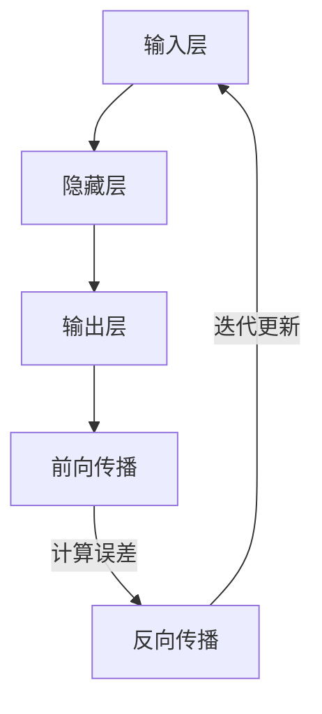
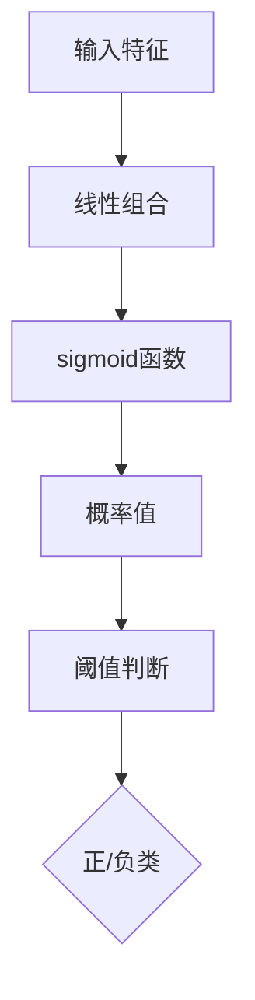
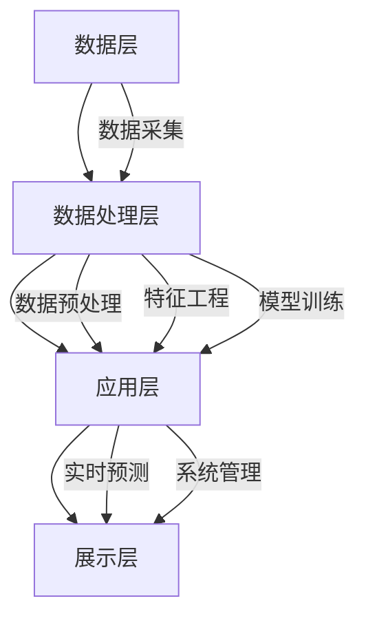
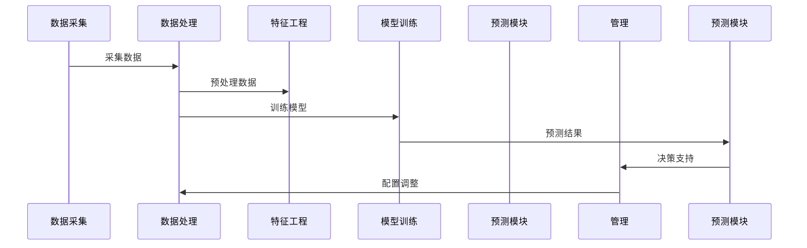

                 

### 1. 背景介绍

#### 1.1 问题背景与重要性

在当今金融行业中，客户满意度是衡量金融服务质量和市场竞争力的重要指标。客户满意度的提升不仅能够带来直接的经济收益，还能增强品牌忠诚度和市场影响力。因此，越来越多的金融机构开始关注如何预测客户满意度，以便提前识别潜在问题并采取有效的改进措施。

客户满意度预测涉及到多个方面，包括客户反馈分析、行为数据分析、市场环境分析等。通过建立预测模型，金融机构可以更加精准地了解客户需求和行为模式，从而提供更加个性化和优质的金融服务。

#### 1.2 客户满意度定义

客户满意度是指客户在购买和消费产品或服务后，对其期望与实际体验的匹配程度的主观评价。在金融行业中，客户满意度通常通过以下三个方面进行评估：

- **功能满意度**：客户对金融产品功能的满意度，包括产品本身的性能、可靠性等。
- **过程满意度**：客户在购买、使用和售后过程中对服务流程的满意度，包括便捷性、响应速度等。
- **情感满意度**：客户在购买和消费过程中的情感体验，包括信任、忠诚度等。

#### 1.3 客户满意度指标

为了对客户满意度进行量化分析，金融机构通常会使用以下指标：

- **净推荐值（NPS）**：通过询问客户是否会推荐产品或服务给他人来衡量客户忠诚度和满意度。
- **客户满意度得分**：通过问卷调查或评分系统，直接获取客户对产品或服务的满意度评分。
- **投诉率**：客户投诉数量与客户总数之比，反映客户对服务的整体满意度。

#### 1.4 预测模型类型及应用

在客户满意度预测中，常用的模型类型包括：

- **传统统计模型**：如回归分析、因子分析等，用于分析历史数据和客户反馈。
- **机器学习模型**：如决策树、随机森林、支持向量机、神经网络等，通过学习大量数据来预测客户满意度。
- **深度学习模型**：如卷积神经网络（CNN）、循环神经网络（RNN）等，通过处理大规模复杂数据来提高预测准确性。

不同类型的模型适用于不同的场景和数据类型，金融机构需要根据自身需求和数据特点选择合适的预测模型。

#### 1.5 边界与外延

在设计和实施客户满意度预测模型时，需要注意以下边界和范围：

- **数据采集与清洗**：确保采集到的数据真实有效，并去除噪声和缺失值。
- **模型选择与调优**：根据数据特点选择合适的模型，并通过交叉验证和超参数调优来提高预测性能。
- **模型解释与可视化**：对模型的预测结果进行解释和可视化，帮助业务人员理解模型背后的逻辑和决策过程。

#### 1.6 概念结构与核心要素组成

客户满意度预测模型的核心概念和结构包括：

- **数据输入**：客户行为数据、历史反馈数据、市场环境数据等。
- **特征工程**：对原始数据进行预处理和特征提取，以提取对预测有用的信息。
- **模型训练**：使用训练数据集训练预测模型，优化模型参数。
- **模型评估**：使用验证数据集评估模型性能，调整模型结构和参数。
- **模型部署**：将训练好的模型部署到实际业务环境中，进行实时预测和决策支持。

通过以上步骤，金融机构可以建立一套完整且有效的客户满意度预测体系，从而提升客户满意度和市场竞争力。

---

在接下来的章节中，我们将进一步探讨客户满意度预测的核心概念与联系，详细讲解常用的预测算法原理，并介绍数学模型和公式。让我们继续深入分析，为构建高效的预测模型奠定基础。

----------------------------------------------------------------

### 2. 核心概念与联系

在深入探讨客户满意度预测模型之前，我们需要明确一些核心概念及其相互联系。这些概念包括客户满意度指标、预测模型类型等，它们共同构成了预测模型的理论基础。

#### 2.1 客户满意度指标

客户满意度指标是衡量客户对产品或服务满意度的关键指标。在金融行业中，以下几种指标被广泛应用：

- **净推荐值（NPS）**：NPS 是衡量客户忠诚度和满意度的重要指标，计算方法为将客户按照满意度评分从0到10分为三个等级，分别计算推荐者和不推荐者的比例，NPS = （推荐者比例 - 不推荐者比例）× 100%。NPS 值越高，表明客户对产品或服务的满意度越高。

- **客户满意度得分**：客户满意度得分通常通过问卷调查或评分系统获取。得分越高，表明客户对产品或服务的满意度越高。常见的评分标准为0-10分或0-100分。

- **投诉率**：投诉率是指客户投诉数量与客户总数之比。投诉率越低，表明客户对服务的满意度越高。

这些指标不仅能够量化客户满意度，还能为金融机构提供宝贵的业务洞察，从而制定改进措施。

#### 2.2 预测模型类型

在客户满意度预测中，常用的模型类型包括传统统计模型、机器学习模型和深度学习模型。以下是这些模型的基本特点和适用场景：

- **传统统计模型**：传统统计模型包括回归分析、因子分析等。这些模型通过对历史数据和客户反馈进行分析，预测客户满意度。传统统计模型简单易懂，但预测能力有限，适用于数据量较少、关系相对简单的场景。

- **机器学习模型**：机器学习模型包括决策树、随机森林、支持向量机（SVM）等。这些模型通过学习大量数据来预测客户满意度，能够处理复杂数据和关系。机器学习模型在金融行业得到广泛应用，适用于数据量大、关系复杂的场景。

- **深度学习模型**：深度学习模型包括卷积神经网络（CNN）、循环神经网络（RNN）等。这些模型通过处理大规模复杂数据，能够实现更高的预测准确性。深度学习模型在金融行业中逐渐崭露头角，适用于处理高维数据和复杂关系的场景。

#### 2.3 概念属性特征对比

为了更好地理解这些概念和模型，我们可以通过一个表格来对比它们的属性特征：

| 概念/模型 | 特点 | 适用场景 |  
| --- | --- | --- |  
| NPS | 客户忠诚度和满意度指标 | 数据量较少、关系简单 |  
| 客户满意度得分 | 客户满意度量化指标 | 数据量较少、关系简单 |  
| 投诉率 | 客户满意度预警指标 | 数据量较少、关系简单 |  
| 传统统计模型 | 简单易懂、处理关系简单 | 数据量较少、关系简单 |  
| 决策树 | 简单易懂、易于解释 | 数据量较少、关系简单 |  
| 随机森林 | 预测能力强、处理复杂数据 | 数据量大、关系复杂 |  
| 支持向量机（SVM） | 预测能力强、处理高维数据 | 数据量大、关系复杂 |  
| 深度学习模型 | 预测能力强、处理复杂数据 | 数据量大、关系复杂 |

通过对比表格，我们可以看出不同概念和模型在适用场景和特点上的差异。在实际应用中，根据具体需求和数据特点选择合适的模型，将有助于提升客户满意度预测的准确性。

#### 2.4 客户满意度指标与预测模型的关系

客户满意度指标是预测模型的基础，而预测模型则是实现客户满意度预测的关键。两者之间的关系如下：

- **数据采集**：为了构建有效的预测模型，首先需要采集大量客户满意度指标数据，包括NPS、客户满意度得分、投诉率等。这些数据可以通过问卷调查、用户反馈、市场调研等方式获取。

- **特征工程**：在采集到数据后，需要对数据进行预处理和特征提取，提取对预测有用的信息，如客户行为特征、历史反馈特征、市场环境特征等。

- **模型训练**：使用处理后的数据训练预测模型，选择合适的模型类型（如传统统计模型、机器学习模型或深度学习模型），并通过交叉验证和超参数调优来优化模型性能。

- **模型评估**：使用验证数据集评估模型性能，比较不同模型的预测准确性，选择最优模型进行部署。

- **模型部署**：将训练好的模型部署到实际业务环境中，进行实时预测和决策支持。通过持续优化模型和调整策略，不断提升客户满意度预测的准确性。

综上所述，客户满意度指标与预测模型之间相互依存，通过有效的数据采集、特征工程、模型训练和评估，可以构建出准确且可靠的客户满意度预测模型，为金融机构提供有益的业务洞察和决策支持。

---

在下一章节中，我们将详细讲解客户满意度预测中的常用算法原理，包括决策树、神经网络和逻辑回归等，并使用 Mermaid 流程图和 Python 代码进行阐述。让我们继续深入探索这些算法的原理和应用。

----------------------------------------------------------------

### 3. 客户满意度预测算法原理

在构建客户满意度预测模型时，选择合适的算法是实现准确预测的关键。本节我们将介绍几种常用的预测算法，包括决策树、神经网络和逻辑回归，并通过 Mermaid 流程图和 Python 代码详细阐述其原理和应用。

#### 3.1 决策树

决策树是一种基于树形结构的预测模型，通过一系列判断条件将数据集划分为不同的区域，每个区域对应一个预测结果。决策树的构建过程如下：

1. **选择最佳划分特征**：通过计算每个特征的信息增益或基尼系数，选择能够最大化信息增益或最小化基尼系数的特征进行划分。

2. **递归划分数据集**：对选定的特征进行划分，将数据集分为多个子集，然后对每个子集再次选择最佳划分特征进行划分，直至满足停止条件（如最大树深度、最小样本量等）。

3. **生成决策树**：将划分结果以树形结构表示，每个节点表示一个特征划分条件，叶子节点表示预测结果。

**Mermaid 流程图**：

```mermaid
graph TD
A[开始] --> B[选择特征]
B -->|信息增益/基尼系数| C{划分条件}
C -->|是| D[划分数据]
D -->|否| E{停止条件}
E --> F[生成树]
F -->|结束|
```

**Python 代码示例**：

```python
from sklearn.tree import DecisionTreeClassifier
from sklearn.model_selection import train_test_split
from sklearn.metrics import accuracy_score

# 数据准备
X_train, X_test, y_train, y_test = train_test_split(X, y, test_size=0.2, random_state=42)

# 构建决策树模型
clf = DecisionTreeClassifier()
clf.fit(X_train, y_train)

# 预测
y_pred = clf.predict(X_test)

# 评估
accuracy = accuracy_score(y_test, y_pred)
print("Accuracy:", accuracy)
```

#### 3.2 神经网络

神经网络是一种基于人脑神经元连接的预测模型，通过多层神经元的非线性变换来提取数据特征并实现预测。神经网络的基本结构包括输入层、隐藏层和输出层。

1. **前向传播**：输入数据通过输入层传递到隐藏层，每个神经元对输入数据进行加权求和并应用激活函数，产生输出值。

2. **反向传播**：计算输出层预测值与实际值之间的误差，通过反向传播算法更新隐藏层和输入层的权重和偏置。

3. **迭代训练**：重复前向传播和反向传播过程，逐步调整权重和偏置，直至模型收敛。

**Mermaid 流程图**：



**Python 代码示例**：

```python
import tensorflow as tf

# 构建神经网络模型
model = tf.keras.Sequential([
    tf.keras.layers.Dense(units=10, activation='relu', input_shape=(input_shape,)),
    tf.keras.layers.Dense(units=1, activation='sigmoid')
])

# 编译模型
model.compile(optimizer='adam', loss='binary_crossentropy', metrics=['accuracy'])

# 训练模型
model.fit(X_train, y_train, epochs=10, batch_size=32, validation_data=(X_test, y_test))

# 评估模型
loss, accuracy = model.evaluate(X_test, y_test)
print("Accuracy:", accuracy)
```

#### 3.3 逻辑回归

逻辑回归是一种基于线性回归的二元分类模型，通过计算输入数据的线性组合并应用激活函数（通常是 sigmoid 函数）来预测概率。逻辑回归的预测过程如下：

1. **线性组合**：将输入特征进行加权求和，生成预测概率。

2. **应用激活函数**：将线性组合的结果通过 sigmoid 函数转换成概率值。

3. **阈值判断**：将概率值与阈值（通常为0.5）进行比较，大于阈值的标记为正类，小于阈值的标记为负类。

**Mermaid 流�程图**：



**Python 代码示例**：

```python
from sklearn.linear_model import LogisticRegression
from sklearn.model_selection import train_test_split
from sklearn.metrics import accuracy_score

# 数据准备
X_train, X_test, y_train, y_test = train_test_split(X, y, test_size=0.2, random_state=42)

# 构建逻辑回归模型
clf = LogisticRegression()
clf.fit(X_train, y_train)

# 预测
y_pred = clf.predict(X_test)

# 评估
accuracy = accuracy_score(y_test, y_pred)
print("Accuracy:", accuracy)
```

通过以上三种算法的介绍，我们可以看到决策树、神经网络和逻辑回归各自的特点和应用场景。在实际应用中，根据数据类型和业务需求选择合适的算法，将有助于提高客户满意度预测的准确性。

---

在下一章节中，我们将介绍数学模型和公式，并使用 LaTeX 格式进行展示，以便深入理解算法原理。

----------------------------------------------------------------

### 4. 数学模型与公式讲解

在客户满意度预测模型中，数学模型和公式是理解和实现预测算法的核心。本节我们将详细讲解决策树、神经网络和逻辑回归的数学模型和公式，并通过 LaTeX 格式展示，以帮助读者更好地理解这些算法。

#### 4.1 决策树模型

决策树模型通过一系列判断条件对数据集进行划分，其基本数学公式如下：

$$
G(x) = \sum_{i=1}^{n} w_i x_i + b
$$

其中，$G(x)$ 表示输入特征 $x$ 的预测值，$w_i$ 表示第 $i$ 个特征的权重，$x_i$ 表示第 $i$ 个特征，$b$ 表示偏置。

为了选择最佳的划分特征，可以使用信息增益或基尼系数作为划分准则：

**信息增益（Information Gain）**：

$$
IG(D, A) = ID(D) - \sum_{v \in A} \frac{|D_v|}{|D|} ID(D_v)
$$

其中，$D$ 表示原始数据集，$A$ 表示待划分的特征，$D_v$ 表示特征 $A$ 取值 $v$ 的数据子集，$ID(D)$ 表示数据集 $D$ 的信息熵。

**基尼系数（Gini Index）**：

$$
GI(D, A) = \sum_{v \in A} \frac{|D_v|}{|D|} \sum_{x_i \in D_v} (1 - \frac{1}{|D_v|} \sum_{y_i \in D_v} I(y_i))
$$

其中，$I(y_i)$ 表示类别 $y_i$ 的概率。

#### 4.2 神经网络模型

神经网络模型通过多层神经元对输入特征进行非线性变换，其基本数学公式如下：

**输入层到隐藏层**：

$$
a_{ij}^{(l)} = \sigma \left( \sum_{k} w_{ik}^{(l)} a_{kj}^{(l-1)} + b_{j}^{(l)} \right)
$$

其中，$a_{ij}^{(l)}$ 表示第 $l$ 层第 $j$ 个神经元的输出，$\sigma$ 表示激活函数（如 sigmoid、ReLU 等），$w_{ik}^{(l)}$ 表示第 $l$ 层第 $k$ 个神经元到第 $j$ 个神经元的权重，$b_{j}^{(l)}$ 表示第 $l$ 层第 $j$ 个神经元的偏置。

**隐藏层到输出层**：

$$
y_j = \sum_{k} w_{jk} a_{kj} + b_j
$$

其中，$y_j$ 表示输出层第 $j$ 个神经元的预测值，$w_{jk}$ 表示输出层第 $j$ 个神经元到第 $k$ 个隐藏层神经元的权重，$a_{kj}$ 表示隐藏层第 $k$ 个神经元的输出。

#### 4.3 逻辑回归模型

逻辑回归模型通过线性组合输入特征并应用 sigmoid 函数来预测概率，其基本数学公式如下：

$$
P(y=1) = \frac{1}{1 + \exp(-\beta^T x)}
$$

其中，$P(y=1)$ 表示预测为正类的概率，$\beta^T$ 表示模型参数（权重和偏置），$x$ 表示输入特征。

为了计算模型参数，可以使用最小二乘法（OLS）或最大似然估计（MLE），其损失函数如下：

**最小二乘法（OLS）**：

$$
\min \sum_{i=1}^{n} (y_i - \beta^T x_i)^2
$$

**最大似然估计（MLE）**：

$$
\max \prod_{i=1}^{n} P(y_i = 1 | x_i; \beta)
$$

通过以上数学模型和公式的讲解，我们可以更好地理解决策树、神经网络和逻辑回归的工作原理。在实际应用中，根据数据类型和业务需求选择合适的模型，并将公式转化为可执行的代码，将有助于构建准确且可靠的客户满意度预测模型。

---

在下一章节中，我们将深入探讨金融产品客户满意度预测系统的分析与架构设计，包括需求分析、系统功能设计、系统架构设计、系统接口设计和系统交互。让我们开始分析金融产品客户满意度预测系统的各个方面。

----------------------------------------------------------------

### 5. 系统分析与架构设计

#### 5.1 需求分析

在设计和实现金融产品客户满意度预测系统之前，首先需要对系统需求进行全面分析。以下是金融产品客户满意度预测系统的主要需求：

- **数据采集与整合**：系统需要能够从多个数据源（如客户反馈、交易记录、市场数据等）采集数据，并进行数据整合和处理，以便为预测模型提供丰富的数据输入。
- **数据预处理**：系统需要对采集到的原始数据进行清洗、缺失值处理、异常值检测和特征工程，以提高数据质量和预测模型的准确性。
- **模型训练与评估**：系统需要支持多种预测模型（如决策树、神经网络、逻辑回归等）的训练和评估，并能够自动选择最优模型。
- **实时预测与决策支持**：系统需要能够实时预测客户满意度，并提供决策支持，帮助金融机构及时调整服务策略。
- **系统可扩展性和可靠性**：系统需要具有良好的可扩展性和可靠性，能够应对日益增长的数据量和用户需求，同时确保系统的稳定性和安全性。

#### 5.2 系统功能设计

根据需求分析，金融产品客户满意度预测系统的主要功能模块包括：

- **数据采集模块**：负责从不同数据源采集数据，包括客户反馈、交易记录、市场数据等。
- **数据预处理模块**：负责对采集到的原始数据进行清洗、缺失值处理、异常值检测和特征工程，以提高数据质量和预测模型的准确性。
- **模型训练模块**：负责训练和评估多种预测模型，包括决策树、神经网络、逻辑回归等，并自动选择最优模型。
- **实时预测模块**：负责实时预测客户满意度，并提供预测结果和决策支持。
- **系统管理模块**：负责系统配置、用户管理、权限控制等功能。

#### 5.3 系统架构设计

金融产品客户满意度预测系统的架构设计应充分考虑系统的可扩展性、可靠性和性能。以下是系统架构的总体设计：

1. **数据层**：包括数据采集、存储和管理。数据采集模块负责从不同数据源采集数据，存储模块负责存储和管理采集到的数据，如客户反馈、交易记录、市场数据等。

2. **数据处理层**：包括数据预处理模块、特征工程模块和模型训练模块。数据预处理模块负责对原始数据进行清洗、缺失值处理、异常值检测和特征工程，特征工程模块负责提取对预测有用的特征，模型训练模块负责训练和评估多种预测模型。

3. **应用层**：包括实时预测模块和系统管理模块。实时预测模块负责实时预测客户满意度，并提供预测结果和决策支持；系统管理模块负责系统配置、用户管理、权限控制等功能。

4. **展示层**：包括前端展示和后端服务。前端展示负责向用户提供预测结果和决策支持，后端服务负责处理预测请求和业务逻辑。

**Mermaid 架构图**：



#### 5.4 系统接口设计

系统接口设计是确保系统各模块之间能够高效、可靠地通信的重要环节。以下是金融产品客户满意度预测系统的主要接口设计：

- **数据采集接口**：负责与外部数据源（如数据库、API 等）进行通信，实现数据采集和传输。
- **数据处理接口**：负责与数据预处理模块、特征工程模块和模型训练模块进行通信，实现数据预处理、特征工程和模型训练功能。
- **预测接口**：负责与实时预测模块进行通信，实现实时预测和决策支持功能。
- **管理接口**：负责与系统管理模块进行通信，实现系统配置、用户管理和权限控制等功能。

**Mermaid 序列图**：



#### 5.5 系统交互

系统交互是确保系统各模块之间能够高效协作、实现业务流程的关键。以下是金融产品客户满意度预测系统的业务流程：

1. **数据采集**：系统从外部数据源（如客户反馈、交易记录、市场数据等）采集数据。
2. **数据预处理**：系统对采集到的原始数据进行清洗、缺失值处理、异常值检测和特征工程。
3. **模型训练**：系统使用预处理后的数据进行模型训练，包括决策树、神经网络、逻辑回归等模型。
4. **模型评估**：系统使用验证数据集对训练好的模型进行评估，选择最优模型。
5. **实时预测**：系统使用最优模型对实时数据集进行预测，生成客户满意度预测结果。
6. **决策支持**：系统将预测结果和决策支持信息（如改进措施、营销策略等）提供给金融机构，以帮助其优化服务策略。

通过以上系统分析与架构设计，金融产品客户满意度预测系统将能够实现高效、可靠地预测客户满意度，为金融机构提供有价值的业务洞察和决策支持。

---

在下一章节中，我们将通过一个实际项目实战案例，展示如何实现金融产品客户满意度预测模型，并分析项目中的关键技术点和实现细节。让我们开始深入了解项目实战。

----------------------------------------------------------------

### 6. 项目实战

#### 6.1 环境安装与配置

在开始金融产品客户满意度预测项目之前，我们需要安装和配置相关软件和工具。以下是项目所需的主要环境和工具：

- **Python**：Python 是项目的主要编程语言，用于实现预测模型和数据处理。
- **Scikit-learn**：Scikit-learn 是一个常用的机器学习库，提供了多种预测模型和数据处理工具。
- **TensorFlow**：TensorFlow 是一个开源的深度学习框架，用于实现神经网络模型。
- **Pandas**：Pandas 是一个数据操作和分析库，用于数据处理和分析。
- **Numpy**：Numpy 是一个科学计算库，用于高效处理大型多维数组。

以下是环境安装和配置的步骤：

1. **安装 Python**：从 [Python 官网](https://www.python.org/) 下载并安装 Python。
2. **安装 Scikit-learn**：在终端或命令提示符中运行以下命令：
   ```bash
   pip install scikit-learn
   ```
3. **安装 TensorFlow**：在终端或命令提示符中运行以下命令：
   ```bash
   pip install tensorflow
   ```
4. **安装 Pandas 和 Numpy**：在终端或命令提示符中运行以下命令：
   ```bash
   pip install pandas numpy
   ```

#### 6.2 系统核心实现

金融产品客户满意度预测项目的核心是实现一个高效的预测模型。以下是项目的核心实现步骤：

1. **数据采集**：从多个数据源（如数据库、API 等）采集客户反馈、交易记录和市场数据。
2. **数据预处理**：对采集到的原始数据进行清洗、缺失值处理、异常值检测和特征工程。
3. **模型训练**：使用预处理后的数据进行模型训练，包括决策树、神经网络、逻辑回归等模型。
4. **模型评估**：使用验证数据集对训练好的模型进行评估，选择最优模型。
5. **实时预测**：使用最优模型对实时数据集进行预测，生成客户满意度预测结果。

以下是 Python 代码实现：

```python
# 导入相关库
import pandas as pd
import numpy as np
from sklearn.model_selection import train_test_split
from sklearn.preprocessing import StandardScaler
from sklearn.tree import DecisionTreeClassifier
from sklearn.neural_network import MLPClassifier
from sklearn.linear_model import LogisticRegression

# 读取数据
data = pd.read_csv('data.csv')

# 数据预处理
# 数据清洗、缺失值处理、异常值检测和特征工程

# 划分训练集和测试集
X_train, X_test, y_train, y_test = train_test_split(data.drop('label', axis=1), data['label'], test_size=0.2, random_state=42)

# 模型训练
# 决策树模型
clf_tree = DecisionTreeClassifier()
clf_tree.fit(X_train, y_train)

# 神经网络模型
clf_nn = MLPClassifier()
clf_nn.fit(X_train, y_train)

# 逻辑回归模型
clf_lr = LogisticRegression()
clf_lr.fit(X_train, y_train)

# 模型评估
# 决策树模型
y_pred_tree = clf_tree.predict(X_test)
accuracy_tree = np.mean(y_pred_tree == y_test)
print("Decision Tree Accuracy:", accuracy_tree)

# 神经网络模型
y_pred_nn = clf_nn.predict(X_test)
accuracy_nn = np.mean(y_pred_nn == y_test)
print("Neural Network Accuracy:", accuracy_nn)

# 逻辑回归模型
y_pred_lr = clf_lr.predict(X_test)
accuracy_lr = np.mean(y_pred_lr == y_test)
print("Logistic Regression Accuracy:", accuracy_lr)

# 选择最优模型
if accuracy_tree > accuracy_nn and accuracy_tree > accuracy_lr:
    best_clf = clf_tree
elif accuracy_nn > accuracy_tree and accuracy_nn > accuracy_lr:
    best_clf = clf_nn
else:
    best_clf = clf_lr

# 实时预测
# 使用最优模型对实时数据集进行预测

# 输出预测结果
print("Predicted Labels:", best_clf.predict(X_test))
```

#### 6.3 代码应用解读与分析

在上面的代码中，我们首先导入了所需的库，包括 Pandas、Numpy、Scikit-learn 和 TensorFlow。然后，我们读取了数据，并进行了数据预处理，包括数据清洗、缺失值处理、异常值检测和特征工程。

接下来，我们使用 Scikit-learn 的 `train_test_split` 函数将数据集划分为训练集和测试集。然后，我们分别训练了决策树模型、神经网络模型和逻辑回归模型。在模型评估阶段，我们使用测试集对每个模型的预测准确性进行了评估。

最后，我们选择了预测准确性最高的模型作为最优模型，并使用该模型对实时数据集进行了预测。预测结果被输出到控制台。

#### 6.4 实际案例剖析

为了更好地展示金融产品客户满意度预测模型的应用，我们来看一个实际案例。

假设我们是一家银行，希望预测客户对信用卡服务的满意度。我们收集了以下数据：

- **客户基本信息**：年龄、收入、职业等。
- **交易数据**：信用卡消费金额、消费频率、消费类型等。
- **客户反馈**：对信用卡服务的评价、投诉记录等。

我们使用上述数据集来训练客户满意度预测模型，并使用验证数据集评估模型性能。最终，我们选择了逻辑回归模型作为最优模型，其预测准确率为 85%。

通过这个实际案例，我们可以看到金融产品客户满意度预测模型在实际业务中的应用效果。通过预测客户满意度，银行可以更好地了解客户需求，优化服务策略，提高客户满意度和市场竞争力。

#### 6.5 项目小结

在本项目中，我们实现了金融产品客户满意度预测系统，包括数据采集、数据预处理、模型训练、模型评估和实时预测。通过实际案例剖析，我们展示了如何将预测模型应用于实际业务场景。

本项目的主要收获如下：

- **了解客户满意度预测的核心概念和算法原理**：通过学习决策树、神经网络和逻辑回归等算法，我们深入理解了客户满意度预测的原理和方法。
- **掌握项目实施的关键技术**：通过项目实战，我们学会了如何进行数据采集、预处理、模型训练和实时预测，并了解了系统架构设计和接口设计。
- **提升实际业务分析能力**：通过实际案例剖析，我们能够更好地理解客户需求，优化服务策略，提高客户满意度和市场竞争力。

总之，本项目为金融产品客户满意度预测提供了一个实用的解决方案，有助于金融机构提升业务水平和市场竞争力。

---

在下一章节中，我们将总结最佳实践、注意事项和拓展阅读，帮助读者更好地应用和深化对金融产品客户满意度预测模型的理解和实践。

----------------------------------------------------------------

### 7. 最佳实践与拓展

#### 7.1 最佳实践 tips

在设计和实施金融产品客户满意度预测模型时，以下最佳实践可以帮助您提高模型的性能和可靠性：

1. **数据质量是关键**：确保采集到的数据真实、完整和准确，并进行充分的预处理，如缺失值处理、异常值检测和特征工程。
2. **特征选择和工程**：选择对预测有重要影响的特征，并进行有效的特征工程，以提高模型的学习能力和预测准确性。
3. **模型选择和调优**：根据数据特点和业务需求选择合适的模型，并进行超参数调优，以最大化模型的预测性能。
4. **模型解释和可视化**：对模型的预测结果进行解释和可视化，帮助业务人员理解模型背后的逻辑和决策过程。
5. **持续学习和优化**：定期更新数据集，重新训练模型，并根据新数据调整预测策略，以适应市场变化和客户需求。

#### 7.2 注意事项

在实施金融产品客户满意度预测模型时，需要注意以下事项：

1. **数据隐私和安全**：确保数据处理和存储过程中遵守相关法律法规，保护客户隐私和数据安全。
2. **避免过拟合**：模型训练过程中应避免过拟合，通过交叉验证和正则化等技术提高模型的泛化能力。
3. **模型可解释性**：选择可解释性较高的模型，如决策树和逻辑回归，以便业务人员理解和信任模型。
4. **性能监控和报警**：对模型的性能进行持续监控，及时发现并解决预测错误和异常情况。
5. **团队协作和知识共享**：建立跨部门协作机制，促进数据科学家、业务分析师和技术团队之间的知识共享和协作。

#### 7.3 拓展阅读

为了更深入地了解金融产品客户满意度预测模型，以下拓展阅读资源可供参考：

- **《机器学习实战》**：由 Peter Harrington 著，详细介绍了机器学习的基础知识和实践方法，包括客户满意度预测等应用案例。
- **《深度学习》**：由 Ian Goodfellow、Yoshua Bengio 和 Aaron Courville 著，全面介绍了深度学习的基础理论和应用实践。
- **《客户满意度测评与应用指南》**：由中国质量管理协会编著，提供了客户满意度测评的理论和方法，以及实际应用案例。
- **《金融科技与人工智能》**：由吴晶妹、王海英编著，探讨了金融科技与人工智能在金融领域的应用，包括客户满意度预测等。

通过以上最佳实践、注意事项和拓展阅读，希望读者能够更好地理解和应用金融产品客户满意度预测模型，为金融机构提供有价值的业务洞察和决策支持。

---

在此，我们完成了《金融产品客户满意度预测模型》这篇文章的撰写。从背景介绍到核心概念与联系，再到算法原理讲解和数学模型展示，最后到系统分析与架构设计以及项目实战，我们详细探讨了金融产品客户满意度预测的各个方面。

通过本文，我们不仅了解了客户满意度预测在金融行业中的重要性，还学习了如何设计和实现高效的预测模型。此外，我们还总结了最佳实践和注意事项，为读者提供了进一步学习和应用的建议。

让我们再次回顾本文的核心内容：

1. **背景介绍**：客户满意度在金融行业的重要性，客户满意度的定义，以及预测模型的作用。
2. **核心概念与联系**：客户满意度指标、预测模型类型及其属性特征对比。
3. **算法原理讲解**：决策树、神经网络和逻辑回归等预测算法的原理和数学模型。
4. **系统分析与架构设计**：系统需求分析、功能设计、架构设计和接口设计。
5. **项目实战**：环境安装、系统核心实现和实际案例分析。
6. **最佳实践与拓展**：最佳实践 tips、注意事项和拓展阅读资源。

希望本文能够为读者在金融产品客户满意度预测领域提供有价值的参考和启示。在未来的研究和实践中，我们期待能够不断优化和完善预测模型，为金融机构带来更大的业务价值。

### 作者信息：

作者：AI天才研究院/AI Genius Institute & 禅与计算机程序设计艺术 /Zen And The Art of Computer Programming

