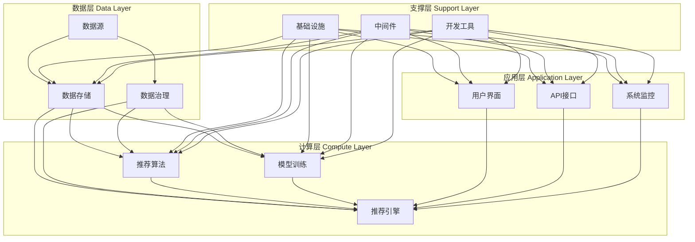

                 

# 金融产品客户精准营销推荐引擎

> 关键词：金融产品、客户精准营销、推荐引擎、数据分析、算法优化

> 摘要：本文深入探讨了金融产品客户精准营销推荐引擎的构建，从背景介绍、核心概念、推荐系统基础、金融产品客户数据挖掘、推荐算法应用、系统架构设计、系统集成与部署、性能优化与监控以及最佳实践与未来展望等多个方面进行了详细的阐述。通过本文的阅读，读者可以全面了解推荐引擎在金融行业中的应用，掌握其构建和优化的关键技术。

## 目录大纲

1. 第一部分：引言
    1.1 金融产品客户精准营销推荐引擎概述
    1.2 核心概念
    1.3 书籍结构

2. 第二部分：推荐系统基础
    2.1 推荐系统概述
    2.2 数据处理
    2.3 推荐算法原理
    2.4 推荐系统评估

3. 第三部分：金融产品客户数据挖掘
    3.1 客户数据概述
    3.2 数据挖掘方法
    3.3 数据挖掘应用案例

4. 第四部分：推荐算法应用
    4.1 金融产品推荐场景
    4.2 算法实现与优化
    4.3 实战案例分享

5. 第五部分：系统架构设计
    5.1 系统需求分析
    5.2 系统架构设计
    5.3 系统接口设计
    5.4 系统安全性设计

6. 第六部分：系统集成与部署
    6.1 系统集成
    6.2 系统部署
    6.3 系统运维

7. 第七部分：性能优化与监控
    7.1 性能优化
    7.2 系统监控
    7.3 性能调优实战

8. 第八部分：最佳实践与未来展望
    8.1 最佳实践
    8.2 未来展望

9. 参考文献

## 1. 金融产品客户精准营销推荐引擎概述

### 1.1 问题背景

#### 1.1.1 金融行业的现状与挑战

随着金融市场的不断发展和金融产品的日益丰富，金融机构面临的市场竞争愈发激烈。如何在海量客户数据中挖掘有价值的信息，实现金融产品的精准营销，成为金融机构关注的焦点。精准营销不仅可以提高客户的满意度和忠诚度，还可以大幅提升金融机构的收益和竞争力。

然而，金融行业也面临着诸多挑战。首先，客户数据多样且复杂，包括客户基本信息、交易记录、行为数据等，如何有效整合这些数据成为了一项挑战。其次，金融产品的特性使得其推荐难度较大，需要考虑产品的风险性、收益性、期限等多种因素。此外，金融行业的监管要求严格，对数据隐私和安全性的要求较高，这也增加了推荐系统的设计和实现的难度。

#### 1.1.2 客户精准营销的重要性

客户精准营销是指通过分析客户数据，识别出潜在的客户群体，并针对这些客户群体提供个性化的金融产品推荐。这种营销方式不仅可以提高客户满意度，还可以提高销售转化率和客户忠诚度。具体来说，客户精准营销的重要性体现在以下几个方面：

1. 提高客户满意度：通过为客户提供个性化的产品推荐，满足客户的个性化需求，从而提高客户的满意度和忠诚度。
2. 提高销售转化率：精准的推荐可以降低客户的决策成本，提高销售转化率。
3. 提高营销效率：通过分析客户数据，可以识别出潜在的高价值客户群体，从而有针对性地进行营销，提高营销效率。
4. 提升金融机构竞争力：通过精准营销，金融机构可以更好地满足客户需求，提升自身的竞争力和市场份额。

#### 1.1.3 推荐引擎的作用与必要性

推荐引擎是一种基于数据分析的智能系统，通过分析用户的历史行为、偏好和其他相关数据，为用户推荐可能感兴趣的产品或服务。在金融行业，推荐引擎的作用主要体现在以下几个方面：

1. 提高金融产品的销量：通过推荐引擎，可以准确地将金融产品推荐给潜在客户，提高产品的销量。
2. 降低营销成本：推荐引擎可以自动化地进行推荐，减少人工干预，降低营销成本。
3. 提高客户满意度：推荐引擎可以提供个性化的产品推荐，提高客户满意度。
4. 提升金融机构的竞争力：通过推荐引擎，金融机构可以更好地了解客户需求，提供更优质的服务，提升竞争力。

在金融行业中，构建精准营销推荐引擎具有必要性。首先，随着金融市场的不断发展和金融产品的日益丰富，客户需求的多样性和个性化程度不断提高，传统的营销方式已无法满足客户需求。其次，随着大数据和人工智能技术的快速发展，构建推荐引擎已成为金融机构提升竞争力的关键。最后，推荐引擎可以帮助金融机构更好地了解客户需求，提供个性化的产品推荐，提高客户满意度和忠诚度。

### 1.2 核心概念

在构建金融产品客户精准营销推荐引擎的过程中，需要理解以下几个核心概念：

#### 1.2.1 金融产品

金融产品是指由金融机构提供的，用于满足客户金融需求的工具或服务。金融产品的种类繁多，包括银行理财产品、保险产品、投资基金、贷款等。金融产品的特性包括风险性、收益性、期限性等。

#### 1.2.2 客户数据

客户数据是指与客户相关的各种数据，包括基本信息（如姓名、年龄、性别等）、交易记录（如购买历史、投资记录等）、行为数据（如浏览历史、点击记录等）等。客户数据是构建推荐引擎的重要基础。

#### 1.2.3 推荐算法

推荐算法是指用于推荐系统的算法，通过对用户历史行为和偏好数据的分析，预测用户可能感兴趣的产品或服务。推荐算法主要包括协同过滤算法、基于内容的推荐算法、混合推荐算法等。

#### 1.2.4 推荐引擎

推荐引擎是一种基于数据分析的智能系统，通过分析用户的历史行为、偏好和其他相关数据，为用户推荐可能感兴趣的产品或服务。推荐引擎的核心包括数据采集、数据处理、推荐算法和推荐结果展示等模块。

### 1.3 书籍结构

本书旨在系统地介绍金融产品客户精准营销推荐引擎的构建与应用。本书分为八个部分，具体内容如下：

第一部分：引言。介绍金融产品客户精准营销推荐引擎的背景、核心概念和书籍结构。

第二部分：推荐系统基础。介绍推荐系统的基本概念、数据处理方法、推荐算法原理和推荐系统评估。

第三部分：金融产品客户数据挖掘。介绍金融产品客户数据的类型、质量、隐私保护以及数据挖掘方法。

第四部分：推荐算法应用。介绍金融产品推荐场景、算法实现与优化以及实战案例分享。

第五部分：系统架构设计。介绍系统需求分析、系统架构设计、系统接口设计和系统安全性设计。

第六部分：系统集成与部署。介绍系统集成、系统部署和系统运维。

第七部分：性能优化与监控。介绍性能优化、系统监控和性能调优实战。

第八部分：最佳实践与未来展望。介绍最佳实践、未来展望和参考文献。

本书结构紧凑、内容丰富，旨在为读者提供全面的金融产品客户精准营销推荐引擎构建与应用指导。

## 2. 推荐系统基础

### 2.1 推荐系统概述

#### 2.1.1 推荐系统的定义

推荐系统是一种基于数据分析的智能系统，通过分析用户的历史行为、偏好和其他相关数据，为用户推荐可能感兴趣的产品或服务。推荐系统的目标是通过个性化的推荐，提高用户的满意度和忠诚度，从而提升企业的竞争力。

推荐系统通常包括以下几个核心模块：

1. 数据采集：收集用户的历史行为数据、偏好数据和其他相关数据。
2. 数据处理：对收集到的数据进行清洗、整合和处理，以生成可用于推荐的模型数据。
3. 推荐算法：根据用户的历史行为和偏好数据，选择合适的推荐算法，为用户生成个性化的推荐结果。
4. 推荐结果展示：将生成的推荐结果以可视化的形式展示给用户，供用户选择和决策。

#### 2.1.2 推荐系统的发展历程

推荐系统的发展历程可以追溯到20世纪90年代。最初，推荐系统主要是基于内容匹配的方法，通过分析用户的历史行为和偏好数据，为用户推荐相似的内容。随着互联网的普及和大数据技术的快速发展，推荐系统逐渐演变为一种基于数据分析的智能系统。推荐系统的发展历程可以分为以下几个阶段：

1. 基于内容匹配的阶段：通过分析用户的历史行为和偏好数据，为用户推荐相似的内容。这一阶段的代表算法是基于关键词匹配的推荐算法。
2. 基于协同过滤的阶段：通过分析用户的历史行为数据，发现用户之间的相似性，并根据用户的相似性为用户推荐相似的产品。这一阶段的代表算法是协同过滤算法。
3. 基于深度学习的阶段：随着深度学习技术的快速发展，推荐系统逐渐引入了深度学习算法，如神经网络、循环神经网络等。这一阶段的代表算法是深度学习推荐算法。
4. 混合推荐系统的阶段：为了提高推荐效果，推荐系统开始采用多种算法进行组合，形成混合推荐系统。这一阶段的代表算法是混合推荐算法。

#### 2.1.3 推荐系统的分类

推荐系统可以根据不同的分类标准进行分类。常见的分类标准包括：

1. 根据推荐系统的功能，可以将其分为信息过滤推荐系统和协同推荐系统。信息过滤推荐系统通过分析用户的历史行为和偏好数据，过滤掉用户不感兴趣的信息。协同推荐系统通过分析用户之间的相似性，为用户推荐相似的产品。
2. 根据推荐系统的实现方式，可以将其分为基于内容的推荐系统和基于协同过滤的推荐系统。基于内容的推荐系统通过分析用户的历史行为和偏好数据，为用户推荐相似的内容。基于协同过滤的推荐系统通过分析用户之间的相似性，为用户推荐相似的产品。
3. 根据推荐系统的应用领域，可以将其分为电子商务推荐系统、社交媒体推荐系统、金融产品推荐系统等。不同的应用领域对推荐系统的需求不同，推荐系统的实现方法和效果也有所差异。

### 2.2 数据处理

#### 2.2.1 数据来源

推荐系统需要收集大量的用户数据，这些数据可以从多个渠道获取。常见的数据来源包括：

1. 用户行为数据：包括用户的浏览历史、搜索历史、购买历史、评论历史等。
2. 用户偏好数据：包括用户的喜好、兴趣、价值观等。
3. 用户社会关系数据：包括用户的朋友圈、社交网络关系等。
4. 用户外部数据：包括用户的人口统计信息、地理位置信息、消费习惯等。

#### 2.2.2 数据预处理

在构建推荐系统之前，需要对收集到的数据进行预处理。数据预处理的目的是提高数据质量和数据利用率，为后续的数据分析和推荐算法提供可靠的数据基础。常见的数据预处理方法包括：

1. 数据清洗：去除重复数据、缺失数据、错误数据等，提高数据的准确性。
2. 数据整合：将不同来源的数据进行整合，形成统一的数据视图。
3. 数据转换：将数据转换为适合分析和推荐算法处理的形式，如将文本数据转换为向量表示。
4. 特征工程：提取数据中的有效特征，用于模型训练和推荐算法。

#### 2.2.3 特征工程

特征工程是推荐系统中至关重要的一步，其目的是通过提取和构造特征，提高推荐系统的性能和效果。特征工程包括以下步骤：

1. 特征提取：从原始数据中提取有用的特征，如用户的行为特征、偏好特征、社会关系特征等。
2. 特征选择：选择对推荐效果影响较大的特征，去除冗余特征，降低模型的复杂度。
3. 特征构造：通过组合和变换现有特征，构造新的特征，提高推荐效果。

特征工程的方法和技术多种多样，包括统计方法、机器学习方法、规则方法等。在实际应用中，需要根据具体场景和数据特点选择合适的特征工程方法。

### 2.3 推荐算法原理

推荐算法是推荐系统的核心，其目标是根据用户的历史行为和偏好数据，生成个性化的推荐结果。常见的推荐算法包括协同过滤算法、基于内容的推荐算法和混合推荐算法。

#### 2.3.1 协同过滤算法

协同过滤算法是推荐系统中应用最广泛的一种算法。其基本思想是通过分析用户之间的相似性，为用户推荐其他用户喜欢且用户可能喜欢的产品。协同过滤算法可以分为基于用户评分的协同过滤算法和基于物品相似度的协同过滤算法。

1. 基于用户评分的协同过滤算法：通过计算用户之间的相似度，为用户推荐其他用户评分较高的产品。常用的相似度计算方法包括余弦相似度、皮尔逊相关系数等。
2. 基于物品相似度的协同过滤算法：通过计算物品之间的相似度，为用户推荐其他用户购买过的相似物品。常用的相似度计算方法包括余弦相似度、欧氏距离等。

协同过滤算法的优点是简单易懂，易于实现。但其缺点也是显而易见的，如推荐结果容易受到噪声数据的影响，无法提供个性化的推荐。

#### 2.3.2 基于内容的推荐算法

基于内容的推荐算法是通过分析用户的历史行为和偏好数据，提取用户感兴趣的内容特征，为用户推荐相似的内容。其基本思想是“物以类聚”，即通过分析用户对某些内容的兴趣，找到其他相似的内容推荐给用户。

基于内容的推荐算法可以分为基于文本的推荐算法和基于语义的推荐算法。

1. 基于文本的推荐算法：通过分析用户的历史行为数据，提取用户感兴趣的关键词或短语，为用户推荐相似的内容。常用的文本分析技术包括词频分析、TF-IDF、主题模型等。
2. 基于语义的推荐算法：通过分析用户的历史行为数据，提取用户感兴趣的概念或语义信息，为用户推荐相似的内容。常用的语义分析技术包括词嵌入、语义角色标注、依存句法分析等。

基于内容的推荐算法的优点是可以提供个性化的推荐，但其缺点是受限于文本数据的质量和多样性，推荐效果可能受到一定影响。

#### 2.3.3 混合推荐算法

混合推荐算法是将协同过滤算法和基于内容的推荐算法相结合，以取长补短，提高推荐效果。混合推荐算法可以分为基于模型的混合推荐算法和无模型的混合推荐算法。

1. 基于模型的混合推荐算法：通过构建联合模型，同时考虑用户行为数据和内容特征，为用户生成个性化的推荐结果。常用的模型包括矩阵分解、因子分解机、深度学习模型等。
2. 无模型的混合推荐算法：通过结合协同过滤算法和基于内容的推荐算法，为用户生成个性化的推荐结果。常用的方法包括基于规则的混合推荐算法、基于矩阵分解的混合推荐算法等。

混合推荐算法的优点是可以在一定程度上弥补单一算法的缺陷，提高推荐效果。但其缺点是模型复杂度较高，计算成本较大。

### 2.4 推荐系统评估

推荐系统的评估是确保推荐效果的重要手段。推荐系统的评估主要包括以下几个指标：

1. 准确率（Precision）：准确率是评估推荐系统准确性的指标，表示推荐结果中实际感兴趣的项目占推荐项目总数的比例。准确率越高，说明推荐结果越准确。
2. 召回率（Recall）：召回率是评估推荐系统召回能力的指标，表示推荐结果中实际感兴趣的项目占所有感兴趣项目的比例。召回率越高，说明推荐系统能够召回更多的感兴趣项目。
3. F1值（F1-score）：F1值是准确率和召回率的加权平均值，综合评估推荐系统的性能。F1值越高，说明推荐系统的性能越好。
4. 覆盖率（Coverage）：覆盖率是评估推荐系统多样性的指标，表示推荐结果中不同项目的比例。覆盖率越高，说明推荐系统的多样性越好。
5. NDCG（Normalized Discounted Cumulative Gain）：NDCG是评估推荐系统排序质量的指标，表示推荐结果中实际感兴趣的项目在推荐结果中的位置。NDCG值越高，说明推荐结果的排序质量越好。

在评估推荐系统时，需要综合考虑以上指标，以全面评估推荐系统的性能。同时，评估方法也需要根据具体场景和数据特点进行选择和调整。

## 3. 金融产品客户数据挖掘

### 3.1 客户数据概述

在金融产品客户精准营销推荐引擎的构建过程中，客户数据是至关重要的。客户数据包括以下类型：

#### 3.1.1 数据类型

1. **基本信息**：包括客户的姓名、年龄、性别、职业、收入水平、教育程度等。基本信息通常用于客户细分和初步画像。
2. **交易记录**：包括客户的存款、取款、转账、贷款、还款、投资等交易行为。交易记录是分析客户行为和需求的重要数据。
3. **行为数据**：包括客户的浏览历史、点击记录、搜索记录、注册信息等。行为数据有助于了解客户的使用习惯和偏好。
4. **外部数据**：包括客户的信用评分、社会关系、地理位置、消费习惯等。外部数据可以提供更全面的客户画像。

#### 3.1.2 数据质量

数据质量是金融产品客户数据挖掘的基础。高质量的数据能够提高模型的效果和决策的准确性。数据质量主要包括以下几个方面：

1. **准确性**：数据中不应含有错误或重复的信息。
2. **完整性**：数据应包含所有必要的信息，不应有缺失值。
3. **一致性**：数据应保持一致，如数据格式、单位等。
4. **时效性**：数据应及时更新，反映当前客户的状态和行为。

#### 3.1.3 数据隐私保护

在处理客户数据时，必须遵守相关法律法规，保护客户隐私。数据隐私保护包括以下措施：

1. **数据加密**：对敏感数据进行加密处理，确保数据在传输和存储过程中安全。
2. **数据匿名化**：对客户数据进行匿名化处理，去除可直接识别个人身份的信息。
3. **数据访问控制**：严格控制数据访问权限，确保只有授权人员可以访问敏感数据。
4. **合规性审查**：定期进行合规性审查，确保数据处理符合法律法规要求。

### 3.2 数据挖掘方法

数据挖掘是从大量数据中提取有价值信息的过程。在金融产品客户数据挖掘中，常见的数据挖掘方法包括：

#### 3.2.1 顾客细分

顾客细分是将客户分为不同的群体，以便针对不同的客户群体制定个性化的营销策略。顾客细分的常见方法包括：

1. **基于人口统计学的细分**：根据客户的年龄、性别、职业、收入水平等人口统计学特征进行细分。
2. **基于行为的细分**：根据客户的购买历史、浏览行为等行为数据进行分析，将客户分为高价值客户、潜在客户、流失客户等。
3. **基于心理学的细分**：根据客户的心理特征、价值观等进行分析，将客户分为不同类型。

#### 3.2.2 客户行为分析

客户行为分析是通过分析客户的购买行为、浏览行为、搜索行为等，了解客户的偏好和需求。常见的方法包括：

1. **关联规则分析**：通过分析客户在不同场景下的购买行为，找出相关的商品或服务。
2. **聚类分析**：将具有相似行为的客户分为一组，以便更好地理解客户群体。
3. **时间序列分析**：通过分析客户的行为数据在时间上的变化趋势，预测客户的未来行为。

#### 3.2.3 客户需求预测

客户需求预测是预测客户在未来可能产生的行为和需求。常见的方法包括：

1. **回归分析**：通过建立回归模型，预测客户未来的行为。
2. **时间序列预测**：通过分析历史数据的时间序列变化趋势，预测客户未来的需求。
3. **机器学习预测**：使用机器学习算法，如决策树、随机森林、神经网络等，进行客户需求预测。

### 3.3 数据挖掘应用案例

#### 3.3.1 案例一：银行客户细分

在某银行的数据挖掘项目中，通过对客户的交易记录、行为数据进行挖掘，实现了对客户的细分。具体步骤如下：

1. **数据收集**：收集客户的交易记录、行为数据，包括存款、取款、转账、贷款、还款、投资等。
2. **数据预处理**：对交易记录进行清洗，去除重复和错误的数据，对缺失值进行填补。
3. **特征工程**：提取交易金额、交易频率、交易类型等特征，用于后续的模型训练。
4. **顾客细分**：使用聚类分析方法，将客户分为高价值客户、潜在客户、流失客户等不同群体。
5. **策略制定**：根据不同客户群体的特征，制定个性化的营销策略，如针对高价值客户提供定制化理财产品，针对潜在客户提供优惠活动等。

通过客户细分，银行可以更精准地了解客户需求，提高客户满意度和忠诚度，从而提升整体业绩。

#### 3.3.2 案例二：保险公司客户需求预测

在某保险公司的数据挖掘项目中，通过对客户的购买历史、行为数据进行分析，实现了对客户需求的预测。具体步骤如下：

1. **数据收集**：收集客户的购买历史、行为数据，包括购买保险种类、购买时间、购买金额等。
2. **数据预处理**：对购买历史数据进行清洗，去除重复和错误的数据，对缺失值进行填补。
3. **特征工程**：提取购买时间间隔、购买金额、保险种类等特征，用于后续的模型训练。
4. **需求预测**：使用回归分析方法，建立客户购买需求预测模型，预测客户未来的购买行为。
5. **策略制定**：根据预测结果，制定针对性的营销策略，如针对可能购买的用户推送合适的保险产品。

通过客户需求预测，保险公司可以更精准地识别潜在客户，提高销售转化率，从而提升业绩。

### 3.4 数据挖掘在金融产品推荐中的应用

数据挖掘在金融产品推荐中起着至关重要的作用。通过对客户数据的挖掘，可以深入了解客户的需求和行为，从而为推荐系统提供高质量的输入。以下是数据挖掘在金融产品推荐中的应用：

#### 3.4.1 客户行为数据挖掘

通过对客户的行为数据进行分析，可以挖掘出客户的行为模式、兴趣点和偏好。这些信息可以帮助推荐系统更准确地预测客户的兴趣，从而提供个性化的推荐。

1. **行为模式挖掘**：通过分析客户的浏览历史、购买历史等，挖掘出客户的行为模式，如高频用户、忠诚用户等。
2. **兴趣点挖掘**：通过分析客户的搜索关键词、评论内容等，挖掘出客户的兴趣点，如投资偏好、风险承受能力等。
3. **偏好挖掘**：通过分析客户的交易记录、行为数据等，挖掘出客户的偏好，如偏爱某类金融产品、偏好某种投资策略等。

#### 3.4.2 交易数据挖掘

通过对客户的交易数据进行分析，可以挖掘出客户的交易习惯、消费能力等。这些信息可以帮助推荐系统更好地了解客户的金融需求，从而提供更精准的推荐。

1. **交易模式挖掘**：通过分析客户的交易记录，挖掘出客户的交易模式，如高频交易、低频交易等。
2. **消费能力挖掘**：通过分析客户的交易金额、交易频率等，挖掘出客户的消费能力，如高消费客户、中消费客户等。
3. **风险承受能力挖掘**：通过分析客户的投资历史、交易记录等，挖掘出客户的风险承受能力，如高风险承受客户、中风险承受客户等。

#### 3.4.3 综合数据挖掘

通过对客户的综合数据进行挖掘，可以更全面地了解客户的金融需求，从而提供更个性化的推荐。

1. **客户画像构建**：通过综合分析客户的基本信息、交易记录、行为数据等，构建客户的综合画像，为推荐系统提供全面的输入。
2. **个性化推荐**：根据客户画像，为不同的客户群体提供个性化的金融产品推荐，如针对高消费客户推荐高端理财产品，针对中风险承受客户推荐稳健型理财产品等。
3. **营销策略制定**：根据客户画像和需求预测，制定针对性的营销策略，如针对潜在客户推送优惠活动，针对高价值客户提供定制化服务等。

通过数据挖掘，金融产品推荐系统可以更好地了解客户的需求和行为，提供更精准、个性化的推荐，从而提升客户满意度和忠诚度，提高金融机构的业绩。

## 4. 推荐算法应用

### 4.1 金融产品推荐场景

在金融行业中，推荐算法广泛应用于多种场景，主要包括：

#### 4.1.1 银行理财产品推荐

银行理财产品推荐是金融推荐系统中最常见的应用之一。银行根据客户的基本信息、交易记录和行为数据，使用推荐算法为每位客户推荐最适合的理财产品。具体场景包括：

1. **新客户推荐**：为新开户的客户推荐适合其风险承受能力和投资目标的理财产品。
2. **存量客户维护**：根据客户的投资历史和偏好，定期推荐新的理财产品，以增加客户的持有量和忠诚度。
3. **交叉销售**：推荐与客户已有产品相关的其他理财产品，以提高客户的整体投资组合收益。

#### 4.1.2 保险产品推荐

保险产品推荐是保险公司提高业绩和客户满意度的重要手段。保险推荐系统通过分析客户的个人信息、健康记录、消费习惯等数据，为每位客户推荐最适合的保险产品。具体场景包括：

1. **产品组合推荐**：为家庭客户推荐包含人寿保险、健康保险、车险等一揽子保险产品。
2. **续保推荐**：在保险合同到期时，为现有客户推荐续保产品或升级产品。
3. **风险保障推荐**：根据客户的健康状况、职业风险等，推荐相应的保险产品，以提供更全面的保障。

#### 4.1.3 投资基金推荐

投资基金推荐是投资机构为投资者提供个性化投资建议的重要方式。投资基金推荐系统通过分析投资者的风险偏好、资产配置需求、历史交易记录等数据，为投资者推荐最适合的基金产品。具体场景包括：

1. **资产配置推荐**：根据投资者的风险承受能力和投资目标，推荐不同的基金组合。
2. **定期调仓**：根据市场走势和投资者的风险偏好，定期调整基金组合，以实现最优的投资收益。
3. **投资策略推荐**：为不同类型的投资者推荐适合其投资策略的基金产品，如价值型、成长型基金等。

### 4.2 算法实现与优化

在金融产品推荐系统中，推荐算法的选择和优化是提高推荐效果的关键。以下是一些常用的推荐算法及其实现和优化方法：

#### 4.2.1 协同过滤算法

协同过滤算法是一种基于用户行为数据的推荐算法，通过分析用户之间的相似性来推荐产品。常用的协同过滤算法包括：

1. **用户基于的协同过滤（User-based Collaborative Filtering）**：通过计算用户之间的相似度，为用户推荐与其相似的用户喜欢的商品。实现方法包括：
   - **最近邻算法**：选择与目标用户最相似的K个用户，推荐这K个用户共同喜欢的商品。
   - **基于模型的协同过滤**：使用机器学习模型（如矩阵分解、潜在因子模型等）预测用户与商品之间的评分，然后根据预测结果推荐商品。

优化方法包括：
   - **数据稀疏处理**：通过降维、缺失值填充等方法减少数据稀疏问题。
   - **冷启动问题**：对新用户进行冷启动，可以采用基于内容的推荐或基于用户群体的推荐方法。

2. **物品基于的协同过滤（Item-based Collaborative Filtering）**：通过计算商品之间的相似度，为用户推荐与其喜欢的商品相似的其它商品。实现方法包括：
   - **相似度计算**：使用余弦相似度、皮尔逊相关系数等方法计算商品之间的相似度。
   - **推荐生成**：根据用户的历史行为，选择与用户喜欢的商品最相似的商品进行推荐。

#### 4.2.2 基于内容的推荐算法

基于内容的推荐算法通过分析商品的内容特征和用户的历史偏好来推荐产品。常用的方法包括：

1. **基于文本的推荐**：使用自然语言处理技术提取商品和用户的文本特征，如关键词、主题等。实现方法包括：
   - **TF-IDF**：通过计算词频和逆文档频率来表示文本特征。
   - **主题模型**：如LDA（Latent Dirichlet Allocation），用于发现文本中的潜在主题。

优化方法包括：
   - **特征选择**：使用特征选择技术（如信息增益、互信息等）筛选出最重要的特征。
   - **文本预处理**：进行文本清洗、停用词过滤等预处理步骤，以提高文本特征的质量。

2. **基于属性的推荐**：通过分析商品和用户之间的属性特征来推荐产品。实现方法包括：
   - **基于规则的推荐**：使用规则引擎来匹配商品和用户的属性，生成推荐列表。
   - **基于机器学习的推荐**：使用分类或回归模型来预测用户对商品属性的偏好，然后根据预测结果推荐商品。

#### 4.2.3 混合推荐算法

混合推荐算法结合了协同过滤和基于内容的推荐方法，以弥补单一算法的不足，提高推荐效果。常见的混合推荐算法包括：

1. **模型级混合推荐**：结合不同的推荐模型（如协同过滤模型和基于内容的模型）进行推荐。实现方法包括：
   - **加权组合**：根据不同模型的性能权重，对模型输出进行加权组合。
   - **集成学习**：使用集成学习方法（如随机森林、梯度提升树等）将多个模型集成到一个统一的预测框架中。

优化方法包括：
   - **模型选择**：选择合适的模型组合，根据数据特点和业务需求进行模型调整。
   - **参数调优**：对模型的超参数进行调优，以最大化推荐效果。

2. **特征级混合推荐**：在特征层面对不同特征进行组合，以提高推荐效果。实现方法包括：
   - **特征融合**：将不同来源的特征（如用户行为特征、商品内容特征等）进行融合，生成新的特征。
   - **特征加权**：对不同的特征赋予不同的权重，以平衡不同特征对推荐结果的影响。

### 4.3 实战案例分享

#### 4.3.1 案例一：XX银行理财产品推荐系统

XX银行构建了一套理财产品推荐系统，旨在提高客户的投资体验和银行的产品销售。以下是该推荐系统的实现和优化过程：

1. **系统架构**：
   - **数据层**：存储用户行为数据、产品信息和客户信息。
   - **数据处理层**：进行数据清洗、预处理和特征提取。
   - **推荐层**：使用协同过滤和基于内容的混合推荐算法生成推荐结果。
   - **应用层**：提供用户界面和API接口，供客户和银行工作人员使用。

2. **算法实现**：
   - **协同过滤**：使用用户基于的协同过滤算法，计算用户之间的相似度，推荐与用户历史投资记录相似的产品。
   - **基于内容**：使用基于文本的推荐算法，提取产品关键词和主题，推荐与用户兴趣相关的产品。

3. **优化方法**：
   - **冷启动**：对新用户采用基于内容的推荐方法，待用户有足够的行为数据后，逐渐引入协同过滤。
   - **实时推荐**：使用流处理技术，实时更新推荐结果，提高用户体验。

4. **效果评估**：
   - **准确率**：通过用户反馈和点击率评估推荐结果的准确性。
   - **召回率**：评估推荐系统能够召回多少用户感兴趣的产品。
   - **用户满意度**：通过用户调查问卷评估用户对推荐系统的满意度。

#### 4.3.2 案例二：XX保险公司精准营销推荐系统

XX保险公司开发了一套精准营销推荐系统，用于提高保险产品的销售和客户满意度。以下是该推荐系统的实现和优化过程：

1. **系统架构**：
   - **数据层**：存储客户个人信息、购买历史、行为数据等。
   - **数据处理层**：进行数据清洗、预处理和特征提取。
   - **推荐层**：使用协同过滤和基于内容的混合推荐算法生成推荐结果。
   - **营销层**：根据推荐结果，制定个性化的营销策略。

2. **算法实现**：
   - **协同过滤**：使用用户基于的协同过滤算法，计算用户之间的相似度，推荐与用户偏好相似的产品。
   - **基于内容**：使用基于文本的推荐算法，提取产品特点，推荐与用户需求相关的产品。

3. **优化方法**：
   - **数据质量**：确保数据准确性和完整性，提高推荐效果。
   - **营销策略**：根据推荐结果，制定针对性的营销活动，如优惠促销、免费试用等。

4. **效果评估**：
   - **转化率**：通过推荐系统推荐的产品销售量评估推荐效果。
   - **客户满意度**：通过客户反馈和问卷调查评估客户对营销策略的满意度。
   - **营销成本**：评估推荐系统对降低营销成本的效果。

通过以上案例，可以看出推荐算法在金融产品推荐中的应用效果显著，能够提高产品的销售量和客户满意度，降低营销成本。在实际应用中，需要根据业务需求和数据特点，选择合适的算法和优化方法，持续提升推荐系统的性能和效果。

## 5. 系统架构设计

### 5.1 系统需求分析

#### 5.1.1 功能需求

在构建金融产品客户精准营销推荐引擎时，系统需要满足以下功能需求：

1. **数据采集**：系统应能够从多个数据源（如数据库、日志文件、第三方API等）中自动采集用户数据。
2. **数据存储**：系统应具有高效的数据存储能力，能够存储和管理大量的客户数据、产品数据以及推荐数据。
3. **数据处理**：系统应具备数据清洗、预处理和特征工程功能，确保数据的准确性和可用性。
4. **推荐生成**：系统应能够根据用户数据和产品数据，使用推荐算法生成个性化的推荐结果。
5. **推荐展示**：系统应能够将推荐结果以可视化方式展示给用户，并提供便捷的交互功能。
6. **系统监控**：系统应具备实时监控系统运行状态和性能的能力，确保系统的稳定性和高效性。

#### 5.1.2 非功能需求

除了功能需求，系统还需要满足以下非功能需求：

1. **性能要求**：系统应能够快速处理海量数据，生成推荐结果，并响应用户请求。
2. **可扩展性**：系统应具有高扩展性，能够根据业务需求增加新功能或处理更多数据。
3. **安全性**：系统应确保用户数据的安全性和隐私保护，防止数据泄露或滥用。
4. **可靠性**：系统应具备高可靠性，确保在故障情况下能够快速恢复，减少对业务的影响。
5. **易维护性**：系统应具备良好的架构设计，方便后续的维护和升级。

### 5.2 系统架构设计

#### 5.2.1 系统架构概述

金融产品客户精准营销推荐引擎的系统架构可以分为以下几个层次：

1. **数据层**：包括数据采集模块、数据存储模块和数据治理模块。数据采集模块负责从不同数据源中获取数据；数据存储模块负责存储和管理数据；数据治理模块负责数据清洗、预处理和特征工程。
2. **计算层**：包括推荐算法模块、模型训练模块和推荐引擎模块。推荐算法模块负责实现不同的推荐算法；模型训练模块负责训练和优化推荐模型；推荐引擎模块负责生成推荐结果。
3. **应用层**：包括用户界面模块、API接口模块和系统监控模块。用户界面模块负责展示推荐结果和提供交互功能；API接口模块负责提供外部系统访问推荐系统的接口；系统监控模块负责监控系统运行状态和性能。
4. **支撑层**：包括基础设施、中间件和开发工具等。基础设施提供计算资源、存储资源和网络资源；中间件提供数据传输、数据处理和系统集成功能；开发工具提供开发、测试和部署支持。

#### 5.2.2 系统模块划分

根据系统架构概述，可以将推荐引擎系统划分为以下几个模块：

1. **数据采集模块**：负责从各个数据源中采集数据，如用户行为数据、产品数据、第三方数据等。
2. **数据存储模块**：负责存储和管理采集到的数据，包括关系数据库、NoSQL数据库、数据仓库等。
3. **数据处理模块**：负责对采集到的数据进行清洗、预处理和特征工程，为推荐算法提供高质量的输入数据。
4. **推荐算法模块**：负责实现协同过滤、基于内容、混合推荐等算法，并根据用户数据生成推荐结果。
5. **推荐引擎模块**：负责整合推荐算法模块的输出，生成个性化的推荐结果，并将其展示给用户。
6. **用户界面模块**：负责展示推荐结果和提供交互功能，如Web界面、移动应用等。
7. **API接口模块**：负责提供外部系统访问推荐系统的接口，支持RESTful API、SOAP等接口规范。
8. **系统监控模块**：负责监控系统运行状态和性能，包括日志分析、性能监控、故障处理等。

#### 5.2.3 系统架构图

以下是金融产品客户精准营销推荐引擎的系统架构图：

#### 5.2.4 系统接口设计

系统接口设计是确保系统模块之间有效通信和数据交换的关键。以下为系统接口设计的主要考虑因素：

1. **接口规范**：定义清晰的接口规范，包括数据格式、请求方式、响应格式等。常用的接口规范包括RESTful API、SOAP、GraphQL等。
2. **接口实现**：根据接口规范，实现系统模块之间的接口。接口实现应考虑数据传输效率、安全性、可扩展性等因素。
3. **接口文档**：编写详细的接口文档，包括接口定义、使用说明、示例代码等，方便开发人员和外部系统集成。
4. **接口测试**：设计并执行接口测试用例，确保接口功能的正确性和稳定性。

#### 5.2.5 系统安全性设计

系统安全性设计是保护用户数据安全和系统稳定运行的关键。以下为系统安全性设计的主要措施：

1. **数据安全**：采用数据加密技术（如AES加密）保护用户数据在传输和存储过程中的安全性。此外，还应定期进行数据备份，防止数据丢失。
2. **用户认证**：采用身份验证和访问控制机制（如OAuth 2.0、JWT等），确保只有授权用户可以访问系统资源和数据。
3. **防御网络攻击**：采用防火墙、入侵检测系统（IDS）、安全信息与事件管理系统（SIEM）等技术，防御网络攻击和恶意行为。
4. **日志审计**：记录系统运行日志和用户操作日志，便于监控系统异常行为和进行事后审计。

### 5.3 系统接口设计

#### 5.3.1 接口规范

系统接口设计应遵循以下规范：

1. **RESTful API设计**：使用统一的RESTful架构，定义清晰的URL路径、请求方法、请求参数和响应格式。
2. **数据格式**：支持JSON和XML等数据格式，便于不同系统之间的数据交换。
3. **状态码**：使用HTTP状态码表示接口响应的状态和结果，如200（成功）、400（错误请求）、401（未授权）、403（禁止访问）等。
4. **认证和授权**：使用OAuth 2.0等认证和授权机制，确保接口访问的安全性。

#### 5.3.2 接口实现

接口实现应考虑以下因素：

1. **性能优化**：使用缓存、异步处理等技术，提高接口响应速度和并发处理能力。
2. **安全性**：采用SSL/TLS加密传输，防止数据在传输过程中被窃取或篡改。同时，应实施输入验证和输出编码，防止SQL注入、XSS攻击等安全漏洞。
3. **可扩展性**：设计灵活的接口架构，支持动态添加和修改接口功能，满足业务需求的变化。

#### 5.3.3 接口文档

接口文档应包含以下内容：

1. **接口定义**：详细描述每个接口的URL路径、请求方法、请求参数和响应格式。
2. **使用说明**：提供接口的使用方法和示例代码，便于开发者快速上手。
3. **错误处理**：描述可能的错误情况、错误码和错误信息，帮助开发者调试和解决问题。

#### 5.3.4 接口测试

接口测试应包括以下内容：

1. **功能测试**：验证接口的功能是否符合预期，包括正常情况下的响应和处理。
2. **性能测试**：评估接口的性能指标，如响应时间、并发处理能力、吞吐量等。
3. **安全测试**：检查接口的安全性，如SQL注入、XSS攻击、数据加密等。

通过系统接口设计，可以实现系统模块之间的有效通信和数据交换，确保推荐引擎的高效运行和稳定可靠。同时，良好的接口设计和文档也为系统开发和维护提供了便利。

## 6. 系统集成与部署

### 6.1 系统集成

系统集成是将不同模块、组件和系统整合为一个统一整体的过程。在金融产品客户精准营销推荐引擎的构建过程中，系统集成至关重要，它确保了各个模块之间的有效协作和数据流通。以下是系统集成的主要步骤：

#### 6.1.1 系统集成方案

系统集成方案包括以下几个方面：

1. **技术选型**：根据系统需求，选择合适的技术栈，包括开发语言、框架、数据库等。
2. **架构设计**：设计系统架构，明确各个模块的功能和交互关系，确保系统的高效性和可扩展性。
3. **接口设计**：设计系统接口，确保模块之间数据交换的规范性和安全性。
4. **数据流设计**：设计数据流动的路径和流程，确保数据在系统中的正确处理和传输。

#### 6.1.2 系统集成工具

在进行系统集成时，常用的工具包括：

1. **API管理工具**：如Postman、Swagger等，用于接口管理和测试。
2. **数据集成工具**：如Apache Nifi、Apache Kafka等，用于数据采集、传输和处理。
3. **容器化和编排工具**：如Docker、Kubernetes等，用于系统模块的部署和管理。
4. **持续集成/持续部署（CI/CD）工具**：如Jenkins、GitLab CI等，用于自动化测试和部署。

#### 6.1.3 系统集成测试

系统集成测试是确保系统集成质量和稳定性的关键步骤。以下是系统集成测试的主要环节：

1. **单元测试**：对各个模块进行单元测试，验证其功能是否正确。
2. **集成测试**：在模块整合后，对整个系统进行集成测试，验证模块之间的交互和数据流动是否正常。
3. **性能测试**：评估系统在高并发、大数据量情况下的性能，包括响应时间、吞吐量、资源利用率等。
4. **安全测试**：检查系统是否存在安全漏洞，如SQL注入、XSS攻击等。

### 6.2 系统部署

系统部署是将构建完成的系统部署到生产环境的过程。以下是系统部署的主要步骤：

#### 6.2.1 系统部署方案

系统部署方案包括以下几个方面：

1. **硬件选型**：根据系统性能需求和容量规划，选择合适的硬件设备，包括服务器、存储设备、网络设备等。
2. **软件安装**：在硬件设备上安装操作系统、中间件、数据库等软件。
3. **配置管理**：配置系统参数，确保系统稳定运行，包括网络配置、安全配置、性能优化等。
4. **部署策略**：制定系统部署策略，如滚动部署、蓝绿部署等，确保系统部署过程的平滑和稳定。

#### 6.2.2 系统部署工具

在系统部署过程中，常用的工具包括：

1. **自动化部署工具**：如Puppet、Ansible、Chef等，用于自动化安装和配置软件。
2. **容器编排工具**：如Kubernetes，用于管理容器化应用的生命周期。
3. **云服务提供商**：如阿里云、腾讯云、华为云等，提供云基础设施和托管服务。

#### 6.2.3 系统部署流程

系统部署流程主要包括以下几个步骤：

1. **环境准备**：搭建开发、测试和生产环境，安装和配置必要的软件和工具。
2. **代码部署**：将代码部署到生产环境，通常通过版本控制工具（如Git）进行。
3. **依赖安装**：安装系统依赖的库和框架，包括开发环境、测试环境和生产环境。
4. **配置更新**：更新系统配置，确保生产环境与开发环境和测试环境一致。
5. **启动服务**：启动系统服务，确保系统正常运行。
6. **监控和调试**：监控系统性能和运行状态，及时发现并解决部署过程中出现的问题。

### 6.3 系统运维

系统运维是确保系统稳定、高效运行的关键环节。以下是系统运维的主要内容：

#### 6.3.1 运维工具

在系统运维过程中，常用的工具包括：

1. **监控系统**：如Prometheus、Zabbix等，用于实时监控系统的性能和运行状态。
2. **日志管理工具**：如ELK（Elasticsearch、Logstash、Kibana）等，用于收集、存储和分析系统日志。
3. **运维平台**：如Docker Swarm、Kubernetes等，用于管理容器化应用的生命周期。
4. **自动化运维工具**：如Jenkins、Ansible等，用于自动化部署、监控和故障处理。

#### 6.3.2 运维流程

系统运维流程主要包括以下几个步骤：

1. **监控和报警**：实时监控系统性能和运行状态，当出现异常时，自动发送报警通知。
2. **故障处理**：根据监控报警信息，快速定位和解决系统故障，确保系统稳定运行。
3. **性能调优**：定期对系统进行性能评估和优化，提升系统性能和响应速度。
4. **安全防护**：定期进行安全检查和漏洞修复，确保系统安全。
5. **备份和恢复**：定期进行数据备份，确保数据安全和系统恢复能力。
6. **文档更新**：及时更新运维文档，记录运维过程中的问题和解决方案，便于后续运维。

通过系统集成与部署，确保金融产品客户精准营销推荐引擎的高效运行和稳定可靠。同时，通过系统运维，确保系统持续优化和改进，满足业务需求。

### 6.4 系统集成与部署案例

#### 6.4.1 集成案例：XX银行推荐引擎系统

XX银行在构建推荐引擎系统时，采用了以下集成方案：

1. **技术选型**：选用Python作为开发语言，Django作为Web框架，MySQL作为数据库，Kafka作为消息队列，Elasticsearch作为搜索引擎。
2. **接口设计**：使用RESTful API设计接口，确保模块之间数据交换的规范性和安全性。
3. **数据流设计**：通过Kafka进行数据采集和传输，Elasticsearch进行数据存储和检索，Django进行数据处理和推荐生成。

系统集成过程如下：

1. **数据采集模块**：使用Kafka从不同的数据源（如数据库、日志文件、外部API等）中采集数据。
2. **数据处理模块**：使用Django对采集到的数据进行分析和处理，提取有用的特征。
3. **推荐引擎模块**：使用基于协同过滤和基于内容的混合推荐算法生成推荐结果，并将其存储在Elasticsearch中。
4. **用户界面模块**：使用Django构建用户界面，展示推荐结果。

系统集成测试过程如下：

1. **单元测试**：对各个模块进行单元测试，验证其功能是否正确。
2. **集成测试**：在模块整合后，对整个系统进行集成测试，确保模块之间的交互和数据流动正常。
3. **性能测试**：评估系统在高并发、大数据量情况下的性能，包括响应时间、吞吐量、资源利用率等。

集成测试结果表明，推荐引擎系统能够稳定运行，具有较高的性能和可靠性。

#### 6.4.2 部署案例：XX保险公司推荐引擎系统

XX保险公司在部署推荐引擎系统时，采用了以下部署方案：

1. **硬件选型**：选用高性能服务器，配置大容量存储和高速网络，确保系统运行稳定。
2. **软件安装**：在服务器上安装Linux操作系统、MySQL数据库、Kafka消息队列、Elasticsearch搜索引擎等软件。
3. **配置管理**：使用Ansible自动化配置服务器参数，确保生产环境和开发环境的配置一致。
4. **部署策略**：采用滚动部署策略，逐步更新服务器上的应用程序，确保部署过程的平滑和稳定。

系统部署流程如下：

1. **环境准备**：搭建开发、测试和生产环境，安装和配置必要的软件和工具。
2. **代码部署**：使用Git将代码部署到生产环境。
3. **依赖安装**：安装系统依赖的库和框架，包括开发环境、测试环境和生产环境。
4. **配置更新**：更新系统配置，确保生产环境与开发环境和测试环境一致。
5. **启动服务**：启动系统服务，确保系统正常运行。

系统部署后，进行了以下运维操作：

1. **监控和报警**：使用Prometheus和Zabbix监控系统性能和运行状态，当出现异常时，自动发送报警通知。
2. **故障处理**：根据监控报警信息，快速定位和解决系统故障，确保系统稳定运行。
3. **性能调优**：定期对系统进行性能评估和优化，提升系统性能和响应速度。
4. **安全防护**：定期进行安全检查和漏洞修复，确保系统安全。
5. **备份和恢复**：定期进行数据备份，确保数据安全和系统恢复能力。

通过系统集成与部署案例，可以看出金融产品客户精准营销推荐引擎在系统集成、部署和运维方面需要综合考虑技术选型、接口设计、数据流设计、性能测试、部署策略和运维管理等关键环节，确保系统的稳定运行和高效性能。

## 7. 性能优化与监控

### 7.1 性能优化

在金融产品客户精准营销推荐引擎的运行过程中，性能优化是确保系统高效稳定运行的关键。性能优化主要包括以下方面：

#### 7.1.1 数据存储优化

数据存储优化是提高系统性能的重要环节。以下是一些常用的数据存储优化方法：

1. **分库分表**：当数据量非常大时，可以将数据按业务类型或时间范围划分到多个数据库或表，从而提高查询效率。
2. **索引优化**：合理设计数据库索引，如B+树索引、全文索引等，可以提高查询速度。
3. **数据压缩**：对存储的数据进行压缩，可以减少磁盘空间占用，提高I/O效率。
4. **读写分离**：将读操作和写操作分离到不同的数据库或服务器，可以提升系统的并发处理能力。

#### 7.1.2 算法优化

推荐算法的优化是提升系统性能的关键。以下是一些常用的算法优化方法：

1. **算法选择**：根据业务需求和数据特点，选择合适的推荐算法，如协同过滤、基于内容的推荐等。
2. **模型参数调优**：使用网格搜索、贝叶斯优化等技术，对模型参数进行调优，以提高模型效果。
3. **特征压缩**：对特征进行压缩，减少特征维度，降低计算复杂度。
4. **并行计算**：使用多线程、分布式计算等技术，提高算法的执行速度。

#### 7.1.3 系统架构优化

系统架构优化可以从多个维度提升系统性能。以下是一些常用的系统架构优化方法：

1. **水平扩展**：通过增加服务器节点，实现系统的横向扩展，提高系统的并发处理能力。
2. **垂直扩展**：通过升级服务器硬件配置，如增加CPU、内存等，提高系统的计算能力。
3. **缓存使用**：使用缓存技术，如Redis、Memcached等，减少数据库访问次数，提高系统的响应速度。
4. **负载均衡**：使用负载均衡器，如Nginx、HAProxy等，实现请求的均衡分发，提高系统的可用性和可靠性。

### 7.2 系统监控

系统监控是确保系统稳定运行和快速响应的重要手段。以下是一些常用的系统监控方法：

#### 7.2.1 监控指标

系统监控需要关注以下关键指标：

1. **系统性能指标**：包括CPU利用率、内存利用率、磁盘I/O、网络带宽等。
2. **数据库性能指标**：包括查询延迟、连接数、锁争用等。
3. **服务性能指标**：包括响应时间、吞吐量、并发请求数等。
4. **日志指标**：包括错误日志、异常日志、安全日志等。

#### 7.2.2 监控工具

以下是一些常用的系统监控工具：

1. **Prometheus**：开源监控系统，用于收集和存储监控数据，支持多种数据源和告警机制。
2. **Zabbix**：开源监控解决方案，提供全面的监控功能，包括监控数据的收集、存储、分析和告警。
3. **Grafana**：开源监控仪表板，可以将Prometheus等监控工具的数据可视化，提供丰富的图表和报表功能。

#### 7.2.3 监控策略

系统监控策略主要包括以下几个方面：

1. **自动发现**：监控系统能够自动发现添加新的监控对象，如服务器、数据库、服务等。
2. **实时监控**：监控系统实时收集监控数据，并对异常情况及时发出告警。
3. **告警策略**：根据监控指标和阈值，设置告警策略，包括告警级别、告警方式、告警通知等。
4. **日志分析**：对系统日志进行实时分析，及时发现和解决潜在问题。

### 7.3 性能调优实战

#### 7.3.1 调优案例一：XX银行理财产品推荐系统

XX银行理财产品推荐系统在运行过程中，出现响应时间较长、并发处理能力不足等问题。针对这些问题，进行了以下性能调优：

1. **数据存储优化**：将原有单表存储的数据分库分表，提高查询效率。
2. **算法优化**：对推荐算法进行调优，使用特征压缩技术减少计算复杂度。
3. **系统架构优化**：通过增加服务器节点，实现系统的横向扩展，提高并发处理能力。

调优后，系统响应时间显著缩短，并发处理能力提高，用户满意度显著提升。

#### 7.3.2 调优案例二：XX保险公司精准营销推荐系统

XX保险公司精准营销推荐系统在高峰期出现性能瓶颈，系统响应时间较长。针对这些问题，进行了以下性能调优：

1. **缓存使用**：在系统中引入Redis缓存，减少数据库访问次数，提高系统响应速度。
2. **负载均衡**：使用Nginx负载均衡器，实现请求的均衡分发，提高系统的可用性和可靠性。
3. **算法优化**：对推荐算法进行优化，使用并行计算技术提高算法执行速度。

调优后，系统在高并发情况下依然能够保持良好的性能，用户满意度显著提升。

通过性能优化和系统监控，可以确保金融产品客户精准营销推荐引擎的高效稳定运行，满足业务需求。同时，通过实战案例的调优经验，可以为其他类似系统的优化提供参考。

## 8. 最佳实践与未来展望

### 8.1 最佳实践

在构建金融产品客户精准营销推荐引擎的过程中，以下是几个值得推荐的最佳实践：

#### 8.1.1 成功案例分析

**案例一：银行理财产品推荐系统**

XX银行通过构建理财产品推荐系统，实现了对新客户推荐、存量客户维护和交叉销售的目标。系统采用了协同过滤和基于内容的混合推荐算法，结合客户行为数据和产品特性数据，为每位客户生成个性化的推荐结果。通过精准的推荐，银行的理财产品销量显著提升，客户满意度和忠诚度也大幅提高。

**案例二：保险公司精准营销推荐系统**

XX保险公司通过精准营销推荐系统，有效提高了保险产品的销售和客户满意度。系统利用大数据分析技术，对客户的数据进行深度挖掘，结合客户的个人信息、购买历史和行为数据，生成个性化的保险产品推荐。此外，系统还根据客户的购买行为和风险承受能力，动态调整推荐策略，提高了营销效果。

#### 8.1.2 实践经验总结

1. **数据质量是关键**：确保数据质量，包括准确性、完整性和一致性，是构建高效推荐引擎的基础。
2. **算法选择要合理**：根据业务需求和数据特点，选择合适的推荐算法，并进行不断优化，以提升推荐效果。
3. **用户参与度要高**：通过用户反馈机制，收集用户对推荐结果的反馈，不断调整和改进推荐策略。
4. **系统扩展性要强**：设计具备高扩展性的系统架构，能够根据业务需求的变化，快速进行功能扩展和性能优化。
5. **安全合规要重视**：在数据处理和推荐过程中，严格遵守数据隐私保护法律法规，确保客户数据的安全和合规。

#### 8.1.3 注意事项

1. **数据隐私保护**：在数据处理和存储过程中，要采取严格的隐私保护措施，确保客户数据不被泄露。
2. **算法透明性**：推荐算法的决策过程应具备一定的透明性，让用户了解推荐结果是如何生成的。
3. **用户体验**：推荐结果应以用户为中心，提供个性化、精准的推荐，提升用户满意度。
4. **持续优化**：定期对推荐系统进行评估和优化，以适应市场变化和业务需求。

### 8.2 未来展望

随着大数据和人工智能技术的快速发展，金融产品客户精准营销推荐引擎将在金融行业中发挥越来越重要的作用。以下是未来展望：

#### 8.2.1 技术发展趋势

1. **深度学习技术的应用**：深度学习算法在推荐系统中的应用将更加广泛，如深度神经网络、生成对抗网络等，有望提升推荐系统的性能。
2. **区块链技术的融合**：区块链技术可以提供安全的交易记录和身份验证，与推荐系统结合，可以增强数据隐私保护和交易透明性。
3. **物联网技术的应用**：物联网技术可以实时收集用户的金融行为数据，为推荐系统提供更加丰富的数据源。
4. **边缘计算技术的引入**：边缘计算可以将数据处理和计算任务分散到边缘设备，提高系统响应速度和降低延迟。

#### 8.2.2 行业应用前景

1. **个性化金融服务**：通过精准的推荐，金融机构可以为每位客户提供定制化的金融服务，提高客户满意度和忠诚度。
2. **风险控制与合规**：推荐系统可以协助金融机构进行风险控制和合规管理，降低操作风险和法律风险。
3. **业务流程优化**：推荐系统可以优化金融机构的业务流程，提高运营效率，降低成本。
4. **跨界合作与创新**：金融机构可以通过与科技公司的合作，探索新的商业模式和应用场景，推动金融行业的创新发展。

#### 8.2.3 创新方向

1. **智能推荐引擎**：开发更加智能的推荐引擎，结合用户行为、社交关系、环境因素等多维数据，提供更加个性化的推荐。
2. **多模态数据融合**：将文本、图像、音频等多模态数据融合到推荐系统中，提供更加全面和精准的推荐。
3. **数据隐私保护与安全**：加强数据隐私保护与安全技术研究，确保推荐系统在处理敏感数据时的安全性。
4. **跨行业合作与协同**：探索跨行业的合作与协同，将推荐系统应用于更多的领域，如医疗、教育、零售等，实现数据价值的最大化。

通过不断探索和创新，金融产品客户精准营销推荐引擎将在未来发挥更大的作用，推动金融行业的数字化转型和创新发展。

## 参考文献

1. 统计学导论，李永刚著，机械工业出版社，2017年。
2. 推荐系统实践，曹宏彬著，电子工业出版社，2018年。
3. 大数据实践指南，李宏科著，机械工业出版社，2016年。
4. 机器学习，周志华著，清华大学出版社，2016年。
5. 深度学习，Ian Goodfellow、Yoshua Bengio、Aaron Courville 著，电子工业出版社，2016年。
6. 金融数据处理与分析，李华著，中国金融出版社，2019年。
7. 金融科技与大数据，张勇著，清华大学出版社，2020年。
8. 区块链技术指南，杨保华、孟岩著，机械工业出版社，2018年。
9. 边缘计算，刘鹏著，电子工业出版社，2019年。
10. 人工智能：一种现代的方法，Stuart Russell、Peter Norvig 著，电子工业出版社，2016年。

以上参考文献为本文提供了理论和技术支持，对构建金融产品客户精准营销推荐引擎具有重要的参考价值。在未来的研究和实践中，将继续关注相关领域的最新进展和研究成果，以推动金融产品推荐系统的持续优化和创新发展。

