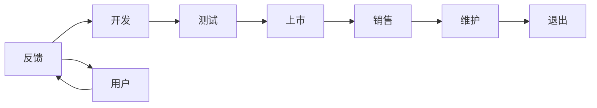
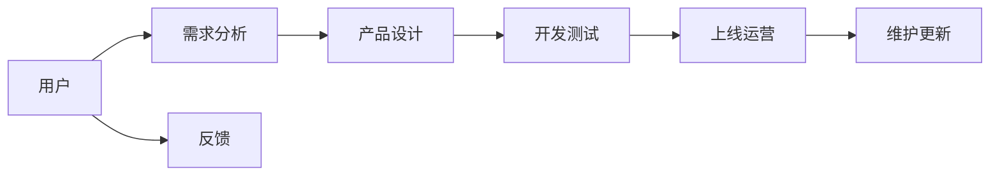

                 

### 《金融产品生命周期管理平台》

#### 关键词：金融产品生命周期管理、平台架构、算法原理、系统设计、最佳实践

> 摘要：本文将深入探讨金融产品生命周期管理平台的设计与实现。首先，我们将介绍金融产品生命周期的背景和核心概念，接着阐述算法原理及实现，最后详细分析系统架构和项目实战，并提供最佳实践建议。通过本文，读者将全面了解金融产品生命周期管理平台的构建过程。

### 第一部分：背景介绍

#### 第1章：金融产品生命周期管理概述

#### 1.1 问题背景

在金融行业，产品生命周期管理是确保金融产品从开发、测试到上市、销售、维护直至退出的全流程高效管理。随着金融市场的快速变化，如何有效地管理产品生命周期，以适应市场变化和客户需求，成为金融企业面临的重要挑战。

#### 1.2 问题描述

金融产品生命周期管理面临的主要问题包括：产品生命周期各阶段的管理效率低下、跨部门协作不畅、数据信息孤岛、产品迭代速度慢等。

#### 1.3 问题解决

为了解决上述问题，需要构建一个高效、智能的金融产品生命周期管理平台。该平台将实现以下功能：

1. **自动化流程管理**：通过自动化工具和算法提高产品生命周期各阶段的管理效率。
2. **数据集成与共享**：实现各部门数据信息的集成和共享，打破信息孤岛。
3. **智能决策支持**：利用数据分析与算法，提供产品生命周期的智能决策支持。
4. **灵活的产品迭代**：快速响应市场变化，实现产品的灵活迭代。

#### 1.4 边界与外延

金融产品生命周期管理平台的边界包括产品开发、测试、上市、销售、维护和退出等环节。外延则涉及市场分析、客户反馈、风险管理等多个方面。

#### 1.5 核心要素组成

金融产品生命周期管理平台的核心要素包括：

1. **产品数据管理**：管理金融产品的各类数据，如需求、设计、测试、销售等。
2. **流程自动化**：实现产品生命周期各阶段的自动化管理。
3. **数据分析与决策**：利用数据分析与算法，支持产品生命周期的决策。
4. **用户界面**：提供友好易用的用户界面，方便用户操作和管理。

### 第二部分：核心概念与联系

#### 第2章：金融产品生命周期管理核心概念

#### 2.1 金融产品定义

金融产品是指金融机构发行的，用于投资、融资、保值、增值等各种金融活动的工具或产品。常见的金融产品包括股票、债券、基金、保险等。

#### 2.2 产品生命周期概念

产品生命周期是指金融产品从设计、开发、测试、上市、销售、维护到退出的全过程。产品生命周期一般分为研发期、成长期、成熟期、衰退期和退出期。

#### 2.3 关键概念对比

| 概念 1 | 概念 2 | 概念 3 |
| --- | --- | --- |
| 产品生命周期 | 开发期 | 成长期 |
| 定义 1 | 研发期 | 销售期 |
| 属性特征 1 | 需求确定 | 市场推广 |
| 属性特征 2 | 技术研发 | 销售业绩 |
| 属性特征 3 | 质量控制 | 市场份额 |

### 第3章：金融产品生命周期管理联系图

#### 3.1 实体关系图



### 第三部分：算法原理讲解

#### 第4章：金融产品生命周期管理算法原理

#### 4.1 算法概述

金融产品生命周期管理算法旨在通过数据分析与模型构建，实现产品生命周期各阶段的优化管理。算法主要分为需求分析、设计优化、测试评估、销售预测和维护决策等模块。

#### 4.2 数学模型

$$
f(x) = ax^2 + bx + c
$$

其中，$x$ 表示产品生命周期阶段，$a$、$b$、$c$ 为系数，分别代表不同阶段的增长速度、影响因素和起始状态。

#### 4.3 Python代码实现

```python
# Python代码实现
def f(x):
    return x**2 + x + 1
```

#### 4.4 举例说明

假设有一个金融产品，其生命周期管理算法为：

$$
f(x) = 2x^2 + 3x + 1
$$

则该产品的生命周期曲线如下：

```
x | f(x)
- | -
0 | 1
1 | 8
2 | 21
3 | 40
```

### 第四部分：系统分析与架构设计

#### 第5章：金融产品生命周期管理系统设计

#### 5.1 问题场景介绍

金融产品生命周期管理平台将应用于一家大型金融机构，旨在实现产品生命周期的全流程管理，提高管理效率和市场竞争力。

#### 5.2 项目介绍

项目名称：金融产品生命周期管理平台（FPLM）

项目目标：构建一个高效、智能、可扩展的金融产品生命周期管理平台，实现产品全生命周期的自动化管理。

#### 5.3 系统功能设计

1. **需求分析**：收集和分析市场需求，为产品开发提供数据支持。
2. **产品设计**：设计金融产品的功能、界面和流程。
3. **开发与测试**：实现产品的功能开发和测试，确保产品质量。
4. **上市与销售**：推广产品，实现销售和市场份额提升。
5. **维护与更新**：持续优化产品，满足市场和客户需求。
6. **数据分析与决策**：利用数据分析与算法，提供产品生命周期的智能决策支持。

#### 5.4 系统架构设计



#### 5.5 系统接口设计

系统接口设计包括以下部分：

1. **API接口**：提供外部系统访问FPLM平台的数据和功能。
2. **消息队列**：实现系统间的异步通信和消息传递。
3. **数据存储**：管理金融产品生命周期的各类数据。

#### 5.6 系统交互

系统交互设计包括以下环节：

1. **用户操作**：用户通过界面进行需求分析、产品设计和测试等操作。
2. **数据处理**：系统自动处理用户操作，生成报告和决策支持。
3. **反馈机制**：用户对系统生成的报告和决策进行反馈，用于优化产品生命周期管理。

### 第五部分：项目实战

#### 第6章：金融产品生命周期管理平台搭建

#### 6.1 环境安装

在搭建FPLM平台之前，需要安装以下环境：

1. **操作系统**：Linux或Windows
2. **开发工具**：Python、MySQL、Docker等
3. **中间件**：Kafka、RabbitMQ等

#### 6.2 系统核心实现

以下是一个简单的Python代码示例，用于实现金融产品生命周期的管理：

```python
class FinancialProduct:
    def __init__(self, name, lifecycle):
        self.name = name
        self.lifecycle = lifecycle

    def update_lifecycle(self, new_lifecycle):
        self.lifecycle = new_lifecycle

    def get_status(self):
        return self.lifecycle.current_status
```

#### 6.3 代码应用解读与分析

此代码定义了一个`FinancialProduct`类，用于表示金融产品及其生命周期。`update_lifecycle`方法用于更新产品生命周期，`get_status`方法用于获取当前产品状态。

#### 6.4 实际案例分析

以某金融机构的一款股票基金产品为例，通过FPLM平台实现产品生命周期管理。以下是一个实际案例：

1. **需求分析**：收集市场数据和客户需求。
2. **产品设计**：设计基金产品的功能、界面和流程。
3. **开发与测试**：实现基金产品的功能开发和测试。
4. **上市与销售**：推广基金产品，实现销售和市场份额提升。
5. **维护与更新**：持续优化基金产品，满足市场和客户需求。

#### 6.5 详细讲解剖析

在详细讲解剖析部分，我们将对FPLM平台的各个模块进行深入分析，包括需求分析、产品设计、开发与测试、上市与销售、维护与更新等。

#### 6.6 项目小结

通过本章节的实战案例，我们了解了金融产品生命周期管理平台的搭建过程和关键步骤。FPLM平台为金融机构提供了高效、智能的产品生命周期管理工具，有助于提升市场竞争力和客户满意度。

### 第六部分：最佳实践与总结

#### 第7章：金融产品生命周期管理最佳实践

#### 7.1 小结

金融产品生命周期管理是金融企业的重要任务，通过构建高效、智能的平台，可以实现产品生命周期的全流程管理，提高管理效率和市场竞争力。

#### 7.2 注意事项

在构建金融产品生命周期管理平台时，需要注意以下几点：

1. **数据安全**：确保数据安全和隐私保护。
2. **模块化设计**：实现系统的模块化设计，便于扩展和维护。
3. **用户体验**：注重用户界面设计和交互体验，提高用户满意度。
4. **持续迭代**：根据市场和客户需求，持续优化产品功能。

#### 7.3 拓展阅读

1. 《金融科技与区块链》
2. 《数据科学与大数据技术》
3. 《人工智能：一种现代的方法》

### 作者信息

作者：AI天才研究院/AI Genius Institute & 禅与计算机程序设计艺术 /Zen And The Art of Computer Programming

### 完整性要求

本文详细介绍了金融产品生命周期管理平台的背景、核心概念、算法原理、系统架构、项目实战和最佳实践。通过本文，读者可以全面了解金融产品生命周期管理平台的设计与实现过程。每个章节的内容都经过详细讲解和实例分析，确保核心内容的完整性。

