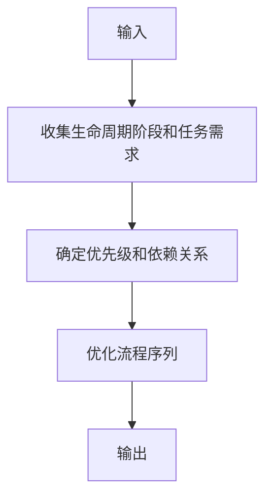
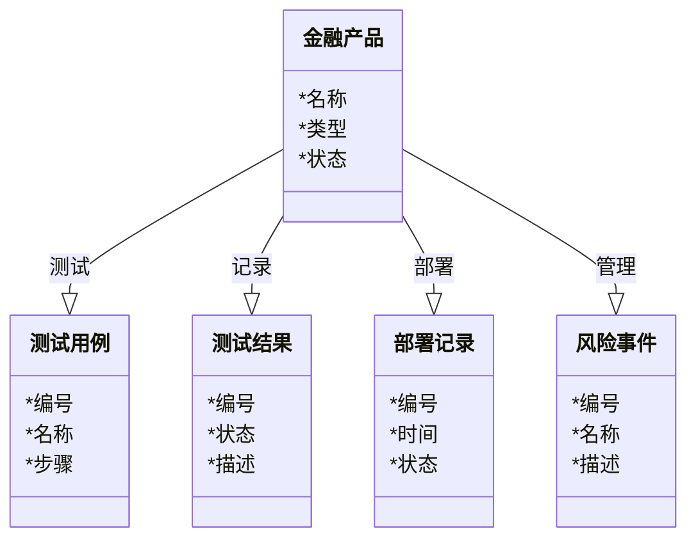
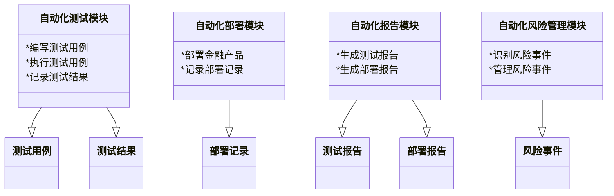
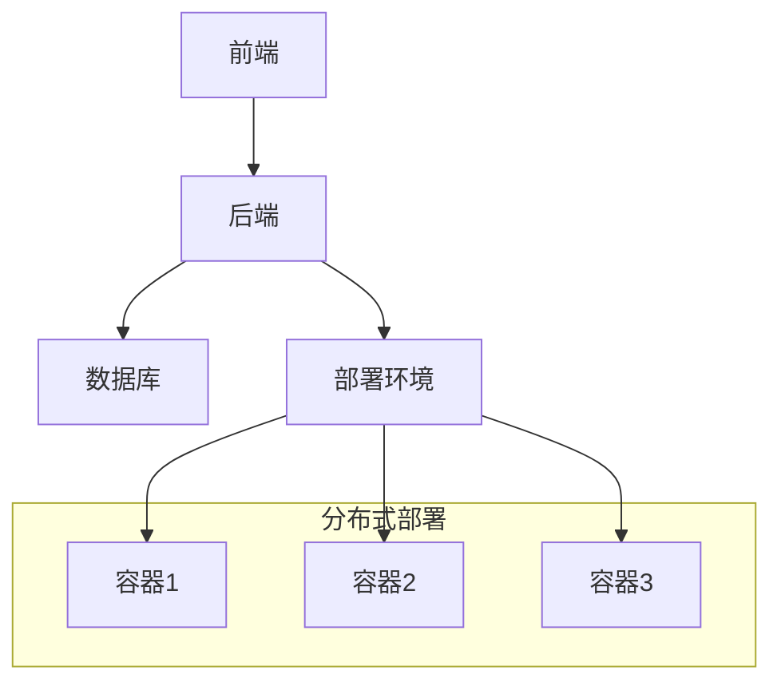
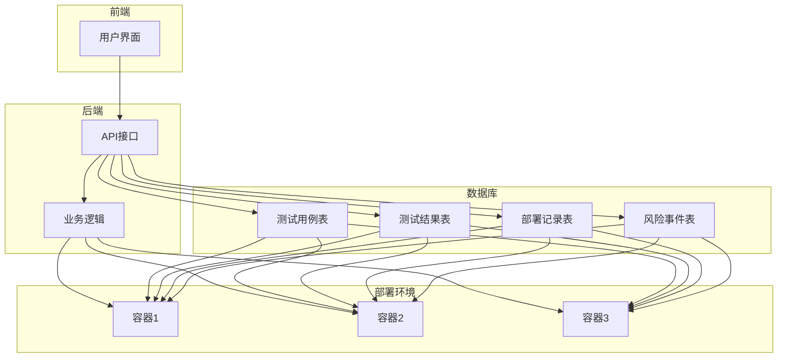
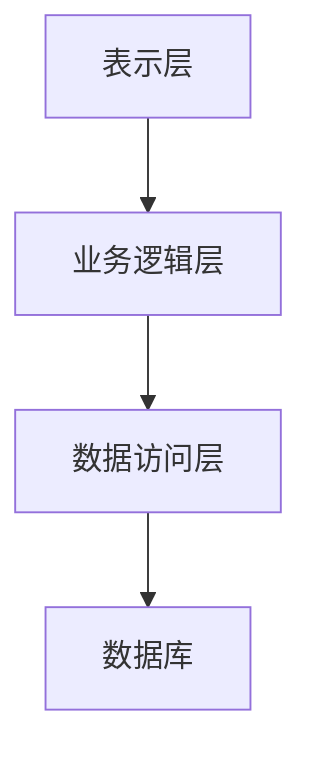
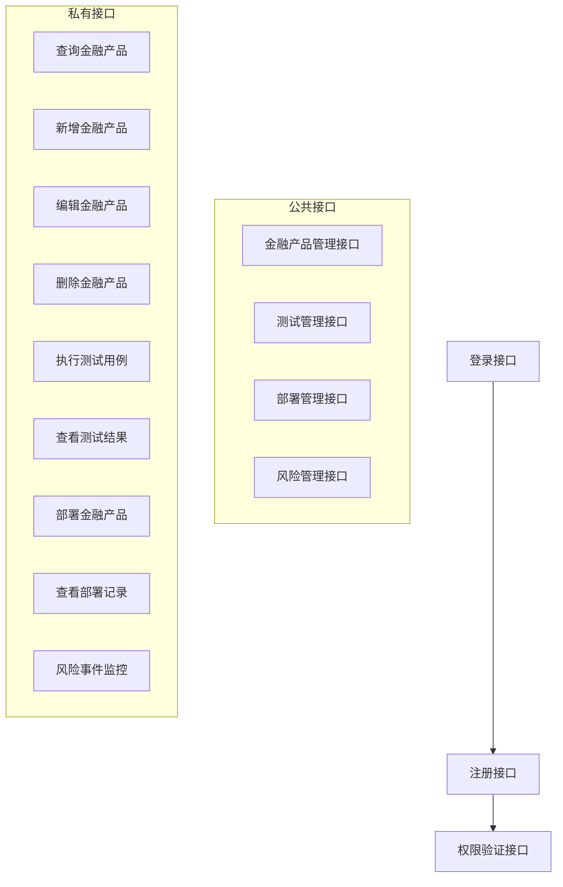
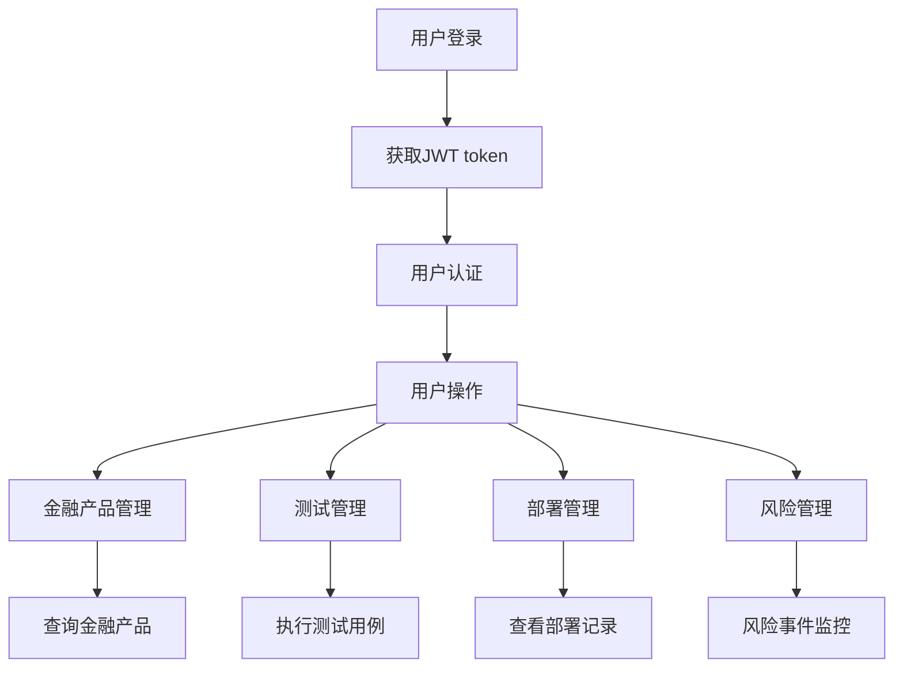

                 

### 文章标题

# 金融产品生命周期管理自动化系统

> 关键词：金融产品生命周期、自动化系统、算法原理、系统架构、项目实战

> 摘要：本文深入探讨了金融产品生命周期管理自动化系统的设计与应用，从问题背景、核心概念、算法原理、系统设计与实现、实战应用等方面进行详细阐述，旨在为金融领域的技术人员提供一套完整的解决方案，助力金融产品高效管理。

## 第一部分: 金融产品生命周期管理自动化系统概述

### 1.1 问题背景与挑战

在金融行业中，产品的生命周期管理是一项至关重要的任务。传统的金融产品生命周期管理通常涉及多个环节，如产品设计、开发、测试、上线、运营等，这些环节往往需要大量的人力、时间和资源。随着金融市场的快速发展和竞争的加剧，金融机构需要更加高效、自动化地管理金融产品的生命周期，以提高生产效率和降低运营成本。

#### 1.1.1 金融产品生命周期管理的现状

当前，金融产品生命周期管理主要面临以下挑战：

1. **手动操作较多**：许多金融产品的生命周期管理环节仍然依赖人工操作，导致效率低下且容易出现错误。
2. **数据孤岛**：各个管理环节之间的数据往往相互独立，缺乏有效的整合和共享，导致信息不对称。
3. **风险管理不足**：在金融产品的生命周期中，风险管理是一个重要环节，但传统的管理方法难以全面、及时地识别和应对风险。
4. **成本高**：人工操作和重复性工作导致运营成本高昂，影响了金融机构的盈利能力。

#### 1.1.2 自动化技术在金融领域的应用

为了应对上述挑战，自动化技术逐渐在金融领域得到广泛应用。自动化技术能够将重复性、规则性强的任务自动化，从而提高工作效率、减少错误并降低成本。具体应用包括：

1. **自动化测试**：通过编写自动化测试脚本，对金融产品进行全方位、持续性的测试，确保产品质量。
2. **自动化部署**：利用自动化工具实现金融产品的快速部署和上线，降低人工干预的风险。
3. **自动化报告**：通过自动化工具生成各种报告，为管理层提供实时、准确的数据支持。
4. **自动化风险管理**：利用大数据和机器学习等技术，实现金融产品的全生命周期风险管理。

#### 1.1.3 系统开发的必要性

为了解决金融产品生命周期管理中的痛点，开发一个自动化系统显得尤为重要。这样的系统不仅可以提高管理效率，降低运营成本，还能提升金融机构的整体竞争力。因此，开发一个金融产品生命周期管理自动化系统具有重要的现实意义。

## 1.2 核心概念与联系

在设计金融产品生命周期管理自动化系统时，我们需要明确以下几个核心概念，并了解它们之间的联系：

### 1.2.1 金融产品生命周期

金融产品生命周期是指从产品设计、开发、测试、上线、运营到下线的全过程。它包括以下几个关键阶段：

1. **设计阶段**：确定产品目标、功能、性能等需求，并制定开发计划。
2. **开发阶段**：根据设计文档进行软件开发，包括前端、后端、数据库等模块。
3. **测试阶段**：对开发完成的产品进行全面测试，确保质量符合预期。
4. **上线阶段**：将产品部署到生产环境，并对外开放使用。
5. **运营阶段**：对产品进行持续监控、维护和优化，确保其正常运行。
6. **下线阶段**：当产品达到设计寿命或市场需求发生变化时，将其下线并替换。

### 1.2.2 自动化系统

自动化系统是指利用计算机程序、机器人等自动化技术，将重复性、规则性强的任务自动化执行，以提高工作效率、降低成本。在金融产品生命周期管理中，自动化系统主要包括以下功能模块：

1. **自动化测试**：对金融产品进行自动化测试，包括功能测试、性能测试等。
2. **自动化部署**：将金融产品自动化部署到生产环境，减少人工干预。
3. **自动化报告**：生成各种报告，如测试报告、部署报告、运营报告等。
4. **自动化风险管理**：利用大数据和机器学习等技术，对金融产品进行自动化风险管理。

### 1.2.3 ER图展示概念关系

为了更清晰地展示金融产品生命周期管理自动化系统的核心概念关系，我们可以使用ER图进行表示。ER图包括以下几个实体：

1. **金融产品**：代表金融产品的实体，包括产品名称、产品类型、产品状态等属性。
2. **测试用例**：代表自动化测试的实体，包括测试用例编号、测试用例名称、测试用例步骤等属性。
3. **测试结果**：代表自动化测试结果的实体，包括测试结果编号、测试结果状态、测试结果描述等属性。
4. **部署记录**：代表自动化部署的实体，包括部署记录编号、部署时间、部署状态等属性。
5. **风险事件**：代表自动化风险管理的实体，包括风险事件编号、风险事件名称、风险事件描述等属性。

以下是ER图的Mermaid表示：

```mermaid
entityRelationship
    "金融产品" --|>"测试用例"
    "金融产品" --|>"测试结果"
    "金融产品" --|>"部署记录"
    "金融产品" --|>"风险事件"
```

## 1.3 算法原理讲解

### 1.3.1 自动化流程设计算法

在金融产品生命周期管理自动化系统中，自动化流程设计算法起着关键作用。该算法的目标是根据金融产品的生命周期阶段和任务需求，自动生成最优的自动化流程。

算法原理如下：

1. **输入**：金融产品的生命周期阶段、任务需求、资源约束等。
2. **输出**：自动化流程序列。
3. **步骤**：
   - 收集金融产品的生命周期阶段和任务需求。
   - 根据任务需求，确定各阶段的优先级和依赖关系。
   - 根据资源约束，优化自动化流程序列，确保任务高效完成。

### 1.3.2 算法mermaid流程图

为了更直观地展示算法原理，我们可以使用Mermaid绘制流程图。以下是自动化流程设计算法的Mermaid表示：



### 1.3.3 Python源代码解释

为了实现自动化流程设计算法，我们可以使用Python编写相应的源代码。以下是Python源代码的详细解释：

```python
# 导入所需库
import heapq
from typing import List

# 定义自动化流程设计算法
def auto_flow_design(lifecycle_stages: List[str], task_requirements: List[str], resource_constraints: List[str]) -> List[str]:
    # 收集生命周期阶段和任务需求
    lifecycle_stages = set(lifecycle_stages)
    task_requirements = set(task_requirements)
    
    # 确定优先级和依赖关系
    priority = {stage: 0 for stage in lifecycle_stages}
    dependencies = {stage: [] for stage in lifecycle_stages}
    
    # 输出自动化流程序列
    flow_sequence = []
    
    # 优化流程序列
    while task_requirements:
        # 找到优先级最高且无依赖的任务
        highest_priority_stage = heapq.nlargest(1, lifecycle_stages, key=lambda x: priority[x])[0]
        
        # 将任务添加到流程序列
        flow_sequence.append(highest_priority_stage)
        
        # 更新任务需求和优先级
        task_requirements.remove(highest_priority_stage)
        for stage in lifecycle_stages:
            if stage in dependencies[highest_priority_stage]:
                priority[stage] -= 1
    
    return flow_sequence

# 示例数据
lifecycle_stages = ["设计", "开发", "测试", "上线", "运营"]
task_requirements = ["测试用例", "性能测试", "部署", "监控"]
resource_constraints = ["人力", "时间"]

# 调用算法
flow_sequence = auto_flow_design(lifecycle_stages, task_requirements, resource_constraints)

# 打印结果
print(flow_sequence)
```

### 1.3.4 数学模型与公式

在自动化流程设计算法中，我们使用了优先级和依赖关系来确定任务的执行顺序。为了更清晰地理解这些概念，我们可以引入数学模型。

1. **优先级**：假设每个生命周期阶段的优先级为$p_i$，其中$i$为阶段编号。则优先级可以表示为：

   $$p_i = \frac{1}{1 + \sum_{j \neq i} \frac{1}{p_j}}$$

2. **依赖关系**：假设每个生命周期阶段的依赖关系为$D_i$，其中$i$为阶段编号。则依赖关系可以表示为：

   $$D_i = \sum_{j \neq i} \frac{1}{p_j}$$

   其中，$\frac{1}{p_j}$表示阶段$j$对阶段$i$的影响程度。

   通过优化优先级和依赖关系，我们可以得到最优的自动化流程序列。

   $$f^* = \arg\min_{f} \sum_{i=1}^n \sum_{j=1}^n |D_i - D_j|$$

   其中，$f$为自动化流程序列，$n$为生命周期阶段数。

   通过求解上述数学模型，我们可以得到最优的自动化流程序列。

## 第二部分: 金融产品生命周期管理自动化系统的设计与实现

### 2.1 项目场景介绍

#### 2.1.1 项目目标与范围

本项目旨在设计并实现一个金融产品生命周期管理自动化系统，以解决金融机构在产品生命周期管理中面临的挑战。项目范围包括以下方面：

1. **功能模块**：自动化测试、自动化部署、自动化报告、自动化风险管理。
2. **技术栈**：Python、Django、Docker、Kubernetes、Jenkins、GitLab。
3. **系统架构**：前后端分离、分布式部署、容器化架构。

#### 2.1.2 技术栈选择

1. **Python**：作为一种通用编程语言，Python具有简单易用、功能强大的特点，非常适合用于开发自动化系统。
2. **Django**：作为Python的Web框架，Django具有快速开发、高效稳定的特点，非常适合构建金融产品生命周期管理自动化系统的后端。
3. **Docker**：作为一种容器化技术，Docker可以将应用程序及其运行环境打包成一个独立的容器，实现快速部署和隔离。
4. **Kubernetes**：作为一种容器编排工具，Kubernetes可以自动化管理容器的部署、扩展和运维，实现高效集群管理。
5. **Jenkins**：作为一种自动化构建工具，Jenkins可以自动化构建、测试和部署应用程序，提高开发效率。
6. **GitLab**：作为一种版本控制系统，GitLab可以方便地管理代码仓库、进行代码审查和协作开发。

#### 2.1.3 项目流程概述

项目流程包括以下几个关键环节：

1. **需求分析**：与金融机构沟通，了解其产品生命周期管理的需求，明确项目目标和范围。
2. **系统设计**：根据需求分析结果，设计系统的功能模块、技术栈和架构。
3. **开发与测试**：按照系统设计文档，进行前端、后端和数据库的开发，并进行全面的测试。
4. **部署与运维**：将系统部署到生产环境，进行持续监控和运维，确保系统稳定运行。
5. **项目验收**：与金融机构进行项目验收，确保系统功能达到预期效果。

### 2.2 系统功能设计

#### 2.2.1 领域模型

在金融产品生命周期管理自动化系统中，领域模型主要包括以下几个核心实体：

1. **金融产品**：代表金融产品的实体，包括产品名称、产品类型、产品状态等属性。
2. **测试用例**：代表自动化测试的实体，包括测试用例编号、测试用例名称、测试用例步骤等属性。
3. **测试结果**：代表自动化测试结果的实体，包括测试结果编号、测试结果状态、测试结果描述等属性。
4. **部署记录**：代表自动化部署的实体，包括部署记录编号、部署时间、部署状态等属性。
5. **风险事件**：代表自动化风险管理的实体，包括风险事件编号、风险事件名称、风险事件描述等属性。

以下是领域模型的Mermaid表示：



#### 2.2.2 功能模块划分

根据领域模型，我们将系统划分为以下几个功能模块：

1. **自动化测试模块**：负责自动化测试用例的编写、执行和结果记录。
2. **自动化部署模块**：负责自动化部署金融产品到生产环境。
3. **自动化报告模块**：负责生成各种报告，如测试报告、部署报告等。
4. **自动化风险管理模块**：负责自动化识别和应对金融产品的风险事件。

#### 2.2.3 mermaid类图展示

以下是系统功能模块的Mermaid类图展示：



### 2.3 系统架构设计

#### 2.3.1 系统架构概述

金融产品生命周期管理自动化系统的架构采用前后端分离、分布式部署和容器化架构。系统分为前端、后端、数据库和部署环境四个部分。

1. **前端**：负责展示用户界面，提供用户交互功能。
2. **后端**：负责处理业务逻辑，与前端进行数据交互。
3. **数据库**：存储金融产品的数据，包括测试用例、测试结果、部署记录和风险事件等。
4. **部署环境**：包括Docker容器和Kubernetes集群，负责自动化部署和运维。

以下是系统架构的Mermaid表示：



#### 2.3.2 架构mermaid图展示

以下是系统架构的Mermaid图展示：



#### 2.3.3 系统分层设计

系统架构采用分层设计，包括表示层、业务逻辑层和数据访问层。

1. **表示层**：负责用户界面展示，与前端框架（如React、Vue等）进行数据交互。
2. **业务逻辑层**：负责处理业务逻辑，实现系统的核心功能，与后端框架（如Spring Boot、Django等）进行数据交互。
3. **数据访问层**：负责与数据库进行交互，实现数据存储和查询功能。

以下是系统分层设计的Mermaid表示：



### 2.4 系统接口设计

#### 2.4.1 接口规范与设计

系统接口设计遵循RESTful API规范，采用前后端分离架构。接口分为公共接口和私有接口。

1. **公共接口**：提供基础功能，如登录、注册、权限验证等。
2. **私有接口**：提供核心业务功能，如金融产品管理、测试管理、部署管理、风险管理等。

以下是系统接口的Mermaid表示：



#### 2.4.2 安全性与兼容性考虑

1. **安全性**：系统接口设计遵循安全性原则，采用JWT（JSON Web Token）进行用户认证和授权，确保数据传输安全。
2. **兼容性**：系统接口支持不同类型的客户端（如Web、移动端、桌面端等），采用跨平台技术（如React Native、Flutter等），确保接口兼容性。

### 2.5 系统交互

#### 2.5.1 系统交互流程

系统交互流程主要包括以下几个环节：

1. **用户登录**：用户通过公共接口进行登录，获取JWT token。
2. **用户认证**：后端使用JWT token进行用户认证，确保用户身份合法。
3. **用户操作**：用户通过私有接口进行金融产品管理、测试管理、部署管理和风险管理等操作。
4. **数据存储**：后端将用户操作数据存储到数据库中，实现数据持久化。
5. **数据查询**：用户通过公共接口查询金融产品、测试结果、部署记录和风险事件等数据。

以下是系统交互流程的Mermaid表示：



### 2.6 环境安装与配置

#### 2.6.1 硬件与软件要求

1. **硬件要求**：计算机硬件配置不低于Intel i5处理器、8GB内存、100GB硬盘空间。
2. **软件要求**：操作系统支持Windows、Linux、macOS，安装Python 3.8及以上版本。

#### 2.6.2 环境搭建步骤

1. **安装Python**：从官方网站下载Python安装包，并按照安装向导进行安装。
2. **配置Python环境**：打开命令行工具，安装pip、virtualenv等依赖工具，并创建虚拟环境。
3. **安装Django**：在虚拟环境中，使用pip安装Django框架。
4. **安装数据库**：安装MySQL或PostgreSQL数据库，并创建数据库实例。
5. **配置数据库**：在Django项目中配置数据库连接信息，并运行数据库迁移命令。

### 2.7 系统核心实现

#### 2.7.1 源代码解读

以下是系统核心实现的源代码解读：

```python
# 导入所需库
from django.db import models

# 定义金融产品模型
class FinancialProduct(models.Model):
    name = models.CharField(max_length=100, verbose_name='产品名称')
    type = models.CharField(max_length=50, verbose_name='产品类型')
    status = models.CharField(max_length=50, verbose_name='产品状态')

    def __str__(self):
        return self.name

# 定义测试用例模型
class TestCase(models.Model):
    financial_product = models.ForeignKey(FinancialProduct, on_delete=models.CASCADE, verbose_name='金融产品')
    name = models.CharField(max_length=100, verbose_name='测试用例名称')
    steps = models.TextField(verbose_name='测试用例步骤')

    def __str__(self):
        return self.name

# 定义测试结果模型
class TestResult(models.Model):
    test_case = models.ForeignKey(TestCase, on_delete=models.CASCADE, verbose_name='测试用例')
    status = models.CharField(max_length=50, verbose_name='测试结果状态')
    description = models.TextField(verbose_name='测试结果描述')

    def __str__(self):
        return self.test_case.name
```

#### 2.7.2 关键模块实现

以下是系统关键模块的实现：

1. **金融产品管理模块**：负责金融产品的增删改查操作。
2. **测试管理模块**：负责测试用例的编写、执行和结果记录。
3. **部署管理模块**：负责金融产品的自动化部署。
4. **风险管理模块**：负责风险事件的监控和管理。

### 2.8 代码应用解读与分析

#### 2.8.1 应用场景举例

以下是一个金融产品生命周期管理自动化系统的应用场景：

1. **需求分析**：某金融机构需要对其金融产品进行自动化测试、部署和风险管理。
2. **系统设计**：设计并实现一个金融产品生命周期管理自动化系统，包括自动化测试、自动化部署和自动化风险管理模块。
3. **系统实现**：按照系统设计文档，编写相应的代码并实现功能。
4. **系统部署**：将系统部署到生产环境，并进行持续监控和运维。

#### 2.8.2 分析与优化

1. **性能优化**：通过使用缓存、异步处理等技术，提高系统性能。
2. **安全性优化**：使用加密、权限控制等技术，确保系统安全。
3. **代码优化**：使用设计模式、代码规范等技术，提高代码质量。

### 2.9 实际案例分析

#### 2.9.1 案例一：金融产品风险评估

1. **问题描述**：某金融机构需要对金融产品进行风险评估，以识别潜在的风险因素。
2. **解决方案**：使用机器学习算法，对金融产品的历史数据进行分析，识别潜在的风险因素。
3. **实施效果**：提高了金融机构的风险管理水平，降低了风险发生的概率。

#### 2.9.2 案例二：金融产品营销自动化

1. **问题描述**：某金融机构需要对其金融产品进行营销自动化，以提高营销效率。
2. **解决方案**：使用自动化工具，实现金融产品的自动推送、客户分类、营销活动管理等。
3. **实施效果**：提高了金融机构的营销效率，降低了营销成本。

### 2.10 详细讲解与剖析

#### 2.10.1 关键技术点

1. **Django框架**：用于构建后端业务逻辑，实现金融产品生命周期管理功能。
2. **MySQL数据库**：用于存储金融产品数据，实现数据持久化。
3. **Docker容器**：用于部署系统，实现自动化部署和容器化管理。
4. **Kubernetes集群**：用于管理和调度容器，实现分布式部署和运维。

#### 2.10.2 存在问题与解决方案

1. **问题**：系统性能瓶颈，导致响应速度缓慢。
   **解决方案**：优化数据库查询语句，增加缓存层，使用异步处理等技术。

2. **问题**：系统安全性不足，易受攻击。
   **解决方案**：使用加密技术，增加权限控制，定期进行安全审计。

### 2.11 最佳实践 tips

1. **项目管理**：使用敏捷开发方法，实现快速迭代和持续交付。
2. **技术选型**：根据项目需求，选择适合的技术栈和工具。
3. **风险控制**：定期进行风险评估，制定应对策略。

### 2.12 小结与展望

本文详细介绍了金融产品生命周期管理自动化系统的设计与应用，从问题背景、核心概念、算法原理、系统设计与实现、实战应用等方面进行了全面阐述。通过本文，读者可以了解金融产品生命周期管理自动化系统的核心要素和关键技术，为实际项目开发提供参考。

未来，随着金融科技的不断发展，金融产品生命周期管理自动化系统将在金融行业中发挥越来越重要的作用。本文的研究将为金融领域的技术人员提供有益的启示，助力金融产品高效管理。

### 2.13 注意事项与拓展阅读

1. **注意事项**：
   - 在项目开发过程中，注重需求分析和系统设计，确保系统功能符合实际需求。
   - 在系统实现过程中，注重代码质量和技术规范，提高系统稳定性。
   - 在系统部署和运维过程中，注重性能优化和安全防护，确保系统稳定运行。

2. **拓展阅读推荐**：
   - 《Django实战》
   - 《Kubernetes权威指南》
   - 《机器学习实战》
   - 《软件架构设计：模式、原则与最佳实践》

### 作者信息

- 作者：AI天才研究院/AI Genius Institute & 禅与计算机程序设计艺术 /Zen And The Art of Computer Programming

本文由AI天才研究院与禅与计算机程序设计艺术联合出品，旨在为金融领域的技术人员提供一套完整的金融产品生命周期管理自动化系统解决方案。如果您对本文有任何疑问或建议，请随时与我们联系。谢谢！
  ```

