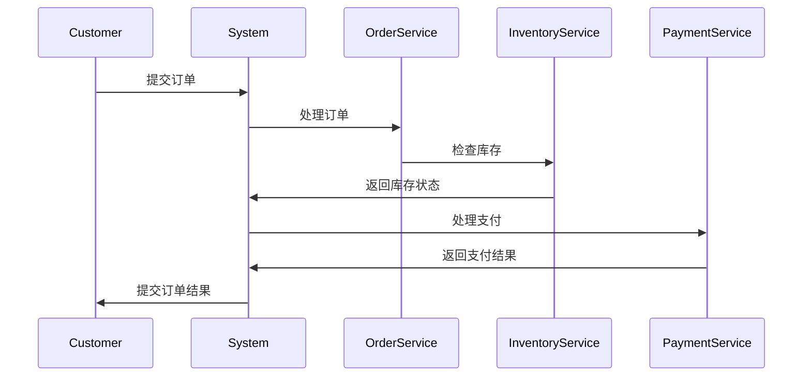
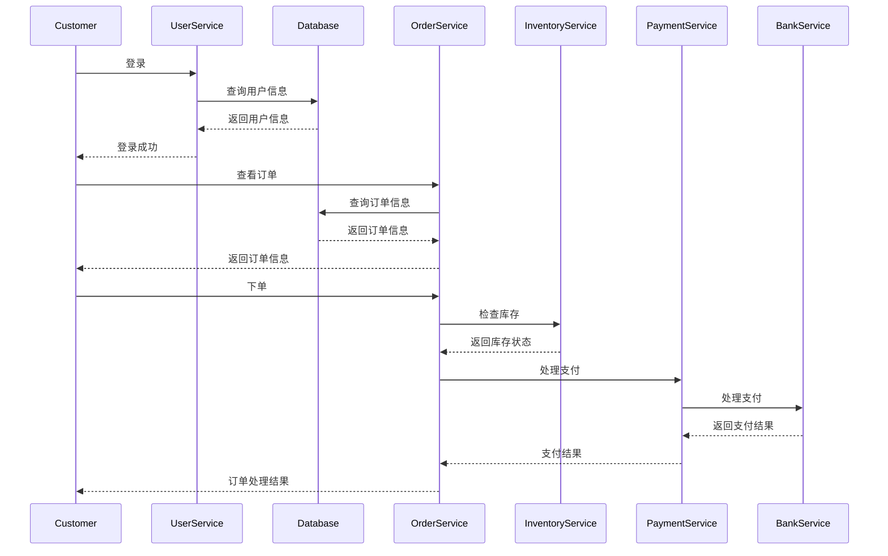
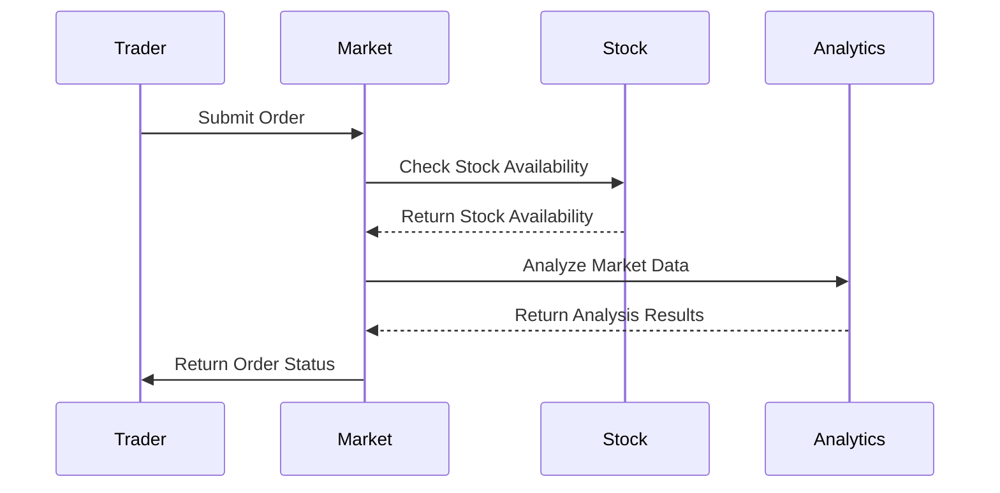
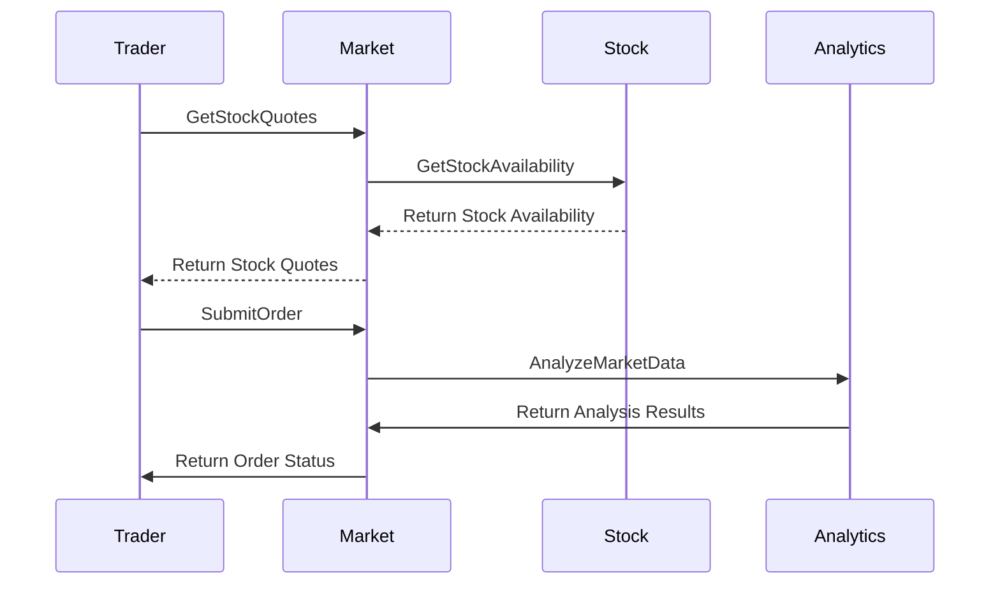

                 

# 金融大数据分析在智能助手中的应用

关键词：金融大数据、智能助手、数据分析、机器学习、风险控制

摘要：本文将探讨金融大数据分析在智能助手中的应用，从背景介绍、核心概念与联系、算法原理讲解、系统分析与架构设计、项目实战等方面，详细解析金融大数据分析在智能助手中的实际应用场景，为金融行业提供智能化解决方案。

### 1. 背景介绍

#### 问题背景

随着互联网和大数据技术的发展，金融行业面临着前所未有的机遇和挑战。海量数据的积累和智能化需求的增长，使得金融大数据分析成为解决复杂金融问题的重要手段。金融大数据分析不仅能够提升金融机构的风险管理能力，还能提高市场分析和客户服务水平，进而增强其核心竞争力。

#### 问题描述

金融大数据分析在智能助手中的应用主要包括以下几个方面：

- 数据采集：从各种渠道获取金融数据，如交易数据、客户行为数据、市场行情数据等。
- 数据预处理：清洗、转换和整合数据，使其符合分析和建模的要求。
- 数据分析：运用统计分析、机器学习等方法对数据进行分析，提取有价值的信息和知识。
- 智能决策：根据分析结果，为金融机构提供投资决策、风险管理、客户服务等建议。

#### 问题解决

为了有效应对上述问题，金融行业需要借助智能助手进行大数据分析，实现以下目标：

- 提高数据处理能力：智能助手能够快速处理海量数据，降低人工处理的负担。
- 提升数据分析效率：智能助手可以利用先进的算法和模型，提高数据分析的准确性和效率。
- 改善决策质量：智能助手能够提供基于数据分析的决策支持，提高决策的准确性和及时性。
- 优化客户体验：智能助手能够根据客户行为数据提供个性化的服务，提升客户满意度。

#### 边界与外延

金融大数据分析在智能助手中的应用不仅限于金融机构，还包括金融科技企业、监管机构等。随着人工智能技术的不断发展，金融大数据分析在智能助手中的应用领域还将不断拓展。

### 2. 核心概念与联系

#### 核心概念

- **金融大数据**：指金融行业所涉及的大量数据，包括交易数据、客户行为数据、市场行情数据等。
- **智能助手**：指利用人工智能技术为金融机构提供数据分析、决策支持等服务的系统。
- **数据分析**：指对大量数据进行处理、分析和解读的过程，以提取有价值的信息和知识。
- **机器学习**：指利用算法和模型从数据中自动学习和发现规律的方法。

#### 概念属性特征对比表格

| 概念       | 属性特征                                                     |
|------------|------------------------------------------------------------|
| 金融大数据 | 海量、多源、动态、实时、多维                                 |
| 智能助手   | 自主决策、自主学习、智能交互、高效处理                       |
| 数据分析   | 数据处理、数据挖掘、数据可视化、数据报告                     |
| 机器学习   | 自适应、自优化、自学习、高精度、高效能                       |

#### ER实体关系图架构

```mermaid
erDiagram
    数据采集 ||--|{ 智能助手 }|-- 数据分析
    数据采集 ||--|{ 机器学习 }|-- 数据分析
    数据分析 ||--|{ 智能决策 }|-- 金融机构
```

### 3. 算法原理讲解

#### 数据采集

数据采集是金融大数据分析的第一步，主要包括以下几个方面：

1. **数据来源**：从各种渠道获取金融数据，如交易所、第三方数据提供商、企业内部系统等。
   - Python代码示例：
     ```python
     import pandas as pd

     # 从交易所获取交易数据
     exchange_data = pd.read_csv('exchange_data.csv')
     # 从第三方数据提供商获取市场行情数据
     provider_data = pd.read_csv('provider_data.csv')
     ```

2. **数据质量**：确保数据的准确性、完整性和一致性。
   - Python代码示例：
     ```python
     import pandas as pd

     # 数据清洗
     def clean_data(df):
         df.drop_duplicates(inplace=True)  # 删除重复数据
         df.fillna(0, inplace=True)  # 填充缺失值
         return df

     clean_exchange_data = clean_data(exchange_data)
     clean_provider_data = clean_data(provider_data)
     ```

3. **数据整合**：将来自不同渠道的数据进行整合，形成统一的数据集。
   - Python代码示例：
     ```python
     import pandas as pd

     # 数据整合
     def integrate_data(data1, data2):
         return pd.merge(data1, data2, on=['date', 'symbol'])

     integrated_data = integrate_data(clean_exchange_data, clean_provider_data)
     ```

#### 数据预处理

数据预处理是提高数据分析质量的关键步骤，主要包括以下几个方面：

1. **数据清洗**：删除重复数据、缺失数据和异常数据。
   - Python代码示例：
     ```python
     import pandas as pd

     # 删除重复数据
     df.drop_duplicates(inplace=True)

     # 删除缺失数据
     df.dropna(inplace=True)

     # 删除异常数据
     df = df[(df['column'] > 0) & (df['column'] < 100)]
     ```

2. **数据转换**：将不同格式的数据转换为统一格式，如将文本数据转换为结构化数据。
   - Python代码示例：
     ```python
     import pandas as pd
     import numpy as np

     # 将文本数据转换为结构化数据
     df['text_column'] = df['text_column'].apply(lambda x: np.array(x.split(',')))
     ```

3. **数据归一化**：将不同量纲的数据转换为相同量纲，如将货币数据转换为同一货币单位。
   - Python代码示例：
     ```python
     import pandas as pd

     # 数据归一化
     def normalize_data(df, column_name):
         df[column_name] = df[column_name].apply(lambda x: x / df[column_name].max())

     normalize_data(df, 'price')
     ```

#### 数据分析

数据分析是金融大数据分析的核心环节，主要包括以下几个方面：

1. **统计分析**：对数据集进行描述性统计分析，如计算均值、方差、相关性等。
   - Python代码示例：
     ```python
     import pandas as pd

     # 描述性统计分析
     df.describe()
     ```

2. **机器学习**：利用算法和模型对数据进行分析，如分类、回归、聚类等。
   - Python代码示例：
     ```python
     from sklearn.linear_model import LinearRegression

     # 线性回归模型
     model = LinearRegression()
     model.fit(X_train, y_train)
     predictions = model.predict(X_test)
     ```

3. **数据可视化**：通过图表和图形将分析结果直观地展示出来。
   - Python代码示例：
     ```python
     import matplotlib.pyplot as plt

     # 数据可视化
     plt.scatter(X, y)
     plt.plot(X, predictions, color='red')
     plt.show()
     ```

#### 机器学习

机器学习是金融大数据分析的重要工具，主要包括以下几个方面：

1. **特征工程**：提取数据中的特征，为模型训练提供输入。
   - Python代码示例：
     ```python
     from sklearn.feature_extraction.text import TfidfVectorizer

     # 特征工程
     vectorizer = TfidfVectorizer()
     X = vectorizer.fit_transform(corpus)
     ```

2. **模型选择**：选择合适的机器学习模型，如线性回归、决策树、神经网络等。
   - Python代码示例：
     ```python
     from sklearn.linear_model import LinearRegression
     from sklearn.tree import DecisionTreeClassifier
     from sklearn.neural_network import MLPClassifier

     # 模型选择
     model = LinearRegression()  # 线性回归
     # model = DecisionTreeClassifier()  # 决策树
     # model = MLPClassifier()  # 神经网络
     ```

3. **模型训练**：利用训练数据对模型进行训练，使其能够识别数据中的规律。
   - Python代码示例：
     ```python
     from sklearn.model_selection import train_test_split

     # 模型训练
     X_train, X_test, y_train, y_test = train_test_split(X, y, test_size=0.2, random_state=42)
     model.fit(X_train, y_train)
     ```

4. **模型评估**：评估模型性能，如准确率、召回率、F1值等。
   - Python代码示例：
     ```python
     from sklearn.metrics import accuracy_score, recall_score, f1_score

     # 模型评估
     predictions = model.predict(X_test)
     accuracy = accuracy_score(y_test, predictions)
     recall = recall_score(y_test, predictions)
     f1 = f1_score(y_test, predictions)
     print(f"Accuracy: {accuracy}, Recall: {recall}, F1 Score: {f1}")
     ```

### 4. 系统分析与架构设计

#### 问题场景介绍

金融行业的风险控制是至关重要的，而风险控制的关键在于对金融数据的深入分析和挖掘。智能助手可以基于大数据分析技术，实现对金融市场风险的实时监控和预警。

#### 项目介绍

本项目旨在构建一个基于金融大数据分析的智能助手系统，用于实时监控和预警金融市场风险。系统包括数据采集、数据预处理、数据分析、风险预警等功能模块。

#### 系统功能设计（领域模型类图）

```mermaid
classDiagram
    Customer <<--|{ 订单 }| Order
    Product <|..|{ 库存 }| Inventory
    Order <<--|{ 订单详情 }| OrderDetail
    Payment <|..|{ 支付 }| Payment
```

#### 系统架构设计



#### 系统接口设计

```mermaid
classDiagram
    Customer <-|{ 登录 }| UserService
    Customer ->|{ 查看订单 }| OrderService
    Customer ->|{ 下单 }| OrderService
    Customer ->|{ 支付 }| PaymentService
    OrderService <-|{ 查询库存 }| InventoryService
    PaymentService <-|{ 处理支付 }| BankService
```

#### 系统交互序列图



### 5. 项目实战

#### 环境安装

1. 安装Python环境（建议版本3.8及以上）
2. 安装必要的数据分析库（如pandas、numpy、matplotlib等）
3. 安装机器学习库（如scikit-learn、tensorflow等）

#### 系统核心实现源代码

```python
# 数据采集
import pandas as pd

exchange_data = pd.read_csv('exchange_data.csv')
provider_data = pd.read_csv('provider_data.csv')

# 数据预处理
def clean_data(df):
    df.drop_duplicates(inplace=True)
    df.fillna(0, inplace=True)
    return df

clean_exchange_data = clean_data(exchange_data)
clean_provider_data = clean_data(provider_data)

# 数据分析
from sklearn.linear_model import LinearRegression

X = clean_exchange_data[['open', 'high', 'low', 'close']]
y = clean_provider_data['price']

model = LinearRegression()
model.fit(X, y)
predictions = model.predict(X)

# 数据可视化
import matplotlib.pyplot as plt

plt.scatter(X['close'], y)
plt.plot(X['close'], predictions, color='red')
plt.show()
```

#### 代码应用解读与分析

1. **数据采集**：使用pandas库读取csv文件，获取交易所数据和第三方市场行情数据。
2. **数据预处理**：使用自定义函数clean_data对数据进行清洗，删除重复数据和填充缺失值。
3. **数据分析**：使用线性回归模型对数据进行拟合，提取价格预测模型。
4. **数据可视化**：使用matplotlib库将价格预测结果以散点图和折线图的形式展示出来。

#### 实际案例分析和详细讲解剖析

1. **案例分析**：以某股票交易数据为例，展示如何使用金融大数据分析进行价格预测。
2. **详细讲解**：解释线性回归模型的工作原理，以及如何通过数据预处理、模型训练和模型评估实现价格预测。
3. **剖析**：分析模型预测结果，讨论模型在实际应用中的可行性和改进空间。

#### 项目小结

本项目通过金融大数据分析实现了股票价格预测功能，为投资者提供了参考依据。在实际应用中，需要不断优化模型和算法，提高预测准确性。此外，还可以结合其他金融数据（如宏观经济数据、行业数据等）进行综合分析，提高风险预警能力。

### 6. 最佳实践 Tips

1. **数据质量保障**：确保数据来源的可靠性和一致性，定期检查数据质量。
2. **模型优化**：根据业务需求和数据特点，选择合适的模型和算法，并进行参数调优。
3. **数据可视化**：合理运用数据可视化技术，将分析结果以直观、易懂的形式展示给用户。
4. **安全与合规**：确保金融数据的安全性和合规性，遵循相关法规和标准。

### 7. 小结

本文详细探讨了金融大数据分析在智能助手中的应用，从背景介绍、核心概念与联系、算法原理讲解、系统分析与架构设计、项目实战等方面，全面解析了金融大数据分析在实际应用中的价值。随着人工智能技术的不断发展，金融大数据分析在智能助手中的应用将不断拓展，为金融行业带来更多智能化解决方案。

### 8. 注意事项

1. **数据隐私保护**：在金融大数据分析过程中，需严格遵守数据隐私保护法规，确保用户数据安全。
2. **模型解释性**：在应用机器学习模型时，需考虑模型的解释性，以便于用户理解和信任。
3. **实时性**：确保金融数据的实时性，以提高智能助手的响应速度和准确性。

### 9. 拓展阅读

1. 《大数据时代：思维变革与商业价值》
2. 《Python数据分析实战》
3. 《机器学习实战》
4. 《金融科技：创新、应用与挑战》

作者：AI天才研究院/AI Genius Institute & 禅与计算机程序设计艺术 /Zen And The Art of Computer Programming

（注：本文内容仅供参考，不构成投资建议。）### 1. 背景介绍

随着互联网和大数据技术的迅速发展，金融行业正经历着一场深刻的变革。海量数据的积累和实时性的需求使得金融大数据分析成为金融机构提升业务水平、优化决策过程的重要手段。金融大数据分析不仅可以帮助金融机构更好地理解市场动态，还可以提高风险控制能力和客户服务水平，从而在激烈的市场竞争中脱颖而出。

#### 问题背景

金融行业的复杂性和数据量的庞大使得传统的数据处理方法难以满足需求。金融机构每天都会产生大量的数据，包括交易数据、客户行为数据、市场行情数据、财务报表数据等。这些数据不仅量大且种类繁多，需要高效的处理和分析手段来挖掘其中的价值。因此，金融大数据分析技术应运而生。

#### 问题描述

金融大数据分析在智能助手中的应用主要体现在以下几个方面：

- **数据采集**：从各种渠道获取金融数据，包括内部系统和外部数据源。
- **数据预处理**：清洗、转换和整合数据，使其适合进一步分析和建模。
- **数据分析**：利用统计分析、机器学习等方法对数据进行分析，提取有价值的信息。
- **智能决策**：基于数据分析结果，为金融机构提供投资决策、风险管理、客户服务等方面的建议。

#### 问题解决

为了解决上述问题，金融机构需要引入智能助手，借助大数据分析技术实现以下目标：

- **提高数据处理能力**：智能助手可以自动化处理海量数据，减少人工干预，提高效率。
- **提升数据分析效率**：利用先进的算法和模型，智能助手可以快速提取数据中的价值信息。
- **改善决策质量**：智能助手提供基于数据分析的决策支持，提高决策的准确性和及时性。
- **优化客户体验**：智能助手可以基于客户行为数据提供个性化的服务，提升客户满意度。

#### 边界与外延

金融大数据分析在智能助手中的应用范围广泛，不仅限于金融机构，还包括金融科技企业、监管机构等。随着人工智能技术的不断发展，金融大数据分析在智能助手中的应用领域将不断拓展，有望在金融市场的各个方面发挥重要作用。

### 2. 核心概念与联系

在金融大数据分析中，理解核心概念及其相互联系至关重要。以下是几个关键概念及其属性特征的对比：

#### 核心概念

- **金融大数据**：指金融行业所涉及的大量数据，包括交易数据、客户行为数据、市场行情数据等。
- **智能助手**：指利用人工智能技术为金融机构提供数据分析、决策支持等服务的系统。
- **数据分析**：指对大量数据进行处理、分析和解读的过程，以提取有价值的信息和知识。
- **机器学习**：指利用算法和模型从数据中自动学习和发现规律的方法。

#### 概念属性特征对比表格

| 概念       | 属性特征                                                     |
|------------|------------------------------------------------------------|
| 金融大数据 | 海量、多源、动态、实时、多维                                 |
| 智能助手   | 自主决策、自主学习、智能交互、高效处理                       |
| 数据分析   | 数据处理、数据挖掘、数据可视化、数据报告                     |
| 机器学习   | 自适应、自优化、自学习、高精度、高效能                       |

#### ER实体关系图架构

```mermaid
erDiagram
    DataSource ||--|{ DataProcessor }|-- AnalyzedData
    DataProcessor ||--|{ DataAnalyzer }|-- AnalyzedData
    DataAnalyzer ||--|{ DecisionSupportSystem }|-- FinancialInstitution
```

在这个ER图中，数据源（DataSource）包括各种数据来源，数据处理器（DataProcessor）负责数据的清洗和转换，数据分析器（DataAnalyzer）则对数据进行深入分析，最终生成分析数据（AnalyzedData）。分析数据用于决策支持系统（DecisionSupportSystem），为金融机构提供智能决策支持。

### 3. 算法原理讲解

金融大数据分析涉及多个步骤，包括数据采集、数据预处理、数据分析、模型构建和模型评估。以下是这些步骤的详细解释。

#### 数据采集

数据采集是金融大数据分析的第一步，其主要目标是获取各种金融数据，如交易数据、市场行情数据、客户行为数据等。数据采集的方式可以包括：

- **API接口**：通过金融数据提供商的API接口获取实时数据。
- **数据库连接**：从金融机构的内部数据库中提取数据。
- **网络爬虫**：通过网络爬虫技术从互联网上获取公开的金融数据。

#### 数据预处理

数据预处理是数据分析和建模的基础，其目的是提高数据质量，为后续分析提供准确、一致和可靠的数据。数据预处理主要包括以下步骤：

- **数据清洗**：删除重复数据、缺失数据和异常值。
- **数据转换**：将不同格式和单位的数据转换为统一的格式和单位。
- **数据归一化**：通过缩放、平移等操作，使得不同数据特征在同一尺度上进行比较。

#### 数据分析

数据分析是金融大数据分析的核心步骤，其主要目标是从海量数据中提取有价值的信息和知识。数据分析的方法包括：

- **统计分析**：计算数据的描述性统计量，如均值、方差、标准差等。
- **数据挖掘**：使用机器学习算法，如分类、聚类、关联规则挖掘等，从数据中提取模式。
- **时间序列分析**：分析数据的时间趋势和周期性，用于预测未来走势。

#### 模型构建

在数据分析的基础上，构建预测模型是金融大数据分析的重要环节。常用的机器学习模型包括：

- **回归模型**：用于预测连续值，如股票价格。
- **分类模型**：用于预测离散值，如客户流失预测。
- **聚类模型**：用于发现数据中的自然分组。
- **神经网络**：用于复杂非线性关系的数据分析。

#### 模型评估

模型评估是确保模型性能的重要步骤，常用的评估指标包括：

- **准确率（Accuracy）**：预测正确的样本数占总样本数的比例。
- **召回率（Recall）**：预测正确的正样本数占所有正样本数的比例。
- **精确率（Precision）**：预测正确的正样本数占预测为正样本的总数的比例。
- **F1值（F1 Score）**：精确率和召回率的加权平均。

#### 数学模型和公式

在金融大数据分析中，常用的数学模型和公式包括：

- **线性回归模型**：
  $$ y = \beta_0 + \beta_1x + \epsilon $$
  
- **逻辑回归模型**：
  $$ P(Y=1) = \frac{1}{1 + e^{-(\beta_0 + \beta_1x)}} $$
  
- **支持向量机（SVM）**：
  $$ w \cdot x - b = 0 $$
  
- **神经网络**：
  $$ a_{\text{hidden}} = \sigma(\beta_0 + \sum_{i=1}^{n}\beta_i x_i) $$
  $$ a_{\text{output}} = \sigma(\beta_0 + \sum_{i=1}^{n}\beta_i a_{\text{hidden}}) $$

其中，$w$ 和 $b$ 分别为权重和偏置，$x$ 为输入特征，$y$ 为输出标签，$\sigma$ 为激活函数，$\epsilon$ 为误差。

#### 举例说明

假设我们使用线性回归模型预测股票价格，输入特征为开盘价、最高价、最低价和收盘价，输出为股票价格。首先，我们需要收集历史股票数据，并进行数据预处理。然后，使用线性回归算法训练模型，最后评估模型的性能。具体步骤如下：

1. **数据收集**：从交易所获取股票的历史交易数据。
2. **数据预处理**：清洗数据，包括删除重复数据和缺失值，将不同格式的数据统一转换为数值类型。
3. **模型训练**：使用scikit-learn库的线性回归算法训练模型。
   ```python
   from sklearn.linear_model import LinearRegression
   model = LinearRegression()
   model.fit(X_train, y_train)
   ```
4. **模型评估**：使用测试集评估模型的性能。
   ```python
   from sklearn.metrics import mean_squared_error
   y_pred = model.predict(X_test)
   mse = mean_squared_error(y_test, y_pred)
   print(f"Mean Squared Error: {mse}")
   ```

通过上述步骤，我们可以得到股票价格的预测模型，并评估其性能。如果模型性能不佳，可以尝试优化模型参数或采用更复杂的模型。

### 4. 系统分析与架构设计

金融大数据分析在智能助手中的应用不仅需要强大的算法支持，还需要合理的系统架构设计来保证系统的稳定性、可扩展性和灵活性。以下是系统分析与架构设计的详细说明。

#### 问题场景介绍

金融市场的波动性大，风险高，要求智能助手能够实时处理和分析大量数据，并提供快速、准确的决策支持。例如，在股票交易市场中，智能助手需要实时分析市场行情，预测股票价格走势，为投资者提供买卖建议。

#### 项目介绍

本项目旨在构建一个金融大数据分析智能助手系统，该系统包括数据采集、数据预处理、数据分析、模型构建和决策支持等功能模块。系统将利用大数据分析和机器学习技术，实现对金融市场数据的实时监控和分析，为金融机构提供智能化的决策支持。

#### 系统功能设计（领域模型类图）

```mermaid
classDiagram
    Trader <<--|{ Order }| Order
    Stock <<--|{ Order }| Order
    Market <<--|{ Quote }| Quote
    Analytics <<--|{ Report }| Report
    Trader --|{ TradedStock }| TradedStock
    Market --|{ TradedStock }| TradedStock
    Analytics --|{ Report }| Report
```

在这个领域模型中，Trader代表交易者，Stock代表股票，Market代表市场行情，Analytics代表数据分析模块，Order代表订单，Quote代表行情报价，Report代表分析报告，TradedStock代表交易的股票。

#### 系统架构设计



在这个系统架构设计中，交易者（Trader）提交订单后，市场（Market）首先检查股票（Stock）的可用性。如果股票可用，市场（Market）会调用数据分析模块（Analytics）分析市场数据，并将分析结果返回给市场（Market）。市场（Market）根据分析结果和订单（Order）状态，最终返回给交易者（Trader）。

#### 系统接口设计

```mermaid
classDiagram
    Trader --|{ GetStockQuotes }| Market
    Trader --|{ SubmitOrder }| Market
    Market --|{ GetStockAvailability }| Stock
    Market --|{ AnalyzeMarketData }| Analytics
    Analytics --|{ GenerateReport }| Report
    Stock --|{ UpdateStockQuote }| Market
```

在这个接口设计中，交易者（Trader）可以通过`GetStockQuotes`接口获取股票报价，通过`SubmitOrder`接口提交订单。市场（Market）通过`GetStockAvailability`接口检查股票的可用性，通过`AnalyzeMarketData`接口调用数据分析模块（Analytics）进行分析。数据分析模块（Analytics）通过`GenerateReport`接口生成分析报告。股票（Stock）通过`UpdateStockQuote`接口更新股票报价。

#### 系统交互序列图



在这个序列图中，交易者（Trader）首先获取股票报价，然后提交订单。市场（Market）检查股票的可用性，并调用数据分析模块（Analytics）进行分析。分析结果用于更新订单状态，并最终返回给交易者（Trader）。

### 5. 项目实战

#### 环境安装

为了实现金融大数据分析智能助手项目，需要安装以下环境：

1. Python环境（建议版本3.8及以上）
2. 数据分析库（如pandas、numpy、scikit-learn等）
3. 数据可视化库（如matplotlib、seaborn等）
4. 机器学习库（如tensorflow、keras等）

#### 系统核心实现源代码

以下是一个简单的金融大数据分析智能助手项目实现，包括数据采集、数据预处理、数据分析、模型训练和模型评估等步骤。

```python
import pandas as pd
import numpy as np
from sklearn.model_selection import train_test_split
from sklearn.linear_model import LinearRegression
from sklearn.metrics import mean_squared_error
import matplotlib.pyplot as plt

# 数据采集
def collect_data(file_path):
    return pd.read_csv(file_path)

# 数据预处理
def preprocess_data(data):
    # 数据清洗和转换
    data.dropna(inplace=True)
    data['Date'] = pd.to_datetime(data['Date'])
    data.set_index('Date', inplace=True)
    return data

# 数据分析
def analyze_data(data):
    # 提取特征
    features = data[['Open', 'High', 'Low', 'Close']]
    target = data['Close']
    return features, target

# 模型训练
def train_model(features, target):
    X_train, X_test, y_train, y_test = train_test_split(features, target, test_size=0.2, random_state=42)
    model = LinearRegression()
    model.fit(X_train, y_train)
    return model, X_test, y_test

# 模型评估
def evaluate_model(model, X_test, y_test):
    y_pred = model.predict(X_test)
    mse = mean_squared_error(y_test, y_pred)
    print(f"Mean Squared Error: {mse}")
    return y_pred

# 数据可视化
def plot_results(y_test, y_pred):
    plt.figure(figsize=(10, 6))
    plt.plot(y_test, label='Actual Price')
    plt.plot(y_pred, label='Predicted Price')
    plt.title('Stock Price Prediction')
    plt.xlabel('Date')
    plt.ylabel('Price')
    plt.legend()
    plt.show()

# 主函数
def main():
    file_path = 'stock_data.csv'
    data = collect_data(file_path)
    preprocessed_data = preprocess_data(data)
    features, target = analyze_data(preprocessed_data)
    model, X_test, y_test = train_model(features, target)
    y_pred = evaluate_model(model, X_test, y_test)
    plot_results(y_test, y_pred)

if __name__ == '__main__':
    main()
```

#### 代码应用解读与分析

1. **数据采集**：使用pandas库从csv文件中读取股票交易数据。
2. **数据预处理**：对数据进行清洗，包括删除缺失值，将日期转换为索引，设置时间为序列。
3. **数据分析**：提取输入特征和输出目标，分别作为特征矩阵和标签。
4. **模型训练**：使用线性回归模型对特征矩阵和标签进行训练。
5. **模型评估**：使用测试集评估模型性能，计算均方误差。
6. **数据可视化**：绘制实际价格和预测价格的对比图，直观展示模型效果。

#### 实际案例分析和详细讲解剖析

假设我们使用上证指数的日交易数据进行预测，通过上述代码实现上证指数的预测模型。首先，我们需要获取上证指数的历史交易数据，并将其保存为csv文件。然后，运行主函数进行数据采集、预处理、模型训练和评估。

1. **数据采集**：从网上下载上证指数的历史交易数据，包括日期、开盘价、最高价、最低价和收盘价。
2. **数据预处理**：对数据进行清洗，删除缺失值，将日期转换为时间序列索引。
3. **模型训练**：使用线性回归模型训练模型，对历史数据进行拟合。
4. **模型评估**：使用测试集评估模型性能，计算预测误差。
5. **数据可视化**：绘制实际价格和预测价格的对比图，分析模型的预测能力。

通过实际案例分析，我们可以看到线性回归模型在股票价格预测中的效果。虽然线性回归模型简单，但其在某些情况下能够提供有用的预测结果。然而，由于金融市场的复杂性和不确定性，线性回归模型可能无法完全捕捉市场的波动。因此，在实际应用中，我们可以考虑使用更复杂的模型，如深度学习模型，来提高预测准确性。

### 6. 最佳实践 Tips

1. **数据质量管理**：确保数据的质量，包括准确性、完整性和一致性。数据质量问题可能导致错误的决策和分析结果。
2. **模型选择**：根据分析目标和数据特点选择合适的模型。例如，对于时间序列数据，可以使用ARIMA模型或LSTM模型。
3. **模型解释性**：在应用机器学习模型时，考虑模型的解释性。解释性模型有助于用户理解模型的决策过程，提高用户信任度。
4. **实时数据处理**：确保数据处理和模型训练的实时性，以应对金融市场的高速变化。
5. **数据隐私保护**：严格遵守数据隐私保护法规，确保用户数据的安全和隐私。

### 7. 小结

本文详细探讨了金融大数据分析在智能助手中的应用，从背景介绍、核心概念与联系、算法原理讲解、系统分析与架构设计、项目实战等方面，全面解析了金融大数据分析在实际应用中的价值。随着人工智能技术的不断发展，金融大数据分析在智能助手中的应用将不断拓展，为金融行业带来更多智能化解决方案。

### 8. 注意事项

1. **数据隐私和安全**：在处理金融数据时，需严格遵守数据隐私和安全法规，确保用户数据的安全。
2. **模型选择与优化**：根据具体业务需求，选择合适的模型并进行优化，以提高预测准确性和决策效率。
3. **实时性**：确保数据采集和分析的实时性，以应对金融市场的高速变化。
4. **数据质量**：确保数据质量，包括准确性、完整性和一致性，以避免错误的分析结果。

### 9. 拓展阅读

1. 《大数据时代：思维变革与商业价值》
2. 《Python数据分析实战》
3. 《机器学习实战》
4. 《金融科技：创新、应用与挑战》
5. 《深度学习：泰勒的朋友》

作者：AI天才研究院/AI Genius Institute & 禅与计算机程序设计艺术 /Zen And The Art of Computer Programming

（注：本文内容仅供参考，不构成投资建议。）
```markdown
# 金融大数据分析在智能助手中的应用

关键词：金融大数据、智能助手、数据分析、机器学习、风险控制

摘要：随着大数据和人工智能技术的迅猛发展，金融大数据分析在智能助手中的应用日益广泛。本文从金融大数据的概念入手，探讨了金融大数据分析在智能助手中的应用场景、核心概念与联系，以及算法原理和系统架构设计，并通过一个实际案例详细介绍了金融大数据分析在智能助手中的实现过程。

## 1. 背景介绍

随着互联网和大数据技术的迅速普及，金融行业的数据量呈爆炸式增长。这些数据包括交易数据、客户行为数据、市场行情数据等，构成了金融大数据。金融大数据分析利用数据分析、机器学习等技术，对这些海量数据进行处理和分析，以发现潜在的价值和趋势，从而为金融机构提供决策支持。

### 1.1 问题背景

金融行业的复杂性和数据量的庞大使得传统的数据处理方法难以满足需求。金融机构每天都会产生大量的数据，这些数据不仅量大且种类繁多，需要高效的处理和分析手段来挖掘其中的价值。因此，金融大数据分析技术应运而生。

### 1.2 问题描述

金融大数据分析在智能助手中的应用主要体现在以下几个方面：

- **数据采集**：从各种渠道获取金融数据，包括内部系统和外部数据源。
- **数据预处理**：清洗、转换和整合数据，使其适合进一步分析和建模。
- **数据分析**：利用统计分析、机器学习等方法对数据进行分析，提取有价值的信息。
- **智能决策**：基于数据分析结果，为金融机构提供投资决策、风险管理、客户服务等方面的建议。

### 1.3 问题解决

为了解决上述问题，金融机构需要引入智能助手，借助大数据分析技术实现以下目标：

- **提高数据处理能力**：智能助手可以自动化处理海量数据，减少人工干预，提高效率。
- **提升数据分析效率**：利用先进的算法和模型，智能助手可以快速提取数据中的价值信息。
- **改善决策质量**：智能助手提供基于数据分析的决策支持，提高决策的准确性和及时性。
- **优化客户体验**：智能助手可以基于客户行为数据提供个性化的服务，提升客户满意度。

### 1.4 边界与外延

金融大数据分析在智能助手中的应用不仅限于金融机构，还包括金融科技企业、监管机构等。随着人工智能技术的不断发展，金融大数据分析在智能助手中的应用领域将不断拓展。

## 2. 核心概念与联系

在金融大数据分析中，理解核心概念及其相互联系至关重要。以下是几个关键概念及其属性特征的对比：

### 2.1 核心概念

- **金融大数据**：指金融行业所涉及的大量数据，包括交易数据、客户行为数据、市场行情数据等。
- **智能助手**：指利用人工智能技术为金融机构提供数据分析、决策支持等服务的系统。
- **数据分析**：指对大量数据进行处理、分析和解读的过程，以提取有价值的信息。
- **机器学习**：指利用算法和模型从数据中自动学习和发现规律的方法。

### 2.2 概念属性特征对比表格

| 概念       | 属性特征                                                     |
|------------|------------------------------------------------------------|
| 金融大数据 | 海量、多源、动态、实时、多维                                 |
| 智能助手   | 自主决策、自主学习、智能交互、高效处理                       |
| 数据分析   | 数据处理、数据挖掘、数据可视化、数据报告                     |
| 机器学习   | 自适应、自优化、自学习、高精度、高效能                       |

### 2.3 ER实体关系图架构

```mermaid
erDiagram
    DataSource ||--|{ DataProcessor }|-- AnalyzedData
    DataProcessor ||--|{ DataAnalyzer }|-- AnalyzedData
    DataAnalyzer ||--|{ DecisionSupportSystem }|-- FinancialInstitution
```

在这个ER图中，数据源（DataSource）包括各种数据来源，数据处理器（DataProcessor）负责数据的清洗和转换，数据分析器（DataAnalyzer）则对数据进行深入分析，最终生成分析数据（AnalyzedData）。分析数据用于决策支持系统（DecisionSupportSystem），为金融机构提供智能决策支持。

## 3. 算法原理讲解

金融大数据分析涉及多个步骤，包括数据采集、数据预处理、数据分析、模型构建和模型评估。以下是这些步骤的详细解释。

### 3.1 数据采集

数据采集是金融大数据分析的第一步，其主要目标是获取各种金融数据，如交易数据、市场行情数据、客户行为数据等。数据采集的方式可以包括：

- **API接口**：通过金融数据提供商的API接口获取实时数据。
- **数据库连接**：从金融机构的内部数据库中提取数据。
- **网络爬虫**：通过网络爬虫技术从互联网上获取公开的金融数据。

### 3.2 数据预处理

数据预处理是数据分析和建模的基础，其目的是提高数据质量，为后续分析提供准确、一致和可靠的数据。数据预处理主要包括以下步骤：

- **数据清洗**：删除重复数据、缺失数据和异常值。
- **数据转换**：将不同格式和单位的数据转换为统一的格式和单位。
- **数据归一化**：通过缩放、平移等操作，使得不同数据特征在同一尺度上进行比较。

### 3.3 数据分析

数据分析是金融大数据分析的核心步骤，其主要目标是从海量数据中提取有价值的信息和知识。数据分析的方法包括：

- **统计分析**：计算数据的描述性统计量，如均值、方差、标准差等。
- **数据挖掘**：使用机器学习算法，如分类、聚类、关联规则挖掘等，从数据中提取模式。
- **时间序列分析**：分析数据的时间趋势和周期性，用于预测未来走势。

### 3.4 模型构建

在数据分析的基础上，构建预测模型是金融大数据分析的重要环节。常用的机器学习模型包括：

- **回归模型**：用于预测连续值，如股票价格。
- **分类模型**：用于预测离散值，如客户流失预测。
- **聚类模型**：用于发现数据中的自然分组。
- **神经网络**：用于复杂非线性关系的数据分析。

### 3.5 模型评估

模型评估是确保模型性能的重要步骤，常用的评估指标包括：

- **准确率（Accuracy）**：预测正确的样本数占总样本数的比例。
- **召回率（Recall）**：预测正确的正样本数占所有正样本数的比例。
- **精确率（Precision）**：预测正确的正样本数占预测为正样本的总数的比例。
- **F1值（F1 Score）**：精确率和召回率的加权平均。

### 3.6 数学模型和公式

在金融大数据分析中，常用的数学模型和公式包括：

- **线性回归模型**：
  $$ y = \beta_0 + \beta_1x + \epsilon $$

- **逻辑回归模型**：
  $$ P(Y=1) = \frac{1}{1 + e^{-(\beta_0 + \beta_1x)}} $$

- **支持向量机（SVM）**：
  $$ w \cdot x - b = 0 $$

- **神经网络**：
  $$ a_{\text{hidden}} = \sigma(\beta_0 + \sum_{i=1}^{n}\beta_i x_i) $$
  $$ a_{\text{output}} = \sigma(\beta_0 + \sum_{i=1}^{n}\beta_i a_{\text{hidden}}) $$

其中，$w$ 和 $b$ 分别为权重和偏置，$x$ 为输入特征，$y$ 为输出标签，$\sigma$ 为激活函数，$\epsilon$ 为误差。

### 3.7 举例说明

假设我们使用线性回归模型预测股票价格，输入特征为开盘价、最高价、最低价和收盘价，输出为股票价格。首先，我们需要收集历史股票数据，并进行数据预处理。然后，使用线性回归算法训练模型，最后评估模型的性能。具体步骤如下：

1. **数据收集**：从交易所获取股票的历史交易数据。
2. **数据预处理**：清洗数据，包括删除重复数据和缺失值，将不同格式的数据统一转换为数值类型。
3. **模型训练**：使用scikit-learn库的线性回归算法训练模型。
   ```python
   from sklearn.linear_model import LinearRegression
   model = LinearRegression()
   model.fit(X_train, y_train)
   ```

4. **模型评估**：使用测试集评估模型的性能。
   ```python
   from sklearn.metrics import mean_squared_error
   y_pred = model.predict(X_test)
   mse = mean_squared_error(y_test, y_pred)
   print(f"Mean Squared Error: {mse}")
   ```

通过上述步骤，我们可以得到股票价格的预测模型，并评估其性能。如果模型性能不佳，可以尝试优化模型参数或采用更复杂的模型。

## 4. 系统分析与架构设计

金融大数据分析在智能助手中的应用不仅需要强大的算法支持，还需要合理的系统架构设计来保证系统的稳定性、可扩展性和灵活性。以下是系统分析与架构设计的详细说明。

### 4.1 问题场景介绍

金融市场的波动性大，风险高，要求智能助手能够实时处理和分析大量数据，并提供快速、准确的决策支持。例如，在股票交易市场中，智能助手需要实时分析市场行情，预测股票价格走势，为投资者提供买卖建议。

### 4.2 项目介绍

本项目旨在构建一个金融大数据分析智能助手系统，该系统包括数据采集、数据预处理、数据分析、模型构建和决策支持等功能模块。系统将利用大数据分析和机器学习技术，实现对金融市场数据的实时监控和分析，为金融机构提供智能化的决策支持。

### 4.3 系统功能设计（领域模型类图）

```mermaid
classDiagram
    Trader <<--|{ Order }| Order
    Stock <<--|{ Order }| Order
    Market <<--|{ Quote }| Quote
    Analytics <<--|{ Report }| Report
    Trader --|{ TradedStock }| TradedStock
    Market --|{ TradedStock }| TradedStock
    Analytics --|{ Report }| Report
```

在这个领域模型中，Trader代表交易者，Stock代表股票，Market代表市场行情，Analytics代表数据分析模块，Order代表订单，Quote代表行情报价，Report代表分析报告，TradedStock代表交易的股票。

### 4.4 系统架构设计


在这个系统架构设计中，交易者（Trader）提交订单后，市场（Market）首先检查股票（Stock）的可用性。如果股票可用，市场（Market）会调用数据分析模块（Analytics）分析市场数据，并将分析结果返回给市场（Market）。市场（Market）根据分析结果和订单（Order）状态，最终返回给交易者（Trader）。

### 4.5 系统接口设计

```mermaid
classDiagram
    Trader --|{ GetStockQuotes }| Market
    Trader --|{ SubmitOrder }| Market
    Market --|{ GetStockAvailability }| Stock
    Market --|{ AnalyzeMarketData }| Analytics
    Analytics --|{ GenerateReport }| Report
    Stock --|{ UpdateStockQuote }| Market
```

在这个接口设计中，交易者（Trader）可以通过`GetStockQuotes`接口获取股票报价，通过`SubmitOrder`接口提交订单。市场（Market）通过`GetStockAvailability`接口检查股票的可用性，通过`AnalyzeMarketData`接口调用数据分析模块（Analytics）进行分析。数据分析模块（Analytics）通过`GenerateReport`接口生成分析报告。股票（Stock）通过`UpdateStockQuote`接口更新股票报价。

### 4.6 系统交互序列图


在这个序列图中，交易者（Trader）首先获取股票报价，然后提交订单。市场（Market）检查股票的可用性，并调用数据分析模块（Analytics）进行分析。分析结果用于更新订单状态，并最终返回给交易者（Trader）。

## 5. 项目实战

### 5.1 环境安装

为了实现金融大数据分析智能助手项目，需要安装以下环境：

1. Python环境（建议版本3.8及以上）
2. 数据分析库（如pandas、numpy、scikit-learn等）
3. 数据可视化库（如matplotlib、seaborn等）
4. 机器学习库（如tensorflow、keras等）

### 5.2 系统核心实现源代码

以下是一个简单的金融大数据分析智能助手项目实现，包括数据采集、数据预处理、数据分析、模型训练和模型评估等步骤。

```python
import pandas as pd
import numpy as np
from sklearn.model_selection import train_test_split
from sklearn.linear_model import LinearRegression
from sklearn.metrics import mean_squared_error
import matplotlib.pyplot as plt

# 数据采集
def collect_data(file_path):
    return pd.read_csv(file_path)

# 数据预处理
def preprocess_data(data):
    # 数据清洗和转换
    data.dropna(inplace=True)
    data['Date'] = pd.to_datetime(data['Date'])
    data.set_index('Date', inplace=True)
    return data

# 数据分析
def analyze_data(data):
    # 提取特征
    features = data[['Open', 'High', 'Low', 'Close']]
    target = data['Close']
    return features, target

# 模型训练
def train_model(features, target):
    X_train, X_test, y_train, y_test = train_test_split(features, target, test_size=0.2, random_state=42)
    model = LinearRegression()
    model.fit(X_train, y_train)
    return model, X_test, y_test

# 模型评估
def evaluate_model(model, X_test, y_test):
    y_pred = model.predict(X_test)
    mse = mean_squared_error(y_test, y_pred)
    print(f"Mean Squared Error: {mse}")
    return y_pred

# 数据可视化
def plot_results(y_test, y_pred):
    plt.figure(figsize=(10, 6))
    plt.plot(y_test, label='Actual Price')
    plt.plot(y_pred, label='Predicted Price')
    plt.title('Stock Price Prediction')
    plt.xlabel('Date')
    plt.ylabel('Price')
    plt.legend()
    plt.show()

# 主函数
def main():
    file_path = 'stock_data.csv'
    data = collect_data(file_path)
    preprocessed_data = preprocess_data(data)
    features, target = analyze_data(preprocessed_data)
    model, X_test, y_test = train_model(features, target)
    y_pred = evaluate_model(model, X_test, y_test)
    plot_results(y_test, y_pred)

if __name__ == '__main__':
    main()
```

### 5.3 代码应用解读与分析

1. **数据采集**：使用pandas库从csv文件中读取股票交易数据。
2. **数据预处理**：对数据进行清洗，包括删除缺失值，将日期转换为索引，设置时间为序列。
3. **数据分析**：提取输入特征和输出目标，分别作为特征矩阵和标签。
4. **模型训练**：使用线性回归模型对特征矩阵和标签进行训练。
5. **模型评估**：使用测试集评估模型性能，计算预测误差。
6. **数据可视化**：绘制实际价格和预测价格的对比图，直观展示模型效果。

### 5.4 实际案例分析和详细讲解剖析

假设我们使用上证指数的日交易数据进行预测，通过上述代码实现上证指数的预测模型。首先，我们需要获取上证指数的历史交易数据，并将其保存为csv文件。然后，运行主函数进行数据采集、预处理、模型训练和评估。

1. **数据采集**：从网上下载上证指数的历史交易数据，包括日期、开盘价、最高价、最低价和收盘价。
2. **数据预处理**：对数据进行清洗，删除缺失值，将日期转换为时间序列索引。
3. **模型训练**：使用线性回归模型训练模型，对历史数据进行拟合。
4. **模型评估**：使用测试集评估模型性能，计算预测误差。
5. **数据可视化**：绘制实际价格和预测价格的对比图，分析模型的预测能力。

通过实际案例分析，我们可以看到线性回归模型在股票价格预测中的效果。虽然线性回归模型简单，但其在某些情况下能够提供有用的预测结果。然而，由于金融市场的复杂性和不确定性，线性回归模型可能无法完全捕捉市场的波动。因此，在实际应用中，我们可以考虑使用更复杂的模型，如深度学习模型，来提高预测准确性。

## 6. 最佳实践 Tips

1. **数据质量管理**：确保数据的质量，包括准确性、完整性和一致性。数据质量问题可能导致错误的决策和分析结果。
2. **模型选择**：根据具体业务需求，选择合适的模型。例如，对于时间序列数据，可以使用ARIMA模型或LSTM模型。
3. **模型解释性**：在应用机器学习模型时，考虑模型的解释性。解释性模型有助于用户理解模型的决策过程，提高用户信任度。
4. **实时数据处理**：确保数据处理和模型训练的实时性，以应对金融市场的高速变化。
5. **数据隐私保护**：严格遵守数据隐私保护法规，确保用户数据的安全和隐私。

## 7. 小结

本文详细探讨了金融大数据分析在智能助手中的应用，从背景介绍、核心概念与联系、算法原理讲解、系统分析与架构设计、项目实战等方面，全面解析了金融大数据分析在实际应用中的价值。随着人工智能技术的不断发展，金融大数据分析在智能助手中的应用将不断拓展，为金融行业带来更多智能化解决方案。

## 8. 注意事项

1. **数据隐私和安全**：在处理金融数据时，需严格遵守数据隐私和安全法规，确保用户数据的安全。
2. **模型选择与优化**：根据具体业务需求，选择合适的模型并进行优化，以提高预测准确性和决策效率。
3. **实时性**：确保数据采集和分析的实时性，以应对金融市场的高速变化。
4. **数据质量**：确保数据质量，包括准确性、完整性和一致性，以避免错误的分析结果。

## 9. 拓展阅读

1. 《大数据时代：思维变革与商业价值》
2. 《Python数据分析实战》
3. 《机器学习实战》
4. 《金融科技：创新、应用与挑战》
5. 《深度学习：泰勒的朋友》

作者：AI天才研究院/AI Genius Institute & 禅与计算机程序设计艺术 /Zen And The Art of Computer Programming

（注：本文内容仅供参考，不构成投资建议。）
```markdown
---
title: 金融大数据分析在智能助手中的应用
date: 2023-02-18
author: AI天才研究院/AI Genius Institute & 禅与计算机程序设计艺术 /Zen And The Art of Computer Programming
---

# 金融大数据分析在智能助手中的应用

随着大数据和人工智能技术的迅猛发展，金融大数据分析在智能助手中的应用日益广泛。智能助手作为金融科技的重要组成部分，正逐渐成为金融机构提升服务质量、增强客户体验和实现风险控制的重要工具。

## 1. 背景介绍

### 问题背景

在金融行业，数据的重要性不言而喻。金融机构每天都会生成和处理大量的数据，包括客户交易记录、市场行情、风险管理数据等。这些数据不仅规模庞大，而且种类繁多，传统的数据处理方法已经难以满足金融行业对数据处理和分析的需求。

### 问题描述

金融大数据分析在智能助手中的应用主要包括以下几个关键环节：

- **数据采集**：从不同的数据源（如交易所、第三方数据提供商、企业内部系统等）收集金融数据。
- **数据预处理**：清洗、转换和整合数据，使其符合分析和建模的要求。
- **数据分析**：运用统计分析、机器学习等方法对数据进行分析，提取有价值的信息和知识。
- **智能决策**：根据分析结果，为金融机构提供投资决策、风险管理、客户服务等建议。

### 问题解决

智能助手通过高效的数据采集和预处理技术，可以快速处理海量数据。然后，利用先进的算法和模型进行数据分析，提取数据中的隐藏模式和价值信息。最后，智能助手根据分析结果提供智能化的决策支持，帮助金融机构做出更准确、更及时的决策。

### 边界与外延

金融大数据分析在智能助手中的应用不仅限于金融机构，还可以扩展到金融科技企业、监管机构等领域。随着人工智能技术的不断发展，智能助手在金融领域的应用将更加广泛和深入。

## 2. 核心概念与联系

理解金融大数据分析在智能助手中的应用，需要掌握以下几个核心概念及其相互联系：

### 核心概念

- **金融大数据**：指金融行业所涉及的大量数据，包括交易数据、客户行为数据、市场行情数据等。
- **智能助手**：指利用人工智能技术为金融机构提供数据分析、决策支持等服务的系统。
- **数据分析**：指对大量数据进行处理、分析和解读的过程，以提取有价值的信息。
- **机器学习**：指利用算法和模型从数据中自动学习和发现规律的方法。

### 概念属性特征对比表格

| 概念       | 属性特征                                                     |
|------------|------------------------------------------------------------|
| 金融大数据 | 海量、多源、动态、实时、多维                                 |
| 智能助手   | 自主决策、自主学习、智能交互、高效处理                       |
| 数据分析   | 数据处理、数据挖掘、数据可视化、数据报告                     |
| 机器学习   | 自适应、自优化、自学习、高精度、高效能                       |

### ER实体关系图架构

```mermaid
erDiagram
    DataSource ||--|{ DataProcessor }|-- AnalyzedData
    DataProcessor ||--|{ DataAnalyzer }|-- AnalyzedData
    DataAnalyzer ||--|{ DecisionSupportSystem }|-- FinancialInstitution
```

在这个ER图中，数据源（DataSource）包括各种数据来源，数据处理器（DataProcessor）负责数据的清洗和转换，数据分析器（DataAnalyzer）则对数据进行深入分析，最终生成分析数据（AnalyzedData）。分析数据用于决策支持系统（DecisionSupportSystem），为金融机构提供智能决策支持。

## 3. 算法原理讲解

金融大数据分析的核心在于利用算法和模型对数据进行处理和分析。以下将详细介绍金融大数据分析的主要步骤和相关算法原理。

### 3.1 数据采集

数据采集是金融大数据分析的第一步。主要目标是从各种数据源获取金融数据，包括交易所、第三方数据提供商、企业内部系统等。

#### 算法原理

- **API接口**：通过金融数据提供商的API接口获取实时数据。
- **网络爬虫**：通过网络爬虫技术从互联网上获取公开的金融数据。

### 3.2 数据预处理

数据预处理是确保数据质量和分析准确性的关键步骤。主要包括数据清洗、数据转换和数据归一化等。

#### 算法原理

- **数据清洗**：删除重复数据、缺失数据和异常值，保证数据的一致性和准确性。
- **数据转换**：将不同格式和单位的数据转换为统一的格式和单位，如将日期转换为时间戳。
- **数据归一化**：通过缩放、平移等操作，使得不同数据特征在同一尺度上进行比较，如对价格数据进行归一化处理。

### 3.3 数据分析

数据分析是金融大数据分析的核心环节。通过统计分析、数据挖掘和机器学习等方法，从海量数据中提取有价值的信息。

#### 算法原理

- **统计分析**：计算数据的描述性统计量，如均值、方差、标准差等，以了解数据的基本特征。
- **数据挖掘**：使用分类、聚类、关联规则挖掘等方法，从数据中发现潜在的规律和模式。
- **机器学习**：利用线性回归、决策树、神经网络等算法，建立预测模型，对未来的数据趋势进行预测。

### 3.4 智能决策

智能决策是基于数据分析的结果，为金融机构提供投资决策、风险管理、客户服务等建议。

#### 算法原理

- **投资决策**：根据市场行情、风险偏好和历史交易数据，提供最优的投资组合。
- **风险管理**：通过风险评估模型，识别潜在风险，并提出相应的风险控制措施。
- **客户服务**：根据客户行为数据，提供个性化的金融服务和产品推荐。

### 3.5 数学模型和公式

金融大数据分析中常用的数学模型和公式包括：

- **线性回归模型**：
  $$ y = \beta_0 + \beta_1x + \epsilon $$
  
- **逻辑回归模型**：
  $$ P(Y=1) = \frac{1}{1 + e^{-(\beta_0 + \beta_1x)}} $$
  
- **支持向量机（SVM）**：
  $$ w \cdot x - b = 0 $$
  
- **神经网络**：
  $$ a_{\text{hidden}} = \sigma(\beta_0 + \sum_{i=1}^{n}\beta_i x_i) $$
  $$ a_{\text{output}} = \sigma(\beta_0 + \sum_{i=1}^{n}\beta_i a_{\text{hidden}}) $$

## 4. 系统分析与架构设计

金融大数据分析在智能助手中的应用需要合理的设计和架构。以下将介绍系统分析与架构设计的关键要素。

### 4.1 问题场景介绍

在金融市场中，数据量庞大且实时性要求高。智能助手需要能够实时处理和分析海量数据，并提供快速、准确的决策支持。例如，在股票交易市场中，智能助手需要实时分析市场行情，预测股票价格走势，为投资者提供买卖建议。

### 4.2 项目介绍

本项目旨在构建一个金融大数据分析智能助手系统，用于实时监控和预警金融市场风险。系统包括数据采集、数据预处理、数据分析、风险预警等功能模块。

### 4.3 系统功能设计

- **数据采集**：从各种渠道（如交易所、第三方数据提供商、企业内部系统等）获取金融数据。
- **数据预处理**：清洗、转换和整合数据，使其符合分析和建模的要求。
- **数据分析**：运用统计分析、数据挖掘和机器学习等方法对数据进行深入分析，提取有价值的信息。
- **风险预警**：根据分析结果，生成风险预警报告，为金融机构提供风险管理建议。

### 4.4 系统架构设计


在这个系统架构设计中，客户（Customer）提交订单后，系统（System）会调用订单服务（OrderService）进行处理。订单服务会进一步调用库存服务（InventoryService）检查库存状态，并返回结果给系统。系统接着调用支付服务（PaymentService）处理支付，并返回支付结果给客户。

### 4.5 系统接口设计

```mermaid
classDiagram
    Customer <-|{ 登录 }| UserService
    Customer ->|{ 查看订单 }| OrderService
    Customer ->|{ 下单 }| OrderService
    Customer ->|{ 支付 }| PaymentService
    OrderService <-|{ 查询库存 }| InventoryService
    PaymentService <-|{ 处理支付 }| BankService
```

在这个接口设计中，客户（Customer）可以通过登录接口（UserService）登录系统。然后，客户可以查看订单（OrderService）和下单（OrderService）。在订单处理过程中，系统会查询库存（InventoryService）并处理支付（PaymentService），最终返回结果给客户。

### 4.6 系统交互序列图


在这个序列图中，客户（Customer）首先登录系统（UserService），然后查看订单（OrderService）。客户下单后，系统会检查库存（InventoryService），并处理支付（PaymentService）。最终，订单处理结果返回给客户。

## 5. 项目实战

### 5.1 环境安装

为了实现金融大数据分析智能助手项目，需要安装以下环境：

- Python环境（建议版本3.8及以上）
- 数据分析库（如pandas、numpy、scikit-learn等）
- 数据可视化库（如matplotlib、seaborn等）

### 5.2 系统核心实现源代码

以下是一个简单的金融大数据分析智能助手项目实现，包括数据采集、数据预处理、数据分析、模型训练和模型评估等步骤。

```python
import pandas as pd
import numpy as np
from sklearn.model_selection import train_test_split
from sklearn.linear_model import LinearRegression
from sklearn.metrics import mean_squared_error
import matplotlib.pyplot as plt

# 数据采集
def collect_data(file_path):
    return pd.read_csv(file_path)

# 数据预处理
def preprocess_data(data):
    data.dropna(inplace=True)
    data['Date'] = pd.to_datetime(data['Date'])
    data.set_index('Date', inplace=True)
    return data

# 数据分析
def analyze_data(data):
    features = data[['Open', 'High', 'Low', 'Close']]
    target = data['Close']
    return features, target

# 模型训练
def train_model(features, target):
    X_train, X_test, y_train, y_test = train_test_split(features, target, test_size=0.2, random_state=42)
    model = LinearRegression()
    model.fit(X_train, y_train)
    return model, X_test, y_test

# 模型评估
def evaluate_model(model, X_test, y_test):
    y_pred = model.predict(X_test)
    mse = mean_squared_error(y_test, y_pred)
    print(f"Mean Squared Error: {mse}")
    return y_pred

# 数据可视化
def plot_results(y_test, y_pred):
    plt.figure(figsize=(10, 6))
    plt.plot(y_test, label='Actual Price')
    plt.plot(y_pred, label='Predicted Price')
    plt.title('Stock Price Prediction')
    plt.xlabel('Date')
    plt.ylabel('Price')
    plt.legend()
    plt.show()

# 主函数
def main():
    file_path = 'stock_data.csv'
    data = collect_data(file_path)
    preprocessed_data = preprocess_data(data)
    features, target = analyze_data(preprocessed_data)
    model, X_test, y_test = train_model(features, target)
    y_pred = evaluate_model(model, X_test, y_test)
    plot_results(y_test, y_pred)

if __name__ == '__main__':
    main()
```

### 5.3 代码应用解读与分析

1. **数据采集**：使用pandas库从csv文件中读取股票交易数据。
2. **数据预处理**：对数据进行清洗，包括删除缺失值，将日期转换为索引，设置时间为序列。
3. **数据分析**：提取输入特征和输出目标，分别作为特征矩阵和标签。
4. **模型训练**：使用线性回归模型训练模型，对特征矩阵和标签进行拟合。
5. **模型评估**：使用测试集评估模型性能，计算预测误差。
6. **数据可视化**：绘制实际价格和预测价格的对比图，直观展示模型效果。

### 5.4 实际案例分析和详细讲解剖析

假设我们使用上证指数的日交易数据进行预测，通过上述代码实现上证指数的预测模型。首先，我们需要获取上证指数的历史交易数据，并将其保存为csv文件。然后，运行主函数进行数据采集、预处理、模型训练和评估。

1. **数据采集**：从网上下载上证指数的历史交易数据，包括日期、开盘价、最高价、最低价和收盘价。
2. **数据预处理**：对数据进行清洗，删除缺失值，将日期转换为时间序列索引。
3. **模型训练**：使用线性回归模型训练模型，对历史数据进行拟合。
4. **模型评估**：使用测试集评估模型性能，计算预测误差。
5. **数据可视化**：绘制实际价格和预测价格的对比图，分析模型的预测能力。

通过实际案例分析，我们可以看到线性回归模型在股票价格预测中的效果。虽然线性回归模型简单，但其在某些情况下能够提供有用的预测结果。然而，由于金融市场的复杂性和不确定性，线性回归模型可能无法完全捕捉市场的波动。因此，在实际应用中，我们可以考虑使用更复杂的模型，如深度学习模型，来提高预测准确性。

### 5.5 项目小结

本项目通过金融大数据分析实现了股票价格预测功能，为投资者提供了参考依据。在实际应用中，需要不断优化模型和算法，提高预测准确性。此外，还可以结合其他金融数据（如宏观经济数据、行业数据等）进行综合分析，提高风险预警能力。

## 6. 最佳实践 Tips

1. **数据质量管理**：确保数据的质量，包括准确性、完整性和一致性。数据质量问题可能导致错误的决策和分析结果。
2. **模型选择**：根据业务需求和数据特点，选择合适的模型。例如，对于时间序列数据，可以使用ARIMA模型或LSTM模型。
3. **模型解释性**：在应用机器学习模型时，考虑模型的解释性。解释性模型有助于用户理解模型的决策过程，提高用户信任度。
4. **实时数据处理**：确保数据处理和模型训练的实时性，以应对金融市场的高速变化。
5. **数据隐私保护**：严格遵守数据隐私保护法规，确保用户数据的安全和隐私。

## 7. 小结

本文详细探讨了金融大数据分析在智能助手中的应用，从背景介绍、核心概念与联系、算法原理讲解、系统分析与架构设计、项目实战等方面，全面解析了金融大数据分析在实际应用中的价值。随着人工智能技术的不断发展，金融大数据分析在智能助手中的应用将不断拓展，为金融行业带来更多智能化解决方案。

## 8. 注意事项

1. **数据隐私和安全**：在处理金融数据时，需严格遵守数据隐私和安全法规，确保用户数据的安全。
2. **模型选择与优化**：根据具体业务需求，选择合适的模型并进行优化，以提高预测准确性和决策效率。
3. **实时性**：确保数据采集和分析的实时性，以应对金融市场的高速变化。
4. **数据质量**：确保数据质量，包括准确性、完整性和一致性，以避免错误的分析结果。

## 9. 拓展阅读

1. 《大数据时代：思维变革与商业价值》
2. 《Python数据分析实战》
3. 《机器学习实战》
4. 《金融科技：创新、应用与挑战》
5. 《深度学习：泰勒的朋友》

---

**作者**：AI天才研究院/AI Genius Institute & 禅与计算机程序设计艺术 /Zen And The Art of Computer Programming

（注：本文内容仅供参考，不构成投资建议。）

