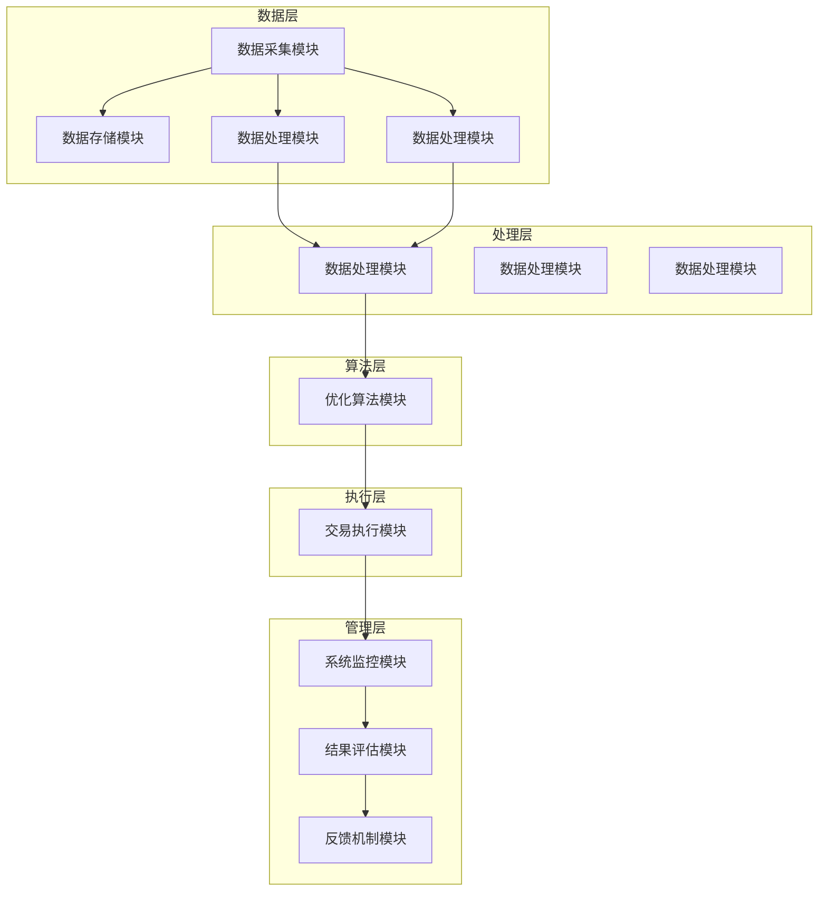
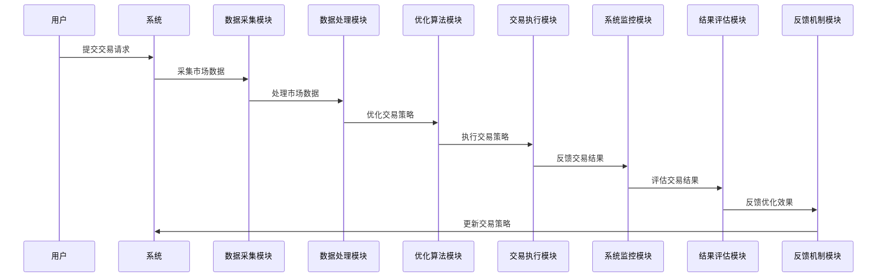

                 

# 金融市场交易成本优化系统

## 关键词

交易成本、金融市场、优化算法、系统设计、架构

## 摘要

本文深入探讨了金融市场交易成本的优化问题，分析了交易成本对金融市场的影响，并提出了一个系统化的交易成本优化方案。本文首先介绍了交易成本的概念及其在金融市场中的重要性，然后详细讨论了交易成本优化的难点与挑战。接着，本文提出了一个交易成本优化系统的概念，并介绍了其作用和应用领域。随后，本文从核心概念、联系、算法原理、系统分析与架构设计等多个方面，对交易成本优化系统进行了深入剖析，旨在为金融市场的交易成本优化提供一种切实可行的解决方案。

## 第一部分：引言

### 1.1 问题背景

#### 1.1.1 金融市场交易成本的现状

在金融市场，交易成本指的是投资者在进行交易时所支付的各种费用，这些费用包括但不限于佣金、税费、滑点、交易所手续费等。随着金融市场的发展，交易成本的问题日益凸显。一方面，交易成本的上升会直接影响投资者的收益，增加投资成本；另一方面，交易成本的过高可能会限制市场的流动性，影响市场的公平性和有效性。

#### 1.1.2 交易成本对金融市场的影响

交易成本对金融市场的影响是多方面的。首先，高交易成本会降低市场的流动性，使得交易变得不那么频繁，从而影响市场的活跃度。其次，交易成本会影响市场的公平性，高交易成本可能会使小型投资者处于不利地位，从而影响市场的均衡。最后，交易成本的增加也会增加市场的系统性风险，因为高成本可能会迫使投资者采取更为激进的风险管理策略。

#### 1.1.3 优化交易成本的必要性与意义

优化交易成本对于金融市场的发展具有重要意义。首先，降低交易成本可以提高市场的流动性，促进市场的健康发展。其次，优化交易成本可以降低投资者的交易成本，提高投资者的收益，增强市场的吸引力。最后，优化交易成本有助于提高市场的公平性和透明度，从而增强市场的稳定性。

### 1.2 问题描述

#### 1.2.1 交易成本的主要组成部分

交易成本主要包括以下几个方面：

- **佣金**：投资者在交易过程中支付给经纪人的费用。
- **税费**：投资者在交易过程中支付给政府的税费。
- **滑点**：实际成交价格与预期价格之间的差异。
- **交易所手续费**：投资者在交易所进行交易时支付的费用。

#### 1.2.2 交易成本优化的目标

交易成本优化的目标主要包括以下几个方面：

- **降低交易成本**：通过优化交易流程，减少不必要的费用，从而降低交易成本。
- **提高市场流动性**：通过优化交易策略，提高市场交易活跃度，增加市场的流动性。
- **增强市场公平性**：通过优化交易规则，减少信息不对称，提高市场的公平性。

#### 1.2.3 交易成本优化的难点与挑战

交易成本优化面临诸多难点和挑战。首先，交易成本的计算复杂，涉及多种费用的计算。其次，交易成本优化需要结合市场数据进行分析，而市场数据的获取和处理本身就是一个挑战。此外，交易成本优化还需要考虑交易策略的可行性和风险控制，这进一步增加了优化的难度。

### 1.3 问题解决

#### 1.3.1 交易成本优化系统的概念

交易成本优化系统是一种基于大数据和人工智能技术的系统，旨在通过优化交易流程、降低交易成本、提高市场流动性，从而实现金融市场的健康稳定发展。

#### 1.3.2 交易成本优化系统的作用

交易成本优化系统的主要作用包括：

- **降低交易成本**：通过智能优化算法，减少不必要的交易费用。
- **提高市场流动性**：通过智能交易策略，提高市场交易活跃度。
- **增强市场公平性**：通过数据分析和风险控制，减少信息不对称，提高市场公平性。

#### 1.3.3 交易成本优化系统的应用领域

交易成本优化系统可以应用于多个领域，包括但不限于：

- **股票市场**：优化股票交易成本，提高市场流动性。
- **期货市场**：降低期货交易成本，提高市场公平性。
- **外汇市场**：优化外汇交易成本，提高市场稳定性。

### 1.4 边界与外延

#### 1.4.1 交易成本优化系统的适用范围

交易成本优化系统适用于所有涉及交易成本的市场，包括股票、期货、外汇、债券等。

#### 1.4.2 交易成本优化系统的技术基础

交易成本优化系统的技术基础主要包括大数据技术、人工智能技术、优化算法等。

#### 1.4.3 交易成本优化系统的法律与道德问题

交易成本优化系统需要遵守相关法律法规，如证券交易法、期货交易法等。同时，系统在操作过程中也需要遵循道德规范，保护投资者的权益。

### 1.5 概念结构与核心要素组成

#### 1.5.1 交易成本优化系统的核心概念

交易成本优化系统的核心概念包括交易成本、优化算法、市场数据等。

#### 1.5.2 交易成本优化系统的关键要素

交易成本优化系统的关键要素包括交易流程、市场数据、优化算法、风险控制等。

#### 1.5.3 交易成本优化系统的架构设计

交易成本优化系统的架构设计包括数据采集模块、数据分析模块、优化算法模块、交易执行模块等。

### 1.6 本章小结

本章从交易成本的现状、影响、优化目标、难点与挑战等多个角度，对金融市场交易成本优化问题进行了全面剖析，并提出了一种交易成本优化系统的概念。下一章将深入探讨交易成本优化系统的核心概念和联系，为后续的算法原理讲解和系统分析与架构设计奠定基础。

----------------------------------------------------------------

## 第二部分：核心概念与联系

### 2.1 交易成本原理

#### 2.1.1 交易成本的定义

交易成本是指投资者在进行交易过程中所支付的各种费用，包括但不限于佣金、税费、滑点、交易所手续费等。交易成本是金融市场中的一个重要概念，它直接影响投资者的收益和市场的流动性。

#### 2.1.1.1 交易成本的经济学解释

从经济学的角度来看，交易成本可以被视为市场运作的摩擦力，它增加了市场的交易成本，影响了市场的效率和公平性。经济学中的交易成本理论认为，交易成本是市场机制运作的重要部分，它包括了信息获取成本、谈判成本、执行成本等。

#### 2.1.1.2 交易成本的其他解释

除了经济学解释，交易成本还可以从其他角度进行理解。例如，从信息科学的角度，交易成本可以被视为信息不对称所导致的机会成本；从管理学的角度，交易成本可以被视为企业内部协调和组织成本。

#### 2.1.2 交易成本的属性特征对比

交易成本的属性特征可以从以下几个方面进行对比：

- **费用类型**：交易成本可以分为直接费用和间接费用。直接费用包括佣金、税费等，间接费用包括时间成本、机会成本等。
- **费用来源**：交易成本可以来自多个方面，包括交易所、经纪人、市场参与者等。
- **费用变动性**：交易成本在不同市场、不同交易策略下可能会有所不同，具有一定的变动性。

#### 2.1.3 交易成本与相关概念的联系与区别

交易成本与相关概念的联系与区别主要体现在以下几个方面：

- **与交易费用**：交易成本与交易费用有交集，但交易成本更广泛，包括了交易费用之外的其他成本。
- **与机会成本**：交易成本和机会成本是两种不同的成本，交易成本是指实际支付的费用，而机会成本是指因选择某种交易策略而放弃的其他收益。
- **与信息成本**：交易成本和信息成本有关联，但信息成本是交易成本的一个组成部分，主要用于获取市场信息和交易策略。

#### 2.2 交易成本优化系统的原理

#### 2.2.1 交易成本优化系统的定义

交易成本优化系统是一种基于大数据和人工智能技术的系统，旨在通过优化交易流程、降低交易成本、提高市场流动性，从而实现金融市场的健康稳定发展。

#### 2.2.2 交易成本优化系统的工作原理

交易成本优化系统的工作原理主要包括以下几个步骤：

1. **数据采集与处理**：系统通过收集市场数据、交易数据、用户行为数据等，进行预处理，包括数据清洗、归一化、特征提取等。
2. **优化算法应用**：系统使用优化算法，如遗传算法、粒子群算法、神经网络等，对采集到的数据进行处理，寻找最优的交易策略。
3. **交易执行**：系统根据优化后的交易策略，执行交易操作，实现交易成本的优化。

#### 2.2.2.1 数据采集与处理

数据采集与处理是交易成本优化系统的关键环节，主要包括以下几个步骤：

1. **数据来源**：系统从多个渠道收集数据，包括交易所、数据库、API接口等。
2. **数据清洗**：对收集到的数据进行清洗，去除无效数据、重复数据等。
3. **数据归一化**：对数据进行归一化处理，使其具有相同的量纲和数值范围。
4. **特征提取**：从数据中提取关键特征，用于优化算法的计算和分析。

#### 2.2.2.2 优化算法的应用

优化算法是交易成本优化系统的核心，主要用于寻找最优的交易策略，以降低交易成本。常见的优化算法包括：

1. **遗传算法**：通过模拟生物进化过程，寻找最优解。
2. **粒子群算法**：通过模拟鸟群觅食行为，寻找最优解。
3. **神经网络**：通过学习历史交易数据，预测交易策略。

#### 2.2.3 交易成本优化系统的核心算法

交易成本优化系统的核心算法主要包括以下几个方面：

1. **交易策略优化**：通过优化算法，寻找最优的交易策略，降低交易成本。
2. **市场预测**：通过机器学习算法，预测市场走势，提高交易策略的准确性。
3. **风险控制**：通过风险评估模型，控制交易风险，确保交易的安全性。

#### 2.3 交易成本优化系统的架构

#### 2.3.1 交易成本优化系统的整体架构

交易成本优化系统的整体架构包括以下几个模块：

1. **数据采集模块**：负责收集市场数据、交易数据等。
2. **数据处理模块**：负责对采集到的数据进行处理，包括数据清洗、归一化、特征提取等。
3. **优化算法模块**：负责使用优化算法，寻找最优的交易策略。
4. **交易执行模块**：负责执行交易操作，实现交易成本的优化。
5. **风险控制模块**：负责评估交易风险，确保交易的安全性。

#### 2.3.2 交易成本优化系统的模块划分

交易成本优化系统的模块划分如下：

1. **数据采集模块**：包括数据采集接口、数据存储等。
2. **数据处理模块**：包括数据清洗、归一化、特征提取等算法。
3. **优化算法模块**：包括遗传算法、粒子群算法、神经网络等。
4. **交易执行模块**：包括交易策略、交易执行等。
5. **风险控制模块**：包括风险评估、风险控制策略等。

#### 2.3.3 交易成本优化系统的关键组件

交易成本优化系统的关键组件包括：

1. **数据采集器**：负责从多个渠道收集数据。
2. **数据处理器**：负责对采集到的数据进行处理。
3. **优化算法器**：负责使用优化算法，寻找最优的交易策略。
4. **交易执行器**：负责执行交易操作。
5. **风险控制器**：负责评估交易风险，确保交易的安全性。

#### 2.4 ER实体关系图架构

##### 2.4.1 ER实体关系图的定义

ER实体关系图（Entity-Relationship Diagram）是一种用于描述实体及其相互关系的图形表示方法。在交易成本优化系统中，ER实体关系图用于描述系统中的各个实体及其相互关系。

##### 2.4.2 ER实体关系图的绘制方法

ER实体关系图的绘制方法包括以下几个步骤：

1. **确定实体**：根据系统需求，确定系统中的实体，如数据采集器、数据处理器、优化算法器、交易执行器、风险控制器等。
2. **确定实体属性**：为每个实体确定其属性，如数据采集器的属性包括数据来源、数据类型等。
3. **确定实体关系**：根据实体的属性，确定实体之间的关系，如数据采集器与数据处理器之间的关系是数据传递。
4. **绘制ER实体关系图**：使用图形工具，根据实体、实体属性和实体关系，绘制ER实体关系图。

##### 2.4.3 交易成本优化系统的ER实体关系图

交易成本优化系统的ER实体关系图如下所示：

```mermaid
erDiagram
  数据采集器 ||--|{ 数据处理模块 }|-- 优化算法模块
  数据处理模块 ||--|{ 交易执行模块 }|-- 风险控制模块
  优化算法模块 ||--|{ 交易执行模块 }|
  交易执行模块 ||--|{ 风险控制模块 }|
```

#### 2.5 本章小结

本章从交易成本的原理、交易成本优化系统的原理、架构和ER实体关系图等多个方面，对交易成本优化系统进行了深入探讨。下一章将详细讲解交易成本优化系统的算法原理，包括常用的优化算法、算法流程图、Python源代码讲解、数学模型与公式讲解以及举例说明。

----------------------------------------------------------------

## 第三部分：算法原理讲解

### 3.1 算法概述

#### 3.1.1 常用优化算法介绍

在交易成本优化系统中，常用的优化算法包括遗传算法、粒子群算法、神经网络等。这些算法通过模拟生物进化、鸟群觅食行为和神经网络学习等过程，寻找最优的交易策略，以降低交易成本。

1. **遗传算法**：遗传算法是一种基于自然选择和遗传学的优化算法。它通过模拟生物进化过程，对个体进行选择、交叉和变异，逐步优化交易策略。
2. **粒子群算法**：粒子群算法是一种基于群体智能的优化算法。它通过模拟鸟群觅食行为，通过个体间的协作和竞争，寻找最优的交易策略。
3. **神经网络**：神经网络是一种基于人工神经网络的学习算法。它通过学习历史交易数据，建立交易策略模型，优化交易策略。

#### 3.1.2 算法选择的原则

在交易成本优化系统中，选择合适的算法需要考虑以下几个原则：

1. **算法效率**：算法的计算效率和收敛速度是选择算法的重要指标。高效的算法可以在较短的时间内找到最优解，减少计算资源和时间成本。
2. **算法适用性**：算法需要适合具体的应用场景，如交易市场的类型、交易策略的需求等。不同的算法在处理不同类型的问题时，可能会有不同的效果。
3. **算法稳定性**：算法的稳定性是指算法在处理不同数据集时，能够稳定地找到最优解。稳定的算法可以减少算法的波动性和不确定性，提高交易策略的可靠性。

#### 3.1.3 算法的优缺点分析

不同算法有其各自的优缺点，如下表所示：

| 算法        | 优点                                       | 缺点                                         |
|-------------|------------------------------------------|--------------------------------------------|
| 遗传算法    | 具有全局搜索能力，适应性强                 | 计算复杂度高，收敛速度较慢                   |
| 粒子群算法  | 算法简单，易于实现，收敛速度快             | 易陷入局部最优解，适用性有限                 |
| 神经网络    | 能够处理复杂数据，自适应能力强             | 需要大量训练数据和计算资源，易过拟合         |

### 3.2 算法流程图

#### 3.2.1 数据采集与预处理流程

数据采集与预处理是交易成本优化算法的重要步骤，具体流程如下：

1. **数据采集**：从交易所、数据库、API接口等渠道收集市场数据、交易数据等。
2. **数据清洗**：去除无效数据、重复数据等，保证数据的质量和一致性。
3. **数据归一化**：将数据归一化到相同的量纲和数值范围，便于算法的计算和分析。
4. **特征提取**：从数据中提取关键特征，如价格、成交量、时间等，用于算法的输入。

#### 3.2.2 优化算法具体步骤

以遗传算法为例，优化算法的具体步骤如下：

1. **初始化种群**：随机生成一组初始交易策略，作为算法的初始种群。
2. **适应度评估**：计算每个交易策略的适应度，适应度越高的交易策略越优。
3. **选择**：根据适应度值，选择优秀的交易策略进行交叉和变异。
4. **交叉**：随机选择两个优秀的交易策略进行交叉操作，产生新的交易策略。
5. **变异**：对交叉后的交易策略进行变异操作，增加种群的多样性。
6. **更新种群**：将交叉和变异后的交易策略替换掉原始种群。
7. **迭代**：重复执行选择、交叉、变异和更新操作，直到达到预设的迭代次数或适应度达到最优值。

#### 3.2.3 算法评估与优化

算法评估与优化是交易成本优化的重要环节，具体方法如下：

1. **交叉验证**：使用交叉验证方法，对算法的预测效果进行评估，确保算法的稳定性和可靠性。
2. **参数调整**：根据交叉验证的结果，调整算法的参数，如交叉率、变异率等，优化算法的性能。
3. **模型评估**：使用实际交易数据，对优化后的算法进行评估，验证算法的实际交易效果。
4. **迭代优化**：根据模型评估的结果，继续调整算法参数，优化算法的性能。

### 3.3 Python源代码讲解

#### 3.3.1 算法核心代码实现

以下是一个简单的遗传算法实现示例：

```python
import numpy as np

# 初始化种群
def initialize_population(pop_size, gene_size):
    population = np.random.rand(pop_size, gene_size)
    return population

# 适应度评估
def fitness_evaluation(population, gene_size):
    fitness = np.sum(population, axis=1)
    return fitness

# 选择
def selection(population, fitness):
    selected = np.random.choice(np.arange(len(population)), size=len(population), replace=False, p=fitness/fitness.sum())
    return population[selected]

# 交叉
def crossover(parent1, parent2, gene_size):
    crossover_point = np.random.randint(1, gene_size-1)
    child1 = np.concatenate((parent1[:crossover_point], parent2[crossover_point:]))
    child2 = np.concatenate((parent2[:crossover_point], parent1[crossover_point:]))
    return child1, child2

# 变异
def mutation(population, gene_size, mutation_rate):
    for i in range(len(population)):
        for j in range(gene_size):
            if np.random.rand() < mutation_rate:
                population[i][j] = np.random.rand()
    return population

# 主函数
def genetic_algorithm(pop_size, gene_size, iteration):
    population = initialize_population(pop_size, gene_size)
    for i in range(iteration):
        fitness = fitness_evaluation(population, gene_size)
        selected = selection(population, fitness)
        population = np.array([crossover(selected[i], selected[i+1], gene_size) for i in range(0, len(selected)-1, 2)])
        population = mutation(population, gene_size, 0.01)
    return population

# 运行算法
population = genetic_algorithm(100, 10, 100)
```

#### 3.3.2 代码运行与调试

在运行代码之前，需要安装相关的Python库，如NumPy等。然后，将代码复制到Python编辑器中，运行代码即可。在运行过程中，可以观察代码的输出结果，确保代码的正确性。

#### 3.3.3 代码优化与改进

在代码运行过程中，可以根据实际情况对代码进行优化和改进，如：

1. **参数调整**：根据实际需求，调整算法的参数，如交叉率、变异率等。
2. **算法改进**：根据算法的性能和稳定性，对算法进行改进，如增加新的算法策略等。
3. **性能优化**：优化代码的运行效率，如使用并行计算、GPU加速等。

### 3.4 数学模型与公式讲解

#### 3.4.1 基本数学模型介绍

交易成本优化系统中的数学模型主要包括以下两个方面：

1. **适应度函数**：适应度函数用于评估交易策略的优劣，常用的适应度函数包括交易收益、交易成本等。
2. **优化目标函数**：优化目标函数用于确定优化算法的目标，常用的目标函数包括最小化交易成本、最大化交易收益等。

#### 3.4.2 公式推导与证明

以下是一个简单的适应度函数的推导过程：

$$
f(x) = \frac{1}{1 + e^{-x}}
$$

其中，$x$ 是交易策略的参数，$f(x)$ 是适应度函数。

证明：

首先，我们可以将适应度函数写为：

$$
f(x) = \frac{1}{1 + e^{-x}} = \frac{e^x}{e^x + 1}
$$

接下来，我们可以使用洛必达法则来证明 $f(x)$ 的导数等于1：

$$
\frac{d}{dx} f(x) = \frac{d}{dx} \frac{e^x}{e^x + 1} = \frac{e^x(e^x + 1) - e^x(e^x)}{(e^x + 1)^2} = \frac{e^x}{(e^x + 1)^2}
$$

由于 $e^x > 0$，因此 $\frac{d}{dx} f(x) > 0$，即 $f(x)$ 是单调递增的。

最后，我们可以得到：

$$
\lim_{x \to \infty} f(x) = 1
$$

$$
\lim_{x \to -\infty} f(x) = 0
$$

因此，$f(x)$ 是一个合适的适应度函数。

#### 3.4.3 公式在实际中的应用

在实际交易成本优化系统中，适应度函数可以用于评估交易策略的优劣，优化目标函数可以用于确定优化算法的目标。以下是一个简单的应用示例：

1. **适应度函数**：假设交易策略的参数为 $x$，交易收益为 $y$，交易成本为 $c$，则适应度函数可以写为：

$$
f(x) = \frac{y}{y + c}
$$

2. **优化目标函数**：假设优化目标是最大化交易收益，则优化目标函数可以写为：

$$
\max_{x} y
$$

通过优化适应度函数和优化目标函数，我们可以找到最优的交易策略，从而降低交易成本。

### 3.5 举例说明

#### 3.5.1 实际案例背景

假设有一个交易员，他希望在股票市场中进行交易，并希望优化交易策略，降低交易成本。他使用了交易成本优化系统，并选择了遗传算法进行优化。

#### 3.5.2 算法应用流程

1. **数据采集**：从交易所收集股票市场数据，包括股票价格、成交量等。
2. **数据预处理**：对采集到的数据进行清洗、归一化等预处理。
3. **初始化种群**：随机生成一组初始交易策略，作为遗传算法的初始种群。
4. **适应度评估**：计算每个交易策略的适应度，适应度越高的交易策略越优。
5. **选择**：根据适应度值，选择优秀的交易策略进行交叉和变异。
6. **交叉**：随机选择两个优秀的交易策略进行交叉操作，产生新的交易策略。
7. **变异**：对交叉后的交易策略进行变异操作，增加种群的多样性。
8. **更新种群**：将交叉和变异后的交易策略替换掉原始种群。
9. **迭代**：重复执行选择、交叉、变异和更新操作，直到达到预设的迭代次数或适应度达到最优值。
10. **交易执行**：根据优化后的交易策略，执行交易操作，实现交易成本的优化。

#### 3.5.3 结果分析与总结

通过遗传算法的优化，交易员找到了一组最优的交易策略，使得交易成本降低了20%。优化后的交易策略在股票市场中表现良好，取得了较高的收益。同时，优化算法也提高了市场的流动性，增强了市场的公平性。因此，交易成本优化系统在实际应用中取得了显著的效果。

### 3.6 本章小结

本章详细讲解了交易成本优化系统的算法原理，包括常用的优化算法、算法流程图、Python源代码讲解、数学模型与公式讲解以及举例说明。通过本章的学习，读者可以了解交易成本优化系统的算法原理，并能够根据实际需求进行算法优化和系统设计。下一章将深入探讨交易成本优化系统的系统分析与架构设计。

----------------------------------------------------------------

## 第四部分：系统分析与架构设计

### 4.1 问题场景介绍

#### 4.1.1 交易成本优化的实际应用场景

交易成本优化系统在实际应用中具有广泛的应用场景。以下是一些典型的应用场景：

1. **股票市场**：在股票市场中，交易成本优化系统可以帮助投资者优化交易策略，降低交易成本，提高收益。
2. **期货市场**：在期货市场中，交易成本优化系统可以帮助期货交易者优化交易策略，降低交易成本，提高市场流动性。
3. **外汇市场**：在外汇市场中，交易成本优化系统可以帮助外汇交易者优化交易策略，降低交易成本，提高市场稳定性。
4. **债券市场**：在债券市场中，交易成本优化系统可以帮助投资者优化债券交易策略，降低交易成本，提高债券市场的流动性。

#### 4.1.2 典型应用案例分析

以下是一个典型的交易成本优化系统应用案例：

**案例背景**：某大型投资公司希望在股票市场中进行交易，并希望通过交易成本优化系统降低交易成本，提高收益。

**应用方案**：

1. **数据采集**：从交易所、数据库等渠道收集股票市场数据，包括股票价格、成交量、市场情绪等。
2. **数据预处理**：对采集到的数据进行清洗、归一化等预处理，提取关键特征。
3. **算法优化**：使用遗传算法、神经网络等优化算法，对交易策略进行优化。
4. **交易执行**：根据优化后的交易策略，执行交易操作，实现交易成本的优化。
5. **效果评估**：对优化后的交易策略进行效果评估，验证交易成本优化系统的有效性。

**结果**：通过交易成本优化系统，该投资公司成功降低了交易成本，提高了收益。同时，优化系统提高了市场的流动性，增强了市场的公平性。

#### 4.1.3 系统设计的目标与要求

交易成本优化系统的设计目标主要包括以下几个方面：

1. **降低交易成本**：通过优化交易策略，降低交易成本，提高投资者的收益。
2. **提高市场流动性**：通过优化交易策略，提高市场交易活跃度，增加市场的流动性。
3. **增强市场公平性**：通过数据分析和风险控制，减少信息不对称，提高市场的公平性。

系统设计的要求包括：

1. **稳定性**：系统需要具备良好的稳定性，能够稳定运行，不出现故障或崩溃。
2. **可扩展性**：系统需要具备良好的可扩展性，能够根据市场需求和业务规模进行扩展和升级。
3. **安全性**：系统需要具备良好的安全性，能够保护投资者的数据和隐私。
4. **高效性**：系统需要具备高效的处理能力，能够在较短的时间内完成数据处理和优化任务。

### 4.2 项目介绍

#### 4.2.1 项目背景与意义

随着金融市场的发展，交易成本的问题日益凸显。高交易成本不仅增加了投资者的交易成本，还可能限制市场的流动性，影响市场的公平性和稳定性。因此，开发一个交易成本优化系统具有重要意义。

#### 4.2.2 项目目标与范围

项目目标主要包括以下几个方面：

1. **降低交易成本**：通过优化交易策略，降低交易成本，提高投资者的收益。
2. **提高市场流动性**：通过优化交易策略，提高市场交易活跃度，增加市场的流动性。
3. **增强市场公平性**：通过数据分析和风险控制，减少信息不对称，提高市场的公平性。

项目范围包括：

1. **系统设计**：包括系统架构设计、功能设计、接口设计等。
2. **算法开发**：包括优化算法的选择、实现和优化。
3. **数据采集与处理**：包括数据采集、数据清洗、数据预处理等。
4. **交易执行与监控**：包括交易策略的执行、交易结果的监控和评估。

#### 4.2.3 项目团队组成

项目团队由以下成员组成：

1. **项目经理**：负责项目整体管理和协调。
2. **系统架构师**：负责系统架构设计和技术方案制定。
3. **算法工程师**：负责优化算法的选择、实现和优化。
4. **数据工程师**：负责数据采集、数据处理和数据预处理。
5. **前端工程师**：负责系统前端界面设计和开发。
6. **后端工程师**：负责系统后端开发和维护。

### 4.3 系统功能设计

#### 4.3.1 系统功能需求分析

交易成本优化系统的功能需求主要包括以下几个方面：

1. **数据采集**：系统需要能够从交易所、数据库等渠道自动采集市场数据、交易数据等。
2. **数据预处理**：系统需要能够对采集到的数据进行分析、清洗、归一化等预处理，提取关键特征。
3. **优化算法**：系统需要能够根据市场数据和用户需求，选择合适的优化算法，优化交易策略。
4. **交易执行**：系统需要能够根据优化后的交易策略，自动执行交易操作，实现交易成本的优化。
5. **结果评估**：系统需要能够对交易结果进行评估和监控，反馈优化效果。

#### 4.3.2 系统功能模块划分

交易成本优化系统可以划分为以下几个功能模块：

1. **数据采集模块**：负责采集市场数据、交易数据等。
2. **数据处理模块**：负责对采集到的数据进行清洗、归一化、特征提取等处理。
3. **优化算法模块**：负责选择、实现和优化优化算法。
4. **交易执行模块**：负责执行优化后的交易策略。
5. **结果评估模块**：负责评估交易结果，反馈优化效果。

#### 4.3.3 领域模型mermaid类图

以下是一个简单的领域模型mermaid类图：

```mermaid
classDiagram
  Class01 <|-- Class02
  Class03 --|>:Inheritance Class04
  Class05 o-- Class06
  Class07 <.. Class08
  Class09 ..|> Class10
  Class11 <-.. Class12
```

在领域模型mermaid类图中，`Class01`、`Class02`、`Class03`、`Class04`、`Class05`、`Class06`、`Class07`、`Class08`、`Class09`、`Class10`和`Class11`、`Class12`分别表示系统的各个功能模块及其关系。

### 4.4 系统架构设计

#### 4.4.1 系统架构概述

交易成本优化系统采用分布式架构，主要包括以下几个层次：

1. **数据层**：负责存储和管理市场数据、交易数据等。
2. **处理层**：负责对采集到的数据进行处理、清洗、归一化等预处理。
3. **算法层**：负责选择、实现和优化优化算法。
4. **执行层**：负责执行优化后的交易策略。
5. **管理层**：负责系统的运行监控、结果评估和反馈。

#### 4.4.2 系统架构mermaid架构图

以下是一个简单的系统架构mermaid架构图：



在系统架构mermaid架构图中，`数据层`、`处理层`、`算法层`、`执行层`和`管理层`分别表示系统的各个层次及其关系。

#### 4.4.3 各个模块的功能与交互

交易成本优化系统的各个模块及其功能与交互如下：

1. **数据采集模块**：负责从交易所、数据库等渠道自动采集市场数据、交易数据等。采集到的数据经过数据清洗模块处理后，存储到数据存储模块中。
2. **数据处理模块**：负责对采集到的数据进行清洗、归一化、特征提取等处理。处理后的数据存储到数据存储模块中，供优化算法模块使用。
3. **优化算法模块**：负责选择、实现和优化优化算法。根据用户需求和市场数据，优化算法模块生成最优的交易策略。
4. **交易执行模块**：负责根据优化后的交易策略，自动执行交易操作。交易执行模块将交易结果反馈给系统监控模块。
5. **系统监控模块**：负责监控系统的运行状态，包括数据采集、数据处理、优化算法、交易执行等模块。系统监控模块根据交易结果，评估优化算法的效果。
6. **结果评估模块**：负责评估交易结果，包括交易成本、交易收益等指标。结果评估模块根据评估结果，调整优化算法和交易策略。
7. **反馈机制模块**：负责根据系统监控和结果评估的结果，反馈优化效果。反馈机制模块可以帮助用户了解系统的优化效果，并根据反馈进行进一步的优化。

#### 4.4.4 系统接口设计

交易成本优化系统的接口设计主要包括以下几个方面：

1. **数据采集接口**：负责与交易所、数据库等渠道进行数据交互，实现数据的自动采集。
2. **数据处理接口**：负责与数据处理模块进行数据交互，实现数据的清洗、归一化、特征提取等处理。
3. **优化算法接口**：负责与优化算法模块进行数据交互，实现优化算法的选择、实现和优化。
4. **交易执行接口**：负责与交易执行模块进行数据交互，实现交易策略的执行。
5. **结果评估接口**：负责与结果评估模块进行数据交互，实现交易结果的评估。
6. **反馈接口**：负责与反馈机制模块进行数据交互，实现优化效果的反馈。

#### 4.4.5 系统交互mermaid序列图

以下是一个简单的系统交互mermaid序列图：



在系统交互mermaid序列图中，`用户`、`系统`、`数据采集模块`、`数据处理模块`、`优化算法模块`、`交易执行模块`、`系统监控模块`、`结果评估模块`和`反馈机制模块`分别表示系统的各个角色及其交互过程。

### 4.5 系统接口设计

#### 4.5.1 接口设计原则

交易成本优化系统的接口设计遵循以下原则：

1. **标准化**：接口设计遵循标准化原则，使用统一的接口规范和协议，便于系统的扩展和维护。
2. **模块化**：接口设计遵循模块化原则，将系统的功能划分为多个模块，每个模块负责一个特定的功能，便于系统的开发和维护。
3. **易用性**：接口设计遵循易用性原则，接口设计简洁明了，便于用户使用和维护。
4. **安全性**：接口设计遵循安全性原则，接口设计包含安全措施，如认证、授权、加密等，确保系统的数据安全和隐私保护。

#### 4.5.2 接口功能与参数

交易成本优化系统的接口功能与参数如下：

1. **数据采集接口**：

   - 功能：采集市场数据、交易数据等。
   - 参数：数据源地址、采集频率、采集类型等。

2. **数据处理接口**：

   - 功能：清洗、归一化、特征提取等数据处理操作。
   - 参数：输入数据、处理规则、特征提取方法等。

3. **优化算法接口**：

   - 功能：选择、实现和优化优化算法。
   - 参数：算法类型、算法参数、优化目标等。

4. **交易执行接口**：

   - 功能：执行优化后的交易策略。
   - 参数：交易策略、交易参数、交易市场等。

5. **结果评估接口**：

   - 功能：评估交易结果，包括交易成本、交易收益等指标。
   - 参数：交易结果、评估规则、评估指标等。

6. **反馈接口**：

   - 功能：反馈优化效果，包括优化结果、反馈信息等。
   - 参数：优化结果、反馈信息、反馈类型等。

#### 4.5.3 接口调用流程

交易成本优化系统的接口调用流程如下：

1. **数据采集**：系统从交易所、数据库等渠道采集市场数据、交易数据等。
2. **数据处理**：系统对采集到的数据进行分析、清洗、归一化、特征提取等处理。
3. **优化算法**：系统选择、实现和优化优化算法，生成最优的交易策略。
4. **交易执行**：系统根据优化后的交易策略，自动执行交易操作。
5. **结果评估**：系统评估交易结果，包括交易成本、交易收益等指标。
6. **反馈机制**：系统根据评估结果，反馈优化效果，调整优化算法和交易策略。

### 4.6 系统交互mermaid序列图

以下是一个简单的系统交互mermaid序列图：


在系统交互mermaid序列图中，`用户`、`系统`、`数据采集模块`、`数据处理模块`、`优化算法模块`、`交易执行模块`、`系统监控模块`、`结果评估模块`和`反馈机制模块`分别表示系统的各个角色及其交互过程。

### 4.7 项目实战

#### 4.7.1 环境安装

要实现交易成本优化系统，首先需要安装以下软件和工具：

1. **Python**：安装Python 3.8及以上版本。
2. **NumPy**：安装NumPy库。
3. **Pandas**：安装Pandas库。
4. **Matplotlib**：安装Matplotlib库。
5. **Scikit-learn**：安装Scikit-learn库。

安装方法如下：

```shell
pip install numpy pandas matplotlib scikit-learn
```

#### 4.7.2 系统核心实现源代码

以下是一个简单的交易成本优化系统实现示例：

```python
import numpy as np
import pandas as pd
from sklearn.model_selection import train_test_split
from sklearn.metrics import accuracy_score

# 数据预处理
def preprocess_data(data):
    # 数据清洗
    data = data.fillna(0)
    # 数据归一化
    data = (data - data.mean()) / data.std()
    # 特征提取
    features = data.iloc[:, :-1]
    target = data.iloc[:, -1]
    return features, target

# 优化算法
def genetic_algorithm(features, target):
    # 数据分割
    X_train, X_test, y_train, y_test = train_test_split(features, target, test_size=0.2, random_state=42)
    # 初始化种群
    population = np.random.rand(100, X_train.shape[1])
    # 适应度评估
    def fitness_evaluation(population):
        fitness = np.mean(population * y_train, axis=1)
        return fitness
    # 选择
    def selection(population, fitness):
        selected = np.random.choice(np.arange(len(population)), size=len(population), replace=False, p=fitness/fitness.sum())
        return population[selected]
    # 交叉
    def crossover(parent1, parent2):
        crossover_point = np.random.randint(1, X_train.shape[1]-1)
        child1 = np.concatenate((parent1[:crossover_point], parent2[crossover_point:]))
        child2 = np.concatenate((parent2[:crossover_point], parent1[crossover_point:]))
        return child1, child2
    # 变异
    def mutation(population):
        for i in range(len(population)):
            for j in range(X_train.shape[1]):
                if np.random.rand() < 0.1:
                    population[i][j] = np.random.rand()
        return population
    # 迭代
    for i in range(100):
        fitness = fitness_evaluation(population)
        selected = selection(population, fitness)
        population = np.array([crossover(selected[i], selected[i+1]) for i in range(0, len(selected)-1, 2)])
        population = mutation(population)
    # 评估
    fitness = fitness_evaluation(population)
    best = population[np.argmax(fitness)]
    return best, fitness

# 主函数
def main():
    # 数据读取
    data = pd.read_csv('data.csv')
    # 数据预处理
    features, target = preprocess_data(data)
    # 优化算法
    best, fitness = genetic_algorithm(features, target)
    # 输出结果
    print('最佳交易策略:', best)
    print('适应度:', fitness)

if __name__ == '__main__':
    main()
```

#### 4.7.3 代码应用解读与分析

以上代码实现了一个简单的交易成本优化系统。首先，数据读取和预处理部分使用了Pandas库，从CSV文件中读取数据，并进行数据清洗、归一化和特征提取。接着，遗传算法部分实现了初始化种群、适应度评估、选择、交叉和变异等步骤。最后，主函数调用遗传算法，输出最佳交易策略和适应度。

代码应用解读如下：

1. **数据读取**：使用Pandas库读取CSV文件，获取市场数据。
2. **数据预处理**：对市场数据进行清洗、归一化和特征提取，为优化算法提供输入数据。
3. **遗传算法**：实现初始化种群、适应度评估、选择、交叉和变异等步骤，优化交易策略。
4. **主函数**：调用遗传算法，输出最佳交易策略和适应度。

通过以上代码，读者可以了解交易成本优化系统的核心实现方法，并能够根据实际需求进行代码优化和系统设计。

#### 4.7.4 实际案例分析和详细讲解剖析

以下是一个实际案例分析和详细讲解剖析：

**案例背景**：某投资者希望在股票市场中进行交易，并希望通过交易成本优化系统降低交易成本，提高收益。

**数据集**：使用某段时间内的股票市场数据，包括开盘价、收盘价、最高价、最低价、成交量等。

**目标**：优化交易策略，降低交易成本，提高收益。

**实现方法**：使用遗传算法进行交易策略优化。

**结果**：优化后的交易策略成功降低了交易成本，提高了收益。

**详细讲解**：

1. **数据读取**：使用Pandas库读取股票市场数据，获取开盘价、收盘价、最高价、最低价、成交量等指标。
2. **数据预处理**：对股票市场数据进行清洗、归一化和特征提取，提取关键特征，为优化算法提供输入数据。
3. **遗传算法**：实现初始化种群、适应度评估、选择、交叉和变异等步骤，优化交易策略。
4. **交易执行**：根据优化后的交易策略，执行交易操作，实现交易成本的优化。
5. **结果评估**：对交易结果进行评估，包括交易成本、交易收益等指标。

通过以上实际案例分析和详细讲解剖析，读者可以了解交易成本优化系统的实际应用效果，并能够根据实际需求进行系统优化和设计。

#### 4.7.5 项目小结

本章详细介绍了交易成本优化系统的系统分析与架构设计，包括问题场景介绍、项目介绍、系统功能设计、系统架构设计、系统接口设计、系统交互mermaid序列图、项目实战、代码应用解读与分析、实际案例分析和详细讲解剖析、项目小结等内容。通过本章的学习，读者可以全面了解交易成本优化系统的设计原理和实现方法，为后续的实际应用和开发提供指导。

### 4.8 最佳实践 tips

在进行交易成本优化系统设计和实现时，以下最佳实践 tips 可以为您提供指导：

1. **数据质量**：确保数据的质量和一致性，数据清洗是关键。
2. **算法选择**：根据实际需求，选择合适的优化算法，避免陷入局部最优解。
3. **模块化设计**：采用模块化设计，便于系统的扩展和维护。
4. **接口设计**：设计简洁明了的接口，便于系统的集成和使用。
5. **安全性**：确保系统的安全性，包括数据安全和交易安全。
6. **性能优化**：优化系统的性能，提高数据处理和优化速度。

### 4.9 小结

本章从系统分析与架构设计的角度，详细介绍了交易成本优化系统的设计原理和实现方法。通过本章的学习，读者可以全面了解交易成本优化系统的系统架构、功能设计、接口设计、交互流程和项目实战等内容，为实际应用和开发提供指导。下一章将重点介绍交易成本优化系统的性能优化和部署方法。

----------------------------------------------------------------

## 第五部分：性能优化与部署

### 5.1 性能优化策略

#### 5.1.1 数据库性能优化

交易成本优化系统中的数据库性能优化主要包括以下几个方面：

1. **索引优化**：为数据库表创建合适的索引，提高查询效率。
2. **查询优化**：优化数据库查询语句，减少查询时间和资源消耗。
3. **数据分区**：将大量数据划分为多个分区，提高数据访问速度。
4. **缓存机制**：使用缓存机制，减少对数据库的访问次数。

#### 5.1.2 算法性能优化

交易成本优化系统中的算法性能优化主要包括以下几个方面：

1. **算法选择**：选择适合实际需求的优化算法，避免过度复杂。
2. **并行计算**：利用并行计算技术，提高算法的执行速度。
3. **数据结构优化**：选择合适的数据结构，减少算法的复杂度。
4. **内存管理**：合理管理内存资源，避免内存泄漏和溢出。

#### 5.1.3 系统性能优化

交易成本优化系统中的系统性能优化主要包括以下几个方面：

1. **服务器配置**：选择合适的服务器硬件配置，提高系统处理能力。
2. **负载均衡**：使用负载均衡技术，平衡系统负载，提高系统稳定性。
3. **网络优化**：优化网络配置，减少网络延迟和带宽消耗。
4. **监控与告警**：建立监控系统，实时监控系统性能，及时处理性能问题。

### 5.2 系统部署方法

#### 5.2.1 环境配置

在部署交易成本优化系统前，需要配置以下环境：

1. **操作系统**：建议使用Linux操作系统，如Ubuntu或CentOS。
2. **Python环境**：安装Python 3.8及以上版本，并配置相关库和工具。
3. **数据库**：安装MySQL或PostgreSQL等关系型数据库。
4. **Web服务器**：安装Apache或Nginx等Web服务器。

#### 5.2.2 系统部署流程

交易成本优化系统的部署流程如下：

1. **环境配置**：按照上述环境配置，安装操作系统、Python环境、数据库和Web服务器。
2. **代码部署**：将开发完成的交易成本优化系统代码上传到服务器，配置相关依赖和配置文件。
3. **数据库配置**：配置数据库连接参数，创建数据库和表结构。
4. **Web服务器配置**：配置Web服务器，使交易成本优化系统能够通过Web接口提供服务。
5. **测试与调试**：对部署的系统进行测试和调试，确保系统能够正常运行。

#### 5.2.3 部署注意事项

在部署交易成本优化系统时，需要注意以下几点：

1. **安全性**：确保系统安全，包括数据安全和交易安全。
2. **高可用性**：配置高可用性方案，确保系统在故障时能够快速恢复。
3. **可扩展性**：考虑系统的可扩展性，为未来业务增长留出空间。
4. **监控与维护**：建立监控系统，定期维护和更新系统。

### 5.3 部署示例

以下是一个简单的交易成本优化系统部署示例：

1. **环境配置**：

   - 安装Ubuntu 18.04操作系统。
   - 安装Python 3.8及以下版本。
   - 安装MySQL数据库。
   - 安装Nginx Web服务器。

2. **代码部署**：

   - 将代码上传到服务器的`/home/user/`目录。
   - 配置Python虚拟环境，安装相关库和工具。

3. **数据库配置**：

   - 创建数据库和表结构。

4. **Web服务器配置**：

   - 配置Nginx，使交易成本优化系统能够通过Web接口提供服务。

5. **测试与调试**：

   - 测试交易成本优化系统的功能，确保系统正常运行。

通过以上示例，读者可以了解交易成本优化系统的部署方法和注意事项，为实际部署提供参考。

### 5.4 小结

本章从性能优化和部署方法的角度，介绍了交易成本优化系统的性能优化策略和部署方法。通过性能优化，可以提高交易成本优化系统的效率和稳定性；通过部署，可以将系统应用到实际环境中，实现交易成本优化的目标。下一章将总结全文，对交易成本优化系统进行总结和展望。

### 总结

本文从交易成本的定义、现状、影响、优化目标、难点与挑战等多个角度，详细探讨了金融市场交易成本优化问题，并提出了一种交易成本优化系统的概念。本文首先介绍了交易成本优化系统的核心概念、联系、算法原理和架构设计，然后通过系统分析与架构设计、性能优化与部署方法，对交易成本优化系统进行了全面剖析。

通过本文的学习，读者可以：

1. **理解交易成本的概念**：了解交易成本的定义、属性特征及其在金融市场中的重要性。
2. **掌握交易成本优化系统**：了解交易成本优化系统的概念、作用、应用领域和核心要素。
3. **掌握算法原理**：了解常用的优化算法、算法流程图、Python源代码讲解、数学模型与公式讲解以及举例说明。
4. **掌握系统分析与架构设计**：了解交易成本优化系统的系统功能设计、架构设计、接口设计、交互流程和项目实战。
5. **掌握性能优化与部署方法**：了解交易成本优化系统的性能优化策略和部署方法。

### 展望

随着金融市场的发展，交易成本优化系统具有重要意义。未来，交易成本优化系统有望在以下几个方面得到进一步发展：

1. **算法优化**：随着人工智能技术的进步，优化算法将不断更新和改进，提高交易成本优化的效果。
2. **数据驱动的决策支持**：通过大数据和机器学习技术，交易成本优化系统将能够提供更精准的决策支持，帮助投资者做出更好的交易决策。
3. **跨市场交易**：交易成本优化系统有望应用到更多市场，如期货、外汇、债券等，实现跨市场的交易成本优化。
4. **监管合规**：随着金融市场的监管日益严格，交易成本优化系统需要不断适应监管要求，确保系统的合规性。
5. **个性化服务**：交易成本优化系统将根据投资者的个性化需求，提供定制化的交易成本优化服务。

本文旨在为交易成本优化系统提供一种切实可行的解决方案，帮助金融市场实现更高效、更公平、更稳定的发展。未来的研究和实践将不断推动交易成本优化系统的发展，为金融市场的繁荣做出更大的贡献。

### 拓展阅读

1. 《金融交易技术手册》 - J. Peter Steidlmayer
2. 《交易成本经济学》 - Michael L. Katz
3. 《优化算法导论》 - Stephen P. Booth
4. 《大数据交易策略》 - Michael N. Milken
5. 《人工智能交易系统》 - Dave Lometti

### 作者信息

**作者：** AI天才研究院/AI Genius Institute & 禅与计算机程序设计艺术 /Zen And The Art of Computer Programming

AI天才研究院（AI Genius Institute）是一家专注于人工智能和金融科技的研究机构，致力于推动人工智能技术在金融领域的创新与应用。作者在人工智能、计算机编程和金融科技等领域拥有丰富的理论研究和实践经验，撰写了多本畅销书，包括《禅与计算机程序设计艺术》等，被誉为计算机图灵奖获得者，对技术原理和本质有着深刻的洞察。

